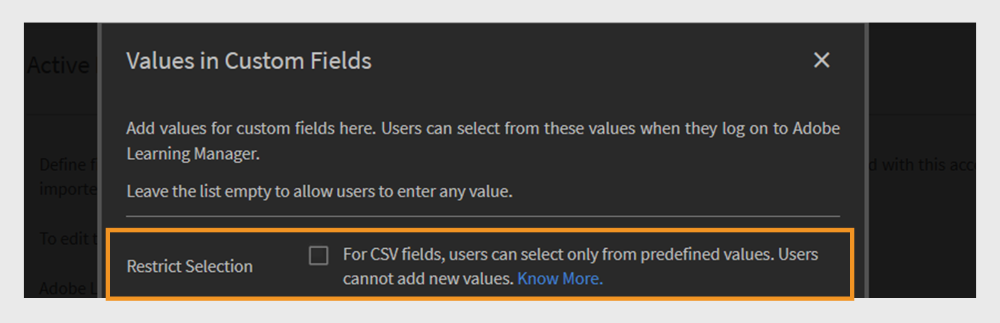

# Campi attivi

I campi attivi in Adobe Learning Manager sono attributi utente personalizzati che consentono agli amministratori di organizzare e gestire gli utenti in modo efficace. Consentono di acquisire informazioni aggiuntive sull&#39;utente, ad esempio reparto, posizione o qualifica. Gli Amministratori possono utilizzare questi dati per creare gruppi di utenti, personalizzare l’apprendimento e filtrare i report in modo più efficace.

Gli attributi utente sono informazioni quali il nome, il cognome e l’indirizzo e-mail di un utente. Questi attributi consentono agli amministratori di:

* Identificazione degli utenti
* Raggruppamento di utenti
* Gestire le autorizzazioni degli utenti e le restrizioni di accesso

Con l&#39;aggiunta di attributi personalizzati ai profili utente, i campi attivi acquisiscono ulteriori informazioni rilevanti per l&#39;organizzazione.

>[!INFO]
>
>Guarda questo corso di formazione sull&#39;Accademia ALM per scoprire come aggiungere, personalizzare e configurare campi attivi.  

## Aggiungi campi attivi

I campi attivi si applicano agli Allievi interni ed esterni, consentendo alle organizzazioni di definire e gestire attributi utente personalizzati per tutti gli utenti.

Per aggiungere o gestire i campi attivi per gli utenti interni:

1. Selezionare **Utenti** nella home page dell&#39;amministratore.

2. Seleziona **Campi attivi**.

3. Digita il nome del campo attivo, quindi seleziona **Aggiungi**. Il processo per aggiungere campi attivi per gli Allievi esterni è identico a quello per gli Allievi interni.

   
   _Campo per immettere il nome di un nuovo attributo personalizzato per gli utenti_

4. Seleziona **Salva**.

## Aggiungere valori personalizzati ai campi attivi

I campi attivi possono includere valori predefiniti o personalizzati che corrispondono alla struttura dell&#39;organizzazione. L&#39;aggiunta di valori personalizzati consente di acquisire i dettagli specifici degli utenti interni, ad esempio i nomi dei reparti, i livelli di mansione o gli uffici regionali.

Per aggiungere valori personalizzati per gli utenti interni:

1. Selezionare **Visualizza valori** nella sezione **Campo attivo**.
2. Nella finestra di dialogo **Valori nei campi personalizzati**:

   * Seleziona un campo attivo dal menu a discesa **Seleziona campo**.
   * Digitare i valori del campo attivo nel campo **Nuovo valore**.

   
   _Finestra di dialogo per l&#39;immissione di valori personalizzati per un campo attivo specifico_

3. Seleziona **Fine**, quindi seleziona **Salva** per applicare le modifiche.

## Configurare le impostazioni dei campi attivi

Personalizza i campi attivi per semplificare la gestione degli utenti e le attività di reporting e configura le proprietà dei campi attivi:

* **Raggruppabile**: questa opzione consente di raggruppare gli Allievi in base ai valori dei campi attivi.
* **Riportabile**: questa opzione consente di creare un gruppo di utenti di report in base al valore del campo attivo e abilita il filtro di reporting per il campo nei report del dashboard.
* **Configurabile dall’Allievo**: questa opzione consente agli Allievi di configurare autonomamente il campo.
* **Esportabile**: questa opzione include il campo attivo nei report dei gruppi di utenti esportati.
* **Multivalore**: questa opzione supporta più valori per il campo attivo.

Per configurare le impostazioni dei campi attivi:

1. Seleziona la scheda **Impostazioni** e passa alla sezione **Visualizzazione utente**.

   
   _Selezionare la scheda Impostazioni per personalizzare i campi attivi_

2. Seleziona una o entrambe le opzioni, in base alle esigenze.:

   * **Mostra solo campi non compilati all’accesso dell’Allievo:** se questa opzione è selezionata, gli Allievi vedranno solo i campi attivi che non hanno ancora compilato. In questo modo viene richiesto di completare il profilo, garantendo che i dati utente siano accurati e aggiornati. La visualizzazione di questi campi supporta profili di Allievo completi e consente esperienze di apprendimento personalizzate.
   * **Se deselezionata, la pagina &quot;Completa il tuo profilo&quot; non viene visualizzata agli utenti:** Quando questa opzione è disattivata, gli Allievi non visualizzeranno la pagina **Completa il tuo profilo** al momento dell&#39;accesso. Non verrà richiesto di aggiornare o compilare alcuna informazione di profilo e possono accedere direttamente alla piattaforma.

   
   _Interfaccia delle impostazioni per controllare la modalità e la tempistica di visualizzazione dei campi attivi_

3. Seleziona **Salva** per applicare le modifiche.

## Campi attivi multivalore

I campi attivi multivalore consentono di assegnare più valori a un singolo attributo utente, ad esempio posizioni, qualifiche o team di progetto. In questo modo è possibile acquisire informazioni utente più dettagliate e flessibili.

Puoi configurare fino a tre campi attivi multivalore per account. Sono disponibili per utenti interni ed esterni. Dopo aver impostato un campo come multivalore, questa impostazione non può essere ripristinata.

Per assegnare più valori a un campo attivo:

1. Seleziona **Utenti**, quindi seleziona **Campi attivi**.
2. Nella scheda **Impostazioni**, seleziona **Multivalore**.

_Interfaccia delle impostazioni per controllare come e quando vengono visualizzati i campi attivi_

Puoi aggiungere più valori tramite CSV o l’interfaccia utente. Una volta utilizzato in un gruppo di utenti, il campo multivalore non può essere modificato in campo a valore singolo.

## Aggiungi campi attivi caricando un file CSV

Aggiungi campi attivi durante il caricamento degli utenti tramite CSV includendo intestazioni corrispondenti per ogni campo definito. Gli amministratori possono caricare gli utenti in blocco utilizzando un file CSV. Il file CSV deve includere i nuovi campi attivi che definiscono gli utenti da importare. Assicurati che i nomi delle intestazioni nel file corrispondano esattamente ai campi attivi impostati nel sistema in modo che i dati vengano mappati correttamente. Carica il file CSV dalla sezione **Utenti**.

Per ulteriori informazioni sull&#39;aggiunta di utenti in blocco, vedere questo [articolo](/help/migrated/administrators/feature-summary/add-users-user-groups.md).

## Limitare i valori per i campi CSV

L&#39;opzione **Limita selezione** in **Valori nei campi personalizzati** controlla se gli utenti che importano dati tramite file CSV possono selezionare solo i valori predefiniti per i campi personalizzati. Quando questa opzione è attivata, gli utenti devono scegliere dall&#39;elenco di valori impostato, in modo da garantire la coerenza dei dati ed evitare voci nuove o impreviste. Se è disattivata, gli utenti possono immettere qualsiasi valore, offrendo maggiore flessibilità ma meno controllo sulla precisione dei dati.

_Casella di controllo per abilitare la restrizione del valore durante il caricamento di file CSV_

## Gestire i campi attivi mancanti nell’importazione CSV dell’utente

In alcuni casi, gli Amministratori preferiscono che gli Allievi compilino manualmente determinati campi attivi quando accedono a Adobe Learning Manager. Questa opzione è supportata per gli utenti importati tramite un file CSV. Per informazioni su come aggiungere utenti in blocco, consulta questo [articolo](/help/migrated/administrators/feature-summary/add-users-user-groups.md).

Se un file CSV non include tutti i campi attivi, l’amministratore deve immettere manualmente i valori mancanti dopo l’importazione.

Per impostazione predefinita, ogni campo attivo deve essere mappato a un campo corrispondente nel file CSV di origine. Tuttavia, se non desideri mappare un campo attivo specifico a nessuna colonna nel file CSV, puoi selezionare il valore **DontImportFromSource** dall&#39;elenco a discesa durante i processi di importazione Box e FTP. Questa opzione è disponibile quando si importano gli utenti tramite connettori FTP o Box. Per ulteriori informazioni sui connettori, consultare questo [articolo](https://experienceleague.adobe.com/en/docs/learning-manager/using/integration/connectors).
