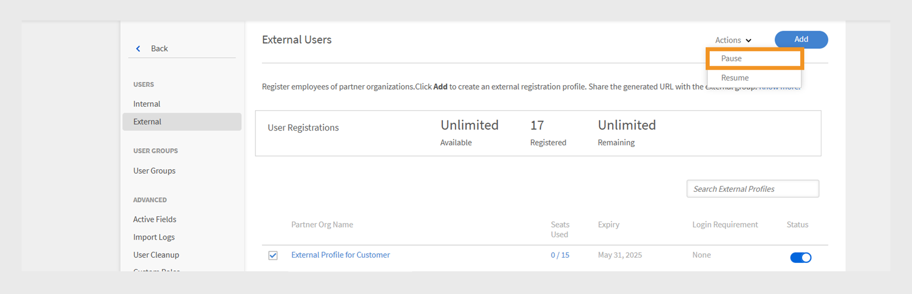

# Aggiungere utenti in Adobe Learning Manager

In Adobe Learning Manager, gli utenti sono Allievi che utilizzano la piattaforma per l’apprendimento o la formazione. Esistono due tipi di utenti: utenti interni ed esterni.

Gli utenti interni sono dipendenti o membri del gruppo della tua organizzazione.

Gli utenti esterni sono Allievi esterni all’azienda, come clienti, partner, fornitori o clienti, che possono accedere ai contenuti di apprendimento.

Adobe Learning Manager (ALM) consente agli amministratori di integrare e gestire utenti interni ed esterni utilizzando vari metodi, tra cui l&#39;immissione manuale, il caricamento di CSV, la registrazione autonoma e le integrazioni di sistema.

## Utenti interni

Gli utenti interni in Adobe Learning Manager si riferiscono ai dipendenti o ai membri del team all&#39;interno dell&#39;organizzazione. Puoi aggiungerli manualmente, caricarli in blocco o importarli tramite integrazioni di sistema. Dopo aver aggiunto questi utenti, puoi organizzarli in gruppi, assegnare corsi e monitorare i progressi dell’apprendimento.

Gli utenti di Adobe Learning Manager possono assumere responsabilità diverse e gestire varie attività in base ai ruoli assegnati. Ciascun ruolo, che include Amministratore, Autore, Istruttore e Amministratore di integrazione, offre una serie di funzionalità specifiche personalizzate per supportare le responsabilità dell’utente all’interno della piattaforma.

### Metodi per aggiungere utenti interni

Gli amministratori possono aggiungere utenti interni utilizzando i seguenti metodi:

* **Aggiungi un singolo utente**: aggiungi manualmente un utente alla volta.
* **Profilo di registrazione autonoma**: consente agli Allievi di registrarsi autonomamente come Allievi in Adobe Learning Manager utilizzando un collegamento di registrazione creato dall’Amministratore.
* **Caricamento in serie tramite CSV**: carica un file CSV per aggiungere più utenti contemporaneamente.

### Aggiungere manualmente un utente interno

Gli amministratori possono aggiungere manualmente un utente fornendo il proprio nome, e-mail, identificatore univoco e nome del manager. L’identificatore univoco in Adobe Learning Manager è un identificatore obbligatorio assegnato dagli amministratori durante la creazione di un utente. Deve essere univoco per ogni utente e fungere da riferimento coerente in tutto il sistema.

>[!INFO]
>
>Guarda questo corso di formazione sulla ALM Academy per ulteriori informazioni sull&#39;aggiunta di singoli utenti in Adobe Learning Manager.  

Per aggiungere un singolo utente a Adobe Learning Manager:

1. Accedi come amministratore.
2. Seleziona **Utenti**, quindi scegli **Interni**.
3. Seleziona **Aggiungi**, quindi scegli **Utente singolo**.

   
   _Interfaccia amministratore che mostra l&#39;opzione per aggiungere manualmente un singolo utente interno_
4. Nella finestra di dialogo **Aggiungi utente**, digita il **Nome**, l&#39;**E-mail** e il **Profilo** (titolo del processo) dell&#39;utente.

   
   _Campi per immettere nome, e-mail, identificatore univoco e profilo per un nuovo utente_
5. Cerca il manager dell’utente e seleziona il nome dall’elenco dei manager.
6. Seleziona **Aggiungi**.
L’utente riceve un’e-mail di benvenuto contenente un URL di accesso.

### Consenti registrazione autonoma per utenti interni

La registrazione autonoma è un processo di onboarding self-service in cui gli utenti possono visitare un URL di registrazione, immettere i propri dettagli e iscriversi automaticamente alla piattaforma. Questo metodo riduce al minimo l’onere amministrativo consentendo agli utenti di registrarsi tramite l’URL fornito.

Per creare un URL di registrazione autonoma per un utente:

1. Accedi come amministratore.
2. Seleziona **Utenti**, quindi scegli **Interni**.
3. Seleziona **Aggiungi**, quindi scegli **Registrazione autonoma.**

   
   _Menu a discesa per la selezione dell&#39;opzione di registrazione autonoma_
4. Nella finestra di dialogo **Aggiungi profilo di registrazione autonoma**, digita il profilo nel campo **Nome profilo** (titolo del processo dell&#39;utente).
5. Selezionare il manager dell&#39;utente cercando il manager nel campo **Nome del manager**. Il manager assegnato al profilo di registrazione autonoma deve essere un utente registrato in Adobe Learning Manager.

   
   _Campi di input per impostare il nome del profilo e assegnare un manager a un profilo di registrazione autonoma_
6. Seleziona un&#39;immagine utilizzando l&#39;opzione **Aggiungi immagine**. Questa immagine sarà visibile agli Allievi nella sezione del profilo.
7. Seleziona **Salva**.

   Adobe Learning Manager crea un profilo utente e genera un URL di registrazione autonoma che può essere condiviso con gli utenti per completare la registrazione.

   
   _Messaggio di conferma che indica la creazione di un URL di registrazione autonoma_
8. Condividi l’URL con gli utenti che desiderano registrarsi autonomamente.

   L’URL può essere condiviso con più utenti per la registrazione. Ad esempio, è possibile generare un URL per il profilo **Sales Associate** e condividerlo con il team Sales Associate in modo che possa registrarsi.

_Il collegamento per la registrazione autonoma apre una pagina di registrazione_

### Visualizza l’elenco degli URL di registrazione autonoma

Per visualizzare l’elenco degli URL di registrazione autonoma:

1. Seleziona **Utenti**, quindi scegli **Interni**.
2. Selezionare **Registrazione autonoma**.

   Gli amministratori possono visualizzare l’elenco degli URL di registrazione autonoma.

_Visualizzazione elenco che mostra gli URL di registrazione autonoma esistenti disponibili per gli utenti interni_

### Caricamento in serie di utenti interni

Gli amministratori possono aggiungere più utenti contemporaneamente caricando un file CSV con informazioni sull’utente quali nome, indirizzo e-mail e nome del manager. Questa funzione di caricamento in serie consente di risparmiare tempo e fatica rispetto all’aggiunta di singoli utenti.

>[!INFO]
>
>Guarda questo corso di formazione sull&#39;Accademia ALM per scoprire come aggiungere utenti in blocco tramite un file CSV.   

Per aggiungere più utenti:

1. Accedi come amministratore.
2. Seleziona **Utenti**, quindi scegli **Interni**.
3. Seleziona **Aggiungi**, quindi scegli **Carica un file CSV**.

   
   _Opzione per caricare un file CSV per l&#39;importazione in blocco degli utenti_

4. Prepara un file CSV con i seguenti campi:

   * Nome dipendente*
   * E-mail del dipendente*
   * Profilo/designazione dipendente
   * ID/e-mail del manager\
     (*) Campo obbligatorio.

5. Prima di aggiungere l’ID e-mail di un Manager per qualsiasi dipendente, assicurati che il Manager sia già incluso come dipendente nel file CSV. Ad esempio, consulta il dipendente Howard Walters nell’immagine seguente.

   
   _Immagine di un file CSV di esempio con tutti i campi_

6. Carica il file CSV e mappa i campi dati di conseguenza.

   
   _Interfaccia di mappatura CSV per allineare le colonne del foglio di calcolo ai campi di sistema_
7. Seleziona **Salva** per importare gli utenti.

   Una volta completato il caricamento, viene visualizzato un messaggio di conferma.

   
   _L&#39;immagine mostra lo stato di caricamento del file CSV come completato_

>[!NOTE]
>
>Gestisci un file CSV principale per tutte le aggiunte e le eliminazioni. L&#39;aggiornamento e il nuovo caricamento di un file CSV esistente non è supportato.

Quando carichi un file CSV per aggiungere utenti, è importante includere tutte le informazioni correlate nell&#39;ordine corretto. Se assegni l’ID e-mail di un manager a un dipendente, i relativi dettagli devono essere visualizzati in precedenza nel file CSV. In questo modo il sistema riconosce il manager come utente esistente prima di collegarlo ai membri del team. Ad esempio, se Howard Walters è un manager, includi i dettagli completi del suo utente nel file CSV prima di elencare i dipendenti che si riferiscono a lui.

### Gestire la registrazione degli utenti

Dopo aver aggiunto gli utenti singolarmente o in blocco, è necessario registrarli per attivare i loro account. Ciò consente agli utenti di accedere a Adobe Learning Manager e iniziare a utilizzare la piattaforma.

Per registrare gli utenti:

1. Seleziona **Utenti** nella home page dell&#39;amministratore.
2. Seleziona le caselle di controllo accanto ai nomi degli utenti da registrare.
3. Seleziona **Azioni**, quindi scegli **Registra**.

   
   _Pulsante Registra per attivare gli utenti selezionati in Adobe Learning Manager_

4. Selezionare **Sì** per attivare l&#39;utente.

L&#39;utente riceve un&#39;e-mail di verifica. L&#39;utente deve selezionare il collegamento nell&#39;e-mail per attivare il proprio account e iniziare a utilizzare Adobe Learning Manager.

## Utenti esterni

Adobe Learning Manager consente di aggiungere utenti esterni all’azienda, ad esempio clienti, partner, fornitori o clienti, per accedere ai contenuti di apprendimento. Dopo averli aggiunti, puoi raggrupparli, assegnare corsi e tenere traccia dei progressi di apprendimento.

L’aggiunta di utenti esterni in Adobe Learning Manager prevede i seguenti passaggi:

* Creazione di un profilo di registrazione esterno
* Abilitare il profilo di registrazione
* Condividere il collegamento di registrazione con utenti esterni
* Metti in pausa o riprendi il profilo quando necessario

Adobe Learning Manager supporta l’iscrizione di tali utenti tramite profili di registrazione esterni.

Per creare un utente esterno, effettua le seguenti operazioni:

1. Accedi come amministratore.
2. Seleziona **Utenti**, quindi scegli **Esterni**.
3. Seleziona **Aggiungi** per creare una registrazione per un utente esterno.
4. Nella finestra di dialogo **Aggiungi profilo di registrazione esterno**, specifica quanto segue:

   * **Nome profilo:** Digitare il nome.
   * **E-mail manager:** Digitare l&#39;indirizzo e-mail del manager.
   * **Limite partecipanti:** Impostare il numero massimo di iscrizioni consentite.
   * **Scadenza:** definire la data ultima per le nuove registrazioni. Dopo la scadenza, il collegamento non funzionerà per la registrazione di nuovi utenti.

   
   _Finestra di dialogo per l&#39;immissione del nome del profilo, dell&#39;e-mail del manager, del limite di partecipanti e della scadenza_

5. Seleziona un&#39;immagine utilizzando l&#39;opzione **Aggiungi immagine**. Questa immagine sarà visibile agli Allievi nella sezione del profilo.
6. Selezionare la sezione **Impostazioni avanzate** per espanderla e digitare i dettagli richiesti:
   * **Requisiti di accesso:** Digitare il numero di giorni. Se gli Allievi rimangono inattivi per l’intero periodo, vengono automaticamente rimossi.
   * **Domini consentiti:** Digitare l&#39;elenco separato da virgole dei domini e-mail consentiti. Solo gli utenti con indirizzi e-mail di domini approvati possono registrarsi.
   * **Verifica tramite e-mail richiesta:** selezionare questa opzione per applicare la verifica tramite e-mail durante la registrazione.

   
   _Pannello Impostazioni avanzate per impostare i requisiti di accesso, i domini consentiti e la verifica tramite e-mail_

7. Seleziona **Salva**.

Viene generato un URL di registrazione.

### Abilita il profilo esterno

Per abilitare il profilo esterno:

1. Individua il profilo appena creato nell&#39;elenco dei profili esterni.
2. Seleziona il pulsante di attivazione/disattivazione **Stato** per abilitarlo.

L’amministratore può condividere questo URL con il partner esterno in modo che possa iscriversi e accedere a Adobe Learning Manager utilizzandolo.

_Selezionare l&#39;interruttore per abilitare il profilo esterno_

### Copia e condividi l’URL di registrazione del profilo esterno

L&#39;URL di registrazione per un profilo esterno può essere copiato dalla sezione **Utenti esterni**.

_Copiare l&#39;URL di registrazione di un profilo esterno_

### Differenze principali tra le registrazioni utente interne ed esterne

Esistono alcune differenze tra le registrazioni interne ed esterne:

| Utenti interni | Utenti esterni |
|---|---|
| Può accedere utilizzando le credenziali Adobe ID o SSO. | È possibile accedere utilizzando un qualsiasi ID e-mail. |
| La gamification è disponibile. | È disponibile la gamification. L’amministratore deve abilitare la gamification per gli Allievi esterni nelle [Impostazioni gamification](https://experienceleague.adobe.com/en/docs/learning-manager/using/admin/gamification). |

### Metti in pausa il profilo di registrazione esterno

In Adobe Learning Manager, gli amministratori possono gestire la registrazione degli utenti esterni mettendo in pausa i propri profili. Questa funzione è utile quando desideri sospendere temporaneamente l’accesso di nuovi utenti a un profilo di registrazione esterno specifico. La sospensione di un profilo impedisce agli utenti che hanno ricevuto gli inviti ma che non si sono ancora registrati di completare la procedura di registrazione. Questa azione non influisce sugli utenti che hanno già completato la registrazione.

Per mettere in pausa un profilo esterno:

1. Seleziona **Azioni** nell&#39;angolo superiore destro della pagina **Utenti esterni**.
2. Seleziona **Pausa** per mettere in pausa il profilo di registrazione esterno.

Questo blocca nuove registrazioni per gli utenti che non hanno accettato i loro inviti. Questa azione interessa solo gli utenti che non hanno ancora completato la registrazione.

_Opzione per mettere in pausa un profilo di registrazione esterno esistente dal menu Azioni_

### Riprendi profilo di registrazione esterno

Se un profilo esterno era stato precedentemente sospeso, gli amministratori possono riprenderlo per consentire ai nuovi utenti di completare la registrazione. In questo modo viene riattivato il processo di registrazione per gli utenti invitati ma che non hanno completato la registrazione.

Per riprendere un utente esterno:

1. Seleziona **Azioni** nell&#39;angolo superiore destro della pagina.
2. Selezionare **Riprendi** per riprendere l&#39;accesso di un partner sospeso.

_Opzione per riprendere un profilo di registrazione esterno sospeso in precedenza_

### Monitoraggio dell&#39;utilizzo della postazione esterna

Gli Amministratori possono tenere traccia del numero di utenti aggiunti a ciascun profilo esterno in Adobe Learning.

Per controllare i sedili usati:

1. Selezionare **Posti usati** nell&#39;elenco dei profili esterni.

Puoi visualizzare il numero di Allievi aggiunti all’organizzazione partner e se gli Allievi sono attivi.

## Gestisci utenti

Gli amministratori possono modificare i dettagli degli utenti, eliminare gli utenti, assegnare ruoli e rimuovere ruoli. In questo modo è possibile assicurarsi che ogni utente disponga dell&#39;accesso e delle attività corrette.

>[!INFO]
>
>Guarda questo corso di formazione dell&#39;Accademia ALM per scoprire come assegnare e rimuovere ruoli, inviare un&#39;e-mail di benvenuto ed eliminare ed eliminare gli utenti. [.[pulsante]](https://content.adobelearningmanageracademy.com/app/learner?accountId=98632#/course/7555586) 

### Modifica un utente

Utilizza l&#39;opzione **Modifica utente** in Adobe Learning Manager per aggiornare le informazioni di profilo di un utente, ad esempio il nome, l&#39;indirizzo e-mail, l&#39;identificatore univoco, il profilo e il nome del manager. Gli amministratori possono apportare queste modifiche per garantire che i dati degli utenti rimangano accurati e aggiornati.

Per modificare un utente:

1. Seleziona **Utenti** nella home page dell&#39;amministratore.
2. Selezionare l&#39;utente che si desidera modificare dall&#39;elenco **Utenti**.
3. Seleziona **Modifica profilo**.

   
   _Opzione Elimina utente nel menu Azioni per rimuovere un utente dalla piattaforma_

4. Selezionare **Sì** per eliminare l&#39;utente.

Quando l’utente viene eliminato correttamente, viene visualizzato un messaggio di conferma.

## Assegna un ruolo a un utente

I ruoli utente in Adobe Learning Manager definiscono le azioni che ogni persona può eseguire nel sistema. Ogni ruolo viene fornito con autorizzazioni specifiche in base alle responsabilità dell&#39;utente.

Adobe Learning Manager supporta i seguenti ruoli utente:

* **Amministratore**: gestisce utenti e gruppi di utenti, assegna ruoli e configura preferenze a livello di sistema come origini dati, domini consentiti e opzioni di visualizzazione. Gli Amministratori sono inoltre responsabili della creazione e dell’organizzazione dei contenuti di apprendimento, del monitoraggio dei progressi degli Allievi, della generazione di report e dell’impostazione delle integrazioni con sistemi esterni.
* **Autore**: crea e gestisce contenuti, inclusi moduli e corsi.
* **Manager**: sovrintende alle attività di apprendimento del team, nomina i membri del team per i corsi, approva le richieste e fornisce feedback.
* **Amministratore di integrazione**: gestisce le integrazioni di sistema e le connessioni dati tra ALM e piattaforme esterne.
* **Ruoli personalizzati**: gli amministratori possono creare ruoli personalizzati per concedere agli utenti un accesso personalizzato in base alle loro responsabilità. Per ulteriori informazioni sui ruoli personalizzati, consultare questo [articolo](/help/migrated/administrators/feature-summary/custom-role.md).

Per assegnare ruoli agli utenti:

1. Seleziona **Utenti** nella home page dell&#39;amministratore.
2. Seleziona l’utente a cui assegnare un ruolo.
3. Seleziona **Azioni** nell&#39;angolo superiore destro.
4. Seleziona **Assegna ruolo**.
5. Selezionare il ruolo richiesto.

   
   _Le opzioni del menu Assegna ruolo visualizzano i ruoli disponibili per l&#39;utente selezionato_

6. Seleziona **Sì** nella finestra di dialogo di conferma.

## Rimuovi un ruolo

La rimozione di un ruolo utente comporta la revoca delle autorizzazioni concesse da tale ruolo.

Per rimuovere i ruoli dagli utenti:

1. Selezionare **Utenti** nella home page dell&#39;amministratore.
2. Selezionare gli utenti di cui si desidera rimuovere i ruoli.
3. Seleziona **Azioni**, quindi seleziona **Rimuovi ruolo**.

   
   _Opzione per rimuovere i ruoli assegnati a un utente dal menu Azioni_

4. Seleziona **Sì** nella finestra di dialogo di conferma.

