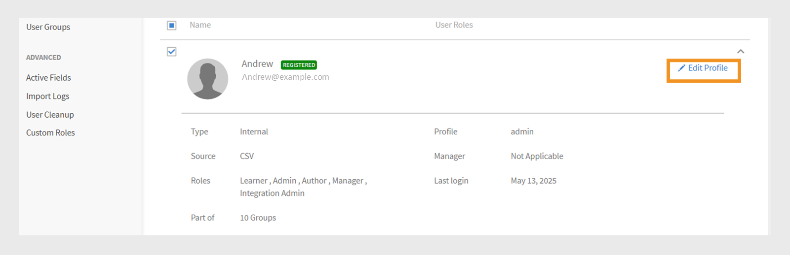
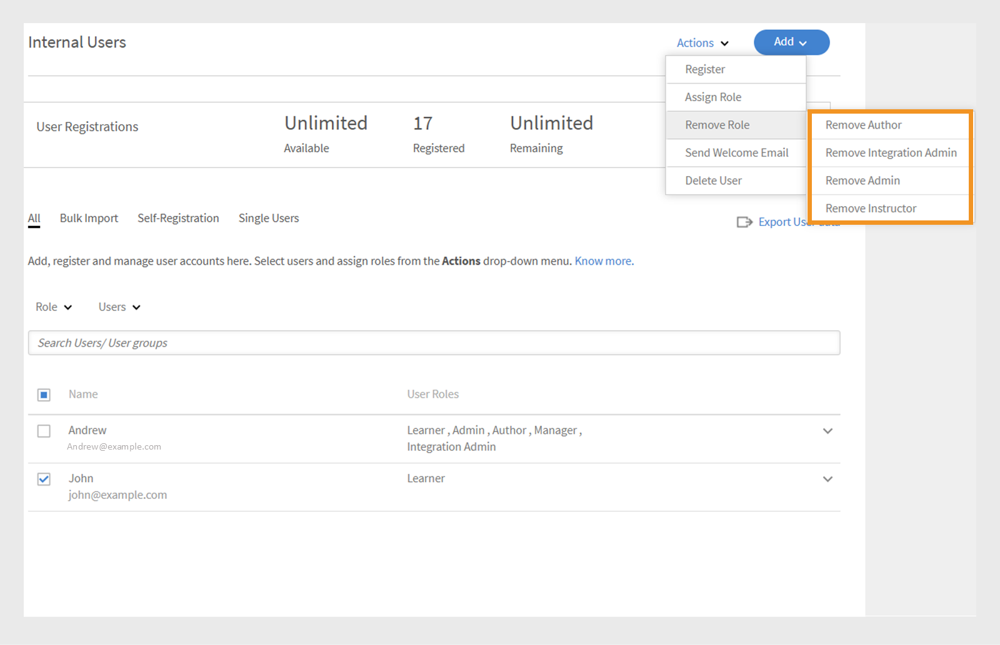

# Aggiungere utenti in Adobe Learning Manager

In Adobe Learning Manager, gli utenti sono Allievi che utilizzano la piattaforma per l’apprendimento o la formazione. Esistono due tipi di utenti: utenti interni ed esterni.

Gli utenti interni sono dipendenti o membri del gruppo della tua organizzazione.

Gli utenti esterni sono Allievi esterni all’azienda, come clienti, partner, fornitori o clienti, che possono accedere ai contenuti di apprendimento.

Adobe Learning Manager (ALM) consente agli amministratori di integrare e gestire utenti interni ed esterni utilizzando vari metodi, tra cui l&#39;immissione manuale, il caricamento di CSV, la registrazione autonoma e le integrazioni di sistema.

## Utenti interni

Gli utenti interni in Adobe Learning Manager si riferiscono ai dipendenti o ai membri del team all&#39;interno dell&#39;organizzazione. Puoi aggiungerli manualmente, caricarli in blocco o importarli tramite integrazioni di sistema. Dopo aver aggiunto questi utenti, puoi organizzarli in gruppi, assegnare corsi e monitorare i progressi dell’apprendimento.

Gli utenti di Adobe Learning Manager possono assumere responsabilità diverse e gestire varie attività in base ai ruoli assegnati. Ogni ruolo, che include Amministratore, Autore, Istruttore e Amministratore dell’integrazione, offre una serie di funzionalità specifiche personalizzate per supportare le responsabilità dell’utente all’interno della piattaforma.

Adobe Learning Manager supporta i seguenti ruoli utente:

* **Amministratore**: gestisce utenti e gruppi di utenti, assegna ruoli e configura preferenze a livello di sistema come origini dati, domini consentiti e opzioni di visualizzazione. Gli Amministratori sono inoltre responsabili della creazione e dell’organizzazione dei contenuti di apprendimento, del monitoraggio dei progressi degli Allievi, della generazione di report e dell’impostazione delle integrazioni con sistemi esterni.
* **Autore**: crea e gestisce contenuti, inclusi moduli e corsi.
* **Manager**: sovrintende alle attività di apprendimento del team, nomina i membri del team per i corsi, approva le richieste e fornisce feedback.
* **Amministratore dell&#39;integrazione**: gestisce le integrazioni di sistema e le connessioni dati tra ALM e piattaforme esterne.
* **Ruoli personalizzati**: gli amministratori possono creare ruoli personalizzati per fornire agli utenti un accesso personalizzato in base alle loro responsabilità. Per ulteriori informazioni sui ruoli personalizzati, fare riferimento a questo articolo.

### Metodi per aggiungere utenti interni

Gli amministratori possono aggiungere utenti interni utilizzando i seguenti metodi:

* **Aggiungi un singolo utente**: aggiungi manualmente un utente alla volta.
* **Profilo di registrazione autonoma**: consente agli Allievi di registrarsi autonomamente come Allievi in Adobe Learning Manager utilizzando un collegamento di registrazione creato dall’Amministratore.
* **Caricamento in serie tramite CSV**: carica un file CSV per aggiungere più utenti contemporaneamente.

### Aggiungere manualmente un utente interno

Gli amministratori possono aggiungere manualmente i singoli utenti immettendo il nome, l’ID e-mail, l’identificatore univoco e il nome del manager. L’identificatore univoco in Adobe Learning Manager è un identificatore obbligatorio assegnato dagli amministratori durante la creazione di un utente. Deve essere univoco per ogni utente e fungere da riferimento coerente in tutto il sistema.

>[!INFO]
>
>Guarda questo corso di formazione sulla ALM Academy per ulteriori informazioni sull&#39;aggiunta di singoli utenti in Adobe Learning Manager.  

Per aggiungere un singolo utente a Adobe Learning Manager:

1. Accedi come amministratore.
2. Seleziona **Utenti**, quindi seleziona **Interni**.
3. Seleziona **Aggiungi**, quindi seleziona **Utente singolo**.

   
   _Interfaccia amministratore che mostra l&#39;opzione per aggiungere manualmente un singolo utente interno_
4. Nella finestra di dialogo **Aggiungi utente**, digita il **Nome**, l&#39;**E-mail** e il **Profilo** (titolo del processo) dell&#39;utente.

   
   _Campi per immettere nome, e-mail, identificatore univoco e profilo per un nuovo utente_
5. Cerca il manager dell’utente e seleziona il nome dall’elenco dei manager.
6. Seleziona **Aggiungi**.
L’utente riceve un’e-mail di benvenuto contenente un URL di accesso.

### Consenti registrazione autonoma per utenti interni

La registrazione autonoma è un processo di onboarding self-service in cui gli utenti possono visitare un URL di registrazione, immettere i propri dettagli e iscriversi automaticamente alla piattaforma. Questo metodo riduce al minimo l’onere amministrativo consentendo agli utenti di registrarsi tramite l’URL fornito.

Per creare un URL di registrazione autonoma per un utente:

1. Accedi come amministratore.
2. Seleziona **Utenti**, quindi seleziona **Interni**.
3. Seleziona **Aggiungi** nell&#39;angolo in alto a destra, quindi seleziona **Registrazione autonoma.**

   
   _Menu a discesa per la selezione dell&#39;opzione di registrazione autonoma_
4. Nella finestra di dialogo **Aggiungi profilo di registrazione autonoma**, digita il profilo nel campo **Nome profilo** (titolo del processo dell&#39;utente).
5. Selezionare il manager dell&#39;utente cercando il manager nel campo **Nome del manager**. Il manager assegnato al profilo di registrazione autonoma deve essere un utente registrato in Adobe Learning Manager.

   
   _Campi di input per impostare il titolo del processo e assegnare un manager a un profilo di registrazione autonoma_
6. Seleziona un&#39;immagine utilizzando l&#39;opzione **Aggiungi immagine**. Questa immagine sarà visibile agli Allievi nella sezione del profilo.
7. Seleziona **Salva**.

   Adobe Learning Manager crea un profilo utente e genera un URL di registrazione autonoma che può essere condiviso con gli utenti per completare la registrazione.

   
   _Messaggio di conferma che indica la creazione di un URL di registrazione autonoma_
8. Condividi l’URL con gli utenti che desiderano registrarsi autonomamente.

   L’URL può essere condiviso con più utenti per la registrazione. Ad esempio, è possibile generare un URL per il profilo **Sales Associate** e condividerlo con il team Sales Associate in modo che possa registrarsi.

_Il collegamento per la registrazione autonoma apre una pagina di registrazione_

### Visualizza l’elenco degli URL di registrazione autonoma

Per visualizzare l’elenco degli URL di registrazione autonoma:

1. Seleziona **Utenti**, quindi seleziona **Interni**.
2. Selezionare **Registrazione autonoma**.

   Gli amministratori possono visualizzare l’elenco degli URL di registrazione autonoma.

_Visualizzazione elenco che mostra gli URL di registrazione autonoma esistenti disponibili per gli utenti interni_

### Caricamento in serie di utenti interni

Adobe Learning Manager consente agli amministratori di aggiungere più utenti contemporaneamente caricando un file CSV contenente le informazioni dell’utente, tra cui nome, ID e-mail e nome del manager. Questa funzione di caricamento in serie consente di risparmiare tempo e fatica rispetto all’aggiunta di singoli utenti.

>[!INFO]
>
>Guarda questo corso di formazione sull&#39;Accademia ALM per scoprire come aggiungere utenti in blocco tramite un file CSV.   

Per aggiungere più utenti:

1. Accedi come amministratore.
2. Seleziona **Utenti**, quindi seleziona **Interni**.
3. Seleziona **Aggiungi** nell&#39;angolo in alto a destra e seleziona **Carica un file CSV**.

   
   _Opzione per caricare un file CSV per l&#39;importazione in blocco degli utenti_

4. Prepara un file CSV con i seguenti campi:

   * Nome dipendente*
   * E-mail del dipendente*
   * Profilo/designazione dipendente
   * ID/e-mail del manager\
     (*) Campo obbligatorio.

5. Prima di aggiungere l’ID e-mail di un Manager per qualsiasi dipendente, assicurati che il Manager sia già incluso come dipendente nel file CSV. Ad esempio, consulta il dipendente Howard Walters nell’immagine seguente.

   
   _Immagine di un file CSV di esempio con tutti i campi_

6. Carica il file CSV e mappa i campi dati di conseguenza.

   
   _Interfaccia di mappatura CSV per allineare le colonne del foglio di calcolo ai campi di sistema_
7. Seleziona **Salva** per importare gli utenti.

   Una volta completato il caricamento, viene visualizzato un messaggio di conferma.

   
   _L&#39;immagine mostra lo stato di caricamento del file CSV come completato_

>[!NOTE]
>
>Gestisci un file CSV principale per tutte le aggiunte e le eliminazioni. L&#39;aggiornamento e il nuovo caricamento di un file CSV esistente non è supportato.

Quando carichi un file CSV per aggiungere utenti, è importante includere tutte le informazioni correlate nell&#39;ordine corretto. Se assegni l’ID e-mail di un manager a un dipendente, i relativi dettagli devono essere visualizzati in precedenza nel file CSV. In questo modo il sistema riconosce il manager come utente esistente prima di collegarlo ai membri del team. Ad esempio, se Howard Walters è un manager, includi i dettagli completi del suo utente nel file CSV prima di elencare i dipendenti che si riferiscono a lui.

### Gestire la registrazione degli utenti

Dopo aver aggiunto gli utenti singolarmente o in blocco, è necessario registrarli per attivare i loro account. Ciò consente agli utenti di accedere a Adobe Learning Manager e iniziare a utilizzare la piattaforma.

Per registrare gli utenti:

1. Seleziona **Utenti** nella home page dell&#39;amministratore.
2. Seleziona le caselle di controllo accanto ai nomi degli utenti da registrare.
3. Seleziona **Azioni**, quindi seleziona **Registra**.

   
   _Pulsante Registra per attivare gli utenti selezionati in Adobe Learning Manager_

4. Selezionare **Sì** per attivare l&#39;utente.

L&#39;utente riceve un&#39;e-mail di verifica. L&#39;utente deve selezionare il collegamento nell&#39;e-mail per attivare il proprio account e iniziare a utilizzare Adobe Learning Manager.

## Utenti esterni

Adobe Learning Manager consente di aggiungere utenti esterni all’azienda, ad esempio clienti, partner, fornitori o clienti, per accedere ai contenuti di apprendimento. Dopo averli aggiunti, puoi raggrupparli, assegnare corsi e tenere traccia dei progressi di apprendimento.

L’aggiunta di utenti esterni in Adobe Learning Manager prevede i seguenti passaggi:

* Creazione di un profilo di registrazione esterno
* Abilitare il profilo di registrazione
* Condividere il collegamento di registrazione con utenti esterni
* Metti in pausa o riprendi il profilo quando necessario

Adobe Learning Manager supporta l’iscrizione di tali utenti tramite profili di registrazione esterni.

Per creare un utente esterno, effettua le seguenti operazioni:

1. Accedi come amministratore.
2. Seleziona **Utenti**, quindi seleziona **Esterni**.
3. Nell&#39;angolo superiore destro, seleziona **Aggiungi** per creare una registrazione per un utente esterno.
4. Nella finestra di dialogo **Aggiungi profilo di registrazione esterno**, specifica quanto segue:

   * **Nome profilo:** Digitare il nome dell&#39;organizzazione partner che desidera accedere a Adobe Learning Manager
   * **E-mail manager:** Digitare l&#39;indirizzo e-mail del manager dell&#39;utente.
   * **Limite partecipanti:** Impostare il numero massimo di iscrizioni consentite.
   * **Scadenza:** definire la data ultima per le nuove registrazioni. Dopo la scadenza, il collegamento non funzionerà per la registrazione di nuovi utenti.

   
   _Finestra di dialogo per l&#39;immissione del nome del profilo, dell&#39;e-mail del manager, del limite di partecipanti e della scadenza_

5. Seleziona un&#39;immagine utilizzando l&#39;opzione **Aggiungi immagine**. Questa immagine sarà visibile agli Allievi nella sezione del profilo.
6. Selezionare la sezione **Impostazioni avanzate** per espanderla e digitare i dettagli richiesti:
   * **Requisiti di accesso:** Digitare il numero di giorni. Se gli Allievi rimangono inattivi per l’intero periodo, vengono automaticamente rimossi.
   * **Domini consentiti:** Digitare l&#39;elenco separato da virgole dei domini e-mail consentiti. Solo gli utenti con indirizzi e-mail di domini approvati possono registrarsi.
   * **Verifica tramite e-mail richiesta:** selezionare questa opzione per applicare la verifica tramite e-mail durante la registrazione.

   
   _Pannello Impostazioni avanzate per impostare i requisiti di accesso, i domini consentiti e la verifica tramite e-mail_

7. Seleziona **Salva**.

Viene generato un URL di registrazione.

### Abilita il profilo esterno

Per abilitare il profilo esterno:

1. Individua il profilo appena creato nell&#39;elenco dei profili esterni.

2. Seleziona il pulsante di attivazione/disattivazione **Stato** per abilitarlo.

L’amministratore può condividere questo URL con il partner esterno in modo che possa iscriversi e accedere a Adobe Learning Manager utilizzandolo.

_Selezionare l&#39;interruttore per abilitare il profilo esterno_

### Copia e condividi l’URL di registrazione del profilo esterno

L&#39;URL di registrazione per un profilo esterno può essere copiato dalla sezione **Utenti esterni**.

_Copiare l&#39;URL di registrazione di un profilo esterno_

### Differenze principali tra le registrazioni utente interne ed esterne

Esistono alcune differenze tra le registrazioni interne ed esterne:

| Utenti interni | Utenti esterni |
|---|---|
| Può accedere utilizzando le credenziali Adobe ID o SSO. | È possibile accedere utilizzando un qualsiasi ID e-mail. |
| La gamification è disponibile. | È disponibile la gamification. L’amministratore deve abilitare la gamification per gli Allievi esterni nelle [Impostazioni gamification](https://experienceleague.adobe.com/it/docs/learning-manager/using/admin/gamification). |

### Metti in pausa il profilo di registrazione esterno

In Adobe Learning Manager, gli amministratori possono gestire la registrazione degli utenti esterni mettendo in pausa i propri profili. Questa opzione è utile quando desideri sospendere temporaneamente la partecipazione di nuovi utenti utilizzando un profilo utente esterno specifico. La sospensione di un profilo impedisce agli utenti che hanno ricevuto gli inviti ma che non si sono ancora registrati di completare la procedura di registrazione. Questa azione non influisce sugli utenti che hanno già completato la registrazione.

Per mettere in pausa un profilo esterno:

1. Seleziona **Azioni** nell&#39;angolo superiore destro della pagina **Utenti esterni**.
2. Seleziona **Pausa** per mettere in pausa il profilo utente esterno.

Ciò blocca il processo di registrazione per gli utenti che devono ancora accettare i loro inviti. Questa azione interessa solo gli utenti che non hanno ancora completato la registrazione.

_Opzione per mettere in pausa un profilo utente esterno esistente dal menu Azioni_

### Riprendi profilo di registrazione esterno

Se un profilo esterno era stato precedentemente sospeso, gli amministratori possono riprenderlo per consentire ai nuovi utenti di completare la registrazione. In questo modo viene riattivato il processo di registrazione per gli utenti invitati ma che non hanno completato la registrazione.

Per riprendere un utente esterno:

1. Seleziona **Azioni** nell&#39;angolo superiore destro della pagina.
2. Selezionare **Riprendi** per riprendere l&#39;accesso di un partner sospeso.

_Opzione per riprendere un profilo utente esterno sospeso in precedenza_

### Monitoraggio dell&#39;utilizzo della postazione esterna

Gli Amministratori possono tenere traccia del numero di utenti aggiunti a ciascun profilo esterno in Adobe Learning.

Per controllare i sedili usati:

1. Selezionare **Posti usati** nell&#39;elenco dei profili esterni.

Puoi visualizzare il numero di Allievi aggiunti all’organizzazione partner e se gli Allievi sono attivi.

## Gestisci utenti

Gli amministratori possono modificare i dettagli degli utenti, eliminare gli utenti, assegnare ruoli e rimuovere ruoli. In questo modo è possibile assicurarsi che ogni utente disponga dell&#39;accesso e delle attività corrette.

>[!INFO]
>
>Guarda questo corso di formazione dell&#39;Accademia ALM per scoprire come assegnare e rimuovere ruoli, inviare un&#39;e-mail di benvenuto ed eliminare ed eliminare gli utenti. [.[pulsante]](https://content.adobelearningmanageracademy.com/app/learner?accountId=98632#/course/7555586) 

### Modifica un utente

Utilizza l&#39;opzione **Modifica utente** in Adobe Learning Manager per aggiornare le informazioni di profilo di un utente, ad esempio il nome, l&#39;indirizzo e-mail, l&#39;identificatore univoco, il profilo e il nome del manager. Gli amministratori possono apportare queste modifiche per garantire che i dati degli utenti rimangano accurati e aggiornati.

Per modificare un utente:

1. Seleziona **Utenti** nella home page dell&#39;amministratore.
2. Selezionare l&#39;utente che si desidera modificare dall&#39;elenco **Utenti**.
3. Seleziona **Modifica profilo**.

   
   _Opzione Elimina utente nel menu Azioni per rimuovere un utente dalla piattaforma_

4. Selezionare **Sì** per eliminare l&#39;utente.

Quando l’utente viene eliminato correttamente, viene visualizzato un messaggio di conferma.

## Assegna un ruolo a un utente

I ruoli utente in Adobe Learning Manager definiscono le azioni che ogni persona può eseguire nel sistema. Ogni ruolo viene fornito con autorizzazioni specifiche in base alle responsabilità dell&#39;utente.

Per assegnare ruoli agli utenti:

1. Seleziona **Utenti** nella home page dell&#39;amministratore.
2. Seleziona l’utente a cui assegnare un ruolo.
3. Seleziona **Azioni** nell&#39;angolo superiore destro.
4. Seleziona **Assegna ruolo**.
5. Selezionare il ruolo richiesto.

   
   _Le opzioni del menu Assegna ruolo visualizzano i ruoli disponibili per l&#39;utente selezionato_

6. Seleziona **Sì** nella finestra di dialogo di conferma.

## Rimuovi un ruolo

La rimozione di un ruolo utente comporta la revoca delle autorizzazioni concesse da tale ruolo.

Per rimuovere i ruoli dagli utenti:

1. Selezionare **Utenti** nella home page dell&#39;amministratore.
2. Selezionare gli utenti di cui si desidera rimuovere i ruoli.
3. Seleziona **Azioni**, quindi seleziona **Rimuovi ruolo**.

   
   _Opzione per rimuovere i ruoli assegnati a un utente dal menu Azioni_

4. Seleziona **Sì** nella finestra di dialogo di conferma.
<!--# Add users and create user groups

Learn how to add users or user groups in Learning Manager application.

<!---->

<!--## Overview {#overview}

In Adobe Learning Manager, you can assume the following roles:

* **Administrator:** An Administrator defines the training strategy for the organization. An Administrator can add learners, search required skills for learners, manage and assign courses, create learning plans, certifications, and learning programs, and manage reports for the entire organization.
* **Author:** Authors are Instructional Designers and content creators. An Author can add modules and courses to Learning Manager.
* **Manager:** A Manager manages the learning activities of a team. A Manager can nominate team members to take a course, approve requests from team members, and provide feedback on performance of their team members post-completion of training. Managers can also view reports for their team to track their performance.
* **Learner:** Learners can access courses, learning programs, and certifications assigned to them. Learners can also browse through all the available courses by using a catalog and enroll themselves for either courses, learning programs, or certifications.

As an Administrator, you can add users in three ways:

* Internal
* External
* User groups

## Add a single user {#addasingleuser}

Add internal learners to the Adobe Learning Manager using a single user option.

>[!INFO]
>
>In this training, you will learn how to add internal learners to the Adobe Learning Manager.    

If you're unable to launch the training, write to <almacademy@adobe.com>.

To add users,

1. Log into Adobe Learning Manager as an Administrator. 
1. On the home page, click **[!UICONTROL Add Users]**. On this page, you can add a single user or multiple users at a time using a CSV. You can also create a self-registration link for internal employees or create an external learner profile.
1. To add a single user, click **[!UICONTROL Add]** on the upper-right corner and choose the option **[!UICONTROL Single User]**.

1. To add a single user, click **[!UICONTROL Add]** on the upper-right corner and choose the option **Single User**.

   
   *Add a single internal user*

1. On the **[!UICONTROL Add User]** dialog, enter the details of the learner. For the field **[!UICONTROL Manager's Name]**, pick the name of an existing user in the system.

   
   *Add user dialog box*

1. To add the new user in Learning Manager, click **[!UICONTROL Add]**. After the user is added, the user receives a verification mail. The Learner then activates the account and starts using Learning Manager. This workflow is helpful if you need to add limited number of learners to your Learning Manager Account. But if you're planning to enroll all the employees of a large organization, you can add them in a singe attempt. For more information, see the next section.

## Add users in bulk {#addusersinbulk}

Typically, most organizations work with an HR Management System (HRMS), which maintains all employee records, such as, designation, location, date of joining, or employee hierarchy. You can export this data in a CSV format. To import a CSV, follow the steps below:

1. Click **[!UICONTROL Add]** on the upper-right corner, and choose the option **[!UICONTROL Upload a CSV]**.

   
   *Upload a CSV to add users in bulk*

1. The CSV that you upload consists of the fields, as shown below:

   
   *Structure of the CSV*

   You must maintain a master CSV and perform perform all additions and deletions on the master CSV. The master CSV contains the following fields:

   * name &#42;
   * email &#42;
   * profile
   * manager

   (&#42;) Required field.

1. After you click the option **[!UICONTROL Upload a CSV]**, the following dialog displays.

   
   *Upload a CSV dialog*

1. Choose the CSV or drag-and-drop the file. After you've chosen the file, map the data fields with the ones in the CSV file. Click the required drop-down and choose the right field.

   
   *Map fields in CSV*

1. To start importing the users, click **[!UICONTROL Save]**. You can see a confirmation message.

   
   *Confirmation message for successful upload of the CSV*

1. The new users are now added to your Adobe Learning Manager account. To select the new users, select the check-box next to the names so that everybody is selected. 

   
   *New users added*

>[!NOTE]
>
>For more information, see the FAQ, [Add users in bulk](../add-users-in-bulk.md).

>[!INFO]
>
>In this training, you will learn how to add users in bulk through a CSV.    

If you're unable to launch the training, write to <almacademy@adobe.com>.

## Register a user {#registerauser}

With the user selected, click **[!UICONTROL Actions]** on the upper-right corner and click **[!UICONTROL Register]**.

The selected users receive a Welcome email. If the learners have an existing Adobe ID, they can click this link. If they don't have an existing Adobe ID, they can go ahead and click the Welcome link to create an Adobe ID and link it to their Learning Manager account.

### Manage users

In this training, you will learn how to assign and remove roles, send a welcome email, and delete and purge users. 

If you're unable to launch the training, write to <almacademy@adobe.com>.

## Assign a role {#assignarole}

After adding learners to the Adobe Learning Manager account, if you want to change their roles, click Actions on the upper-right corner of the page. Choose the option **[!UICONTROL Assign Role]**. Here you can decide whether you want to give Author access or Admin access to the learner. After you have assigned a role, this learner has Author access to the account and can add modules and create courses. 

*Assign a role to a user*

## Remove a role {#removearole}

You can also remove Author or Admin access for the users. Select one or more learners, click **[!UICONTROL Actions]**, and select **[!UICONTROL Remove Role]**. Choose an option, for example, **[!UICONTROL Remove Author]**, and the author access gets revoked for this learner. 

>[!NOTE]
>
>You cannot manually assign a Manager role to someone in the system. They automatically get access to the Manager dashboard when one or more employees are added under them.

## Delete a user {#deleteauser}

To delete a user, click **[!UICONTROL Actions]**, and choose **[!UICONTROL Delete User]**. On the confirmation dialog, click **[!UICONTROL Yes]**, and the learner gets deleted.

*Confirmation message to delete a user*

## Edit a user {#editauser}

On the list of users, choose a user, and click the user. On the user details, click the **[!UICONTROL Edit]** ( ) button. On the **[!UICONTROL Edit User]** dialog, make the necessary edits and to save the changes, click **[!UICONTROL Save]**.

*Edit User dialog*

## Active fields

Active Fields in Adobe Learning Manager are customizable metadata fields used to store and manage user-specific information. These fields help define key attributes or characteristics associated with each user in the system.

### Manage user attributes

>[!INFO]
>
>In this training, you will learn how to add, customize, and configure Active Fields.    

If you're unable to launch the training, write to <almacademy@adobe.com>.

Adobe Learning Manager preserves the case sensitivity of the user attribute and its value. **For example**, the case sensitivity of a user attribute is 'location' and its value as 'PARIS' will be preserved and displayed in the same manner. In case of any issues, the Administrator can now edit the attribute name and values to correct any case sensitivity errors. 

The Administrator can do this by visiting **[!UICONTROL Admin app]** > **[!UICONTROL Users]** > **[!UICONTROL User groups]** and clicking on the group name.  

An Admin can add and update allowed attribute values for a learner through UI.

Types of active fields:

* Groupable: Learners would get grouped on the basis of the Values
* Reportable: Reporting user groups would be created based on the active fields
* Exportable: The fields will be seen in exported in user group report.

## Create a self-registration link {#createaselfregistrationlink}

You can also enable employees in your organization to register themselves as Learners to Adobe Learning Manager Account, without taking help from you as an administrator. The administrator can create a Self-Registration link and share with the employees, who can further register to Learning Manager using their Adobe credentials.

On the upper-right corner of the page, click **[!UICONTROL Add]**, and select **[!UICONTROL Self-Registration]**.

*Create link to self-register as learner*

The **[!UICONTROL Add Self-Registration Profile]** dialog appears. Give this profile a name. Then add the manager's name. It's important to know that the manager must already be registered learner in Learning Manager.

*Add profile for self-registration*

After you click **[!UICONTROL Save]**, a URL gets generated, which you can share with the learners, so that they can click the URL and self-register themselves.

## Enroll external learners {#enrollexternallearners}

In Adobe Learning Manager, you can also create Registration links for external partners or agencies with limited access to your account and provide them learning material.

There are a few differences between internal and external registrations.

<table>
 <tbody>
  <tr>
   <td>
    
<b>Internal users</b>
</td>
   <td>
    
<b>External users</b>
</td>
  </tr>
  <tr>
   <td>
    
Log in using Adobe ID or SSO credentials.
</td>
   <td>
    
Log in using any email ID.
</td>
  </tr>
  <tr>
   <td>
    
Gamification is available.
</td>
   <td>
    
Gamification is available. The admin must enable gamification for external learners in the Gamification settings.
</td>
  </tr>
  <tr>
   <td>
    
Learner hierarchies are available.
</td>
   <td>
    
Learner hierarchies are not available.
</td>
  </tr>
 </tbody>
</table>

To enroll external users, follow the steps below:

1. In the left navigation pane, click **[!UICONTROL External]**.

   
   
   *Enroll external users*

1. On the upper-right corner of the page, click **[!UICONTROL Add]**.

1. On the **Add External Registration Profile** dialog, add the following details:

   * The profile name of the partner organization.
   * The email address of the manager of the partner organization.
   * Seat limit for external enrollment for this partner.
   * Expiry date to set a deadline to stop allowing new registrations to this group. After the Expiry date, only the existing registered users can access this training.

   

   *Add External Registration Profile dialog*

   * In the **[!UICONTROL Advanced Settings]** section, enter the following:

     * **[!UICONTROL Login Requirement]:** Specify a value in days. Learners get deleted if they do not login for the above duration.
     * **[!UICONTROL Allowed Domains]:** A comma-separated list of whitelisted email domain names.
     * **[!UICONTROL Email Verification Required]:** Select this option to make email verification mandatory for a learner.

   

   *Enter the details in the Advanced Settings section* 

1. After you click **[!UICONTROL Save]**, you can see the following confirmation message. You must share the URL with your external partner.

   

## Enable an external profile {#enableanexternalprofile}

After an external profile has been created, you must enable its status. From the list of external profiles, choose the required profile, and toggle the status button.

*Enable an external profile*

This enables the External Enrollment link. A welcome email is automatically be sent to the partner. You can also copy the link and share with them by clicking the Copy URL icon (), or you can resend the welcome email to the partner organization by clicking the Mail icon ().

The partner manager can share the link with the employees who must take the training in PrLearning Managerime. When they click the link, they can self-enroll themselves after filling out some details to create their profile on Learning Manager. These users will not appear on the Learners tab along with the internal employees. You can see their names under the **[!UICONTROL External Learners]** tab.

## Pause an external profile {#pause}

After adding an external user group to Learning Manager, you can also pause the external users' registration process. When you pause, the external users' registration process is blocked. However, this process works only when the users haven't registered yet by accepting the invitation.

To pause the external user groups, choose a group or groups, click **[!UICONTROL Actions]** from the upper-right corner of the page, and click **[!UICONTROL Pause]**.

## Resume an external profile {#resumeanexternalprofile}

At any time, you can always revoke the paused state of an external partner and resume normal services. Click **[!UICONTROL Actions]** at the upper-right corner of the page and select **[!UICONTROL Resume]**.

The following states are applicable for external users:

* **Inactive state** - In this state, the external users' registration is expired. Administrators set the expiry date for the external users while adding them through the add user workflow.
* **Active state** - In this state, the external users can register to the Learning Manager application, and log in to the application.
* **Pause** - In this state, the registration process for external users is blocked. However, the existing users can continue to log in.

## Check used seats {#checkusedseats}

On the list of external profiles, click **[!UICONTROL Seats Used]**. You can view the number of learners in the partner organization who have been added.

*Check used seats*

## Delete a user {#Deleteauser-1}

Choose a user, and from the upper-right corner, click **[!UICONTROL Actions]** > **[!UICONTROL Delete User]**.

## Change profile {#changeprofile}

To move a user to another external profile, choose a user, from the upper-right corner, click **[!UICONTROL Actions]** > **[!UICONTROL Change Profile]**. From the list of profiles, choose a profile, and click **[!UICONTROL Change]**.

## Assign a role {#Assignarole-1}

Choose a user, and from the upper-right corner, click **[!UICONTROL Actions]** > **[!UICONTROL Assign Role]** > **Make `<role>`**. The user gets a new role.

## Remove a role {#Removearole-1}

Choose a user, and from the upper-right corner, click **[!UICONTROL Actions]** > **[!UICONTROL Remove Role]** > **Remove `<role>`**. The selected role gets removed from the list of roles that were assigned to the user.

>[!NOTE]
>
>Assigning a new role will not affect custom user groups. However, it will impact auto-generated user groups such as All Admins, All Authors, and similar role-based groups.

## Create user groups {#createusergroups}

A User Group is a set of users who are related to a category. User Groups help administrators to select learners in their organization based on their attributes, and then assign learning content to them. Also, these User Groups enable administrators to assign customized logos and catalogs to learners and show customized reports on their progress.

To access User Groups, on the left navigation pane, click **[!UICONTROL User Groups]**.

*Create user groups*

### Manage user groups

>[!INFO]
>
>In this training, you will learn how to create a user group by names, email IDs, and combining multiple auto-generated user groups.    

If you're unable to launch the training, write to <almacademy@adobe.com>.

There are two types of groups in Adobe Learning Manager, Custom and Auto-generated. When you add learners to your account, some groups are automatically created based on their common properties.

To see the automatically created groups, click the tab **[!UICONTROL Auto-generated]**.

*View Auto-generated groups*

You can see that there are different groups, like All Internal Users, All Managers, groups based on the Cost Center, based on the department, and based on the teams of the managers.

In addition to Auto-generated groups, you can create Custom groups. To add a new Custom Group, on the upper-right corner, click **[!UICONTROL Add]**. 

1. Enter the name, and description for the group.
1. Enter user name or profile in search-as-you-type field and select from the drop-down list, to add users.

1. To add more learners, click **[!UICONTROL Add More Users]**.

1. To create the user group, click **[!UICONTROL Save]**.

This Custom Group is now created and added to the profile. The User Groups that you create are dynamic in nature. If new users are added with similar attributes, they're automatically added to the User Group.

To view the list of groups a user belongs to, navigate to **[!UICONTROL User]** > **[!UICONTROL User Groups]**, search for the user's name, and select it. This will display all the groups the user is part of.

### Download the list of users in a user group

To download the list of users in a specific user group, navigate to **[!UICONTROL User]** > **[!UICONTROL User Groups]**, select the **[!UICONTROL Download icon]** next to the group. This will generate a CSV file containing the list of users in that group.

 

## Exclusion of user groups

At times you would want to exclude a small set of users from a large user group. This is required to enroll this specific set of users into training via Learning Plans or to setup the correct visibility of catalogs. In this release of Learning Manager, you can exclude learners or User Groups when you create a custom user group. In the Add User Group dialog, the Exclude Learners section enables you to achieve so.

*Exclude user groups*

For example, if you want to set up a Learning Plan so that all users belonging to location = California except Store-5 (located in California) get enrolled. 

## Advanced settings {#advancedsettings}

### Data Sources {#datasources}

You can use this feature when you want to import/sync the users or learning data from your organization's database in to the Learning Manager application. You can also set up the frequency of this sync. 

Click **[!UICONTROL Data Sources]** on the left pane under **[!UICONTROL Advanced]** section. 

*Data sources to iport or sync users*

Choose the data source type from the **[!UICONTROL Source]** drop-down, select the update frequency, and click **[!UICONTROL Sync now]** if you need to sync immediately or click **[!UICONTROL Save].** Data source types are SFDC, FTP, and so on for internal users. 

You can add multiple data sources. 

### Active Fields {#activefields}

This feature enables administrators to add more active fields in addition to what has been provided during user registration. 

Click **[!UICONTROL Active Fields]** available inside users page. Learners can only choose from the values given in custom values.

*Active fields*

### Configure Fields {#configurefields}

**Internal users**

You can add custom value for user fields for internal users.

To add  custom values, follow these steps:

1. Click  **[!UICONTROL Modify Values]** for an Internal user. 

   
   *Modify values for internal users*

1. The **Values in Custom field** dialog box appears.

   
   *Values in Custom Fields dialog box*

1. Select the value to add from the **[!UICONTROL Select Field]** drop-down menu.
1. Enter new values in the **[!UICONTROL New Value]** field.
1. Click **[!UICONTROL Done]**. 
1. Click Save on the top right corner to **[!UICONTROL Save]** changes.

**External users**

Add custom values similar to that for internal users.

*Modify values for external users*

### Settings {#settings}

**User Display**

If the option **Show only unfilled fields on Learner login** is enabled, a user only sees the blank fields upon login.

*Show unfilled fields*

Using this option, an Administrator can decide whether he/she wants to show the fields or hide them once these have been populated.

## Restrict Active Fields in reports {#restrictactivefields}

Learning Manager 27.7 introduces two new options- **[!UICONTROL Reportable]** and **[!UICONTROL Exportable]**, for Active Fields.

*Options in Active Fields*

For CSV fields and manually added fields, if an Active Field is marked as **[!UICONTROL Reportable]**, the Active Field becomes searchable in a filter inside a dashboard report.

*Filters in a dashboard report*

If an Active Field is marked as **[!UICONTROL Exportable]**, then the Active Field appears in the Excel file upon downloading any Excel report.

These options appear for both internal and external Active Fields.

You can only delete a custom Active Field.

## User Display

You can hide the entire 'Complete your profile' page from the learners. The page will not pop up once the learner logs in.

Note that the existing default behavior does not change. This is an optional capability now available to Administrators. 

Enable the options below:

*User Display section*

## Support for manual CSV fields by FTP and Box connectors {#import-connector}

Often, users want Active fields to be manually provided when a learner logs in to Learning Manager. This is possible in Learning Manager at present, when the user imports a CSV manually.

The CSV may not contain all the Active fields. For all the Active fields that are not updated in the uploaded CSV, the user needs to enter the data for such Active fields.

Presently, all Active fields must be mapped to some field from the source CSV.

It so happens that sometimes a user does not want to map an Active field to a field specified in the CSV. In such cases, the user can map the Active field to the value **[!UICONTROL DontImportFromSource]**. Select this value from the drop-down list, when importing users from FTP and Box connectors.

## Custom Roles {#customroles}

Add any field of your choice as part of your user information and click **[!UICONTROL Save]**. After adding the fields, you can also cross check the availabilities of the fields in the **[!UICONTROL Edit users]** dialog. 

After adding the fields, you can notice that the fields marked with tick mark are sourced from data source or CSV as mentioned in the below snapshot. Administrator can edit these sourced fields by enabling or disabling the fields. 

**Values for active fields in Learning Manager**

The values for active fields are fetched in the following ways: 

1. Learning Manager application imports metadata from data sources associated with your account. 
1. Metadata captured from the manually imported CSV file. 
1. Learners fill up metadata when they log in
1. Administrator enters data for the users. 

>[!NOTE]
>
>Learning Manager application creates user groups automatically, from these metadata. 

**Add custom value**

You can add custom value for user fields in the Internal and External user fields.

To add  custom values, follow these steps:

Custom fields can be added and deleted, they are applicable to all users. CSV fields can be enabled or disabled, they come into effect only when you upload CSV after making the modifications in Active fields. All internal active fields are applicable to all types of Internal users. External fields are applicable only to external users. If a custom field is present in CSV, on next upload it gets converted to a CSV field automatically and it is enabled. 

## Values for CSV fields {#valuesforcsvfields}

Users can only choose from predefined fields for CSV fields if the **[!UICONTROL Restrict Selection]** check-box is enabled.

*Restrict selection check-box*

## Import Logs {#importlogs}

In this space, you can view the CSV import history for the users the administrator has added using bulk import feature. You can also click **[!UICONTROL Add]** at the upper-right corner of the page to add users using CSV upload feature. 

## Multi-valued Active Fields

With this feature, you can have more than one field for an active field. In an account, there can be at most three multi-valued active fields. The multi-valued active fields are available for both external and internal users.

Once you mark an active field as multi-valued, you cannot convert it back to single valued. This is irreversible.

An existing single valued field cannot be marked as multi-valued field.

To create a multi-valued active field, follow the steps below:

1. Add an active field.

   
   *Add an active field*

1. Click Add.
1. In the Settings tab, mark the new field as multi-valued.

   
   *Mark as multi-valued*

   There is another checkbox, **[!UICONTROL Learner Configurable]**, which when disabled, the learner will not be able to see the field on the Profile page.

1. Add the values using a CSV or by clicking Modify Values.

   
   *Add values*

1. Click [!UICONTROL **Done**].

>[!NOTE]
>
>Once is the user group is created and the field is populated, multi values cannot be converted to single values, and vice versa.

### Add multi-valued active field via CSV

Follow the steps below:

1. Create a CSV with the new active fields as columns (comma-separated or single values).
1. Import the CSV.
1. Mark the fields as multi-valued in the Values in Custom Fields dialog.
1. Import the CSV again.

The CSV must have a column with the same name as that of an active field that was marked as multi-valued.

The CSV contains the fields:

* **[!UICONTROL User]**: User groups created as roles.
* **[!UICONTROL Roles]**: Multi-valued active field with values.

If the CSV is re-uploaded with new values or deleted values, the active fields and groups also get updated accordingly.

### Reports

All reports include the multi-valued active fields and their values.

The Administrator can add auto-generated active fields, and configure user activity and training reports.

The Learner Transcript report contains all the active fields and comma-separated values. The Administrator can then filter the data accordingly.

## User group report

Adobe Learning Manager's new User Group Report helps manage user groups by providing visibility into groups left unmanaged when admins left. Admins can access the reports under the **[!UICONTROL Users]** > **[!UICONTROL User Group]** section. It provides detailed information about each group, including:

* User group type
* Group name
* Description
* Created by (Name)
* Created by (Email)
* Created on (UTC Timezone)
* Number of Users

To download the report, follow these steps:

1. Log in as an **[!UICONTROL Admin]**.
2. Select **[!UICONTROL Users]** > **[!UICONTROL User Group]**.
3. Select **[!UICONTROL Actions]** > **[!UICONTROL Download User Group Report]**.

 
_Download the User Group report_

## Frequently Asked Questions {#faq}

+++How to register users in Learning Manager?

After adding a user and assigning a role to the user, you can register the user by performing the steps below:

1. With the user or users selected, click **[!UICONTROL Actions]** on the upper-right corner, and click **[!UICONTROL Register]**.

1. On the pop-up window, click **[!UICONTROL Yes]**.

The selected user(s) receive a Welcome email. If the learners have an existing Adobe ID, they can click this link. If they don't have an existing Adobe ID, they can go ahead and click the Welcome link to create an Adobe ID and link it to their Learning Manager account.

Clicking one of these links in the email is mandatory for the learners as it helps Learning Manager to verify the learner's account.

+++

+++How to edit user data?

To edit a user, follow the steps below:

1. In the list of users, click the user for who you want to edit the data.
1. Click the pencil icon, as shown below.

In the **Edit User** dialog, update the fields accordingly. To save the changes, click **[!UICONTROL Save]**.

+++

+++How to pause and resume an external user in Learning Manager?

In the list of External Users, choose the user that you want to delete. On the upper-right corner, click **[!UICONTROL Actions]** > **[!UICONTROL Pause]**.

For more information, see [Pause an external profile](add-users-user-groups.md#pause).

After you pause a profile, the external profile displays the status as ***Paused***.

+++

+++How to send welcome email to newly created external profile?

When adding an external user, in the **[!UICONTROL Add External Registration Profile]** dialog, enter the email of the external manager. When you click Save, a welcome email also gets sent to the email address that you had specified. If you want to send the welcome mail again, click the envelope icon, as shown below:

+++

+++How to create Custom User Groups?

Click **[!UICONTROL Users]** > **[!UICONTROL User Groups]** and on the User Groups page, click **[!UICONTROL Add]**. In the Add User Group dialog, add the users both individually and as a team.

+++

+++How to disable already filled active fields?

If you want learners to only see the active fields that are not filled by them, then follow the steps below:

1. Click **[!UICONTROL Users]** > **[!UICONTROL Active Fields]**.  

1. Click **[!UICONTROL Settings]** and enable the option **[!UICONTROL Show only unfilled fields on Learner login]**.

1. Click **[!UICONTROL Save]**.

+++

+++How to prevent learners from entering random values in the active fields.?

You can restrict the selection for learners so that they can only select the values that are pre-defined and not enter any random values. Follow the steps below:

1. Click **[!UICONTROL Users]** > **[!UICONTROL Active Fields]**.
1. Enable the option **[!UICONTROL Restrict Selection]**.
1. Click **[!UICONTROL Done]**.

+++

+++How do I differentiate CSV active fields and Custom Active fields?

You can only enable or disable CSV active fields, but cannot delete them. On the other hand, you cannot enable or disable custom active fields.

+++-->