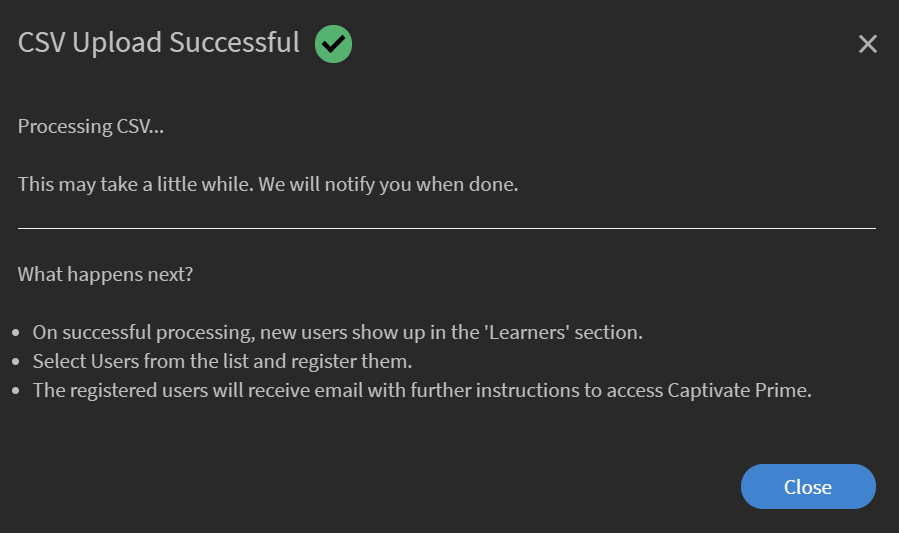

# Aggiungere utenti e creare gruppi di utenti

Scopri come aggiungere utenti o gruppi di utenti nell’applicazione Learning Manager.

<!---->

## Panoramica {#overview}

Nell’Adobe di Learning Manager, puoi assumere i seguenti ruoli:

* **Amministratore:** Un Amministratore definisce la strategia di formazione per l’organizzazione. Un Amministratore può aggiungere Allievi, cercare le abilità richieste per gli Allievi, gestire e assegnare corsi, creare piani di apprendimento, certificazioni e programmi di apprendimento e gestire report per l’intera organizzazione.
* **Autore:** Gli autori sono progettisti di istruzioni e creatori di contenuti. L’Autore può aggiungere moduli e corsi a Learning Manager.
* **Manager:** Un Manager gestisce le attività di apprendimento di un team. Un Manager può nominare i membri del team a seguire un corso, approvare le richieste dei membri del team e fornire feedback sulle prestazioni dei membri del team dopo il completamento del corso di formazione. I manager possono anche visualizzare i report per il proprio team per monitorare le prestazioni.
* **Allievo:** Gli Allievi possono accedere a corsi, programmi di apprendimento e certificazioni loro assegnate. Gli Allievi possono inoltre sfogliare tutti i corsi disponibili utilizzando un catalogo e iscriversi a corsi, programmi di apprendimento o certificazioni.

In qualità di Amministratore, puoi aggiungere utenti in tre modi:

* Interno
* Esterno
* Gruppi di utenti

## Aggiungere un singolo utente {#addasingleuser}

Per aggiungere utenti,

1. Accedi ad Adobe Learning Manager come Amministratore.
1. Nella home page fare clic su **[!UICONTROL Aggiungi utenti]**. In questa pagina puoi aggiungere uno o più utenti alla volta utilizzando un file CSV. Puoi anche creare un collegamento di registrazione autonoma per i dipendenti interni o un profilo Allievo esterno.
1. Per aggiungere un singolo utente, fare clic su **[!UICONTROL Aggiungi]** nell’angolo in alto a destra e scegli l’opzione **[!UICONTROL Utente singolo]**.

   
   *Aggiunta di un singolo utente interno*

1. Nella **[!UICONTROL Aggiungi utente]** immetti i dettagli dell’allievo. Per il campo **[!UICONTROL Nome del manager]**, scegli il nome di un utente esistente nel sistema.

   
   *Finestra di dialogo Aggiungi utente*

1. Per aggiungere il nuovo utente in Learning Manager, fai clic su **[!UICONTROL Aggiungi]**. Dopo che l&#39;utente è stato aggiunto, riceve un messaggio e-mail di verifica. L’Allievo quindi attiva l’account e inizia a utilizzare Learning Manager. Questo flusso di lavoro è utile se devi aggiungere un numero limitato di Allievi all’account Learning Manager. Ma se prevedi di iscrivere tutti i dipendenti di una grande organizzazione, puoi aggiungerli con un solo tentativo. Per ulteriori informazioni, consulta la sezione successiva.

## Aggiungere utenti in blocco {#addusersinbulk}

In genere, la maggior parte delle organizzazioni utilizza un sistema di gestione delle risorse umane (HRMS), che gestisce tutti i record dei dipendenti, ad esempio la designazione, l&#39;ubicazione, la data di adesione o la gerarchia dei dipendenti. Puoi esportare questi dati in formato CSV. Per importare un file CSV, procedi come segue:

1. Fai clic **[!UICONTROL Aggiungi]** nell’angolo in alto a destra e scegli l’opzione **[!UICONTROL Caricare un file CSV]**.

   
   *Caricare un file CSV per aggiungere utenti in blocco*

1. Il file CSV che carichi è composto dai campi riportati di seguito:

   
   *Struttura del CSV*

   È necessario mantenere un file CSV principale ed eseguire tutte le aggiunte e le eliminazioni nel file CSV principale. Il file CSV principale contiene i seguenti campi:

   * nome &#42;
   * email &#42;
   * profilo
   * manager

   (&#42;) Campo obbligatorio.

1. Dopo aver fatto clic sull’opzione **[!UICONTROL Caricare un file CSV]**, viene visualizzata la seguente finestra di dialogo.

   
   *Carica una finestra di dialogo CSV*

1. Scegli il file CSV o trascinalo. Dopo aver scelto il file, mappa i campi dati con quelli nel file CSV. Fai clic sul menu a discesa richiesto e scegli il campo corretto.

   
   *Mappare i campi nel file CSV*

1. Per iniziare a importare gli utenti, fai clic su **[!UICONTROL Salva]**. Viene visualizzato un messaggio di conferma.

   
   *Messaggio di conferma per il corretto caricamento del file CSV*

1. I nuovi utenti vengono ora aggiunti al tuo account Adobe Learning Manager. Per selezionare i nuovi utenti, selezionare la casella di controllo accanto ai nomi in modo che siano selezionati tutti gli utenti.

   
   *Nuovi utenti aggiunti*

>[!NOTE]
>
>Per ulteriori informazioni, consulta le Domande frequenti, [Aggiungere utenti in blocco](../add-users-in-bulk.md).

Dopo aver selezionato gli utenti, puoi eseguire le seguenti operazioni:

## Registrare un utente {#registerauser}

Con l&#39;utente selezionato, fare clic su **[!UICONTROL Azioni]** nell’angolo superiore destro e fai clic su **[!UICONTROL Registrati]**.

Gli utenti selezionati ricevono un messaggio e-mail di benvenuto. Se gli Allievi dispongono già di un Adobe ID esistente, possono fare clic su questo collegamento. Se non hanno un Adobe ID esistente, possono procedere facendo clic sul collegamento Benvenuti per creare un Adobe ID e collegarlo al proprio account Learning Manager.

## Assegnare un ruolo {#assignarole}

Se desideri modificare i ruoli degli Allievi che hai aggiunto all’account Adobe di Learning Manager, fai clic su Azioni nell’angolo superiore destro della pagina. Scegli l’opzione **[!UICONTROL Assegna ruolo]**. Qui puoi decidere se assegnare all’Allievo l’accesso come Autore o come Amministratore. Dopo aver assegnato un ruolo, questo Allievo ha accesso come Autore all’account e può aggiungere moduli e creare corsi.

*Assegnare un ruolo a un utente*

## Rimuovere un ruolo {#removearole}

Puoi anche rimuovere l’accesso Autore o Amministratore per gli utenti. Seleziona uno o più Allievi, fai clic su **[!UICONTROL Azioni]** e seleziona **[!UICONTROL Rimuovi ruolo]**. Scegli un’opzione, ad esempio: **[!UICONTROL Rimuovi autore]** e l’accesso come Autore viene revocato per questo Allievo.

>[!NOTE]
>
>Non è possibile assegnare manualmente un ruolo Manager a un utente del sistema. Ottengono automaticamente l’accesso al dashboard Manager quando uno o più dipendenti vengono aggiunti al di sotto di essi.

## Eliminare un utente {#deleteauser}

Per eliminare un utente, fare clic su **[!UICONTROL Azioni]** e scegli **[!UICONTROL Elimina utente]**. Nella finestra di dialogo di conferma, fai clic su **[!UICONTROL Sì]** e l’allievo viene eliminato.

*Messaggio di conferma per eliminare un utente*

## Modificare un utente {#editauser}

Nell’elenco degli utenti, scegli un utente e fai clic sull’utente. Nei dettagli utente, fai clic sul pulsante **[!UICONTROL Modifica]** ( ). Nella **[!UICONTROL Modifica utente]** , apportare le modifiche necessarie e, per salvarle, fare clic su **[!UICONTROL Salva]**.

*Finestra di dialogo Modifica utente*

## Flussi di lavoro per campi attivi e valori dei campi attivi, mantenendo la distinzione tra maiuscole e minuscole

In questa versione, Learning Manager mantiene la distinzione tra maiuscole e minuscole dell’attributo utente e del relativo valore. **Ad esempio**, la distinzione tra maiuscole e minuscole di un attributo utente è &quot;location&quot; e il suo valore &quot;PARIS&quot; viene mantenuto e visualizzato nello stesso modo. In caso di problemi, l’Amministratore può ora modificare il nome e i valori dell’attributo per correggere eventuali errori di distinzione tra maiuscole e minuscole.

L’Amministratore può eseguire questa operazione visitando **[!UICONTROL App per amministratori]** > **[!UICONTROL Utenti]** > **[!UICONTROL Gruppi di utenti]** e facendo clic sul nome del gruppo.

L’Amministratore può aggiungere e aggiornare i valori di attributo consentiti per un Allievo tramite l’interfaccia utente.

Tipi di campi attivi:

* Raggruppabile: gli Allievi vengono raggruppati in base ai valori
* Riportabile: i report dei gruppi di utenti vengono creati in base ai campi attivi
* Esportabile: i campi verranno visualizzati nel report esportato nel gruppo di utenti.

## Creare un collegamento di registrazione autonoma {#createaselfregistrationlink}

Puoi anche consentire ai dipendenti della tua organizzazione di registrarsi come Allievi all’Adobe dell’account Learning Manager, senza bisogno di assistenza da parte dell’Amministratore. L’Amministratore può creare un collegamento di registrazione autonoma e condividerlo con i dipendenti, che possono registrarsi ulteriormente a Learning Manager utilizzando le loro credenziali di Adobe.

Nell’angolo superiore destro della pagina, fai clic su **[!UICONTROL Aggiungi]** e scegli **[!UICONTROL Registrazione autonoma]**.

*Crea collegamento per l’iscrizione automatica come Allievo*

La **[!UICONTROL Aggiungi profilo di registrazione autonoma]** viene visualizzata la finestra di dialogo. Assegna un nome a questo profilo. Quindi aggiungi il nome del manager. È importante sapere che il Manager deve già essere registrato come Allievo in Learning Manager.

*Aggiungi profilo per registrazione autonoma*

Dopo aver fatto clic su **[!UICONTROL Salva]**, viene generato un URL, che puoi condividere con gli Allievi, in modo che possano fare clic sull’URL e registrarsi autonomamente.

## Iscrizione di allievi esterni {#enrollexternallearners}

Nell’Adobe di Learning Manager, puoi anche creare collegamenti di registrazione per partner esterni o agenzie con accesso limitato al tuo account e fornire materiale didattico.

Esistono alcune differenze tra le registrazioni interne ed esterne.

<table>
 <tbody>
  <tr>
   <td>
    
<b>Utenti interni</b>
</td>
   <td>
    
<b>Utenti esterni</b>
</td>
  </tr>
  <tr>
   <td>
    
Accedi utilizzando le credenziali Adobe ID o SSO.
</td>
   <td>
    
Accedi utilizzando un qualsiasi ID e-mail.
</td>
  </tr>
  <tr>
   <td>
    
È disponibile la gamification.
</td>
   <td>
    
La gamification non è disponibile.
</td>
  </tr>
  <tr>
   <td>
    
Sono disponibili gerarchie di allievi.
</td>
   <td>
    
Le gerarchie di allievi non sono disponibili.
</td>
  </tr>
 </tbody>
</table>

Per iscrivere utenti esterni, procedi come segue:

1. Nel riquadro di navigazione sinistro fare clic su **[!UICONTROL Esterno]**.

   

   *Iscrizione di utenti esterni*

1. Nell’angolo superiore destro della pagina, fai clic su **[!UICONTROL Aggiungi]**.
1. Nella **[!UICONTROL Aggiungi profilo di registrazione esterno]** , aggiungi i seguenti dettagli:

   * Il nome del profilo dell&#39;organizzazione partner.
   * Indirizzo e-mail del manager dell&#39;organizzazione partner.
   * Limite di posti per l&#39;iscrizione esterna per questo partner.
   * Data di scadenza: consente di impostare una scadenza per interrompere l&#39;autorizzazione di nuove registrazioni a questo gruppo. Dopo la data di scadenza, solo gli utenti registrati esistenti possono accedere a questo corso di formazione.

   

   *Finestra di dialogo Aggiungi profilo di registrazione esterno*

   * Nella **[!UICONTROL Impostazioni avanzate]** immetti quanto segue:

      * **[!UICONTROL Requisiti di accesso]:** Specificare un valore in giorni. Gli Allievi vengono eliminati se non accedono per la durata indicata.
      * **[!UICONTROL Domini consentiti]:** Un elenco separato da virgole di nomi di dominio e-mail inseriti nell’elenco Consentiti.
      * **[!UICONTROL Verifica e-mail richiesta]:** Seleziona questa opzione per rendere la verifica tramite e-mail obbligatoria per un Allievo.

   

   *Immetti i dettagli nella sezione Impostazioni avanzate*

1. Dopo aver fatto clic su **[!UICONTROL Salva]**, viene visualizzato il seguente messaggio di conferma. Devi condividere l&#39;URL con il tuo partner esterno.

   

## Abilitare un profilo esterno {#enableanexternalprofile}

Dopo la creazione di un profilo esterno, è necessario abilitarne lo stato. Dall’elenco dei profili esterni, scegli il profilo richiesto e attiva/disattiva il pulsante dello stato.

*Abilitare un profilo esterno*

Viene attivato il collegamento Iscrizione esterna. Un messaggio e-mail di benvenuto viene inviato automaticamente al partner. Puoi anche copiare il collegamento e condividerlo con loro facendo clic sull&#39;icona Copia URL (), oppure puoi inviare nuovamente l&#39;e-mail di benvenuto all&#39;organizzazione partner facendo clic sull&#39;icona E-mail ().

Il manager partner può condividere il collegamento con i dipendenti che devono seguire il corso di formazione in PrLearning Manager. Quando fanno clic sul collegamento, possono iscriversi autonomamente dopo aver compilato alcuni dettagli per creare il proprio profilo su Learning Manager. Questi utenti non verranno visualizzati nella scheda Allievi insieme ai dipendenti interni. I loro nomi sono visualizzati sotto la **[!UICONTROL Allievi esterni]** scheda.

## Mettere in pausa un profilo esterno {#pause}

Dopo aver aggiunto un gruppo di utenti esterni a Learning Manager, puoi anche mettere in pausa la procedura di registrazione degli utenti esterni. Quando si effettua una pausa, il processo di registrazione degli utenti esterni viene bloccato. Tuttavia, questo processo funziona solo quando gli utenti non si sono ancora registrati accettando l&#39;invito.

Per sospendere i gruppi di utenti esterni, scegli uno o più gruppi, fai clic su **[!UICONTROL Azioni]** nell&#39;angolo superiore destro della pagina e fare clic su **[!UICONTROL Pausa]**.

## Riprendere un profilo esterno {#resumeanexternalprofile}

In qualsiasi momento, puoi sempre revocare lo stato sospeso di un partner esterno e riprendere i normali servizi. Fai clic **[!UICONTROL Azioni]** nell’angolo in alto a destra della pagina e scegli **[!UICONTROL Riprendi]**.

I seguenti stati sono applicabili agli utenti esterni:

* **Stato inattivo** - In questo stato, la registrazione degli utenti esterni è scaduta. Gli amministratori impostano la data di scadenza per gli utenti esterni mentre li aggiungono tramite il flusso di lavoro Aggiungi utente.
* **Stato attivo** - In questo stato, gli utenti esterni possono registrarsi all’applicazione Learning Manager e accedere all’applicazione.
* **Pausa** - In questo stato, il processo di registrazione per gli utenti esterni viene bloccato. Tuttavia, gli utenti esistenti possono continuare ad accedere.

## Controllare i sedili usati {#checkusedseats}

Nell’elenco dei profili esterni, fai clic su **[!UICONTROL Posti occupati]**. Puoi visualizzare il numero di Allievi aggiunti nell’organizzazione partner.

*Controllare i sedili usati*

## Eliminare un utente {#Deleteauser-1}

Scegli un utente e fai clic su nell’angolo in alto a destra. **[!UICONTROL Azioni]** > **[!UICONTROL Elimina utente]**.

## Modifica profilo {#changeprofile}

Per spostare un utente in un altro profilo esterno, scegli un utente e fai clic su nell’angolo in alto a destra **[!UICONTROL Azioni]** > **[!UICONTROL Modifica profilo]**. Dall’elenco dei profili, scegli un profilo e fai clic su **[!UICONTROL Modifica]**.

## Assegnare un ruolo {#Assignarole-1}

Scegli un utente e fai clic su nell’angolo in alto a destra. **[!UICONTROL Azioni]** > **[!UICONTROL Assegna ruolo]** > **Crea`<role>`**. L&#39;utente ottiene un nuovo ruolo.

## Rimuovere un ruolo {#Removearole-1}

Scegli un utente e fai clic su nell’angolo in alto a destra. **[!UICONTROL Azioni]** > **[!UICONTROL Rimuovi ruolo]** > **Rimuovi`<role>`**. Il ruolo selezionato viene rimosso dall&#39;elenco dei ruoli assegnati all&#39;utente.

## Creazione di gruppi di utenti {#createusergroups}

Un gruppo di utenti è un gruppo di utenti associati a una categoria. I gruppi di utenti consentono agli amministratori di selezionare gli Allievi nella propria organizzazione in base ai loro attributi, quindi di assegnare loro i contenuti di apprendimento. Inoltre, questi gruppi di utenti consentono agli amministratori di assegnare loghi e cataloghi personalizzati agli Allievi e di mostrare report personalizzati sull’avanzamento.

Per accedere ai gruppi di utenti, fai clic su nel riquadro di navigazione a sinistra. **[!UICONTROL Gruppi di utenti]**.

*Creazione di gruppi di utenti*

Esistono due tipi di gruppi in Adobe Learning Manager: personalizzati e generati automaticamente. Quando aggiungi gli Allievi al tuo account, alcuni gruppi vengono creati automaticamente in base alle loro proprietà comuni.

Per visualizzare i gruppi creati automaticamente, fare clic sulla scheda **[!UICONTROL Generato automaticamente]**.

*Visualizza gruppi generati automaticamente*

È possibile notare che sono presenti gruppi diversi, come Tutti gli utenti interni, Tutti i manager, gruppi basati sul centro di costo, sul reparto e sui team dei manager.

Oltre ai gruppi generati automaticamente, puoi creare gruppi personalizzati. Per aggiungere un nuovo gruppo personalizzato, fai clic su nell’angolo superiore destro **[!UICONTROL Aggiungi]**.

1. Immetti il nome e la descrizione del gruppo.
1. Immetti il nome utente o il profilo nel campo di ricerca man mano che digiti e seleziona dall&#39;elenco a discesa per aggiungere gli utenti.
1. Per aggiungere altri Allievi, fai clic su **[!UICONTROL Aggiungi altri utenti].**
1. Per creare il gruppo di utenti, fai clic su **[!UICONTROL Salva]**.

Questo gruppo personalizzato viene ora creato e aggiunto al profilo. I gruppi di utenti creati sono di natura dinamica. Se vengono aggiunti nuovi utenti con attributi simili, questi vengono aggiunti automaticamente al gruppo di utenti.

## Esclusione di gruppi di utenti

A volte si desidera escludere un piccolo gruppo di utenti da un gruppo di utenti di grandi dimensioni. Questo è necessario per iscrivere questo specifico gruppo di utenti alla formazione tramite piani di apprendimento o per impostare la visibilità corretta dei cataloghi. In questa versione di Learning Manager, puoi escludere Allievi o gruppi di Allievi quando crei un gruppo di utenti personalizzato. Nella finestra di dialogo Aggiungi gruppo di utenti, la sezione Escludi Allievi consente di ottenere questo risultato.

*Escludi gruppi di utenti*

Ad esempio, se desideri impostare un piano di apprendimento in modo che tutti gli utenti che appartengono alla località = California tranne Store-5 (in California) vengano iscritti.

## Impostazioni avanzate {#advancedsettings}

## Origini dati {#datasources}

Puoi utilizzare questa funzione per importare/sincronizzare gli utenti o i dati di apprendimento dal database dell’organizzazione nell’applicazione Learning Manager. Puoi anche impostare la frequenza di questa sincronizzazione.

Fai clic **[!UICONTROL Origini dati]** nel riquadro sinistro sotto **[!UICONTROL Avanzate]** sezione.

*Origini dati per importare o sincronizzare gli utenti*

Scegliere il tipo di origine dati dal menu **[!UICONTROL Sorgente]** selezionare la frequenza di aggiornamento e fare clic su **[!UICONTROL Sincronizza]** se devi eseguire immediatamente la sincronizzazione o fai clic su **[!UICONTROL Salva].** I tipi di origini dati sono SFDC, FTP e così via per gli utenti interni.

È possibile aggiungere più origini dati.

## Campi attivi {#activefields}

Questa funzione consente agli amministratori di aggiungere altri campi attivi oltre a quelli forniti durante la registrazione dell’utente.

Fai clic **Campi attivi** disponibile nella pagina utenti. Gli Allievi possono scegliere solo tra i valori forniti nei valori personalizzati.

*Campi attivi*

### Configura campi {#configurefields}

**Utenti interni**

Puoi aggiungere un valore personalizzato per i campi utente per gli utenti interni.

Per aggiungere valori personalizzati, attieniti alla seguente procedura:

1. Fai clic  **[!UICONTROL Modifica valori]** per un utente interno.

   
   *Modificare i valori per gli utenti interni*

1. La **Valori nel campo Personalizzato** viene visualizzata la finestra di dialogo.

   
   *Finestra di dialogo Valori nei campi personalizzati*

1. Selezionate il valore da aggiungere dal menu **[!UICONTROL Seleziona campo]** menu a discesa.
1. Immettere i nuovi valori nella **[!UICONTROL Nuovo valore]** campo.
1. Fai clic **[!UICONTROL Fine]**.
1. Fai clic su Salva in alto a destra per **[!UICONTROL Salva]** modifiche.

**Utenti esterni**

Aggiungi valori personalizzati simili a quelli per gli utenti interni.

*Modificare i valori per gli utenti esterni*

### Impostazioni {#settings}

**Visualizzazione utente**

Se l’opzione **Mostra solo campi non compilati all’accesso degli Allievi** è attivata, l’utente visualizza solo i campi vuoti al momento dell’accesso.

*Mostra campi non compilati*

Utilizzando questa opzione, un Amministratore può decidere se desidera visualizzare i campi o nasconderli una volta compilati.

## Limita campi attivi nei report {#restrictactivefields}

Learning Manager 27.7 introduce due nuove opzioni: **[!UICONTROL Riportabile]** e **[!UICONTROL Esportabile]**, per i campi attivi.

*Opzioni nei campi attivi*

Per i campi CSV e i campi aggiunti manualmente, se un campo attivo è contrassegnato come **[!UICONTROL Riportabile]**, il campo attivo diventa ricercabile in un filtro all’interno di un report del dashboard.

*Filtri in un report del dashboard*

Se un campo attivo è contrassegnato come **[!UICONTROL Esportabile]**, quindi il campo attivo viene visualizzato nel file Excel al momento del download di qualsiasi report Excel.

Queste opzioni vengono visualizzate sia per i campi attivi interni che per quelli esterni.

È possibile eliminare solo un campo attivo personalizzato.

## Visualizzazione utente

Puoi nascondere l’intera pagina &quot;Completa il tuo profilo&quot; agli Allievi. Una volta che l’Allievo ha effettuato l’accesso, la pagina non verrà visualizzata.

Tieni presente che il comportamento predefinito esistente non cambia. Questa è una funzionalità opzionale ora disponibile per gli Amministratori.

Abilita le seguenti opzioni:

*Sezione Visualizzazione utente*

## Supporto per campi CSV manuali tramite connettori FTP e Box {#import-connector}

Spesso, gli utenti desiderano che i campi Attivi vengano forniti manualmente quando un Allievo accede a Learning Manager. Questo è possibile in Learning Manager al momento, quando l’utente importa manualmente un file CSV.

Il file CSV potrebbe non contenere tutti i campi Attivi. Per tutti i campi Attivi che non vengono aggiornati nel file CSV caricato, l’utente deve immettere i dati per tali campi Attivi.

Al momento, tutti i campi Attivi devono essere mappati ad alcuni campi del file CSV di origine.

Talvolta l’utente non desidera mappare un campo Attivo a un campo specificato nel file CSV. In questi casi, l’utente può mappare il campo Attivo sul valore **[!UICONTROL DontImportFromSource]**. Seleziona questo valore dall’elenco a discesa durante l’importazione degli utenti dai connettori FTP e Box.

## Ruoli personalizzati {#customroles}

Aggiungi qualsiasi campo di tua scelta come parte delle informazioni utente e fai clic su **[!UICONTROL Salva]**. Dopo aver aggiunto i campi, puoi anche controllare le disponibilità dei campi nel **[!UICONTROL Modifica utenti]** dialogo.

Dopo aver aggiunto i campi, puoi notare che i campi contrassegnati con il segno di spunta provengono dall’origine dati o dal file CSV come indicato nell’istantanea seguente. L’Amministratore può modificare questi campi di origine attivandoli o disattivandoli.

**Valori per campi attivi in Learning Manager**

I valori per i campi attivi vengono recuperati nei modi seguenti:

1. L’applicazione Learning Manager importa i metadati dalle origini dati associate al tuo account.
1. Metadati acquisiti dal file CSV importato manualmente.
1. Gli Allievi compilano i metadati all’accesso
1. L’Amministratore immette i dati per gli utenti.

>[!NOTE]
>
>L’applicazione Learning Manager crea automaticamente gruppi di utenti da questi metadati.

**Aggiungi valore personalizzato**

È possibile aggiungere un valore personalizzato per i campi utente nei campi utente interno ed esterno.

Per aggiungere valori personalizzati, attieniti alla seguente procedura:

I campi personalizzati possono essere aggiunti ed eliminati e sono applicabili a tutti gli utenti. I campi CSV possono essere abilitati o disabilitati; diventano effettivi solo quando carichi il file CSV dopo aver apportato le modifiche nei campi Attivi. Tutti i campi attivi interni sono applicabili a tutti i tipi di utenti interni. I campi esterni sono applicabili solo agli utenti esterni. Se un campo personalizzato è presente nel file CSV, al successivo caricamento viene convertito automaticamente in un campo CSV e viene abilitato.

## Valori per campi CSV {#valuesforcsvfields}

Gli utenti possono scegliere tra campi predefiniti per i campi CSV solo se **[!UICONTROL Limita selezione]** la casella di controllo è abilitata.

*Casella di controllo Limita selezione*

## Importa registri {#importlogs}

In questo spazio puoi visualizzare la cronologia delle importazioni CSV per gli utenti che l’amministratore ha aggiunto utilizzando la funzione di importazione in blocco. Potete anche fare clic su **Aggiungi** nell’angolo superiore destro della pagina per aggiungere utenti utilizzando la funzione di caricamento CSV.

## Campi attivi multivalore

Con questa funzione, puoi avere più di un campo per un campo attivo. In un account possono essere presenti al massimo tre campi attivi multivalore. I campi attivi multivalore sono disponibili sia per gli utenti interni che per quelli esterni.

Dopo aver contrassegnato un campo attivo come multivalore, non è possibile riconvertirlo in un campo a valore singolo. Questo è irreversibile.

Un campo a valore singolo esistente non può essere contrassegnato come campo multivalore.

Per creare un campo attivo multivalore, effettua le seguenti operazioni:

1. Aggiungi un campo attivo.

   
   *Aggiungi un campo attivo*

1. Fai clic su Aggiungi.
1. Nella scheda Impostazioni, contrassegna il nuovo campo come multivalore.

   
   *Contrassegna come multivalore*

   Esiste un&#39;altra casella di controllo, **[!UICONTROL Configurabile da parte dell’Allievo]** che, se disabilitata, non consente all’Allievo di visualizzare il campo nella pagina Profilo.

1. Aggiungi i valori utilizzando un file CSV o facendo clic su Modifica valori.

   
   *Aggiungi valori*

1. Fai clic [!UICONTROL **Fine**].

>[!NOTE]
>
>Una volta creato il gruppo di utenti e compilato il campo, non è possibile convertire valori multipli in valori singoli e viceversa.

### Aggiungi campo attivo multivalore tramite CSV

Segui i passaggi riportati di seguito:

1. Crea un file CSV con i nuovi campi attivi come colonne (valori singoli o separati da virgole).
1. Importa il file CSV.
1. Contrassegna i campi come multivalore nella finestra di dialogo Valori nei campi personalizzati.
1. Importa nuovamente il file CSV.

Il file CSV deve avere una colonna con lo stesso nome di un campo attivo contrassegnato come multivalore.

Il file CSV contiene i seguenti campi:

* **[!UICONTROL Utente]**: gruppi di utenti creati come ruoli.
* **[!UICONTROL Ruoli]**: campo attivo multivalore con valori.

Se il file CSV viene ricaricato con nuovi valori o con valori eliminati, anche i campi e i gruppi attivi vengono aggiornati di conseguenza.

### Report

Tutti i report includono i campi attivi multivalore e i relativi valori.

L’Amministratore può aggiungere campi attivi generati automaticamente e configurare i report di attività e formazione degli utenti.

Il report Trascrizione Allievo contiene tutti i campi attivi e i valori separati da virgole. L’Amministratore può quindi filtrare i dati di conseguenza.

## Domande frequenti {#faq}

+++Come si registra un utente in Learning Manager?

Dopo aver aggiunto un utente e aver assegnato un ruolo all&#39;utente, è possibile registrare l&#39;utente eseguendo i passaggi seguenti:

1. Con uno o più utenti selezionati, fare clic su **[!UICONTROL Azioni]** nell’angolo in alto a destra e fai clic su **[!UICONTROL Registrati]**.

1. Nella finestra a comparsa, fai clic su **[!UICONTROL Sì]**.

Gli utenti selezionati ricevono un messaggio e-mail di benvenuto. Se gli Allievi dispongono già di un Adobe ID esistente, possono fare clic su questo collegamento. Se non hanno un Adobe ID esistente, possono procedere facendo clic sul collegamento Benvenuti per creare un Adobe ID e collegarlo al proprio account Learning Manager.

Fare clic su uno di questi collegamenti nell’e-mail è obbligatorio per gli Allievi in quanto aiuta Learning Manager a verificare l’account dell’Allievo.

+++

+++Come si modificano i dati utente?

Per modificare un utente, procedi come segue:

1. Nell&#39;elenco degli utenti fare clic sull&#39;utente per il quale si desidera modificare i dati.
1. Fai clic sull’icona della matita, come illustrato di seguito.

Nella **[!UICONTROL Modifica utente]** , aggiorna i campi di conseguenza. Per salvare le modifiche, fai clic su **[!UICONTROL Salva]**.

+++

+++Come mettere in pausa e riprendere un utente esterno in Learning Manager?

Nell’elenco Utenti esterni, scegli l’utente da eliminare. Nell’angolo superiore destro, fai clic su **[!UICONTROL Azioni]** > **[!UICONTROL Pausa]**.

Per ulteriori informazioni, consulta [Mettere in pausa un profilo esterno](add-users-user-groups.md#pause).

Dopo aver messo in pausa un profilo, il profilo esterno visualizza lo stato come ***In pausa***.

+++

+++Come si invia un’e-mail di benvenuto al profilo esterno appena creato?

Quando aggiungi un utente esterno, nel **[!UICONTROL Aggiungi profilo di registrazione esterno]** immetti l’indirizzo e-mail del manager esterno. Quando fai clic su Salva, viene inviata un’e-mail di benvenuto all’indirizzo e-mail specificato. Per inviare nuovamente l’e-mail di benvenuto, fai clic sull’icona della busta, come illustrato di seguito:

+++

+++Come si creano gruppi di utenti personalizzati?

Fai clic **[!UICONTROL Utenti]** > **[!UICONTROL Gruppi di utenti]** e nella pagina Gruppi di utenti fare clic su **[!UICONTROL Aggiungi]**. Nella finestra di dialogo Aggiungi gruppo di utenti, aggiungi gli utenti sia individualmente che come team.

+++

+++Come si disabilitano i campi attivi già compilati?

Se desideri che gli Allievi visualizzino solo i campi attivi che non hanno compilato, segui i passaggi riportati di seguito:

1. Fai clic **[!UICONTROL Utenti]** > **[!UICONTROL Campi attivi]**.

1. Fai clic **[!UICONTROL Impostazioni]** e abilita l’opzione **[!UICONTROL Mostra solo campi non compilati all’accesso degli Allievi]**.

1. Fai clic **[!UICONTROL Salva]**.

+++

+++Come impedire agli Allievi di immettere valori casuali nei campi attivi?

Puoi limitare la selezione per gli Allievi in modo che possano selezionare solo i valori predefiniti e non inserire valori casuali. Segui i passaggi riportati di seguito:

1. Fai clic **[!UICONTROL Utenti]** > **[!UICONTROL Campi attivi]**.
1. Nella sezione **[!UICONTROL Configurare i campi]**, fare clic su **[!UICONTROL Modifica valori]**.

1. Abilita l’opzione **[!UICONTROL Limita selezione]**.
1. Fai clic **[!UICONTROL Fine]**.

+++

+++Come si distinguono i campi attivi CSV dai campi attivi personalizzati?

È possibile abilitare o disabilitare i campi CSV attivi, ma non eliminarli. Non è invece possibile attivare o disattivare i campi attivi personalizzati.

+++
