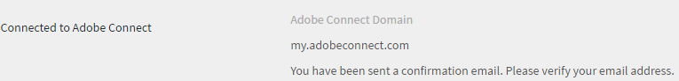
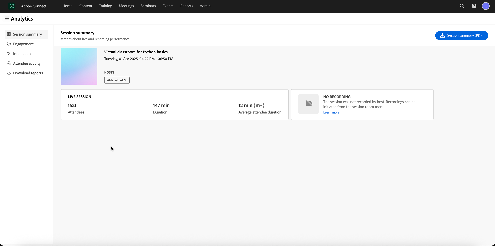

# Integrazione Adobe Connect

Gli Amministratori di un’organizzazione possono configurare le impostazioni dell’account Learning Manager per consentire l’integrazione Adobe Connect.

## Configurazione di Adobe Connect {#configureadobeconnect}

1. Nell’accesso come Amministratore, fai clic su **[!UICONTROL Impostazioni]** nel riquadro a sinistra per visualizzare le informazioni di base sulla tua azienda. Fai clic su **[!UICONTROL Adobe Connect]** nel riquadro a sinistra.

   

   *Seleziona Adobe Connect nel riquadro sinistro*

1. Fai clic sul collegamento **[!UICONTROL Configura ora]** nella sezione **[!UICONTROL Configurazione di Adobe Connect]**.

   <!---->

1. Fornisci il nome di dominio Adobe Connect della tua azienda e le credenziali di accesso.

   

   *Aggiungi nome di dominio e credenziali*

   URL di Adobe Connect di esempio: mycompany.adobeconnect.com\
   Devi fornire l’ID e-mail dell’Amministratore dell’account Adobe Connect.

   In Learning Manager sono supportati solo gli account Adobe Connect ospitati (hosted). Esempio: “.adobeconnect.com”.

1. Fai clic su **[!UICONTROL Integra].**

   Dopo l’autenticazione dell’ID e-mail, Learning Manager visualizza il messaggio quando Connect è integrato correttamente. Puoi iniziare a visualizzare i corsi in aula virtuale utilizzando Adobe Connect.

   L’Amministratore dell’account Adobe Connect deve accettare i termini e condizioni d’uso di Adobe Connect. In caso di mancata accettazione, l’autenticazione di accesso potrebbe non riuscire. Dopo averlo creato, accedi all’account Adobe Connect una volta. Al primo accesso, viene visualizzata una pagina di termini e condizioni.

   <!---->

## Aggiunta di informazioni alla sessione aula virtuale {#addvirtualclassroomsessioninformation}

Se l’Autore di un corso in aula virtuale non ha fornito le informazioni sulla sessione, l’Amministratore può includere dettagli sulla sessione.

Nell’accesso come Amministratore, fai clic sul nome del corso aula virtuale. Fai clic su **[!UICONTROL Istanze]** nel riquadro a sinistra e seleziona **[!UICONTROL Dettagli della sessione]**.  Fai clic sull’icona Modifica nell’angolo destro della pagina Dettagli sessione per aggiungere le informazioni sulla sessione.

*Aggiungi informazioni sessione aula virtuale*

Con l’integrazione di Adobe Learning Manager e Adobe Connect per la creazione di moduli o sessioni aula virtuale, il tuo account Connect dovrebbe supportare le sale riunioni con un numero di sale e utenti simultanei adeguato alle tue esigenze. Queste sale riunioni vengono utilizzate per ospitare i moduli aula virtuale di Learning Manager. Una nuova sala riunioni Connect viene creata in modo dinamico da Learning Manager per ciascun modulo o sessione aula virtuale all’interno di Learning Manager.

È necessario acquistare Adobe Connect e Adobe Learning Manager separatamente.

## Partecipazione degli allievi {#learnersattendance}

Se l’ospitante del corso in aula virtuale non partecipa alla sessione, la partecipazione non viene registrata automaticamente per gli Allievi che hanno partecipato alla sessione. In tali scenari, l’Amministratore può registrare manualmente la partecipazione.

Fai clic sul corso in aula virtuale, quindi su Partecipazione nel riquadro a sinistra della pagina seguente e registra la partecipazione.

## Supporto per seminari Adobe Connect con un vasto pubblico

Adobe Learning Manager supporta la selezione delle stanze dei seminari da Adobe Connect durante la configurazione di una sessione aula virtuale in Connect. In precedenza, l&#39;amministratore poteva selezionare solo il tipo di sala riunioni. Questa funzione consente all&#39;amministratore con una licenza per seminari valida di pianificare e gestire eventi unici o su larga scala (fino a 1.500 partecipanti) all&#39;interno di ALM.

Per ulteriori informazioni sulla sala seminari, consulta questo [articolo](https://helpx.adobe.com/adobe-connect/using/creating-seminars.html).

### Supporto per l’accesso all’analisi delle sessioni

Gli istruttori possono accedere ad Analisi delle sessioni per le sessioni Adobe Connect completate tramite un nuovo collegamento fornito nel dashboard della sessione.

_Selezionare l&#39;URL della sessione_

Questo collegamento apre il dashboard di analisi delle sessioni in Connect, che fornisce informazioni dettagliate sul coinvolgimento delle sessioni.
Questa funzione è disponibile solo per le sessioni condotte tramite Adobe Connect. L&#39;analisi della sessione include:

* **[!UICONTROL Coinvolgimento]**: panoramica delle prestazioni complessive della sessione dal vivo
* **[!UICONTROL Interazioni]**: suddivisione dettagliata dell&#39;attività dei partecipanti in diversi contenitori
* **[!UICONTROL Attività partecipante]**: riepilogo del coinvolgimento dei partecipanti
* **[!UICONTROL Scarica report]**: opzione per scaricare report per dati di coinvolgimento specifici del pod

_Dashboard di sessione_

Per ulteriori informazioni sull&#39;analisi delle sessioni, consultare questo [articolo](https://helpx.adobe.com/in/adobe-connect/using/session-dashboard.html).
