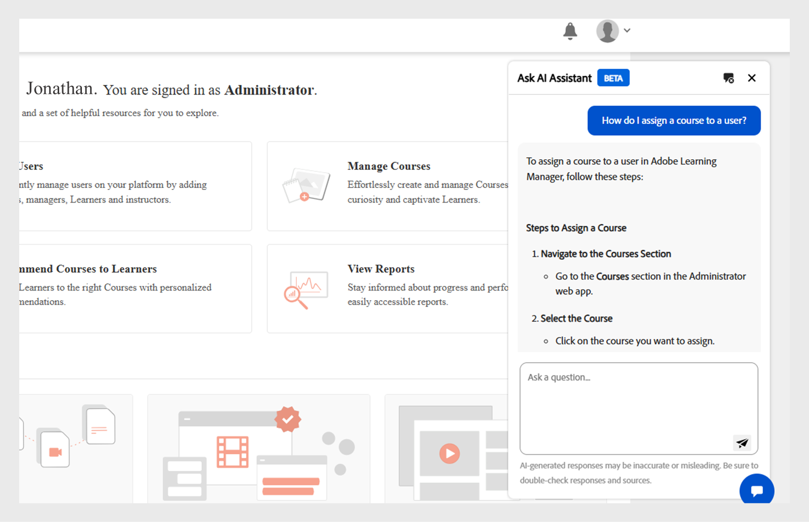
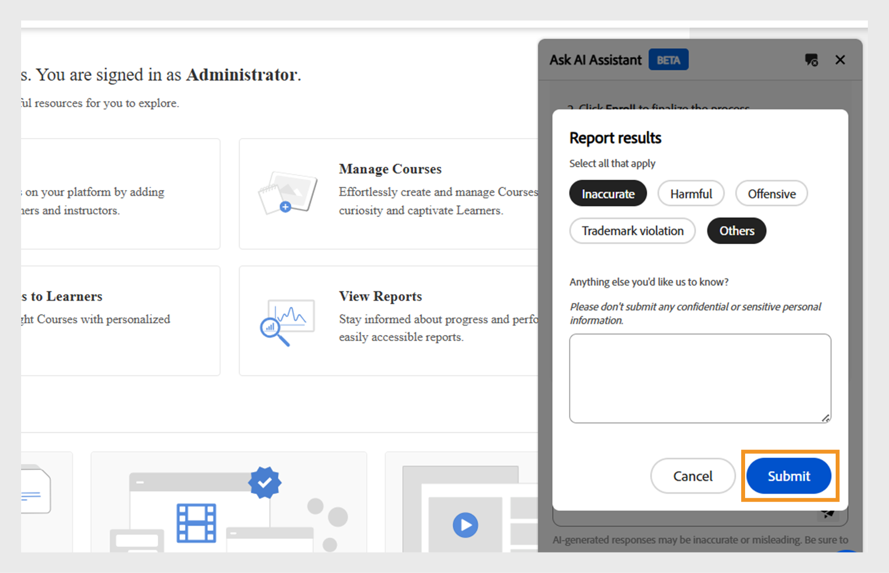

# Admin AI Assistant (beta) in Adobe Learning Manager

Nelle configurazioni di apprendimento complesse, gli Amministratori potrebbero avere difficoltà a trovare contenuti o completare attività a causa di menu complicati e flussi di lavoro disconnessi. Ad esempio, per attività come l’esecuzione di report o l’accesso a informazioni specifiche può essere necessario spostarsi su più schermate. Admin AI Assistant (beta) ti aiuta a trovare le informazioni giuste per comprendere e completare le attività in modo efficiente.

L’Assistente all’intelligenza artificiale di amministratore (Beta) in Adobe Learning Manager consente agli amministratori di trovare rapidamente risposte alle domande più comuni, esplorare le funzionalità del sistema e comprendere come completare l’attività chiave, semplicemente chiedendo in un linguaggio semplice. Che siate più o meno esperti di Adobe Learning Manager o cercate metodi più veloci per la risoluzione dei problemi, Admin AI Assistant (Beta) semplifica il flusso di lavoro fornendo assistenza in base al contesto direttamente nella piattaforma.

Utilizza le funzionalità di intelligenza artificiale di Adobe per abilitare le query nelle lingue naturali tra i contenuti di apprendimento e i flussi di lavoro di sistema.  Gli amministratori possono porre domande quali **Come aggiungere utenti a Adobe Learning Manager** o **Come aggiungere percorsi di apprendimento**. L&#39;Assistente all&#39;intelligenza artificiale di Adobe Learning Manager Admin (Beta) viene istruito esclusivamente sulla documentazione disponibile pubblicamente e di proprietà dell&#39;Adobe, ad esempio sulle risorse ospitate nell&#39;**[!UICONTROL Experience League]**. Non apprende né accede ai contenuti dei clienti, al materiale di formazione interno o ai dati generati dagli utenti.

Questo assistente riduce la dipendenza dalla navigazione manuale, riduce i tempi di individuazione e consente di visualizzare rapidamente informazioni utili.

<!--## Key benefits

* Perform common administrator tasks faster with conversational guidance.
* Get instant answers without browsing through extensive menus.
* Gain real-time insights and step-by-step guidance for administrative workflows.-->

>[!IMPORTANT]
>
>È disponibile solo per gli amministratori e attualmente supporta solo la lingua inglese.

## Privacy, sicurezza e governance

Admin AI Assistant (Beta) è stato progettato per garantire la sicurezza e la privacy dei dati. Ecco cosa ci si può aspettare:

* Admin AI Assistant (Beta) non utilizza dati personali, inclusi scopi di formazione.
* Non ha accesso ai dati di apprendimento o ai contenuti archiviati in Adobe Learning Manager.
* Admin AI Assistant (Beta) non accede né condivide alcuna informazione identificabile personalmente (PII) e non condivide informazioni private o sensibili.
* Eventuali messaggi di richiesta forniti dagli utenti, ad esempio domande o query, non vengono condivisi con altri clienti.

>[!IMPORTANT]
>
>Admin AI Assistant (Beta) verrà implementato in fasi, con i clienti che riceveranno un preavviso di due settimane. Per assistenza, contatta il tuo Customer Success Manager (CSM).

## Come accedere ad Admin AI Assistant (Beta)

Segui questi passaggi per avviare Admin AI Assistant (Beta):

1. Accedi come Amministratore.
2. Seleziona l&#39;icona Chat per avviare Admin AI Assistant (Beta).

   
   _Selezionate il fumetto della chat per avviare Admin AI Assistant (Beta)_

   >[!NOTE]
   >
   >Quando avvii Admin AI Assistant (Beta) per la prima volta, devi fornire il tuo consenso prima di utilizzarlo. La finestra di dialogo di consenso verrà visualizzata solo durante questo avvio iniziale. Per tutti gli avvii successivi, verrai indirizzato direttamente all&#39;Assistente AI amministratore (Beta) per inserire le tue richieste.

3. Seleziona **[!UICONTROL Introduzione]**. Ora è possibile utilizzare Admin AI Assistant (beta).

   
   _Richiedi accettazione dei criteri di utilizzo prima del primo utilizzo_

## Come utilizzare Admin AI Assistant (Beta)

Per utilizzare Admin AI Assistant (Beta):

1. Digita il messaggio e premi **[!UICONTROL Invio]**. La risposta viene visualizzata in Admin AI Assistant (Beta).

   
   _Query di esempio e risposta di Admin AI Assistant (beta)_

### Suggerimenti di esempio

Di seguito sono riportati alcuni esempi di prompt che gli amministratori possono utilizzare per utilizzare in modo efficace Admin AI Assistant (Beta):

* **Assegnare un corso a un utente**
   * **Messaggio**: &quot;Come si assegna un corso a un utente?&quot;

  
  _Risposta alla richiesta Come si assegna un corso a un utente_

* **Ultimo report di iscrizione**
   * **Richiedi**: visualizza il report di iscrizione più recente.

  
  _Risposta al prompt Visualizza il report di iscrizione più recente_

* **Eliminare un utente**
   * **Messaggio**: &quot;Come posso eliminare un utente?&quot;

  
  _Risposta al prompt Come posso eliminare un utente_

### Suggerimenti per l’utilizzo efficace di Admin AI Assistant (Beta)

* **Specifici con le tue richieste**: quando fai una domanda, includi un contesto chiaro e dettagli. Ad esempio, invece di chiedere &quot;Come si aggiunge un utente in Adobe Learning Manager?&quot;, chiedi &quot;Come si assegna un corso a un utente in Adobe Learning Manager?&quot;
* **Usa un linguaggio chiaro e conciso**: mantieni le tue domande chiare e mirate. Questo aiuta Admin AI Assistant (Beta) a capire il tuo intento e fornire una risposta più accurata.
* **Esplora diverse funzionalità**: chiedi informazioni su diverse funzionalità, come i report di iscrizione, l’avanzamento degli Allievi, l’assegnazione dei contenuti o il tracciamento delle certificazioni per scoprire l’intera gamma di supporto disponibile.
* **Invia feedback**: dopo aver ricevuto una risposta, segnalaci se è stata utile. Usa le funzioni Pollice in alto, Pollice in basso, Report o Commento per condividere il tuo feedback. Il feedback è fondamentale per migliorare l&#39;Assistente.

## Fornisci feedback sulle risposte di Admin AI Assistant (Beta)

Il tuo feedback sulle risposte generate da Admin AI Assistant (beta) aiuta a migliorarne l&#39;accuratezza, la pertinenza e le prestazioni complessive.

### Mettere Mi piace o Non mi piace a una risposta

* Seleziona **[!UICONTROL Pollice in alto]** se la risposta è stata utile e precisa.
* Selezionare **[!UICONTROL Pollice giù]** se la risposta non è corretta o non è utile.

### Contrassegnare una risposta

Segui questi passaggi per contrassegnare una risposta:

1. Selezionare **[!UICONTROL Contrassegno]** alla fine della risposta.

   
   _Selezionare il report nella schermata dell&#39;Assistente all&#39;intelligenza artificiale dell&#39;amministratore_

2. Selezionare uno o più motivi, aggiungere commenti se necessario, quindi selezionare **[!UICONTROL Invia]**.

   
   _Gli amministratori valutano la risposta con il pollice in alto o in basso con commenti facoltativi_

Adobe utilizza questo feedback per migliorare Admin AI Assistant (Beta) nel tempo.

## Domande frequenti

+++Posso utilizzare Admin AI Assistant (Beta) come Allievo?

N. Questo assistente è disponibile solo per gli amministratori.

+++

+++È disponibile nell&#39;app per dispositivi mobili?

Non ancora.

+++

+++Può eseguire azioni di amministrazione?

N. Admin AI Assistant (Beta) fornisce solo indicazioni.

+++

+++Supporterà più lingue?

Il team di Adobe Learning Manager sta valutando il supporto multilingue per gli aggiornamenti futuri.

+++
