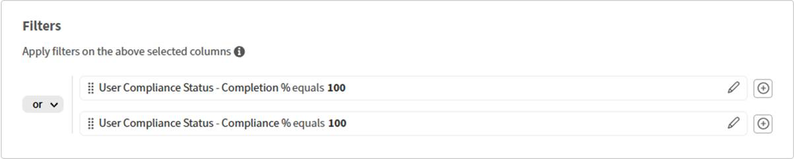

# Aggiungere e combinare i filtri in un report

I filtri consentono di definire esattamente l’ambito del report in base ai record necessari. Potete applicare un singolo filtro, combinare più filtri con logica AND o OR e creare gruppi nidificati per condizioni complesse.

## Aggiungi un filtro

Utilizzare i filtri per limitare il report a un sottoinsieme di dati specifico invece di visualizzare tutto.

Ad esempio, potresti voler capire quanti Allievi si sono iscritti ai corsi negli ultimi 365 giorni. In questo caso, per includere solo l’attività recente, applicherai un filtro per data alla data di iscrizione.

1. Avvia Report Builder e seleziona **Crea report**.
2. Digitare il nome e la descrizione del report\.
3. Selezionare le colonne seguenti: &lt;`dataset>:<column name>`
a. Data di iscrizione
b. Nome-Utente
   
4. Nella sezione Report, seleziona **Aggiungi filtro**.
5. Cercare o selezionare il campo in base al quale si desidera filtrare i dati. In questo esempio, selezionare **Data di iscrizione**.
   
6. Seleziona **Aggiungi**.
7. Selezionare un operatore. Gli operatori disponibili dipendono dal tipo di dati del campo:
a. Campi stringa — contiene, equivale a, inizia con
b. Campi numerici - maggiore di, minore di, uguale a, tra
c. Campi data: uguale a, prima, dopo, tra, ultimi N giorni
d. Campi elenco (enum) - sono in, non sono in
8. In questo caso, seleziona **rientra nell&#39;ultimo anno**.
   
9. Selezionate **Salva report** e selezionate **Azioni** > **Scarica** per scaricare il report.

Il report scaricato elenca tutti gli utenti iscritti a un oggetto di apprendimento negli ultimi 365 giorni.

### Aggiungere più filtri con logica AND/OR

Quando aggiungete un secondo filtro, la relazione predefinita tra i filtri è AND; affinché una riga venga visualizzata, entrambe le condizioni devono essere vere.

Ad esempio, potresti voler identificare gli Allievi iscritti ai corsi negli ultimi 365 giorni E fare rapporto a un Manager specifico. In questo caso, entrambe le condizioni devono essere vere, in modo che i filtri vengano combinati utilizzando la logica AND.

1. Avvia Report Builder e seleziona **Crea report**.
2. Digitare il nome e la descrizione del report.
3. Selezionare le colonne seguenti: `<dataset>:<column name>`
a. Nome-Utente
b. Nome utente-manager
c. Data di iscrizione
   

4. Raggruppa in base alla colonna **User-Manager Name**.
5. Nella sezione **Filtro**, seleziona i seguenti filtri:
a. La data di iscrizione **è compresa nell&#39;ultimo anno**
b. Il nome utente-manager **inizia con N**
c. Il nome utente-manager **non è vuoto**
   
6. Selezionate **Salva report** e selezionate **Azioni** > **Scarica** per scaricare il report.

Il report scaricato elenca tutti gli utenti iscritti a un oggetto di apprendimento negli ultimi 365 giorni e segnala a un Manager il cui nome inizia con N.

### Creare gruppi di filtri nidificati

I gruppi nidificati consentono di creare condizioni con più livelli logici, equivalenti alle parentesi quadre in una formula\. Ad esempio: (Catalogo = Sicurezza O Catalogo = Igiene) AND La data di completamento è negli ultimi 90 giorni.

Utilizzare i gruppi di filtri nidificati quando la logica include una combinazione di condizioni AND e OR che devono essere valutate insieme.

Ad esempio, utilizza la logica del filtro nidificato per identificare iscrizioni incomplete per le quali gli Allievi hanno compiuto progressi al di sotto del 50% o hanno terminato un corso di formazione, dimostrando come funzionano insieme le condizioni AND e OR.

1. Avvia **Report Builder** e seleziona **Crea report**.
2. Digitare il nome e la descrizione del report.
3. Selezionare le colonne seguenti: `<dataset>:<column name>`
a. Iscrizione - Stato
b. Iscrizione - Percentuale avanzamento
c. Iscrizione - Scaduta
   
4. Nella sezione **Filtro**, seleziona i seguenti filtri:
a. Lo stato di registrazione **non corrisponde a nessuno di** completato.
b. Seleziona **+**.
c. Cerca la percentuale di avanzamento dell&#39;iscrizione.
d. Selezionare il filtro.
e. Seleziona **Aggiungi come gruppo**.
   
f. Aggiungi percentuale di avanzamento iscrizione **inferiore a** 50
   
g. Seleziona **+**.
h. Cerca Iscrizione scaduta.
i. Selezionare il filtro.
j. Seleziona **Aggiungi come gruppo**.
   
k. Aggiungi iscrizione scaduta è uguale a TRUE.
l. Impostare AND nidificato su OR.
   
5. Selezionate **Salva report** e selezionate **Azioni** > **Scarica** per scaricare il report.

Il report scaricato elenca tutte le iscrizioni in corso o non avviate, con una percentuale di avanzamento inferiore al 50% o scadute.
