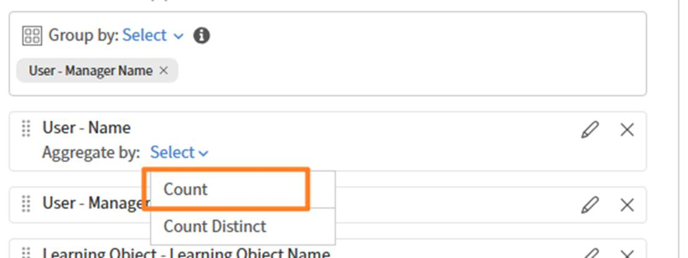

# Ordina colonne report nel Report Builder

L&#39;ordinamento determina l&#39;ordine delle righe nel file di report scaricato\. Applica l’ordinamento ogni volta che è importante un output coerente.

## Aggiungere un ordinamento

In questo esempio, scoprirai i corsi con i completamenti più elevati.

1. Avvia Report Builder e seleziona **Crea report**.
2. Digitare il nome e la descrizione del report.
3. Selezionare le colonne seguenti: `<dataset>:<column name>`
a. Oggetto di apprendimento - Nome dell’oggetto di apprendimento
b. Oggetto di apprendimento - Stato dell’oggetto di apprendimento
c. Oggetto di apprendimento - Conteggio completamenti
4. Nella sezione Ordinamento, seleziona **Aggiungi ordinamento**.
5. Seleziona **Oggetto di apprendimento - Conteggio completamenti**.
6. Selezionare un ordinamento **Crescente** o **Decrescente**.
   
7. Seleziona **Aggiungi**.
8. Selezionate **Salva report** e selezionate **Azioni** > **Scarica** per scaricare il report.

Nel report scaricato sono elencati tutti i record, ordinati in base al numero di completamenti del corso.

## Aggiungere l’ordinamento a più colonne

In questo esempio verrà generato un report per misurare le prestazioni tra i Manager.

Per eseguire l&#39;ordinamento in base a più colonne:

1. Avvia **Report Builder** e seleziona **Crea report**.
2. Digitare il nome e la descrizione del report.
3. Selezionare le colonne seguenti: `<dataset>:<column name>`
a. Utente - Nome
b. Utente - Nome Manager
c. Trascrizione modulo - Stato
d. Trascrizione modulo - Percentuale avanzamento
4. Aggiungere gli aggregati seguenti:
a. Raggruppa per utente - Nome del manager
b. Conteggio utenti distinti - Nome
c. Count If=Trascrizione modulo COMPLETATO - Stato
d. Trascrizione media del modulo - Percentuale avanzamento
   
5. Nella sezione **Ordinamento**, aggiungi il seguente ordinamento a più colonne:
a. Trascrizione modulo - Stato: Decrescente
b. Utente - Nome del manager: Crescente
   
6. Seleziona Salva report e seleziona Azioni > Scarica per scaricare il report.

Il report scaricato fornisce un riepilogo delle prestazioni per il Manager, mostrando conteggi degli Allievi distinti, conteggi delle iscrizioni basati sullo stato e percentuali medie di avanzamento. Vengono evidenziati i livelli di partecipazione e i progressi della formazione tra i diversi gruppi di manager.
