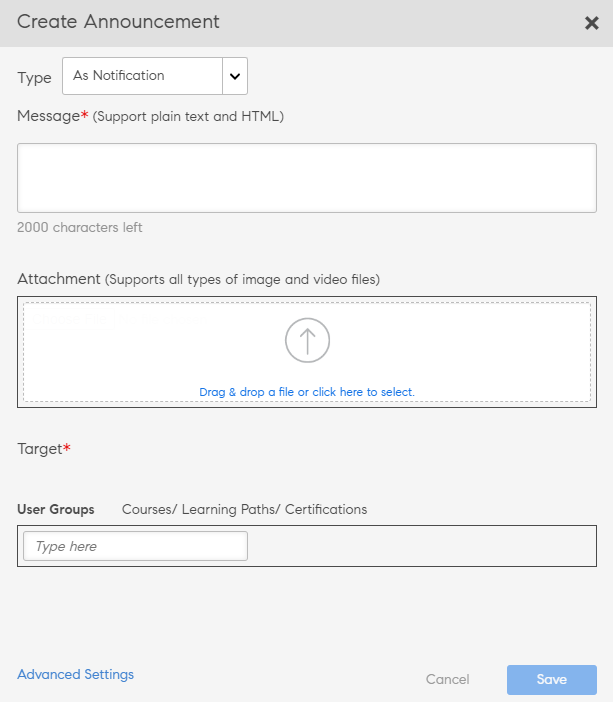

# Annunci

Un annuncio è un messaggio multimediale (testo, immagine o video) che un Amministratore trasmette a un insieme di utenti definito.

L’Amministratore può trasmettere gli annunci agli Allievi informandoli dell’occorrenza di un evento o di un’attività. L’annuncio può essere una combinazione di testo, immagini o video. È possibile collegare a un annuncio oggetti di apprendimento quali corsi, programmi di apprendimento e certificazioni.

Esistono quattro tipi di annunci:

* Notifica
* Masthead
* Consiglio
* E-mail

## Notifica {#notification}

1. Come amministratore, fai clic su Annunci nel riquadro a sinistra.
1. Fai clic su Aggiungi nell’angolo in alto a destra della pagina.
1. Dall’elenco a discesa Tipo, seleziona l’opzione **Come notifica**.

*Personalizzare la notifica*

1. Nel campo Messaggio, aggiungi il messaggio per l’annuncio. In questa sezione puoi anche aggiungere un URL per gli annunci. Tuttavia, devi aggiungere l’URL nel modulo HTML.

   Ad esempio, `code <a href="http://www.w3schools.com" target="_blank">Visit W3Schools</a>.`

   Se specifichi la destinazione come vuota, quando un utente fa clic sull’URL dell’annuncio, il collegamento si apre in una scheda nuova. Se non specifichi la destinazione, il collegamento si apre nello stesso browser.

1. Puoi aggiungere allegati, ad esempio immagini o file video, all’annuncio.
1. Scegli i gruppi di utenti di destinazione o gli oggetti di apprendimento di destinazione. Puoi sceglierne solo uno per annuncio.

   Inizia a digitare il nome del gruppo di utenti nella casella di testo e scegli l’opzione desiderata dall’elenco a discesa. Allo stesso modo, scegli il corso di formazione digitando il nome dell’oggetto nella casella di testo.

1. Fate clic su Impostazioni avanzate nella finestra di dialogo. Puoi eseguire le azioni seguenti:

   * Rendi l’annuncio un annuncio Sticky, selezionando la casella di controllo Abilita annuncio Sticky.
   * Seleziona il termine di consegna per l’annuncio.

1. Seleziona **[!UICONTROL In una data]** se desideri pianificare un annuncio per una data successiva e fai clic sull&#39;area di testo accanto ad esso. Viene visualizzata una finestra a comparsa del calendario, dove puoi scegliere la data di inizio. Scegli la data di fine seguendo gli stessi passaggi.
1. Fai clic su **[!UICONTROL Salva]**.
1. Nella scheda Bozze fare clic sull&#39;icona delle impostazioni accanto a un annuncio e quindi su invia.

Se l’allegato multimediale è di grandi dimensioni, caricarlo potrebbe richiedere tempo. Dopo aver fatto clic su Salva, riceverai un messaggio a comparsa con un messaggio durante l’elaborazione del caricamento. Riceverai una notifica al termine del caricamento dell’allegato.

## Masthead {#masthead}

Se scegli questa opzione, tutti i file multimediali selezionati sono evidenziati come masthead nella pagina principale dell’Allievo. Il masthead è come una richiesta di intervento da parte degli Allievi cui è rivolta.

*Personalizzare il masthead*

1. Sfoglia e scegli un’immagine per rappresentare il masthead. La dimensione consigliata è 1280 x 360 px.
1. Scegli le impostazioni locali cui aggiungere il masthead. Scegli una risorsa masthead per ogni lingua.
1. Nel campo dei **[!UICONTROL pulsanti azione]**, aggiungi un URL in modo che gli Allievi che lo selezionano nel masthead vengano reindirizzati all’URL. Questo campo è opzionale.
1. Scegli i gruppi di utenti di destinazione o gli oggetti di apprendimento di destinazione. Puoi sceglierne solo uno per annuncio.

   Inizia a digitare il nome del gruppo di utenti nella casella di testo e scegli l’opzione desiderata dall’elenco a discesa. Allo stesso modo, scegli il corso di formazione digitando il nome dell’oggetto nella casella di testo.

1. Nella sezione **[!UICONTROL Impostazioni avanzate]** sono disponibili le seguenti opzioni:

   * Fai clic su **[!UICONTROL Immediatamente]** per pubblicare subito l’annuncio.
   * Fai clic su **[!UICONTROL Mai]** se non desideri che l’annuncio scada.
   * Seleziona le date **[!UICONTROL Inizio]** e **[!UICONTROL Fine]** per l&#39;annuncio.

   

   *Impostare il tempo di visualizzazione di un masthead*

**Esiste un limite al numero di annunci Masthead live?**

Verranno visualizzati solo gli ultimi 10 annunci Masthead.

## Consiglio {#recommendation}

Se scegli questa opzione, tutti i corsi di formazione che hai scelto vengono consigliati a determinati gruppi di utenti. I suggerimenti sono guidati da un algoritmo di apprendimento automatico.

*Selezionare il corso di formazione consigliato da visualizzare per un Allievo*

1. Scegli il corso di formazione che vuoi consigliare agli Allievi. È possibile aggiungere fino a 10 corsi di formazione.

   Gli Allievi visualizzeranno esclusivamente i corsi di formazione rispetto ai quali l’iscrizione sia stata annullata nei Suggerimenti dell’Organizzazione. In base alla visibilità del catalogo, l’Allievo ha accesso per visualizzare il corso di formazione.

1. Scegli i gruppi di utenti di destinazione o gli oggetti di apprendimento di destinazione. Puoi sceglierne solo uno per annuncio.

   Inizia a digitare il nome del gruppo di utenti nella casella di testo e scegli l’opzione desiderata dall’elenco a discesa. Allo stesso modo, scegli il corso di formazione digitando il nome dell’oggetto nella casella di testo.

1. Nella sezione Impostazioni avanzate sono disponibili le opzioni seguenti:

   * Fai clic su **[!UICONTROL Immediatamente]** per pubblicare subito l’annuncio.
   * Fai clic su **[!UICONTROL Mai]** se non desideri che l’annuncio scada.
   * Seleziona le date **[!UICONTROL Inizio]** e **[!UICONTROL Fine]** per l&#39;annuncio.

   <!---->

Quando fai clic su **[!UICONTROL Salva]**, puoi scegliere se pubblicare l’annuncio subito o in un secondo momento. Fino a quel momento, l’annuncio sarà nello stato Bozza.

* Masthead/Suggerimenti non attivano alcuna notifica.
* Masthead/Suggerimenti non vengono visualizzati nel report relativo agli annunci.

## Elenco Bozze, Pianificati e Inviati {#draftscheduledandsentlist}

Nel login di Amministratore, puoi visualizzare tutti gli annunci in tre schede, ad esempio Bozze, Pianificato e Inviato.

<!---->

### Bozze {#draft}

Nella scheda Bozze è possibile visualizzare tutti gli annunci creati da un amministratore ma non ancora trasmessi o non ancora programmati per la trasmissione.

Per impostazione predefinita, tutti gli annunci sono impostati per la trasmissione immediata. Se scegli l’opzione Impostazioni > Invia per un annuncio non pianificato, questo viene trasmesso immediatamente. Per pianificare la trasmissione di un annuncio, scegli la data di inizio e di fine nelle Impostazioni avanzate.

### Pianificati {#scheduled}

Nella scheda Pianificati, puoi visualizzare tutti gli annunci pianificati per la trasmissione in una data successiva.

### Inviato {#sent}

Nella scheda Inviati, puoi visualizzare tutti gli annunci già trasmessi.

## Come e-mail

Utilizza questa opzione per inviare e-mail ad hoc agli Allievi di un gruppo di utenti selezionato o agli Allievi iscritti a un corso di formazione specifico.

*Inviare e-mail ad hoc mirate agli Allievi*

*L&#39;amministratore crea un annuncio tramite e-mail*

1. Seleziona **[!UICONTROL Digita e-mail]**.
1. Immetti l’oggetto e il corpo del messaggio.
1. Nella sezione Destinatari, puoi:

   * Selezionare un gruppo di utenti OPPURE
   * Selezionare un corso. Se il corso contiene più istanze, puoi selezionare l’istanza richiesta.

1. Fai clic su **[!UICONTROL Salva]**.
