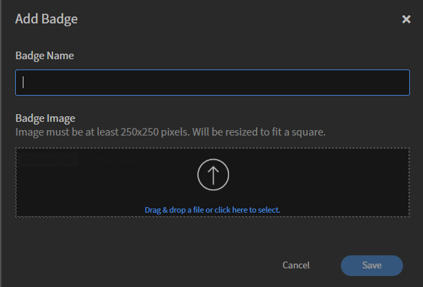

# Distintivi

I distintivi sono unità di misura dei risultati raggiunti che gli allievi ottengono al completamento di un corso. Adobe Learning Manager introduce uno dei concetti di e-learning più avanzati, ovvero i Distintivi. I professionisti di tutto il mondo utilizzano questi distintivi per rappresentare un’abilità particolare o un risultato di apprendimento.

Puoi definire i distintivi per motivare gli utenti.

Come amministratore, puoi creare i distintivi per gli Allievi nel modo seguente:

1. Accedi come Adobe Learning Manager come Amministratore.
2. Seleziona **[!UICONTROL Distintivi]** nel riquadro sinistro. Viene visualizzato un elenco di distintivi per l’Allievo.

   >[!NOTE]
   >
   >Per impostazione predefinita, è disponibile un elenco di alcuni distintivi di esempio.

3. Seleziona **[!UICONTROL Aggiungi]** nell&#39;angolo superiore destro della pagina. Viene visualizzata la finestra di dialogo **[!UICONTROL Aggiungi distintivo]**.

   

   *Aggiungere un nome badge e la relativa immagine*

4. Digita il **[!UICONTROL nome distintivo]**. Carica il distintivo facendo clic su **[!UICONTROL Carica distintivo]**, quindi fai clic su **[!UICONTROL Salva]**.

>[!NOTE]
>
>Contatta il team di supporto Adobe Learning Manager all’indirizzo [learningmanagersupport@adobe.com](mailto:learningmanagersupport@adobe.com) per aggiungere distintivi o certificati personalizzati per gli Allievi al completamento di corsi o percorsi di apprendimento.

