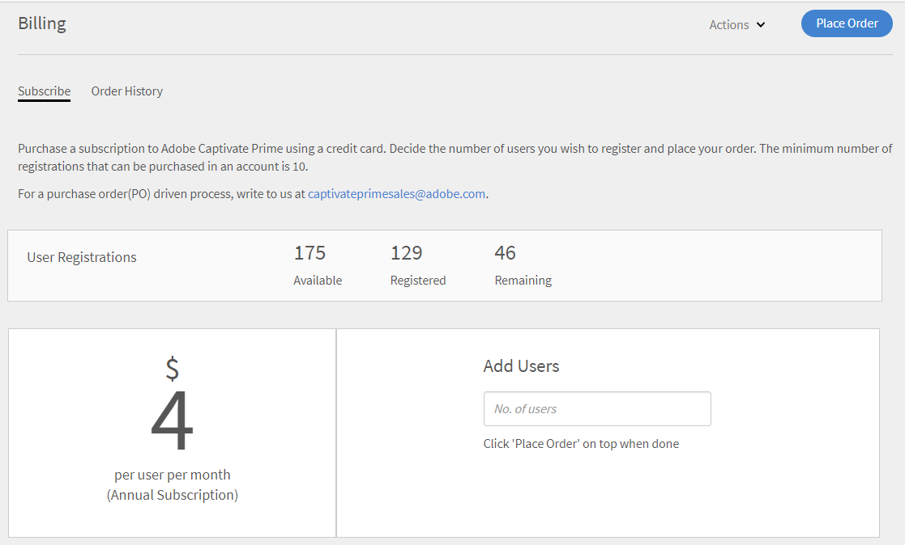
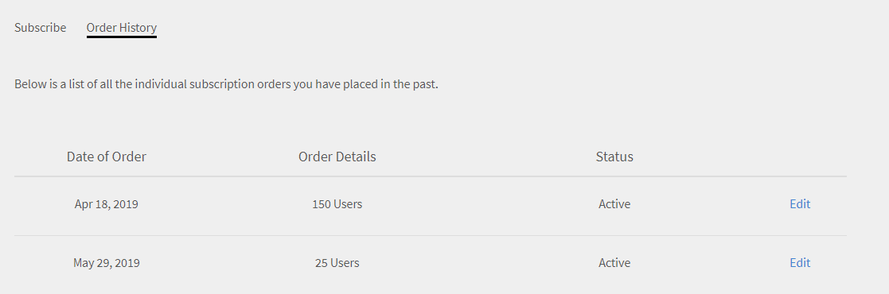

# Gestione degli ordini e della fatturazione di Learning Manager

L’acquisto con carta di credito è disponibile solo nella [regione statunitense](http://learningmanager.adobe.com/).

Gestisci la fatturazione di Learning Manager, effettua ordini utilizzando una carta di credito, iscriviti utilizzando un ordine d’acquisto o tramite un piano per utenti attivi mensili.

Il modello di prezzo di Adobe Learning Manager è flessibile, orientato al cliente e uno dei migliori per soddisfare le esigenze della tua organizzazione. Per ulteriori informazioni, consulta la pagina di [Learning Manager](https://www.adobe.com/products/learningmanager.html).

Solo gli Amministratori della tua organizzazione possono gestire la fatturazione.

Se desideri contattare Adobe per ulteriori informazioni sull’abbonamento e sulla fatturazione di Learning Manager, scrivici a [learningmanagersales@adobe.com](mailto:learningmanagersales@adobe.com).

## Effettuare ordini usando le carte di credito {#placeordersusingcreditcards}

È possibile acquistare un abbonamento per un massimo di 3500 studenti attraverso qualsiasi ordine di pagamento con carta di credito. Il primo ordine nell’account deve essere per un minimo di 10 Allievi.

1. Nell’app di amministrazione, fai clic su **[!UICONTROL Fatturazione]** nel riquadro di navigazione sinistro.

   

   *Avvia fatturazione Adobe Learning Manager*

1. Nella pagina **[!UICONTROL Informazioni di fatturazione]**, aggiungi il numero di utenti nel campo **[!UICONTROL Aggiungi utenti]**. Quando si utilizza una carta di credito per gli abbonamenti prepagati, è possibile visualizzare il numero di utenti che si possono aggiungere per l’abbonamento. Il numero di utenti che puoi aggiungere non deve superare il numero indicato nella sezione Remaining.1.

   

   *Aggiungi numero di utenti*

1. Dopo aver specificato il numero di utenti da aggiungere, fai clic su Effettua ordine nell’angolo in alto a destra della pagina.

   

1. Valuta il preventivo che appare sullo schermo.

   

   *Effettuare un ordine*

   La quota annuale di abbonamento viene calcolata in base al numero di utenti aggiunti per l’abbonamento. Ad esempio, se vengono aggiunti quattro utenti, la quota annuale viene calcolata utilizzando l’espressione 4 utenti X 4 $ X 12, che restituisce un importo di 192 $.

   Fai clic su **[!UICONTROL Procedi]**.

   *Verifica il preventivo*

1. Nella pagina Dettagli di pagamento è possibile visualizzare il prezzo stimato dell’ordine. La valuta viene visualizzata in base alla lingua corrente.

   

   *Visualizza dettagli pagamento*

   È inoltre possibile modificare le impostazioni internazionali scegliendo il paese dall’elenco a discesa.

   

   *Selezionare il paese di fatturazione*

1. Inserisci le tue informazioni di contatto, scegli il tipo di carta di credito e fornisci i dettagli della carta di credito. Dopo aver inserito i dettagli richiesti, fai clic su **[!UICONTROL Completa ordine]**.
1. Dopo aver effettuato l&#39;ordine, per visualizzare i pacchetti ordinati di recente, fai clic sulla scheda **[!UICONTROL Cronologia ordini]** nella pagina **[!UICONTROL Fatturazione]**.

   

   *Visualizza cronologia ordini*

## Verifica stato dell’ordine {#checkorderstatus}

Gli ordini possono essere contraddistinti da uno dei seguenti quattro stati:

**Attivo:** l’ordine è attivo e gli utenti sono registrati correttamente.

**Sospeso:** un ordine passa allo stato sospeso nei seguenti scenari:

* Ritardo nella ricezione del pagamento dalla carta di credito
* Scadenza della carta di credito.
* Il pagamento viene rifiutato per qualsiasi ciclo di pagamento ricorrente.

**Annullamento avviato:** un ordine passa a questo stato quando l’Amministratore di Learning Manager disattiva l’account. L’ordine passa quindi allo stato annullato dopo aver ricevuto la conferma di annullamento dell’ordine.

## Aggiornare i dettagli dell’abbonamento {#updatesubscriptiondetails}

1. Nell’elenco degli ordini, fai clic su **[!UICONTROL Modifica]**.

   

   *Aggiorna dettagli abbonamento*

1. Nella pagina dei dettagli dell’abbonamento, fai clic su **[!UICONTROL Modifica abbonamento]**.
1. Scegli l’elemento da modificare:

   * Metodo di pagamento: utilizza questa opzione per aggiornare i dettagli del pagamento, ad esempio la carta di credito.
   * Indirizzo: utilizza questa opzione per aggiornare i dettagli dell’indirizzo.

## Annullare un abbonamento {#cancelasubscription}

Per annullare un ordine:

1. Fai clic su Fatturazione nel riquadro sinistro della pagina Amministrazione.
1. Nella pagina Fatturazione, nell&#39;angolo superiore destro, scegli **[!UICONTROL Azioni]** > **[!UICONTROL Disattiva account]**.
1. Una volta che l’Amministratore ha disattivato l’account, tutti gli ordini esistenti nell’account vengono annullati dal successivo ciclo di fatturazione.

Quando un account viene disattivato dal cliente, entra in stato di prova per i successivi 30 giorni. Il titolare dell’account riceve tre e-mail di promemoria per ripristinare l’account. Se il titolare non riattiva l’account, nessuno degli utenti potrà accedere a Learning Manager tranne il titolare.

## Effettuare ordini utilizzando ordini d’acquisto {#placeordersusingpurchaseorder}

Puoi scegliere l’ordine d’acquisto come modalità di pagamento alternativa. Come prerequisito, l&#39;account della tua organizzazione deve essere registrato con Adobe. I costi di questa procedura vengono addebitati all’account della tua organizzazione. L’account viene addebitato in base alle attività di un Allievo. Vengono addebitate solo le attività a livello di oggetto di apprendimento. Per effettuare un ordine utilizzando ordini di acquisto:

1. Invia una e-mail a [learningmanagersales@adobe.com](mailto:learningmanagersales@adobe.com) e dichiara il numero di Allievi richiesti.
1. Il team di Learning Manager ti invierà una chiave di attivazione.
1. Inserisci la chiave di attivazione nella pagina di fatturazione dell’app di amministrazione.
1. Fai clic su Attiva nell’angolo in alto a destra della pagina.

## Verificare lo stato dell’account {#checkaccountstatus}

Dopo l’attivazione, l’account può trovarsi in uno dei seguenti stati:

* **Versione di prova** - Puoi creare un account Adobe Learning Manager e utilizzarlo senza alcun pagamento per un periodo di 30 giorni. Non vi sono limiti al numero di Allievi registrati durante il periodo di prova.
* **Attivo** - In questo stato, l’account dispone di abbonamenti Allievi attivi con pagamento mensile ricorrente in base all’ordine di abbonamento.
* **Inattivo** - Un account passa allo stato inattivo nei seguenti scenari:

   * Dopo il periodo di prova se nell’account non sono presenti ordini di abbonamento attivi.
   * L’Amministratore disattiva l’account, annullando tutti gli ordini esistenti in un account dal successivo ciclo di fatturazione della sottoscrizione.
   * Il pagamento viene rifiutato per gli ordini attivi in un account anche dopo i promemoria.

Lo stato inattivo non elimina il tuo account con effetto immediato. Riceverai almeno un paio di promemoria dal team di Learning Manager, nei quali ti verrà chiesto di fornire le informazioni più recenti sul

la carta di credito, se è scaduta. Se lo stato è Inattivo, solo un amministratore può accedere alla Captivate

Account Learning Manager. Tutti gli altri utenti non possono accedere all’account.

* **Attivazione richiesta** - L’account passa a questo stato quando l’Amministratore di Learning Manager sceglie di disattivare l’account. Tutti gli ordini di questo account vengono annullati. La raccolta di pagamenti per questi ordini non avverrà a partire dal prossimo ciclo di fatturazione. L’account rimane in questo stato fino al giorno dell’ultimo ciclo di fatturazione. In questo stato, tutti gli utenti possono continuare a utilizzare l’applicazione normalmente fino alla fine dell’ultima data di pagamento ricorrente.

## Annullare un abbonamento {#Cancelasubscription-1}

Per annullare un abbonamento attivo, contatta il team di supporto di Learning Manager.

## Commissione di annullamento dell’account {#accountterminationfee}

Se desideri annullare l’abbonamento prima del termine del periodo annuale, viene addebitata una commissione di annullamento anticipato. La commissione di annullamento è pari al 50% del prezzo dell’abbonamento per il periodo di validità rimanente.

## Piano per utenti attivi mensili (MAU) {#monthlyactiveusersmauplan}

Puoi scegliere un piano MAU come metodo di fatturazione preferito. Questa opzione genera la fatturazione in base al numero di utenti attivi mensili univoci. Gli utenti attivi mensili univoci sono aggiunti cumulativamente per un periodo di 12 mesi a partire dal mese di attivazione del piano. Questo numero viene utilizzato per la fatturazione per il periodo.

Utilizza il seguente esempio per capire come viene calcolato il piano MAU.

Poniamo il caso in cui il numero di utenti al mese sia il seguente:

* Mese 1 = 50
* Mese 2 = 500
* Mese 3 = 5000
* Mesi da 4 a 12 = 10

Totale utenti attivi mensili fatturati = Mese 1 + Mese 2 + Mese 3 + Mesi da 4 a 12 = 50 + 500 + 5000 + 90 = 5640.

La fatturazione per il periodo considerato sarebbe per 5640 utenti.

Alla fine del periodo di 12 mesi, il conteggio dell’utilizzo viene azzerato e viene avviato un nuovo periodo per il piano MAU. È possibile aggiungere più chiavi di attivazione per aumentare il numero di posti acquistati.

Qualsiasi utente che effettui le seguenti azioni o ottenga completamenti a causa di azioni intraprese da altri è considerato un utente attivo mensile univoco per quel mese di calendario.

* Sfruttamento di corsi, programmi di apprendimento o certificazioni.
* Sfruttamento e download di risorse formative o allegati del corso.
* Sfruttamento, download o creazione di note personali.
* Partecipazione all’apprendimento sociale creando bacheche, post o commenti.
* Ottenimento di completamenti grazie alle approvazioni di invio di certificati esterni o alla partecipazione a sessioni in aula/aula virtuale.

## Visualizzare i dettagli di utilizzo {#viewusagedetails}

1. Per visualizzare il numero di utenti attivi al mese, fai clic su **[!UICONTROL Visualizza dettagli di utilizzo]**.

   

   *Visualizza utenti attivi per mese*

1. Nella pagina mostrata, è possibile visualizzare quanto segue:

   * **Utilizzo generale:** puoi controllare il numero totale di utenti attivi, gli utenti che utilizzano Learning Manager in un determinato mese e il numero di utenti che non si sono iscritti ad alcun corso.

   * **Utilizzo mensile:** è possibile visualizzare una tabella di utenti attivi univoci al mese.

## Scaricare il report sull’utilizzo {#downloadusagereport}

Puoi anche scaricare i dati del numero di utenti attivi su base mensile e annuale. Per scaricare, fai clic su **[!UICONTROL Scarica report dettagliato]**.

Nella finestra di dialogo **Genera richiesta di report**, immetti i mesi e l’anno richiesti, quindi fai clic su **[!UICONTROL Genera]**.

*Scarica report sull&#39;utilizzo attivo*

Se chiudi la finestra del browser, il download inizierà la prossima volta che visiti Learning Manager.

I report vengono salvati nella cartella Download del browser.

## Annullare un abbonamento

Per annullare un abbonamento attivo, contatta il team di supporto di Learning Manager.

## Domande frequenti {#frequentlyaskedquestions}

+++Come aggiungere/rimuovere un abbonamento da un account?

Per aggiungere abbonamenti a un account, inserisci il numero di utenti per i quali desideri acquistarli. Quindi, nell’angolo superiore destro, fai clic su **[!UICONTROL Effettua ordine]**. Valuta il preventivo e fai clic su **[!UICONTROL Procedi]**. Inserisci i dati del tuo account e quelli della tua carta di credito. Quindi, per acquistare gli abbonamenti, fai clic su **[!UICONTROL Completa ordine]**.

Per rimuovere un abbonamento attivo, contatta il team di supporto di Learning Manager.
+++

+++Come modificare la carta di credito utilizzata per l’acquisto degli abbonamenti?

Nella scheda **[!UICONTROL Cronologia ordini]**, per un account attivo, fai clic su **[!UICONTROL Modifica]**. Quindi, nella pagina dei dettagli dell’abbonamento, fai clic su **[!UICONTROL Modifica abbonamento]**. Immetti i dati della nuova carta di credito e fai clic su **[!UICONTROL Aggiorna metodo di pagamento]**.

*Visualizza dettagli carta di credito*
+++

+++Come aggiornare le informazioni di fatturazione su Learning Manager?

Per aggiornare le informazioni di fatturazione, segui i passaggi successivi:

1. Accedi come **Amministratore** e fai clic su **[!UICONTROL Fatturazione]**.
1. Nell’elenco degli ordini, fai clic su **[!UICONTROL Modifica]**.
1. Nella pagina dei dettagli dell’abbonamento, fai clic su **[!UICONTROL Modifica abbonamento]**.

Scegli l’elemento da modificare:

1. **[!UICONTROL Metodo di pagamento]:** Utilizzare questa opzione per aggiornare i dati di pagamento, ad esempio la carta di credito.
1. **[!UICONTROL Indirizzo]:** Utilizzare questa opzione per aggiornare i dettagli dell&#39;indirizzo.
+++

+++È possibile annullare parzialmente un abbonamento?

No, non è possibile annullare parzialmente un abbonamento. Se devi ridurre il numero di postazioni acquistate, puoi annullare l&#39;abbonamento alla fine del ciclo di fatturazione e quindi acquistare il numero di postazioni richieste.
+++

+++Come ricevere una fattura per i pagamenti effettuati con carta di credito?

Per ottenere una fattura per i tuoi pagamenti, contatta [FastSpring](https://fastspring.com/) utilizzando uno dei seguenti modi:

* Crea una richiesta di servizio con FastSpring utilizzando il collegamento `https://questionacharge.com`.
* Invia un&#39;e-mail a FastSpring il `orders@fastspring.com` richiedendo la fattura.
+++
