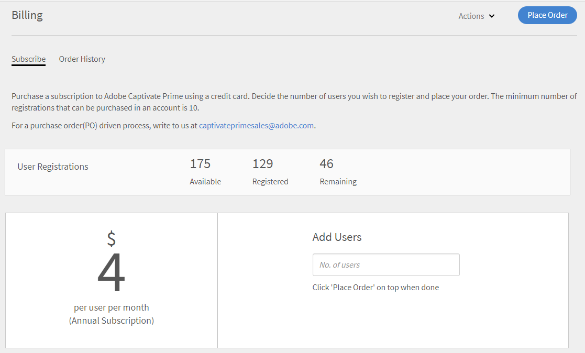
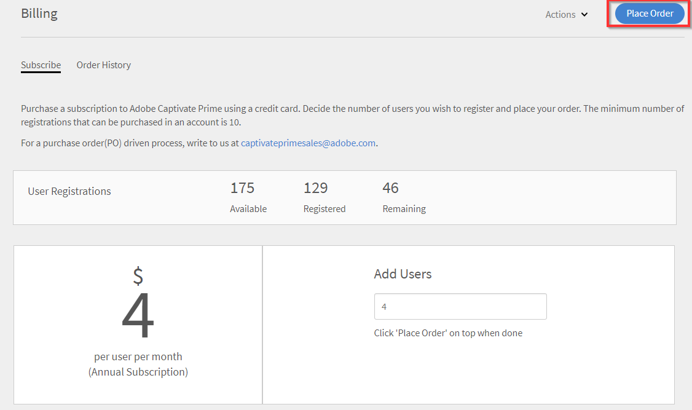
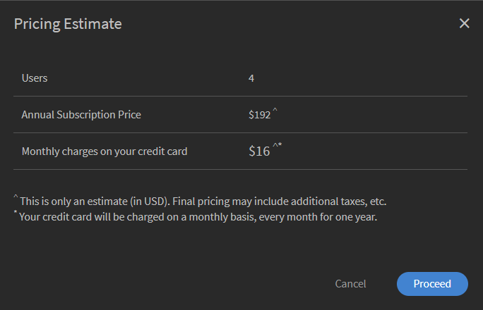
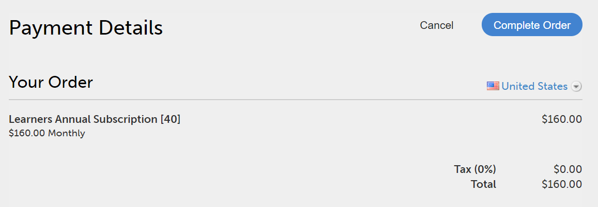
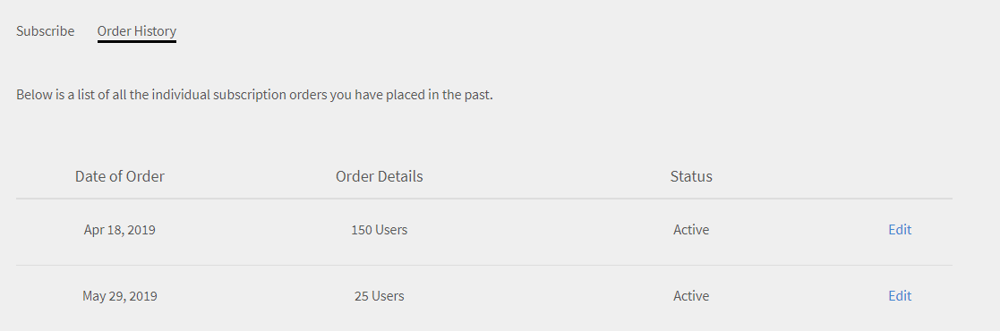
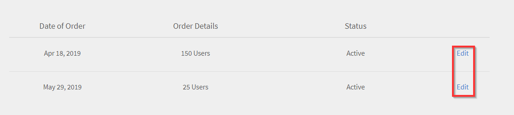
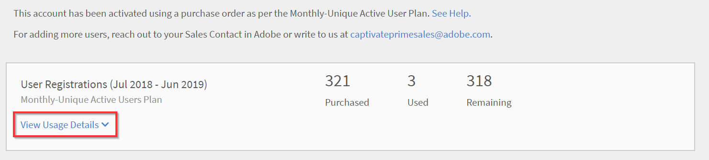
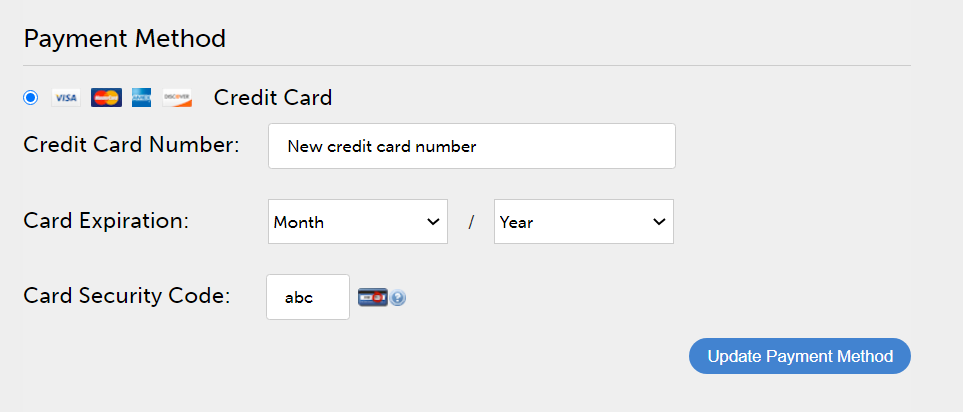

# Gestione degli ordini e della fatturazione di Learning Manager

L’acquisto con carta di credito è disponibile solo nella [regione statunitense](http://learningmanager.adobe.com/).

Gestisci la fatturazione di Learning Manager, effettua ordini utilizzando una carta di credito, iscriviti utilizzando un ordine d’acquisto o tramite un piano per utenti attivi mensili.

Il modello di prezzo di Adobe Learning Manager è flessibile, orientato al cliente e uno dei migliori per soddisfare le esigenze della tua organizzazione. Per ulteriori informazioni, consulta la pagina di [Learning Manager](https://www.adobe.com/products/learningmanager.html).

Solo gli Amministratori della tua organizzazione possono gestire la fatturazione.

Se desideri contattare Adobe per ulteriori informazioni sull’abbonamento e sulla fatturazione di Learning Manager, scrivici a [learningmanagersales@adobe.com](mailto:learningmanagersales@adobe.com).

## Pagina Fatturazione

Per accedere alla pagina Fatturazione, accedi a Adobe Learning Manager come amministratore e seleziona **[!UICONTROL Fatturazione]** nel riquadro di navigazione a sinistra.

La pagina Fatturazione contiene le schede riportate di seguito.

| Scheda | Scopo |
|---|---|
| **Abbonamento** | Visualizza i dettagli dell&#39;account, i diritti di licenza e l&#39;utilizzo dei posti. Gestione dell&#39;attivazione del piano. |
| **Cronologia ordini** | Verifica gli ordini passati effettuati sul conto. |

### Scheda Abbonamento

**Dettagli account**

Nella scheda **Dettagli account** nella parte superiore della scheda **Abbonamento** sono visualizzati quattro identificatori di sola lettura per l&#39;account.

| Campo | Descrizione |
|---|---|
| **ECCID** | Numero di riferimento di Adobe per il tuo account. Fai clic qui per contattare l’assistenza tecnica di Adobe. |
| **ID account** | L&#39;identificatore univoco dell&#39;account Adobe Learning Manager. |
| **Nome account** | Nome visualizzato dell&#39;account Adobe Learning Manager. |
| **ID organizzazione IMS** | L’organizzazione Adobe Admin Console collegata a questo account. Vuoto se non ancora collegato. |

**Licenze**

Nella sezione **Licenze** sono elencate tutte le licenze o le autorizzazioni attive per l&#39;account. Ogni blocco mostra il nome della licenza, una descrizione del piano, se applicabile, e una riga di statistiche che mostra i dati di consumo per il periodo corrente del contratto.

Le colonne delle righe di stato variano in base al tipo di licenza:

| Tipo di licenza | Colonne visualizzate |
|---|---|
| Licenza a pagamento (ad esempio, Adobe Learning Manager Ultimate) | Acquistato/Utilizzato/Utilizzato dagli account condivisi tra pari/Rimanente |
| Licenza di prova (ad esempio, Virtual Coach) | Disponibile/Utilizzato/Rimanente |

Selezionare **[!UICONTROL Visualizza dettagli utilizzo]** sotto la riga di stato per espandere un&#39;analisi stratificata in linea. La sezione espansa mostra:

- Un menu a discesa **Seleziona periodo** per filtrare per periodo di contratto, inclusi i periodi storici
- Tabella **Utilizzo complessivo** con colonne: Acquistato/Utilizzato da questo account / Utilizzato da account condivisi tra pari / Rimanente
- Un collegamento **Visualizza interruzione account** per visualizzare l&#39;utilizzo distribuito tra singoli account condivisi tra pari
- Un collegamento **Scarica report dettagliato** per esportare i dati di utilizzo come file

**Blocco licenza di Agent Orchestrator**

Quando una licenza di Agent Orchestrator è collegata, la riga di stato mostra:

| Colonna | Descrizione |
|---|---|
| **Acquistato** | Totale dei crediti Gen AI acquistati per il periodo contrattuale. |
| **Utilizzato** | Crediti utilizzati in tutti i servizi che utilizzano questa licenza. |
| **Utilizzato da ALM** | Crediti utilizzati specificamente da Adobe Learning Manager. |
| **Rimanenti** | Crediti ancora disponibili. |

Se la tua organizzazione utilizza account principali e secondari, la sezione **Licenze** dell&#39;account principale mostra una colonna **Utilizzato dagli account condivisi tra pari** che riflette il consumo di credito in tutti gli account secondari collegati. Per gli account figlio l&#39;allocazione è impostata su **Posti sanzionati** anziché su Acquistati.

## Collegare l’account Adobe Learning Manager a Adobe Admin Console

Prima che le funzioni di intelligenza artificiale generica possano essere attivate, il tuo account Adobe Learning Manager deve essere collegato a un&#39;organizzazione Adobe Admin Console. Una volta collegato, Adobe Learning Manager rileva la licenza di Agent Orchestrator e rende disponibile la scheda **Crediti**.

Il collegamento viene stabilito automaticamente quando l’account è stato acquistato tramite il processo di ordinazione standard di Adobe o quando l’account è stato attivato utilizzando una chiave di attivazione. Puoi verificare il collegamento nella scheda **Abbonamento**: se il campo **ID organizzazione IMS** in **Dettagli account** è compilato, l&#39;account è già collegato.

### Collegare manualmente l’account

Se il tuo account è stato configurato in modo indipendente e il campo **ID organizzazione IMS** è vuoto, collega manualmente.

**Prerequisiti:**
- Devi essere un amministratore dell&#39;account Adobe Learning Manager.
- Devi avere il ruolo Amministratore di sistema nell&#39;organizzazione Adobe Admin Console che desideri collegare.
- L&#39;organizzazione Adobe Admin Console deve disporre di una licenza di Agent Orchestrator attiva.

1. Seleziona **[!UICONTROL Fatturazione]**, quindi seleziona la scheda **[!UICONTROL Abbonamento]**.
2. Nella scheda **Dettagli account**, seleziona **[!UICONTROL Collega organizzazione IMS]**.
3. Viene visualizzata una finestra di accesso. Immetti le credenziali del tuo account di Adobe e seleziona la tua organizzazione dall&#39;elenco. Adobe Learning Manager conferma che l’account che accede ha il ruolo di amministratore di sistema nell’organizzazione Adobe Admin Console e che lo stesso account ha il ruolo di amministratore in Adobe Learning Manager.
4. Se entrambi i controlli vengono superati, il collegamento viene stabilito. Il campo **ID organizzazione IMS** viene aggiornato con l&#39;identificatore dell&#39;organizzazione e il saldo del credito viene visualizzato nella sezione **Licenze**.
5. Se uno dei due controlli ha esito negativo, viene visualizzato un messaggio di errore. Confermare i prerequisiti precedenti e riprovare.

### Scollegare l’account

Dopo lo scollegamento, le funzioni di intelligenza artificiale generale sono disattivate per tutti gli Allievi e la scheda **Crediti** non è disponibile finché l’account non viene nuovamente collegato.

1. Seleziona **[!UICONTROL Fatturazione]**, quindi seleziona la scheda **[!UICONTROL Abbonamento]**.
2. Nella scheda **Dettagli account**, seleziona **[!UICONTROL Scollega organizzazione IMS]**.
3. Accedi di nuovo per confermare il tuo ruolo di amministratore nell&#39;organizzazione.
4. Il collegamento viene rimosso. Il campo **ID organizzazione IMS** torna vuoto e la scheda **Crediti** è nascosta.

Per ripristinare l&#39;accesso, ripetere i passaggi di collegamento manuali precedenti.

## Effettuare ordini usando le carte di credito {#placeordersusingcreditcards}

È possibile acquistare un abbonamento per un massimo di 3500 studenti attraverso qualsiasi ordine di pagamento con carta di credito. Il primo ordine nell’account deve essere per un minimo di 10 Allievi.

1. Nell’app di amministrazione, fai clic su **[!UICONTROL Fatturazione]** nel riquadro di navigazione sinistro.

   

   *Avvia fatturazione Adobe Learning Manager*

1. Nella pagina **[!UICONTROL Informazioni di fatturazione]**, aggiungi il numero di utenti nel campo **[!UICONTROL Aggiungi utenti]**. Quando si utilizza una carta di credito per gli abbonamenti prepagati, è possibile visualizzare il numero di utenti che si possono aggiungere per l’abbonamento. Il numero di utenti che è possibile aggiungere non deve superare il numero indicato nella sezione Remaining.1.

   

   *Aggiungi numero di utenti*

1. Dopo aver specificato il numero di utenti da aggiungere, fai clic su Effettua ordine nell’angolo in alto a destra della pagina.

   

1. Valuta il preventivo che appare sullo schermo.

   

   *Effettuare un ordine*

   La quota annuale di abbonamento viene calcolata in base al numero di utenti aggiunti per l’abbonamento. Ad esempio, se vengono aggiunti quattro utenti, la quota annuale viene calcolata utilizzando l’espressione 4 utenti X 4 $ X 12, che restituisce un importo di 192 $.

   Fai clic su **[!UICONTROL Procedi]**.

   *Verifica il preventivo*

1. Nella pagina Dettagli di pagamento è possibile visualizzare il prezzo stimato dell’ordine. La valuta viene visualizzata in base alla lingua corrente.

   

   *Visualizza dettagli pagamento*

   È inoltre possibile modificare le impostazioni internazionali scegliendo il paese dall’elenco a discesa.

   

   *Selezionare il paese di fatturazione*

1. Inserisci le tue informazioni di contatto, scegli il tipo di carta di credito e fornisci i dettagli della carta di credito. Dopo aver inserito i dettagli richiesti, fai clic su **[!UICONTROL Completa ordine]**.
1. Dopo aver effettuato l&#39;ordine, per visualizzare i pacchetti ordinati di recente, fai clic sulla scheda **[!UICONTROL Cronologia ordini]** nella pagina **[!UICONTROL Fatturazione]**.

   

   *Visualizza cronologia ordini*

## Verifica stato dell’ordine {#checkorderstatus}

Gli ordini possono essere contraddistinti da uno dei seguenti quattro stati:

**Attivo:** l’ordine è attivo e gli utenti sono registrati correttamente.

**Sospeso:** un ordine passa allo stato sospeso nei seguenti scenari:

- Ritardo nella ricezione del pagamento dalla carta di credito
- Scadenza della carta di credito.
- Il pagamento viene rifiutato per qualsiasi ciclo di pagamento ricorrente.

**Annullamento avviato:** un ordine passa a questo stato quando l’Amministratore di Learning Manager disattiva l’account. L’ordine passa quindi allo stato annullato dopo aver ricevuto la conferma di annullamento dell’ordine.

## Aggiornare i dettagli dell’abbonamento {#updatesubscriptiondetails}

1. Nell’elenco degli ordini, fai clic su **[!UICONTROL Modifica]**.

   

   *Aggiorna dettagli abbonamento*

1. Nella pagina dei dettagli dell’abbonamento, fai clic su **[!UICONTROL Modifica abbonamento]**.
1. Scegli l’elemento da modificare:

   - Metodo di pagamento: utilizza questa opzione per aggiornare i dettagli del pagamento, ad esempio la carta di credito.
   - Indirizzo: utilizza questa opzione per aggiornare i dettagli dell’indirizzo.

## Annullare un abbonamento {#cancelasubscription}

Per annullare un ordine:

1. Fai clic su Fatturazione nel riquadro sinistro della pagina Amministrazione.
1. Nella pagina Fatturazione, nell&#39;angolo superiore destro, scegli **[!UICONTROL Azioni]** > **[!UICONTROL Disattiva account]**.
1. Una volta che l’Amministratore ha disattivato l’account, tutti gli ordini esistenti nell’account vengono annullati dal successivo ciclo di fatturazione.

Quando un account viene disattivato dal cliente, entra in stato di prova per i successivi 30 giorni. Il titolare dell’account riceve tre e-mail di promemoria per ripristinare l’account. Se il titolare non riattiva l’account, nessuno degli utenti potrà accedere a Learning Manager tranne il titolare.

## Effettuare ordini utilizzando ordini d’acquisto {#placeordersusingpurchaseorder}

Puoi scegliere l’ordine d’acquisto come modalità di pagamento alternativa. Come prerequisito, l’account della tua organizzazione deve essere registrato con Adobe. I costi di questa procedura vengono addebitati all’account della tua organizzazione. L’account viene addebitato in base alle attività di un Allievo. Vengono addebitate solo le attività a livello di oggetto di apprendimento. Per effettuare un ordine utilizzando ordini di acquisto:

1. Invia una e-mail a [learningmanagersales@adobe.com](mailto:learningmanagersales@adobe.com) e dichiara il numero di Allievi richiesti.
1. Il team di Learning Manager ti invierà una chiave di attivazione.
1. Inserisci la chiave di attivazione nella pagina di fatturazione dell’app di amministrazione.
1. Fai clic su Attiva nell’angolo in alto a destra della pagina.

## Verificare lo stato dell’account {#checkaccountstatus}

Dopo l’attivazione, l’account può trovarsi in uno dei seguenti stati:

- **Versione di prova** - Puoi creare un account Adobe Learning Manager e utilizzarlo senza alcun pagamento per un periodo di 30 giorni. Non vi sono limiti al numero di Allievi registrati durante il periodo di prova.
- **Attivo** - In questo stato, l’account dispone di abbonamenti Allievi attivi con pagamento mensile ricorrente in base all’ordine di abbonamento.
- **Inattivo** - Un account passa allo stato inattivo nei seguenti scenari:

  - Dopo il periodo di prova se nell’account non sono presenti ordini di abbonamento attivi.
  - L’Amministratore disattiva l’account, annullando tutti gli ordini esistenti in un account dal successivo ciclo di fatturazione della sottoscrizione.
  - Il pagamento viene rifiutato per gli ordini attivi in un account anche dopo i promemoria.

Lo stato inattivo non elimina il tuo account con effetto immediato. Riceverai almeno un paio di promemoria dal team di Learning Manager, nei quali ti verrà chiesto di fornire le informazioni più recenti sulla tua carta di credito, se è scaduta. Quando l&#39;account Adobe Learning Manager è inattivo, solo un amministratore può accedervi. Tutti gli altri utenti non possono accedere all’account.

- **Attivazione richiesta** - L’account passa a questo stato quando l’Amministratore di Learning Manager sceglie di disattivare l’account. Tutti gli ordini di questo account vengono annullati. La raccolta di pagamenti per questi ordini non avverrà a partire dal prossimo ciclo di fatturazione. L’account rimane in questo stato fino al giorno dell’ultimo ciclo di fatturazione. In questo stato, tutti gli utenti possono continuare a utilizzare l’applicazione normalmente fino alla fine dell’ultima data di pagamento ricorrente.

## Annullare un abbonamento {#Cancelasubscription-1}

Per annullare un abbonamento attivo, contatta il team di supporto di Learning Manager.

## Commissione di annullamento dell’account {#accountterminationfee}

Se desideri annullare l’abbonamento prima del termine del periodo annuale, viene addebitata una commissione di annullamento anticipato. La commissione di annullamento è pari al 50% del prezzo dell’abbonamento per il periodo di validità rimanente.

## Piano per utenti attivi mensili (MAU) {#monthlyactiveusersmauplan}

Puoi scegliere un piano MAU come metodo di fatturazione preferito. Questa opzione genera la fatturazione in base al numero di utenti attivi mensili univoci. Gli utenti attivi mensili univoci sono aggiunti cumulativamente per un periodo di 12 mesi a partire dal mese di attivazione del piano. Questo numero viene utilizzato per la fatturazione per il periodo.

Utilizza il seguente esempio per capire come viene calcolato il piano MAU.

Poniamo il caso in cui il numero di utenti al mese sia il seguente:

- Mese 1 = 50
- Mese 2 = 500
- Mese 3 = 5000
- Mesi da 4 a 12 = 10

Totale utenti attivi mensili fatturati = Mese 1 + Mese 2 + Mese 3 + Mesi da 4 a 12 = 50 + 500 + 5000 + 90 = 5640.

La fatturazione per il periodo considerato sarebbe per 5640 utenti.

Alla fine del periodo di 12 mesi, il conteggio dell’utilizzo viene azzerato e viene avviato un nuovo periodo per il piano MAU. È possibile aggiungere più chiavi di attivazione per aumentare il numero di posti acquistati.

Qualsiasi utente che effettui le seguenti azioni o ottenga completamenti a causa di azioni intraprese da altri è considerato un utente attivo mensile univoco per quel mese di calendario.

- Sfruttamento di corsi, programmi di apprendimento o certificazioni.
- Sfruttamento e download di risorse formative o allegati del corso.
- Sfruttamento, download o creazione di note personali.
- Partecipazione all’apprendimento sociale creando bacheche, post o commenti.
- Ottenimento di completamenti grazie alle approvazioni di invio di certificati esterni o alla partecipazione a sessioni in aula/aula virtuale.

## Visualizzare i dettagli di utilizzo {#viewusagedetails}

1. Per visualizzare il numero di utenti attivi al mese, fai clic su **[!UICONTROL Visualizza dettagli di utilizzo]**.

   

   *Visualizza utenti attivi per mese*

1. Nella pagina mostrata, è possibile visualizzare quanto segue:

   - **Utilizzo generale:** puoi controllare il numero totale di utenti attivi, gli utenti che utilizzano Learning Manager in un determinato mese e il numero di utenti che non si sono iscritti ad alcun corso.
   - **Utilizzo mensile:** è possibile visualizzare una tabella di utenti attivi univoci al mese.

## Scaricare il report sull’utilizzo {#downloadusagereport}

Puoi anche scaricare i dati del numero di utenti attivi su base mensile e annuale. Per scaricare, fai clic su **[!UICONTROL Scarica report dettagliato]**.

Nella finestra di dialogo **Genera richiesta di report**, immetti i mesi e l’anno richiesti, quindi fai clic su **[!UICONTROL Genera]**.

*Scarica report sull&#39;utilizzo attivo*

Se chiudi la finestra del browser, il download inizierà la prossima volta che visiti Learning Manager.

I report vengono salvati nella cartella Download del browser.

## Annullare un abbonamento

Per annullare un abbonamento attivo, contatta il team di supporto di Learning Manager.

## Crediti di intelligenza artificiale {#genaicredits}

### Come funzionano i crediti di intelligenza artificiale

I crediti di intelligenza artificiale vengono utilizzati ogni volta che un Allievo interagisce con una funzione basata sull’intelligenza artificiale, ad esempio quando pone una domanda tramite l’Assistente intelligenza artificiale o genera un consiglio di apprendimento personalizzato. Prima dell’inizio di ogni interazione, Adobe Learning Manager verifica che i crediti siano disponibili. Se sono disponibili crediti, l’interazione procede. Se il saldo è esaurito, l’Allievo riceve un messaggio che indica che la funzione non è temporaneamente disponibile.

I crediti vengono acquistati come parte di una licenza di Adobe Experience Platform Agent Orchestrator. La licenza è gestita nel tuo Adobe Admin Console e Adobe Learning Manager si connette automaticamente a esso per rilevare i crediti disponibili.

**Regola di priorità del credito:** Se il tuo piano Adobe Learning Manager include i crediti Gen AI in bundle e disponi anche di una licenza Agent Orchestrator, i crediti in bundle vengono utilizzati per primi. I crediti di Agent Orchestrator vengono utilizzati solo dopo l&#39;esaurimento dei crediti inclusi.

**Pool di crediti condivisi:** se l&#39;organizzazione dispone di più account Adobe Learning Manager collegati alla stessa organizzazione Adobe Admin Console, tutti gli account vengono ricavati da un singolo pool di crediti condivisi.

>[!IMPORTANT]
>
>Per impostazione predefinita, tutte le funzioni di intelligenza artificiale generica sono disattivate. Per consentire agli Allievi di accedere a ogni funzione, è necessario abilitarla e impostare un limite di utilizzo dei crediti.

### Accedi alla scheda Crediti di intelligenza artificiale generica

1. Seleziona **[!UICONTROL Amministratore]** > **[!UICONTROL Fatturazione]**.
2. Seleziona la scheda **[!UICONTROL Crediti]**.

La scheda **Crediti** è visibile solo quando i crediti di intelligenza artificiale generica sono stati acquistati o erano storicamente attivi nell&#39;account. Se la scheda non è visibile, verifica che il tuo account sia collegato a un&#39;organizzazione Adobe Admin Console che dispone di una licenza di Agent Orchestrator attiva.

### Tabella funzionalità Gen AI

Nella tabella **Funzionalità IA di generazione** sono elencate tutte le funzionalità di intelligenza artificiale disponibili nell&#39;account.

| Colonna | Descrizione |
|---|---|
| **Nome funzionalità** | Nome della funzione AI. Selezionare il nome per accedere alla pagina delle impostazioni della funzionalità. |
| **Stato** | Indica se la funzionalità è attiva o disattivata. Attivate/disattivate la funzione dalla relativa pagina delle impostazioni. |
| **Limite massimo utilizzo crediti** | Numero massimo di crediti che questa funzione può utilizzare durante il periodo del contratto. Deve essere impostato prima che la funzione possa essere abilitata. Si applica solo alle funzionalità rivolte agli Allievi. |
| **Crediti utilizzati** | Totale crediti utilizzati da questa funzione dalla data di inizio del contratto, aggiornati in tempo reale. |

### Abilitare una funzione Gen AI

1. Nella scheda **[!UICONTROL Crediti]**, individua la funzionalità nella tabella **Funzionalità basate su IA generazione**.
2. Nella colonna **Limite massimo utilizzo crediti**, immettere il numero massimo di crediti che questa funzione può utilizzare durante il periodo del contratto.
3. Seleziona il nome della funzione per passare alla pagina **Impostazioni funzionalità**.
4. Nella pagina **Impostazioni funzionalità**, attiva la funzionalità.
5. Completa qualsiasi configurazione aggiuntiva, ad esempio l’assegnazione di Allievi e cataloghi all’Assistente AI.

### Cosa succede quando i crediti si esauriscono

- Se una funzione raggiunge il **limite massimo di utilizzo dei crediti**, gli allievi visualizzano un messaggio che indica che la funzione non è temporaneamente disponibile. Aumenta il limite in qualsiasi momento dalla scheda **Crediti**.
- Se i crediti complessivi dell’account sono esauriti, tutte le funzioni di intelligenza artificiale generica smettono di funzionare per gli Allievi fino all’acquisto di crediti aggiuntivi. I report sull’utilizzo e le metriche del credito rimangono accessibili agli amministratori.
- Se un Allievo interagisce a metà quando i crediti sono esauriti, l’interazione viene completata. Tutte le interazioni successive vengono bloccate.
- Gli amministratori possono impostare un limite di credito superiore al numero di crediti acquistati. La sovrallocazione è consentita e al momento del rinnovo può verificarsi un conguaglio.

### Grafico Utilizzo crediti mensili

Sotto la tabella Funzionalità di intelligenza artificiale generica, un grafico **Utilizzo mensile dei crediti** mostra i crediti utilizzati per ogni funzione al mese. Per impostazione predefinita, il grafico mostra il periodo corrente dell&#39;anno del contratto in base alla data di inizio del contratto di Agent Orchestrator. Seleziona **[!UICONTROL Scarica]** per esportare il report mensile per il periodo selezionato. La generazione del report è asincrona: quando il file è pronto, si riceve una notifica e un’e-mail in-app.

### Report di utilizzo Gen AI

Adobe Learning Manager fornisce due report sull&#39;utilizzo dell&#39;intelligenza artificiale di generazione in **[!UICONTROL Report]** > **[!UICONTROL Report IA]**.

**Report sull&#39;utilizzo dei crediti mensili**

Mostra i crediti utilizzati per ogni funzione al mese. Utile per la pianificazione del budget e il rinnovo del contratto.

- **Colonne:** Mese | Funzione | Crediti utilizzati
- **Filtro:** Selezionare un intervallo di date che si estenda su uno o più periodi del contratto
- **Download:** asincrono: quando il file è pronto, riceverai una notifica e un&#39;e-mail in-app

**Report sull’utilizzo dei crediti dell’intelligenza artificiale generazione degli Allievi**

Un audit trail che mostra gli Allievi che hanno utilizzato determinate funzioni e quanti crediti hanno utilizzato ciascuna interazione.

- **Colonne:** Data | Nome Allievo | E-mail Allievo | Funzione | Crediti utilizzati
- **Filtro:** Selezionare l&#39;intervallo di date che si desidera controllare
- **Download:** asincrono: quando il file è pronto, riceverai una notifica e un&#39;e-mail in-app

### Avvisi sull&#39;utilizzo del credito

Adobe Learning Manager invia automaticamente una notifica quando il consumo del credito supera le soglie chiave. Le notifiche vengono inviate sia in-app che tramite e-mail.

| Attivazione | Notifica |
|---|---|
| I crediti dell’account raggiungono il 90% del totale acquistato | Avviso: i crediti sono quasi esauriti a livello di account |
| I crediti dell&#39;account raggiungono il 100% del totale acquistato | Avviso: tutti i crediti vengono utilizzati e le funzioni di intelligenza artificiale generale si interrompono per gli Allievi |
| Una funzione raggiunge il limite massimo di utilizzo dei singoli crediti | Avviso: assegna un nome alla caratteristica specifica, che si interrompe per gli Allievi |

Quando ricevi un avviso del 90%, contatta il tuo team per l’account Adobe per acquistare crediti aggiuntivi prima che venga raggiunta la soglia del 100%.

## Domande frequenti {#frequentlyaskedquestions}

**Come aggiungere/rimuovere le sottoscrizioni da un account?**

Per aggiungere abbonamenti a un account, inserisci il numero di utenti per i quali desideri acquistarli. Quindi, nell’angolo superiore destro, fai clic su **[!UICONTROL Effettua ordine]**. Valuta il preventivo e fai clic su **[!UICONTROL Procedi]**. Inserisci i dati del tuo account e quelli della tua carta di credito. Quindi, per acquistare gli abbonamenti, fai clic su **[!UICONTROL Completa ordine]**.

Per rimuovere un abbonamento attivo, contatta il team di supporto di Learning Manager.

**Come si modifica una carta di credito per gli abbonamenti?**

Nella scheda **[!UICONTROL Cronologia ordini]**, per un account attivo, fai clic su **[!UICONTROL Modifica]**. Quindi, nella pagina dei dettagli dell’abbonamento, fai clic su **[!UICONTROL Modifica abbonamento]**. Immetti i dati della nuova carta di credito e fai clic su **[!UICONTROL Aggiorna metodo di pagamento]**.

*Visualizza dettagli carta di credito*

**Come aggiornare le informazioni di fatturazione in Learning Manager?**

Per aggiornare le informazioni di fatturazione, segui i passaggi successivi:

1. Accedi come **Amministratore** e fai clic su **[!UICONTROL Fatturazione]**.
1. Nell’elenco degli ordini, fai clic su **[!UICONTROL Modifica]**.
1. Nella pagina dei dettagli dell’abbonamento, fai clic su **[!UICONTROL Modifica abbonamento]**.

Scegli l’elemento da modificare:

1. **[!UICONTROL Metodo di pagamento]:** Utilizzare questa opzione per aggiornare i dati di pagamento, ad esempio la carta di credito.
1. **[!UICONTROL Indirizzo]:** Utilizzare questa opzione per aggiornare i dettagli dell&#39;indirizzo.

**È possibile annullare parzialmente un abbonamento?**

No, non è possibile annullare parzialmente un abbonamento. Se devi ridurre il numero di postazioni acquistate, puoi annullare l’abbonamento alla fine del ciclo di fatturazione e quindi acquistare il numero di postazioni richieste.

**Come ricevere una fattura per i pagamenti effettuati con carta di credito?**

Per ottenere una fattura per i tuoi pagamenti, contatta [FastSpring](https://fastspring.com/) utilizzando uno dei seguenti modi:

- Crea una richiesta di servizio con FastSpring utilizzando il collegamento `https://questionacharge.com`.
- Invia un&#39;e-mail a FastSpring il `orders@fastspring.com` richiedendo la fattura.

## Risoluzione dei problemi relativi ai crediti di intelligenza artificiale generale

| Il problema | Soluzione |
|---|---|
| **La scheda Crediti non è visibile** | I crediti di intelligenza artificiale generica non sono stati acquistati o applicati a questo account. Verifica la tua licenza di Agent Orchestrator nel tuo Adobe Admin Console, quindi conferma che un&#39;organizzazione è collegata in **[!UICONTROL Fatturazione]** > **[!UICONTROL Abbonamento]** > **Dettagli account**. |
| **Il campo ID organizzazione IMS è vuoto** | Il tuo account non è ancora collegato. Seleziona **[!UICONTROL Collega organizzazione IMS]** nella scheda **Dettagli account** e segui i passaggi di collegamento indicati sopra. |
| **Il collegamento non riesce con un errore** | Conferma di avere il ruolo di amministratore sia in Adobe Learning Manager che nell&#39;organizzazione Adobe Admin Console che stai tentando di collegare. Per stabilire il collegamento è necessario superare entrambi i controlli. |
| **Il campo ID organizzazione IMS è vuoto dopo l&#39;applicazione di una chiave di attivazione** | Il collegamento automatico viene eseguito solo per gli account attivati tramite il flusso di ordini standard di Adobe. Per gli account di configurazione indipendenti, completa i passaggi di collegamento manuali precedenti dopo aver attivato la chiave. |
| **Dopo lo scollegamento, le funzionalità di intelligenza artificiale generale non sono disponibili** | Lo scollegamento rimuove l’accesso a tutte le funzioni di intelligenza artificiale generica e nasconde la scheda Crediti. Ricollegare il tuo account a un&#39;organizzazione Adobe Admin Console con una licenza di Agent Orchestrator attiva per ripristinare l&#39;accesso. |

<!-- 
# Manage Learning Manager orders and billing

Credit card-based purchase is only available in the [US region](http://learningmanager.adobe.com/).

Manage Learning Manager billing, place orders by using a credit card, subscribe using a Purchase Order, or via a Monthly Active Users plan.

Adobe Learning Manager has a flexible, customer-friendly, and one of the best pricing models to cater to your organization needs. For more information, see the [Learning Manager](https://www.adobe.com/products/learningmanager.html) page.

Only the Administrators of your organization can manage billing.

If you want to contact Adobe for more information about Learning Manager subscription and billing, write to us at [learningmanagersales@adobe.com](mailto:learningmanagersales@adobe.com).

## Place orders using credit cards {#placeordersusingcreditcards}

You can buy a subscription for a maximum of 3500 learners through any single credit card payment order. The first order in the account must be for a minimum of 10 learners.

1. On the Administrator app, click **[!UICONTROL Billing]** on the left navigation pane.

   

   *Launch Adobe Learning Manager billing*

1. On the **[!UICONTROL Billing Information]** page, add the number of users in the **[!UICONTROL Add Users]** field. When using a credit card for pre-paid subscriptions, you can see the number of users that you can add for the subscription. The number of users you can add must not exceed the number mentioned in the section Remaining.1. 

   

   *Add number of users*

1. After specifying the number of users to add, click Place Order in the upper-right corner of the page.

   

1. Review the estimate that appears on the screen.

   

   *Place an order*

   The annual subscription fee is calculated based on the number of users who are added for the subscription. For example, if four users are being added, the annual fee is calculated using the expression 4 usersX$4X$12, which returns $192.

   Click **[!UICONTROL Proceed]**.

   *Review the estimate*

1. On the Payment Details page, you can view the estimated price of the order. The currency appears based on the current locale.

   

   *View payment details*

   You can also change the locale by choosing the country from the drop-down list.

   

   *Select the country of billing*

1. Enter your contact information, choose the credit card type, and provide the details of the credit card. After you've entered the required details, click **[!UICONTROL Complete Order]**.
1. After you've placed the order, to see the recently ordered packages, click the **[!UICONTROL Order History]** tab on the **[!UICONTROL Billing]** page.

   

   *View order history*

## Check order status {#checkorderstatus}

All orders can have one of the four statuses:

**Active:** An order is active, and users are registered successfully.

**Suspended:** An order moves into suspended state in the following scenarios:

* Delay in receipt of payment from the credit card
* Expiry of the credit card.
* Payment is declined for any recurring payment cycle.

**Canceled initiated:** An order moves into this state when the Learning Manager Administrator deactivates the account. The order then moves into a canceled state after receiving the cancellation confirmation of the order.

## Update subscription details {#updatesubscriptiondetails}

1. In the list of orders, click **[!UICONTROL Edit]**.

   

   *Update subscription details*

1. In the Subscription details page, click **[!UICONTROL Edit Subscription]**.
1. Choose the item that you want to edit:

   * Payment method: Use this option to update payment details, such as, credit card.
   * Address: Use this option to update address details.

## Cancel a subscription {#cancelasubscription}

To cancel an order:

1. In the left pane of the Administrator page, click Billing.
1. In the Billing page, on the upper-right corner, choose **[!UICONTROL Actions]** > **[!UICONTROL Deactivate Account]**.
1. Once the Administrator deactivates the account, all existing orders in the account are canceled from the next billing cycle.

When an account is deactivated by the customer, it enters a trial state for the next 30 days. The account owner receives three reminder emails to revive the account. If the owner does not reactivate the account, none of the users are able to access Learning Manager apart from the owner.

## Place orders using Purchase Order {#placeordersusingpurchaseorder}

You can choose purchase order process as an alternative mode of payment. As a pre-requisite, your organization's account must be registered with Adobe. Your organization account is charged for this process. The account is charged based on a learner's activities. Only Learning Object-level activities are charged. To place an order using PO:

1. Send an email to [learningmanagersales@adobe.com](mailto:learningmanagersales@adobe.com) and mention the number of required learners.
1. The Learning Manager team sends you an activation key.
1. In the Billing page of the Administrator app, enter the activation key.
1. Click Activate in the upper-right corner of the page.

## Check account status {#checkaccountstatus}

After an account gets activated, the account can be in any of the following states:

* **Trial** - You can create an Adobe Learning Manager account and use it without any payment for a period of 30 days. There is no limit on the number of learners registered during the trial period.
* **Active** - In this state, the account has active learner subscriptions with recurring monthly payment as per the subscription order.
* **Inactive** - An account moves into inactive state in the following scenarios:

  * After the trial period if there are no active subscription orders in the account.
  * Administrator deactivates the account, which results in canceling all the existing orders in an account from the next billing cycle of subscription.
  * Payment is declined for active orders in an account even after reminders.

An inactive state does not cancel your account with immediate effect. You receive at least a couple of reminders from the Learning Manager team asking you to provide the latest information about

your credit card if it has expired. In an inactive state, only an administrator can log in to the Captivate

Learning Manager account. All other users cannot access the account.

* **Activation required** - Your account moves into this state when the Learning Manager administrator chooses to deactivate the account. All the orders of this account get canceled. The collection of payment for these orders does not happen from the next billing cycle. The status of the account remains in this state until the day of the last billing cycle. In this state, all users can continue to use the application without any impact until the end of the last recurring payment date.

## Cancel a subscription {#Cancelasubscription-1}

To cancel an active subscription, contact the Learning Manager support team.

## Account termination fee {#accountterminationfee}

If you want to cancel the subscription before the completion of the annual term, an early termination fee is charged. The termination fee is equivalent to 50% of the subscription price of the remaining commitment period.

## Monthly Active Users (MAU) plan {#monthlyactiveusersmauplan}

You can choose a MAU plan as your preferred way of billing. This option generates billing based on the number of monthly unique active users. The monthly unique active users are added cumulatively for a period of 12 months starting from the month of plan activation. This number is used for billing for the period.

Use the following example to understand how MAU is calculated.

Let there be a case where the number of users per month are as follows:

* Month 1 = 50
* Month 2 = 500
* Month 3 = 5000
* Month 4 to 12 = 10

Total Monthly Active Users that are billed = Month 1 + Month 2 + Month 3 + Month 4 to 12 = 50 + 500 + 5000 + 90 = 5640.

The billing for the period would be for 5640 users.

At the end of the 12-month period, the usage count is reset back to zero and a new period for MAU plan starts. You can add multiple activation keys to increase the purchased number of seats.

Any user who performs the following actions or achieves completions due to actions taken by others is considered as a monthly unique active user for that calendar month.

* Consuming a course, learning program or certification.
* Consuming, downloading a Job Aid or course attachments.
* Consuming, downloading or creating personal notes.
* Participating in Social Learning by creating Boards, posts or comments.
* Achieving completions due to External Certificate submission approvals or attendance for a classroom/virtual classroom sessions.

## View usage details {#viewusagedetails}

1. To view the number of active users by month, click **[!UICONTROL View Usage Details]**.

   

   *View active users by month*

1. On the page that displays, you can view the following:

   * **Overall usage:** You can check the total number of active users, users who are consuming Learning Manager in a month, and the number of users who have not yet signed up for any course.

   * **Monthly usage:** You can see a table of unique active users per month.

## Download usage report {#downloadusagereport}

You can also download the data of the number of active users by month and year. To download, click **[!UICONTROL Download Detailed Report]**.

On the **Generate Report Request** dialog, enter the required months and year, and click **[!UICONTROL Generate]**.

*Download active usage report*

If you close the browser window, the download starts the next time you visit Learning Manager.

The reports are saved in the Downloads folder of your browser.

## Cancel a subscription

To cancel an active subscription, contact the Learning Manager support team.

## Frequently Asked Questions {#frequentlyaskedquestions}

+++How to add/remove subscriptions from an account?

To add subscriptions in an account, add the number of users for who you'd like to purchase subscriptions. Then on the upper-right corner, click **[!UICONTROL Place Order]**. Review the estimate and click **[!UICONTROL Proceed]**. Enter your account details and also your credit card details. Then to purchase the subscriptions, click **[!UICONTROL Complete Order]**.

To remove an active subscription, contact the Learning Manager support team.
+++

+++How to change a credit card for subscriptions?

In the **[!UICONTROL Order History]** tab, for an active account, click **[!UICONTROL Edit]**. Then on the Subscription Details page, click **[!UICONTROL Edit Subscription]**. Enter your new credit card details and click **[!UICONTROL Update Payment Method]**.

*View credit card details*
+++

+++How to update the Billing information on Learning Manager?

To update the billing information, follow the steps below:

1. Log in as **Admin** and click **[!UICONTROL Billing]**.
1. In the list of orders, click **[!UICONTROL Edit]**.
1. In the Subscription details page, click **[!UICONTROL Edit Subscription]**.

Choose the item that you want to edit:

1. **[!UICONTROL Payment method]:** Use this option to update payment details, such as, credit card.
1. **[!UICONTROL Address]:** Use this option to update address details.
+++

+++Can I partially cancel a subscription?

No, you cannot cancel a subscription partially. If you need to reduce the number of seats that you have purchased, you can cancel the subscription at the end of the billing cycle and then purchase the number of seats required.
+++

+++How do I get an Invoice for my Credit card payments?

Contact [FastSpring](https://fastspring.com/) to get an invoice for your payments, using one of the following ways:

* Create a service request with FastSpring using the link `https://questionacharge.com`.
* Send an email to FastSpring on `orders@fastspring.com` requesting for the invoice.
-->
