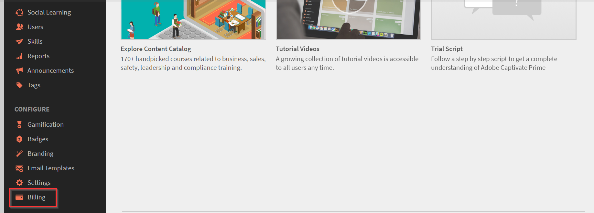
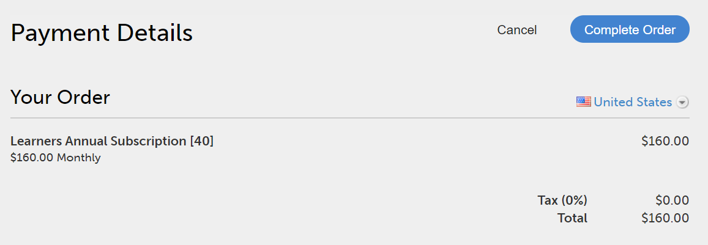

# Gestione degli ordini e della fatturazione di Learning Manager

L’acquisto con carta di credito è disponibile solo nel [Regione statunitense](http://learningmanager.adobe.com/).

Gestisci la fatturazione di Learning Manager, effettua ordini utilizzando una carta di credito, iscriviti utilizzando un ordine di acquisto o tramite un piano per utenti attivi mensili.

Adobe Learning Manager dispone di un modello di prezzo flessibile, adatto ai clienti e uno dei migliori per soddisfare le esigenze della tua organizzazione. Per ulteriori informazioni, consultate [Learning Manager](https://www.adobe.com/products/learningmanager.html) pagina.

Solo gli Amministratori della tua organizzazione possono gestire la fatturazione.

Se desideri contattare l’Adobe per ulteriori informazioni sull’abbonamento e sulla fatturazione di Learning Manager, scrivici a [learningmanagersales@adobe.com](mailto:learningmanagersales@adobe.com).

## Effettua ordini utilizzando carte di credito {#placeordersusingcreditcards}

Puoi acquistare un abbonamento per un massimo di 3500 Allievi tramite un singolo ordine di pagamento con carta di credito. Il primo ordine nell’account deve essere per almeno 10 Allievi.

1. Nell’app Amministratore, fai clic su **[!UICONTROL Fatturazione]** nel riquadro di navigazione sinistro.

   

   *Avvia Adobe di fatturazione di Learning Manager*

1. Nella **[!UICONTROL Informazioni di fatturazione]** , aggiungi il numero di utenti nella **[!UICONTROL Aggiungi utenti]** campo. Quando utilizzi una carta di credito per gli abbonamenti prepagati, puoi visualizzare il numero di utenti che puoi aggiungere all’abbonamento. Il numero di utenti che puoi aggiungere non deve superare il numero indicato nella sezione Remaining.1.

   

   *Aggiungere il numero di utenti*

1. Dopo aver specificato il numero di utenti da aggiungere, fai clic su Effettua ordine nell’angolo superiore destro della pagina.

   

1. Valuta il preventivo visualizzato sullo schermo.

   

   *Effettua un ordine*

   La tariffa di abbonamento annuale viene calcolata in base al numero di utenti aggiunti per l’abbonamento. Ad esempio, se vengono aggiunti quattro utenti, la tariffa annuale viene calcolata utilizzando l’espressione 4 utentiX$4X$12, che restituisce $192.

   Fai clic **[!UICONTROL Procedi]**.

   *Verifica il preventivo*

1. Nella pagina Dettagli pagamento è possibile visualizzare il prezzo stimato dell&#39;ordine. La valuta viene visualizzata in base alla lingua corrente.

   

   *Visualizza i dettagli di pagamento*

   È inoltre possibile modificare le impostazioni internazionali scegliendo il paese dall&#39;elenco a discesa.

   

   *Seleziona il paese di fatturazione*

1. Immetti le informazioni di contatto, scegli il tipo di carta di credito e fornisci i dettagli della carta di credito. Dopo aver inserito i dettagli richiesti, fai clic su **[!UICONTROL Completa ordine]**.
1. Dopo aver effettuato l&#39;ordine, per visualizzare i pacchetti ordinati di recente, fai clic sul pulsante **[!UICONTROL Cronologia ordini]** sulla scheda **[!UICONTROL Fatturazione]** pagina.

   

   *Visualizza cronologia ordini*

## Verifica stato ordine {#checkorderstatus}

Tutti gli ordini possono avere uno dei quattro stati seguenti:

**Attivo:** Un ordine è attivo e gli utenti sono registrati correttamente.

**Sospeso:** Un ordine passa allo stato sospeso nei seguenti scenari:

* Ritardo nella ricezione del pagamento dalla carta di credito
* Scadenza della carta di credito.
* Il pagamento viene rifiutato per qualsiasi ciclo di pagamento ricorrente.

**Annullato avviato:** Un ordine passa a questo stato quando l’Amministratore di Learning Manager disattiva l’account. L&#39;ordine passa quindi allo stato annullato dopo aver ricevuto la conferma dell&#39;annullamento dell&#39;ordine.

## Aggiorna dettagli abbonamento {#updatesubscriptiondetails}

1. Nell’elenco degli ordini, fai clic su **[!UICONTROL Modifica]**.

   

   *Aggiorna dettagli abbonamento*

1. Nella pagina dei dettagli dell’abbonamento, fai clic su **[!UICONTROL Modifica abbonamento]**.
1. Scegli l’elemento da modificare:

   * Metodo di pagamento: utilizza questa opzione per aggiornare i dettagli del pagamento, ad esempio la carta di credito.
   * Indirizzo: utilizza questa opzione per aggiornare i dettagli dell’indirizzo.

## Annullamento di un abbonamento {#cancelasubscription}

Per annullare un ordine:

1. Nel riquadro sinistro della pagina Amministratore, fai clic su Fatturazione.
1. Nella pagina Fatturazione, nell’angolo superiore destro, scegli **[!UICONTROL Azioni]** > **[!UICONTROL Disattiva account]**.
1. Una volta che l’Amministratore ha disattivato l’account, tutti gli ordini esistenti nell’account vengono annullati dal ciclo di fatturazione successivo.

Quando un account viene disattivato dal cliente, entra in stato di prova per i successivi 30 giorni. Il proprietario dell’account riceve tre e-mail di promemoria per ripristinare l’account. Se il proprietario non riattiva l’account, nessuno degli utenti potrà accedere a Learning Manager tranne il proprietario.

## Effettuare ordini utilizzando Ordine di acquisto {#placeordersusingpurchaseorder}

È possibile scegliere la procedura dell&#39;ordine di acquisto come modalità di pagamento alternativa. Come prerequisito, l&#39;account della tua organizzazione deve essere registrato con Adobe. Questo processo viene addebitato all’account della tua organizzazione. L’account viene addebitato in base alle attività di un Allievo. Vengono addebitate solo le attività a livello di oggetto di apprendimento. Per effettuare un ordine utilizzando OA:

1. Invia un messaggio e-mail a [learningmanagersales@adobe.com](mailto:learningmanagersales@adobe.com) e menziona il numero di allievi richiesti.
1. Il team di Learning Manager ti invia una chiave di attivazione.
1. Nella pagina Fatturazione dell’app Amministratore, immetti il codice di attivazione.
1. Fai clic su Attiva nell’angolo superiore destro della pagina.

## Verifica stato account {#checkaccountstatus}

Dopo l’attivazione di un account, lo stato dell’account può essere uno dei seguenti:

* **Versione di prova** - Puoi creare un account Learning Manager di Adobe e utilizzarlo senza alcun pagamento per un periodo di 30 giorni. Non esiste alcun limite al numero di Allievi registrati durante il periodo di prova.
* **Attivo** - In questo stato, l’account dispone di abbonamenti Allievi attivi con pagamento mensile ricorrente in base all’ordine di abbonamento.
* **Inattivo** - Un account passa allo stato inattivo nei seguenti casi:

   * Dopo il periodo di prova se nell’account non sono presenti ordini di abbonamento attivi.
   * L’Amministratore disattiva l’account, annullando tutti gli ordini esistenti in un account dal successivo ciclo di fatturazione della sottoscrizione.
   * Il pagamento viene rifiutato per gli ordini attivi in un account anche dopo i promemoria.

Uno stato inattivo non annulla l’account con effetto immediato. Riceverai almeno un paio di promemoria dal team di Learning Manager, nei quali ti verrà chiesto di fornire le informazioni più recenti sul

la carta di credito, se è scaduta. Se lo stato è Inattivo, solo un amministratore può accedere alla Captivate

Account Learning Manager. Tutti gli altri utenti non possono accedere all’account.

* **Attivazione richiesta** - L’account passa a questo stato quando l’Amministratore di Learning Manager sceglie di disattivare l’account. Tutti gli ordini di questo account vengono annullati. La raccolta dei pagamenti per questi ordini non avviene dal ciclo di fatturazione successivo. Lo stato dell’account rimane in questo stato fino al giorno dell’ultimo ciclo di fatturazione. In questo stato, tutti gli utenti possono continuare a utilizzare l’applicazione senza alcun impatto fino alla fine dell’ultima data di pagamento ricorrente.

## Annullamento di un abbonamento {#Cancelasubscription-1}

Per annullare un abbonamento attivo, contatta il team di supporto di Learning Manager.

## Costo di terminazione account {#accountterminationfee}

Se desideri annullare l&#39;abbonamento prima del completamento del periodo annuale, viene addebitata una tariffa di terminazione anticipata. La tariffa di terminazione è equivalente al 50% del prezzo di abbonamento del periodo di impegno rimanente.

## Piano per utenti attivi mensili (MAU) {#monthlyactiveusersmauplan}

Puoi scegliere un piano MAU come metodo di fatturazione preferito. Questa opzione genera la fatturazione in base al numero di utenti attivi univoci mensili. Gli utenti attivi univoci mensili vengono aggiunti cumulativamente per un periodo di 12 mesi a partire dal mese di attivazione del piano. Questo numero viene utilizzato per la fatturazione del periodo.

Utilizzare l&#39;esempio seguente per comprendere come viene calcolata la MAU.

Consideriamo un caso in cui il numero di utenti al mese è il seguente:

* Mese 1 = 50
* Mese 2 = 500
* Mese 3 = 5000
* Mese da 4 a 12 = 10

Totale utenti attivi mensili fatturati = Mese 1 + Mese 2 + Mese 3 + Mese 4 a 12 = 50 + 500 + 5000 + 90 = 5640.

La fatturazione per il periodo sarebbe per 5640 utenti.

Alla fine del periodo di 12 mesi, il conteggio dell’utilizzo viene azzerato e inizia un nuovo periodo per il piano MAU. Puoi aggiungere più chiavi di attivazione per aumentare il numero di postazioni acquistate.

Qualsiasi utente che esegue le azioni seguenti o che ottiene completamenti a causa di azioni intraprese da altri utenti è considerato un utente attivo univoco mensile per il mese di calendario in questione.

* Utilizzo di un corso, un programma di apprendimento o una certificazione.
* Utilizzo, download di una risorsa formativa o di allegati del corso.
* Utilizzo, download o creazione di note personali.
* Partecipazione a Apprendimento sociale creando bacheche, post o commenti.
* Completamento a causa di approvazioni di invio di certificati esterni o partecipazione a sessioni in aula/aula virtuale.

## Visualizza dettagli utilizzo {#viewusagedetails}

1. Per visualizzare il numero di utenti attivi per mese, fare clic su **[!UICONTROL Visualizza dettagli utilizzo]**.

   

   *Visualizza utenti attivi per mese*

1. Nella pagina visualizzata, puoi visualizzare quanto segue:

   * **Utilizzo generale:** Puoi controllare il numero totale di utenti attivi, gli utenti che utilizzano Learning Manager in un determinato mese e il numero di utenti che non si sono iscritti ad alcun corso.

   * **Utilizzo mensile:** È possibile visualizzare una tabella di utenti attivi univoci al mese.

## Scarica report sull’utilizzo {#downloadusagereport}

Puoi anche scaricare i dati del numero di utenti attivi per mese e anno. Per scaricare, fai clic su **[!UICONTROL Scarica rapporto dettagliato]**.

Nella **Genera richiesta di report** , immettere i mesi e l&#39;anno richiesti e fare clic su **[!UICONTROL Genera]**.

*Scarica report sull’utilizzo attivo*

Se chiudi la finestra del browser, il download inizierà la prossima volta che visiti Learning Manager.

I report vengono salvati nella cartella Download del browser.

## Annullamento di un abbonamento

Per annullare un abbonamento attivo, contatta il team di supporto di Learning Manager.

## Domande frequenti {#frequentlyaskedquestions}

+++Come aggiungere/rimuovere un abbonamento da un account?

Per aggiungere abbonamenti a un account, aggiungi il numero di utenti per i quali desideri acquistarli. Quindi, nell’angolo superiore destro, fai clic su **[!UICONTROL Effettua ordine]**. Verifica il preventivo e fai clic su **[!UICONTROL Procedi]**. Immetti i dati del tuo account e quelli della tua carta di credito. Per acquistare gli abbonamenti, fai clic su **[!UICONTROL Completa ordine]**.

Per rimuovere un abbonamento attivo, contatta il team di supporto di Learning Manager.
+++

+++Come modificare la carta di credito utilizzata per l’acquisto degli abbonamenti?

Nella **[!UICONTROL Cronologia ordini]** , per un account attivo, fai clic su **[!UICONTROL Modifica]**. Quindi, nella pagina dei dettagli dell’abbonamento, fai clic su **[!UICONTROL Modifica abbonamento]**. Immetti i dati della nuova carta di credito e fai clic su **[!UICONTROL Aggiorna metodo di pagamento]**.

*Visualizza dettagli carta di credito*
+++

+++Come aggiornare le informazioni di fatturazione su Learning Manager?

Per aggiornare le informazioni di fatturazione, segui i passaggi riportati di seguito:

1. Accedi come **Amministratore** e fai clic su **[!UICONTROL Fatturazione]**.
1. Nell’elenco degli ordini, fai clic su **[!UICONTROL Modifica]**.
1. Nella pagina dei dettagli dell’abbonamento, fai clic su **[!UICONTROL Modifica abbonamento]**.

Scegli l’elemento da modificare:

1. **[!UICONTROL Metodo di pagamento]:** Utilizza questa opzione per aggiornare i dati di pagamento, ad esempio la carta di credito.
1. **[!UICONTROL Indirizzo]:** Utilizza questa opzione per aggiornare i dettagli dell’indirizzo.
+++

+++È possibile annullare parzialmente un abbonamento?

No, non è possibile annullare parzialmente un abbonamento. Se devi ridurre il numero di postazioni acquistate, puoi annullare l&#39;abbonamento alla fine del ciclo di fatturazione e quindi acquistare il numero di postazioni richieste.
+++

+++Come ricevere una fattura per i pagamenti effettuati con carta di credito?

Contatto [FastSpring](https://fastspring.com/) per ottenere una fattura per i tuoi pagamenti, utilizza uno dei seguenti modi:

* Crea una richiesta di servizio con FastSpring utilizzando il collegamento `https://questionacharge.com`.
* Invia un’e-mail a FastSpring il `orders@fastspring.com` richiesta della fattura.
+++
