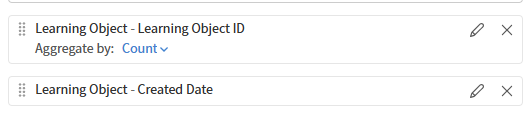
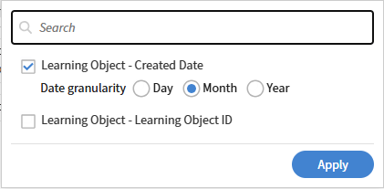
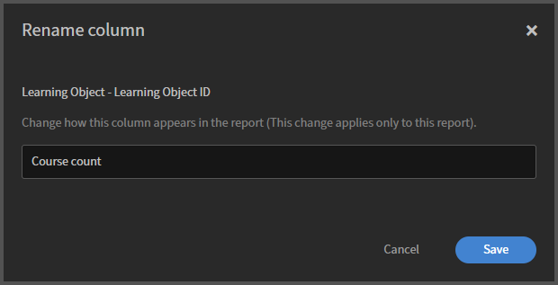
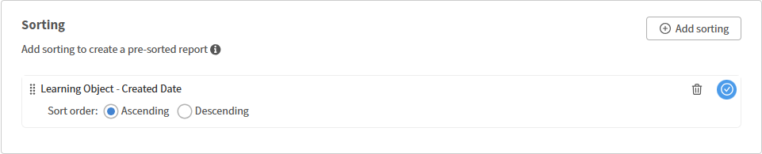
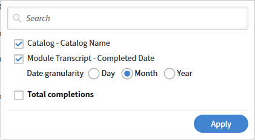
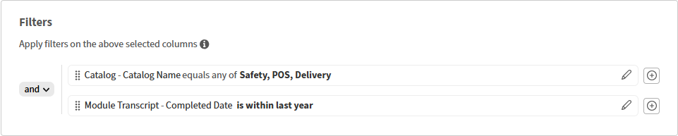
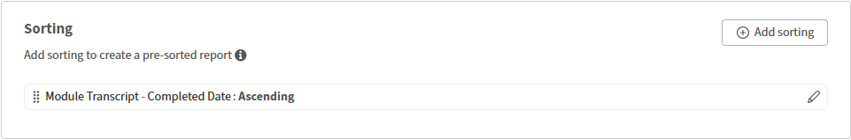

# Crea un report sulle tendenze nel Report Builder

I rapporti sulle tendenze mostrano il modo in cui le metriche, ad esempio il conteggio dei corsi, delle iscrizioni o dei completamenti, cambiano nel tempo. È possibile scegliere una colonna di data e una granularità di tendenza (giorno, settimana o mese) e raggruppare i dati in base a tale periodo di tempo.

## Significato dei dati sulle tendenze

I report sulle tendenze nel Report Builder riflettono **uno snapshot corrente di dati, raggruppati per data**. Non mostrano lo stato storico dei dati in ogni data passata.

Ad esempio, un andamento di iscrizione mensile mostra il numero di iscrizioni esistenti, distribuite nei mesi in cui sono state create. Se un Allievo si è iscritto a gennaio e successivamente ha annullato l’iscrizione, il record di iscrizione potrebbe non essere più visualizzato. Il rapporto riflette lo stato attuale dei record, non quello di gennaio.

Si tratta di una distinzione importante ai fini dell’audit. Se sono necessari dati cronologici point-in-time, utilizzare questo report per l&#39;analisi delle tendenze direzionali anziché record cronologici precisi.

## Creare un report sulle tendenze del conteggio dei corsi

Questo report mostra quanti corsi sono stati aggiunti all’account di mese in mese.

1. Seleziona **Report** > **Report Builder**, quindi seleziona la scheda **Report**.
2. Selezionare **Crea report**. Digita un nome, ad esempio MoM conteggio corsi.
3. Aggiungi **ID oggetto di apprendimento** dal set di dati **Oggetto di apprendimento**.
4. Aggiungi **Data di creazione** dal set di dati **Oggetto di apprendimento**.

   

5. Applica **Raggruppa per** in data **Data creazione**. Imposta la granularità della tendenza su **Mese**.

   

6. Applica **Count** a **ID oggetto di apprendimento**. Immetti l’alias Conteggio corsi.

   

7. Ordina in base alla **Data creazione** in ordine crescente per visualizzare la tendenza in ordine cronologico.

   

8. Selezionate **Salva report** e selezionate **Azioni** > **Scarica** per scaricare il report.

Il file scaricato consiste in una tendenza mensile dell’attività di creazione del corso, che mostra il numero di corsi creati nel tempo. Consente di tenere traccia dei modelli di produzione del corso, dei picchi, dei declini e della crescita complessiva dei contenuti.

## Creare un report sulle tendenze dei completamenti a livello di catalogo

Questo report mostra i totali di completamento mensili per catalogo in un periodo definito.

1. Seleziona **Report** > **Report Builder**, quindi seleziona la scheda **Report**.
2. Selezionare **Crea report**. Digitare un nome, ad esempio MoM completamento catalogo.
3. Aggiungi **Nome catalogo** dal set di dati **Catalogo**.
4. Aggiungi **Data completamento** dal set di dati **Trascrizione modulo**.
5. Aggiungi **ID oggetto di apprendimento** dal set di dati **Oggetto di apprendimento** per contare i completamenti.
6. Applica **Raggruppa per** su **Nome catalogo**. Applica anche **Raggruppa per** in data **Completata** con granularità **Mese**.

   

7. Applica **Count** a **ID oggetto di apprendimento**. Immettere l&#39;alias Totale completamenti.
8. Aggiungi un filtro: **Il catalogo** si trova in Sicurezza, POS, Consegna (o nei cataloghi pertinenti per il tuo account).
9. Aggiungi un filtro: **La data di completamento** è compresa nell&#39;ultimo anno.

   

10. Ordina per **Data completamento** crescente.

    

11. Selezionate **Salva report** e selezionate **Azioni** > **Scarica** per scaricare il report.

## Procedure ottimali

* Utilizza **Data di completamento** per le tendenze di completamento e **Data di iscrizione** per le tendenze di iscrizione. L’utilizzo di un campo data errato genera risultati fuorvianti.
* Aggiungi un filtro per data per limitare la tendenza a una finestra significativa, ad esempio, gli ultimi 12 mesi per una tendenza mensile o le ultime 8 settimane per una tendenza settimanale.
* Assegna un&#39;etichetta al report di andamento con la granularità e l&#39;intervallo di date nel nome, ad esempio &quot;MoM completamento catalogo - ultimi 3 mesi&quot;, in modo che sia chiaro quando lo visualizzi in seguito.
