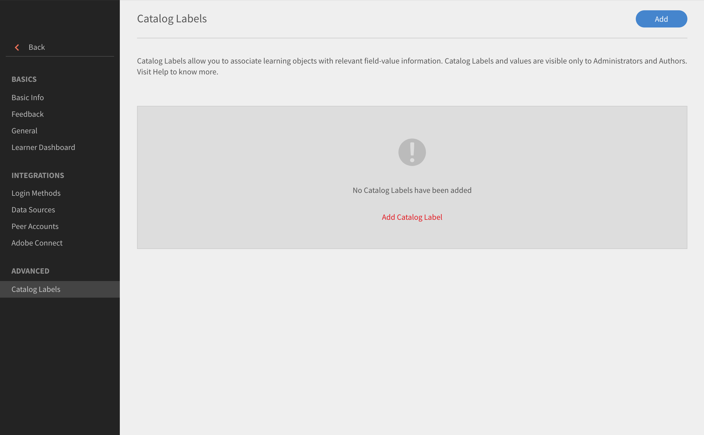

# Etichette del catalogo

Le etichette del catalogo consentono di taggare gli oggetti di apprendimento con campi specifici e applicare uno o più valori. Se questa opzione è attivata, gli amministratori e gli autori possono impostare etichette del catalogo e valori e collegarli agli oggetti di apprendimento.

Utilizza questa funzione per categorizzare facilmente i dati. Ad esempio, se desideri categorizzare gli oggetti di apprendimento in base a posizione, reparto o competenze. Potresti applicare questi campi e filtrare i dati.

Per abilitare le etichette del catalogo, procedi come segue:

* Come amministratore, apri **[!UICONTROL Impostazioni]** > **[!UICONTROL Generale]** > **[!UICONTROL Mostra etichetta del catalogo]**.
* Usa la casella di controllo per abilitare l’etichetta.

## Aggiungere etichette del catalogo {#addcataloglabels}

Per aggiungere etichette del catalogo, segui questa procedura:

1. Apri  **[!UICONTROL Impostazioni]** > **[!UICONTROL Etichette del catalogo]** sotto il **[!UICONTROL Avanzate]** opzione. Si apre la pagina [!UICONTROL Etichette del catalogo].

   

1. Fai clic su **[!UICONTROL Aggiungi etichetta del catalogo]** o **[!UICONTROL Aggiungi]** nell’angolo in alto a destra. Viene visualizzata la finestra di dialogo **[!UICONTROL Aggiungi etichetta del catalogo]**.
1. Aggiungi etichetta del catalogo e i relativi valori nei campi. Un campo personalizzato può avere più valori. Gli autori possono scegliere tra questi valori durante la creazione del corso.

   

1. Fai clic su **[!UICONTROL Salva]**.
1. Quando salvi l’etichetta, viene visualizzata nella pagina delle etichette del catalogo. Puoi scegliere se renderla un valore obbligatorio o meno.

   

## Applicare etichette ai cataloghi {#applylabelstocatalogs}

Dopo aver creato le etichette, è possibile applicarle a cataloghi specifici seguendo questi passaggi:

1. Apri **[!UICONTROL Cataloghi]** dal riquadro a sinistra. Si apre la pagina del catalogo che mostra l’elenco di cataloghi.
1. Seleziona il catalogo desiderato e applica l’etichetta.
1. Apri Etichette del catalogo nel riquadro a sinistra.
1. Fai clic **[!UICONTROL Modifica]** nell’angolo in alto a destra. La pagina mostra l’elenco delle etichette del catalogo disponibili.
1. Fai clic su **[!UICONTROL Aggiungi al catalogo]** per aggiungere un’etichetta al catalogo.
1. Per rimuovere etichette esistenti aggiunte a un catalogo, fai clic su **[!UICONTROL Rimuovi]**.

Quando un campo personalizzato viene aggiunto al catalogo, si applica a tutti gli oggetti di apprendimento che fanno parte del catalogo.
