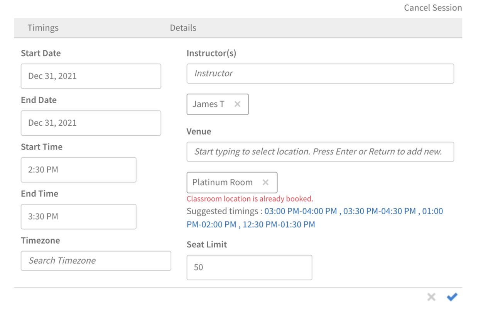
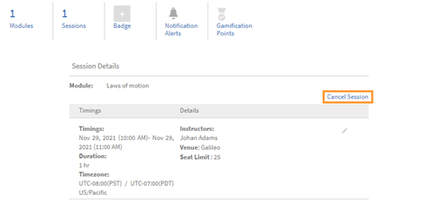

# Aula

## Panoramica

Gli amministratori ora possono configurare una libreria di aule. Per ogni aula, gli amministratori possono impostare i metadati che includono il nome della posizione, il limite di partecipanti e altre informazioni come l’URL. Autori e Amministratori possono quindi utilizzare questi percorsi preconfigurati per configurare eventi di formazione guidati da istruttori (moduli classe).

Per aggiungere un’aula, puoi usare i due modi seguenti.

## Aggiungere un’aula mediante l’interfaccia utente

È possibile aggiungere un’aula utilizzando l’interfaccia utente:

1. Nell’app di amministrazione (l’interfaccia utente per i ruoli di amministratore), fai clic su **[!UICONTROL Impostazioni]** > **[!UICONTROL Aule]**.

1. Fare clic sul pulsante **[!UICONTROL Aggiungi altro]** pulsante.

1. Nella **[!UICONTROL Posizione classe]** immetti i seguenti dettagli:

   * Digita il **[!UICONTROL Nome aula]**. Utilizzare un nome univoco. In caso contrario, Learning Manager visualizza un messaggio di errore.
   * Digitare la descrizione dell&#39;ubicazione in **[!UICONTROL Informazioni sulla posizione]** campo. Questo campo è facoltativo.
   * Digita il **[!UICONTROL URL percorso]**. Gli Allievi possono visualizzare queste informazioni nei dettagli dell’aula. L’URL può anche essere un URL di posizione delle mappe, se necessario. Questo campo è facoltativo.
   * Digita il numero di posti disponibili nel **[!UICONTROL Posti limitati]** campo. Indica la capacità dell’aula. Questo valore può essere modificato durante la creazione dell’evento di formazione vero e proprio guidato da un istruttore.

   

   *Aggiungere un’aula*

Dopo aver aggiunto la posizione, il **[!UICONTROL Impostazioni]** > **[!UICONTROL Aule]** nella pagina sono elencate le sale riunioni:

*Visualizza tutte le sale riunioni*

L’elenco contiene i seguenti campi:

**[!UICONTROL Nome ubicazione]** - Nome dell’aula.

**[!UICONTROL Sessioni future]** - Numero di eventi che si verificheranno nel percorso corrispondente. Fare clic sul numero per visualizzare i dettagli in una finestra di dialogo.

*Visualizza sessioni future*

Nella finestra di dialogo vengono visualizzati i dettagli di ogni sessione, inclusi il nome della sessione, il nome del corso di formazione che include la sessione e la pianificazione. L’ora visualizzata si allinea al fuso orario di sistema dell’Allievo.

La **[!UICONTROL Sessioni future]** visualizzazioni dei campi **zero** quando l’aula non viene utilizzata per alcuna sessione o quando è associata a sessioni passate.

**URL percorso** - URL fornito durante la creazione dell’aula.

**Informazioni sulla posizione** - Le informazioni sull’aula che hai fornito durante la creazione dell’aula.

## Aggiungere un’aula con CSV

In alternativa, puoi aggiungere una o più aule importando un file CSV contenente le informazioni dell’aula.

Ingresso **[!UICONTROL App per amministratori]** > **[!UICONTROL Impostazioni]** > **[!UICONTROL Aule]**, fare clic sul pulsante **[!UICONTROL Importa CSV ubicazioni]** pulsante. Individua il percorso contenente il file CSV e selezionalo.

Il file CSV utilizza questi campi per memorizzare i dettagli relativi a una o più aule:

* nome
* info
* url
* seatLimit

È possibile personalizzare le intestazioni.

Il file CSV deve contenere obbligatoriamente tutte le colonne nello stesso ordine specificato qui.

Dopo che il sistema ha importato il file CSV, le posizioni vengono aggiunte alla libreria.

## Cercare le classi

Un Autore o un Amministratore può iniziare a digitare il nome della posizione per visualizzare i risultati pertinenti che iniziano a essere visualizzati. Dai risultati visualizzati, l’Autore o l’Amministratore può quindi selezionare un percorso. Se nei risultati del completamento automatico non viene visualizzata alcuna aula, l’utente può comunque aggiungere il nome della nuova aula. Tieni presente che questo nome di posizione creato utilizzando il flusso di lavoro di creazione della sessione non viene aggiunto alla libreria di posizioni creata dall’Amministratore.

Quando si aggiunge un’aula, la piattaforma di apprendimento indica anche se l’aula è già stata prenotata per il periodo di tempo indicato. Fornisce anche fasce orarie alternative come suggerimenti. In questo modo, se decide di utilizzare la stessa aula, l’Autore può modificare l’orario della riunione.

*Cercare le classi*

## Limita a un elenco predeterminato di istruttori

Al momento, gli utenti possono aggiungere qualsiasi utente registrato come istruttore durante la creazione di un’aula o di una sessione in aula virtuale. Questa funzionalità rimane invariata in questa versione.

Tuttavia, gli Amministratori ora dispongono di un’opzione aggiuntiva per controllare ulteriormente chi viene assegnato come Istruttore sulla piattaforma di apprendimento. In questo modo si evita che vengano aggiunti nuovi istruttori per errore durante la creazione di una sessione.

## Amministratore

Un Amministratore può selezionare **[!UICONTROL Gestione Istruttori]** opzione (disponibile in **[!UICONTROL App per amministratori]** > **[!UICONTROL Impostazioni]** > **[!UICONTROL Generale]**) per garantire che solo gli utenti con una formazione di istruttore predefinita possano essere aggiunti come istruttori per una sessione.

Per configurare un Istruttore, l’Amministratore può selezionare **[!UICONTROL GESTISCI]** > **[!UICONTROL Utenti]** per aprire la pagina Gestione utenti, seleziona un utente e assegna il ruolo di istruttore (utilizzando **[!UICONTROL Azioni]** > **[!UICONTROL Assegna ruolo]**).

## Autore

Se l’Amministratore seleziona **[!UICONTROL Gestione Istruttori]** , un autore può cercare e aggiungere solo utenti con il ruolo di Istruttore alle sessioni in aula, in aula virtuale, agli elenchi di controllo e ai moduli per l’invio dei file.

Inoltre, l’autore può:

* Aggiungi e rimuovi istruttori dalle sessioni esistenti.
* Aggiungi istruttori alle sessioni esistenti che già dispongono di uno o più istruttori.

Pertanto, dopo che un Amministratore ha abilitato **[!UICONTROL Gestione Istruttori]** , solo gli utenti con il ruolo di Istruttore possono essere aggiunti come tali.

>[!NOTE]
>
>Questo non si applica alla migrazione delle sessioni tramite il file CSV. In questo caso, un utente che non dispone del ruolo di istruttore può essere aggiunto come istruttore.

## Annulla sessione esistente

Un Autore o un Amministratore può annullare una sessione e riprogrammarla, se necessario.

Quando un utente annulla una sessione, il sistema invia un’e-mail con l’annullamento della riunione a tutti gli Allievi e gli Istruttori iscritti. L’e-mail include i dettagli della sessione aggiornata.

È disponibile un modello denominato **[!UICONTROL Annullamento della sessione]** che consente di annullare una sessione.

Nella **[!UICONTROL Istanza del corso]** ogni sessione elencata in un’istanza di corso include un’opzione per annullare la sessione.

*Annullare una sessione esistente*

Quando si fa clic sul pulsante **[!UICONTROL Annulla sessione]** , viene visualizzato un messaggio di avviso.

Nella finestra di dialogo del messaggio di avviso, se si fa clic su **[!UICONTROL Procedi]**, il sistema annulla la sessione.

Il sistema cancella anche i seguenti dettagli dopo aver annullato una sessione:

* Data di inizio della sessione
* Data di fine della sessione
* Ora di inizio della sessione
* Ora di fine della sessione
* Istruttori aggiunti alla sessione
* URL aula virtuale
* Posizione/luogo aggiunti alla sessione
* Limite della lista d’attesa aggiunto dall’istruttore

## Amministratore

Nella **[!UICONTROL Istanza del corso]** un amministratore può annullare una o più sessioni. Dopo che l’Amministratore ha annullato una sessione, il sistema cancella tutti i dettagli della sessione ad eccezione del limite di partecipanti.

Inoltre, un Amministratore può:

* Visualizzare gli allievi iscritti e gli allievi nella lista d’attesa di una sessione.
* Annullare l’iscrizione degli Allievi a un corso con una o più sessioni annullate.
* Contrassegna la partecipazione per le sessioni annullate.
* Contrassegnare come completato un corso che contiene una o più sessioni annullate.
* Riprogrammare una sessione annullata.
* Aggiungi un Istruttore a una sessione annullata durante la sua riprogrammazione.

Tieni presente che anche dopo l’annullamento, gli Allievi iscritti all’istanza di formazione continuano a rimanere iscritti. Lo stato delle loro iscrizioni, incluse le iscrizioni confermate, in lista d’attesa e in attesa di approvazione del manager, non cambia. Ciò è utile perché l’Amministratore può configurare e riprogrammare la sessione annullata in futuro.

## Autore

Nella **[!UICONTROL Istanza del corso]** un Autore può annullare una o più sessioni. Una volta che l’Autore annulla una sessione, il sistema cancella tutti i dettagli della sessione ad eccezione del limite di partecipanti.

Pertanto, un Autore può utilizzare il **[!UICONTROL Annulla sessione]** collegamenti per annullare una o più sessioni in aula o in aula virtuale disponibili nella stessa istanza del corso o in istanze diverse.
