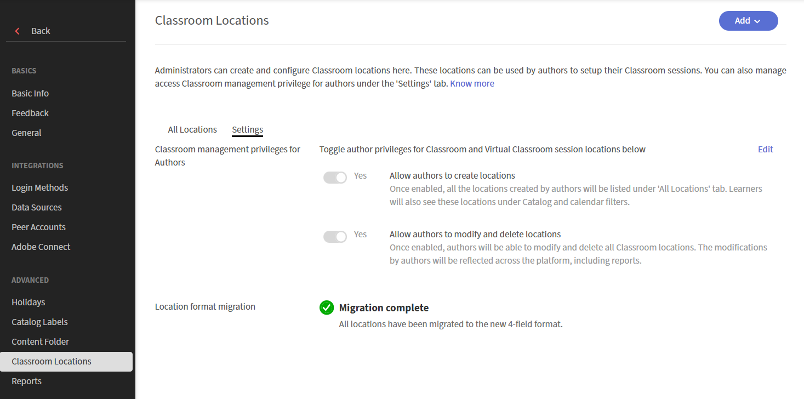

# Aggiungi aule

Gli Amministratori possono creare e gestire una libreria di aule da riutilizzare durante la configurazione di eventi di formazione guidati da istruttore nel modulo Aula e Aula virtuale. Per ogni posizione, puoi definire dettagli quali il nome della posizione, il limite di partecipanti e ulteriori informazioni, incluso un URL. Gli Autori possono quindi selezionare questi percorsi predefiniti durante la creazione di un corso.

Per impostazione predefinita, Adobe Learning Manager utilizza un formato di posizione per campi singoli. Per le organizzazioni che gestiscono le aule in più paesi e lingue, Learning Manager supporta anche un formato strutturato a quattro campi che include **Paese**, **Stato/Provincia/Area geografica**, **Città** e **Nome aula**. Questo formato fornisce funzionalità aggiuntive come il filtro basato sulla posizione e il supporto della lingua per le singole posizioni. Gli amministratori possono passare al formato a quattro campi tramite una migrazione una tantum.

>[!NOTE]
>
>Se il formato dell’aula in quattro campi non è abilitato, gli Autori e gli Allievi possono continuare a utilizzare le aule come di consueto. Il formato della posizione di un singolo campo esistente rimane disponibile e non è necessario apportare modifiche. Per ulteriori informazioni, visualizzare [Migrare al metodo a quattro campi](#migrate-classroom-locations-to-the-four-field-format).

## Configurare le impostazioni dell’aula

Gli Amministratori possono controllare se gli Autori possono creare e gestire aule. Utilizza le impostazioni **Aule** per definire il livello di accesso disponibile per gli Autori.

Per configurare le impostazioni di **aule**:

1. Accedi a Adobe Learning Manager come **Amministratore**.
1. Seleziona **Impostazioni** > **Aule**.

   Viene visualizzata la pagina **Aule**.

1. Selezionare la scheda **Impostazioni**.

   

   *Abilitare i privilegi di autore per aula e aula virtuale dalla scheda **Impostazioni**.*

1. Seleziona **Modifica**.

   L&#39;interruttore diventa modificabile e consente di aggiornare le seguenti impostazioni:

   | **Impostazione** | **Descrizione** |
   |---|---|
   | **Consenti agli autori di creare percorsi** | Abilita questa opzione per consentire agli Autori di creare aula e aula virtuale dei moduli durante la creazione di sessioni di formazione con istruttore. |
   | **Consenti agli autori di modificare ed eliminare le posizioni** | Abilita questa opzione per consentire agli Autori di modificare o eliminare aula e aula virtuale. |

1. Seleziona **Salva**.

## Creare e gestire aule

Gli amministratori possono creare e gestire aule che gli autori possono riutilizzare durante la creazione di sessioni di formazione in aula e aula virtuale. Adobe Learning Manager supporta due formati di percorso:

* **Formato campo singolo**: ogni aula è identificata da un singolo campo **Nome aula**. Per ulteriori informazioni, visualizza [Aggiungi un’aula utilizzando un formato a campo singolo](#add-a-classroom-location-using-a-single-field-format).
* **Formato a quattro campi**: ogni aula è organizzata in **Paese**, **Stato/Provincia/Regione**, **Città** e **Nome aula**, semplificando la gestione delle aule in più aree geografiche. Se il tuo account utilizza attualmente il formato a campo singolo, completa la migrazione una tantum prima di passare al formato a quattro campi. Per ulteriori informazioni, visualizzare [Migrare al metodo a quattro campi](#migrate-classroom-locations-to-the-four-field-format).

### Aggiungere un’aula in un formato campo singolo

Puoi aggiungere un’aula utilizzando il formato a campo singolo:

1. Accedi a Adobe Learning Manager come **Amministratore**.
1. Seleziona **Impostazioni** > **Aule**.
1. Seleziona **Aggiungi** > **Nuova posizione**.
1. Immetti i seguenti dettagli nella finestra di dialogo **Aule**:

   1. Digitare il **nome del percorso**. Usa un nome unico. In caso contrario, ti verrà mostrato un messaggio di errore in Learning Manager.
   1. Inserisci la descrizione dell’aula nel campo **Informazioni aula**. Questo campo è facoltativo.
   1. Inserisci l’**URL dell’aula**. Gli Allievi possono visualizzare queste informazioni nei dettagli dell’aula. L’URL può anche essere una posizione su una mappa, se necessario. Questo campo è opzionale.
   1. Digitare e selezionare l&#39;**area geografica**. Questo campo è facoltativo.
   1. Digitare il numero di posti disponibili nel campo **Limite partecipanti**. Indica la capacità dell’aula. Questo valore può essere modificato durante la creazione dell’evento di formazione vero e proprio guidato da un istruttore.
      
      *Aggiungi un’aula in formato campo singolo.*

### Migrare le aule nel formato a quattro campi

Se il tuo account utilizza il formato legacy per l’aula in un singolo campo, migra le aule esistenti prima di abilitare il formato a quattro campi. Il formato a quattro campi organizza i dati della posizione in **Paese**, **Stato/Provincia/Regione**, **Città** e **Nome della posizione**, semplificando la gestione delle posizioni tra più aree geografiche.

Questa migrazione è un processo una tantum. Una volta scelto il formato a quattro campi, non è possibile ripristinare l’account al formato a campo singolo.

Per migrare i percorsi esistenti:

1. Passa a **Amministratore** > **Aule** e seleziona la scheda **Impostazioni**.
1. Seleziona **Esporta** nella sezione **Migrazione formato posizione**.

   Viene scaricato un file CSV con le aule esistenti. Sono disponibili le seguenti colonne:

   1. **room_id**: identificatore univoco per la posizione.
   1. **lingua**: lingua per il nome e le informazioni sulla posizione tradotti.
   1. **nome**: nome della classe.
   1. **paese**: paese in cui si trova l’aula.
   1. **stato**: stato, provincia o area geografica in cui si trova l&#39;aula.
   1. **città**: città in cui si trova l&#39;aula.
   1. **info**: dettagli aggiuntivi, come il nome dell&#39;edificio, il piano o il numero della stanza.
   1. **url**: URL associato al percorso, ad esempio un collegamento di mappa.
   1. **limite posti**: capacità massima dell’aula.

   >[!NOTE]
   >
   >Il file CSV esportato include sempre le colonne del formato della posizione per quattro campi, anche se questo non è abilitato.

   

   *Controllare l&#39;avanzamento della migrazione prima di passare al formato di percorso a quattro campi.*

1. Per ogni nome di colonna, aggiorna il file CSV con le informazioni richieste, ad esempio Paese, Stato, Città e tutte le altre informazioni richieste.
1. Seleziona **Importa** e carica il file CSV aggiornato.

   Adobe Learning Manager convalida i dati e aggiorna l’avanzamento della migrazione.

1. Quando la barra di avanzamento della migrazione raggiunge il 100%, seleziona **Passa al nuovo formato a 4 campi**. Lo stato della **migrazione del formato del percorso** viene aggiornato a **Migrazione completata**.

   

   *Aggiornamenti della migrazione del formato della posizione allo stato di completamento della migrazione.*

## Aggiungere aule in un formato a quattro campi

Dopo aver completato la migrazione una tantum, gli Amministratori possono creare aule nel formato a quattro campi. Gli Autori possono quindi riutilizzare questi percorsi durante la creazione di sessioni di formazione con istruttore. Gli Amministratori possono aggiungere aule singolarmente o importare più aule da un file CSV.

### Aggiungere un’aula

Utilizza le aule per standardizzare le sedi di formazione e semplificare la pianificazione delle sessioni per gli Autori.

Per aggiungere un’aula:

1. Nell&#39;app di amministrazione, seleziona **Impostazioni** > **Aule**.

   

   *Selezionare la scheda **Tutte le aule**&#x200B;per aggiungere un&#39;aula.*

1. Seleziona **Aggiungi** > **Nuova posizione** dall’angolo in alto a destra.

   Viene visualizzata la finestra a comparsa **Aula**.

   

   *Immetti i dettagli nella finestra a comparsa Aula.*

1. Nella finestra a comparsa **Aula**, immetti i seguenti dettagli:

   | **Campo** | **Descrizione** |
   |---|---|
   | **Paese** | Seleziona il paese in cui si trova l&#39;aula. |
   | **Stato/Provincia/Regione** | Selezionare lo stato, la provincia o l&#39;area geografica. |
   | **Città** | Seleziona la città in cui si trova l&#39;aula. |
   | **Nome località** | Immetti il nome dell’aula o della stanza. |
   | **Informazioni sulla posizione** | Immetti ulteriori dettagli, ad esempio il nome dell’edificio, il piano o il numero della stanza. |
   | **URL percorso** | Immettete un URL per il percorso, ad esempio un collegamento mappa. |
   | **Limite di posti** | Inserisci la capacità massima dell’aula. |

1. Seleziona **Salva**.

   L’aula è stata salvata ed elencata nella scheda **Tutte le aule**.

### Importa aule in blocco

Utilizza l’importazione in blocco per aggiungere più aule o aggiornare le aule esistenti utilizzando un file CSV.

Per importare le aule in blocco:

1. Nell&#39;app di amministrazione, seleziona **Impostazioni** > **Aule**.
1. Seleziona **Scarica CSV** dalla scheda **Tutte le posizioni**.

   Viene scaricato un file CSV contenente le aule esistenti. Sono disponibili le seguenti colonne:

   1. **room_id**: identificatore univoco per la posizione.
   1. **lingua**: lingua per il nome e le informazioni sulla posizione tradotti.
   1. **nome**: nome della classe.
   1. **paese**: paese in cui si trova l’aula.
   1. **stato**: stato, provincia o area geografica in cui si trova l&#39;aula.
   1. **città**: città in cui si trova l&#39;aula.
   1. **info**: dettagli aggiuntivi, come il nome dell&#39;edificio, il piano o il numero della stanza.
   1. **url**: URL associato al percorso, ad esempio un collegamento di mappa.
   1. **limite posti**: capacità massima dell’aula.

1. Per ogni nome di colonna, aggiorna il file CSV con le informazioni richieste, ad esempio Paese, Stato, Città e tutte le altre informazioni richieste.
1. Seleziona **Aggiungi** > **Percorsi di importazione in blocco** dall&#39;angolo in alto a destra.

   Viene visualizzata la finestra a comparsa **Import Locations CSV**.

   

   *Trascina il file CSV con le informazioni aggiornate.*

1. Trascina il file CSV aggiornato nell’area di caricamento.
1. Seleziona **Importa**.

   Le aule vengono aggiornate.

## Aggiungere traduzioni per un’aula

Aggiungi le traduzioni per i campi **Nome aula** e **Informazioni aula** per visualizzare i dettagli dell’aula nelle lingue preferite dell’Allievo.

Per aggiungere traduzioni per un’aula:

1. Seleziona **Tutte le aule** > **Aggiungi** dalle **aule**.
1. Seleziona **Nuova posizione**.

   Viene visualizzata la finestra a comparsa **Aula**.

1. Selezionare **Aggiungi nuova lingua**.

   Viene visualizzata la finestra a comparsa **Aggiungi nuova lingua**.

   

   *Selezionare le lingue dalla finestra a comparsa Aggiungi nuova lingua.*

1. Seleziona **Salva**.

   Le traduzioni vengono salvate e visualizzate agli utenti.

>[!NOTE]
>
>Solo i campi **Nome percorso** e **Informazioni percorso** supportano le traduzioni. I dettagli relativi alla posizione, ad esempio **Paese**, **Stato/Provincia/Regione** e **Città**, non vengono tradotti.

## Modificare un’aula

Per modificare l’aula, effettua le seguenti operazioni:

1. Nell&#39;app di amministrazione, seleziona **Impostazioni** > **Aule**.
1. Passa il mouse sulla posizione dell’aula che desideri modificare.

   

   *Passa il mouse sulla posizione dell’aula richiesta e seleziona l’icona di modifica.*

1. Seleziona l’icona **Modifica aula**.

   Viene visualizzata la finestra a comparsa Aula.

1. Modifica la posizione dell’aula e seleziona **Salva**.

## Eliminare un’aula

Per eliminare un’aula, effettua le seguenti operazioni:

1. Nell&#39;app di amministrazione, seleziona **Impostazioni** > **Aule**.
1. Passa il mouse sulla posizione dell’aula che desideri eliminare.
1. Seleziona l&#39;icona **Elimina aula**.

   Viene visualizzata la finestra a comparsa Conferma richiesta.

   

   *Selezionare Elimina per confermare l&#39;eliminazione di un&#39;aula.*

1. Selezionare **Elimina**.

## Domande frequenti

1. **Cosa succede alle aule esistenti dopo il completamento della migrazione?** 
Puoi abilitare il formato di percorso a quattro campi solo dopo che tutte le posizioni esistenti sono state migrate, manualmente o tramite caricamento CSV. Una volta attivato il formato a quattro campi, tutti i corsi esistenti che utilizzano Aule visualizzano le posizioni nel nuovo formato.

1. **È necessario ristrutturare manualmente il file CSV esportato in modo che corrisponda al formato della posizione dei quattro campi?** 
No. Il file CSV esportato utilizza sempre il formato di posizione a quattro campi, indipendentemente dal fatto che sia attualmente abilitato. È sufficiente aggiornare i valori mancanti prima di importare il file.

1. **La migrazione influisce sui report di Adobe Learning Manager?** 
Sì. Dopo la migrazione, i report che includono le informazioni sull’aula visualizzano le aule nel seguente formato:

   **Paese > Stato/Provincia/Regione > Città > Nome località**

   Questo formato sostituisce il precedente valore di posizione per un singolo campo.

1. **Cosa succede se non si abilita il formato di percorso a quattro campi?** 
Per gli Autori e gli Allievi non cambia nulla. Le aule continuano a essere visualizzate e a funzionare come oggi, utilizzando il formato a campo singolo esistente fino a quando un amministratore non completa la migrazione e abilita il formato a quattro campi.
