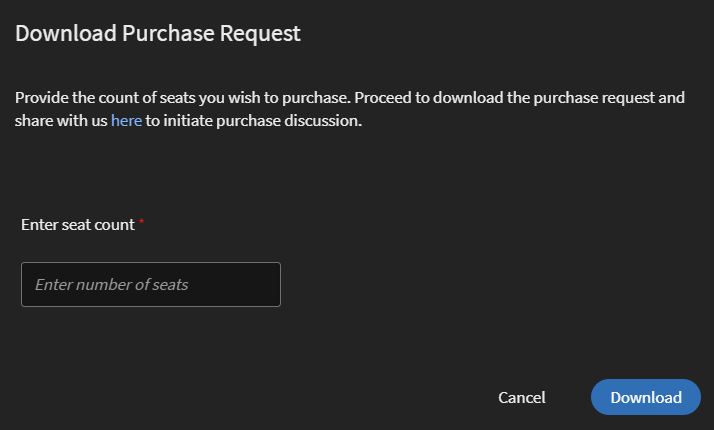

# Contenuti del marketplace

Learning Manager ora offre la possibilità di esplorare i contenuti del marketplace e acquistare corsi di formazione. Esplora oltre 70.000 corsi che trattano un&#39;ampia gamma di argomenti, disponibili in più formati. Scegli tra playlist selezionate che rispondono a una vasta gamma di ruoli e soddisfano le tue esigenze di apprendimento e aggiornamento delle competenze.

Nell’app Amministratore, è disponibile una nuova opzione **[!UICONTROL Contenuti del marketplace]**, che troverai nel pannello a sinistra.

Gli utenti possono acquistare da playlist selezionate che coprono vari argomenti o acquistare l’intero catalogo.

Nella pagina sono disponibili due sezioni: Formazione dell’azienda e Formazione sulle Creative Cloud. La prima sezione lancia il marketplace, con cui puoi acquisire corsi per gli Allievi. Quest’ultimo avvia il catalogo dei contenuti.

La pagina Enterprise Training nell’app Administrator consente di invitare gli utenti e scaricare il report Express Interest, nonché di acquistare l’intero catalogo o la playlist selezionata.

**Invita utenti**

Invita gli utenti a Content Marketplace per esplorare i contenuti ed esprimere l&#39;interesse. In qualità di Amministratore, puoi invitare tutti gli Allievi nell’account o invitare gli Allievi selezionati. Per concedere l’accesso agli Allievi, è necessario invitarli.

Un Allievo può anche essere revocato dall’opzione Contenuti del marketplace. Per revocare l&#39;accesso, fare clic sul pulsante **[!UICONTROL Revoca accesso]** link.  Gli utenti non potranno più visualizzare la pagina Contet Marketplace nell’app per studenti.

Questa opzione è selezionata per impostazione predefinita per tutti i nuovi account. Per gli account esistenti, l’amministratore deve invitare gli utenti a esplorare il marketplace.

## Acquisto

L’accesso illimitato all’intera libreria di corsi. Fare clic sul pulsante **[!UICONTROL Acquisto]** per scaricare un modulo di richiesta di acquisto.

*Immetti il numero di postazioni da acquistare*

Specifica il numero di postazioni per cui desideri acquistare i corsi. Scarica il modulo di richiesta di acquisto e invialo al team di vendita di Learning Manager.

Il team convalida quindi le informazioni e genera una chiave che verrà fornita all&#39;utente. Questa è la chiave di attivazione con cui concederai agli utenti l&#39;accesso al contenuto offerto.

Dopo che la chiave è stata generata dal team CSAM, l’Amministratore può utilizzare la chiave per importare i corsi e migrarli nel catalogo esistente o nel nuovo catalogo.

Durante la migrazione dei corsi, lo stato viene visualizzato come **[!UICONTROL Importazione di corsi]**. Una volta completata la migrazione, l’amministratore riceve una notifica del completamento e dell’esito positivo della migrazione.

La **[!UICONTROL Licenze]** questa sezione visualizza quindi tutte le licenze acquisite per l’account.

L’Amministratore può visualizzare i collegamenti dei cataloghi acquistati nella pagina Panoramica catalogo.

Una volta aggiunti i corsi al catalogo, l’Amministratore può concedere l’accesso ai corsi di formazione a vari utenti o gruppi di utenti.

*Concedere l’accesso alla formazione a utenti e gruppi di utenti*

## Rapporto di interesse espresso

Quando un Allievo fa clic su Esprimi interesse al catalogo nell’app per Allievi, l’interesse viene registrato in un report di interesse espresso. L’Amministratore può scaricare il report. Il report (csv) contiene i seguenti campi:

* Nome del catalogo
* Numero di utenti che manifestano interesse
* E-mail dell’utente che esprime interesse

## Modelli e-mail

Per supportare questo flusso di lavoro, è possibile utilizzare tre modelli e-mail:

1. **[!UICONTROL Attivazione dei contenuti riuscita]:** Questo viene inviato quando l’acquisto di un contenuto con un nome chiave ha esito positivo. Tutti i corsi di formazione acquistati sono ora disponibili.
1. **[!UICONTROL Caricamento automatico degli utenti non riuscito]:** Questo viene inviato quando, per qualche motivo, l’aggiornamento automatico del file CSV nell’account non riesce.
1. **[!UICONTROL Invita gli utenti a esplorare i contenuti]:** Si tratta di un’e-mail di invito inviata agli Allievi quando l’Amministratore ha acquistato i corsi. L’amministratore può visualizzare il rapporto Express Interest per comprendere i requisiti generali e prendere la decisione di acquisto.

1. I corsi acquistati non possono essere aggiunti nei certificati ricorrenti.
1. I corsi acquistati non possono essere condivisi con account condivisi tra pari.
1. I corsi acquistati possono essere utilizzati da tutti gli utenti che vi hanno accesso. Configura la visibilità del catalogo per limitare la visibilità dei corsi acquistati a utenti limitati.
1. I corsi acquistati non possono essere utilizzati una volta scaduta la chiave di attivazione. Acquistare/attivare un&#39;altra chiave per consentire il consumo.

## Hub dei contenuti nel marketplace dei contenuti

L’Hub dei contenuti consente agli Amministratori e agli Esperti in materia (SME) di creare un elenco delle playlist richieste dall’app per Allievi. Una volta creato l’elenco, gli amministratori possono scaricare il modulo di richiesta di acquisto e condividerlo con l’agente di vendita Adobe.

Un Amministratore può invitare gli SME a creare elenchi con le playlist a cui sono interessati.

*Avviare Hub dei contenuti dal marketplace*

L’Hub dei contenuti è disponibile nel ruolo Allievo per tutti gli Amministratori. Gli Amministratori consentono agli SME di creare elenchi con le playlist che sono interessati ad acquistare.

La pagina Hub dei contenuti è sempre visibile agli amministratori nel ruolo di Allievo, in quanto consente di creare comodamente elenchi di playlist. Per aiutarti a creare elenchi con le giuste playlist, gli Amministratori possono rendere questa pagina accessibile a un numero limitato di Esperti in materia nel loro account. Basta visitare la pagina Formazione dell’azienda come Amministratore e procedere ai passaggi necessari per fornire l’accesso.

*Visualizzare le risorse nell&#39;Hub dei contenuti*

Learning Manager consente inoltre agli Amministratori di scaricare una playlist inserita nell’elenco e condividerla con il team di vendita degli Adobi. Prima di scaricare l’elenco, visita l’Hub dei contenuti e inserisci una playlist nell’elenco aggiungendola alla libreria.

Quindi, da Amministratore, fai clic su **[!UICONTROL Contenuti del marketplace]** > **[!UICONTROL Formazione dell’azienda]** > **[!UICONTROL Sezione Acquisti]** > **[!UICONTROL Playlist selezionate]**. Fare clic sul pulsante **[!UICONTROL Acquisto]** per scaricare il modulo di richiesta di acquisto che contiene i dettagli della playlist inserita nell’elenco.

*Scarica il modulo di richiesta di acquisto*

I corsi e le playlist che vedi nell’Hub dei contenuti sono gli stessi che vedi nel Marketplace dei contenuti. L’Hub dei contenuti offre agli Amministratori e a un numero limitato di SME la possibilità di creare comodamente elenchi di playlist da acquistare.
