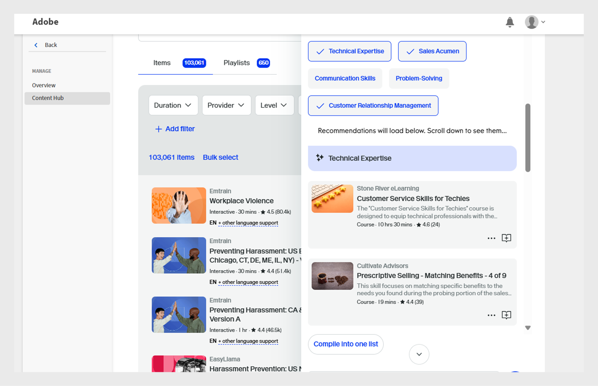
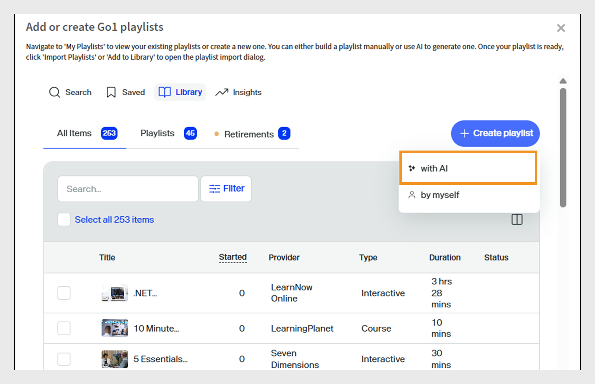

# Correggere i corsi Go1 in un percorso di apprendimento

Gli amministratori spesso devono gestire i corsi da più repository o cataloghi, il che rende difficile identificare le opzioni migliori. Ciò è particolarmente difficile con Go1, dove sono disponibili migliaia di corsi. Per semplificare questo aspetto, forniamo una funzione di cura basata sull’intelligenza artificiale direttamente all’interno del flusso di creazione del percorso di apprendimento. Questo consente agli amministratori di individuare e selezionare rapidamente i corsi più pertinenti

Aggiungi i corsi Go1 direttamente ai percorsi di apprendimento e alle certificazioni. Creazione di percorsi di apprendimento che includono corsi Go1, in modo che gli Allievi possano accedere a corsi Go1 selezionati come parte del loro corso di formazione.

>[!INFO]
>
>È necessaria una licenza Go1 attiva per aggiungere corsi Go1 a percorsi di apprendimento o certificazioni. Visualizza questo [articolo](/help/migrated/administrators/feature-summary/content-marketplace.md) per ulteriori informazioni sui dettagli della licenza Go1.

## Creare un percorso di apprendimento

Per creare un percorso di apprendimento con corsi Go1:

1. Accedi a Adobe Learning Manager come amministratore.
2. Seleziona **[!UICONTROL Percorsi di apprendimento]** nel riquadro di navigazione a sinistra.
3. Seleziona **[!UICONTROL Aggiungi]**.

   
   _Seleziona Aggiungi nella sezione Percorsi di apprendimento per creare e organizzare nuovi programmi di formazione strutturati per gli Allievi_

4. Digita i dettagli richiesti e seleziona **[!UICONTROL Salva]**. Per ulteriori informazioni, visualizzare questo [articolo](/help/migrated/administrators/feature-summary/learning-paths.md).
5. Puoi aggiungere corsi a un percorso di apprendimento nei seguenti modi:

   * **[!UICONTROL Aggiungere corsi o percorsi di apprendimento]**: aggiungi corsi o percorsi di apprendimento esistenti disponibili in Adobe Learning Manager.
   * **[!UICONTROL Scelta dei contenuti di Go1]**: aggiunta di corsi dalla piattaforma Go1.
6. Seleziona **[!UICONTROL Scelta contenuto da Go1]**.

   
   _Aggiungi i corsi Go1 alla playlist di sviluppo delle abilità dei tecnici di vendita per espandere le opzioni di apprendimento con contenuti di terze parti selezionati_
7. Gli amministratori possono creare una playlist nei modi seguenti:

   * Utilizzo di **[!UICONTROL Go1 AI Assistant]**. Per ulteriori informazioni, vedere [Go1 AI Assistant](/help/migrated/administrators/feature-summary/content-marketplace/curate-go1-playlist.md#go1-ai-assistant).
   * Nella **[!UICONTROL Libreria]**, seleziona **[!UICONTROL Crea playlist]** e scegli una delle seguenti opzioni:
a. **[!UICONTROL con IA]**: crea una playlist con l&#39;aiuto dell&#39;IA. Per ulteriori informazioni, visualizzare la [sezione](/help/migrated/administrators/feature-summary/content-marketplace/curate-go1-playlist.md#create-a-playlist-with-ai).
b. **[!UICONTROL da solo]**: crea una sequenza di riproduzione aggiungendo manualmente i corsi. Per ulteriori informazioni, visualizzare la [sezione](/help/migrated/administrators/feature-summary/content-marketplace//curate-go1-playlist.md#create-a-playlist-manually).

### Go1 AI Assistant

Adobe Learning Manager offre assistenza basata sull’intelligenza artificiale per semplificare la cura dei corsi per gli amministratori. Con l’Assistente AI disponibile nella pagina Hub dei contenuti, gli amministratori possono porre domande, ricevere consigli personalizzati e creare istantaneamente playlist. Inoltre, il supporto dell’IA è integrato nel flusso di creazione del percorso di apprendimento, consentendo agli amministratori di identificare rapidamente i corsi più pertinenti da cataloghi di grandi dimensioni come Go1. Queste funzionalità semplificano il processo di cura, consentono di risparmiare tempo e assicurano che gli Allievi ricevano i contenuti migliori.

Per creare una sequenza di riproduzione con l&#39;IA:

1. Seleziona l&#39;opzione **[!UICONTROL Chat con AI]** nell&#39;Hub dei contenuti Go1.

   
   _Schermata Hub dei contenuti che mostra l&#39;opzione Chat con IA, in cui gli amministratori possono interagire con l&#39;Assistente AI per porre domande_

2. Digita la domanda e seleziona **[!UICONTROL Invia]**.

   
   _Schermata Assistente AI in cui gli amministratori possono digitare le domande, ottenere consigli sui corsi e creare istantaneamente una playlist su misura per le proprie esigenze_
3. Seleziona le abilità, quindi seleziona **[!UICONTROL Compila in un elenco]**.

   
   _Schermata dell&#39;Assistente AI che mostra le abilità rilevanti da selezionare e compilare nella playlist_
4. Selezionare **[!UICONTROL Converti in sequenza di riproduzione]**.

   
   _La schermata dell&#39;Assistente AI che mostra l&#39;opzione Converti in playlist per compilare tutti i corsi in playlist_

5. Selezionare **[!UICONTROL Visualizza sequenza di riproduzione]**.

   
   _Schermata Assistente AI che mostra l’opzione Visualizza sequenza di riproduzione per pubblicare e importare la sequenza di riproduzione nel percorso di apprendimento_

6. Seleziona **[!UICONTROL Publish]** per creare la sequenza di riproduzione. Puoi creare ulteriori sequenze di riproduzione in Go1 e aggiungerle a un percorso di apprendimento.
7. Seleziona **Sì** nella richiesta di conferma.
8. Selezionare la sequenza di riproduzione dalla **[!UICONTROL Seleziona sequenza di riproduzione da importare]**.

   
   _Selezionare e importare la sequenza di riproduzione Miglioramento competenze tecnico commerciale dalla libreria Go1 in Adobe Learning Manager_

9. Seleziona **[!UICONTROL Aggiungi playlist al percorso di apprendimento]** e quindi **[!UICONTROL Publish]**.

I corsi presenti nella sequenza di riproduzione verranno aggiunti al percorso di apprendimento. Gli Amministratori possono quindi iscrivere gli Allievi, che possono iniziare immediatamente a seguire i corsi.

### Creare una sequenza di riproduzione con l&#39;IA

Gli amministratori possono digitare la descrizione della sequenza di riproduzione nel prompt AI. L’IA cura i corsi correlati e crea una playlist in base ai requisiti. L’intelligenza artificiale genera una sequenza di riproduzione interpretando l’obiettivo di apprendimento o il messaggio fornito dall’utente. Durante la creazione di una playlist, gli amministratori possono selezionare di curare i contenuti &quot;con IA&quot;, che consente al sistema di utilizzare modelli di lingua di grandi dimensioni per comprendere gli obiettivi di apprendimento specificati e le preferenze dei contenuti, come la durata e il tipo. L’IA cerca quindi nella libreria dei contenuti gli oggetti di apprendimento pertinenti che corrispondono a questi criteri.

1. Seleziona **[!UICONTROL Crea playlist]**, quindi seleziona **[!UICONTROL con IA]**.

   
   _Crea playlist selezionate con l’intelligenza artificiale, che consente di fornire suggerimenti sul corso automatizzati e personalizzati in base alle esigenze dell’Allievo_

2. Digita una breve descrizione della sequenza di riproduzione nel campo di testo **[!UICONTROL Inserisci il tuo obiettivo di apprendimento]**. Ad esempio, _Crea una playlist di apprendimento per i tecnici delle vendite dedicata al miglioramento della conoscenza dei prodotti, della comunicazione tecnica, del coinvolgimento dei clienti e della vendita delle soluzioni_.

   
   _Digita il tuo obiettivo di apprendimento per creare una playlist personalizzata, aiutando Adobe Learning Manager a consigliare corsi mirati su misura per le esigenze degli Allievi_

3. Seleziona **[!UICONTROL Avanti]**. Il messaggio visualizza le abilità richieste, la durata del corso e il tipo di corso da selezionare.
4. Seleziona le abilità richieste.

   
   _Scegliere le abilità dall&#39;elenco per la cura dei corsi per il tecnico di vendita_

5. Seleziona la durata del corso e digita la sequenza di riproduzione.
   
   _Scegliere la durata e il tipo di corsi per la cura dei corsi per il Sales Engineer_

6. Seleziona **[!UICONTROL Genera playlist]**. La sequenza di riproduzione viene creata con 10 corsi su 2 pagine e gli amministratori possono utilizzarla per creare un percorso di apprendimento.

   
   _Rivedi la tua playlist di miglioramento delle abilità del tecnico di vendita selezionata in Adobe Learning Manager_

7. Per individuare e aggiungere un&#39;immagine alla sequenza di riproduzione, selezionare **[!UICONTROL Seleziona immagine]**.
8. Modificate il titolo utilizzando le opzioni di intelligenza artificiale disponibili:

   * **[!UICONTROL Migliorare la scrittura]**: perfezionare il titolo esistente per renderlo più chiaro.
   * **[!UICONTROL Genera titolo]**: crea automaticamente un nuovo titolo in base al contenuto o al contesto.

   
   _Schermata di creazione della sequenza di riproduzione Go1 con opzioni AI per migliorare il titolo della sequenza di riproduzione_

9. Modificate la descrizione utilizzando le opzioni di intelligenza artificiale disponibili:
   * **[!UICONTROL Migliorare la scrittura]**: perfezionare la descrizione esistente per renderla più chiara.
   * **[!UICONTROL Genera descrizione]**: crea automaticamente una nuova descrizione in base al contenuto o al contesto.
   * **[!UICONTROL Abbreviarlo]**: accorcia il testo o il titolo mantenendo l&#39;idea principale.

   
   _Schermata di creazione della sequenza di riproduzione Go1 con opzioni AI per migliorare la descrizione della sequenza di riproduzione_

10. Seleziona **[!UICONTROL Aggiungi elemento]** per aggiungere altri corsi alla sequenza di riproduzione.

11. Seleziona **[!UICONTROL Publish]** per creare la sequenza di riproduzione. Puoi creare ulteriori sequenze di riproduzione in Go1 e aggiungerle a un percorso di apprendimento.
12. Seleziona **Sì** nella richiesta di conferma.
13. Selezionare la sequenza di riproduzione dalla **[!UICONTROL Seleziona sequenza di riproduzione da importare]**.

   
   _Selezionare e importare la sequenza di riproduzione Miglioramento competenze tecnico commerciale dalla libreria Go1 in Adobe Learning Manager_

14. Seleziona **[!UICONTROL Aggiungi playlist al percorso di apprendimento]** e quindi **[!UICONTROL Publish]**.

I corsi presenti nella sequenza di riproduzione verranno aggiunti al percorso di apprendimento. Gli Amministratori possono quindi iscrivere gli Allievi, che possono iniziare immediatamente a seguire i corsi.

>[!NOTE]
>
>Gli amministratori possono anche creare playlist direttamente dalla pagina Hub dei contenuti. Per ulteriori informazioni, consulta [Hub dei contenuti](/help/migrated/administrators/feature-summary/content-marketplace.md#content-hub).

## Creare una playlist manualmente

Seleziona manualmente i corsi che meglio corrispondono alle esigenze degli Allievi e organizza ulteriori corsi pertinenti.

Per creare manualmente una sequenza di riproduzione:

1. Seleziona **[!UICONTROL Crea playlist]**, quindi seleziona **[!UICONTROL da solo]**.

   
   _Creare manualmente una playlist che offra agli amministratori il pieno controllo per la cura dei corsi in base a specifiche esigenze degli Allievi_

2. Per individuare e aggiungere un&#39;immagine alla sequenza di riproduzione, selezionare **[!UICONTROL Seleziona immagine]**.
3. Digitare il titolo e la descrizione della sequenza di riproduzione.

   
   _Aggiungere un titolo e una descrizione alla sequenza di riproduzione in Adobe Learning Manager per definirne chiaramente lo scopo e aiutare gli allievi a sviluppare le abilità in modo mirato_

4. Selezionare **[!UICONTROL Crea]**.
5. Seleziona **[!UICONTROL Aggiungi elemento]** per aggiungere i corsi correlati.

   
   _Aggiungere elementi alla playlist per lo sviluppo delle competenze dei tecnici di vendita in Adobe Learning Manager per la cura dei corsi mirati_

6. Cerca e seleziona i corsi richiesti.
7. Seleziona **[!UICONTROL Publish]**. La sequenza di riproduzione è stata creata con i relativi corsi.
8. Seleziona **Sì** nella richiesta di conferma.
9. Selezionare la sequenza di riproduzione dalla **[!UICONTROL Seleziona sequenza di riproduzione da importare]**.
10. Seleziona **[!UICONTROL Aggiungi playlist al percorso di apprendimento]** e quindi **[!UICONTROL Publish]**.

I corsi presenti nella sequenza di riproduzione verranno aggiunti al percorso di apprendimento. Gli Amministratori possono quindi iscrivere gli Allievi, che possono iniziare immediatamente a seguire i corsi.

## Gestisci playlist Go1

Gli amministratori possono gestire le sequenze di riproduzione Go1 create duplicandole, condividendole o eliminandole.

### Duplicare la sequenza di riproduzione

Per duplicare la sequenza di riproduzione:

1. Accedi a Adobe Learning Manager come amministratore.
2. Selezionare **[!UICONTROL Content Marketplace]**.
3. Seleziona **[!UICONTROL Hub dei contenuti]**, quindi seleziona **[!UICONTROL Libreria]**.
4. Seleziona la sequenza di riproduzione, quindi seleziona **[!UICONTROL Modifica]**.
   
   _Schermata della playlist Go1 con le opzioni per modificare la playlist_
5. Seleziona i puntini di sospensione, quindi seleziona **[!UICONTROL Duplica]**.
   
   _Schermata di gestione della sequenza di riproduzione, evidenziazione dell&#39;opzione Duplica_

La sequenza di riproduzione selezionata verrà duplicata e aggiunta alla libreria di contenuti Go1

### Eliminare la sequenza di riproduzione

Per eliminare la sequenza di riproduzione:

1. Accedi a Adobe Learning Manager come amministratore.
2. Selezionare **[!UICONTROL Content Marketplace]**.
3. Seleziona **[!UICONTROL Hub dei contenuti]**, quindi seleziona **[!UICONTROL Libreria]**.
4. Seleziona la sequenza di riproduzione, quindi seleziona **[!UICONTROL Modifica]**.
   
   _Schermata Go1 Playlist con le opzioni per modificare la playlist_
5. Seleziona i puntini di sospensione, quindi seleziona **[!UICONTROL Elimina playlist]**.
   
   _Schermata di gestione della sequenza di riproduzione, evidenziazione dell&#39;opzione Elimina sequenza di riproduzione_

La sequenza di riproduzione selezionata verrà eliminata dalla libreria Go1.

### Condividere la playlist

L’opzione Condividi playlist non è supportata nell’integrazione Go1 con Adobe Learning Manager. Questa opzione verrà rimossa dall’interfaccia utente nella prossima versione.

## Limite del corso superato

Quando gli Amministratori aggiungono corsi Go1 a un percorso di apprendimento, potrebbero visualizzare un errore se i corsi aggiunti di recente non sono ancora stati sincronizzati con Adobe Learning Manager. Questi corsi saranno disponibili entro 48-72 ore.

Se aggiungi ora la playlist, verranno inclusi solo i corsi già sincronizzati.

Per includere tutti i corsi, si consiglia di attendere il completamento della sincronizzazione prima di aggiungere la playlist a un percorso di apprendimento.

## Corsi Go1 nelle certificazioni

Gli amministratori possono aggiungere corsi Go1 nei programmi di certificazione all’interno di Adobe Learning Manager. Durante la creazione di una certificazione, gli amministratori possono cercare e selezionare corsi dal catalogo dei contenuti Go1. Tutti i corsi Go1 importati tramite il piano Go1 sono disponibili per la selezione all’interno del flusso di lavoro di certificazione.

Le certificazioni che includono corsi Go1 possono essere configurate come perpetue o ricorrenti. Nel caso di certificazioni ricorrenti, il certificato si rinnova automaticamente dopo l’intervallo di tempo definito, consentendo agli Allievi di seguire nuovamente i corsi Go1 e mantenere il proprio stato di certificazione.

Per ulteriori informazioni sulla creazione di certificati, vedere [Certificazioni](/help/migrated/administrators/feature-summary/certifications.md).
