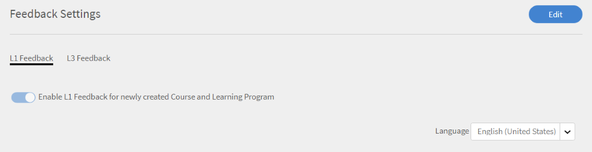
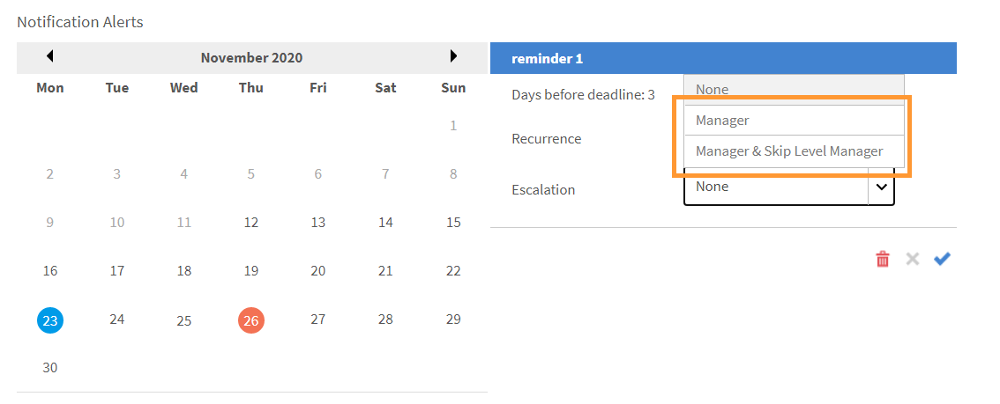

# Creazione di istanze di corsi e percorsi di apprendimento

Il presente documento illustra la procedura da seguire per creare moduli di corso, istanze e corsi per il ruolo di Amministratore.

I corsi vengono creati dagli Autori. Gli Allievi possono seguire i corsi e gli Amministratori possono tenere traccia delle loro prestazioni in base alla frequenza dei corsi.

## Panoramica {#overview}

I corsi vengono creati dagli Autori. Gli Allievi possono seguire i corsi e gli Amministratori possono tenere traccia delle loro prestazioni in base alla frequenza di un corso. Gli Amministratori possono visualizzare i corsi creati dagli Autori ed eseguire alcune attività, come illustrato nella presente sezione. In qualità di Amministratore, puoi creare programmi di apprendimento unici con una serie predefinita di corsi per gli Allievi.

## Creazione di un’istanza di un corso {#createinstanceofacourse}

### Gestire le istanze

>[!INFO]
>
>In questo corso imparerai come modificare i dettagli e le proprietà delle istanze.    

Se non è possibile avviare il corso di formazione, scrivere a <almacademy@adobe.com>.

### Come creare un’istanza

Dopo che un Autore ha creato un corso, è possibile creare istanze del corso. Creando istanze di un corso, puoi offrire lo stesso corso ai tuoi Allievi in diversi periodi. Gli Allievi possono scegliere un’istanza qualsiasi e iscriversi. Puoi configurare ogni istanza in modo che disponga di un proprio set di distintivi, feedback e altre impostazioni.

Per creare un’istanza,

1. fai clic su **[!UICONTROL Corsi]** nel riquadro di navigazione sinistro della web app dell’Amministratore.
1. Nell’elenco dei corsi, seleziona il corso richiesto e fai clic su **[!UICONTROL Visualizza corso]**.

   

   *Visualizza un corso*

1. Per creare istanze, fai clic su **[!UICONTROL Istanze]** nel riquadro sinistro. Ogni corso ha un’istanza per impostazione predefinita. Puoi modificare l’istanza predefinita o aggiungere istanze. Non è possibile eliminare questa istanza del corso.
1. Fai clic su **[!UICONTROL Aggiungi nuova istanza]** nell’angolo in alto a destra delle informazioni sul corso. Viene visualizzata una nuova istanza del corso.
1. Immetti le proprietà dell’istanza:

   * Nel campo **[!UICONTROL Nome istanza]**, immetti il nome dell’istanza che desideri associare al corso. Assicurati di utilizzare un nome univoco per l’istanza.
   * Specifica la scadenza per il completamento dell’istanza. Gli Allievi devono ottenere lo stato di completamento del corso entro questa data.
   * Fai clic su **[!UICONTROL Mostra altre opzioni]** per visualizzare altre opzioni di scadenza.
   * **[!UICONTROL Scadenza iscrizione]:** Data entro la quale un Allievo deve iscriversi a un oggetto di apprendimento in caso di iscrizione autonoma.
   * **[!UICONTROL Scadenza annullamento iscrizione]:** Puoi scegliere di limitare l’annullamento dell’iscrizione da parte dello stesso Allievo fissando una scadenza per l’annullamento dell’iscrizione.
   * **[!UICONTROL Fuso orario]:** Cercare e quindi selezionare il **[!UICONTROL Fuso orario]** dal menu a discesa.

   Un Amministratore può decidere di impostare scadenze di completamento per un corso o un programma di apprendimento sulla base di requisiti. Tuttavia è consigliabile impostarne una per i corsi di formazione in classe o nella classe aula virtuale.

   

   *Impostare la scadenza per il completamento*

### Visualizza le proprietà dell’istanza {#viewpropertiesoftheinstance}

*Visualizza proprietà dell&#39;istanza*

1. **Moduli:** il numero di moduli creati dall’Autore del corso
1. **Allievi iscritti:** il numero di Allievi iscritti al corso dall’Amministratore.
1. **Sessioni:** il numero di moduli Classe e Classe virtuale nel corso.
1. **Feedback abilitato:** Visualizza se i feedback L1, L2 e L3 sono abilitati per questo corso.

>[!NOTE]
>
>L’amministratore annulla le sessioni passando a Istanze > Sessioni e selezionando Annulla sessione.

### Ritiro dell’istanza {#retireaninstance}

Per ritirare un’istanza, procedi come indicato di seguito.

1. Nell’istanza, fai clic sul menu a discesa e scegli l’opzione **[!UICONTROL Ritira istanza]**.

   

   *Rimozione di un&#39;istanza*

1. Per cercare tutte le istanze ritirate, fai clic sulla scheda **[!UICONTROL Ritirate]** nella pagina Istanze.

### Ripristino di un’istanza {#restoreaninstance}

Per ripristinare lo stato di attivazione di un’istanza ritirata, procedi come indicato di seguito:

1. Nell’istanza, fai clic sul menu a discesa e scegli l’opzione **[!UICONTROL Riapri istanza]**.

   

   *Ripristinare un&#39;istanza*

1. L’istanza viene ripristinata in modalità attiva.

### Eliminare un’istanza

Gli amministratori possono eliminare l&#39;istanza utilizzando l&#39;opzione **Elimina l&#39;istanza** subito dopo la creazione. Non è possibile eliminare le istanze se è collegata una sessione o se vi sono iscritti allievi.

*Eliminare un&#39;istanza*

>[!NOTE]
>
>Non è possibile eliminare l&#39;istanza predefinita.

### Invio di e-mail a livello di istanza

Ecco cosa devono fare gli Allievi per inviare e-mail a livello di istanza:

1. Nella pagina **[!UICONTROL Istanze]**, seleziona le opzioni per qualsiasi istanza, quindi fai clic su **[!UICONTROL Invia e-mail agli Allievi iscritti]**.

*Invia e-mail agli Allievi iscritti all’istanza*

1. Nella finestra di dialogo **[!UICONTROL Crea annuncio]**, seleziona Digita come e-mail. Specifica l’oggetto, digita il messaggio e fai clic su **[!UICONTROL Salva]**. La formazione viene selezionata automaticamente.

   

   *Crea annuncio come e-mail*

1. Dopo aver fatto clic su **[!UICONTROL Salva]**, visualizzerai un messaggio che confermerà la corretta creazione dell’annuncio. Per pubblicare l’annuncio, fai clic su **[!UICONTROL Pubblica ora]**.

   

## Iscrizione degli Allievi ai corsi

In questo corso di formazione imparerai come iscrivere, annullare e iscrivere nuovamente gli Allievi.

Se non è possibile avviare il corso di formazione, scrivere a <almacademy@adobe.com>.

### Iscrizione degli Allievi in varie istanze

1. Seleziona un corso dall’elenco dei corsi.
1. Seleziona **[!UICONTROL Allievi]** sul pannello a sinistra.
1. Seleziona **[!UICONTROL Iscrizione]**.

   

   *Publish del corso*

1. Nella finestra di dialogo [!UICONTROL **Iscrivi Allievi**], è possibile:

   * Seleziona un’istanza per iscrivere un Allievo dal menu a discesa Seleziona istanza.
   * Seleziona l’utente, i gruppi di utenti o entrambi nel campo Includi allievi.
   * Seleziona gli Allievi che desideri escludere dall’istanza nel campo Escludi Allievi.
   * Nella parte inferiore della finestra di dialogo, seleziona Sì se desideri che uno o più Allievi siano iscritti all’istanza selezionata.

1. Seleziona **[!UICONTROL Procedi]**.

   

   *Procedere con l’iscrizione degli Allievi*

### Visualizza il report di iscrizione di un’istanza

1. Seleziona un corso dall’elenco dei corsi.
1. Seleziona **[!UICONTROL Allievi]** sul pannello a sinistra.
1. Seleziona **[!UICONTROL Azioni]** > **[!UICONTROL Esporta]**.

Il file Excel contiene fogli di lavoro per ogni istanza. Un foglio di lavoro è composto dai campi:

* Allievi
* E-mail
* ID univoco utente
* Nome del corso
* ID univoco LO
* Stato
* Criteri di selezione
* Data di iscrizione/Data di annullamento dell’iscrizione (fuso orario UTC)
* Data di completamento (fuso orario UTC)
* Data di scadenza (fuso orario UTC)
* Data di avvio (fuso orario UTC)
* Punteggio quiz
* Nome del manager
* Indirizzo
* userState
* Area di competenza
* Commenti
* Numero di visite
* Date di visita
* Marche temporali (fuso orario UTC)
* Tempo trascorso (minuti)

>[!NOTE]
>
>L’attivazione dell’iscrizione multipla determina l’aggiunta di più righe al report Trascrizione Allievo per ogni corso (una riga per ogni istanza).
>
>Se hai configurato l’automazione dei report che prevede una sola riga per corso, prima di abilitare la funzione Iscrizione multipla devi apportare le modifiche necessarie all’automazione dei report.

### Gestisci l’elenco degli Allievi per un corso {#managelearnerslistforacourse}

1. Fai clic sul nome del corso nella miniatura del corso.
1. Nel riquadro a sinistra, fai clic su **[!UICONTROL Allievi]**.

*Selezionare gli Allievi in un corso*

Puoi effettuare le seguenti azioni dalla pagina degli Allievi:

* Seleziona l’Allievo da rimuovere e fai clic su [!UICONTROL **Azioni**] > [!UICONTROL **Rimuovi**].
* Seleziona l’Allievo di cui desideri contrassegnare la partecipazione e fai clic su [!UICONTROL **Azioni**] > [!UICONTROL **Contrassegna come completate**].

Per consentire agli Allievi di ripristinare un modulo e di utilizzarlo di nuovo, fai clic su [!UICONTROL **Ripristina**]. Nella finestra di dialogo a comparsa, fai clic su Sì per confermare il ripristino. I moduli che sono stati completati non possono essere ripristinati. Solo i moduli non riusciti o non completi possono essere ripristinati.

Puoi inoltre esportare l’elenco degli Allievi in un foglio Excel. Per esportare l’elenco degli Allievi, fai clic su [!UICONTROL **Azioni**] > [!UICONTROL **Esporta**].

>[!NOTE]
>
>Se sono presenti più istanze per un corso, l’elenco degli Allievi in Excel viene fornito separatamente in ogni scheda. L’elenco degli Allievi include nome, stato e criteri di selezione degli Allievi. Lo stato degli Allievi può essere **Non avviato**, **In corso** o **Completato**.

### Esportazione degli Allievi in attesa di approvazione

Un Amministratore, un Manager o un Amministratore personalizzato può esportare i dati degli Allievi in attesa di approvazione della loro iscrizione. Puoi esportare i dati tramite la scheda **Corso > Allievo** e fare clic sull’elenco a discesa Azione.

L’opzione sarà disponibile quando nessun Allievo è iscritto/in attesa di approvazione al corso approvato dal Manager e verrà generato un report vuoto. Puoi anche esportare quando gli Allievi sono in attesa di approvazione, iscritti, in sospeso o disiscritti.

Il report contiene i dati degli utenti attivi, eliminati e sospesi se sono in attesa di approvazione. Il report contiene anche i dati degli utenti interni ed esterni che si trovano in attesa di approvazione.

Se un Allievo che era in attesa di approvazione si disiscrive, il suo resoconto non sarà presente nel report. Se un Allievo che era in attesa di approvazione viene iscritto al corso da un Amministratore/Manager/Amministratore personalizzato, il suo resoconto sarà presente nel report.

## Lista d’attesa

La sezione della lista d’attesa consente agli Allievi di essere inseriti in lista d’attesa per i corsi in aula quando i posti sono limitati, in base all’ordine di iscrizione. Gli Amministratori possono gestire questa operazione selezionando gli Allievi nella lista d’attesa e assegnando posti oltre il limite iniziale. Una volta che l’Amministratore ha assegnato un posto, l’Allievo è immediatamente iscritto al corso.

## Esportazione della partecipazione degli Allievi {#attendance}

Per qualsiasi aula e corso VC puoi scaricare l’elenco degli Allievi che hanno frequentato qualsiasi istanza di questo corso.

Nella pagina dei dettagli del corso, fai clic su **[!UICONTROL Frequenza e Punteggio]** nel riquadro a destra.

Nell’angolo in alto a destra della pagina, fai clic sull’elenco a discesa **[!UICONTROL Azioni]**. Quindi fai clic sull’opzione **[!UICONTROL Esportazione dell’elenco di Allievi (PDF)]**.

*Esporta elenco di Allievi come PDF*

Nel PDF è possibile vedere lo stesso gruppo di allievi che vede un Istruttore.

Quando si scarica il PDF, è possibile visualizzare il fuso orario (ora UTC) utilizzato per la creazione del corso.

## Aggiungi feedback L1 e L3 {#addl1andl3feedback}

Puoi aggiungere le opzioni di feedback L1 e L3 mentre crei i corsi:

1. Fai clic su Corsi nel riquadro a sinistra dopo avere effettuato l’accesso come Amministratore. L’elenco di tutti i corsi viene visualizzato nella pagina di destra.
1. Fai clic sul riquadro del corso a cui desideri aggiungere il feedback L1 o L3.
1. Fai clic sull’istanza predefinita nel riquadro a sinistra.
1. Fai clic sul cerchio sul pulsante di attivazione vicino al feedback L1 o L3 per attivarlo.
1. Aggiungi la domanda al feedback L3 nell’area di testo sotto Domanda L3.

### Feedback L1 obbligatorio {#mandatory-l1-feedback}

Puoi rendere obbligatorie tutte le domande o la prima domanda in un feedback L1.

*Rendere obbligatorie tutte le domande o la prima domanda in un feedback L1*

Ora puoi creare le domande, che diventano obbligatorie.

*Creare le domande*

Se per qualche motivo le due domande obbligatorie non contengono testo, le domande non verranno visualizzate nel modulo di feedback.

>[!NOTE]
>
>Non è sufficiente attivare queste impostazioni nell’istanza del programma di apprendimento. È inoltre necessario abilitare queste impostazioni a livello di istanza del corso per ogni corso del programma di apprendimento.

Nella pagina Valori predefiniti istanza, se attivi **[!UICONTROL Rendi tutte le domande obbligatorie]**, tutte le nuove istanze create in seguito erediteranno queste impostazioni.

*Visualizza la pagina Impostazioni predefinite istanza*

### Feedback L1 a livello di corso {#l1-feedback-course-level}

Nelle versioni precedenti di Learning Manager, l’Amministratore poteva abilitare il feedback L1 per il programma di apprendimento.

In questa versione di Learning Manager, l’Amministratore può inviare feedback L1 per tutti i corsi inclusi nel programma di apprendimento. L’Amministratore deve assicurarsi che il feedback L1 sia abilitato per tutti i corsi a livello di istanza del corso.

1. Per abilitare il feedback L1 per ogni corso, nell’app di amministrazione fai clic su **[!UICONTROL Programmi di apprendimento]** > **[!UICONTROL Visualizza programma di apprendimento]**.

1. Fai clic su **[!UICONTROL Istanze]** > **[!UICONTROL Feedback L1 Abilitato]**.

1. Abilita l&#39;opzione **[!UICONTROL Abilita per ogni corso]**.

   

   *Abilita feedback corso*

   L’attivazione di questa opzione solo a livello di programma di apprendimento non attiverà il feedback L1 per i corsi all’interno di questo programma. Per abilitare il feedback L1, accedi a ogni corso del programma di apprendimento e abilita l’interruttore Feedback L1.

   

   *Abilita feedback L1 per ogni corso*

   Se il feedback L1 è abilitato per tutti i corsi, ma è disabilitato nell’istanza del programma di apprendimento, il feedback L1 non verrà attivato per i corsi.

### Report dei quiz specifici per ogni lingua

I report dei quiz consentono di valutare le prestazioni di un Allievo che ha completato un programma di apprendimento o un corso.

Learning Manager a oggi facilita l’apprendimento in 13 lingue di interfaccia e 32 lingue di contenuti. Sebbene questa opzione sia su misura degli Allievi e permetta di supportare gli Allievi di tutto il mondo, è difficile per gli Amministratori recuperare i report forniti in varie lingue.

I report dei quiz visualizzano i dati in lingue diverse purché il corso sia disponibile in più lingue. Finora, i report generati dall’Amministratore mostravano le risposte una sotto l’altra, indipendentemente dalla lingua in cui il quiz veniva tentato. **Ad esempio**, se un utente avesse fatto un quiz in olandese, l’Amministratore sarebbe stato in grado di visualizzare solo i report dei quiz svolti dagli utenti in olandese. L’Amministratore che aveva selezionato l’inglese come lingua di interfaccia non era in grado di visualizzare contemporaneamente i report per tutti gli utenti, indipendentemente dalla lingua scelta.

Adesso, invece, l’Amministratore è in grado di visualizzare contemporaneamente tutti i report dei quiz svolti dagli Allievi, indipendentemente dalla lingua dei contenuti selezionata. I quiz tentati in lingue diverse verranno aggiunti come colonne extra nel report del quiz.

### Abilitazione del feedback L1 a livello di account {#l1-feedback-account-level}

*Abilita feedback L1 a livello di account*

Un amministratore potrà abilitare il feedback L1 per i corsi e i programmi di apprendimento di nuova creazione attivando questa impostazione a livello di account. Tuttavia, l’attivazione di questa impostazione non influisce sui corsi e sui programmi di apprendimento esistenti

Se questa opzione è attivata, il feedback sarà attivato per impostazione predefinita per tutti i nuovi corsi di formazione e le nuove istanze. Nel caso in cui un autore/amministratore visiti l’istanza, l’istanza viene attivata per impostazione predefinita e disattivata manualmente, poi viene quindi rispettata.

Per abilitare il feedback L1, nell’app di amministrazione fai clic su **[!UICONTROL Impostazioni]** > **[!UICONTROL Feedback]**.

*Visualizza la pagina Impostazioni feedback*

Fai clic su **[!UICONTROL Modifica]** nell&#39;angolo in alto a destra e seleziona l&#39;opzione per abilitare il feedback L1.

Quando un Autore crea un corso, nella pagina Istanza dell’app di amministrazione il **[!UICONTROL feedback L1]** viene abilitato automaticamente per il nuovo corso.

<!---->

Puoi anche disabilitare il feedback L1 attivando l&#39;opzione **[!UICONTROL Abilita]**, come illustrato di seguito:

*Abilita o disabilita il feedback L1*

### Aggiungi domande descrittive per il feedback L1 e L3 {#descriptive}

Nell’ambito della versione di novembre di Learning Manager è stata fornita un’opzione per aggiungere domande descrittive. Gli Amministratori possono aggiungere queste domande agli Allievi. Tutto questo viene aggiunto al set di domande predefinito fornito da Learning Manager. Se richiesto, è anche possibile configurarne l’obbligatorietà selezionando l’opzione appropriata sotto la domanda.

Puoi aggiungere due domande descrittive per feedback L1 e una domanda descrittiva per feedback L3.

Una volta abilitato il feedback L1, puoi visualizzare le opzioni come mostrato nell’istantanea riportata di seguito.

*Aggiungi domande descrittive per feedback L1 e L3*

Se vuoi che l’Allievo visualizzi il questionario subito dopo il completamento del corso, puoi scegliere l’opzione apposita.

Di seguito è riportato un esempio dei risultati del questionario L1 come riferimento. Gli Allievi possono visualizzare il questionario nel formato seguente. Test-1 e Test-2 sono le domande descrittive.

*Domande di feedback sul corso di esempio*

Una volta abilitato il feedback L3, puoi visualizzare le opzioni come mostrato nell’istantanea seguente:

*Abilita feedback L3*

La domanda 2 è la domanda descrittiva per il feedback L3. Puoi configurarne l’obbligatorietà facendo clic sull’opzione corrispondente sotto la domanda.

Di seguito è riportato un esempio dei risultati del questionario L3 come riferimento. Gli Allievi possono visualizzare il questionario nel formato seguente.

*Visualizza output feedback L3*

### Configurazione del questionario di feedback L1 e L3 {#setupl1andl3feedbackquestionnaire}

È possibile impostare il questionario di feedback L1 e L3 e i promemoria a livello di account.

1. Fai clic su **[!UICONTROL Impostazioni]** e quindi su **[!UICONTROL Feedback]** nel riquadro a sinistra dopo aver effettuato l’accesso come Amministratore.\
   La pagina delle impostazioni di feedback viene visualizzata con due schede: **[!UICONTROL Feedback L1]** e **[!UICONTROL Feedback L3]**.\
   La scheda **[!UICONTROL Feedback L1]** è costituita da un elenco di questionari **[!UICONTROL Feedback L1]** predefiniti per i corsi in aula e autonomi e dalle impostazioni del promemoria. Nella scheda **[!UICONTROL Feedback L3]** è possibile visualizzare le impostazioni predefinite per le istruzioni e i promemoria del feedback L3.

1. Fai clic su Modifica nell’angolo superiore destro della pagina per modificare il questionario esistente.\
   Nella scheda **[!UICONTROL Feedback L1]**, puoi abilitare o disabilitare le domande facendo clic sul pulsante di attivazione Sì/No.\
   Nella scheda **[!UICONTROL Feedback L3]** è possibile modificare l&#39;istruzione di feedback predefinita.\
   Fai clic su **[!UICONTROL Aggiungi nuovo promemoria]** nella parte inferiore della pagina e scegli quando inviare i promemoria.

1. Fai clic su **[!UICONTROL Salva]** nell&#39;angolo superiore destro della pagina.

Nel feedback L1, puoi visualizzare due serie di domande insieme a una domanda predefinita. La prima serie di domande si riferisce a corsi autonomi che possono essere utilizzati anche per corsi basati su attività. La seconda serie di domande può essere utilizzata per i corsi in aula e in aula virtuale.

## Visualizzare feedback L1 e L3 {#viewl1andl3feedback}

Puoi visualizzare il feedback L1 fornito dagli Allievi per un corso e il feedback L3 fornito dai Manager per gli Allievi.

1. Fai clic su qualsiasi riquadro del corso nell’elenco dei corsi.
1. Fai clic su Feedback L1 o Feedback L3 nel riquadro sinistro per visualizzare il feedback ricevuto.
1. Seleziona l’istanza dall’elenco a discesa per visualizzare il feedback per la specifica istanza.

## Forum di discussione

La funzione Forum di discussione consente agli Allievi di visualizzare le discussioni del corso. In qualità di amministratore, puoi eliminare eventuali commenti in base alle esigenze. Gli amministratori possono abilitare questa opzione nelle impostazioni del corso.

## Moderazione del corso {#coursemoderation}

Ogni volta che un Autore aggiunge, aggiorna o elimina moduli e ripubblica un corso, tutti gli Amministratori ricevono una notifica a riguardo. Come Amministratore, puoi visualizzare le modifiche, confrontare i contenuti vecchi e nuovi facendo clic sul collegamento e approvare o rifiutare le modifiche di conseguenza.

Per abilitare la moderazione dei corsi, fai clic su **[!UICONTROL Impostazioni]** > **[!UICONTROL Generali]**. Seleziona la casella di controllo **[!UICONTROL Moderazione del corso]** per abilitare questa funzione.

*Abilita moderazione del corso*

Fai clic sulla notifica per visualizzare le modifiche che l’Autore ha apportato al corso. Quindi, approva o rifiuta le modifiche apportate dall’Autore. Se scegli di approvarle, il corso verrà ripubblicato. Se rifiuti gli aggiornamenti, la versione precedente del corso continuerà a esistere. In entrambi i casi, l’Autore riceverà una notifica.

*Richieste di creazione per gli aggiornamenti del corso*

Se più Autori stanno aggiornando lo stesso corso, la modifica più recente o l’ultima modifica eseguita verranno riportate nella notifica dell’Amministratore. È quindi possibile approvare o rifiutare le modifiche più recenti.

## Esportazione dei dati dell’elenco di controllo {#export-checklist-data}

Nell’elenco dei corsi, apri un corso contenente un elenco di controllo. Nel riquadro a sinistra visualizzerai l’opzione **[!UICONTROL Elenco di controllo]**.

*Esporta dati dell&#39;elenco di controllo*

Fai clic sull’opzione e nella pagina del corso esegui le seguenti operazioni:

1. Seleziona l’istanza e il modulo.
1. Fai clic su **[!UICONTROL Azioni]** > **[!UICONTROL Esporta]**, quindi esporta il report dell’elenco di controllo degli Allievi.

Nella pagina **[!UICONTROL Elenco di controllo]**, un Istruttore può esportare il report dell&#39;elenco di controllo dall&#39;elenco a discesa **[!UICONTROL Azioni]**.

Il report CSV contiene i seguenti campi:

* Nome utente
* E-mail utente
* Nome ed e-mail del Manager
* Nome del corso di formazione
* Istanza del corso di formazione
* Nome ed e-mail dell’istruttore
* Inviato in data
* Stato di valutazione
* Domande con testo effettivo
* Stato utente
* Profilo
* Campi attivi

Quando scarichi un report dopo aver selezionato un filtro di stato, il report Trascrizione Allievo scaricato conterrà i dati dell’Allievo in base al filtro di stato applicato. Questo filtro aggiunto verrà mostrato anche all’Amministratore personalizzato e al Manager nel momento in cui generano una trascrizione Allievo.

## Visualizzazione dei corsi {#viewingcourses}

In qualità di Amministratore, puoi visualizzare un elenco di tutti i corsi disponibili.   Fai clic su **[!UICONTROL Corsi]** nel riquadro a sinistra per visualizzare l’elenco dei corsi con opzioni di ricerca e filtro. Puoi inoltre visualizzare la percentuale di efficacia di ogni corso nelle miniature.

>[!NOTE]
>
>Puoi ritirare un corso dopo che gli Allievi lo hanno frequentato o se desideri sospendere un corso specifico dopo averlo pubblicato. Puoi ritirare un corso solo quando è nello stato Pubblicato. È possibile visualizzare l’elenco di tutti i corsi ritirati facendo clic sulla scheda **[!UICONTROL Ritirati]**.

## Visualizzare punteggi dei quiz {#viewquizscores}

1. Fai clic sul nome del corso nella miniatura del corso.
1. Fai clic sul punteggio del quiz nel riquadro a sinistra.

Puoi visualizzare i punteggi del quiz di ogni corso in base al nome utente o a ciascuna domanda. Scegli di conseguenza le schede Per utente o Per domanda.

Scegli il tipo di istanza dall’elenco a discesa per visualizzare i punteggi in base a ogni istanza del corso.

## Istanza predefinita

Gli amministratori possono impostare i distintivi, le impostazioni di gamification e i promemoria predefiniti nella pagina **[!UICONTROL Istanza predefinita]**. Per modificare le impostazioni predefinite dell&#39;istanza, selezionare **[!UICONTROL Istanza predefinita]** > **[!UICONTROL Modifica]**.

* **[!UICONTROL Distintivo]**: seleziona i distintivi predefiniti dal menu a discesa.
* **[!UICONTROL Gamification]**: configura le impostazioni di gamification, inclusi i punti per il completamento, il completamento anticipato e il completamento puntuale. Gli amministratori possono selezionare le impostazioni a livello di account o personalizzare i punti di gamification per questa istanza.
* **[!UICONTROL Feedback reazione L1]**: abilita le domande predefinite per il feedback dell’Allievo al completamento del corso, con opzioni per rendere le domande obbligatorie.
***[!UICONTROL Feedback modifica comportamento L3]**: abilita le domande di feedback per il manager dell’Allievo al completamento del corso.
***[!UICONTROL Impostazioni promemoria]**: imposta e gestisci i promemoria per le scadenze, con opzioni per l&#39;escalation.

### Impostazione del livello di escalation {#escalation}

Per inviare le notifiche e-mail, l’Amministratore deve scegliere esplicitamente il livello di escalation per:

* Manager
* Manager e Manager salta livello

*Imposta livello di escalation*

## Anteprima dei corsi {#previewcourses}

L’Amministratore può visualizzare in anteprima i corsi facendo clic sull’opzione **[!UICONTROL Anteprima come Allievo]** durante la visualizzazione dei moduli del corso.

1. Dopo aver effettuato l’accesso come Amministratore, fai clic su **[!UICONTROL Corsi]** nel riquadro a sinistra.
1. Fai clic su qualsiasi riquadro del corso dall’elenco dei corsi nella pagina.
1. Fai clic su Anteprima come Allievo nel riquadro sinistro e fai clic sul nome del modulo nella pagina per visualizzare in anteprima il modulo del corso nel lettore.

## Efficacia del corso {#courseeffectiveness}

L’efficacia dei corsi viene valutata per comprendere l’utilità di un corso per gli allievi. È una combinazione di risultati dei feedback degli allievi sul contenuto del corso, risultati del quiz sul corso per un Allievo e feedback del Manager che valuta un Allievo in base agli allievi del corso.

L’Amministratore può visualizzare la valutazione di efficacia del corso nelle miniature, come mostrato nell’immagine seguente. In questo caso, la valutazione del corso è 100.

<!---->

Il valore di valutazione di efficacia del corso è ottenuto tenendo in considerazione i valori di feedback L1, L2 e L3. Per visualizzare il dettaglio di ogni feedback, fai clic sul valore di efficacia del corso. Viene visualizzata una finestra a comparsa come illustrato di seguito.

*Visualizza l’efficacia del corso per feedback L1, L2 e L3*

In questa immagine di esempio, 1 utente su 1 ha ricevuto tutti e tre i feedback, pertanto il punteggio è 100/100. In questa tabella, puoi vedere come se uno qualsiasi dei tre feedback (L1, L2 e L3) non viene fornito per un corso, l’efficacia globale avrà risultato negativo. Fai clic sulla freccia rivolta verso il basso nell’angolo in basso a destra della finestra a comparsa per vedere come vengono effettuati i calcoli dell’efficacia dei corsi.

*Calcolo dell’efficacia del corso*

Come per il grafico a torta mostrato sopra, viene dato un maggiore peso al feedback L3 dal Manager.

## Ricerca di corsi e programmi di apprendimento {#searchingcoursesandlearningprograms}

Adobe Learning Manager consente di individuare i corsi/programmi di apprendimento che cerchi rapidamente e con facilità. Puoi cercare i corsi in due modi:

1. Utilizzando il campo di ricerca. Fai clic sull’icona di ricerca visualizzata nell’angolo in alto a destra. Viene visualizzato un campo di ricerca. Digita il nome del corso o le parole chiave associate ai tuoi corsi per individuare i corsi/programmi di apprendimento. Puoi anche eseguire ricerche utilizzando tag predefiniti come Captivate, C, Java e HTML. I tag sono ricercabili all’interno del campo di ricerca, il che significa che vengono visualizzati nel campo di ricerca durante la digitazione.
1. Applicando un filtro all’elenco di corsi/programmi di apprendimento. Puoi filtrare i corsi per stato, come Tutti, Pubblicati, Bozza e Ritirati. Nella modalità Amministratore, il filtro bozza non viene visualizzato.

Puoi eseguire una ricerca in base alle competenze facendo clic sulle Competenze e scegliendole. In qualità di Amministratore, puoi ordinare i corsi in quattro modi per individuare meglio il corso richiesto. Fai clic su Ordina per e scegli l’ordine alfabetico crescente o decrescente, la data di aggiornamento del corso o l’efficacia dei corsi.

<!---->

Puoi ordinare i programmi di apprendimento in tre modi: ordine alfabetico crescente, decrescente e per data di aggiornamento.

## Iscrizione degli Allievi {#enrollinglearners}

È possibile seguire gli stessi passaggi per iscrivere gli Allievi a un corso, a un programma di apprendimento e alle certificazioni. I Manager possono anche iscrivere gli Allievi seguendo la procedura indicata di seguito.

Gli Amministratori iscrivono alcuni Allievi ai corsi obbligatori, come richiesto dall’organizzazione:

1. Passa il mouse su qualsiasi riquadro del corso pubblicato e fai clic su Iscrivi Allievi.\
   In alternativa, fai clic su qualsiasi riquadro del corso pubblicato e fai clic sugli Allievi nel riquadro a sinistra. Viene visualizzata una pagina con un elenco di Allievi. Fai clic sull’opzione di iscrizione.\
   Viene visualizzata la finestra di dialogo di iscrizione degli Allievi.

1. Seleziona l’istanza scelta dall’elenco a discesa delle istanze. Il menu a discesa elenca tutte le istanze, incluse quelle attive, ritirate e scadute.

>[!NOTE]
>
>L’Amministratore può rimuovere qualsiasi Allievo iscritto a un corso facendo clic sulla freccia a discesa sulla pagina Allievi e facendo clic su **[!UICONTROL Azioni]** > **[!UICONTROL Rimuovi]**.

*Aggiungi commenti durante l’iscrizione degli Allievi*

*Iscrivi Allievi*

## Utenti

+++Includi Allievi

Seleziona i gruppi di utenti e i singoli Allievi (utilizzando l’ID e-mail o il nome) che desideri includere. Aggiungi tutti i gruppi di utenti in un’intersezione nello stesso set. Per aggiungere un altro gruppo di utenti a un’unione, utilizza un nuovo set di inclusione.

+++

+++Escludi Allievi

Seleziona i gruppi di utenti e i singoli Allievi (utilizzando l’ID e-mail o il nome) che desideri escludere. Aggiungi tutti i gruppi di utenti in un’intersezione nello stesso set. Per aggiungere un altro gruppo di utenti in un’unione, utilizza un nuovo set di inclusione.

+++

## ID e-mail utente

+++ID e-mail

Copia e incolla gli ID e-mail degli Allievi che desideri iscrivere, separati da punto e virgola, virgola o interlinea. Utilizza l’opzione **[!UICONTROL Convalida ID e-mail]** per convalidare le voci. Tutte le voci non valide verranno contrassegnate in rosso. Rimuovi o correggi tali voci e procedi facendo clic su **[!UICONTROL Procedi.]**

*Iscrivi Allievi*

Viene visualizzata la finestra di dialogo di riepilogo, che mostra il numero di utenti dei set di inclusione e di esclusione e di utenti già iscritti all’istanza del corso.

+++

### Aggiunta di commenti durante l’iscrizione degli allievi {#enroll-comments}

<!----->

In qualità di Amministratore o Manager, puoi aggiungere commenti durante l’iscrizione di allievi a un corso. Puoi aggiungere ulteriori informazioni sulla coorte di utenti che vengono iscritti. Questi dati vengono esportati nei report sui corsi.

Il commento **non** è visualizzato per l’Allievo.

Quando un Amministratore genera il report sul corso dell’Allievo, qualsiasi commento aggiunto viene visualizzato nel report. Viene visualizzata la finestra di dialogo di riepilogo, che mostra il numero di utenti dei set di inclusione e di esclusione e di utenti già iscritti all’istanza del corso.

Nella finestra di dialogo **[!UICONTROL Registra Allievi]**, espandi l’opzione **[!UICONTROL Opzioni avanzate]**. Nel campo **[!UICONTROL Commento aggiuntivo]**, immettere il commento richiesto.

*Aggiungi commenti per gli Allievi*

## Cerca utenti iscritti {#searchforusers}

Cerca utenti iscritti nella sezione Allievo dell’Oggetto di apprendimento utilizzando la ricerca con completamento automatico. Utilizzando la ricerca con completamento automatico, è possibile cercare progressivamente gli utenti registrati utilizzando nome, ID e-mail e uuid.

*Procedura dettagliata per la ricerca di utenti iscritti*

Questo tipo di ricerca è anche nota come autocompletamento, ricerca incrementale, ricerca durante la digitazione o ricerca istantanea.

Mentre digiti il nome di un Allievo o Gruppo utenti nel campo di ricerca, vengono trovate e immediatamente visualizzate una o più corrispondenze per i termini di ricerca.

Il processo consente di trovare ciò che si sta cercando in un modo molto più rapido e comodo rispetto all’esecuzione di una serie di ricerche.

Dopo una ricerca, vengono visualizzati Allievi o gruppi utenti in tutte le istanze. Per ogni Allievo, l’istanza a cui è iscritto l’Allievo viene visualizzata nella colonna **[!UICONTROL Istanza]**.

*Visualizza risultati della ricerca*

Utilizzando la ricerca con completamento automatico, puoi:

* Visualizzare tutti gli utenti iscritti, indipendentemente dalle istanze.
* Visualizzare tutti i gruppi di utenti con uno o più utenti iscritti.

Dopo aver eseguito una ricerca, non è possibile filtrare gli Allievi per istanze. L’opzione per selezionare un’istanza dall’elenco a discesa **[!UICONTROL Seleziona istanza]** è disattivata.

Inoltre, utilizzando i risultati della ricerca, è possibile scegliere un Allievo o un gruppo di utenti ed eseguire le azioni seguenti:

* Annulla l’iscrizione
* Contrassegna completamento
* Reimposta modulo

Durante l’esecuzione di una ricerca, l’opzione Annulla iscrizione > In blocco nell’elenco a discesa Azioni è disabilitata per il corso/programma di apprendimento.

## Condivisione del codice QR con gli Allievi per iscrizione, completamento o entrambi {#shareqrcodewithlearnerstoenrollcompleteorboth}

Gli Amministratori di Adobe Learning Manager possono condividere i codici QR con gli Allievi per consentire loro di iscriversi rapidamente al corso. I tre diversi codici QR vengono utilizzati per contrassegnare &quot;iscrizione&quot;, &quot;completamento&quot; o &quot;iscrizione e completamento&quot; di un corso.

Gli Allievi possono utilizzare l’applicazione per dispositivi Adobe Learning Manager per eseguire la scansione del rispettivo codice QR.

**Per scaricare il codice QR, procedi come indicato di seguito**:

1. Fai clic su **[!UICONTROL Corsi]** nella sezione Apprendimento nel pannello di navigazione a sinistra.
1. Seleziona un corso > **[!UICONTROL Visualizza corso]**.
1. Fai clic su **[!UICONTROL Istanze]** > **[!UICONTROL Altro]** > **[!UICONTROL Codice QR]**.

   <!---->

1. Abilita il codice QR e fai clic sulle icone di download di iscrizione, completamento e iscrizione e completamento per scaricare un pdf contenente il codice QR per ciascuna opzione. L’Amministratore può quindi condividere il codice QR con gli Allievi.

   

   *Condivisione del codice QR con i collaboratori*

## Ciclo di vita del corso {#courselifecycle}

Il ciclo di vita tipico di un corso è il seguente:

**Bozza** - Quando un Autore completa la creazione di un corso e lo salva. A questo punto, il corso non è ancora disponibile per gli Allievi. A questo punto puoi eliminare un corso.

**Pubblicato** - Quando un Autore completa la pubblicazione di un corso. A questo punto, il corso è disponibile per l’iscrizione da parte degli Allievi.

**Ritirato** - Dopo aver pubblicato un corso, un Autore può attribuirgli lo stato Ritirato se desidera che il corso non venga più visualizzato nel catalogo dei corsi per gli allievi. A questo punto, è possibile ripubblicare o eliminare un corso.

**Eliminato** - A un corso viene attribuito lo stato Eliminato quando viene rimosso completamente dall’applicazione Adobe Learning Manager. I corsi possono essere eliminati dagli Autori solo quando si trovano nello stato Bozza. Puoi anche eliminare i corsi dallo stato Ritirato.

*Flusso di lavoro di un ciclo di vita del corso*

## Impostazioni di notifica {#notificationsettings}

Come Amministratore, puoi regolare le impostazioni di notifica. Per ulteriori informazioni, consulta [Notifiche.](user-notifications.md)

## Domande frequenti {#frequentlyaskedquestions}

+++Come si reimposta un modulo come amministratore?

Nella pagina Allievi di un corso, scegli l’Allievo o un gruppo, fai clic su **[!UICONTROL Azioni]** > **[!UICONTROL Ripristina moduli]**.

*Opzione di visualizzazione per reimpostare i moduli*

Dopo aver fatto clic sull’opzione, lo stato dei moduli di tutti gli Allievi selezionati verrà ripristinato. I moduli completati non verranno ripristinati.

+++

+++Come aggiungere l’URL del corso in modo che gli Allievi vengano reindirizzati direttamente al corso?

Passa il mouse su una scheda del corso e fai clic su **[!UICONTROL Copia URL]**. Gli Allievi possono accedere al corso direttamente con l’URL dopo averlo copiato.

+++

+++Come riaprire un&#39;istanza?

Per riaprire un’istanza ritirata, fai clic sul menu a discesa nell’istanza e poi fai clic su **[!UICONTROL Riapri istanza]**.

+++
