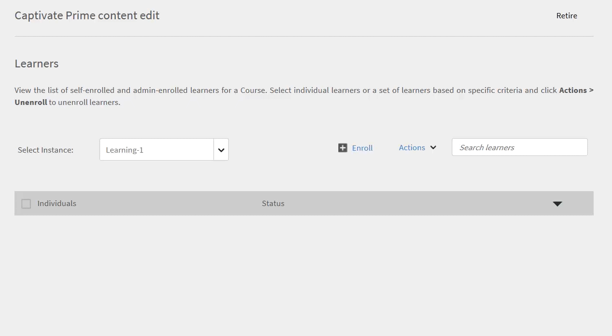
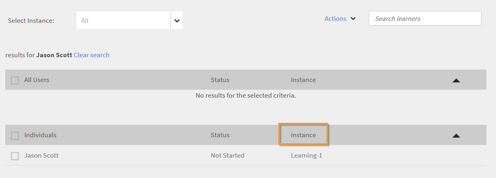

# Creazione di moduli di corso, istanze e programmi di apprendimento

Questo documento contiene la guida alla creazione di moduli di corso, istanze e corsi per il ruolo di Amministratore.

Gli Autori creano corsi. Gli Allievi possono seguire i corsi e gli Amministratori possono monitorare le prestazioni degli Allievi in base all’utilizzo dei corsi.

## Panoramica {#overview}

Gli Autori creano corsi. Gli Allievi frequentano quindi i corsi e gli Amministratori possono monitorare le prestazioni degli Allievi in base all’utilizzo dei corsi. Gli Amministratori possono visualizzare i corsi creati dagli Autori ed eseguire alcune attività come spiegato in questa sezione. In qualità di Amministratore, puoi creare programmi di apprendimento unici con un set predefinito di corsi per gli Allievi.

## Creare un’istanza di un corso {#createinstanceofacourse}

Dopo che un Autore ha creato un corso, puoi creare istanze del corso. Creando le istanze di un corso, puoi offrire lo stesso corso agli Allievi in diversi periodi di tempo. Gli Allievi possono scegliere qualsiasi istanza e iscriversi. Puoi configurare ciascuna istanza in modo che disponga di un proprio insieme di distintivi, feedback e altre impostazioni.

Per creare un&#39;istanza:

1. Nella web app Amministratore, fai clic su **[!UICONTROL Corsi]** nel riquadro sinistro.
1. Nell’elenco dei corsi, scegli il corso richiesto e fai clic su **[!UICONTROL Visualizza corso]**.

   

   *Visualizzare un corso*

1. Per creare delle istanze, fate clic su **[!UICONTROL Istanze]** nel riquadro sinistro. Per impostazione predefinita, ogni corso dispone di un’istanza. Potete modificare l’istanza predefinita o aggiungere delle istanze. Non è possibile eliminare questa istanza di corso.
1. Per creare un’istanza, fai clic su **[!UICONTROL Aggiungi nuova istanza]** nell’angolo in alto a destra delle informazioni sul corso. Viene visualizzata una nuova istanza del corso.
1. Immettere le proprietà dell&#39;istanza:

   * Nella **[!UICONTROL Nome istanza]** immettere il nome dell&#39;istanza che si desidera associare al corso. Assicurati di utilizzare un nome univoco per l&#39;istanza.
   * Specifica la scadenza per il completamento dell’istanza. Gli Allievi devono raggiungere lo stato di completamento del corso entro questa data.
   * Fai clic **[!UICONTROL Mostra altre opzioni]** per visualizzare altre opzioni di scadenza.
   * **[!UICONTROL Scadenza iscrizione]:** Si tratta della data entro la quale un Allievo deve iscriversi a un oggetto di apprendimento in caso di iscrizione autonoma.
   * **[!UICONTROL Scadenza annullamento iscrizione]:** Puoi scegliere di limitare l’annullamento dell’iscrizione da parte dello stesso Allievo fissando una scadenza per l’annullamento dell’iscrizione.

   L’Amministratore può decidere di assegnare le scadenze di completamento a un corso o programma di apprendimento in base ai requisiti. Tuttavia, si consiglia di averne uno per i corsi di formazione basati su aula/aula virtuale.

   

   *Imposta scadenza per il completamento*

## Visualizzare le proprietà dell&#39;istanza {#viewpropertiesoftheinstance}

*Visualizzare le proprietà dell&#39;istanza*

1. **Moduli:** Numero di moduli creati dall’autore del corso
1. **Allievi iscritti:** Il numero di Allievi iscritti al corso dall’Amministratore.
1. **Sessioni:** Il numero di moduli Classe virtuale e Classe nel corso.
1. **Feedback abilitato:** Indica se i feedback L1, L2 e L3 sono abilitati per questo corso.

## Rimozione di un&#39;istanza {#retireaninstance}

Per ritirare un’istanza, procedi come segue:

1. Nell’istanza, fai clic sul menu a discesa e scegli l’opzione **[!UICONTROL Rimuovi istanza]**.

   

   *Rimozione di un&#39;istanza*

1. Per cercare tutte le istanze ritirate, fai clic sulla scheda **[!UICONTROL Ritirato]** nella pagina Istanze.

## Ripristinare un&#39;istanza {#restoreaninstance}

Per ripristinare un&#39;istanza ritirata a uno stato di attivazione, effettua le operazioni riportate di seguito:

1. Nell’istanza, fai clic sul menu a discesa e scegli l’opzione **[!UICONTROL Riapri istanza]**.

   

   *Ripristinare un&#39;istanza*

1. L&#39;istanza viene ora ripristinata in una modalità attiva.

## Invia e-mail a livello di istanza

Per inviare e-mail a livello di istanza agli Allievi iscritti:

1. Nella pagina Istanze selezionare le opzioni per qualsiasi istanza e quindi fare clic su **[!UICONTROL Invia e-mail agli Allievi iscritti]**.

*Invia e-mail agli Allievi iscritti all’istanza*

1. Nella finestra di dialogo Crea annuncio, seleziona Digita come e-mail. Specificate l’oggetto, digitate il messaggio e fate clic su Salva. Il corso di formazione viene selezionato automaticamente.

   

   *Crea annuncio come e-mail*

1. Dopo aver fatto clic su **[!UICONTROL Salva]**, viene visualizzato un messaggio di conferma per la corretta creazione dell’annuncio. Per pubblicare l’annuncio, fai clic su **[!UICONTROL Pubblica ora]**.

   

### Iscrizione degli Allievi in diverse istanze

1. Seleziona un corso dall’elenco dei corsi.
1. Seleziona **[!UICONTROL Allievi]** nel pannello a sinistra.
1. Seleziona **[!UICONTROL Iscrizione]**.

   

   *Pubblicazione del corso*

1. Nella [!UICONTROL **Iscrizione degli Allievi**] finestra di dialogo, puoi:

   * Seleziona un’istanza per iscrivere un Allievo dal menu a discesa Seleziona istanza.
   * Seleziona l’utente, i gruppi di utenti o entrambi nel campo Includi allievi.
   * Seleziona gli Allievi che desideri escludere dall’istanza nel campo Escludi Allievi.
   * Nella parte inferiore della finestra di dialogo, seleziona Sì se desideri che uno o più Allievi siano iscritti all’istanza selezionata.

1. Seleziona **[!UICONTROL Procedi]**.

   

   *Procedere con l’iscrizione degli Allievi*

### Visualizzare il report di iscrizione di un’istanza

1. Seleziona un corso dall’elenco dei corsi.
1. Seleziona **[!UICONTROL Allievi]** nel pannello a sinistra.
1. Seleziona **[!UICONTROL Azioni]** > **[!UICONTROL Esporta]**.

Il file di Excel contiene fogli di lavoro per ogni istanza. Un foglio di lavoro è costituito dai campi riportati di seguito.

* Allievi
* E-mail
* ID univoco utente
* Nome del corso
* ID univoco LO
* Stato
* Criteri di selezione
* Data di iscrizione/Data di annullamento iscrizione (fuso orario UTC)
* Data di completamento (fuso orario UTC)
* Data di scadenza (fuso orario UTC)
* Data di inizio (fuso orario UTC)
* Punteggio quiz
* Nome del manager
* Indirizzo
* userState
* Settore di competenza
* Commenti
* Numero di visite
* Date di visita
* Timestamp (fuso orario UTC)
* Tempo impiegato (minuti)

>[!NOTE]
>
>Nota: l’attivazione della registrazione multipla comporta l’aggiunta di più righe al report Trascrizione Allievo per ogni corso (una riga per ogni istanza).
>
>Se hai configurato l’automazione dei report che prevede una sola riga per corso, prima di abilitare la funzione Iscrizione multipla devi apportare le modifiche necessarie all’automazione dei report.

## Imposta livello di escalation {#escalation}

Per inviare le notifiche e-mail, un amministratore deve scegliere esplicitamente il livello di escalation per:

* Manager
* Manager e salta manager di livello

*Imposta livello di escalation*

## Moderazione del corso {#coursemoderation}

Ogni volta che un Autore aggiunge, aggiorna o elimina moduli e ripubblica un corso, tutti gli Amministratori ricevono una notifica in merito. In qualità di amministratore, puoi quindi visualizzare le modifiche, confrontare il contenuto precedente e quello nuovo facendo clic sul collegamento e approvare o rifiutare le modifiche di conseguenza.

Per abilitare la moderazione dei corsi, fai clic su **[!UICONTROL Impostazioni]** > **[!UICONTROL Generale]**. Selezionare il **[!UICONTROL Moderazione del corso]** per attivare questa funzione.

*Abilita moderazione del corso*

Fai clic sulla notifica per visualizzare le modifiche apportate dall’autore al corso. Quindi, approvate o rifiutate le modifiche apportate dall’autore. Se scegli di approvare, il corso verrà ripubblicato. Se rifiuti gli aggiornamenti, la versione precedente del corso continuerà a esistere. In entrambi i casi, viene inviata una notifica all&#39;autore.

*Richieste dell’Autore per gli aggiornamenti dei corsi*

Se più Autori stanno aggiornando lo stesso corso, l’ultima modifica eseguita o quella più recente verrà riportata nella notifica dell’Amministratore. È quindi possibile approvare o rifiutare le ultime modifiche.

## Aggiungi feedback L1 e L3 {#addl1andl3feedback}

Durante la creazione dei corsi, puoi aggiungere opzioni di feedback L1 e L3:

1. Fai clic su Corsi nel riquadro a sinistra dopo aver effettuato l’accesso come Amministratore. L’elenco di tutti i corsi viene visualizzato nella pagina a destra.
1. Fai clic sul riquadro del corso a cui desideri aggiungere il feedback L1 o L3.
1. Fai clic sull’istanza predefinita nel riquadro a sinistra.
1. Fai clic sul cerchio del pulsante di attivazione accanto al feedback L1 o L3 per abilitarlo.
1. Aggiungi la domanda al feedback L3 nell’area di testo sotto Domanda L3.

## Feedback L1 obbligatorio {#mandatory-l1-feedback}

Puoi rendere obbligatorie tutte le domande o la prima domanda in un feedback L1.

*Rendi obbligatorie tutte le domande o la prima domanda in un feedback L1*

Ora puoi creare le domande, che diventano obbligatorie.

*Creare le domande*

Se per qualche motivo le due domande obbligatorie non contengono testo, le domande non verranno visualizzate nel modulo di feedback.

>[!NOTE]
>
>Non è sufficiente attivare queste impostazioni nell’istanza del programma di apprendimento. È inoltre necessario abilitare queste impostazioni a livello di istanza del corso per ogni corso del programma di apprendimento.

Nella pagina Valori predefiniti istanza, se si abilita **[!UICONTROL Rendi obbligatorie tutte le domande]**, quindi tutte le nuove istanze create successivamente erediteranno queste impostazioni.

*Visualizza la pagina Impostazioni predefinite istanza*

## Feedback L1 a livello di corso {#l1-feedback-course-level}

Nelle versioni precedenti di Learning Manager, un Amministratore poteva abilitare il feedback L1 per il programma di apprendimento.

In questa versione di Learning Manager, l’Amministratore può inviare feedback L1 per tutti i corsi inclusi nel programma di apprendimento. L’Amministratore deve assicurarsi che il feedback L1 sia abilitato per tutti i corsi a livello di istanza del corso.

1. Per abilitare il feedback L1 per ogni corso, nell’app di amministrazione fai clic su **[!UICONTROL Programmi di apprendimento]** > **[!UICONTROL Visualizza programma di apprendimento]**.

1. Fai clic **[!UICONTROL Istanze]** > **[!UICONTROL Feedback L1 abilitato]**.

1. Abilita l’opzione **[!UICONTROL Abilita per ogni corso]**.

   

   *Abilita feedback corso*

   L’attivazione di questa opzione solo a livello di programma di apprendimento non attiverà il feedback L1 per i corsi all’interno di questo programma. Per abilitare il feedback L1, accedi a ogni corso del programma di apprendimento e abilita l’interruttore Feedback L1.

   

   *Abilita feedback L1 per ogni corso*

   Se il feedback L1 è abilitato per tutti i corsi, ma è disabilitato nell’istanza del programma di apprendimento, il feedback L1 non verrà attivato per i corsi.

## Report dei quiz specifici per ogni lingua

I report dei quiz consentono di valutare le prestazioni di un Allievo che ha completato un programma di apprendimento o un corso.

Learning Manager attualmente facilita l’apprendimento in 13 lingue di interfaccia e 32 lingue di contenuti. Sebbene questa opzione sia semplice da utilizzare e offra un servizio di assistenza agli Allievi di tutto il mondo, è difficile per gli Amministratori recuperare i report tentati in varie lingue.

I report dei quiz visualizzano i dati in lingue diverse a condizione che il corso sia disponibile in più lingue. Finora, i report generati dall’Amministratore mostravano le risposte una sotto l’altra, indipendentemente dalla lingua in cui il quiz veniva tentato. **Ad esempio**, se un utente avesse fatto un quiz in olandese, l’Amministratore sarebbe stato in grado di visualizzare solo i report dei quiz svolti dagli utenti in olandese. L’Amministratore che aveva selezionato l’inglese come lingua di interfaccia non era in grado di visualizzare contemporaneamente i report per tutti gli utenti, indipendentemente dalla lingua scelta.

Questo problema è stato risolto: ora l’Amministratore è in grado di visualizzare contemporaneamente tutti i report nella rispettiva lingua tentati dall’Allievo, indipendentemente dalla lingua dei contenuti scelta. I quiz tentati in lingue diverse verranno aggiunti come colonne aggiuntive nel report del quiz.

## Abilita feedback L1 a livello di account {#l1-feedback-account-level}

*Abilita feedback L1 a livello di account*

Un amministratore potrà abilitare il feedback L1 per i corsi e i programmi di apprendimento di nuova creazione attivando questa impostazione a livello di account. Tuttavia, l’attivazione di questa impostazione non influisce sui corsi e sui programmi di apprendimento esistenti

Se questa opzione è attivata, per impostazione predefinita il feedback verrà attivato per tutti i corsi di formazione e le nuove istanze. Nel caso in cui un autore/amministratore visiti l’istanza, l’istanza viene attivata per impostazione predefinita e disattivata manualmente, quindi viene rispettata.

Per abilitare il feedback L1, nell’app di amministrazione fai clic su **[!UICONTROL Impostazioni]** > **[!UICONTROL Feedback]**.

*Visualizza la pagina Impostazioni feedback*

Fai clic **[!UICONTROL Modifica]** nell’angolo in alto a destra e seleziona l’opzione per abilitare il feedback L1.

Quando un Autore crea un corso, nella pagina Istanza dell’app di amministrazione viene visualizzata la **[!UICONTROL Feedback L1]** viene abilitato automaticamente per il nuovo corso.

<!---->

Puoi anche disattivare il feedback L1 attivando il **[!UICONTROL Abilita]** come illustrato di seguito:

*Attivare o disattivare il feedback L1*

## Aggiungi domande descrittive per feedback L1 e L3 {#descriptive}

Nell’ambito della versione di novembre di Learning Manager, è stata fornita un’opzione per aggiungere domande descrittive. Gli Amministratori possono aggiungere queste domande agli Allievi. Questo provisioning si aggiunge al set di domande predefinito fornito da Learning Manager. Puoi anche renderli obbligatori, se necessario, scegliendo l&#39;opzione sotto la domanda.

Puoi aggiungere due domande descrittive per feedback L1 e una domanda descrittiva per feedback L3.

Una volta abilitato il feedback L1, puoi visualizzare le opzioni come mostrato nella seguente istantanea.

*Aggiungi domande descrittive per feedback L1 e L3*

Se desideri che il questionario venga visualizzato all’Allievo immediatamente dopo il completamento del corso, puoi scegliere l’opzione di conseguenza.

Di seguito è riportato un output di esempio del questionario L1 da utilizzare come riferimento. Gli Allievi possono visualizzare il questionario nel formato seguente. Test-1 e Test-2 sono le domande descrittive.

*Domande di esempio sul feedback del corso*

Una volta abilitato il feedback L3, puoi visualizzare le opzioni come mostrato nell’istantanea seguente:

*Abilita feedback L3*

La domanda 2 è descrittiva per il feedback L3. Puoi renderla obbligatoria facendo clic sull’opzione corrispondente sotto la domanda.

Di seguito è riportato un output di esempio del questionario L3 come riferimento. Gli Allievi possono visualizzare il questionario nel formato seguente.

*Visualizza output feedback L3*

## Impostare il questionario di feedback L1 e L3 {#setupl1andl3feedbackquestionnaire}

Puoi impostare il questionario di feedback L1 e L3 e i promemoria a livello di account.

1. Fai clic **[!UICONTROL Impostazioni]** e poi **[!UICONTROL Feedback]** nel riquadro a sinistra dopo aver effettuato l’accesso come Amministratore.\
   La pagina delle impostazioni di feedback viene visualizzata con due schede: **[!UICONTROL Feedback L1]** e **[!UICONTROL Feedback L3]**.\
   **[!UICONTROL Feedback L1]** scheda è costituita da un elenco di impostazioni predefinite **[!UICONTROL Feedback L1]** questionario per i corsi in aula e autonomi insieme alle impostazioni dei promemoria. Ingresso **[!UICONTROL Feedback L3]** , è possibile visualizzare le impostazioni predefinite per le istruzioni e i promemoria del feedback L3.

1. Fai clic su Modifica nell’angolo in alto a destra della pagina per modificare il questionario esistente.\
   Ingresso **[!UICONTROL Feedback L1]** , è possibile attivare/disattivare ogni domanda facendo clic sul pulsante di attivazione Sì/No.\
   Ingresso **[!UICONTROL Feedback L3]** , è possibile modificare l&#39;istruzione di feedback predefinita.\
   Fai clic **[!UICONTROL Aggiungi nuovo promemoria]** nella parte inferiore della pagina e scegli quando inviare i promemoria.

1. Fai clic **[!UICONTROL Salva]** nell’angolo in alto a destra della pagina.

Nel feedback L1 sono disponibili due serie di questionari con una domanda predefinita. La prima serie di questionari si riferisce a corsi autonomi che possono essere utilizzati anche per corsi basati su attività. Un secondo set di questionari può essere utilizzato per i corsi in aula e in aula virtuale.

## Esportare i dati dell’elenco di controllo {#export-checklist-data}

Dall’elenco dei corsi, apri un corso che contiene un elenco di controllo. Nel riquadro a sinistra viene visualizzata un&#39;opzione **[!UICONTROL Checklist]**.

*Esportare i dati dell’elenco di controllo*

Fai clic sull’opzione e nella pagina del corso esegui le operazioni seguenti:

1. Seleziona l’istanza e il modulo.
1. Fai clic **[!UICONTROL Azioni]** > **[!UICONTROL Esporta]**, quindi esporta il report dell’elenco di controllo degli allievi.

Nella **[!UICONTROL Checklist]** un Istruttore può esportare il report dell’elenco di controllo dal **[!UICONTROL Azioni]** elenco a discesa.

Il report CSV contiene i seguenti campi:

* Nome utente
* E-mail utente
* Nome ed e-mail del manager
* Nome del corso di formazione
* Istanza del corso di formazione
* Nome e-mail dell’istruttore
* Inviato il
* Stato valutazione
* Domande con testo effettivo
* Stato utente
* Profilo
* Campi attivi

Quando scarichi un report dopo aver selezionato un filtro di stato, il report Trascrizione Allievo scaricato conterrà i dati dell’Allievo in base al filtro di stato applicato. Questo filtro aggiunto verrà visualizzato anche all’Amministratore personalizzato e al Manager quando stanno per generare una Trascrizione Allievo.

## Visualizzazione dei corsi {#viewingcourses}

In qualità di Amministratore, puoi visualizzare un elenco di tutti i corsi disponibili.   Fai clic **[!UICONTROL Corsi]** nel riquadro a sinistra per visualizzare l’elenco dei corsi con opzioni di ricerca e filtro. Puoi anche visualizzare la percentuale di efficacia di ogni corso nelle miniature dei corsi.

>[!NOTE]
>
>Puoi ritirare un corso dopo che gli Allievi lo hanno frequentato o se desideri sospendere un corso specifico dopo averlo pubblicato. È possibile ritirare un corso solo quando si trova in uno stato pubblicato. È possibile visualizzare l’elenco di tutti i corsi ritirati facendo clic sul pulsante **[!UICONTROL Ritirato]** scheda.

## Visualizzare i punteggi dei quiz {#viewquizscores}

1. Fai clic sul nome del corso sulla miniatura del corso.
1. Fai clic sul punteggio del quiz nel riquadro a sinistra.

Puoi visualizzare i punteggi dei quiz di qualsiasi corso in base al nome utente o a ciascuna domanda. Scegli di conseguenza le schede Per utente o Per domanda.

Scegli il tipo di istanza dall’elenco a discesa per visualizzare i punteggi in base a ciascuna istanza del corso.

## Gestire l’elenco degli Allievi per un corso {#managelearnerslistforacourse}

1. Fai clic sul nome del corso sulla miniatura del corso.
1. Nel riquadro a sinistra, fai clic su **[!UICONTROL Allievi]**.

*Selezionare gli Allievi in un corso*

Puoi eseguire le seguenti azioni dalla pagina Allievi:

* Seleziona l’Allievo da rimuovere e fai clic su [!UICONTROL **Azioni**] > [!UICONTROL **Rimuovi**].
* Seleziona l’Allievo di cui desideri contrassegnare la partecipazione e fai clic su [!UICONTROL **Azioni**] > [!UICONTROL **Contrassegna come completato**].

Per consentire agli Allievi di ripristinare un modulo e di utilizzarlo di nuovo, fai clic su [!UICONTROL **Reimposta**]. Nella finestra a comparsa, fai clic su Sì per confermare la reimpostazione. I moduli completati non possono essere ripristinati. È possibile ripristinare solo i moduli non riusciti o incompleti.

Puoi anche esportare l’elenco degli Allievi in un foglio Excel. Per esportare l’elenco degli Allievi, fai clic su [!UICONTROL **Azioni**] > [!UICONTROL **Esporta**].

>[!NOTE]
>
>Se sono presenti più istanze per un corso, l’elenco degli Allievi in Excel viene fornito separatamente in ogni scheda. L’elenco degli Allievi comprende il nome, lo stato e i criteri di selezione degli Allievi. Lo stato degli Allievi può essere **Non avviato** o **In corso** o **Completato**.

## Esportazione della partecipazione degli Allievi {#attendance}

Per qualsiasi corso in aula e in aula virtuale, puoi scaricare l’elenco degli Allievi che hanno partecipato a questo corso, per qualsiasi istanza.

Nella pagina dei dettagli del corso, fai clic su **[!UICONTROL Presenze e punteggi]** nel riquadro a destra.

Nell&#39;angolo superiore destro della pagina fare clic sul pulsante **[!UICONTROL Azioni]** elenco a discesa. Quindi fai clic sull’opzione **[!UICONTROL Esportazione dell’elenco di Allievi (PDF)]**.

*Esportazione dell’elenco di Allievi come PDF*

In PDF, puoi visualizzare lo stesso gruppo di Allievi di un Istruttore.

Quando scarichi il PDF, puoi visualizzare il fuso orario (in UTC) utilizzato durante la creazione del corso.

## Esportazione degli Allievi in attesa di approvazione

Un Amministratore, un Manager o un Amministratore personalizzato può esportare i dati degli Allievi in attesa di approvazione dell’iscrizione. Puoi esportare i dati tramite **Corso > Allievo** e fai clic sull’elenco a discesa Azione.

L’opzione sarà disponibile quando nessun Allievo è iscritto/in attesa di approvazione al corso approvato dal Manager e verrà generato un report vuoto. Puoi anche esportare quando gli Allievi sono in attesa di approvazione, iscritti, in sospeso o disiscritti.

Il report contiene i dati degli utenti attivi, eliminati e sospesi se sono in attesa di approvazione. Il report contiene anche i dati degli utenti interni ed esterni che si trovano in attesa di approvazione.

Se un Allievo che era in attesa di approvazione si disiscrive, il suo resoconto non sarà presente nel report. Inoltre, se un Allievo che era in attesa di approvazione viene iscritto al corso da un Amministratore/Manager/Amministratore personalizzato, il suo resoconto è presente nel report.

## Visualizza feedback L1 e L3 {#viewl1andl3feedback}

Puoi visualizzare il feedback L1 fornito dagli Allievi per un corso e il feedback L3 fornito dai Manager agli Allievi.

1. Fai clic su qualsiasi riquadro del corso nell’elenco Corsi.
1. Fai clic su Feedback L1 o Feedback L3 nel riquadro a sinistra per visualizzare il feedback ricevuto.
1. Seleziona l’istanza dall’elenco a discesa per visualizzare il feedback per quella particolare istanza.

## Anteprima dei corsi {#previewcourses}

L’Amministratore può visualizzare in anteprima i corsi facendo clic sul pulsante **[!UICONTROL Anteprima come Allievo]** durante la visualizzazione dei moduli del corso.

1. Fai clic **[!UICONTROL Corsi]** nel riquadro a sinistra dopo aver effettuato l’accesso come amministratore.
1. Fai clic su un riquadro del corso nell’elenco dei corsi presenti nella pagina.
1. Fai clic su Anteprima come Allievo dal riquadro a sinistra e fai clic sul nome del modulo nella pagina per visualizzare in anteprima il modulo del corso nel lettore.

## Efficacia dei corsi {#courseeffectiveness}

L’efficacia dei corsi viene valutata per comprendere l’utilità di un corso per gli allievi. È una combinazione di risultati dei feedback degli allievi sul contenuto del corso, risultati del quiz sul corso per un Allievo e feedback del Manager che valuta un Allievo in base agli allievi del corso.

L’Amministratore può visualizzare la valutazione dell’efficacia del corso nelle miniature, come mostrato nell’immagine seguente. Puoi visualizzare la valutazione di questo corso su 100.

<!---->

Il valore di valutazione dell’efficacia del corso viene ottenuto tenendo conto dei valori di feedback L1, L2 e L3. Per visualizzare la suddivisione di ogni feedback, fai clic sul valore di efficacia del corso. Viene visualizzata una finestra a comparsa come illustrato di seguito.

*Visualizza l’efficacia dei corsi per feedback L1, L2 e L3*

In questa immagine di esempio, 1 utente su 1 ha ricevuto tutti e tre i feedback, pertanto il punteggio è 100/100. In questa tabella, puoi vedere come se uno qualsiasi dei tre feedback (L1, L2 e L3) non viene fornito per un corso, l’efficacia globale avrà risultato negativo. Fai clic sulla freccia rivolta verso il basso nell’angolo in basso a destra della finestra a comparsa per vedere come vengono effettuati i calcoli dell’efficacia dei corsi.

*Calcolo dell’efficacia dei corsi*

Come per il grafico a torta mostrato sopra, viene dato un maggiore peso al feedback L3 dal manager.

## Ricerca di corsi e programmi di apprendimento {#searchingcoursesandlearningprograms}

Adobe Learning Manager consente di individuare i corsi/programmi di apprendimento che cerchi rapidamente e con facilità. Puoi cercare i tuoi corsi in due modi:

1. Utilizzo del campo di ricerca. Fai clic sull’icona di ricerca visualizzata nell’angolo in alto a destra. Viene visualizzato un campo di ricerca. Digita il nome del corso o le parole chiave associate ai tuoi corsi per individuare i corsi/programmi di apprendimento. Puoi anche eseguire ricerche utilizzando tag predefiniti come Captivate, C, Java e HTML. I tag sono ricercabili all’interno del campo di ricerca, il che significa che vengono visualizzati nel campo di ricerca durante la digitazione.
1. Applicando un filtro all’elenco di corsi/programmi di apprendimento. Puoi filtrare i corsi per stato come Tutti, Pubblicati, Bozza e Ritirati. In modalità Amministratore, il filtro bozza non viene visualizzato.

Puoi eseguire una ricerca in base alle competenze facendo clic su Competenze e poi scegliendole. In qualità di Amministratore, puoi ordinare i corsi in quattro modi per individuare meglio il corso richiesto. Fai clic su Ordina per e scegli l’ordine alfabetico crescente o decrescente, la data di aggiornamento del corso o l’efficacia dei corsi.

<!---->

Puoi ordinare i programmi di apprendimento in tre modi: ordine alfabetico crescente, decrescente e basato sulla data di aggiornamento.

## Iscrizione degli Allievi {#enrollinglearners}

Puoi seguire gli stessi passaggi per iscrivere gli Allievi a corsi, programmi di apprendimento e certificazioni. I Manager possono inoltre iscrivere gli Allievi sotto di lui seguendo i passaggi riportati di seguito.

L’Amministratore iscrive alcuni Allievi ai corsi obbligatori in base ai requisiti dell’organizzazione:

1. Passa il mouse su qualsiasi riquadro del corso pubblicato e fai clic su Iscrivi Allievi.\
   In alternativa, fai clic su qualsiasi riquadro del corso pubblicato e fai clic sugli Allievi nel riquadro a sinistra. Viene visualizzata una pagina con un elenco di Allievi. Fai clic su Iscrizione.\
   Viene visualizzata la finestra di dialogo di iscrizione degli Allievi.

1. Selezionate l’istanza dall’elenco a discesa Seleziona istanza. Il menu a discesa elenca tutte le istanze, incluse quelle attive, ritirate e scadute.

>[!NOTE]
>
>L’Amministratore può rimuovere qualsiasi Allievo iscritto a un corso facendo clic sulla freccia a discesa sulla pagina degli Allievi e facendo clic su **[!UICONTROL Azioni]** > **[!UICONTROL Rimuovi]**.

*Aggiunta di commenti durante l’iscrizione degli Allievi*

*Iscrizione degli Allievi*

## Utenti

+++Includi Allievi

Seleziona i gruppi di utenti e i singoli Allievi (utilizzando l’ID e-mail o il nome) che desideri includere. Aggiungi tutti i gruppi di utenti in un’intersezione sotto lo stesso set. Per aggiungere un altro gruppo di utenti nell’unione, utilizza un nuovo set di inclusione.

+++

+++Escludi Allievi

Seleziona i gruppi di utenti e i singoli Allievi (utilizzando l’ID e-mail o il nome) che desideri escludere. Aggiungi tutti i gruppi di utenti in un’intersezione sotto lo stesso set. Per aggiungere un altro gruppo di utenti a un&#39;unione, utilizzare un nuovo set di inclusione.

+++

## ID e-mail utente

+++ID e-mail

Copia e incolla gli ID e-mail degli Allievi che desideri iscrivere, separati da punti e virgola, virgole o interlinea. Utilizzare la **[!UICONTROL Convalida ID e-mail]** per convalidare le voci. Tutte le voci non valide appariranno contrassegnate in rosso. Rimuovere o correggere tali voci e procedere facendo clic su **[!UICONTROL Procedi.]**

*Iscrizione degli Allievi*

Viene visualizzata la finestra di dialogo di riepilogo con il numero di utenti dal set di inclusione, dal set di esclusione e dagli utenti già iscritti all’istanza del corso.

+++

### Aggiunta di commenti durante l’iscrizione degli Allievi {#enroll-comments}

<!----->

In qualità di Amministratore o Manager, puoi aggiungere commenti durante l’iscrizione di allievi a un corso. Puoi citare ulteriori informazioni sulla coorte di utenti che vengono iscritti. Questi dati vengono esportati nei report sui corsi.

Il commento è **non** visualizzato all’allievo.

Quando un Amministratore genera il report del corso dell’Allievo, eventuali commenti aggiunti vengono visualizzati nel report. Viene visualizzata la finestra di dialogo di riepilogo con il numero di utenti dal set di inclusione, dal set di esclusione e dagli utenti già iscritti all’istanza del corso.

Nella **[!UICONTROL Iscrizione degli Allievi]** , espandi l’opzione **[!UICONTROL Opzioni avanzate]**. Nella **[!UICONTROL Commento aggiuntivo]** , immetti il commento richiesto.

*Aggiungere commenti per gli Allievi*

## Cerca utenti iscritti {#searchforusers}

Cerca gli utenti iscritti nella sezione Allievo dell’oggetto di apprendimento utilizzando la ricerca con completamento automatico. Utilizzando la ricerca con completamento automatico, puoi cercare progressivamente gli utenti iscritti utilizzando nome, ID e-mail e uuid.

*Procedura dettagliata per la ricerca di utenti iscritti*

Questo tipo di ricerca è anche noto come completamento automatico, ricerca incrementale, ricerca in base al tipo di utente, ricerca in linea o ricerca immediata.

Mentre digiti un Allievo o un gruppo di utenti nel campo di ricerca, vengono trovate e immediatamente presentate una o più corrispondenze per i termini di ricerca.

Il processo consente di trovare ciò che si sta cercando in modo molto più veloce e meno ingombrante rispetto all&#39;esecuzione di una serie di ricerche in una riga.

Gli Allievi o i gruppi di utenti in tutte le istanze vengono visualizzati dopo una ricerca. Per ogni Allievo, l’istanza alla quale è iscritto viene visualizzata nel **[!UICONTROL Istanza]** colonna.

*Visualizzare i risultati della ricerca*

Con la ricerca con completamento automatico è possibile:

* Visualizza tutti gli utenti iscritti, indipendentemente dalle istanze.
* Visualizza tutti i gruppi di utenti a cui sono iscritti uno o più utenti.

Dopo l’esecuzione di una ricerca, non è possibile filtrare gli Allievi in base alle istanze. Opzione per selezionare un&#39;istanza dal menu **[!UICONTROL Seleziona istanza]** elenco a discesa disabilitato.

Inoltre, utilizzando i risultati della ricerca, è possibile scegliere un Allievo o un gruppo di utenti ed eseguire le azioni seguenti:

* Annulla iscrizione
* Contrassegna completamento
* Ripristina modulo

Durante l’esecuzione di una ricerca, l’opzione Annulla iscrizione > In blocco nell’elenco a discesa Azioni è disabilitata per il corso/programma di apprendimento.

## Condivisione del codice QR con gli Allievi per iscrizione, completamento o entrambi {#shareqrcodewithlearnerstoenrollcompleteorboth}

Gli Amministratori di Learning Manager di Adobe possono condividere i codici QR con gli Allievi per consentire loro di iscriversi rapidamente al corso. I tre diversi codici QR vengono utilizzati per contrassegnare &quot;iscrizione&quot;, &quot;completamento&quot; o &quot;iscrizione e completamento&quot; di un corso.

Gli Allievi possono utilizzare l’app per dispositivi Learning Manager di Adobe per eseguire la scansione del rispettivo codice QR.

**Per scaricare il codice QR, effettua le seguenti operazioni**:

1. Fai clic **[!UICONTROL Corsi]** dalla sezione Apprendimento nel pannello di navigazione a sinistra.
1. Seleziona un corso > **[!UICONTROL Visualizza corso]**.
1. Fai clic **[!UICONTROL Istanze]** > **[!UICONTROL Altro]** > **[!UICONTROL QR code]**.

   <!---->

1. Abilita il codice QR e fai clic sulle icone di download &quot;Iscrizione&quot;, &quot;Completo&quot; e &quot;Iscrizione e completamento&quot; per scaricare un PDF contenente il codice QR per ciascuno di essi. L’Amministratore può quindi condividere il codice QR con gli Allievi.

   

   *Condivisione del codice QR con i collaboratori*

## Ciclo di vita del corso {#courselifecycle}

Il ciclo di vita tipico di un corso è il seguente:

**Bozza** - Quando un Autore completa la creazione di un corso e lo salva. A questo punto, il corso non è ancora disponibile per gli Allievi. A questo punto puoi eliminare un corso.

**Pubblicato** - Quando un Autore completa la pubblicazione di un corso. A questo punto, il corso è disponibile per l’iscrizione da parte degli Allievi.

**Ritirato** - Dopo aver pubblicato un corso, un Autore può attribuirgli lo stato Ritirato se desidera che il corso non venga più visualizzato nel catalogo dei corsi per gli Allievi. A questo punto, è possibile ripubblicare o eliminare un corso.

**Eliminato** - A un corso viene attribuito lo stato Eliminato quando viene rimosso completamente dall’applicazione di Learning Manager per Adobi. I corsi possono essere eliminati dagli Autori solo quando sono in stato Bozza. Puoi anche eliminare i corsi dallo stato Ritirato.

*Flusso di lavoro del ciclo di vita di un corso*

## Impostazioni di notifica {#notificationsettings}

In qualità di Amministratore, puoi regolare le impostazioni di notifica. Per ulteriori informazioni, consulta [Notifiche](user-notifications.md)

## Domande frequenti {#frequentlyaskedquestions}

+++Come si reimposta un modulo come amministratore?

Nella pagina Allievi di un corso, scegli l’Allievo o un gruppo, fai clic su **[!UICONTROL Azioni]** > **[!UICONTROL Ripristina moduli]**.

*Opzione Visualizza per reimpostare i moduli*

Dopo aver fatto clic sull’opzione, lo stato dei moduli di tutti gli Allievi selezionati verrà ripristinato. I moduli completati non verranno ripristinati.

+++

+++Come aggiungere l’URL del corso in modo che gli Allievi vengano reindirizzati direttamente al corso?

Passa il mouse su una scheda del corso e fai clic su **[!UICONTROL Copia URL]**. Dopo aver copiato l’URL, gli allievi possono accedere al corso direttamente con l’URL.

+++

+++Come riaprire un&#39;istanza?

Per riaprire un’istanza ritirata, fai clic sul menu a discesa nell’istanza e quindi su **[!UICONTROL Riapri istanza]**.

+++
