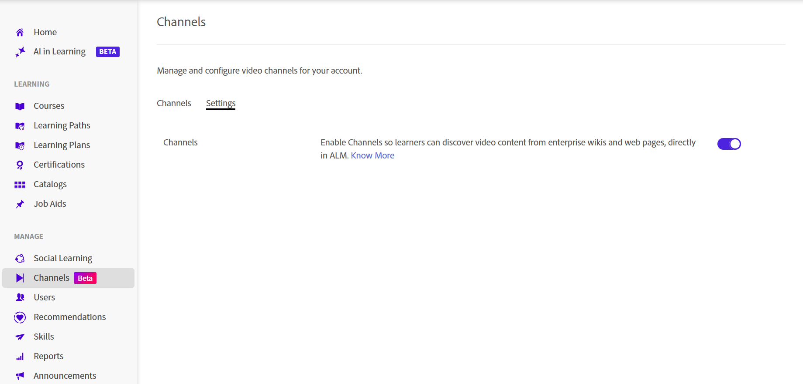
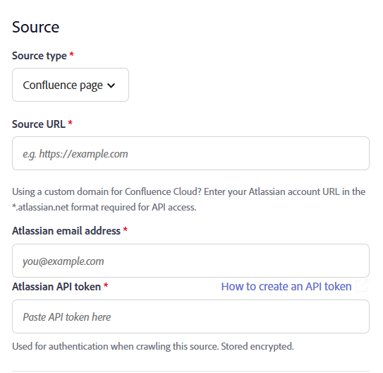
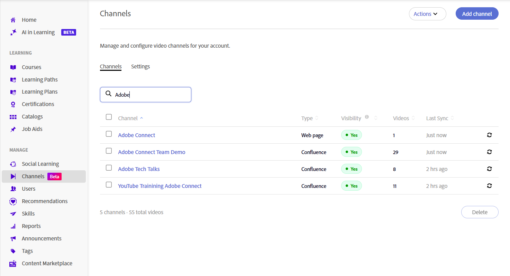
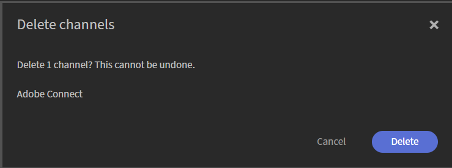

# Crea canali

Le organizzazioni spesso memorizzano sessioni di condivisione della conoscenza, registrazioni di formazione e altri contenuti video su contenuti di apprendimento informali, esclusivi per il Web e le pagine di Confluence Cloud. I canali collegano Adobe Learning Manager a queste origini di contenuto, semplificando la ricerca e l’utilizzo dei video senza richiedere agli Allievi di navigare in più sistemi. I canali consentono di organizzare e condividere contenuti di apprendimento basati su video da pagine Web aziendali e pagine di Confluence Cloud in un&#39;unica posizione ricercabile. Invece di effettuare ricerche all’interno di più siti, gli Allievi possono scoprire e accedere alle registrazioni pertinenti direttamente da Adobe Learning Manager. Per ulteriori informazioni, visualizza [Scopri e interagisci con i canali](../../learners/feature-summary/discover-and-engage-with-channels.md).

In qualità di Amministratore, puoi creare e gestire i canali, configurare le impostazioni di visibilità, sincronizzare i contenuti con la relativa sorgente e verificare che i video siano disponibili prima di rendere il canale accessibile agli Allievi. Questo articolo spiega come eseguire queste attività di gestione dei canali.

**Vantaggi principali**

- Consolida i contenuti di apprendimento basati su video da più origini interne in un&#39;unica posizione.
- Scelta dei contenuti video da più percorsi Intranet nelle pagine Web, che vengono quindi visualizzati come Canali in ALM.
- Possibilità per gli Allievi di trovare, giocare e interagire con i contenuti senza passare a più siti.
- Mantieni il contenuto sincronizzato con la sorgente originale.

## Abilita canali

Canali è una funzione che gli Amministratori attivano per l’account. Una volta abilitati, puoi creare canali che si collegano alle pagine Web aziendali e alle pagine Cloud Confluence contenenti contenuti video.

Il channel crawler estrae in modo affidabile i video dalle pagine sorgente che presentano il loro contenuto nei seguenti formati:

- Tabelle
- Elenchi puntati
- Articoli

Per abilitare la funzionalità **Canali**:

1. Accedi a Adobe Learning Manager come Amministratore.

1. Seleziona **Canali** dal menu di navigazione a sinistra.
     Viene aperta la pagina **Canali**.

1. Selezionare la scheda **Impostazioni**.

   

   *Abilita la funzione Canale nella scheda **Impostazioni**per consentire agli amministratori di creare canali per l&#39;account.*

1. Abilita **funzione Canale**.

     I canali sono abilitati per l&#39;account.

## Creare un canale

Create un canale per definire la sorgente di contenuto da sottoporre alla scansione di video da parte di Adobe Learning Manager e personalizzate l’aspetto del canale e della pagina video.

1. Passa alla scheda **Canali** e seleziona **Aggiungi canale**.
     Viene aperta la pagina **Crea canale**.

   

   *Definire l&#39;origine del contenuto e configurare le opzioni di visibilità e sincronizzazione durante la creazione di un canale.*

1. Nella sezione **Canale**, immettere il **Nome canale** e la **Descrizione**.

1. Selezionare un **tipo di origine** dal menu a discesa. Sono disponibili le seguenti opzioni:

   1. **Pagina Web**: selezionate questa opzione per eseguire la ricerca per indicizzazione di una pagina Web e importare i collegamenti video e i metadati associati.

   1. **Pagina Confluence**: selezionate questa opzione per recuperare i collegamenti video e i metadati da una pagina Confluence Cloud. Per connettersi a Confluence Cloud, fornisci i seguenti dettagli:
      - **Indirizzo e-mail atlassiano**: immetti l&#39;indirizzo e-mail associato al tuo account atlassiano.
      - **Token API Atlassian**: immetti il token API generato dal tuo account Atlassian. Seleziona **Come creare un token API** per istruzioni sulla generazione di un token. Questo token viene utilizzato per l&#39;autenticazione durante la ricerca per indicizzazione dell&#39;origine ed è archiviato crittografato.

      

      *Immettere l&#39;indirizzo e-mail atlassiano e il token API utilizzati per l&#39;autenticazione con Confluence Cloud.*

1. Immettere l&#39;**URL di origine** del contenuto del tipo di origine selezionato.

1. Nella sezione **Stato**, configura le seguenti opzioni:

   1. **Visibile agli Allievi**: abilita questa opzione per rendere il canale disponibile agli Allievi. Disattivalo per nascondere il canale mentre continui a configurarlo o a testarlo.

   1. **Sincronizza automaticamente**: attivate questa opzione per aggiornare automaticamente il canale quando vengono aggiunti nuovi video all&#39;origine. Disattivalo se desideri sincronizzare manualmente il canale.

1. (Facoltativo) Selezionare **Mostra impostazioni avanzate**, quindi configurare le seguenti opzioni in base alle esigenze:

   1. **Colore tema canale**: seleziona un colore per personalizzare l’aspetto visivo del canale.

   1. **Profondità di ricerca per indicizzazione**: immettere la profondità di ricerca per indicizzazione delle pagine collegate per ricercare il contenuto video. Supporta una profondità massima di ricerca per indicizzazione di **2**.

   1. **Frequenza di ricerca per indicizzazione (in ore)**: specificare la frequenza con cui Adobe Learning Manager deve verificare la disponibilità di contenuto nuovo o aggiornato nell&#39;origine.

      

      *Selezionare Mostra impostazioni avanzate per configurare il colore del tema del canale, la profondità di ricerca per indicizzazione e la frequenza di ricerca per indicizzazione.*

1. Seleziona **Prova ora** per convalidare l&#39;origine. I video di esempio vengono recuperati e visualizzati dalla sorgente configurata.

   

   *Utilizza **Prova ora**per verificare che i video siano stati recuperati dall&#39;origine prima di creare il canale.*

1. Seleziona **Crea canale**. Il canale viene creato e aggiunto all&#39;elenco **Canali**.

## Ricerca di un canale

Utilizzate la casella di ricerca per individuare rapidamente un canale in base al nome.

1. Selezionare la scheda **Canali**.
1. Selezionare la casella **Cerca canali**.
1. Immettere il nome del canale o una parte di esso nella casella **Cerca canali**.
     L&#39;elenco consente di visualizzare solo i canali corrispondenti alla ricerca.

   

   *Immettere un nome di canale nella casella di ricerca per filtrare l&#39;elenco **Canali**.*

## Gestire la visibilità dei canali

Utilizza il menu **Azioni** per disabilitare o nascondere uno o più canali contemporaneamente.

### Disabilita canali

Disabilita uno o più canali per impedire agli Allievi di accedere ai propri contenuti mantenendo la configurazione dei canali.

Per disabilitare i canali:

1. Accedi a **Canali**.
1. Seleziona la casella di controllo accanto a uno o più canali, quindi seleziona **Azioni**.

   
   *Selezionare Disattiva dal menu Azioni per disabilitare uno o più canali selezionati.*
1. Seleziona **Disabilita**.  Viene visualizzata la finestra a comparsa **Disattiva canali**.
1. Seleziona **Disabilita**.  I canali selezionati sono disattivati.

### Nascondere i canali agli Allievi

Nascondi uno o più canali per renderli non disponibili agli Allievi senza eliminarli.

Per nascondere i canali agli Allievi:

1. Accedi a **Canali**.
1. Seleziona la casella di controllo accanto a uno o più canali, quindi seleziona **Azioni**.
1. Seleziona **Nascondi dagli Allievi**.  Viene visualizzata la finestra a comparsa **Nascondi dagli Allievi**.

   
   *Nascondi i canali agli Allievi senza eliminare la configurazione dei canali.*

1. Seleziona **Nascondi dagli Allievi**.
     I canali selezionati sono nascosti agli Allievi.

## Modificare un canale

Puoi modificare un canale esistente per aggiornarne la configurazione e le impostazioni.

Per modificare un canale:

1. Selezionare il canale richiesto dall&#39;elenco **Canali**.
     Viene aperta la pagina **Modifica canale** e viene visualizzata la configurazione corrente del canale.

1. Aggiorna le impostazioni del canale in base alle tue esigenze.

   

   *Aggiornare il nome, la descrizione, l&#39;origine e le impostazioni di un canale dalla pagina **Modifica canale**.*

1. (Facoltativo) Seleziona **Prova ora**.

1. Seleziona **Salva modifiche**.
     Le impostazioni del canale aggiornate sono state salvate.

## Eliminare un canale

È possibile eliminare uno o più canali che non sono più necessari.

1. Passa alla scheda **Canali**.

1. Selezionare la casella di controllo accanto a ogni canale che si desidera eliminare.

1. Seleziona **Elimina** nella parte inferiore destra dell&#39;elenco dei canali.   Viene visualizzata la finestra a comparsa **Elimina canali**.

   

   *Una finestra di dialogo di conferma elenca i canali selezionati.*

1. Selezionare **Elimina**.
     I canali selezionati sono stati eliminati definitivamente. Questa azione non può essere annullata.
