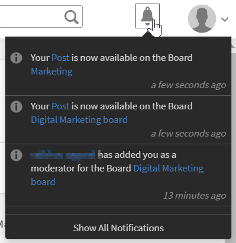

# Mappare abilità con domini di abilità

Per fare in modo che il motore di cura basato su intelligenza artificiale esegua la cura automatica di un post pubblicato da un utente per un particolare dominio di abilità, l’azienda dell’utente deve disporre delle proprie abilità personalizzate da mappare ai domini di abilità supportati presenti nell’LMS di Learning Manager.

Durante la creazione di un’abilità, un Amministratore può mapparla ai domini di abilità più rilevanti supportati da Learning Manager. Ciò verrà ulteriormente considerato nel processo di cura automatica. L’LMS di Learning Manager elenca le seguenti abilità:

* Gestione della supply chain
* Contabilità
* Ricerca scientifica e ingegneria
* Protezione del computer
* Gestione strategica
* Social media
* Medicina
* Finanza
* Sicurezza sul posto di lavoro
* Abilità morbide
* Diritto commerciale
* Gestione
* Gestione delle risorse umane
* Comunicazione tecnica
* Etica aziendale
* Gestione delle relazioni con i clienti
* Tecnologia dell&#39;informazione
* Produzione e fabbricazione
* Marketing
* Gestione della qualità
* Processo aziendale
* Apprendimento
* Progettazione
* Analytics
* Vendite

Per aggiungere un dominio di abilità, segui i passaggi riportati di seguito:

1. Nel riquadro a sinistra dell’app Amministratore, fai clic su **[!UICONTROL Abilità]**.
1. Per aggiungere un’abilità, fai clic su **[!UICONTROL Aggiungi]** in alto a destra.
1. Nella **[!UICONTROL Aggiungi abilità]** , aggiungi un’abilità e una descrizione.
1. Nella **[!UICONTROL Dominio abilità]** aggiungi i domini di abilità. Quando immetti un dominio, i domini vengono aggiunti. Questi domini sono compilati dall&#39;elenco di cui sopra.

   

   *Aggiungere i domini di abilità nella sezione Dominio di abilità*

1. Per salvare le modifiche, fai clic su **[!UICONTROL Salva]**.

Quando un utente pubblica un contenuto in una bacheca, il contenuto viene selezionato e viene approvato o rifiutato, a seconda del punteggio di confidenza rispetto all’abilità mappata alla bacheca.

<!---->

A seconda che il contenuto caricato abbia un punteggio di affidabilità superiore al 50%, il contenuto viene caricato nella bacheca. Se il tuo contenuto soddisfa i criteri, viene visualizzata una notifica che indica che il contenuto è stato curato correttamente ed è ora disponibile nella bacheca.

*Visualizza le notifiche in base al punteggio di confidenza*

