# Ruoli personalizzati

Questa funzione consente di definire ruoli personalizzati e di assegnare responsabilità specifiche a un gruppo di utenti. Questa funzione consente di assegnare responsabilità al di fuori dell&#39;ambito del ruolo esistente della persona.

Adobe Learning Manager consente agli amministratori completi di delegare responsabilità personalizzate di gestione dei ruoli ad amministratori personalizzati attendibili, incluse la creazione, la modifica e l&#39;assegnazione di ruoli personalizzati, senza fornire loro credenziali di amministratore complete. Questa funzionalità consente agli amministratori personalizzati di gestire altri ruoli senza sovraccaricare gli amministratori dei compiti. Questo livello di autorizzazione è controllato tramite il livello di autorizzazione **Avanzato** nella sezione **Utenti** di una definizione di ruolo personalizzata. Per ulteriori informazioni, vedere [Sblocco dell&#39;autorizzazione utente avanzata](#advanced-user).

Le organizzazioni utilizzano questa funzionalità per delegare la gestione dei ruoli di routine agli amministratori personalizzati designati. Ad esempio, per consentire a un team dedicato di creare e assegnare ruoli di autore o editore su base continuativa, o per consentire a un team operativo di ripulire gli account degli utenti che hanno lasciato l&#39;organizzazione. Ciò evita la necessità di concedere a tali team il pieno accesso come amministratore, con privilegi più ampi di quelli richiesti dalle loro responsabilità.

È possibile creare un ruolo personalizzato per fornire funzionalità di creazione limitate a un determinato catalogo. Puoi anche creare un ruolo dedicato alla gestione dei rapporti. Tali ruoli possono quindi essere assegnati a singoli utenti che dovrebbero assumere queste responsabilità specifiche.

>[!NOTE]
>
>L’aggiunta di un nuovo ruolo personalizzato non avrà effetto sui gruppi di utenti personalizzati esistenti o su eventuali gruppi basati su ruoli come Tutti gli amministratori, Tutti gli autori e così via.

L’Amministratore può creare ruoli di amministratore e autore personalizzati con autorizzazioni personalizzate per ogni ruolo. Di seguito è riportata una panoramica delle autorizzazioni associate a ciascun ruolo:

**Autorizzazioni ruolo autore personalizzato**

Gli Autori personalizzati possono eseguire le seguenti attività:

* Accedi alla libreria di contenuti per aggiungere, modificare o eliminare il contenuto di base.
* Creare, modificare ed eliminare:
  * Corsi
  * Risorse formative
  * Certificazioni
  * Percorsi di apprendimento
  * aggiunti un paio di Piani di apprendimento

Gli Amministratori e gli Autori, inclusi gli Amministratori personalizzati e gli Autori personalizzati, potranno condividere gli oggetti di apprendimento (LO) in cataloghi condivisi esternamente. Amministratori e Autori devono essere in grado di cercare cataloghi condivisi esternamente durante la creazione di oggetti di apprendimento (LO).

**Autorizzazioni ruolo amministratore personalizzato**

Il ruolo di amministratore personalizzato replica un insieme di responsabilità di amministratore, incluso l’accesso ai privilegi a livello di account. Agli amministratori personalizzati vengono concesse autorizzazioni per la gestione delle funzionalità chiave correlate alle attività di apprendimento, ad esempio:

* aggiunti un paio di Piani di apprendimento
* Cataloghi
* Report
* Tag

Inoltre, gli amministratori personalizzati possono:

* Gestisci corsi e risorse formative, inclusa l’iscrizione e l’eliminazione di utenti.
* Crea, modifica ed elimina certificazioni, percorsi di apprendimento e piani di apprendimento.
* Accesso alle funzionalità di reporting e iscrizione per tutti gli oggetti di apprendimento (LO).

Gli amministratori ora possono visualizzare le autorizzazioni create con CSV in Adobe Learning Manager. L’opzione Filtra in base a filtra i ruoli personalizzati creati dall’amministratore e quelli importati tramite un file CSV. Dopo aver selezionato un ruolo personalizzato, è possibile visualizzarne le autorizzazioni.

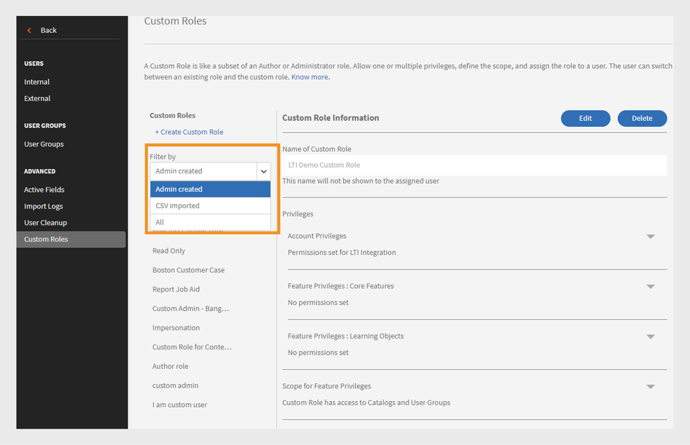
_Filtra ruoli personalizzati_

## Creazione di un ruolo personalizzato {#create-role}

1. Accedi come amministratore. Apri **[!UICONTROL Utenti]** > **[!UICONTROL Ruolo personalizzato]**.
2. Seleziona **[!UICONTROL Crea ruolo]**. Viene visualizzata la scheda **[!UICONTROL Crea nuovo ruolo]**.

   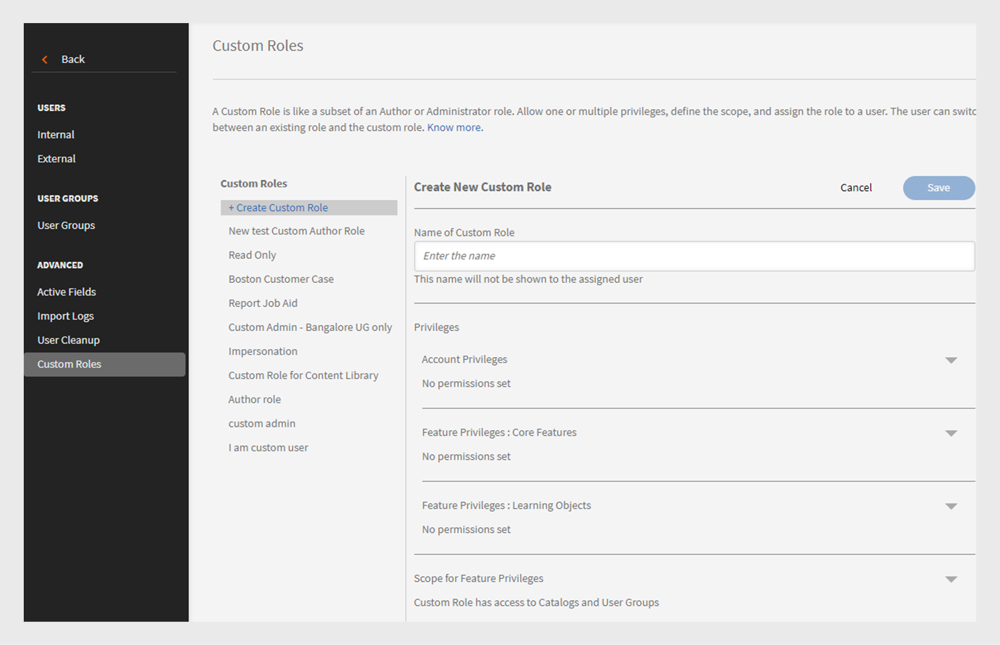

   *Creare un ruolo personalizzato*

3. Immetti il nome nel campo **[!UICONTROL Nome del ruolo]**.
4. **[!UICONTROL Privilegi dell&#39;account]**: questi privilegi consentono ai proprietari dei ruoli di accedere ad aspetti specifici della configurazione del sistema e di agire sull&#39;intero account. Scegli le autorizzazioni di accesso. L’utente ottiene il pieno controllo sulle autorizzazioni assegnate.

   Gli amministratori possono concedere autorizzazioni dettagliate per la sezione Utente, che include Utenti interni/esterni, Gruppi di utenti e Utenti avanzati.

   >[!NOTE]
   >
   >   L&#39;ambito non è applicabile a questi privilegi.

   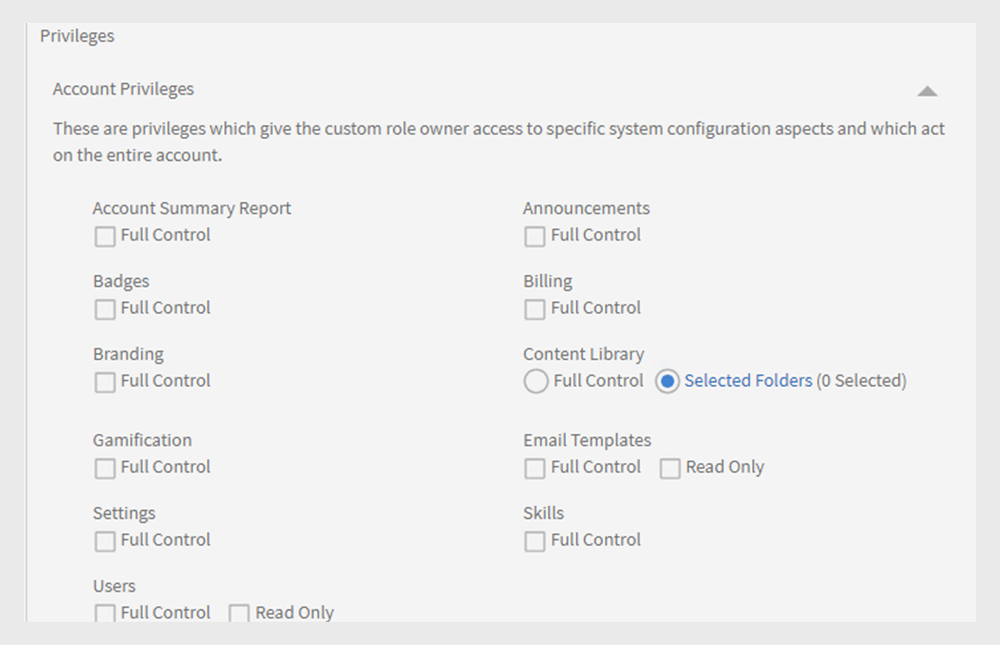

   *Imposta l&#39;ambito*

5. **Privilegi sulle funzionalità - Funzionalità di base**: utilizzato per concedere l’accesso a funzionalità specifiche per la gestione delle attività di apprendimento. tramite questa opzione possono essere concesse le autorizzazioni per le seguenti funzionalità.

   Gli amministratori possono fornire autorizzazioni dettagliate come di sola lettura, creazione, modifica ed eliminazione dei cataloghi.

   * Cataloghi
   * Report
   * Tag

   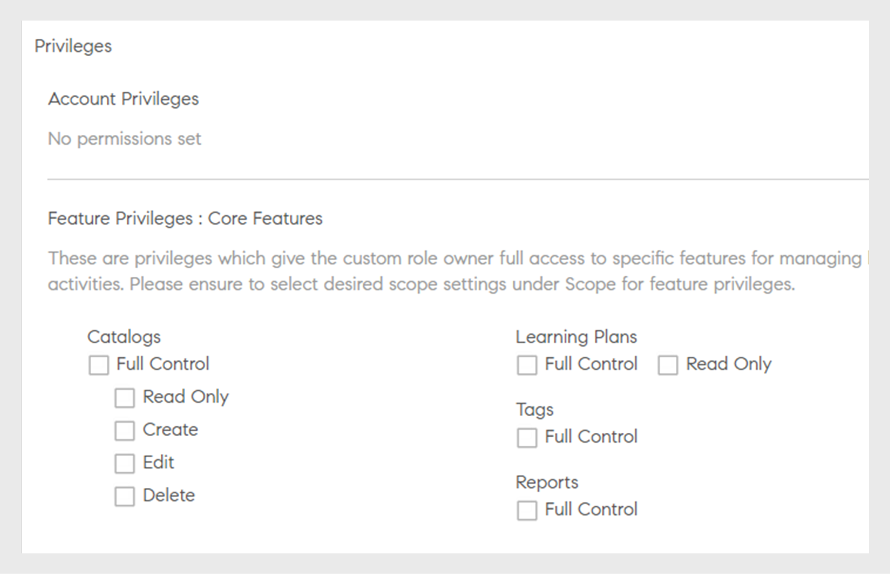

   *Imposta l&#39;ambito per cataloghi, report e tag*

6. **Privilegi sulle funzioni - Oggetti di apprendimento:** Utilizzate questa opzione per fornire accesso alle funzioni relative agli oggetti di apprendimento. Gli Amministratori possono fornire autorizzazioni dettagliate per tutti gli oggetti di apprendimento, inclusi corsi, percorsi di apprendimento, certificazioni e risorse formative. Possono assegnare agli utenti autorizzazioni quali creazione, modifica, eliminazione o accesso di sola lettura.

   * Certificazioni
   * Corsi
   * Risorse formative
   * Programmi di apprendimento

   Puoi anche concedere un controllo operativo specifico per gli oggetti di apprendimento. L’autorizzazione può essere una delle seguenti:

   * Sola lettura
   * Crea
   * Modifica
   * Elimina
   * Iscrizione
   * Report

   È inoltre possibile concedere il controllo completo degli LO.

   

   *Concedere autorizzazioni specifiche*

7. **Ambito per privilegi di funzionalità:** L&#39;ambito dei privilegi di funzionalità allocati a questo ruolo può essere limitato a un gruppo di utenti specifico o a uno o più cataloghi.

   Cataloghi: utilizza il pulsante di opzione per fornire controllo su **[!UICONTROL Tutti i cataloghi]** o utilizza l’opzione **[!UICONTROL Imposta accesso per catalogo]** per fornire l’accesso a cataloghi specifici. Puoi anche selezionare più cataloghi.

   Gruppi di utenti: fornisci l’accesso a **[!UICONTROL Tutti i gruppi di utenti]** o utilizza l’opzione **[!UICONTROL Imposta accesso per gruppo di utenti]** per fornire l’accesso a gruppi di utenti specifici. È possibile specificare un solo gruppo utenti.

   >[!NOTE]
   >
   >Se in Privilegi account hai selezionato Annuncio, Gamification, Modelli e-mail, Abilità e Utenti, l’accesso al gruppo di utenti viene fornito a tutti i gruppi di utenti per impostazione predefinita e questa opzione è disabilitata.

   Se hai selezionato Piani di apprendimento in Privilegi account, per impostazione predefinita è fornito l’accesso a tutti i cataloghi e gruppi di utenti e queste opzioni sono disabilitate in Ambito.

   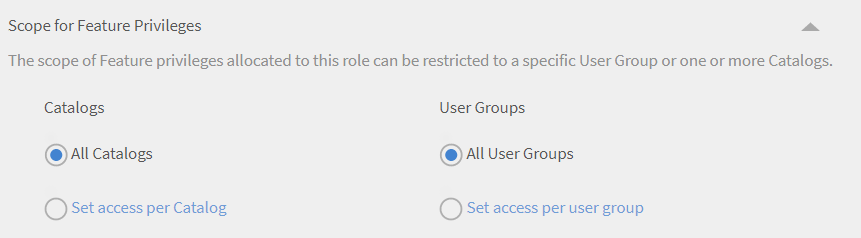

   *Definire l&#39;ambito dei privilegi*

>[!NOTE]
>
>   In Learning Manager 27.6, puoi creare un ruolo personalizzato con un’area di validità di più cataloghi e fare in modo che vengano assegnate autorizzazioni diverse per ogni catalogo.

Per concedere varie autorizzazioni ai cataloghi, attieniti alla seguente procedura:

1. Fai clic sull’opzione **[!UICONTROL Imposta accesso per catalogo]**.
1. Scegli i cataloghi. Puoi vedere il livello di autorizzazione per ciascun catalogo. Le autorizzazioni sono le seguenti:

   <table>
        <tbody>
        <tr>
          <td>
          
<b>Autorizzazione</b>
</td>
          <td>
          
<b>Descrizione</b>
</td>
        </tr>
        <tr>
          <td>
          
Controllo completo
</td>
          <td>
          
Garantisce il controllo completo su tutti gli oggetti di apprendimento. Le autorizzazioni includono Aggiungi, Modifica, Elimina, Lettura, Iscrivimi e Report. 
</td>
        </tr>
        <tr>
          <td>
          
Report
</td>
          <td>
          
Concede solo l’accesso alla scheda Report dell’oggetto di apprendimento.
</td>
        </tr>
        <tr>
          <td>
          
Iscrivimi
</td>
          <td>
          
Concede solo l’autorizzazione a iscriversi per l’oggetto di apprendimento.
</td>
        </tr>
        <tr>
          <td>
          
Sola lettura
</td>
          <td>
          
Concede solo l’autorizzazione per visualizzare gli oggetti di apprendimento nel catalogo.
</td>
        </tr>
        </tbody>
      </table>

1. Attiva o disattiva le autorizzazioni in base alle tue esigenze.
1. Per salvare le modifiche, fai clic su **[!UICONTROL OK]**. Quindi, per salvare le modifiche per il ruolo personalizzato, fai clic su **[!UICONTROL Salva]**.

Ad esempio, considera il seguente scenario.

L’autorizzazione risultante che un utente personalizzato avrebbe su un oggetto di apprendimento è un’intersezione tra l’autorizzazione dell’oggetto di apprendimento e l’autorizzazione del catalogo.

Un utente personalizzato ha l’autorizzazione completa sui corsi e l’accesso in sola lettura sul catalogo A ma l’autorizzazione completa sul catalogo B. I risultati sono un accesso in sola lettura sui corsi del catalogo A e il controllo completo sui corsi del catalogo B.

Un utente con un ruolo personalizzato può:

* visualizzare solo i contenuti dei cataloghi a cui ha accesso;
* accedere a qualsiasi oggetto di apprendimento in base alle autorizzazioni del catalogo di cui esso fa parte.

  In qualità di Amministratore, puoi:

* scegliere più di un catalogo per un ruolo personalizzato;
* modificare le autorizzazioni di un catalogo in qualsiasi momento;
* rimuovere i cataloghi da un ambito a cui non desideri più concedere autorizzazioni;
* concedere implicitamente l’autorizzazione di sola lettura a un catalogo quando concedi le autorizzazioni al catalogo.

  La tabella seguente mostra come vengono concesse le autorizzazioni.

  <table>
    <tbody>
     <tr>
      <td>
       
<strong> </strong>
</td>
      <td>
       
<strong>Autorizzazione a livello di catalogo</strong>
</td>
     </tr>
     <tr>
      <td>
       
<strong>Autorizzazione a livello di oggetto di apprendimento</strong>

       
<strong>(Ad es.: corsi)</strong>
</td>
      <td>
       
Controllo completo
</td>
      <td>
       
Iscrivimi
</td>
      <td>
       
Report
</td>
      <td>
       
Sola lettura
</td>
     </tr>
     <tr>
      <td>
       
Controllo completo
</td>
      <td>
       
Controllo completo
</td>
      <td>
       
Iscrivimi
</td>
      <td>
       
Report
</td>
      <td>
       
Sola lettura
</td>
     </tr>
     <tr>
      <td>
       
Iscrivimi
</td>
      <td>
       
Iscrivimi
</td>
      <td>
       
Iscrivimi
</td>
      <td>
       
Sola lettura
</td>
      <td>
       
Sola lettura
</td>
     </tr>
     <tr>
      <td>
       
Modifica ed elimina
</td>
      <td>
       
Modifica ed elimina
</td>
      <td>
       
Sola lettura
</td>
      <td>
       
Sola lettura
</td>
      <td>
       
Sola lettura
</td>
     </tr>
     <tr>
      <td>
       
Report
</td>
      <td>
       
Report
</td>
      <td>
       
Sola lettura
</td>
      <td>
       
Report
</td>
      <td>
       
Sola lettura
</td>
     </tr>
    </tbody>
   </table>

1. **Utenti:** Utilizzare questa opzione per determinare a quali utenti è assegnato questo ruolo. Puoi scegliere uno o più utenti utilizzando la casella di ricerca.

   **Aggiungi utenti al caricamento CSV del ruolo personalizzato:** Per aggiungere utenti tramite il caricamento CSV, aggiungi una colonna CustomRole al file .csv utilizzato dall&#39;amministratore per importare gli utenti. Immettere il ruolo dell&#39;utente nella colonna CustomRole per gli utenti a cui si desidera assegnare un ruolo personalizzato. Per caricare il file CSV, fai clic su **[!UICONTROL Aggiungi > Carica un file CSV]**.

   * Non è possibile cercare gruppi di utenti.
   * Non è possibile cercare gli utenti a cui è già stato assegnato il ruolo di amministratore.
   * L&#39;assegnazione di un nuovo ruolo personalizzato a un utente sostituisce il precedente ruolo personalizzato dell&#39;utente.

   <!--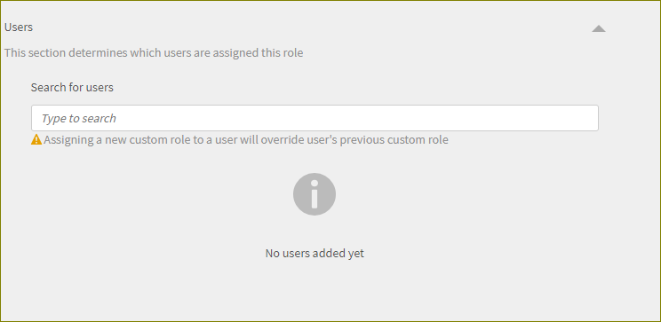-->

   * Un amministratore personalizzato che dispone dell&#39;autorizzazione per Impostazioni potrà configurare la pianificazione per la sincronizzazione o la sincronizzazione degli utenti dall&#39;origine dati anche se non dispone dell&#39;autorizzazione per l&#39;entità Utenti.
   * Se un amministratore personalizzato dispone dell&#39;autorizzazione per l&#39;entità Utenti, può assegnare il ruolo di amministratore a se stesso e diventare un amministratore standard.

## Sblocco dell&#39;autorizzazione utente avanzata {#whatadvanceduserpermissionunlocks}

Quando un amministratore completo abilita l&#39;accesso **avanzato** in **Utenti** in un ruolo personalizzato, l&#39;amministratore personalizzato ottiene l&#39;accesso a quattro sezioni aggiuntive: **Ruoli personalizzati**, **Registri di importazione**, **Campi attivi** e **Pulizia utente**.

Sono disponibili due livelli di accesso:

* **Sola lettura**: l&#39;amministratore personalizzato può visualizzare informazioni e scaricare report, ma non può apportare modifiche.
* **Controllo completo**: l&#39;amministratore personalizzato può creare, modificare ed eliminare ruoli personalizzati, importare utenti ed eliminare utenti eliminati.

### Autorizzazione ed ereditarietà dell&#39;ambito

Quando un amministratore personalizzato crea un nuovo ruolo personalizzato o ne modifica uno esistente, le autorizzazioni e l&#39;ambito che può assegnare sono limitati a ciò che possiede. Un amministratore personalizzato non può concedere a un ruolo autorizzazioni superiori al proprio ambito e non può estendere l&#39;ambito di un ruolo oltre l&#39;ambito assegnato.

Ciò significa che un amministratore personalizzato con accesso a un catalogo specifico può creare solo ruoli con ambito in quel catalogo o in un suo sottoinsieme. Allo stesso modo, possono assegnare le autorizzazioni che detengono personalmente solo ai ruoli che creano.

Quando assegni gli utenti a un ruolo che hai creato, puoi cercare e aggiungere qualsiasi utente nell’account. Le autorizzazioni relative all’utente nei ruoli personalizzati si applicano sempre all’ambito del gruppo di utenti completo e all’ambito del catalogo completo. L&#39;ambito del gruppo di utenti o del catalogo non si applica quando un ruolo personalizzato include autorizzazioni di gestione degli utenti.

Se un amministratore completo riduce l&#39;ambito o rimuove un&#39;autorizzazione dal ruolo, i ruoli creati in precedenza non vengono influenzati immediatamente. Tali ruoli continuano a funzionare con le autorizzazioni esistenti fino a quando un amministratore completo non si apre e salva ciascuno singolarmente.

## Concedere autorizzazioni utente avanzate a un ruolo personalizzato

Gli amministratori completi completano questa procedura per abilitare la gestione utente estesa per un ruolo personalizzato.

1. Accedi a Adobe Learning Manager come amministratore.
2. Seleziona **Utenti** nella barra di navigazione a sinistra, quindi seleziona **Ruoli personalizzati**.
3. Selezionare **Crea ruolo personalizzato** per creare un nuovo ruolo oppure selezionare un ruolo esistente per modificarlo.
4. In **Privilegi account**, individua la sezione **Utenti**.
5. Nella sezione **Utenti avanzati**, seleziona **Sola lettura** o **Controllo completo** in base al livello di accesso richiesto.
6. Aggiungere utenti al ruolo nella sezione **Utenti**.
7. Seleziona **Salva**.

Gli utenti assegnati possono ora accedere alle sezioni **Ruoli personalizzati**, **Campi attivi**, **Registri di importazione** e **Pulizia utente** all&#39;accesso.

## Operazioni che gli amministratori personalizzati possono eseguire con l&#39;accesso in sola lettura

### Importa registri

Gli amministratori personalizzati con accesso in sola lettura possono visualizzare tutti i registri di importazione nell’account. Il pulsante **Aggiungi** non è disponibile. Non è possibile avviare nuove importazioni.

### Pulizia utente

La sezione **Pulizia utente** è disponibile in modalità di sola visualizzazione. Gli amministratori personalizzati possono:

* Visualizzare l’elenco degli utenti eliminati
* Cerca utenti specifici
* Filtra gli utenti eliminati per mese di eliminazione
* Visualizzare altri utenti nell’account

Nessuna azione, ad esempio la rimozione, disponibile nell&#39;accesso **Sola lettura**.

### Ruoli personalizzati

Gli amministratori personalizzati possono visualizzare tutte le definizioni di ruolo personalizzate nell’account, incluse le autorizzazioni assegnate e gli elenchi di utenti. Possono scaricare il report dei ruoli personalizzato. Non possono modificare, creare o eliminare alcun ruolo.

## Operazioni che gli amministratori personalizzati possono eseguire con l&#39;accesso Controllo completo

**Registri di importazione**

Gli amministratori personalizzati con controllo completo possono visualizzare tutti i registri e aggiungere o importare nuovi utenti tramite CSV.

**Pulizia utente**

Controllo completo consente di accedere a tutte le azioni di pulizia dell&#39;utente:

* Visualizzare, cercare e filtrare gli utenti eliminati per mese di eliminazione
* Seleziona singoli utenti o seleziona tutti
* Rimozione degli utenti eliminati dal sistema
* Cercare ed eliminare altri utenti

**Ruoli personalizzati**

Gli amministratori personalizzati con controllo completo possono:

* Crea nuovi ruoli personalizzati con autorizzazioni uguali o inferiori alle proprie
* Modifica ruoli personalizzati esistenti
* Elimina ruoli personalizzati
* Assegnare gli utenti a ruoli personalizzati
* Rimuovere utenti dai ruoli personalizzati
* Scarica il report dei ruoli personalizzati
* Filtra l&#39;elenco dei ruoli in base a **Tutti**, **Creati dall&#39;interfaccia utente** o **Creati da CSV**

>[!NOTE]
>
>Gli amministratori personalizzati non possono aggiungere se stessi a un altro ruolo, né modificare il proprio ruolo con autorizzazioni superiori.

>[!IMPORTANT]
>
>I ruoli creati da un amministratore personalizzato possono includere l&#39;accesso ai ruoli personalizzati, inclusa l&#39;autorizzazione utente avanzata che consente la gestione dei ruoli personalizzati. Ciò significa che un amministratore personalizzato con il controllo completo può creare ruoli che concedono ad altri utenti le stesse funzionalità di ruoli personalizzati di cui dispongono. Le autorizzazioni disponibili durante la creazione del ruolo sono ancora soggette al modello di delega standard. L’amministratore personalizzato può assegnare solo le autorizzazioni di cui è in possesso personalmente, a meno che l’amministrazione dei ruoli dell’account non sia stata abilitata.

### Esempio: creazione di ruoli con ambito come amministratore personalizzato

Un amministratore completo concede a un amministratore personalizzato il controllo completo con accesso a due cataloghi di prodotto. L&#39;amministratore personalizzato:

1. Crea un ruolo di editore con ambito nel primo catalogo e assegna gli autori
1. Crea un secondo ruolo di editore con ambito nel secondo catalogo e assegna un set di autori diverso
1. Assegna ai nuovi autori, che si aggiungono al team, il ruolo appropriato senza coinvolgere l&#39;amministratore completo.

Ogni ruolo creato dall&#39;amministratore personalizzato eredita un sottoinsieme delle autorizzazioni dell&#39;amministratore personalizzato. Gli autori assegnati a questi ruoli possono accedere e pubblicare contenuti nei rispettivi cataloghi. Non possono gestire i ruoli personalizzati in quanto la sezione Ruoli personalizzati non è disponibile nei ruoli creati dagli amministratori personalizzati.

## Confronto delle capacità

| Sezione | Sola lettura | Controllo completo |
|---|---|---|
| Registri di importazione: visualizza i registri | ✓ | ✓ |
| Importa registri: aggiungi o importa utenti tramite CSV | — | ✓ |
| Pulizia utente: visualizza utenti eliminati, ricerca, filtro | ✓ | ✓ |
| Pulizia utente: rimuovi utenti eliminati | — | ✓ |
| Ruoli personalizzati: visualizza tutti i ruoli e le definizioni | ✓ | ✓ |
| Ruoli personalizzati: scaricare il report dei ruoli personalizzati | ✓ | ✓ |
| Ruoli personalizzati: creazione, modifica ed eliminazione di ruoli | — | ✓ |
| Ruoli personalizzati: assegnare e rimuovere utenti | — | ✓ |

## Compatibilità con le versioni precedenti

Se un account dispone di ruoli personalizzati esistenti con accesso **Avanzato** abilitato, tali ruoli includono automaticamente l&#39;accesso ai registri di importazione quando l&#39;account viene aggiornato. Se l&#39;accesso avanzato è attualmente disattivato per un ruolo, non vi sono modifiche. Il ruolo continua a comportarsi come prima.

>[!NOTE]
>
>Se le opzioni di accesso avanzato sono abilitate per gli utenti, verificare quali ruoli dispongono di questo privilegio e confermare che tali ruoli sono destinati a mantenerlo.

## Prova di verifica per modifiche di ruolo personalizzate

Tutte le modifiche ai ruoli personalizzati, incluse la creazione, la modifica, l&#39;eliminazione e l&#39;assegnazione degli utenti, vengono registrate nel report di audit dei ruoli personalizzati. Nel report di audit ora viene visualizzato il nome del ruolo personalizzato responsabile di ogni modifica, anziché un&#39;etichetta di amministratore generica. Non è necessaria alcuna configurazione per abilitare questo comportamento.

Gli amministratori completi possono accedere al report di audit dalla sezione **Report**.

## Casi d&#39;uso reali

### Team di gestione dei ruoli

Una grande organizzazione dispone di un team dedicato responsabile della creazione e dell&#39;assegnazione dei ruoli di autore dei contenuti in decine di cataloghi di prodotti. In precedenza, per creare ogni nuovo ruolo era necessario un amministratore completo. Grazie all&#39;accesso con controllo completo, il team di gestione dei ruoli può creare ruoli autore e autore con ambito di validità in cataloghi specifici, assegnare nuovi autori e gestire tali ruoli in modo indipendente, senza alcun coinvolgimento di amministratore completo per le operazioni di routine.

### Operazioni HR e gestione del ciclo di vita degli utenti

Un team operativo HR è responsabile della pulizia dei conti quando i dipendenti lasciano l&#39;organizzazione. Devono rimuovere regolarmente gli utenti eliminati, ma non devono avere accesso al contenuto del corso, ai dati degli Allievi o alle impostazioni di sistema. La concessione dell&#39;accesso avanzato al controllo completo, con ambito solo per la gestione degli utenti, offre al team HR l&#39;accesso specifico necessario per la pulizia e l&#39;importazione degli utenti senza esporre altre funzioni amministrative.

### Team di conformità e audit

Un team di audit interno deve verificare periodicamente quali ruoli personalizzati esistono, quali autorizzazioni includono e chi detiene ciascun ruolo. Con l&#39;accesso in sola lettura, il team di audit può visualizzare tutte le definizioni dei ruoli e scaricare il report sui ruoli personalizzati per la revisione, ma non può modificare nulla.

## Funzionalità degli amministratori personalizzati

Le procedure seguenti si applicano agli amministratori personalizzati con accesso **Controllo completo**. Accedi come amministratore personalizzato e seleziona **Utenti** > **Ruoli personalizzati** per iniziare.

### Verifica ruoli personalizzati esistenti

1. Selezionare **Utenti** > **Ruoli personalizzati**.
1. Utilizzate il menu a discesa dei filtri per restringere l’elenco:

   * **Tutti**: ogni ruolo nell&#39;account
   * **Creato dall&#39;interfaccia utente**: ruoli creati manualmente
   * **Creato da CSV**: ruoli importati tramite CSV

1. Selezionare un nome di ruolo per aprirne la definizione completa, inclusi autorizzazioni, ambito e utenti assegnati.

### Crea un nuovo ruolo personalizzato

1. Seleziona **Utenti** > **Ruoli personalizzati**, quindi seleziona **Crea ruolo**.
1. Immettere un nome per il ruolo.
1. In **Privilegi account**, configurare le autorizzazioni. Solo le autorizzazioni nel tuo ambito sono disponibili per la selezione. Le autorizzazioni al di fuori dell’ambito vengono visualizzate disattivate.
1. Imposta l’ambito del catalogo e del gruppo di utenti per il ruolo.
1. Nella sezione **Utenti**, cerca e aggiungi gli utenti che ricopriranno questo ruolo.
1. Seleziona **Salva**.

>[!NOTE]
>
>Non è possibile aggiungere se stessi a un ruolo creato e non è possibile creare un ruolo con autorizzazioni superiori a quelle personalizzate. Se un&#39;autorizzazione è disabilitata durante la creazione del ruolo, non rientra nell&#39;ambito corrente.

### Modificare un ruolo personalizzato

1. Seleziona **Utenti** > **Ruoli personalizzati** e apri il ruolo che desideri aggiornare.
1. Seleziona **Modifica**.
1. Aggiorna il nome, le autorizzazioni, l&#39;ambito o le assegnazioni utente in base alle esigenze.
1. Seleziona **Salva**.

>[!NOTE]
>
>Non è possibile modificare le autorizzazioni del proprio ruolo personalizzato. Contattare un amministratore completo se sono necessarie modifiche al proprio ruolo.

### Assegnare gli utenti a un ruolo personalizzato

1. Apri il ruolo personalizzato da **Utenti** > **Ruoli personalizzati**.
1. Nella sezione **Utenti**, cerca l&#39;utente che desideri aggiungere.
1. Selezionare l&#39;utente a cui aggiungere il ruolo.
1. Seleziona **Salva**.

### Rimuovere utenti da un ruolo personalizzato

1. Apri il ruolo personalizzato da **Utenti** > **Ruoli personalizzati**.
1. Nella sezione **Utenti**, individua l&#39;utente che desideri rimuovere.
1. Seleziona l’azione di rimozione accanto al nome.
1. Seleziona **Salva**.

### Rimuovere gli utenti eliminati

1. Seleziona **Utenti** nella barra di navigazione a sinistra.
1. Selezionare **Pulizia utente**.
1. Utilizza il campo di ricerca o il filtro mese di eliminazione per individuare gli utenti da rimuovere.
1. Seleziona la casella di controllo accanto a singoli utenti oppure seleziona **Seleziona tutto** per selezionare tutti i risultati.
1. Seleziona **Azioni** > **Rimuovi utente**.

## Assegnare più ruoli personalizzati a un utente

È possibile assegnare più ruoli personalizzati agli utenti utilizzando i modi seguenti:

* Utilizzo dell&#39;interfaccia utente: puoi assegnare più di un ruolo personalizzato a un utente direttamente dall&#39;interfaccia di Adobe Learning Manager.
* Utilizzo del caricamento CSV: puoi caricare un file CSV per assegnare più ruoli personalizzati a più utenti contemporaneamente.

Ciò semplifica la gestione dell&#39;accesso degli utenti e il controllo delle autorizzazioni nel sistema.

### Assegnazione di più ruoli personalizzati tramite l&#39;interfaccia utente

L’assegnazione di più ruoli personalizzati tramite l’Admin Console in Adobe Learning Manager è un’opzione rapida e intuitiva ideale per l’onboarding, la regolazione delle autorizzazioni o aggiornamenti di dimensioni inferiori. I ruoli possono essere assegnati visivamente, senza la necessità di caricare file CSV, riducendo il rischio di errori e fornendo visibilità in tempo reale. Questo metodo supporta aggiornamenti rapidi in caso di spostamento delle responsabilità e consente il passaggio e la delega dei ruoli in base alle esigenze.

Per assegnare più ruoli personalizzati a un utente, attieniti alla seguente procedura:

1. Accedi come amministratore e seleziona **[!UICONTROL Utenti]**.
2. Seleziona **[!UICONTROL Ruoli personalizzati]** nel pannello a sinistra.
3. Crea un nuovo ruolo personalizzato e aggiungi privilegi di account, cataloghi, oggetti di apprendimento o ambiti. Fai riferimento ai [passaggi indicati qui](#create-a-custom-role).
4. Aggiungi utenti al ruolo personalizzato.

   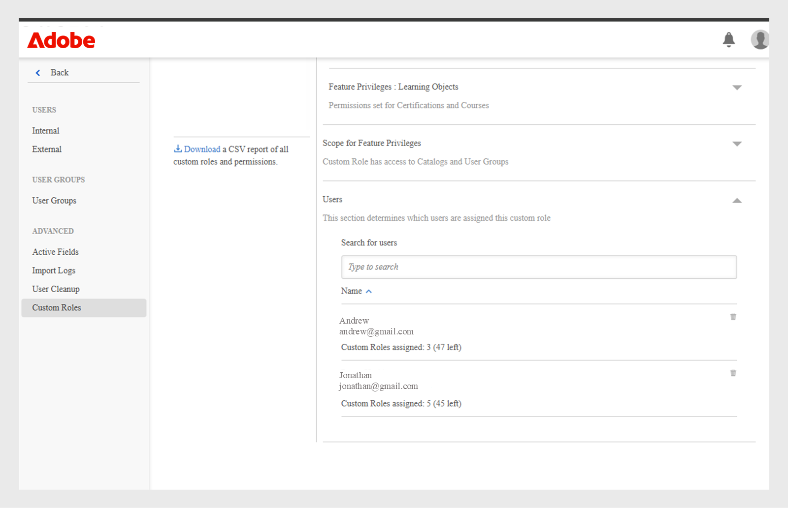
   _Assegnare gli utenti a un ruolo personalizzato_

5. Seleziona **[!UICONTROL Salva]**.

Selezionare più ruoli personalizzati per un utente in base alle esigenze. Ogni utente può avere fino a 50 assegnazioni di ruolo personalizzate. Il numero di ruoli disponibili diminuisce con ogni assegnazione.

Dopo aver assegnato gli utenti a un ruolo personalizzato aggiuntivo, è possibile visualizzare il numero di assegnazioni di ruolo disponibili per ogni utente.

>[!NOTE]
>
>Puoi assegnare fino a 50 ruoli a ciascun utente e aggiungere fino a 500 utenti a ciascun ruolo.

### Assegnazione di più ruoli personalizzati mediante CSV

Il caricamento di un file CSV in Adobe Learning Manager consente l’assegnazione in blocco efficiente di ruoli personalizzati. Questo processo è particolarmente utile per l&#39;inserimento di un numero elevato di dipendenti, la riorganizzazione dei team o l&#39;aggiornamento dell&#39;accesso per nuovi corsi di formazione. Le importazioni di file CSV consentono di risparmiare tempo, garantire assegnazioni coerenti e ridurre gli errori. Questo metodo è particolarmente utile in caso di fusioni, aggiornamenti a livello di reparto o cicli di formazione globali. Questo metodo consente agli amministratori di risparmiare tempo, standardizzare i ruoli e mantenere la governance.

Ora puoi assegnare più ruoli a un utente tramite l’importazione CSV caricando due file in Box:

* [role.csv](assets/role.csv)
* [user_role.csv](assets/user_role.csv)

Il file user_role.csv include i campi Ruolo personalizzato e ID utente.

Il file role.csv include i campi, il ruolo personalizzato, l’origine della creazione e informazioni dettagliate per cataloghi, utenti, corsi, percorsi di apprendimento e altro ancora.

Se il file CSV contiene dati errati o supera i limiti (50 ruoli per utente e 500 utenti per ruolo), verrà visualizzato un messaggio che mostra gli errori.

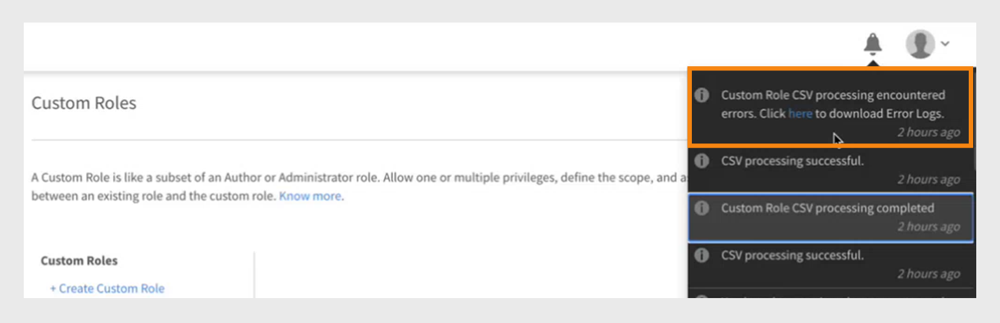
_Notifica di errore per ruoli personalizzati_
Gli utenti ricevono notifiche e-mail quando vengono assegnati i ruoli, incluso il nome del ruolo.

### Gestire i ruoli personalizzati

Gli amministratori possono aggiornare, aggiungere o rimuovere ruoli personalizzati per gli utenti in Adobe Learning Manager man mano che le responsabilità cambiano. Ciò garantisce che l’accesso sia allineato ai ruoli correnti senza influire sulla cronologia dell’apprendimento o sui dati di iscrizione. Nella pagina **[!UICONTROL Utenti]**, l&#39;amministratore può cercare gli utenti, visualizzare i loro ruoli e modificarli utilizzando l&#39;opzione Gestisci ruoli personalizzati. Questa interfaccia guidata consente di aggiungere o rimuovere facilmente i ruoli mantenendo al contempo la governance e la sicurezza.

>[!NOTE]
>
>Gli amministratori personalizzati non possono gestire ruoli personalizzati (aggiungere o rimuovere ruoli personalizzati) né promuovere se stessi al ruolo di amministratore.

Dopo aver assegnato ruoli personalizzati agli utenti, è possibile aggiungere o rimuovere ruoli personalizzati dalla pagina **[!UICONTROL Utenti]**.

1. Cercare un utente nella pagina **[!UICONTROL Utenti]**.

   
   _Cerca un utente nella pagina Utenti_

2. Seleziona la freccia a discesa alla fine della riga in cui viene visualizzato il nome utente, quindi seleziona **[!UICONTROL Gestisci ruoli personalizzati]**.

   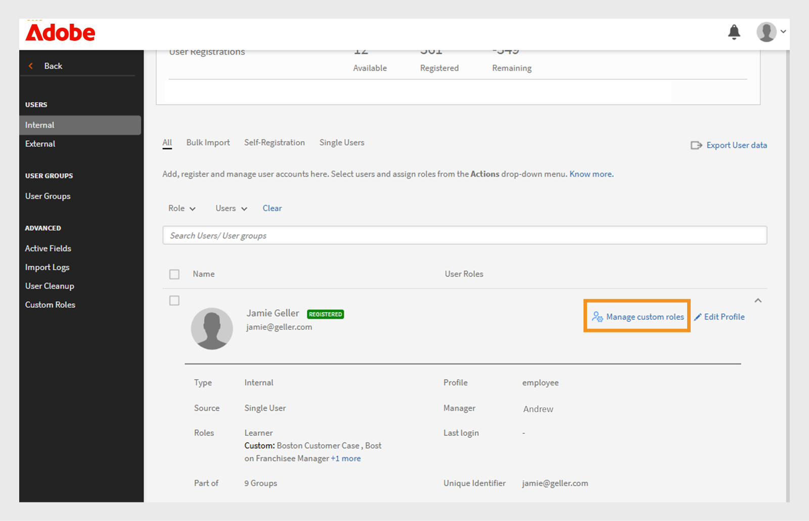
   _Selezionare Gestisci ruoli personalizzati nella pagina utente_

3. Viene visualizzata una finestra di dialogo che elenca i ruoli personalizzati assegnati all&#39;utente. Selezionare **[!UICONTROL Aggiungi/Rimuovi ruoli]** per aggiungere o rimuovere ruoli personalizzati assegnati all&#39;utente.

   
   _Selezionare Aggiungi/Rimuovi ruoli nel prompt Gestione ruoli personalizzati_

4. Cerca altri ruoli personalizzati da assegnare all&#39;utente. Dopo averne individuato uno, seleziona il ruolo personalizzato.

   
   _Selezionare il ruolo personalizzato_

5. Seleziona **[!UICONTROL Salva]**. Viene visualizzata una finestra di dialogo di conferma per la modifica del ruolo personalizzato. Selezionare **[!UICONTROL Sì]**.

   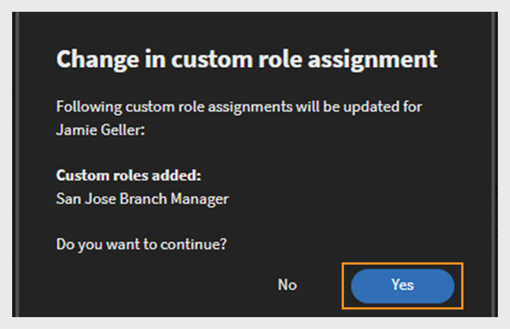
   _Selezionare Sì nella richiesta di conferma_

All&#39;utente viene assegnato un terzo ruolo personalizzato.

Per rimuovere i ruoli personalizzati, attieniti alla seguente procedura:

1. Cercare un utente nella pagina **[!UICONTROL Utenti]**.
2. Seleziona il menu a discesa accanto all&#39;utente e seleziona **[!UICONTROL Gestisci ruoli personalizzati]**.
3. Selezionare **[!UICONTROL Aggiungi/rimuovi ruoli]** per aggiungere o rimuovere ruoli personalizzati.
4. Selezionare l&#39;icona **[!UICONTROL Rimuovi]** per eliminare il ruolo personalizzato.

   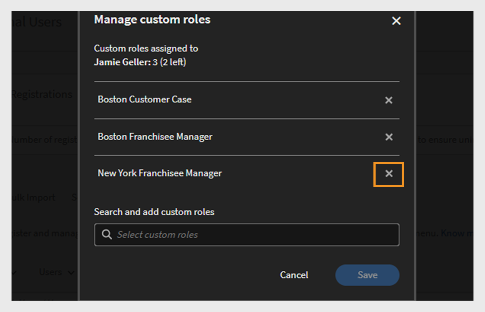
   _Rimuovi ruoli personalizzati_

### Cambia ruoli personalizzati

Per visualizzare e selezionare i ruoli personalizzati assegnati, utilizzare l&#39;opzione **[!UICONTROL Cambia ruolo personalizzato]**.

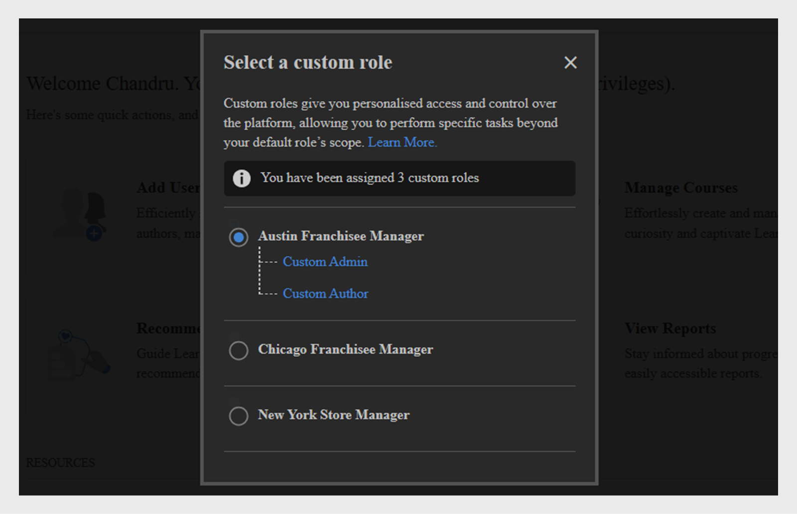
_Selezionare ruoli personalizzati_

Gli utenti ricevono notifiche e-mail quando vengono assegnati loro i ruoli personalizzati. Le e-mail ora includono nomi di ruolo per maggiore chiarezza.

## Scarica report ruolo personalizzato

Gli amministratori possono scaricare un report CSV che elenca tutti i ruoli personalizzati e le autorizzazioni associate. Il report indica se ogni ruolo è stato creato manualmente o tramite il caricamento CSV e fornisce un riepilogo dell’accesso e dei privilegi assegnati a ogni ruolo.

Per scaricare il report, effettua le seguenti operazioni:

1. Accedi come **[!UICONTROL Amministratore]**.
2. Selezionare **[!UICONTROL Utenti]** > **[!UICONTROL Ruoli personalizzati]**.
3. Seleziona l&#39;opzione **[!UICONTROL Scarica]** per scaricare il report CSV.

_Scarica report dei ruoli personalizzati_

Il report contiene due file CSV: role.csv e user_role.csv. Il file role.csv include:

* Ruolo personalizzato
* ID utente
* Fonte di creazione.

Il file user_role.csv include i campi, il ruolo personalizzato, l’origine della creazione e informazioni dettagliate per cataloghi, utenti, corsi, percorsi di apprendimento e altro ancora.

## Audit trail per i ruoli personalizzati

Gli amministratori possono scaricare il report di audit dei ruoli personalizzato per tenere traccia di tutte le modifiche apportate ai ruoli personalizzati, incluse la creazione, la modifica e l’eliminazione di ruoli personalizzati e dell’accesso alle funzionalità associate.

Per ulteriori informazioni, fare riferimento a questo articolo [Audit trail per i ruoli personalizzati](/help/migrated/administrators/feature-summary/reports.md#audit-trail-for-custom-roles).

## Limitare l’accesso alle cartelle per gli Autori personalizzati {#folder-custom-author}

Learning Manager supporta già la possibilità di accedere alla Libreria dei contenuti utilizzando ruoli personalizzati. Tutti gli Autori personalizzati che hanno già accesso alla Libreria dei contenuti continueranno ad avere accesso a tutti i file di contenuto anche dopo la configurazione di cartelle dei contenuti. Ciò consente di mantenere il comportamento precedente. Gli Amministratori non devono apportare alcuna modifica se desiderano continuare a mantenere il comportamento corrente.

Nel caso in cui desiderino limitare l’accesso agli Autori personalizzati, gli Amministratori dovranno modificare il ruolo personalizzato esistente e configurarlo fornendo l’accesso solo a specifiche cartelle dei contenuti.

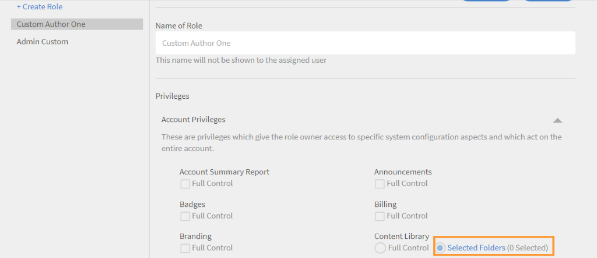

*Limitare l’accesso alle cartelle per autori personalizzati*

Durante la creazione di un Autore personalizzato, ora puoi assegnare all’Autore le cartelle dei contenuti. Scegli l’opzione **Cartelle selezionate**.

Dopo aver fatto clic su questa opzione, si apre una nuova finestra di dialogo in cui puoi assegnare le cartelle all’Autore personalizzato.

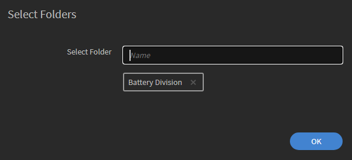

*Selezionare le cartelle per l&#39;autore personalizzato*

Scegli le cartelle e fai clic su **[!UICONTROL OK]**.

## Dashboard di riepilogo dell’apprendimento per Amministratore personalizzato {#custom-admin-dashboard}

Gli amministratori personalizzati possono visualizzare la stessa visualizzazione di un amministratore. Un Amministratore personalizzato può disporre di dati al di fuori del proprio ambito. Ciò è applicabile solo se l’Amministratore personalizzato dispone di pieno ambito. Per concedere pieno ambito, durante la creazione di un Amministratore personalizzato, attiva l’opzione **[!UICONTROL Controllo completo]** in Report di riepilogo account.

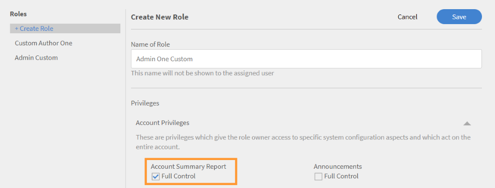

*Creare un ruolo personalizzato*

Di conseguenza, le opzioni **[!UICONTROL Tutti i cataloghi]** e **[!UICONTROL Tutti i gruppi di utenti]** verranno selezionate e le altre verranno disabilitate.

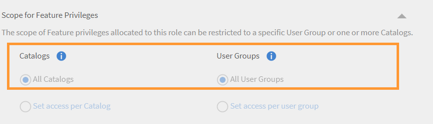

*Definire l&#39;ambito dei privilegi*

## Autorizzazioni implicite {#implicitpermissions}

Quando a un utente viene assegnato un ruolo con un’entità specifica, potrebbero esserci casi in cui è necessario l’accesso anche ad altre entità per poter eseguire attività sull’entità assegnata. Ad esempio, se a un utente viene assegnato l’accesso Crea sull’entità Corso, deve poter accedere alle entità Abilità e Tag in modo da poter associare questi elementi al corso creato. In queste tabelle vengono fornite informazioni relative a tali autorizzazioni implicite.

<table>
 <tbody>
  <tr>
   <th>Tipo di accesso</th>
   <th>Autorizzazione dell’entità assegnata dall’Amministratore</th>
   <th>Autorizzazione entità implicita</th>
   <th>Accesso implicito</th>
  </tr>
  <tr>
   <td>Gestisci</td>
   <td>Utente</td>
   <td>Gruppo</td>
   <td>Crud</td>
  </tr>
  <tr>
   <td>Iscrivimi</td>
   <td>Tutti gli oggetti di apprendimento (corso, risorsa formativa, programma di apprendimento, certificazione)</td>
   <td>Utente 
     Piano di apprendimento</td>
   <td>Lettura</td>
  </tr>
  <tr>
   <td>Crea</td>
   <td>
    
Gruppo di contenuti 
      Risorsa formativa 
</td>
   <td>Tag</td>
   <td>Lettura</td>
  </tr>
  <tr>
   <td>Crea</td>
   <td>Corso</td>
   <td>Gruppo di contenuti 
     Tag 
     Abilità 
     Badge 
     Risorsa formativa</td>
   <td>Lettura su tutti</td>
  </tr>
  <tr>
   <td>Crea</td>
   <td>Programma di apprendimento 
     Certificazione </td>
   <td>Corso 
     Tag 
     Abilità 
     Badge</td>
   <td>Lettura</td>
  </tr>
  <tr>
   <td>Crea</td>
   <td>Piano di apprendimento</td>
   <td>Widget 
     Raggruppamento 
     Abilità 
     Tutti i persi (corso, risorsa formativa, programma di apprendimento, certificazione)</td>
   <td>Lettura</td>
  </tr>
  <tr>
   <td>Crea</td>
   <td>Annuncio</td>
   <td>Utente 
     Raggruppamento 
     Tutti i persi (corso, risorsa formativa, programma di apprendimento, certificazione)</td>
   <td>Lettura</td>
  </tr>
  <tr>
   <td>Crea</td>
   <td>Gamification</td>
   <td>Branding</td>
   <td>Scrittura</td>
  </tr>
  <tr>
   <td>*</td>
   <td>Utente</td>
   <td>Fatturazione</td>
   <td>Lettura</td>
  </tr>
  <tr>
   <td>*</td>
   <td>Catalogo</td>
   <td>Gruppo 
     Tutti i persi (corso, risorsa formativa, programma di apprendimento, certificazione)</td>
   <td>Lettura</td>
  </tr>
  <tr>
   <td>*</td>
   <td>Impostazione</td>
   <td>Branding 
     Utente</td>
   <td>Lettura</td>
  </tr>
  <tr>
   <td>*</td>
   <td>Branding</td>
   <td>Impostazione</td>
   <td>Lettura</td>
  </tr>
  <tr>
   <td>*</td>
   <td>Fatturazione 
     Gamification</td>
   <td>Utente</td>
   <td>Lettura</td>
  </tr>
 </tbody>
</table>

## Accedi a un ruolo personalizzato {#accessacustomrole}

Quando un Amministratore assegna un ruolo personalizzato, ricevi una notifica via e-mail.

Nota: se hai già effettuato l’accesso a Learning Manager con un ruolo personalizzato, dovrai accedere nuovamente a Learning Manager per assumere il nuovo ruolo.

Per passare da un ruolo all’altro, fai clic sull’icona del tuo profilo nell’angolo in alto a destra di Learning Manager e seleziona il ruolo.

## Piani di apprendimento con ambito di validità per ruoli configurabili {#scopeconfigure}

Nelle versioni precedenti di Learning Manager, qualsiasi ruolo personalizzato con l’autorizzazione per la creazione di piani di apprendimento poteva definire l’ambito del piano di apprendimento per tutti i tipi di gruppi di utenti e oggetti di apprendimento.

L’impostazione dell’ambito di validità era disabilitata quando veniva concesso l’accesso al piano di apprendimento, e questo consentiva all’utente per impostazione predefinita l’accesso a tutti i cataloghi e a tutti i gruppi di utenti.

Tutti i piani di apprendimento creati da un amministratore, per impostazione predefinita, sono applicabili a tutti gli utenti. Gli utenti possono inoltre essere assegnati a qualsiasi oggetto di apprendimento. Per contro, gli utenti con ruoli personalizzati hanno accesso a tutti gli ambiti, ad esempio a tutti i cataloghi, gli oggetti di apprendimento o i gruppi di utenti. Di conseguenza, gli amministratori non erano in grado di creare ruoli personalizzati come previsto che consentissero l’accesso ai piani di apprendimento per gli utenti con ambito limitato.

In questo aggiornamento di Learning Manager è possibile creare ruoli personalizzati per piani di apprendimento che consentono di definire l’ambito degli utenti e degli oggetti di apprendimento. In altre parole, i piani di apprendimento possono essere creati con un ambito limitato derivato dall’ambito di un ruolo dell’Amministratore personalizzato.

Ora un Amministratore può definire o limitare l’ambito, garantendo al contempo l’accesso alla gestione del piano di apprendimento.

Gli Amministratori personalizzati possono creare piani di apprendimento con un ambito limitato, determinato dall’ambito del ruolo configurabile dell’Amministratore personalizzato. Tali piani di apprendimento sono accessibili solo agli amministratori personalizzati con lo stesso ruolo, oltre a essere accessibili agli amministratori regolari. Inoltre, gli amministratori personalizzati non possono visualizzare altri piani di apprendimento nell’account.

Gli amministratori personalizzati esistenti, che hanno accesso ai piani di apprendimento, avranno sempre un ambito completo (per definizione). Avranno accesso a tutti i piani di apprendimento nell’account proprio come un normale amministratore. I nuovi ruoli personalizzati creati con ambito completo e i nuovi amministratori personalizzati aggiunti a tali ruoli continueranno ad avere accesso a tutti i piani di apprendimento.

I piani di apprendimento creati dall’Amministratore e dagli Amministratori personalizzati con ambito completo verranno creati come di consueto e non saranno limitati dall’ambito.

Nella sezione **Ambito dei privilegi di funzionalità**, concedi l’accesso ai gruppi di utenti e/o al catalogo per il ruolo personalizzato.

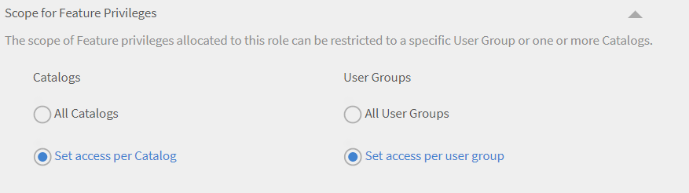

*Concedere l&#39;accesso a gruppi di utenti e/o a cataloghi per il ruolo personalizzato*

Assegna un utente al ruolo personalizzato.

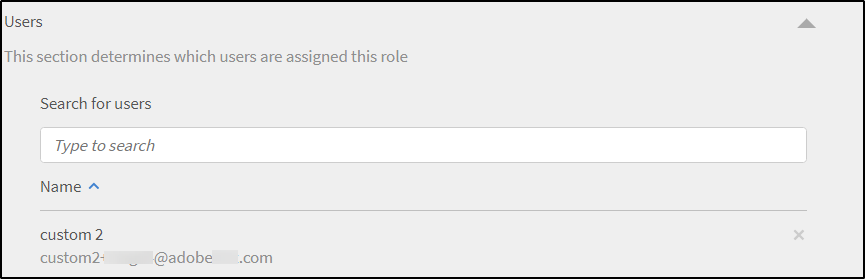

*Assegnare un utente a un ruolo personalizzato*

L’utente ora accede a Learning Manager come Amministratore personalizzato e aggiunge un Piano di apprendimento.

Quando viene aggiunto un nuovo Allievo, l’Amministratore personalizzato può selezionare un corso di formazione solo dai cataloghi con ambito del ruolo configurabile.

Questo piano di apprendimento ora è applicabile all’Allievo solo se l’utente è stato aggiunto anche al gruppo all’interno del gruppo di utenti con ambito del piano di apprendimento. Tutti gli altri Allievi sono esentati da questo piano di apprendimento.

## L’Allievo viene aggiunto al gruppo {#learnergetsaddedtothegroup}

<!--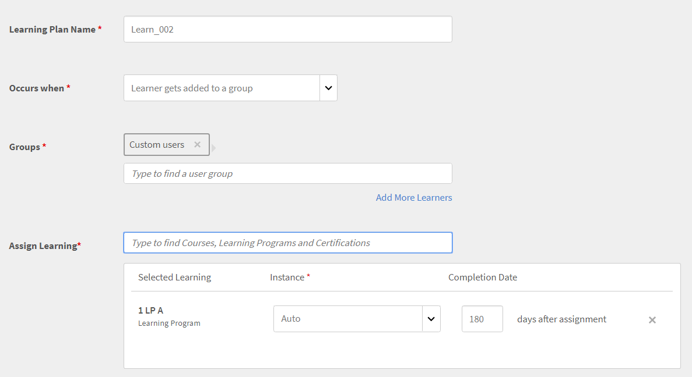-->

L’Amministratore personalizzato può selezionare qualsiasi gruppo di utenti che include utenti appartenenti al gruppo di utenti con ambito del ruolo.

Quando un utente viene aggiunto al gruppo specificato, all’oggetto di apprendimento vengono assegnati solo gli utenti che fanno già parte del gruppo di utenti con ambito del piano di apprendimento e che sono stati aggiunti al gruppo di utenti specificato.

## Modifica dell’ambito {#changeinscope}

Quando l&#39;amministratore modifica l&#39;ambito del ruolo personalizzato, la modifica viene applicata anche all&#39;amministratore personalizzato. Quando l’Amministratore personalizzato sceglie un piano di apprendimento che rientrava già nell’ambito di un ruolo personalizzato precedente, viene visualizzato un messaggio, come illustrato di seguito:

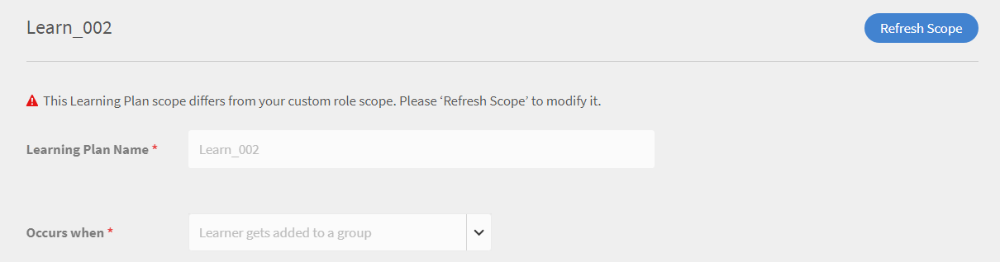

*Messaggio dopo le modifiche dell&#39;ambito*

L&#39;amministratore personalizzato ora deve aggiornare l&#39;ambito precedente al nuovo ambito.

Facendo clic su **[!UICONTROL Aggiorna ambito]**, l’ambito viene aggiornato. Viene visualizzato un messaggio di avviso.

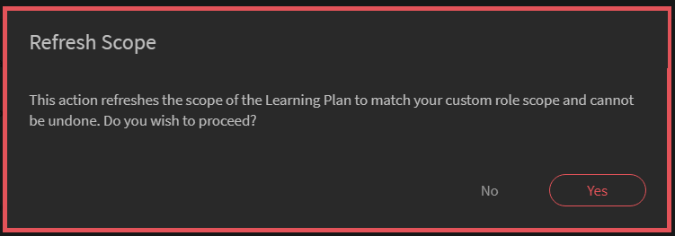

*Messaggio di avviso dopo l&#39;aggiornamento di un ambito*

Facendo clic su **[!UICONTROL Sì]**, l’ambito viene aggiornato.

## Aggiunta di un report gamification a un ruolo personalizzato {#gamification-custom}

Un Amministratore può abilitare i report gamification per un utente personalizzato.

1. Nella pagina **[!UICONTROL Ruoli personalizzati]**, immetti il nome del ruolo personalizzato.
1. Nella sezione **[!UICONTROL Privilegi di funzionalità: Funzionalità principali]**, abilita l&#39;opzione **[!UICONTROL Controllo completo]** per la categoria **[!UICONTROL Report]**.

1. Nella sezione **[!UICONTROL Utenti]**, seleziona l’utente a cui verrà assegnato il ruolo personalizzato appena creato.
1. Fai clic su **[!UICONTROL Salva]**.

Quando un utente accede come Amministratore personalizzato e fa clic su **[!UICONTROL Report]** nel riquadro a sinistra, vengono visualizzate le trascrizioni, come illustrato di seguito:

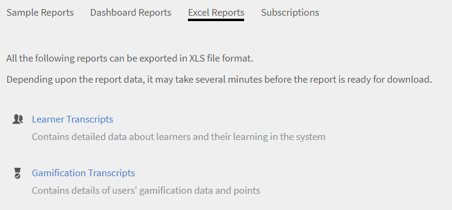

*Scarica le trascrizioni gamification*

Fai clic su **[!UICONTROL Trascrizioni gamification]**, scegli un utente e genera il report.

Se un amministratore modifica i punti del livello, i report mostrano i livelli in base ai punti correnti.

Il ripristino della gamification non ripristina la data di raggiungimento del livello.

## Domande frequenti

**Cosa succede se un amministratore completo rimuove un&#39;autorizzazione dal mio ruolo personalizzato?**

Il ruolo mantiene le autorizzazioni esistenti fino alla successiva apertura di un amministratore completo e salva la definizione del ruolo. La modifica non ha effetto immediato. Le autorizzazioni correnti rimangono attive fino a quando il ruolo non viene esplicitamente modificato e salvato.

**Posso concedere l&#39;accesso al catalogo dei ruoli ai cataloghi a cui non posso accedere?**

N. L’ambito di qualsiasi ruolo creato è limitato ai cataloghi e ai gruppi di utenti all’interno del proprio ambito. Non è possibile creare un ruolo con un accesso più ampio di quello che si dispone personalmente, a meno che l&#39;amministratore non abbia configurato l&#39;account per consentire l&#39;amministrazione di ruoli estesi.

**Differenza tra Sola lettura e Controllo completo?**

**Sola lettura** consente di visualizzare **Ruoli personalizzati**, campi attivi, **Registri di importazione** e **Pulizia utente**. È possibile sfogliare, cercare e scaricare i report, ma non è possibile eseguire alcuna azione. **Controllo completo** offre tutte queste funzionalità oltre alla possibilità di creare, modificare ed eliminare ruoli, importare utenti tramite CSV, assegnare e rimuovere utenti dai ruoli ed eliminare utenti eliminati.

**Posso assegnare un ruolo che creo le stesse autorizzazioni di cui dispongo?**

Sì. Puoi assegnare le autorizzazioni che possiedi personalmente ai ruoli che crei. Non è possibile superare il proprio set di autorizzazioni, ma è possibile creare ruoli con lo stesso livello di accesso disponibile o qualsiasi sottoinsieme di esso.

**La traccia di audit mostra chi sono quando apporto modifiche?**

Sì. Nel report di audit viene elencato il ruolo personalizzato come origine di ogni modifica. Ciò significa che gli amministratori completi possono visualizzare quale ruolo personalizzato ha apportato una determinata modifica al sistema.

**Cosa succede ai ruoli esistenti quando questa funzione è abilitata per l&#39;account?**

I ruoli personalizzati esistenti con accesso **avanzato** già abilitato ottengono automaticamente l&#39;accesso ai **registri di importazione**. Tutti gli altri comportamenti esistenti restano invariati. I ruoli per i quali non è abilitato l&#39;accesso avanzato restano inalterati.

