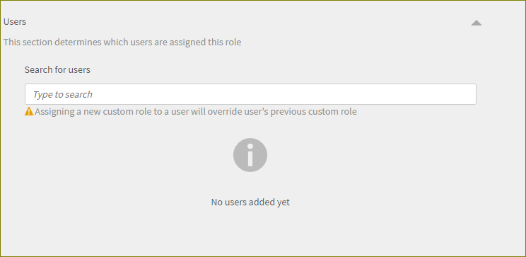
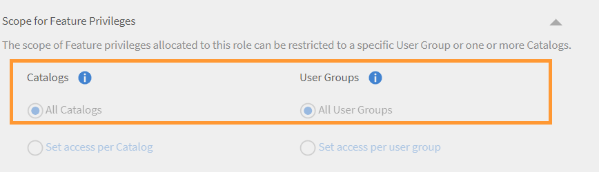

# Ruoli personalizzati

Questa funzione consente di definire ruoli personalizzati e di assegnare responsabilità specifiche a un gruppo di utenti. Questa funzione consente di assegnare responsabilità al di fuori dell&#39;ambito del ruolo esistente della persona.

È possibile creare un ruolo personalizzato per fornire funzionalità di creazione limitate a un determinato catalogo. È inoltre possibile creare un ruolo dedicato alla gestione dei report. Tali ruoli possono poi essere assegnati a individui che dovrebbero assumersi queste responsabilità specifiche.

## Creare un ruolo personalizzato {#create-role}

1. Accedi come Amministratore. Apri **[!UICONTROL Utenti]** > **[!UICONTROL Ruolo personalizzato]**.
1. Seleziona **[!UICONTROL Crea ruolo]**. La **[!UICONTROL Crea nuovo ruolo]** viene aperta la scheda.

   

   *Creare un ruolo personalizzato*

1. Immetti il nome nella casella **[!UICONTROL Nome del ruolo]** campo.
1. **[!UICONTROL Privilegi dell’account]**: questi privilegi consentono ai proprietari dei ruoli di accedere ad aspetti specifici della configurazione del sistema e che agiscono sull&#39;intero account. Scegli le autorizzazioni di accesso. L’utente ottiene il controllo completo sulle autorizzazioni assegnate.

>[!NOTE]
>
>   L&#39;ambito non è applicabile a questi privilegi.

*Imposta l’ambito*

1. **Privilegi di funzionalità - Funzionalità principali**: utilizzato per concedere l&#39;accesso a funzionalità specifiche per la gestione delle attività di apprendimento. Con questa opzione è possibile assegnare le autorizzazioni per le funzionalità seguenti.

   * Cataloghi
   * Report
   * Tag

   

   *Imposta l’ambito per cataloghi, report e tag*

1. **Privilegi di funzionalità - Oggetti di apprendimento:**  Utilizzare questa opzione per consentire l&#39;accesso alle funzioni relative agli oggetti di apprendimento. Puoi fornire l’accesso ai seguenti LO.

   * Certificazioni
   * Corsi
   * Risorse formative
   * Programmi di apprendimento

   È inoltre possibile concedere un controllo operativo specifico per gli LO. L&#39;autorizzazione può essere una delle seguenti:

   * Controllo completo
   * Modifica ed elimina
   * Iscrizione
   * Report

   

   *Concedere autorizzazioni specifiche*

1. **Ambito per i privilegi di funzionalità:** L’ambito dei privilegi di funzionalità assegnati a questo ruolo può essere limitato a un gruppo di utenti specifico o a uno o più cataloghi.

   Cataloghi: utilizza il pulsante di scelta per controllare i **[!UICONTROL Tutti i cataloghi]** oppure utilizza il **[!UICONTROL Imposta accesso per catalogo]** opzione per consentire l’accesso a cataloghi specifici. Potete anche selezionare più cataloghi.

   Gruppi di utenti: Fornisci accesso a **[!UICONTROL Tutti i gruppi di utenti]** oppure utilizza il **[!UICONTROL Imposta accesso per gruppo di utenti]** per fornire l’accesso a gruppi di utenti specifici. È possibile specificare un solo gruppo di utenti.

   >[!NOTE]
   >
   >Se in Privilegi account hai selezionato Annuncio, Gamification, Modelli e-mail, Abilità e Utenti, l’accesso al gruppo di utenti viene fornito a tutti i gruppi di utenti per impostazione predefinita e questa opzione è disabilitata.

   Se hai selezionato Piani di apprendimento in Privilegi account, l’accesso a tutti i cataloghi e i gruppi di utenti è fornito per impostazione predefinita e queste opzioni in Ambito sono disabilitate.

   

   *Definire l&#39;ambito dei privilegi*

>[!NOTE]
>
>   In Learning Manager 27.6 puoi creare un ruolo personalizzato con un’area di validità di più cataloghi e fare in modo che vengano assegnate autorizzazioni diverse per ogni catalogo.

Per concedere varie autorizzazioni ai cataloghi, effettuate le seguenti operazioni:

1. Fai clic sull’opzione **[!UICONTROL Imposta accesso per catalogo]**.
1. Scegli i cataloghi e visualizza il livello di autorizzazione per ogni catalogo. Le autorizzazioni sono le seguenti:

   <table>
        <tbody>
        <tr>
          <td>
          
<b>Autorizzazione</b>
</td>
          <td>
          
<b>Descrizione</b>
</td>
        </tr>
        <tr>
          <td>
          
Controllo completo
</td>
          <td>
          
Concede il controllo completo su tutti gli oggetti di apprendimento. Le autorizzazioni includono Aggiungi, Modifica, Elimina, Lettura, Iscrizione e Report. 
</td>
        </tr>
        <tr>
          <td>
          
Report
</td>
          <td>
          
Concede l’accesso alla scheda Report solo per l’oggetto di apprendimento.
</td>
        </tr>
        <tr>
          <td>
          
Iscrizione
</td>
          <td>
          
Concede l’autorizzazione all’iscrizione solo per l’oggetto di apprendimento.
</td>
        </tr>
        <tr>
          <td>
          
Sola lettura
</td>
          <td>
          
Concede l’autorizzazione per visualizzare solo gli oggetti di apprendimento nel catalogo.
</td>
        </tr>
        </tbody>
      </table>

1. Abilita o disabilita le autorizzazioni in base alle tue esigenze.
1. Per salvare le modifiche, fai clic su **[!UICONTROL OK]**. Per salvare le modifiche apportate al ruolo personalizzato, fare clic su **[!UICONTROL Salva]**.

Ad esempio, considera il seguente scenario.

L’autorizzazione risultante, che un utente personalizzato avrebbe su un oggetto di apprendimento, è un’intersezione tra l’autorizzazione Oggetto di apprendimento e l’autorizzazione Catalogo.

Un utente personalizzato ha l’autorizzazione completa sui corsi e l’accesso in sola lettura sul catalogo A, ma l’autorizzazione completa sul catalogo B. I risultati sono un accesso in sola lettura sui corsi del catalogo A e il controllo completo sui corsi del catalogo B.

Un utente con un ruolo personalizzato può:

* Visualizza solo i contenuti dei cataloghi a cui ha accesso.
* Accedi a qualsiasi oggetto di apprendimento in base alle autorizzazioni del catalogo di cui fa parte l’oggetto di apprendimento.

In qualità di Amministratore, puoi:

* Scegli più di un catalogo per un ruolo personalizzato.
* Modificare le autorizzazioni di un catalogo in qualsiasi momento.
* Rimuovi i cataloghi da un ambito a cui non desideri più concedere autorizzazioni.
* Concedere implicitamente l’autorizzazione di sola lettura a un catalogo quando si concedono le autorizzazioni al catalogo.

La tabella seguente illustra come vengono concesse le autorizzazioni.

<table>
    <tbody>
     <tr>
      <td>
       
<strong> </strong>
</td>
      <td>
       
<strong>Autorizzazione a livello di catalogo</strong>
</td>
     </tr>
     <tr>
      <td>
       
<strong>Autorizzazione a livello di oggetto di apprendimento</strong>

       
<strong>(Ad es.: corsi)</strong>
</td>
      <td>
       
Controllo completo
</td>
      <td>
       
Iscrizione
</td>
      <td>
       
Report
</td>
      <td>
       
Sola lettura
</td>
     </tr>
     <tr>
      <td>
       
Controllo completo
</td>
      <td>
       
Controllo completo
</td>
      <td>
       
Iscrizione
</td>
      <td>
       
Report
</td>
      <td>
       
Sola lettura
</td>
     </tr>
     <tr>
      <td>
       
Iscrizione
</td>
      <td>
       
Iscrizione
</td>
      <td>
       
Iscrizione
</td>
      <td>
       
Sola lettura
</td>
      <td>
       
Sola lettura
</td>
     </tr>
     <tr>
      <td>
       
Modifica ed elimina
</td>
      <td>
       
Modifica ed elimina
</td>
      <td>
       
Sola lettura
</td>
      <td>
       
Sola lettura
</td>
      <td>
       
Sola lettura
</td>
     </tr>
     <tr>
      <td>
       
Report
</td>
      <td>
       
Report
</td>
      <td>
       
Sola lettura
</td>
      <td>
       
Report
</td>
      <td>
       
Sola lettura
</td>
     </tr>
    </tbody>
   </table>
1. **Utenti:** Utilizzare questa opzione per determinare gli utenti a cui è assegnato questo ruolo. Puoi scegliere uno o più utenti utilizzando la casella di ricerca.

**Aggiungi utenti al caricamento CSV del ruolo personalizzato:** Per aggiungere utenti tramite l’aggiornamento CSV, aggiungi una colonna CustomRole al file .csv utilizzato dall’amministratore per importare gli utenti. Immettere il ruolo dell&#39;utente nella colonna CustomRole per gli utenti a cui si desidera assegnare un ruolo personalizzato. Per caricare il file CSV, fai clic su  **[!UICONTROL Aggiungi > Carica un file CSV]**.

Colonna CustomRoleNota:

* Non è possibile cercare gruppi di utenti.
* Non è possibile cercare tra gli utenti a cui è già stato assegnato il ruolo di amministratore.
* L&#39;assegnazione di un nuovo ruolo personalizzato a un utente sostituisce il precedente ruolo personalizzato dell&#39;utente.

<!---->

* Un amministratore personalizzato che dispone dell&#39;autorizzazione per Impostazioni potrà configurare la pianificazione per la sincronizzazione o la sincronizzazione degli utenti dall&#39;origine dati anche se non dispone dell&#39;autorizzazione per l&#39;entità Utenti.
* Se un amministratore personalizzato dispone dell’autorizzazione per l’entità Utenti, può assegnare il ruolo di amministratore a se stesso e diventare un amministratore standard.

## Limitazione dell’accesso alle cartelle per gli autori personalizzati {#folder-custom-author}

Learning Manager supporta già la possibilità di concedere l’accesso alla libreria dei contenuti utilizzando ruoli personalizzati. Tutti gli autori personalizzati che hanno già accesso alla raccolta di contenuti continueranno ad avere accesso a tutti i file di contenuto anche dopo la configurazione delle cartelle dei contenuti. In questo modo si mantiene il comportamento precedente. Gli amministratori non devono apportare modifiche nel caso in cui desiderano continuare a utilizzare il comportamento corrente.

Nel caso in cui desiderino limitare l’accesso a questi autori personalizzati, gli amministratori devono modificare il ruolo personalizzato esistente e configurarlo fornendo l’accesso solo a specifiche cartelle di contenuti.

*Limitazione dell’accesso alle cartelle per gli autori personalizzati*

Durante la creazione di un autore personalizzato, è ora possibile assegnare cartelle dei contenuti all’autore. Scegli l’opzione **Cartelle selezionate**.

Dopo aver fatto clic sull’opzione, si apre una nuova finestra di dialogo in cui è possibile assegnare le cartelle all’autore personalizzato.

*Selezionare le cartelle per l&#39;autore personalizzato*

Scegli le cartelle e fai clic su **[!UICONTROL OK]**.

## Dashboard di riepilogo dell’apprendimento per l’Amministratore personalizzato {#custom-admin-dashboard}

Gli amministratori personalizzati possono visualizzare la stessa visualizzazione di un amministratore. Un amministratore personalizzato può accedere a dati che non rientrano nel suo ambito. Questo è applicabile solo se l’amministratore personalizzato ha un ambito completo. Per concedere pieno ambito, durante la creazione di un amministratore personalizzato, attiva l’opzione **[!UICONTROL Controllo completo]** nel rapporto Sintetico conto.

*Creare un ruolo personalizzato*

Di conseguenza, le opzioni, **[!UICONTROL Tutti i cataloghi]** e **[!UICONTROL Tutti i gruppi di utenti]** verrà selezionato e il resto verrà disabilitato.

*Definire l&#39;ambito dei privilegi*

## Autorizzazioni implicite {#implicitpermissions}

Quando a un utente viene assegnato un ruolo con un&#39;entità specifica, potrebbero esserci casi in cui ha bisogno di accedere ad altre entità anche per poter eseguire compiti sull&#39;entità concessa. Ad esempio, se a un utente viene concesso l’accesso Crea all’entità Corso, deve accedere alle entità Abilità e Tag in modo da poterle associare al corso creato. In queste tabelle vengono fornite informazioni relative a tali autorizzazioni implicite.

<table>
 <tbody>
  <tr>
   <th>Tipo di accesso</th>
   <th>Autorizzazione entità concessa dall'amministratore</th>
   <th>Autorizzazione entità implicita</th>
   <th>Accesso implicito</th>
  </tr>
  <tr>
   <td>Gestisci</td>
   <td>Utente</td>
   <td>Raggruppamento</td>
   <td>Grezzo</td>
  </tr>
  <tr>
   <td>Iscrizione</td>
   <td>Tutti i persi (corso, risorsa formativa, programma di apprendimento, certificazione)</td>
   <td>Utente 
     Piano di apprendimento</td>
   <td>Leggi</td>
  </tr>
  <tr>
   <td>Crea</td>
   <td>
    
Gruppo di contenuti 
      Risorsa formativa 
</td>
   <td>Tag</td>
   <td>Leggi</td>
  </tr>
  <tr>
   <td>Crea</td>
   <td>Corso</td>
   <td>Gruppo di contenuti 
     Tag 
     Abilità 
     Badge 
     Risorsa formativa</td>
   <td>Continua a leggere</td>
  </tr>
  <tr>
   <td>Crea</td>
   <td>Programma di apprendimento 
     Certificazione </td>
   <td>Corso 
     Tag 
     Abilità 
     Badge</td>
   <td>Leggi</td>
  </tr>
  <tr>
   <td>Crea</td>
   <td>Piano di apprendimento</td>
   <td>Catalogo 
     Raggruppamento 
     Abilità 
     Tutti i persi (corso, risorsa formativa, programma di apprendimento, certificazione)</td>
   <td>Leggi</td>
  </tr>
  <tr>
   <td>Crea</td>
   <td>Annuncio</td>
   <td>Utente 
     Raggruppamento 
     Tutti i persi (corso, risorsa formativa, programma di apprendimento, certificazione)</td>
   <td>Leggi</td>
  </tr>
  <tr>
   <td>Crea</td>
   <td>Gamification</td>
   <td>Branding</td>
   <td>Scrivi</td>
  </tr>
  <tr>
   <td>*</td>
   <td>Utente</td>
   <td>Fatturazione</td>
   <td>Leggi</td>
  </tr>
  <tr>
   <td>*</td>
   <td>Catalogo</td>
   <td>Raggruppamento 
     Tutti i persi (corso, risorsa formativa, programma di apprendimento, certificazione)</td>
   <td>Leggi</td>
  </tr>
  <tr>
   <td>*</td>
   <td>Impostazione</td>
   <td>Branding 
     Utente</td>
   <td>Leggi</td>
  </tr>
  <tr>
   <td>*</td>
   <td>Branding</td>
   <td>Impostazione</td>
   <td>Leggi</td>
  </tr>
  <tr>
   <td>*</td>
   <td>Fatturazione 
     Gamification</td>
   <td>Utente</td>
   <td>Leggi</td>
  </tr>
 </tbody>
</table>

## Accedere a un ruolo personalizzato {#accessacustomrole}

Quando un Amministratore assegna un ruolo personalizzato, si riceve una notifica tramite e-mail.

Nota: se hai già effettuato l’accesso a Learning Manager con un ruolo personalizzato, per accedere al nuovo ruolo dovrai eseguire nuovamente l’accesso a Learning Manager.

Per passare da un ruolo all’altro, fai clic sull’icona del profilo nell’angolo superiore destro di Learning Manager e seleziona il ruolo.

## Piani di apprendimento con ambito di validità per ruoli configurabili {#scopeconfigure}

Nelle versioni precedenti di Learning Manager, qualsiasi Ruolo personalizzato con autorizzazione per la creazione di piani di apprendimento poteva includere il piano di apprendimento per tutti i tipi di gruppi di utenti e oggetti di apprendimento.

L’impostazione dell’ambito veniva disabilitata quando veniva concesso l’accesso al piano di apprendimento, consentendo all’utente di accedere per impostazione predefinita a Tutti i cataloghi e a Tutti i gruppi di utenti.

Tutti i piani di apprendimento creati da un Amministratore, per impostazione predefinita, sono applicabili a tutti gli utenti. Agli utenti può anche essere assegnato qualsiasi oggetto di apprendimento. D’altro canto, gli utenti con ruoli personalizzati hanno accesso a ambiti completi, ad esempio, a tutti i cataloghi, agli oggetti di apprendimento o ai gruppi di utenti. Ciò significa che gli amministratori non erano in grado di creare ruoli personalizzati come previsto che consentivano l’accesso ai piani di apprendimento per gli utenti con ambito limitato.

In questo aggiornamento di Learning Manager puoi creare ruoli personalizzati per piani di apprendimento che consentono di definire l’ambito di utenti e oggetti di apprendimento. In altre parole, i piani di apprendimento possono essere creati con un ambito limitato derivato dall’ambito di un ruolo di amministratore personalizzato.

Ora un Amministratore può definire o limitare l’ambito, garantendo al contempo l’accesso alla gestione del piano di apprendimento.

Gli amministratori personalizzati possono creare piani di apprendimento con un ambito limitato, determinato dall’ambito del ruolo configurabile dell’amministratore personalizzato. Tali piani di apprendimento sono accessibili solo agli amministratori personalizzati con lo stesso ruolo, oltre a essere accessibili agli amministratori regolari. Inoltre, gli amministratori personalizzati non possono visualizzare altri piani di apprendimento nell’account.

Gli amministratori personalizzati esistenti, che hanno accesso ai piani di apprendimento, avranno sempre un ambito completo (per definizione). Avranno accesso a tutti i piani di apprendimento nell’account proprio come fanno gli amministratori regolari. I nuovi ruoli personalizzati creati con ambito completo e i nuovi amministratori personalizzati aggiunti a tali ruoli continueranno ad avere accesso a tutti i piani di apprendimento.

I piani di apprendimento creati dagli Amministratori e dagli Amministratori personalizzati con ambito completo verranno creati come di consueto e non saranno limitati dall’ambito.

Nella sezione **Ambito dei privilegi di funzionalità**, concedi l’accesso a gruppi di utenti e/o cataloghi per il ruolo personalizzato.

*Concedere l’accesso a gruppi di utenti e/o cataloghi per il ruolo personalizzato*

Assegna un utente al ruolo personalizzato.

*Assegnare un utente a un ruolo personalizzato*

L’utente ora accede a Learning Manager come Amministratore personalizzato e aggiunge un Piano di apprendimento.

Quando viene aggiunto un nuovo Allievo, l’Amministratore personalizzato può selezionare un corso di formazione solo dai cataloghi con ambito del ruolo configurabile.

Questo piano di apprendimento ora è applicabile all’Allievo solo se l’utente è stato aggiunto anche al gruppo all’interno del gruppo di utenti con ambito del piano di apprendimento. Tutti gli altri Allievi vengono esentati da questo piano di apprendimento.

## L’Allievo viene aggiunto al gruppo {#learnergetsaddedtothegroup}

<!---->

L’amministratore personalizzato può selezionare qualsiasi gruppo di utenti che abbia utenti all’interno del gruppo di utenti con ambito del ruolo.

Quando un utente viene aggiunto al gruppo specificato, solo agli utenti che fanno già parte del gruppo di utenti con ambito del piano di apprendimento e sono stati aggiunti al gruppo di utenti specificato verrà assegnato l’oggetto di apprendimento.

## Modifica dell&#39;ambito {#changeinscope}

Quando l’Amministratore modifica l’ambito del ruolo personalizzato, la modifica si applica anche in cascata all’Amministratore personalizzato. Quando l’Amministratore personalizzato sceglie un piano di apprendimento che rientrava già nell’ambito di un ruolo personalizzato precedente, viene visualizzato un messaggio, come illustrato di seguito:

*Messaggio dopo le modifiche dell&#39;ambito*

L’Amministratore personalizzato ora deve aggiornare l’ambito precedente al nuovo ambito.

Fare clic su **[!UICONTROL Ambito aggiornamento]** aggiorna l&#39;ambito. Viene visualizzato un messaggio di avviso.

*Messaggio di avviso dopo l&#39;aggiornamento di un ambito*

Fare clic su **[!UICONTROL Sì]** aggiorna l&#39;ambito.

## Aggiungere un report di gamification a un ruolo personalizzato {#gamification-custom}

Un amministratore può abilitare i report di gamification per un utente personalizzato.

1. Nella **[!UICONTROL Ruoli personalizzati]** immettere il nome del ruolo personalizzato.
1. Nella **[!UICONTROL Privilegi di funzionalità: funzionalità principali]** , abilita l&#39;opzione **[!UICONTROL Controllo completo]** per la categoria **[!UICONTROL Report]**.

1. Nella sezione **[!UICONTROL Utenti]**, seleziona l’utente a cui verrà assegnato il ruolo personalizzato appena creato.
1. Fai clic **[!UICONTROL Salva]**.

Quando un utente accede come Amministratore personalizzato e fa clic su **[!UICONTROL Report]** nel riquadro a sinistra, vengono visualizzate le trascrizioni, come illustrato di seguito:

*Scarica le trascrizioni della gamification*

Fai clic **[!UICONTROL Trascrizioni gamification]**, scegli un utente e genera il report.

Se un Amministratore modifica i punti di livello, i rapporti mostrano i livelli in base ai punti correnti.

La reimpostazione della gamification non reimposta la data di raggiungimento del livello.

## Domande frequenti {#frequentlyaskedquestions}

+++Come si crea un ruolo personalizzato?

Un ruolo personalizzato è simile a un sottoinsieme di un ruolo Autore o Amministratore. Consenti uno o più privilegi, definisci l’ambito e assegna il ruolo a un utente.

Fai clic **[!UICONTROL Utenti]** > **[!UICONTROL Ruoli personalizzati]**. Nella pagina Ruoli personalizzati fare clic su **[!UICONTROL Crea ruolo]**. Immettere il nome del ruolo personalizzato e impostare i privilegi per il ruolo. Per ulteriori informazioni, consulta [Creare un ruolo personalizzato](custom-role.md#create-role).
+++
