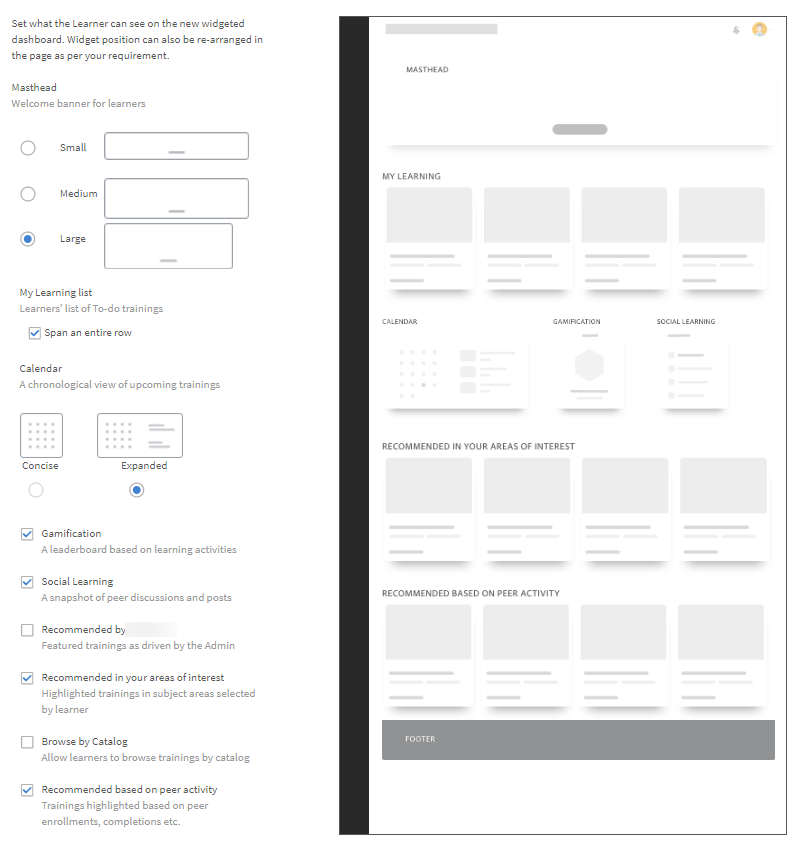

# Personalizzazione della pagina principale dell’Allievo

## Panoramica {#overview}

Un Amministratore può personalizzare la pagina principale dell’Allievo e renderla più moderna, basata sui contenuti e personalizzata.

L’approccio personalizzato offre un modo basato su widget di creare una home page Allievo, che l’Amministratore dell’organizzazione può configurare nell’interfaccia utente dell’Amministratore in modo WYSIWYG.

L’esperienza è guidata da raccomandazioni di formazione personalizzate provenienti da un algoritmo basato sull’intelligenza artificiale che analizza i contenuti di terze parti per le competenze del settore, incorpora l’attività dei colleghi e le aree di interesse degli Allievi utilizzando dati espliciti e impliciti.

### Personalizzazione della pagina principale dell’Allievo

In questo corso di formazione verranno illustrati i modi per personalizzare la pagina principale dell’Allievo.

Se non è possibile avviare il corso di formazione, scrivere a <almacademy@adobe.com>.

## Configurazione della pagina principale dell’Allievo {#configurethelearnerhomepage}

Nella pagina **Branding** > **Pagina principale dell’Allievo**, un Amministratore può personalizzare l’esperienza della pagina principale di un Allievo, in modo che quando accede all’app, l’Allievo riscontri un aspetto completamente rinnovato.

Gli amministratori possono impostare l’interfaccia utente (aspetto) dall’app di amministrazione (**Branding** > **Home page Allievo** scheda).

Gli Amministratori possono passare alla visualizzazione immersiva dei widget dell’interfaccia utente, personalizzare quindi widget/funzionalità e abilitare l’interfaccia utente immersiva.

La schermata **Home page Allievo** contiene le sezioni seguenti:

## Opzione di layout immersivo {#immersivelayoutoption}

Per visualizzare il layout di una pagina immersiva, abilita l’opzione **Immersivo**. Puoi attivare/disattivare questa opzione in **Branding > Generale**.

Nelle versioni precedenti, le opzioni della pagina principale dell’Allievo erano disponibili in Impostazioni.

Di seguito sono riportate le opzioni che possono essere impostate:

**Esperienza della pagina principale:** Abilita **Classico** o **Immersivo**. Se scegli Immersiva, vengono visualizzate le seguenti opzioni:

* **Tipo di corso di formazione:** Scegliere **Settore** o **Allineato personalizzato**. I corsi di formazione personalizzati vengono creati internamente. I corsi di formazione allineati al settore comprendono contenuti disponibili subito di fornitori terzi.

*Impostare l&#39;esperienza della home page selezionando Industria o Allineato personalizzato*

L’opzione **Consenti agli Allievi di esplorare le aree di interesse** è disponibile sia per l’esperienza classica che per quella immersiva.

<table>
 <tbody>
  <tr>
   <td>
    
<b>Se scegli Personalizzato...</b>
</td>
   <td>
    
<b>Se scegli Allineato al settore...</b> 
</td>
  </tr>
  <tr>
   <td>
    
Puoi scegliere al massimo un campo attivo interno ed esterno.
</td>
   <td>
    
Puoi scegliere da uno a massimo cinque campi. Per impostazione predefinita, l’opzione <b>Profilo </b>è selezionata.
</td>
  </tr>
 </tbody>
</table>

Se sono presenti meno di 1000 Allievi, l’intero account viene considerato come un unico ambito. Questo è specifico per il tipo di formazione personalizzata. Se l’account ha meno di 1000 utenti, considera l’intero account come un’area di validità.

>[!NOTE]
>
>La casella di controllo **Esplora abilità** è stata spostata in Impostazioni > Generale.

Questa opzione verrà attivata e disattivata se viene scelta l’esperienza immersiva. Questa casella di controllo verrà abilitata solo per l’esperienza classica.

*Impostazioni della pagina principale dell’Allievo*

Il layout immersivo è l’impostazione predefinita per tutti i nuovi account. Il layout è controllato da widget che un amministratore può abilitare o disabilitare. In base al modo in cui i widget vengono posizionati, lo stesso si riflette nella pagina principale dell’Allievo.

Ecco i widget che puoi abilitare/disabilitare.

Utilizzandoli, puoi visualizzare l’anteprima dell’interfaccia utente dell’Allievo prima che venga pubblicata.

Per gli account esistenti, l&#39;opzione **Immersiva** sarà **DISATTIVATA**. È abilitato per il nuovo account con Social e Gamification ON.

*Anteprima dell’interfaccia utente dell’Allievo*

<table>
 <tbody>
  <tr>
   <td>
    
<b>Widget</b>
</td>
   <td>
    
<b>Descrizione</b>
</td>
  </tr>
  <tr>
   <td>
    
Masthead
</td>
   <td>
    
<b>Cos’è un Masthead e come si personalizzano gli Allievi Masthead? </b> 

    
È un banner di benvenuto per gli Allievi. Il banner può essere un’immagine o un video. Puoi indirizzare il masthead a gruppi di utenti specifici e un Allievo lo visualizza non appena arriva alla pagina principale. Un gruppo di utenti può visualizzare più heri images o video in base al piano di destinazione impostato dall’amministratore. 

    
Ecco in che modo un Amministratore carica un banner:

    <ol>
     <li>Nel pannello a sinistra, fai clic su <b>Annunci</b>. </li>
     <li>Nell’angolo superiore destro della pagina, fai clic su <b>Aggiungi</b>.</li>
     <li>Dall’elenco a discesa <b>Tipo</b>, scegli <b>Come masthead</b>.</li>
     <li>Scrivi un messaggio che sarà visibile nel masthead.</li>
     <li>Carica un’immagine o un video.</li>
     <li>Scegli il pubblico di destinazione. Seleziona un gruppo di utenti o un corso di formazione in cui verrà visualizzato il masthead.</li>
     <li>Salva l’annuncio masthead.</li>
    </ol></td>
  </tr>
  <tr>
   <td>
    
Il mio apprendimento
</td>
   <td>
    
Mostra gli Oggetti di apprendimento visitati di recente dall’Allievo. 
</td>
  </tr>
  <tr>
   <td>
    
Calendario
</td>
   <td>
    
Mostra mensilmente i corsi di formazione in programma in aula e in aula virtuale per gli Allievi. Vengono visualizzati quelli a cui l’Allievo può iscriversi o a cui si è già iscritto, inclusi i corsi di formazione approvati dai manager. 
</td>
  </tr>
  <tr>
   <td>
    
Iscrizioni con scadenza
</td>
   <td>
    
Visualizza le iscrizioni scadute, con scadenze imminenti o in fase di elaborazione. 
</td>
  </tr>
  <tr>
   <td>
    
Gamification
</td>
   <td>
    
Mostra la classifica in base alle attività di apprendimento.
</td>
  </tr>
  <tr>
   <td>
    
Apprendimento sociale
</td>
   <td>
    
Elenca le attività e i post degli utenti che si trovano nello stesso ambito utente dell’Allievo. 
</td>
  </tr>
  <tr>
   <td>
    
Consigliato dall’organizzazione
</td>
   <td>
    
Quando questa opzione è attiva, il widget consiglia corsi di formazione per gruppi di utenti specifici. Ogni gruppo di utenti può essere indirizzato a uno o più corsi di formazione e il piano di destinazione deve essere basato su un periodo di tempo.  

    <ul>
     <li>
      
In primo luogo, l'amministratore <a href="announcements.md#recommendation">crea un annuncio</a> di tipo <b>Come suggerimento</b>, quindi seleziona il corso di formazione richiesto e utilizza i gruppi. Un Allievo appartenente a un gruppo di utenti potrà visualizzare il corso di formazione consigliato.
</li>
     <li>
      
In secondo luogo, l’Amministratore può anche decidere se i consigli devono essere visualizzati immediatamente o in una data specifica.
</li>
    </ul></td>
  </tr>
  <!--<tr>
   <td>
    
Recommendation based on area of interest
</td>
   <td>
    
Displays Learning Objects based on the learner's chosen area of interest. The recommendation is driven by a Machine Learning algorithm.
</td>
  </tr>-->
  <tr>
   <td>
    
Sfoglia per catalogo 
</td>
   <td>
    
Mostra i cataloghi come riquadri sulla pagina principale. 
</td>
  </tr>
  <!--<tr>
   <td>
    
Recommendation based on peer activity 
</td>
   <td>
    
Displays training based on what a learner's peers are taking. This is again driven by a Machine Learning algorithm.
</td>
  </tr>-->
 </tbody>
</table>

Dopo averle salvate, le modifiche si rifletteranno nella pagina principale dell’Allievo.

Quando l’Allievo accede all’app dell’Allievo tramite un browser, può visualizzare il seguente layout immersivo:

<table>
 <tbody>
  <tr>
   <td>
    
<strong>Home page</strong>
</td>
   <td>
    
<strong>Elenco Il mio apprendimento</strong>
</td>
   <td>
    
<strong>Visualizza catalogo</strong>
</td>
  </tr>
 </tbody>
</table>

*Visualizza layout immersivo per varie sezioni nella home page*

## Opzione di layout classico {#classiclayoutoption}

Il layout dell’interfaccia utente che è sempre esistito, viene ora definito Layout classico. Quando scegli questa opzione, la visualizzazione della pagina principale dell’Allievo torna al layout classico.

*Anteprima del layout classico*

## Configurazione delle impostazioni dei consigli {#configurerecommendationsettings}

In **Branding** > **Generale**, puoi configurare gli ambiti di consiglio per gli Allievi interni ed esterni e consentire agli Allievi di scegliere le abilità nella pagina principale degli Allievi.

Nella pagina **Generale** sono disponibili le seguenti opzioni:

<table>
 <tbody>
  <tr>
   <td>
    
Nome organizzazione
</td>
   <td>
    
Nome dell’organizzazione a cui appartiene lo studente.
</td>
  </tr>
  <tr>
   <td>
    
Dominio secondario
</td>
   <td>
    
Il sottodominio dell’organizzazione.
</td>
  </tr>
  <tr>
   <td>
    
Stile del logo
</td>
   <td>
    
Il modo in cui saranno visualizzati il logo e il nome dell’azienda su Learning Manager. 
</td>
  </tr>
  <tr>
   <td>
    
Temi
</td>
   <td>
    
Il tema applicato a Learning Manager.
</td>
  </tr>
  <tr>
   <td>
    
Personalizza
</td>
   <td>
    
Adobe Learning Manager ti consente di personalizzare il tuo account per offrire un’esperienza più completa ai tuoi utenti. 
</td>
  </tr>
  <tr>
   <td>
    
Pagina principale dell’Allievo
</td>
   <td>
    
Scegli tra <b>Classico </b>o <b>Immersivo</b>. Se scegli Immersivo, vengono visualizzate altre opzioni.
</td>
  </tr>
  <tr>
   <td>
    
Tipo di corso di formazione 
</td>
   <td>
    
Scegli tra <b>Personalizzato </b>o <b>Allineato al settore</b>. Se sono presenti meno di 1000 Allievi, l’intero account viene considerato come un unico ambito. Il consiglio si basa su tutti gli Allievi. 
</td>
  </tr>
  <tr>
   <td>
    
Impostazione dell’ambito del consiglio 
</td>
   <td>
    
Scegli uno o più campi attivi. Per <b>Personalizzato</b>, puoi scegliere al massimo un campo attivo. Per <b>Allineato al settore</b>, puoi scegliere un massimo di cinque campi attivi. 
</td>
  </tr>
  <tr>
   <td>
    
Consenti agli Allievi di esplorare le aree di interesse
</td>
   <td>
    
Vale solo per l’esperienza classica. Scegli <b>Sì </b>o <b>No</b>. 
</td>
  </tr>
  <tr>
   <td>
    
Richiedi agli utenti di selezionare le aree di interesse (abilità)  
</td>
   <td>
    
Vale solo per le esperienze immersive. Scegli <b>Sì</b> o <b>No</b>.  
</td>
  </tr>
 </tbody>
</table>

>[!NOTE]
>
>Per il nuovo account, le impostazioni Home page Allievo, Tipo di corso di formazione e Ambito consiglio non saranno visibili.

