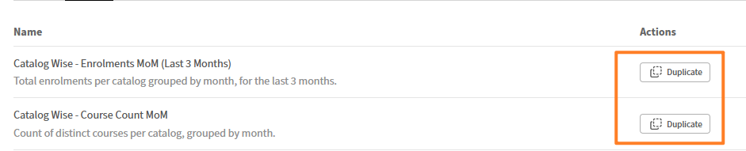

# Duplicare e riutilizzare un report nel Report Builder

Quando si duplica un report, tutte le colonne, gli alias, le impostazioni di raggruppamento, le aggregazioni, i filtri e l&#39;ordinamento vengono copiati in un nuovo report modificabile. Utilizzare questa opzione se si desidera creare una versione di un report per un catalogo, un gruppo di utenti o un periodo di tempo diverso.

## Duplicare un report

1. Aprire il report da duplicare.
2. Selezionare **Azioni** > **Duplica**. Una copia del report viene aperta in modalità di modifica con il nome &quot;\[nome report originale\]-Copia&quot;. Ad esempio, Vista strutturata delle prestazioni tra Manager - Copia
3. Inserire un nuovo nome per il rapporto.
4. Apportare modifiche, ad esempio aggiornare i filtri, regolare le colonne o modificare l&#39;ordinamento.
5. Seleziona **Salva report**.

Il report duplicato viene salvato nella scheda Report ed è indipendente dall’originale.

## Duplicare un modello

Puoi anche duplicare i modelli dalla scheda **Modelli**. La duplicazione di un modello crea un nuovo report modificabile nella scheda **Report**. Il modello originale rimane invariato.

1. Selezionare la scheda **Modelli**.
2. Individuare il modello da copiare.
3. Seleziona **Duplica**.

   

4. Immetti un nome, apporta le regolazioni e seleziona **Salva report**.

## Procedure ottimali

* Duplica un report ben testato come base quando sono necessarie variazioni per team, cataloghi o periodi di tempo diversi. Questo processo è più veloce rispetto alla costruzione da zero e garantisce una struttura coerente.
* Rinominare immediatamente la copia per riflettere ciò che la rende diversa dall&#39;originale, ad esempio &quot;Conformità da parte del VP - APAC&quot; piuttosto che &quot;Copia del report di conformità&quot;.
* Dopo aver duplicato un modello, aggiorna il nome prima di apportare altre modifiche in modo che il report sia identificabile nella scheda **Report**.
