## Generatore e-mail basato su componenti

Adobe Learning Manager include un generatore di e-mail basato su componenti che consente ad amministratori e autori di creare e-mail di livello aziendale con marchio completo utilizzando un editor visivo moderno, senza scrivere HTML. Ogni e-mail che la tua organizzazione invia, dalle conferme di iscrizione ai promemoria di sessione, può corrispondere con precisione all&#39;aspetto del tuo marchio.

**Per gli amministratori:** progettare un layout globale una volta* un&#39;intestazione e un piè di pagina riutilizzabili che racchiuda automaticamente ogni e-mail e quindi personalizzare i singoli modelli in base alle esigenze. Comporre le e-mail in un editor in linea con trascinamento della selezione utilizzando i componenti avanzati: testo con formattazione RTF completa, immagini, banner, pulsanti, collegamenti ai social media, divisori e altro ancora.

**Per gli Autori:** applica le stesse funzionalità di editor alle e-mail con ambito di validità per corsi e istanze specifici, in modo che le comunicazioni relative alla formazione possano essere personalizzate in base a ciascuna esperienza di apprendimento senza influire sulle impostazioni a livello di account.

Il generatore supporta un modello gerarchico: lo stesso modello e-mail può essere configurato a livello di istanza, corso o account. Quando un modello non è stato modificato singolarmente, eredita automaticamente le impostazioni del livello principale. Quando hai bisogno di una progettazione completamente personalizzata, scolleghi il modello e assumi il controllo completo. Un’anteprima incorporata consente di verificare esattamente come apparirà un messaggio e-mail nelle caselle di posta dei destinatari prima che venga inviato.

## Funzionamento del sistema di modelli e-mail

Ogni e-mail in uscita in Adobe Learning Manager è composta da tre parti strutturali:

* **Intestazione:** immagine o colore del banner e nome dell&#39;organizzazione
* **Corpo:** l&#39;area di contenuto dinamico univoca per ogni tipo di messaggio e-mail; contiene il testo del messaggio e i segnaposto della variabile
* **Piè di pagina:** URL dell&#39;account, firma e-mail, collegamento alla guida e altri elementi

**Layout globale** è la progettazione principale applicata contemporaneamente a tutti gli oltre 130 modelli e-mail. Quando aggiorni il layout globale, ogni modello ad esso ancora collegato riflette automaticamente la modifica. I modelli possono essere scollegati dal layout globale in qualsiasi momento per una personalizzazione indipendente.

### Gerarchia e-mail

Le impostazioni e la progettazione passano da un livello superiore a livelli inferiori attraverso l’ereditarietà. Ogni livello può sovrascrivere o personalizzare completamente ciò che eredita.

| Livello | Chi lo configura | Stato predefinito | Cosa è possibile modificare |
| --- | --- | --- | --- |
| **Layout globale** | L’Amministratore | Radice; nessun elemento padre | Layout completo: tutte le parti, tutti i componenti |
| **Modello e-mail account** | Amministrazione | Collegato a layout globale | Solo corpo (collegato); layout completo (non collegato) |
| **Autore- Layout LO** | Autore | Collegato a modello di account | Layout completo nell’ambito LO |
| **Autore- Modello e-mail LO** | Autore | Collegato a layout LO | Solo corpo (collegato); layout completo (non collegato) |
| **Autore- Modello e-mail istanza** | Autore | Collegato al modello LO | Solo corpo (collegato); layout completo (non collegato) |

### Regole di ereditarietà di base

* Ogni livello inizia a essere collegato al livello principale finché non viene modificato in modo esplicito.
* La modifica del **corpo** di un modello non scollega il modello. L’intestazione e il piè di pagina continuano a riflettere l’elemento principale.
* La modifica del **layout** o la selezione di **Scollega** interrompe la connessione padre solo per quel modello.
* **Ripristina originale** ricollega il modello alla sua pagina principale e reimposta sia il layout che il corpo alla versione principale.
* Lo scollegamento a un livello non ha alcun effetto sui livelli superiori o inferiori.

## Impostare il layout globale

Il layout globale definisce l’intestazione, il piè di pagina e il wrapper strutturale condivisi che confluiscono in ogni e-mail collegata. Per prima cosa, configura il modello in modo che tutti i modelli inizino con un branding coerente.

### Apri l’editor layout globale

1. Accedi a Adobe Learning Manager come amministratore.
2. Nella barra di navigazione a sinistra, seleziona **Modelli e-mail**.
3. Seleziona la scheda **Layout globale**.

   L&#39;area di lavoro dell&#39;editor viene caricata con il layout globale corrente. L&#39;area **Corpo dinamico**, visualizzata come segnaposto al centro, rappresenta l&#39;area in cui viene visualizzato il contenuto univoco del messaggio di ogni modello. Non potete modificare il corpo dinamico dal layout globale.

   

### Configurare il contenitore e-mail

Il contenitore e-mail è il wrapper più esterno per ogni e-mail. Le impostazioni influiscono sulla cornice visiva intorno a tutto il contenuto.

1. Seleziona **Modifica** accanto a **Layout e-mail globale**
2. Seleziona il contenitore e-mail nell’area di lavoro.
3. Nel pannello **Proprietà** a destra, imposta:
   * **Colore di sfondo:** il colore dietro a tutti i contenuti e-mail

   

   * **Bordo:** stile, larghezza e colore del bordo esterno

   

   * **Spaziatura:** spaziatura attorno alle direzioni del contenuto dell&#39;e-mail

   

   * **Spaziatura righe:** lo spazio verticale applicato tra tutte le righe nel layout

   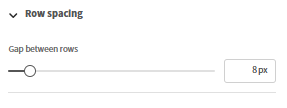

### Operazioni con righe e colonne

Tutto il contenuto nell&#39;editor e-mail si trova in **righe**. Ogni riga contiene una o più **colonne** e ogni colonna contiene uno o più **componenti**.

Per aggiungere una riga:

1. Seleziona **Riga** nella parte superiore dell&#39;area di lavoro.

   

2. Selezionare un layout di colonna: **1 colonna**, **2 colonne**, **3 colonne** o **4 colonne**.

   

   La nuova riga viene visualizzata nell&#39;area di lavoro pronta per i componenti.

Per configurare una riga:

1. Seleziona la riga nell&#39;area di lavoro.

   

2. Nel pannello **Proprietà**, impostate:
   * **Colore di sfondo:** sfondo a livello di riga, sostituisce il colore contenitore per questa riga
   * **Bordo:** stile, larghezza e colore del bordo della riga
   * **Spaziatura:** spazio orizzontale tra le colonne in questa riga

   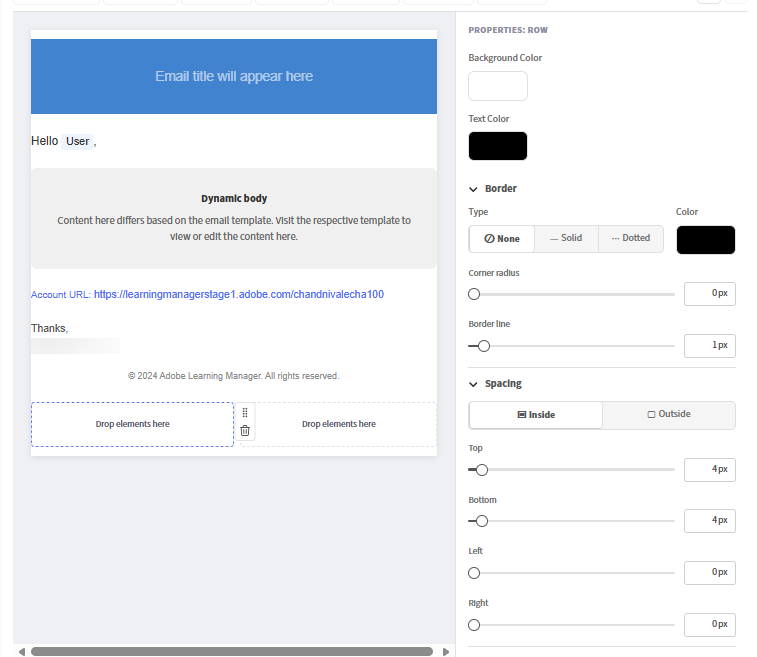

**Per riordinare le righe:**

* Trascina una riga dalla maniglia (visualizzata quando si passa il mouse sul bordo sinistro) per spostarla verso l’alto o verso il basso.

**Per eliminare una riga:**

* Seleziona la riga e fai clic sull&#39;icona **Elimina** nella barra degli strumenti della riga.

### Aggiungere e disporre i componenti

I componenti sono gli elementi costitutivi del contenuto e-mail. Trascinali dal pannello **Componenti** in alto e rilasciali in qualsiasi cella della colonna. Utilizza il pannello **Proprietà** a sinistra per personalizzare il componente selezionato.

Quando trascini un componente, un indicatore &quot;+&quot; blu indica dove può essere posizionato.

**Per aggiungere un componente:**

1. Nel pannello Componente, individuate il componente desiderato.

   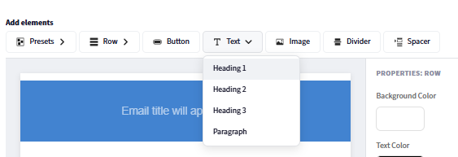

2. Trascinatela in una cella di colonna sull’area di lavoro.

   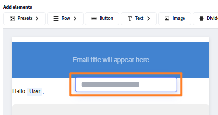

3. Il componente viene aggiunto alla cella. Selezionalo per aprirne le proprietà nel pannello a destra.

   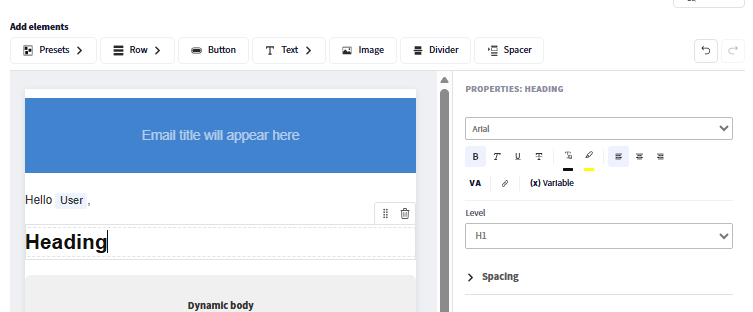

**Per spostare un componente:**

* Trascinare il componente dalla maniglia in una posizione di colonna o riga diversa.

**Per eliminare un componente:**

* Seleziona il componente e fai clic sull&#39;icona **Elimina** nella barra degli strumenti del componente.

### Modificare i componenti predefiniti

Il **layout globale** include componenti predefiniti incorporati che corrispondono ai campi condivisi configurati nelle impostazioni e-mail. I componenti predefiniti possono essere modificati direttamente nell’area di lavoro o rimossi completamente.

| Componente predefinito | Contenuto predefinito | Può essere rimosso? |
| --- | --- | --- |
| **Banner** | Immagine o colore predefinito del banner | Sì |
| **Formula di apertura** | &quot;Ciao {{user}},&quot; | Sì |
| **Corpo dinamico** | Segnaposto per il contenuto per modello | No- obbligatorio |
| **URL account** | URL della piattaforma dell&#39;account | Sì |
| **Firma** | Il testo della firma configurato | Sì |

**Per modificare un componente predefinito:**

1. Aggiungi il componente predefinito, ad esempio, banner.

   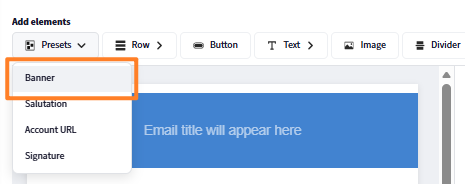

2. Seleziona il banner sull&#39;area di lavoro.
3. Nel pannello **Proprietà**, modificate il font, la dimensione del font e altre proprietà visive del banner.

   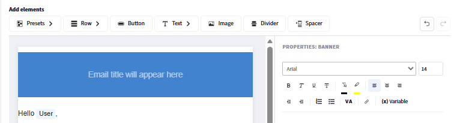

**Per rimuovere un componente predefinito da tutte le e-mail:**

1. Selezionate il componente predefinito nell’area di lavoro.
2. Seleziona **Elimina** nella barra degli strumenti del componente.

La rimozione di un componente predefinito dal layout globale lo rimuove da ogni e-mail collegata. Le maschere non collegate conservano il componente finché non lo rimuovete manualmente da ciascuna di esse.

### Salvare il layout globale

Seleziona **Salva** al termine del layout. Il design aggiornato viene immediatamente applicato a tutti i modelli e-mail che sono ancora collegati al layout globale.

## Configurare i predefiniti e-mail globali

Definisci elementi comuni come banner, formula di saluto e firma da riutilizzare nelle e-mail. Possono essere utilizzati nel layout globale o in singoli modelli e-mail basati su eventi all&#39;interno di Adobe Learning Manager. Le modifiche apportate vengono applicate automaticamente a tutti i predefiniti utilizzati. Puoi anche scegliere di ignorare questi predefiniti e progettare elementi personalizzati direttamente nel generatore di e-mail.

Configura quanto segue:

### Banner e-mail

1. Seleziona **Modifica** accanto a **Banner e-mail.**
2. Carica un&#39;immagine banner o imposta un colore di sfondo in tinta unita.

   

3. Seleziona **Salva.**

### Saluto tramite e-mail

1. Seleziona **Modifica** accanto a **Formula di apertura**
2. L&#39;impostazione predefinita è &quot;Ciao {{user}}&quot;, la variabile {{user}} viene compilata con il nome del destinatario in fase di runtime.

   

3. Modificare il testo di apertura o rimuovere completamente la formula di apertura.
4. Seleziona **Salva**.

### URL account

1. Seleziona **Modifica** accanto a **URL account.**
2. Immetti l’URL della piattaforma di apprendimento; viene visualizzato in tutte le e-mail in uscita.

   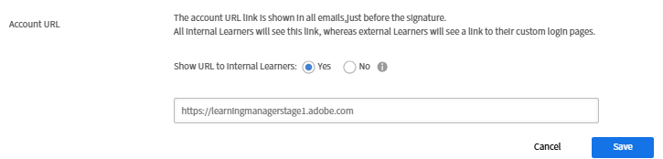

3. Seleziona **Salva**.

### Firma e-mail

1. Seleziona **Modifica** accanto a **Firma e-mail**
2. Immettere il testo di chiusura.

   

3. Seleziona **Salva**.

## Aggiunta e configurazione di singoli componenti

### Componente di testo

Il componente di testo supporta la modifica full-text.

1. Trascinare un componente **Testo** in una cella di colonna.
2. Selezionatelo per attivare la modalità di modifica.

   

3. Digitate o incollate il contenuto.
4. Applicate le seguenti opzioni di formattazione:
   * **Font:** seleziona tra i font sicuri per il Web (Arial, Helvetica, Georgia e altri) o i font personalizzati configurati per il tuo account
   * **Dimensione:** dimensione font in punti
   * **Grassetto**, **Corsivo**, **Sottolineato**, **Barrato**
   * **Apice** e **Pedice**
   * **Colore testo** e **Colore sfondo** (evidenziazione testo)
   * **Allineamento:** a sinistra, al centro, a destra o giustificato
   * **Interlinea:** moltiplicatore altezza riga
   * **Spaziatura interna orizzontale e verticale:** spaziatura interna all&#39;interno del blocco di testo
5. Per aggiungere un collegamento ipertestuale:
   * Selezionare il testo da collegare
   * Seleziona l&#39;icona **Link** nella barra degli strumenti
   * Immetti l’URL di destinazione

   

6. Seleziona **Applica**

### Componente immagine

1. Trascinare un componente **Immagine** in una cella di colonna.
2. Seleziona **Carica** per caricare un nuovo file di immagine (supportati JPEG e GIF) oppure seleziona **Sfoglia** per scegliere dalla libreria di immagini.
3. Con l’immagine selezionata, configura:

   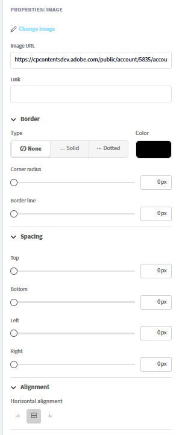

   * **Cambia immagine:** Caricare una nuova immagine o sostituire l&#39;immagine attualmente selezionata.
   * **URL immagine:** Specifica l&#39;URL di origine dell&#39;immagine da visualizzare. L&#39;immagine viene caricata da questa posizione.
   * **Collegamento:** aggiunge un collegamento ipertestuale selezionabile all&#39;immagine. Quando si fa clic sull’immagine, gli utenti vengono reindirizzati all’URL specificato.
   * **Tipo bordo:** Definisce lo stile del bordo dell&#39;immagine. Le opzioni disponibili sono Nessuno, Solido e Punteggiato.
   * **Colore bordo:** imposta il colore del bordo dell&#39;immagine quando viene applicato uno stile di bordo.
   * **Raggio angolo:** controlla la rotondità degli angoli dell&#39;immagine. Valori più alti creano angoli più arrotondati.
   * **Linea del bordo:** regola lo spessore (larghezza) del bordo dell&#39;immagine.
   * **Spaziatura superiore:** aggiunge spazio sopra l&#39;immagine.
   * **Spaziatura inferiore:** aggiunge spazio sotto l&#39;immagine.
   * **Spaziatura sinistra:** aggiunge spazio sul lato sinistro dell&#39;immagine.
   * **Spaziatura destra:** aggiunge spazio sul lato destro dell&#39;immagine.
   * **Allineamento orizzontale:** determina la posizione dell&#39;immagine all&#39;interno del relativo contenitore. Le opzioni includono in genere l’allineamento a sinistra, al centro e a destra.

### Componente pulsante

1. Trascinare un componente **Button** in una cella di colonna.
2. Selezionalo e configura:

   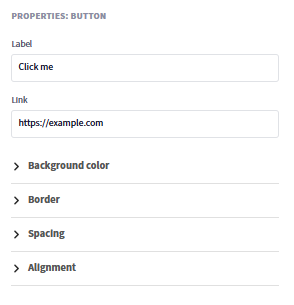

   * **Etichetta:** il testo del pulsante
   * **Collegamento:** URL di destinazione quando si fa clic sul pulsante
   * **Font:** famiglia di font e dimensione per l&#39;etichetta del pulsante
   * **Colore testo:** colore etichetta
   * **Colore di sfondo:** colore di riempimento pulsante
   * **Dimensioni:** larghezza e altezza del pulsante
   * **Stile angolo:** arrotondato, quadrato o circolare
   * **Allineamento:** a sinistra, al centro o a destra nella colonna
   * **Spaziatura interna:** tra il testo dell&#39;etichetta e i bordi del pulsante

### Componenti divisore e distanziatore

**Divisore:** aggiunge una linea orizzontale visibile tra le sezioni di contenuto.

1. Trascinate un componente **Divisore** in una colonna.
2. Impostate **Stile linea** (continua, tratteggiata e punteggiata), **Colore**, **Larghezza** e **Altezza** (spazio verticale sopra e sotto la linea) nel pannello Proprietà.

   **Spaziatura:** aggiunge uno spazio verticale invisibile tra gli elementi senza una linea visibile.

3. Trascinate un componente **Spaziatore** e impostatene **Altezza** nel pannello Proprietà.

## Inserire e gestire le variabili

Le variabili sono segnaposto dinamici sostituiti da dati reali quando viene inviato un messaggio e-mail. Le variabili disponibili dipendono dal tipo di modello specifico. L’e-mail di conferma dell’iscrizione contiene variabili diverse da un promemoria della sessione.

### Inserire una variabile mediante il selettore

1. Posizionare il cursore in un componente di testo nel punto in cui si desidera inserire la variabile.
2. Selezionare **Inserisci variabile** nella barra degli strumenti dell&#39;editor di testo. Il selettore di variabili si apre mostrando tutte le variabili disponibili per questo tipo di modello.
3. Selezionate una variabile. Ad esempio, **Nome corso**, **Nome Allievo** o **Nome percorso di apprendimento**.

   

### Inserire una variabile digitando

Digita il nome della variabile circondato direttamente da doppie parentesi graffe: {\{variable_name}\}. L’editor la riconosce ed evidenzia automaticamente come token variabile.

**Esempi di variabili comuni:**

| Variabile | Sostituito con |
| --- | --- |
| Nome e cognome del destinatario | {\{learnerName}\} |
| E-mail del destinatario | {\{learnerEmail}\} |
| Nome utente del destinatario | {\{user}\} |
| Tipo utente | {\{userType}\} |
| Nome organizzazione | {\{organizationName}\} |
| Nome del corso | {\{courseName}\} |
| Descrizione del corso | {\{courseDescription}\} |
| Autore del corso | {\{courseAuthor}\} |
| Collegamento al corso | {\{courseLink}\} |
| Abilità necessarie per il corso | {\{courseSkillDetails}\} |
| Distintivi nel corso | {\{courseBadge}\} |
| Scadenza per l’iscrizione al corso | {\{courseEnrollmentDeadline}\} |
| Scadenza per il completamento del corso | {\{courseCompletionDeadline}\} |
| Data di completamento del corso | {\{courseCompletionDate}\} |
| Nome del percorso di apprendimento | {\{LPName}\} |
| Collegamento al percorso di apprendimento | {\{LPLink}\} |
| Scadenza per l’iscrizione al percorso di apprendimento | {\{LPEnrollmentDeadline}\} |
| Scadenza per il completamento del percorso di apprendimento | {\{LPCompletionDeadline}\} |
| Data di completamento del percorso di apprendimento | {\{LPCompletionDate}\} |
| Nome certificazione | {\{certificationName}\} |
| Scadenza per l’iscrizione alla certificazione | {\{certificationEnrollmentDeadline}\} |
| Data di completamento della certificazione | {\{certificationCompletionDate}\} |
| Durata della scadenza del corso | {\{deadlineDuration}\} |
| Durata di scadenza del corso | {\{expiryDuration}\} |
| Data di scadenza del corso | \{\{expiryDate\}\} |
| Nome sessione | \{\{sessionName\}\} |
| Data di inizio della sessione | \{\{sessionDate\}\} |
| Data di fine sessione | \{\{endSessionDate\}\} |
| Ora di inizio della sessione | \{\{sessionTime\}\} |
| Ora di fine sessione | \{\{endSessionTime\}\} |
| Nome sede | \{\{locationName\}\} |
| Informazioni sul luogo | \{\{locationInfo\}\} |
| URL sede | \{\{locationURL\}\} |
| Area evento | \{\{locationRegion\}\} |
| URL aula virtuale | \{\{vcUrl\}\} |
| È richiesto un account fornitore aula virtuale | \{\{VCProviderAccountReq\}\} |
| Nome Istruttore | \{\{instructorName\}\} |
| Nome modulo | \{\{moduleName\}\} |
| Nome dell’oggetto di apprendimento | \{\{learningObjectName\}\} |
| Data di completamento dell’oggetto di apprendimento | \{\{loCompletionDate\}\} |
| Nomi di oggetti di apprendimento alternativi | \{\{alternateLoNameList\}\} |
| Collegamenti a oggetti di apprendimento alternativi | \{\{alternateLoNameListLinks\}\} |
| Oggetto di apprendimento alternativo rimosso | \{\{removedAlternateLo\}\} |
| Testo prerequisito | \{\{preRichiediTesto\}\} |
| Conteggio prerequisiti | \{\{preRequisiteCountText\}\} |
| Nome CI | \{\{ciName\}\} |
| Nome dashboard report | \{\{reportDashboardName\}\} |
| Nome risorsa formativa | \{\{jobAidName\}\} |
| Contenuto dell’annuncio | \{\{announmentContentText\}\} |
| Nome profilo | \{\{profileName\}\} |
| Posti limitati per il corso | \{\{seatLimit\}\} |
| Collegamento alla home page del documento della Guida | \{\{captivatePrimeHelp\}\} |
| Collegamento alla pagina della Guida | \{\{helpPageLink\}\} |
| Conteggio | \{\{count\}\} |

>[!NOTE]
>
>Le variabili sono specifiche del modello. Non tutte le variabili sono disponibili in ogni modello. Utilizza il selettore **Inserisci variabile** per visualizzare solo le variabili applicabili al modello che stai modificando. Se si digita un nome di variabile non riconosciuto tra parentesi graffe, l’editor non genera errori, ma il nome apparirà come testo letterale nell’e-mail inviata.

### Variabili nel banner

1. Anche la riga dell&#39;oggetto dell&#39;e-mail supporta le variabili. Per aggiungere una variabile al soggetto:
2. Apri un modello e individua il campo **Oggetto e-mail**.
3. Digitate direttamente la variabile. Ad esempio, &quot;La tua iscrizione a {\{course_name}\} è confermata&quot;. La variabile viene renderizzata con il nome effettivo del corso quando viene inviato il messaggio e-mail.
4. In alternativa, seleziona **Aggiungi variabile**, quindi seleziona **Corso**.

   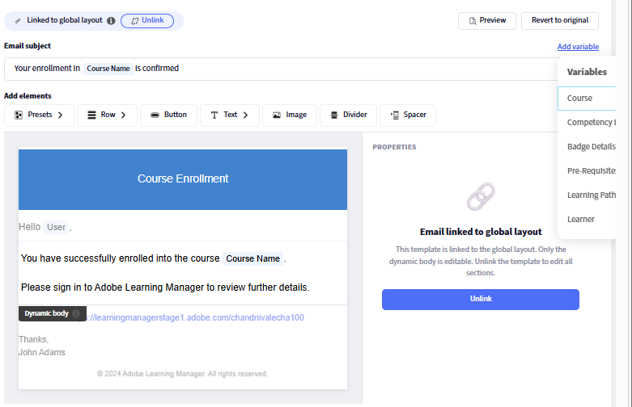

### Variabili e layout globale

Le variabili nel layout globale sono indipendenti dal modello e vengono risolte in modo diverso a seconda del contesto. Utilizza nel layout globale solo variabili universalmente applicabili, ad esempio {\{user}\} e {\{account_url}\}. Le variabili specifiche del modello (ad esempio {\{course_name}\}) devono essere posizionate nei singoli corpi del modello e non nel layout globale.

## Collegare e scollegare i modelli

### Stato collegato e non collegato

Ogni modello è **collegato** all&#39;elemento padre o **non collegato** e completamente indipendente.

**Quando collegato:**

* L&#39;intestazione e il piè di pagina vengono visualizzati **in grigio** nell&#39;editor. Indicatore visivo che indica che il modello è collegato

* È modificabile solo il corpo.
* Modifiche automatiche al flusso di layout principale in questo modello

**Se non collegato:**

* Intestazione e piè di pagina completamente modificabili. Nessuna zona disattivata
* Il modello è completamente indipendente e le modifiche apportate all&#39;elemento padre non hanno alcun effetto su di esso
* Il modello inizia dalla struttura del padre al momento dello scollegamento

**Regola chiave:** La modifica del **corpo** non scollega mai un modello. La modifica del **layout** o la selezione esplicita di **Scollega** interrompe la connessione padre.

### Quando collegarsi (rimani collegato)

* Desideri che il branding globale continui a fluire automaticamente
* È sufficiente modificare il testo del messaggio o le variabili in questo modello
* Stai gestendo una vasta libreria di modelli e desideri un controllo centralizzato del marchio

### Quando scollegare

* È necessario un banner, una combinazione di colori o un layout strutturale diverso per un modello specifico
* Stai creando un’esperienza con marchio distinta per un corso, una certificazione o un pubblico specifico
* Sei un autore che desidera il controllo completo della progettazione per un oggetto di apprendimento o un’istanza

### Scollegare un modello a livello di account - Amministratore

1. Seleziona **Modelli e-mail** e apri un modello. Ad esempio, Corso - Iscrizione autonoma.
2. Seleziona **Scollega**.

   

3. Leggi il messaggio di conferma e seleziona **Sì**.
4. Intestazione e piè di pagina diventano completamente modificabili.
5. Personalizza una parte qualsiasi del modello.
6. Seleziona **Salva**.

Il modello mantiene il layout della principale come punto di partenza ma non riceve più gli aggiornamenti futuri della principale.

### Ripristinare la versione principale di un modello

Ripristina originale ricollega il modello e lo reimposta esattamente a ciò che fornisce la principale.

* Se il modello è stato **solo modificato nel corpo** (ancora collegato): ripristina il corpo del messaggio all&#39;impostazione predefinita dell&#39;elemento padre. Intestazione e piè di pagina non modificati perché provengono già dall&#39;elemento padre.
* Se il modello è stato **completamente scollegato**: sostituisce tutto, intestazione, corpo e piè di pagina con la versione principale. Tutte le personalizzazioni indipendenti vengono rimosse definitivamente.

>[!CAUTION]
>
>Il ripristino dell&#39;originale non può essere annullato. Copiate eventuali contenuti da mantenere prima di eseguire il ripristino.

**Per ripristinare:**

1. Apri il modello nell’editor.
2. Selezionare **Ripristina originale**.

   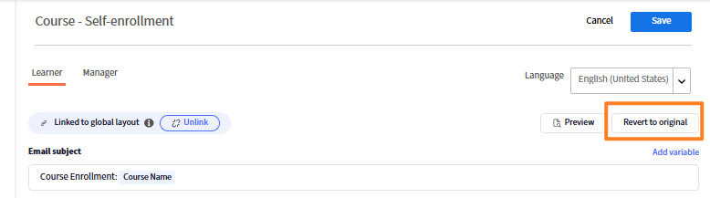

### Scollegare un modello a livello di istanza - Autore

1. Apri un corso e seleziona **Modelli e-mail**.
2. Apri un modello, ad esempio Completamento del corso.
3. Seleziona **Scollega** e conferma.
4. Apporta le modifiche e seleziona **Salva**.

Questa operazione ha effetto solo su questa istanza. Le altre istanze non sono interessate. Il modello di istanza inizia dalla struttura del modello di livello LO al momento dello scollegamento, non dal layout globale.

I modelli per amministratori tornano alla versione del layout globale e si ricollegano al layout globale. I modelli degli oggetti di apprendimento dell’autore tornano alla versione del modello per account amministratore. I modelli di istanza dell’Autore tornano alla versione del modello LO (o al modello dell’account se il modello LO è collegato).

## Personalizzare un singolo modello

### Passare a un modello

1. In **Modelli e-mail**, selezionare una categoria dall&#39;elenco. Ad esempio, **Generali**, **Attività di apprendimento** o **Promemoria e aggiornamenti**.
2. Trovare il modello in base al nome. I modelli sono elencati con il relativo evento di attivazione e lo stato di attivazione/disattivazione corrente.
3. Seleziona il nome del modello per aprirlo nell’editor.

### Modificare il corpo (modello collegato)

Quando un modello è collegato, è modificabile solo il corpo. Intestazione e piè di pagina visualizzati in grigio.

1. Apri il modello. Confermare che l&#39;intestazione e il piè di pagina siano disattivati (stato collegato).
2. Seleziona un punto qualsiasi nel corpo per attivare la modalità di modifica.
3. Consente di modificare il testo del messaggio, la formattazione, le variabili e qualsiasi componente nel corpo.
4. Seleziona **Salva**.

### Modificare un modello completamente personalizzato (non collegato)

Dopo lo scollegamento, tutte e tre le parti, intestazione, corpo e piè di pagina, possono essere modificate mediante lo stesso editor di trascinamento del layout globale.

1. Aggiungere, rimuovere o ridisporre righe e componenti in qualsiasi parte.
2. Modifica i componenti predefiniti (banner, formula di saluto, firma, URL account) in modo indipendente.
3. Inserire variabili specifiche per questo tipo di modello.
4. Seleziona **Salva**.

### Modificare i modelli in più lingue

Ogni modello supporta tutte le lingue dei contenuti configurate per il tuo account.

1. Apri il modello.
2. Seleziona il menu a discesa **Lingua**. Vengono visualizzate tutte le lingue disponibili per l’account.
3. Seleziona la lingua da modificare.
4. Modifica il corpo (e il layout, se non è collegato) della lingua.
5. Seleziona **Salva**.

Ciascuna versione in una lingua viene memorizzata in modo indipendente. La modifica di una lingua non influisce sugli altri. Se una versione della lingua non è stata personalizzata, gli allievi ricevono il contenuto predefinito per tale lingua.

>[!NOTE]
>
>Se un modello non è collegato e si modifica il layout in una lingua, la modifica del layout si applica solo a tale versione della lingua. Le altre versioni linguistiche conservano i propri stati.

### Anteprima nell&#39;editor (controllo visivo)

1. Seleziona **Anteprima** nella barra degli strumenti dell&#39;editor.
2. Si apre una finestra di dialogo per l’anteprima in cui viene mostrato l’indirizzo e-mail che apparirà ai destinatari.
3. Rivedi layout, spaziatura, immagini e token segnaposto variabili.
4. Chiudete l’anteprima per continuare la modifica.

## Compatibilità con le versioni precedenti

### Account esistenti

Tutti i modelli e-mail configurati in precedenza vengono conservati esattamente come erano. Il nuovo generatore è disponibile insieme all’editor esistente. I modelli configurati prima dell’aggiornamento non vengono migrati automaticamente al nuovo formato. Continuano a funzionare come prima.

### Nuovi account

Inizia con il nuovo generatore e un layout globale predefinito pulito. Il layout predefinito utilizza un design semplificato che evita i problemi di rendering noti (ad esempio, gli errori di visualizzazione delle immagini del banner) presenti nelle configurazioni precedenti.

Se il tuo account dispone sia di modelli vecchio formato che di nuovo formato, i due coesistono senza conflitti. Puoi migrare i singoli modelli nel nuovo formato secondo i tuoi ritmi, aprendoli nel nuovo editor e salvandoli.

## Risoluzione dei problemi relativi ai modelli e-mail

**Le modifiche al layout globale non vengono visualizzate in un modello**

Il modello è stato scollegato. Per confermare e correggere:

1. Apri il modello.
2. Se l&#39;intestazione e il piè di pagina sono **modificabili** (non disattivati), il modello non è collegato.
3. Per ripristinare l&#39;ereditarietà del layout globale, selezionare **Ripristina originale** e confermare.

**Un modello è diverso dal layout globale**

Stessa causa di cui sopra. Il modello è stato scollegato intenzionalmente o a causa di una precedente modifica del layout. Ripristinate l&#39;originale per ricollegarlo.

**Le variabili vengono visualizzate come testo letterale nelle e-mail inviate**

Il nome della variabile non è scritto correttamente o non è disponibile per questo tipo di modello.

1. Aprire il modello e individuare la variabile.
2. Eliminalo e reinseriscilo utilizzando il selettore **Inserisci variabile**.
3. Il selettore mostra solo le variabili valide per questo modello. Selezionate un’opzione dall’elenco per evitare errori di battitura.
