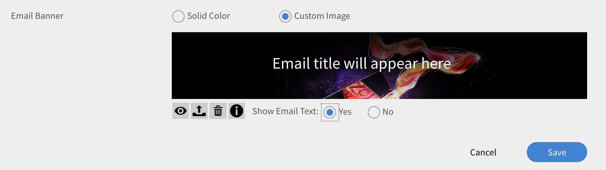

# Modelli e-mail

Gli eventi nell’attività di formazione attivano le e-mail inviate agli Allievi. In qualità di Amministratore puoi facilmente abilitare, disabilitare o modificare questi modelli e-mail.

L’applicazione Learning Manager invia notifiche e-mail a più ruoli di utenti in base agli eventi.

In qualità di Amministratore, puoi personalizzare i modelli e-mail aggiungendo o modificando il contenuto e inviando notifiche agli utenti per vari eventi attivati da Allievi, Manager e Autori.

Gli amministratori possono anche scegliere di non inviare notifiche e-mail per determinati eventi.

## Configurare i modelli e-mail {#configureemailtemplates}

In qualità di Amministratore puoi facilmente abilitare, disabilitare o modificare questi modelli e-mail.

1. Per accedere ai modelli, fai clic su **[!UICONTROL Modelli e-mail]** nel riquadro sinistro. In questa pagina sono disponibili tre diverse categorie di modelli: **[!UICONTROL Generale]**, **[!UICONTROL Attività di apprendimento]** e **[!UICONTROL Promemoria e aggiornamenti]**. C&#39;è una quarta scheda, **[!UICONTROL Impostazioni]**, in cui è possibile configurare i modelli.

   

   *Seleziona la scheda Generale.*

1. Per visualizzare l’elenco dei modelli e-mail, fai clic su una scheda qualsiasi.

   

   *Visualizzare l’elenco dei modelli e-mail*

   Per attivare o disattivare facilmente questi avvisi e-mail, fai clic sul pulsante di attivazione/disattivazione.

1. Per modificare il contenuto del modello, fai clic sul nome del modello. Qui puoi vedere che per diversi tipi di utenti hai diversi modelli.

   

   *Visualizzare il modello di un’e-mail*

1. Per modificare il contenuto di questo modello e-mail, fai clic sul corpo dell&#39;e-mail. Apporta ora le modifiche al modello. Puoi modificare il testo e utilizzare una di queste variabili anche nel tuo indirizzo e-mail. Le modifiche apportate alla sezione corpo possono essere applicate solo a questo modello e-mail. Tuttavia, se apporti modifiche alla firma di questo messaggio e-mail, è possibile applicarla globalmente a tutti i modelli.

   Passate il mouse sopra ogni icona per visualizzarne i nomi.

   

   *Modificare il modello e-mail*

   È possibile ripristinare il contenuto predefinito del messaggio facendo clic sul collegamento **[!UICONTROL Ripristina originale]** sopra il modello.

1. Per confermare le modifiche applicate al modello, fare clic su Salva. Ora gli utenti possono ricevere notifiche e-mail utilizzando il modello e-mail modificato.

## Personalizzare le impostazioni di un modello e-mail {#customizesettingsofanemailtemplate}

1. Per aprire la pagina delle impostazioni, fare clic su **[!UICONTROL Impostazioni]**. Ora puoi personalizzare i modelli e-mail.
1. Per personalizzare il nome e l’ID e-mail da cui gli Allievi ricevono le e-mail, modifica il **[!UICONTROL Nome e indirizzo mittente].**

   Contatto [***Supporto Adobe***](https://helpx.adobe.com/contact/enterprise-support.other.html#learning-manager) per configurare o modificare questi dettagli.

1. Personalizza il tuo banner e-mail dal **[!UICONTROL Banner e-mail]** opzione. Cambia il colore del banner selezionando **[!UICONTROL Sfondo banner]**.

   Puoi utilizzare un’immagine personalizzata come banner selezionando la **[!UICONTROL Immagine personalizzata]** opzione. Fai clic **[!UICONTROL Salva]** dopo aver apportato le modifiche.

    

   *Personalizzare l’immagine di un banner*

   Le dimensioni dell’immagine personalizzata devono essere 1240x200 px e supportare .jpg, .jpeg e .png.

1. Modifica la firma e-mail facendo clic su **[!UICONTROL Modifica]**. Apporta le modifiche necessarie e salvale.

   

   *Personalizzare la firma e-mail*

1. Modifica l’URL del tuo account facendo clic su Modifica nell’opzione **[!UICONTROL URL account]**.

   Il collegamento all’URL dell’account viene visualizzato in tutte le e-mail, subito prima della firma. Immetti l’URL richiesto e fai clic su **[!UICONTROL Salva]**. Tieni presente che questo URL è visibile solo agli utenti interni.

   

   *Personalizzare l’URL dell’account*

1. Configura se i Manager devono ricevere anche e-mail inviate ai loro subordinati utilizzando la casella di controllo **[!UICONTROL E-mail Manager opzionale]** opzione.

## Impostare la frequenza delle e-mail di riepilogo {#setfrequencyofdigestemails}

Nella **[!UICONTROL Modelli e-mail]** > **[!UICONTROL Impostazioni]** , l’Amministratore può modificare la frequenza delle e-mail di riepilogo da inviare agli Allievi.

Nella **[!UICONTROL Impostazioni e-mail di riepilogo]** , fare clic su **[!UICONTROL Modifica]**.

Nel menu a discesa, scegli **[!UICONTROL Bi-settimanale]** oppure **[!UICONTROL Mensile]**.

* **[!UICONTROL Bi-settimanale]:** Se si imposta la frequenza su **[!UICONTROL Bi-settimanale]**, gli allievi ricevono l’e-mail una volta ogni due settimane.

* **[!UICONTROL Mensile]:** Se si imposta la frequenza su **[!UICONTROL Mensile]**, gli allievi ricevono l’e-mail una volta al mese.

*Impostare la frequenza delle e-mail di riepilogo*

Quando attivi questa opzione, la frequenza viene impostata su **[!UICONTROL Bi-settimanale]** per gli account attivi nuovi/esistenti per impostazione predefinita.

### Elenco DND di Allievi

Gli Allievi in un elenco DND non possono visualizzare le impostazioni utente per le e-mail di riepilogo. L’opzione rimarrà disattivata e gli allievi non riceveranno alcuna e-mail.

## E-mail di riepilogo di esempio per gli Allievi {#digest-email}

Gli esempi seguenti rappresentano l’e-mail ricevuta da un Allievo.

*E-mail di esempio*

### Attività di formazione

*E-mail dell’attività di formazione*

### Corsi di formazione consigliati

*E-mail dei corsi di formazione consigliati*

### Classifica

*E-mail della classifica*

### Post più recenti

*E-mail dei post più recenti*

### Scarica report di accesso e-mail

Per scaricare il report sull’accesso alle e-mail, fai clic sul pulsante **[!UICONTROL Scarica]** pulsante. Questo report contiene il numero di utenti che hanno ricevuto l&#39;e-mail e il numero di utenti che hanno aperto e cliccato sui collegamenti.

## Personalizzare il dominio e-mail {#customizeemaildomain}

Per personalizzare il dominio e l’ID e-mail da cui gli Allievi ricevono le notifiche, contatta il [***Supporto di Learning Manager***](https://helpx.adobe.com/contact/enterprise-support.other.html#learning-manager) e fornisci i dettagli del dominio che desideri aggiungere e il tuo nuovo id e-mail.

La tua richiesta verrà elaborata e riceverai un’e-mail con il link di conferma al nuovo indirizzo e-mail specificato. Fai clic sul collegamento di verifica fornito nell&#39;e-mail per confermare e completare il processo di verifica.

## Configurazione dell’e-mail Non disturbare {#dnd}

In qualità di Amministratore, puoi selezionare gli utenti che possono ricevere e-mail da Learning Manager.

È possibile eseguire questa operazione utilizzando **[!UICONTROL Non disturbare]** opzione sotto il **[!UICONTROL Impostazioni]** scheda. Gli utenti possono essere aggiunti a questo elenco utilizzando il nome, l’ID e-mail o l’ID utente univoco.

Cerca un utente da aggiungere all&#39;elenco.

<!---->

## E-mail bloccate {#blockedemails}

Dal menu **E-mail bloccate** elenco a discesa per ogni utente per selezionare i tipi di e-mail da bloccare.

<!---->

Le opzioni disponibili sono le seguenti:

* **E-mail diretta all’Allievo:** Questa opzione limita o consente l’invio di e-mail all’Allievo.
* **Inoltro delle e-mail di escalation al Manager dell’Allievo:** Questa opzione limita o consente l’invio di e-mail al Manager dell’Allievo.
* **Informazioni sui report diretti:** Questa opzione limita o consente l’invio di e-mail di escalation in arrivo agli utenti in merito ai report diretti.
* **Informazioni sui report salta livello:** Questa opzione limita o consente l’invio di e-mail di escalation in arrivo agli utenti in merito ai report di secondo livello.

Se desideri eliminare un utente dall’elenco, puoi utilizzare l’opzione di eliminazione disponibile singolarmente per ogni utente nella scheda utente.

Puoi aggiungere utenti all’elenco DND utilizzando i file CSV. Includi valori True/False/Blank per ciascuna delle seguenti colonne:

* Blocca e-mail dirette
* Bloccare le escalation utente
* Blocca escalation dirette in arrivo
* Blocca escalation salta in arrivo

Immetti true nel campo value (valore) per impedire agli utenti di ricevere e-mail per l’opzione selezionata. Se il valore immesso è false, gli utenti bloccati vengono sbloccati. Se la colonna viene lasciata vuota, non vengono apportate modifiche alle selezioni precedenti.

## Flessibilità nella personalizzazione dei modelli

I modelli e-mail in Learning Manager ora includono sezioni completamente modificabili, offrendo maggiore flessibilità per personalizzare le comunicazioni e-mail in base alle preferenze di messaggistica e branding.

I miglioramenti principali apportati alla personalizzazione dei modelli e-mail includono:

### Personalizza la formula di apertura dei messaggi e-mail a livello di account

Seleziona **[!UICONTROL Modelli e-mail]** > **[!UICONTROL Impostazioni]**. Seleziona **[!UICONTROL Modifica]** nella **[!UICONTROL Saluto tramite e-mail]** sezione.

*Personalizza formula di apertura tramite e-mail*

Puoi anche personalizzare quanto segue:

* Banner e firma con e-mail sia a livello di corso che di istanza.
* Modifica il piè di pagina dell’e-mail. L’area del piè di pagina contiene variabili predefinite per l’URL dell’account, la Firma e qualsiasi testo in formato libero aggiunto dall’utente.

I modelli supportano inoltre funzionalità di modifica avanzate, che consentono di mantenere la formattazione quando il contenuto viene copiato e incollato da e verso Microsoft Word.

## Inviti in linea {#inlineinvitations}

Gli utenti di Learning Manager ora riceveranno inviti e-mail in linea. Gli allegati ICS non vengono più utilizzati per inviare inviti. Eventuali modifiche apportate all’invito si rifletteranno automaticamente nel calendario.

<!---->

## Domande frequenti {#frequentlyaskedquestions}

+++Come si disattiva la Guida nei modelli e-mail?

Al momento, in Learning Manager non è possibile disattivare **Aiuto** nei modelli e-mail.

+++

+++Come modificare i modelli e-mail?

1. Accedi al tuo account Learning Manager come Amministratore.
1. Nel pannello a sinistra, fai clic su **[!UICONTROL Modelli e-mail]** e selezionare il modello di posta elettronica da modificare.
1. Per personalizzare ogni modello, fai clic sul testo nel corpo del modello. È possibile inserire variabili nel testo facendo clic sulle icone appropriate come mostrato nell&#39;istantanea. Passa il mouse su ogni icona per visualizzare i nomi e applicarli al modello.
1. Dopo aver apportato le modifiche al modello, fai clic su **[!UICONTROL Salva]**.

+++

+++Come creare modelli di posta elettronica personalizzati?

Al momento non è possibile creare modelli e-mail personalizzati. Tuttavia, è possibile modificare i modelli esistenti.

+++

+++Come si disattivano i modelli e-mail?

Per disattivare il modello di posta elettronica, selezionare il modello che deve essere disattivato e fare clic sul pulsante di attivazione circolare Sì/No.

+++

+++Come si modificano il nome e l’indirizzo del mittente nel modello?

Per modificare il nome e l&#39;indirizzo di posta elettronica del mittente, contattare [Adobe del supporto di Learning Manager](https://helpx.adobe.com/contact/enterprise-support.other.html#learning-manager).

+++
