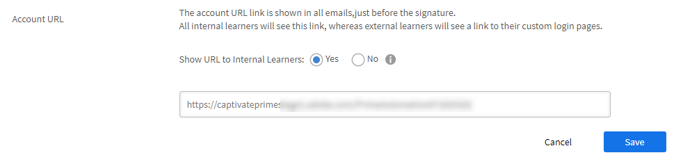
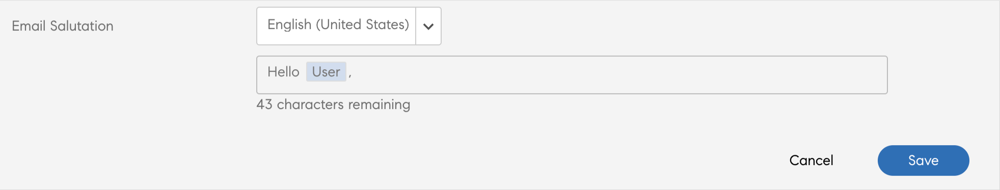

# Modelli e-mail

Gli eventi nell’attività di apprendimento attivano le e-mail inviate agli Allievi. Gli Amministratori possono facilmente attivare, disattivare o modificare questi modelli e-mail.

L’applicazione Learning Manager invia notifiche via e-mail a più ruoli di utenti in base agli eventi.

In qualità di Amministratore puoi personalizzare i modelli e-mail aggiungendo o modificando il contenuto e inviando notifiche agli utenti per vari eventi attivati da Allievi, Manager e Autori.

Gli Amministratori possono anche scegliere di non inviare notifiche via e-mail per determinati eventi.

## Introduzione ai modelli e-mail

In questo corso imparerai come personalizzare i singoli modelli e-mail e come personalizzare le impostazioni a livello di corso e account per i modelli e-mail.

<!--In this training, you will learn how to create a user group by names, email IDs, and combining multiple auto-generated user groups.-->

Se non è possibile avviare il corso di formazione, scrivere a <almacademy@adobe.com>.

## Configurazione dei modelli e-mail {#configureemailtemplates}

Gli Amministratori possono facilmente attivare, disattivare o modificare questi modelli e-mail.

1. Per accedere ai modelli, fai clic su **[!UICONTROL Modelli e-mail]** nel riquadro a sinistra. In questa pagina sono disponibili tre diverse categorie di modelli: **[!UICONTROL Generali]**, **[!UICONTROL Attività di apprendimento]** e **[!UICONTROL Promemoria e aggiornamenti]**. La quarta scheda, **[!UICONTROL Impostazioni]**, consente di configurare i modelli.

   

   *Selezionare la scheda Generale*

2. Per abilitare o disabilitare in blocco i modelli e-mail per un determinato ruolo, seleziona i puntini di sospensione (...) nell&#39;intestazione della colonna e abilita tutti i ruoli applicabili in **[!UICONTROL Destinatari e-mail]**.

   
   _Invia tutti i modelli e-mail a livello di ruolo_

3. Per abilitare o disabilitare un modello e-mail specifico per un ruolo, seleziona i puntini di sospensione (...) per tale modello e seleziona o deseleziona un ruolo.

   
   _Invia un modello e-mail a livello di ruolo_

4. Per modificare il contenuto del modello, fai clic sul nome del modello. Qui puoi vedere che disponi di modelli diversi per tipi di utenti diversi.

   

   *Visualizzare il modello di un messaggio di posta elettronica*

5. Per modificare il contenuto di questo modello e-mail, fai clic sul corpo del messaggio e-mail. Apporta le modifiche necessarie al modello. Puoi modificare il testo e utilizzare una di queste variabili nell’e-mail. Le modifiche apportate al corpo possono essere applicate solo a questo modello e-mail. Tuttavia, le modifiche apportate alla firma di questa e-mail possono essere applicate globalmente a tutti i modelli.

   Passa il mouse su ogni icona per visualizzare i nomi.

   

   *Modifica del modello e-mail*

   Puoi ripristinare il contenuto predefinito del corpo del messaggio facendo clic sul collegamento **[!UICONTROL Torna all’originale]** sopra il modello.

6. Per confermare le modifiche applicate a questo modello, fai clic su Salva. Ora gli utenti possono ricevere notifiche e-mail utilizzando il modello e-mail modificato.

## Personalizzazione delle impostazioni di un modello e-mail {#customizesettingsofanemailtemplate}

1. Per aprire la pagina delle impostazioni, fai clic su **[!UICONTROL Impostazioni]**. Ora puoi personalizzare i modelli e-mail.
1. Per personalizzare il nome e l’ID e-mail da cui gli Allievi ricevono le e-mail, modifica **[!UICONTROL Nome e indirizzo mittente].**

   Per configurare o modificare questi dettagli, contatta [***il supporto Adobe***](https://helpx.adobe.com/contact/enterprise-support.other.html#learning-manager).

1. Personalizza il banner e-mail dall&#39;opzione **[!UICONTROL Banner e-mail]**. Modifica il colore del banner selezionando **[!UICONTROL Sfondo del banner]**.

   Puoi utilizzare un&#39;immagine personalizzata come banner selezionando l&#39;opzione **[!UICONTROL Immagine personalizzata]**. Dopo aver apportato le modifiche, fai clic su **[!UICONTROL Salva]**.

    

   *Personalizzare l&#39;immagine di un banner*

   Le immagini personalizzate devono avere dimensioni di 1240x200px e utilizzare il formato .jpg, .jpeg e .png.

1. Modifica la firma dell’e-mail facendo clic su **[!UICONTROL Modifica]**. Apporta le modifiche necessarie e salvale.

   

   *Personalizzare la firma di posta elettronica*

1. Modifica l&#39;URL dell&#39;account facendo clic su Modifica nell&#39;opzione **[!UICONTROL URL account]**.

   Il collegamento all’URL dell’account viene visualizzato in tutte le e-mail, subito prima della firma. Immetti l’URL richiesto e fai clic su **[!UICONTROL Salva]**. Tieni presente che questo URL è visibile solo agli utenti interni.

   

   *Personalizzare l&#39;URL dell&#39;account*

1. Configura se i Manager devono ricevere anche e-mail inviate ai loro subordinati utilizzando la casella di controllo nell&#39;opzione **[!UICONTROL E-mail Manager opzionale]**.

## Impostazione della frequenza delle e-mail di riepilogo {#setfrequencyofdigestemails}

Nella pagina **[!UICONTROL Modelli e-mail]** > **[!UICONTROL Impostazioni]**, l’Amministratore può modificare la frequenza delle e-mail di riepilogo da inviare agli Allievi.

Nella sezione **[!UICONTROL Impostazioni e-mail di riepilogo]**, fai clic su **[!UICONTROL Modifica]**.

Nel menu a discesa, scegli **[!UICONTROL Bi-settimanale]** o **[!UICONTROL Mensile]**.

* **[!UICONTROL Bi-settimanale]:** Se imposti la frequenza su **[!UICONTROL Bi-settimanale]**, gli allievi riceveranno l’e-mail una volta ogni due settimane.

* **[!UICONTROL Mensile]:** Se imposti la frequenza su **[!UICONTROL Mensile]**, gli allievi riceveranno l’e-mail una volta al mese.

*Impostazione della frequenza delle e-mail di riepilogo*

Quando abiliti questa opzione, per impostazione predefinita la frequenza è impostata su **[!UICONTROL BiWesettimanale]** per gli account attivi nuovi o esistenti.

### Elenco DND di allievi

Gli allievi in un elenco DND non possono visualizzare le impostazioni utente per le e-mail di riepilogo. L’opzione resterà disabilitata e gli allievi non riceveranno alcuna e-mail.

## Esempio di e-mail digest agli Allievi {#digest-email}

Gli esempi seguenti rappresentano la posta ricevuta da un Allievo.

*E-mail di esempio*

### Attività di formazione

*E-mail dell&#39;attività di formazione*

### Corsi di formazione consigliati

*E-mail del corso di formazione consigliato*

### La classifica

*E-mail della classifica*

### Ultimi post

*E-mail dei post più recenti*

### Download del report di accesso delle e-mail

Per scaricare il report sull&#39;accesso alle e-mail, fai clic sul pulsante **[!UICONTROL Scarica]**. Questo report contiene il numero di utenti che hanno ricevuto l&#39;e-mail e il numero di utenti che hanno aperto e cliccato sui collegamenti.

## Personalizzazione del dominio e-mail {#customizeemaildomain}

Per personalizzare il dominio e l’ID e-mail da cui gli Allievi ricevono le notifiche, contatta l’[***assistenza di Learning Manager***](https://helpx.adobe.com/contact/enterprise-support.other.html#learning-manager) e fornisci i dettagli del dominio che desideri aggiungere e il nuovo ID e-mail.

La tua richiesta verrà elaborata e riceverai un’e-mail con un collegamento di conferma al nuovo indirizzo e-mail specificato. Fai clic sul collegamento fornito nel messaggio e-mail per confermare e completare il processo di verifica.

## Configurazione di e-mail Non disturbare {#dnd}

In qualità di Amministratore puoi selezionare quali utenti possono ricevere e-mail da Learning Manager.

È possibile eseguire questa operazione utilizzando l&#39;opzione **[!UICONTROL Non disturbare]** nella scheda **[!UICONTROL Impostazioni]**. Gli utenti possono essere aggiunti a questo elenco utilizzando il nome, l’ID e-mail o l’ID utente univoco.

Cerca un utente da aggiungere all’elenco.

<!---->

## E-mail bloccate {#blockedemails}

Dall&#39;elenco a discesa **E-mail bloccate**, selezionare i tipi di e-mail da bloccare per ogni utente.

<!---->

Le opzioni disponibili sono le seguenti:

* **E-mail diretta all’Allievo:** Questa opzione limita o consente l’invio di e-mail all’Allievo.
* **Escalation emails to Learner’s Manager** (E-mail di escalation inviate al Manager dell’Allievo): questa opzione limita o consente le e-mail inviate al Manager dell’Allievo.
* **About direct reports** (Relative ai report diretti): questa opzione limita o consente le e-mail di escalation in entrata destinate agli utenti e riguardanti i propri report diretti.
* **About skip level reports** (Relative ai report salta livello): questa opzione limita o consente le e-mail di escalation in entrata destinate agli utenti e riguardanti i propri report di secondo livello.

Per eliminare un utente dall’elenco, è possibile utilizzare l’opzione di eliminazione disponibile per ciascun utente nella relativa scheda.

Puoi aggiungere utenti all’elenco DND tramite file CSV. Includi valori True/False/Blank per ciascuna delle seguenti colonne:

* Blocco delle e-mail dirette
* Blocco delle escalation degli utenti
* Blocco delle escalation in entrata - report diretti
* Blocco delle escalation in entrata - salta livello

Immetti true nel campo value (valore) per impedire agli utenti di ricevere e-mail per l’opzione selezionata. Se immetti il valore “false”, gli utenti bloccati vengono sbloccati. Se la colonna è vuota non vengono apportate modifiche alle selezioni precedenti.

## Flessibilità nella personalizzazione dei modelli

I modelli e-mail in Learning Manager ora includono sezioni completamente modificabili, che offrono una maggiore flessibilità per personalizzare le comunicazioni via e-mail in base alle preferenze di messaggistica e branding.

I principali miglioramenti di personalizzazione dei modelli e-mail includono:

### personalizzazione della formula di saluto dell’email a livello di account

Seleziona **[!UICONTROL Modelli e-mail]** > **[!UICONTROL Impostazioni]**. Seleziona **[!UICONTROL Modifica]** nella sezione **[!UICONTROL Formula di saluto e-mail]**.

*Personalizzare la formula di apertura dei messaggi di posta elettronica*

Puoi anche personalizzare quanto segue:

* il banner dell’e-mail e la firma e-mail sia a livello di corso che di istanza.
* Modifica il piè di pagina dell’e-mail. L’area del piè di pagina contiene variabili predefinite per l’URL dell’account, la Firma e qualsiasi testo in formato libero aggiunto dall’utente.

I modelli supportano inoltre funzioni di modifica avanzate che consentono di mantenere la formattazione quando il contenuto viene copiato e incollato da e in Microsoft Word.

## Inviti in linea {#inlineinvitations}

Gli utenti di Learning Manager ora riceveranno inviti e-mail in linea. Gli allegati ICS non vengono più utilizzati per inviare inviti. Eventuali modifiche apportate all’invito si rifletteranno automaticamente nel calendario.

<!---->

## Domande frequenti {#frequentlyaskedquestions}

+++Come si disattiva la Guida nei modelli e-mail?

Al momento, in Learning Manager non è possibile disattivare la **Guida** nei modelli e-mail.

+++

+++Come modificare i modelli e-mail?

1. Accedi al tuo account Learning Manager come Amministratore.
1. Nel pannello a sinistra, fai clic su **[!UICONTROL Modelli e-mail]** e seleziona il modello e-mail da modificare.
1. Per personalizzare ogni modello, fai clic sul testo nel corpo del modello. Puoi inserire variabili nel testo facendo clic sulle icone appropriate, come illustrato nell’immagine. Passa il mouse su ogni icona per visualizzarne il nome e applicarla al modello.
1. Dopo aver apportato le modifiche al modello, fai clic su **[!UICONTROL Salva]**.

+++

+++Come creare modelli di posta elettronica personalizzati?

Al momento non è possibile creare modelli e-mail personalizzati. Tuttavia, puoi modificare i modelli esistenti.

+++

+++Come si disattivano i modelli e-mail?

Per disattivare un modello e-mail, selezionalo e fai clic sul pulsante circolare Sì/No.

+++

+++Come si modificano il nome e l’indirizzo del mittente nel modello?

Per modificare il nome e l&#39;indirizzo di posta elettronica del mittente, contatta il [supporto Adobe Learning Manager](https://helpx.adobe.com/contact/enterprise-support.other.html#learning-manager).

+++
