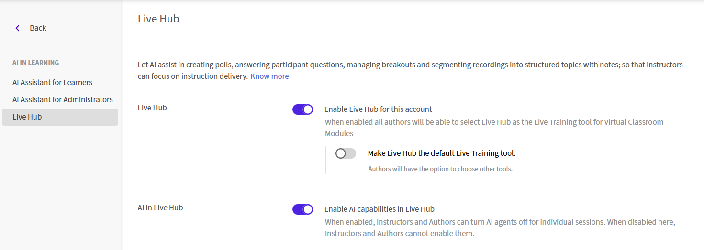
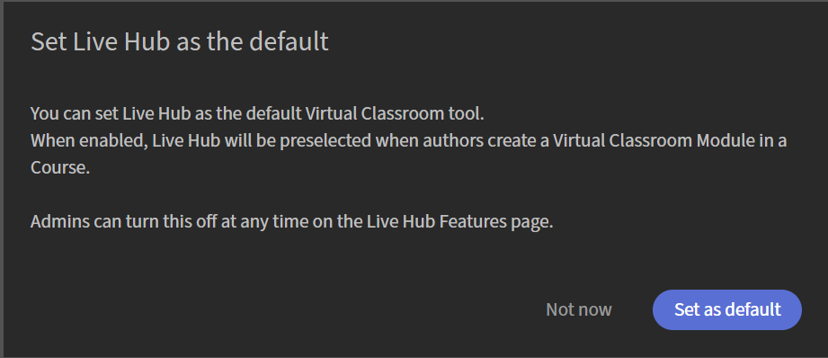

# Abilita Hub dal vivo in Adobe Learning Manager

Gli amministratori possono abilitare Live Hub per un account Adobe Learning Manager e configurare gli assistenti basati sull&#39;intelligenza artificiale per supportare gli istruttori durante le sessioni dal vivo. Una volta abilitato l’Hub live, gli Autori possono utilizzare gli strumenti di formazione virtuale dell’Hub live per creare e gestire i moduli aula virtuale per i corsi.

Per abilitare Live Hub:

1. Accedi a Adobe Learning Manager come Amministratore.

1. Seleziona **IA in Learning** nel riquadro di navigazione a sinistra.

   
   *Seleziona IA in Learning per abilitare Hub dal vivo.*

1. Seleziona **Hub live**.   Viene aperta la pagina **Hub live**.

   
   *Le impostazioni Live Hub mostrano l&#39;opzione per abilitare Live Hub in ALM.*

1. Attiva **Abilita Live Hub per questo account**.   Viene visualizzata la finestra di dialogo **Imposta hub dinamico come predefinito**.

   
   *Selezionare Imposta come predefinito nella finestra popup.*

1. Scegliete una delle seguenti opzioni:

   1. **Imposta come predefinito**: rende Live Hub il provider predefinito per classi virtuali. L’Hub live è preselezionato quando gli Autori creano un modulo aula virtuale per un corso.

   1. **Non ora**: chiude la finestra di dialogo senza modificare il provider dell’aula virtuale predefinito. Puoi abilitare questa impostazione successivamente dalla pagina Hub live.

1. Attiva **L&#39;intelligenza artificiale nell&#39;hub live** per rendere disponibili gli assistenti basati sull&#39;intelligenza artificiale nelle sessioni dal vivo.

   
   *Abilita l&#39;intelligenza artificiale in Live Hub per abilitare gli agenti Live Hub.*

1. Abilita gli assistenti dagli agenti Live Hub:

   1. Assistente sondaggio

   1. Assistente domande e risposte

   1. Assistente monitoraggio Breakout

   1. Generatore di argomenti per le registrazioni

   1. Assistente Finder Istruttore

>[!NOTE]
>
> Gli assistenti basati su intelligenza artificiale possono essere configurati solo quando è abilitata l&#39;intelligenza artificiale nell&#39;hub dinamico. Gli istruttori possono disattivare gli assistenti durante la preparazione di una sessione, ma non possono abilitare un assistente disattivato da un amministratore.

Per ulteriori informazioni, consulta [Guida introduttiva a Live Hub](../../getting-started-with-live-hub/getting-started-live-hub.md).