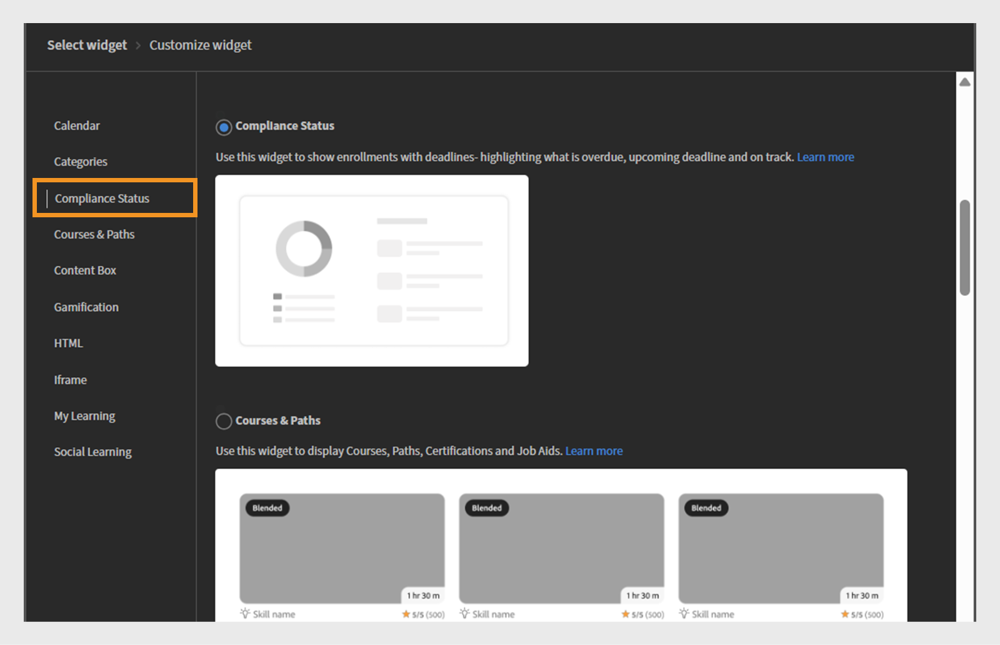

# Aggiungere e configurare i widget

## Widget Calendario

Nel widget Calendario vengono visualizzate le sessioni e i corsi di formazione pianificati. Puoi sfogliare il calendario per visualizzare i corsi di formazione pianificati per i prossimi mesi. Consente di visualizzare le sessioni di formazione per mese con la possibilità di scorrere a sinistra o a destra.

Il widget Calendario può essere aggiunto a una pagina da un amministratore per visualizzare le pianificazioni dei corsi di formazione. Gli Allievi possono interagire con il calendario scorrendo i mesi per visualizzare le sessioni future. Possono filtrare le sessioni per trovare rapidamente i corsi di formazione pertinenti.

### Aggiungere un widget del calendario

In una società finanziaria con team di vendita e Customer Success Manager (CSM) separati, gli amministratori possono utilizzare questo widget per evidenziare le sessioni di formazione specifiche del team. Ad esempio:

* Il team di vendita può assistere alle sessioni imminenti sugli aggiornamenti dei prodotti, sul training sulla conformità e sui workshop promozionali.
* Il team CSM può visualizzare i workshop di onboarding del cliente, il training sulla comunicazione con il cliente e i programmi di eccellenza del servizio.

Per configurare il widget Calendario:

1. Accedi a Adobe Learning Manager come amministratore.
2. Seleziona **[!UICONTROL Branding]** nel riquadro di navigazione a sinistra.
3. Seleziona **[!UICONTROL Pagine personalizzate]**.
4. Seleziona la pagina richiesta, quindi seleziona **[!UICONTROL Progettazione pagina]**.
5. Seleziona **[!UICONTROL Modifica]**, quindi seleziona il layout.
6. Seleziona **[!UICONTROL Aggiungi widget]**.
7. Seleziona **[!UICONTROL Calendario]**, quindi seleziona **[!UICONTROL Procedi]**.

   
   _Schermata di selezione del widget che evidenzia l&#39;opzione del widget Calendario per visualizzare le sessioni di formazione in un calendario_

8. Digitare un **[!UICONTROL titolo del widget]** e una **[!UICONTROL descrizione del widget]**.

   
   _Schermata di personalizzazione del widget Calendario, in cui gli amministratori possono impostare il titolo e la descrizione del widget e selezionare i cataloghi_

9. Seleziona un catalogo effettuando una ricerca per visualizzare i corsi e i percorsi di apprendimento nel widget **[!UICONTROL Calendario]**.
10. Seleziona **[!UICONTROL Aggiungi widget]**.

Il widget Calendario verrà aggiunto alla pagina. L’Amministratore può aggiungere altri widget e pubblicare la pagina.

>[!NOTE]
>
>Se non è selezionato alcun catalogo, vengono visualizzate le sessioni di tutti i cataloghi.

## Widget categorie

Il widget Categorie mostra i contenuti di apprendimento organizzati per Cataloghi, Prodotti o Ruoli come categorie. Aiuta gli Allievi a sfogliare e trovare facilmente i corsi di formazione raggruppati per argomento, reparto, abilità o altre classificazioni rilevanti.

Gli Amministratori aggiungono il widget Categorie a una pagina per mostrare le opzioni di apprendimento in categorie. Gli Allievi utilizzano il widget per esplorare i corsi di formazione selezionando una categoria di interesse, che a sua volta rivela i corsi o i percorsi correlati.

Per ulteriori informazioni sulla configurazione di cataloghi e consigli, consultate gli articoli [Cataloghi](/help/migrated/administrators/feature-summary/catalogs.md) e [Recommendations](/help/migrated/recommendations-adobe-learning-manager.md).

### Aggiungere un widget di categoria

In una società di servizi finanziari, team diversi spesso hanno bisogno di accedere a corsi di formazione specifici per ogni ruolo. Il widget Categorie consente di organizzare i contenuti di apprendimento in riquadri chiari e cliccabili, rendendo più facile per i team di vendita e CSM trovare rapidamente ciò di cui hanno bisogno.

Per configurare il widget Categorie:

1. Accedi a Adobe Learning Manager come amministratore.
2. Seleziona **[!UICONTROL Branding]** nel riquadro di navigazione a sinistra.
3. Seleziona **[!UICONTROL Pagine personalizzate]**.
4. Seleziona la pagina richiesta, quindi seleziona **[!UICONTROL Progettazione pagina]**.
5. Seleziona **[!UICONTROL Modifica]**, quindi seleziona il layout.
6. Seleziona **[!UICONTROL Aggiungi widget]**.
7. Seleziona **[!UICONTROL Categorie]**, quindi seleziona **[!UICONTROL Procedi]**.

   
   _Schermata di selezione del widget che evidenzia l’opzione del widget Categorie per organizzare i contenuti di apprendimento per catalogo, prodotto o ruolo per una navigazione semplificata_

8. Selezionare i dettagli da visualizzare nelle schede delle categorie:

   * **[!UICONTROL Immagine categoria]**
   * **[!UICONTROL Descrizione categoria]**

9. Digitare un **[!UICONTROL titolo del widget]** e una **[!UICONTROL descrizione del widget]**.
10. Cercare e scegliere un catalogo dall&#39;**[!UICONTROL origine categoria]**.

    
    _Configurare le opzioni del widget Categorie per impostare il titolo e la descrizione del widget e selezionare l&#39;origine della categoria_

11. Seleziona **[!UICONTROL Aggiungi widget]**.

Il widget Categorie verrà aggiunto alla pagina. Gli amministratori possono aggiungere altri widget e pubblicare la pagina.

## Widget Conformità

Il widget Stato conformità mostra i progressi di un Allievo verso il rispetto dei requisiti di conformità o certificazione. Mostra lo stato del corso di formazione obbligatorio assegnato all’utente, inclusi i corsi completati, in sospeso o scaduti.

Gli Amministratori aggiungono il widget Stato conformità alle pagine per fornire visibilità sull’avanzamento del corso di formazione sulla conformità. Gli Allievi lo utilizzano per verificare rapidamente quali corsi obbligatori hanno completato e quali richiedono ancora attenzione.

### Aggiungere un widget dello stato di conformità

In una società di servizi finanziari, sia il team Vendite che il team Customer Success Manager (CSM) devono completare in tempo il corso di formazione sulla conformità. Il widget Stato conformità consente agli Allievi di monitorare più facilmente le scadenze imminenti e l’avanzamento della formazione direttamente dalle pagine specifiche del team.

Per configurare il widget Conformità:

1. Accedi a Adobe Learning Manager come amministratore.
2. Seleziona **[!UICONTROL Branding]** nel riquadro di navigazione a sinistra.
3. Seleziona **[!UICONTROL Pagine personalizzate]**.
4. Seleziona la pagina richiesta, quindi seleziona **[!UICONTROL Progettazione pagina]**.
5. Seleziona **[!UICONTROL Modifica]**, quindi seleziona il layout.
6. Seleziona **[!UICONTROL Aggiungi widget]**.
7. Seleziona **[!UICONTROL Stato conformità]**, quindi seleziona **[!UICONTROL Procedi]**.

   
   _Schermata di selezione del widget che evidenzia il widget Stato conformità utilizzato per visualizzare le iscrizioni degli allievi con scadenze e indicatori di stato_

8. Digitare un **[!UICONTROL titolo del widget]** e una **[!UICONTROL descrizione del widget]**.

   
   _Schermata del widget Stato conformità, in cui gli amministratori possono impostare il titolo e la descrizione del widget per visualizzare le scadenze di iscrizione e lo stato per gli Allievi_

9. Seleziona **[!UICONTROL Aggiungi widget]**.

Il widget dello stato di conformità verrà aggiunto alla pagina. Gli amministratori possono aggiungere altri widget e pubblicare la pagina.

## Widget di corsi e percorsi

Il widget Corsi e percorsi visualizza i corsi e i percorsi di apprendimento consigliati in base al ruolo, agli interessi o alle esigenze di formazione dell’Allievo.

Gli Amministratori aggiungono il widget Corsi e percorsi alle pagine per evidenziare i contenuti di apprendimento principali per gruppi di destinatari specifici. Gli Allievi utilizzano il widget per sfogliare i corsi o i percorsi consigliati e possono iscriversi direttamente ai corsi.

### Aggiungere un widget Corsi e percorsi

Un&#39;azienda finanziaria desidera creare pagine di formazione specifiche per i due team, Sales and Customer Success Manager (CSM). Il widget Corsi e percorsi può essere utilizzato per visualizzare i programmi di apprendimento più rilevanti per ogni team.

Per configurare il widget Corsi e percorsi:

1. Accedi a Adobe Learning Manager come amministratore.
2. Seleziona **[!UICONTROL Branding]** nel riquadro di navigazione a sinistra.
3. Seleziona **[!UICONTROL Pagine personalizzate]**.
4. Seleziona la pagina richiesta, quindi seleziona **[!UICONTROL Progettazione pagina]**.
5. Seleziona **[!UICONTROL Modifica]**, quindi seleziona il layout.
6. Seleziona **[!UICONTROL Aggiungi widget]**.
7. Seleziona **[!UICONTROL Corsi e percorsi]**.

   
   _Schermata di selezione del widget che evidenzia il widget Corsi e percorsi per visualizzare corsi, percorsi di apprendimento, certificazioni e risorse formative come schede interattive per gli Allievi_

8. Seleziona **[!UICONTROL Procedi]**.
9. Digita **[!UICONTROL Titolo widget]** e **[!UICONTROL Descrizione widget]**.
10. Seleziona i cataloghi o scegli manualmente fino a 25 corsi da visualizzare.

_Widget Corsi e percorsi in cui gli amministratori impostano il titolo e la descrizione del widget e selezionano Corsi o Percorsi di apprendimento da visualizzare come schede interattive_
&#x200B;11. Seleziona **[!UICONTROL Aggiungi widget]**.

Il widget Corsi e percorsi verrà aggiunto alla pagina. Gli amministratori possono aggiungere altri widget e pubblicare la pagina.

## Widget box contenuti

Il widget Casella di contenuto consente agli amministratori di aggiungere contenuti personalizzati, ad esempio testo, immagini, annunci o collegamenti a una pagina. Offre uno spazio flessibile per la condivisione di informazioni importanti, suggerimenti, aggiornamenti o messaggi promozionali direttamente nell’ambiente di apprendimento.

### Aggiungere un widget Casella di contenuto

Un&#39;azienda finanziaria desidera creare pagine di formazione specifiche per i due team, Sales and Customer Success Manager (CSM). Il widget Casella dei contenuti può essere utilizzato per aggiungere sezioni personalizzate con titoli, descrizioni, immagini e pulsanti di invito all’azione che condividono risorse mirate, aggiornamenti e messaggi motivazionali.

Per configurare il widget Casella dei contenuti:

1. Accedi a Adobe Learning Manager come amministratore.
2. Seleziona **[!UICONTROL Branding]** nel riquadro di navigazione a sinistra.
3. Seleziona **[!UICONTROL Pagine personalizzate]**.
4. Seleziona la pagina richiesta, quindi seleziona **[!UICONTROL Progettazione pagina]**.
5. Seleziona **[!UICONTROL Modifica]**, quindi seleziona il layout.
6. Seleziona **[!UICONTROL Aggiungi widget]**.
7. Seleziona **[!UICONTROL Casella di contenuto]**, quindi seleziona **[!UICONTROL Procedi]**.

   
   _Schermata di selezione del widget che evidenzia il widget Casella dei contenuti per visualizzare immagini personalizzate, testo e pulsanti di azione per migliorare il coinvolgimento degli allievi_

8. Digitare **[!UICONTROL Titolo]** e **[!UICONTROL Descrizione]**.
9. Digitare il testo nell&#39;**[!UICONTROL etichetta del pulsante di azione]** e fornire un collegamento.
10. Selezionate una delle opzioni per Riempimento sfondo:

    * **[!UICONTROL Colore]**: selezionare il colore dal selettore colore o digitare il codice colore nel campo di testo.
    * **[!UICONTROL Immagine]**: individua e carica un&#39;immagine.

11. Regolare l&#39;altezza della casella utilizzando l&#39;opzione **[!UICONTROL Altezza casella contenuto]**.
12. Selezionate le opzioni di formattazione del testo.

    
    _Schermata di personalizzazione del widget Casella dei contenuti, in cui gli amministratori possono immettere un titolo, una descrizione, un&#39;etichetta del pulsante di azione e un collegamento_

13. Seleziona **[!UICONTROL Aggiungi widget]**.

Il widget Casella dei contenuti verrà aggiunto alla pagina. Gli amministratori possono aggiungere altri widget e pubblicare la pagina.

## Widget gamification

Gli Amministratori aggiungono il widget Gamification alle pagine personalizzate per mostrare i risultati raggiunti dagli Allievi, come distintivi ottenuti, punti accumulati e classifiche. Gli Allievi possono monitorare i propri progressi e confrontare i risultati con i colleghi, il che favorisce la motivazione e la partecipazione sostenuta.

### Aggiungere un widget Gamification

Un’azienda finanziaria desidera stimolare il coinvolgimento e la motivazione degli Allievi all’interno dei suoi due principali team: Sales e Customer Success Manager (CSM). Il widget Gamification può essere utilizzato per premiare gli Allievi con punti, distintivi e classifiche della classifica per aver completato il corso di formazione e aver partecipato attivamente.

Per il team di vendita, la gamification potrebbe concentrarsi su obiettivi di ricompensa relativi alle competenze di vendita, alla conoscenza dei prodotti e al training sul coinvolgimento dei clienti. Per il team CSM, potrebbe evidenziare le certificazioni del servizio clienti, la formazione sulla conformità e le competenze di gestione dei client.

Per configurare il widget Gamification:

1. Accedi a Adobe Learning Manager come amministratore.
2. Seleziona **[!UICONTROL Branding]** nel riquadro di navigazione a sinistra.
3. Seleziona **[!UICONTROL Pagine personalizzate]**.
4. Seleziona la pagina richiesta, quindi seleziona **[!UICONTROL Progettazione pagina]**.
5. Seleziona **[!UICONTROL Modifica]**, quindi seleziona il layout.
6. Seleziona **[!UICONTROL Aggiungi widget]**.
7. Seleziona **[!UICONTROL Gamification]** e quindi **[!UICONTROL Procedi]**.

   
   _Schermata di selezione del widget che evidenzia il widget Gamification utilizzato per visualizzare le attività di apprendimento e i risultati nella classifica_

8. Digitare il **[!UICONTROL titolo widget]** e la **[!UICONTROL descrizione widget]**.
9. Seleziona **[!UICONTROL Aggiungi widget]**.

Il widget Gamification verrà aggiunto alla pagina. Gli amministratori possono aggiungere altri widget e pubblicare la pagina.

## Widget HTML

Il widget HTML consente agli amministratori di incorporare codice HTML personalizzato direttamente in una pagina. Ciò fornisce flessibilità per aggiungere contenuti personalizzati, integrare strumenti di terze parti o includere elementi interattivi che vanno oltre la funzionalità standard del widget. Supporta la personalizzazione avanzata tramite HTML, CSS e persino JavaScript, consentendo progettazioni uniche e integrazioni esterne all’interno della piattaforma di apprendimento.

### Aggiungere un widget HTML

Un&#39;azienda finanziaria desidera fornire contenuti personalizzati e interattivi su misura per i suoi due team principali: Sales e Customer Success Manager (CSM). Il widget HTML può essere utilizzato per incorporare risorse personalizzate basate su HTML, come dashboard finanziari, visualizzazioni di dati, moduli interattivi o strumenti di analisi di mercato direttamente nelle pagine dei corsi di formazione o del team.

Per configurare il widget HTML:

1. Accedi a Adobe Learning Manager come amministratore.
2. Seleziona **[!UICONTROL Branding]** nel riquadro di navigazione a sinistra.
3. Seleziona **[!UICONTROL Pagine personalizzate]**.
4. Seleziona la pagina richiesta, quindi seleziona **[!UICONTROL Progettazione pagina]**.
5. Seleziona **[!UICONTROL Modifica]**, quindi seleziona il layout.
6. Seleziona **[!UICONTROL Aggiungi widget]**.
7. Seleziona **[!UICONTROL HTML]**, quindi seleziona **[!UICONTROL Procedi]**.

   
   _Schermata di selezione del widget che evidenzia il widget HTML per personalizzare le pagine utilizzando codice HTML, CSS e JavaScript_

8. Digitate il codice **[!UICONTROL HTML]**, **[!UICONTROL CSS]** e **[!UICONTROL JavaScript]** nei rispettivi campi.
9. Seleziona **[!UICONTROL Aggiungi widget]**.

Il widget HTML verrà aggiunto alla pagina. Gli amministratori possono aggiungere altri widget e pubblicare la pagina.

## Widget IFrame

Il widget Iframe visualizza il contenuto di un URL esterno direttamente all’interno di una pagina sulla piattaforma di apprendimento. All’interno di un frame viene incorporato un sito Web, uno strumento o un’applicazione esterna che consente agli Allievi di visualizzare e interagire con tale contenuto senza uscire dall’LMS.

### Aggiungere un widget Iframe

Un&#39;azienda finanziaria desidera integrare strumenti e risorse esterni all&#39;interno delle pagine interne di formazione e collaborazione destinate ai team Sales and Customer Success Manager (CSM). Il widget Iframe può essere utilizzato per visualizzare dashboard finanziari di terze parti, piattaforme di analisi di mercato o portali di gestione dei client direttamente all’interno dell’interfaccia LMS.

Per configurare il widget Iframe:

1. Accedi a Adobe Learning Manager come amministratore.
2. Seleziona **[!UICONTROL Branding]** nel riquadro di navigazione a sinistra.
3. Seleziona **[!UICONTROL Pagine personalizzate]**.
4. Seleziona la pagina richiesta, quindi seleziona **[!UICONTROL Progettazione pagina]**.
5. Seleziona **[!UICONTROL Modifica]**, quindi seleziona il layout.
6. Seleziona **[!UICONTROL Aggiungi widget]**.
7. Seleziona **[!UICONTROL Iframe]** e quindi **[!UICONTROL Procedi]**.

   
   _Schermata di selezione del widget che evidenzia il widget Iframe per incorporare applicazioni o pagine Web esterne all&#39;interno di una sezione selezionata_

8. Digitare l&#39;URL nell&#39;opzione **[!UICONTROL Pagina collegata al pulsante Azione]**.
9. Regola l&#39;altezza dell&#39;Iframe utilizzando l&#39;opzione **[!UICONTROL Altezza Iframe]**.

   
   _Schermata di personalizzazione del widget Iframe, in cui gli amministratori possono immettere un URL di pagina e specificare l&#39;altezza dell&#39;iFrame per incorporare contenuto esterno_

10. Seleziona **[!UICONTROL Aggiungi widget]**.

Il widget Iframe verrà aggiunto alla pagina. Gli amministratori possono aggiungere altri widget e pubblicare la pagina.

Per recuperare i dettagli corretti, gli amministratori devono includere il token di accesso come parametro di query nell’URL iframe. Ad esempio, per visualizzare informazioni da Adobe Learning Manager all’interno di un iframe, l’URL deve includere i seguenti parametri:

* userId: identificatore univoco dell’Allievo
* accountId: identificatore dell’account associato all’Allievo
* token: token di autenticazione richiesto per le chiamate API
* locale: la lingua o la preferenza locale dell’Allievo

## Il mio widget di apprendimento

Il widget Il mio apprendimento offre agli Allievi una vista personalizzata di tutti i corsi, i programmi di apprendimento e le certificazioni assegnati o iscritti dagli Allievi. Organizza i contenuti di apprendimento per tipo e scadenza, consentendo agli Allievi di monitorare facilmente i progressi e accedere ai materiali di apprendimento. Questo widget aiuta gli Allievi a concentrarsi sulla formazione richiesta e a visualizzare brevemente le scadenze imminenti.

### Aggiungi un widget Il mio apprendimento

Un&#39;azienda finanziaria desidera offrire esperienze di apprendimento personalizzate su misura per i suoi due principali team: Sales e Customer Success Manager (CSM). Il widget Il mio apprendimento può essere utilizzato per offrire a ogni membro del team una vista consolidata dei corsi assegnati, dei percorsi di apprendimento in corso e delle certificazioni.

Per configurare il widget Il mio apprendimento:

1. Accedi a Adobe Learning Manager come amministratore.
2. Seleziona **[!UICONTROL Branding]** nel riquadro di navigazione a sinistra.
3. Seleziona **[!UICONTROL Pagine personalizzate]**.
4. Seleziona la pagina richiesta, quindi seleziona **[!UICONTROL Progettazione pagina]**.
5. Seleziona **[!UICONTROL Modifica]**, quindi seleziona il layout.
6. Seleziona **[!UICONTROL Aggiungi widget]**.
7. Seleziona **[!UICONTROL Il mio apprendimento]**, quindi seleziona **[!UICONTROL Procedi]**.

   
   _Schermata di selezione del widget, che evidenzia il widget Il mio apprendimento utilizzato per visualizzare l’elenco personalizzato dei corsi a cui è iscritto l’Allievo_

8. Digitare il **[!UICONTROL titolo widget]** e la **[!UICONTROL descrizione widget]**.
9. Seleziona **[!UICONTROL Aggiungi widget]**.

Il mio widget di apprendimento verrà aggiunto alla pagina. Gli amministratori possono aggiungere altri widget e pubblicare la pagina.

## Widget Apprendimento sociale

Il widget Apprendimento sociale consente agli Allievi di interagire, condividere idee e collaborare all’interno della piattaforma di apprendimento. Supporta la pubblicazione di vari tipi di contenuti come testi, video, audio, schermate, domande e sondaggi. Gli Allievi possono commentare, rispondere, votare a favore o contro i post, promuovendo la condivisione delle conoscenze e l’impegno tra pari. Questo widget crea uno spazio di apprendimento informale che integra la formazione formale incoraggiando l’interazione sociale e l’apprendimento continuo.

### Aggiungere un widget di Apprendimento sociale

Una società finanziaria desidera la collaborazione e la condivisione delle conoscenze tra i suoi due principali team: Sales e Customer Success Manager (CSM). Il widget Apprendimento sociale può essere utilizzato per creare spazi interattivi in cui i membri del gruppo pubblicano domande, condividono best practice, caricano contenuti utili e partecipano a discussioni.

Per configurare il widget Apprendimento sociale:

1. Accedi a Adobe Learning Manager come amministratore.
2. Seleziona **[!UICONTROL Branding]** nel riquadro di navigazione a sinistra.
3. Seleziona **[!UICONTROL Pagine personalizzate]**.
4. Seleziona la pagina richiesta, quindi seleziona **[!UICONTROL Progettazione pagina]**.
5. Seleziona **[!UICONTROL Modifica]**, quindi seleziona il layout.
6. Seleziona **[!UICONTROL Aggiungi widget]**.
7. Seleziona **[!UICONTROL Apprendimento sociale]**, quindi seleziona **[!UICONTROL Procedi]**.

   
   _Schermata di selezione del widget che evidenzia il widget di Apprendimento sociale per visualizzare un post per incoraggiare la collaborazione e l&#39;impegno_

8. Digitare il **[!UICONTROL titolo widget]** e la **[!UICONTROL descrizione widget]**.
9. Seleziona **[!UICONTROL Aggiungi widget]**.

Il widget Apprendimento sociale verrà aggiunto alla pagina. Gli amministratori possono aggiungere altri widget e pubblicare la pagina.

## Passaggi successivi

Dopo aver configurato i widget sulle pagine, usa i menu per organizzare e raggruppare le pagine.
