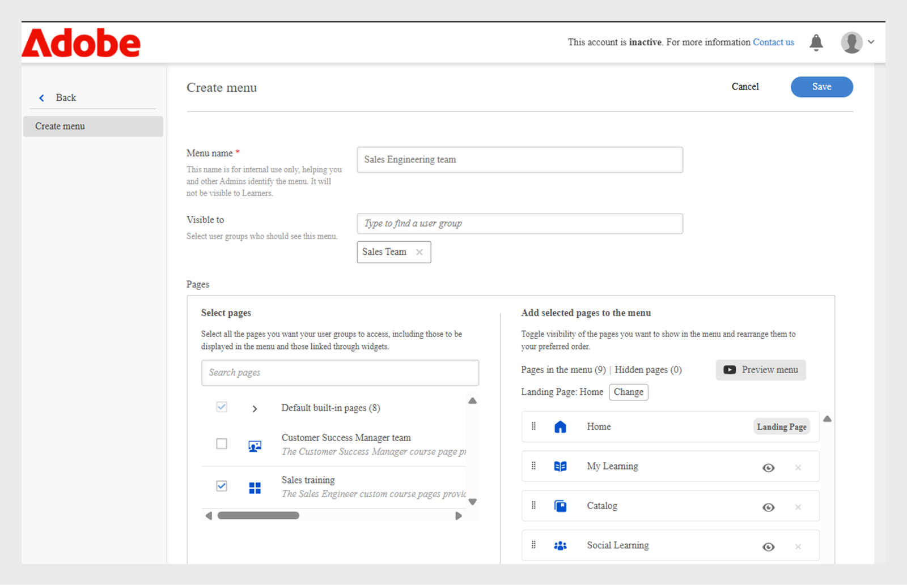

# Creare un menu

In qualità di amministratore di una società finanziaria con due team principali, Sales e Customer Success Manager (CSM), dovresti creare menu separati con le rispettive pagine. Questo consente agli Allievi di trovare facilmente i corsi relativi ai loro ruoli nel proprio menu.

Per impostazione predefinita, gli amministratori possono visualizzare il menu predefinito nella pagina **[!UICONTROL Menu]**, che non può essere eliminata. Questo menu include tutte le pagine incorporate attualmente visibili nell’app per Allievi.

Per creare un menu:

1. Accedi a Adobe Learning Manager come amministratore.
2. Seleziona **[!UICONTROL Branding]** nel riquadro di navigazione a sinistra.
3. Seleziona **[!UICONTROL Menu]**, quindi seleziona **[!UICONTROL Crea]**.

   
   _Schermata del menu che mostra le opzioni per visualizzare, organizzare e creare menu personalizzati per diversi gruppi di Allievi_

4. Digita il **[!UICONTROL Nome menu]** (ad esempio, Formazione sul prodotto) e seleziona il gruppo di utenti nell&#39;opzione **[!UICONTROL Visibile a]**.

   
   _Creare una schermata del menu, in cui gli amministratori possono immettere un nome di menu per uso interno e specificare i gruppi di utenti per controllare la visibilità dei menu_

5. Di seguito sono riportati i tipi di pagine disponibili nel menu:
   * **[!UICONTROL Pagine incorporate]**: queste sono le pagine predefinite fornite con Adobe Learning Manager, ad esempio Home, Il mio apprendimento e Catalogo. Gli amministratori non possono rimuovere le pagine incorporate dal menu. Possono nascondere le pagine dal menu.
   * **[!UICONTROL Pagine personalizzate]**: si tratta di pagine create dall&#39;amministratore tramite Experience Builder. Le pagine personalizzate consentono alle organizzazioni di progettare esperienze con marchio, specifiche per i ruoli o basate su eventi aggiungendo widget, layout e menu personalizzati per diversi gruppi di Allievi.
6. Seleziona **[!UICONTROL Modifica]** accanto a **[!UICONTROL Pagina di destinazione]** per aggiornare la pagina di destinazione dell’Allievo.

   
   _Schermata di configurazione del menu che mostra l’opzione per selezionare le pagine per modificare la pagina di destinazione dell’interfaccia dell’Allievo_

7. Scegli la pagina personalizzata dall&#39;opzione **[!UICONTROL Seleziona pagine]**. Gli amministratori devono essere in grado di selezionare solo le pagine personalizzate pubblicate, non quelle in stato di bozza.

   
   _Schermata di selezione delle pagine, con evidenziazione dell&#39;opzione per includere la pagina personalizzata per i gruppi di utenti e personalizzare l&#39;ordine dei menu_

8. Trascina e rilascia per riordinare le pagine nel menu.
9. Selezionare **[!UICONTROL Anteprima menu]** per visualizzare il menu prima di salvarlo.
10. Seleziona **[!UICONTROL Salva]**.

Il menu creato sarà visibile per gli Allievi selezionati. Possono accedere alle pagine personalizzate tramite l’interfaccia utente dell’Allievo.

_L’interfaccia utente degli Allievi mostra la pagina personalizzata con i moduli di formazione in primo piano e una navigazione semplice dal menu della barra laterale_

## Creare un sottomenu

Gli amministratori possono creare un sottomenu all’interno del menu e aggiungervi pagine personalizzate. I sottomenu non dispongono di una pagina di destinazione.

Per creare un sottomenu:

1. Selezionare **[!UICONTROL Crea sottomenu]** nella pagina **[!UICONTROL Configurazione menu]**.

   
   _Pagine di configurazione dei menu che evidenziano l’opzione Crea sottomenu per creare sottomenu per gli Allievi_

2. Selezionate la lingua e digitate il titolo del sottomenu.
3. Selezionare un&#39;icona da visualizzare accanto al sottomenu.
4. Seleziona **[!UICONTROL Aggiungi nuova lingua]** per creare lo stesso sottomenu per lingue diverse. Ad esempio, se aggiungi inglese e francese, gli allievi con la lingua di interfaccia inglese selezionata visualizzeranno il sottomenu inglese, mentre gli allievi con francese selezionato visualizzeranno il sottomenu francese.

   
   _Messaggio del sottomenu che mostra le opzioni per selezionare il titolo, la lingua e l&#39;icona del sottomenu da visualizzare nel menu_

5. Seleziona **[!UICONTROL Procedi]**.
6. Trascina le pagine sotto il sottomenu.

## Impostare le pagine nascoste

L’opzione **[!UICONTROL Nascondi pagine]** consente agli amministratori di mantenere pulita l’interfaccia utente dell’Allievo mostrando un numero inferiore di pagine. Gli Amministratori possono nascondere le pagine dal menu in modo che gli allievi non le vedano nell’interfaccia utente, ma possono comunque raggiungerle in altri modi. Ad esempio, è possibile nascondere la pagina Catalogo dal menu, ma accedervi tramite la pagina principale dell’Allievo.

_Schermata di configurazione dei menu che mostra pagine nascoste come Catalogo, Apprendimento sociale, Abilità e Distintivi_

>[!NOTE]
>
>Le pagine di un sottomenu non possono essere nascoste direttamente. Per nascondere una pagina, trascinarla fuori dal sottomenu e quindi nasconderla.

## Passaggi successivi

Dopo aver impostato pagine, widget e menu, migliora l’esperienza complessiva degli Allievi aggiungendo personalizzazioni utilizzando JavaScript e CSS.

