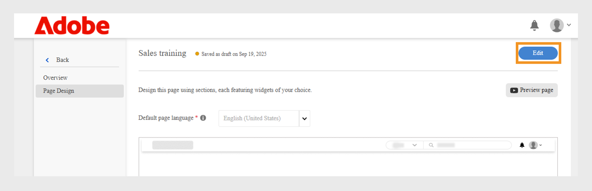

# Creare una pagina personalizzata in Experience Builder

In qualità di amministratore di una società di servizi finanziari, gestisci due team: Vendite e Customer Success. Ogni team ha esigenze di apprendimento specifiche, ma entrambi utilizzano lo stesso portale di apprendimento standard. Ciò ha portato a confusione, confusione e basso coinvolgimento degli allievi.
Per risolvere questo problema senza investire in una build headless o in attesa di una soluzione per sviluppatori personalizzata, puoi utilizzare Experience Builder in Adobe Learning Manager. Con pagine, widget e menu, puoi progettare portali specifici per i ruoli in pochi passaggi, senza dover ricorrere alla codifica.

Per creare una pagina personalizzata per il team Sales Engineering in Adobe Learning Manager:

1. Accedi a Adobe Learning Manager come amministratore.
2. Seleziona **[!UICONTROL Branding]** nel riquadro di navigazione a sinistra.
3. Seleziona **[!UICONTROL Pagine personalizzate]**.
4. Seleziona **[!UICONTROL Crea pagina]**.

   
   _Schermata Pagine personalizzate che mostra l’opzione Crea pagina per progettare nuove esperienze di apprendimento personalizzate_

5. Digitare il **[!UICONTROL Nome pagina]** (ad esempio, Formazione alle vendite per il team Vendite).
6. Digitare la **[!UICONTROL descrizione della pagina]**.

   
   _Impostazione della pagina del corso di formazione sulle vendite in Adobe Learning Manager, con campi per il nome della pagina, la descrizione, il tipo, l&#39;URL e la configurazione dell&#39;icona per la creazione di un portale di formazione sulle vendite di destinazione_

7. Selezionare il tipo di pagina tra i seguenti:

   * **[!UICONTROL Compilazione tramite widget ALM]**: l&#39;amministratore può creare una pagina utilizzando i widget Adobe Learning Manager esistenti. Digitare la stringa personalizzata nel campo URL pagina. Questa stringa verrà aggiunta all&#39;URL della pagina personalizzata.
   * **[!UICONTROL Pagina esterna]**: l&#39;amministratore può aggiungere un URL per la pagina esterna. Se selezionate il tipo di pagina come esterno, digitate l’URL della pagina esterna nel campo di testo URL pagina.

8. Selezionare l&#39;icona **[!UICONTROL Modifica]** per modificare l&#39;icona della pagina.
9. Selezionare **[!UICONTROL Aggiungi nuova lingua]** per aggiungere la lingua predefinita per la pagina.
10. Seleziona **[!UICONTROL Salva]**.

La pagina è stata creata e salvata come bozza nella sezione Pagine personalizzate. Gli amministratori possono modificare e progettare le pagine bozza utilizzando i widget.

Il passaggio successivo consiste nell’aggiungere un layout alla pagina personalizzata, in cui è possibile aggiungere e configurare i widget.

## Layout di pagina in Experience Builder

Progetta la pagina selezionando il layout di sezione appropriato dal menu a discesa. La larghezza massima di un layout è di 1212 pixel. Scegliete tra le seguenti opzioni di sezione in base al numero di widget che desiderate aggiungere e alle dimensioni desiderate:

* **[!UICONTROL 1 colonna - Larghezza completa della sezione]**: il contenuto si estende per l&#39;intera larghezza della sezione, fornendo lo spazio massimo.
* **[!UICONTROL 2 colonne - 1/2 di larghezza di sezione ciascuna]**: la sezione viene divisa in due colonne di larghezza uguale.
* **[!UICONTROL 2 colonne - 2/3 e 1/3 larghezza sezione]**: il contenuto principale occupa due terzi della larghezza, mentre il contenuto laterale utilizza un terzo.
* **[!UICONTROL 2 colonne - 1/3 e 2/3 della larghezza della sezione]**: il contenuto laterale richiede un terzo e il contenuto principale occupa due terzi della sezione.
* **[!UICONTROL 3 colonne - 1/3 di larghezza di sezione ciascuna]**: la sezione si divide in tre colonne di larghezza uguale.

>[!NOTE]
>
>È possibile aggiungere verticalmente un massimo di 10 widget in tutti i layout, ad eccezione della colonna 1 - Layout con larghezza di sezione completa.

Per selezionare il layout della pagina Formazione vendite in Experience Builder:

1. Accedi a Adobe Learning Manager come amministratore.
2. Seleziona **[!UICONTROL Branding]** nel riquadro di navigazione a sinistra.
3. Seleziona **[!UICONTROL Pagine personalizzate]**, quindi seleziona la pagina richiesta.
4. Seleziona **[!UICONTROL Progettazione pagina]**.
5. Seleziona **[!UICONTROL Modifica]**.

   
   _Schermata di modifica della progettazione della pagina per una pagina personalizzata di formazione alle vendite, con evidenziazione del pulsante Modifica per aggiungere sezioni di pagina, widget e layout_

6. Scegli le opzioni dal menu a discesa **[!UICONTROL Seleziona layout di sezione]**.

   
   _La finestra di dialogo per la selezione del layout di sezione consente agli amministratori di scegliere la disposizione del widget a colonna singola o a più colonne per la progettazione di pagine personalizzate_

7. Seleziona **[!UICONTROL Procedi]**.

Il layout aggiunto ha le seguenti opzioni:

* **[!UICONTROL Elimina riga]**: rimuovi la riga dal layout.
* **[!UICONTROL Adatta larghezza schermo]**: regola il layout in modo che venga ridimensionato automaticamente per adattarsi allo schermo e ottenere una migliore visibilità.
* **[!UICONTROL Riordina]**: modifica l&#39;ordine dei layout trascinandoli e rilasciandoli nella posizione desiderata.

_Layout di pagina con le opzioni di layout per riordinare, espandere o eliminare la sezione_

Il passaggio successivo consiste nell’aggiungere e configurare i widget nella pagina personalizzata.

## Aggiungere e configurare un widget

Aggiungi i widget richiesti alle pagine personalizzate del corso di formazione sulle vendite in base ai requisiti.

Per configurare un widget nella pagina personalizzata del corso di formazione sulle vendite:

1. Seleziona **[!UICONTROL Aggiungi widget]** nel layout.

   
   _La schermata di progettazione della pagina consente agli amministratori di selezionare e aggiungere widget per personalizzare le pagine dei corsi_

2. Scegli il **[!UICONTROL widget Casella di contenuto]**, quindi seleziona **[!UICONTROL Procedi]**.

   
   _Schermata di selezione del widget che evidenzia il widget Casella dei contenuti per visualizzare immagini personalizzate, testo e pulsanti di azione per migliorare il coinvolgimento degli allievi_

3. Digitare **[!UICONTROL Titolo]** e **[!UICONTROL Descrizione]**.
4. Digitare il testo nell&#39;**[!UICONTROL etichetta del pulsante di azione]** e fornire un collegamento.
5. Configura le opzioni rimanenti. Visualizzate questa [sezione](/help/migrated/administrators/feature-summary/experience-builder/add-a-widget.md#content-box-widget) per ulteriori informazioni sul **[!UICONTROL widget Casella di contenuto]**.

   
   _Schermata dei widget della casella di contenuto che mostra le opzioni per configurare il widget_

6. Digitare il titolo, la descrizione e l&#39;etichetta del pulsante di azione nella schermata di configurazione **[!UICONTROL widget Casella di contenuto]** per i tecnici delle vendite
7. Seleziona **[!UICONTROL Aggiungi widget]**.
8. Seleziona **[!UICONTROL Salva]** e scegli una delle seguenti opzioni:
a. **[!UICONTROL Salva come bozza]**: la pagina verrà salvata come bozza. L’amministratore può modificare la pagina in un secondo momento.
b. **[!UICONTROL Salva e Publish]**: la pagina verrà pubblicata e l&#39;amministratore può aggiungerla al menu.

   
   _Le opzioni di salvataggio consentono agli amministratori di scegliere tra il salvataggio di una pagina come bozza per la modifica futura o la pubblicazione per l&#39;accesso degli Allievi_

La pagina può essere salvata come bozza o pubblicata. Gli amministratori possono modificare le bozze prima della pubblicazione e possono anche aggiornare e ripubblicare le pagine pubblicate.

Segui gli stessi passaggi per creare pagine per il team Customer Success Manager.

## Anteprima della pagina

Per visualizzare in anteprima le pagine:

1. Accedi a Adobe Learning Manager come amministratore.
2. Seleziona **[!UICONTROL Branding]** nel riquadro di navigazione a sinistra.
3. Seleziona **[!UICONTROL Pagine personalizzate]**.
4. Seleziona la pagina richiesta, quindi seleziona **[!UICONTROL Progettazione pagina]**.
5. Seleziona **[!UICONTROL Modifica]**, quindi seleziona **[!UICONTROL Anteprima pagina]** per visualizzare l&#39;anteprima del portale.

   
   _Anteprima pagina con layout di pagina personalizzato e banner, corsi in primo piano_

6. Selezionate Modalità Inspect per visualizzare l’altezza e la larghezza del widget.

   
   _Schermata di anteprima della pagina in Experience Builder con l&#39;interruttore della modalità Inspect evidenziato, che consente agli amministratori di rivedere e ispezionare i widget_

## Creare una pagina in una lingua diversa

Durante la creazione della pagina, gli amministratori possono creare più pagine personalizzate specifiche delle impostazioni internazionali selezionando le lingue richieste in Aggiungi nuova lingua. Quando vengono aggiunte più lingue, i dettagli del widget devono essere configurati separatamente per ciascuna lingua nella scheda corrispondente, situata accanto alla scheda della lingua predefinita.

_Gli amministratori possono aggiungere dettagli del widget per altre lingue, ad esempio il francese, insieme alla lingua predefinita_

## Gestire il ciclo di vita delle pagine

Gli amministratori possono utilizzare la sezione Pagine personalizzate per modificare, eliminare e duplicare le pagine.

### Modifica la pagina

Per modificare le pagine personalizzate:

1. Accedi a Adobe Learning Manager come amministratore.
2. Seleziona Branding nel riquadro di navigazione a sinistra.
3. Seleziona Pagine personalizzate.
4. Seleziona la pagina richiesta, quindi seleziona Modifica.
5. Seleziona Salva.

La pagina verrà aggiornata con le modifiche.

_Modifica la pagina personalizzata, consentendo agli amministratori di aggiornare il nome, la descrizione e il tipo della pagina_

### Elimina la pagina

Per eliminare la pagina:

1. Accedi a Adobe Learning Manager come amministratore.
2. Seleziona Branding nel riquadro di navigazione a sinistra.
3. Seleziona Pagine personalizzate.
4. Seleziona la pagina richiesta.
5. Seleziona Azione, quindi seleziona Elimina.

_Schermata Pagine personalizzate che mostra le opzioni per eliminare le pagine personalizzate create per la formazione sul prodotto_

### Duplicare la pagina

Per duplicare la pagina:

1. Accedi a Adobe Learning Manager come amministratore.
2. Seleziona Branding nel riquadro di navigazione a sinistra.
3. Seleziona Pagine personalizzate.
4. Seleziona la pagina richiesta.
5. Seleziona Azione, quindi seleziona Duplica.

_Schermata Pagine personalizzate con opzioni per duplicare le pagine personalizzate create per la formazione sul prodotto_

## Passaggi successivi

Dopo aver creato la pagina, aggiungi e configura i widget sulle pagine personalizzate in base alle tue esigenze di formazione.
