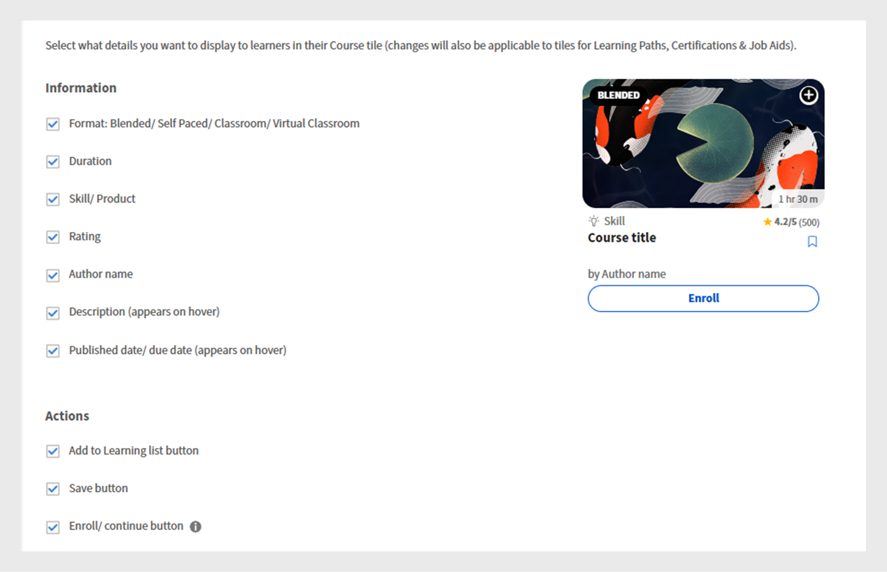

# Personalizza Experience Builder

## Personalizzare un piè di pagina

Il piè di pagina viene visualizzato nella parte inferiore dell’interfaccia Allievo e generalmente contiene le informazioni predefinite configurate nelle impostazioni dell’Amministratore. Gli amministratori possono sostituire questo elemento con un piè di pagina personalizzato per creare un’esperienza con marchio. Utilizzando HTML e CSS, possono definire la progettazione, il layout e il contenuto del piè di pagina in base ai requisiti dell&#39;organizzazione.

In qualità di amministratore di una società finanziaria, puoi configurare il piè di pagina utilizzando l’opzione personalizzata. Questa opzione consente di aggiungere HTML e CSS personalizzati, offrendo la massima flessibilità nella progettazione del piè di pagina.

Per personalizzare il piè di pagina:

1. Accedi a Adobe Learning Manager come amministratore.
2. Seleziona **[!UICONTROL Branding]**, quindi seleziona **[!UICONTROL Generale]**.
3. Seleziona **[!UICONTROL Modifica]** accanto all&#39;opzione **[!UICONTROL Personalizzazione piè di pagina]**.

   
   _Schermata Impostazioni generali in Adobe Learning Manager, con opzioni per abilitare la personalizzazione del piè di pagina_

4. Seleziona il pulsante di attivazione/disattivazione per abilitare la **[!UICONTROL personalizzazione del piè di pagina]**.

   
   _Impostazioni di personalizzazione dei piè di pagina in Adobe Learning Manager, con l’interruttore che consente di abilitare l’aggiunta di HTML o CSS per piè di pagina e campi personalizzati per il branding personalizzato_

5. Digita **[!UICONTROL HTML]** e **[!UICONTROL CSS]** nelle rispettive schede.

   
   _Schermata di personalizzazione del piè di pagina in Adobe Learning Manager, che mostra una sezione HTML personalizzata per l’aggiunta, la modifica o lo stile del piè di pagina dell’interfaccia Allievo_

6. Seleziona **[!UICONTROL Anteprima]** per visualizzare il piè di pagina personalizzato prima di salvarlo.

   
   _Anteprima di un piè di pagina dell’interfaccia Allievo personalizzato in Adobe Learning Manager, con collegamenti categorizzati_

7. Seleziona **[!UICONTROL Salva]**.

Il piè di pagina personalizzato verrà visualizzato a tutti gli allievi.

## Personalizzare i riquadri del corso

In una società finanziaria, gli Amministratori possono impostare i riquadri del corso per decidere quali dettagli visualizzare per gli Allievi. Ad esempio, potrebbero mostrare la descrizione del corso e il nome dell’abilità per il corso di formazione sulla conformità, ma nascondere le valutazioni o il nome dell’autore per mantenere l’attenzione sui requisiti obbligatori.

Per personalizzare i riquadri del corso:

1. Accedi a Adobe Learning Manager come amministratore.
2. Seleziona **[!UICONTROL Branding]**, quindi seleziona **[!UICONTROL riquadro del corso]**.
3. Seleziona **[!UICONTROL Modifica]**.

   
   _Schermata delle impostazioni del riquadro del corso in Adobe Learning Manager, con l&#39;opzione Modifica per personalizzare il riquadro_

4. Seleziona le opzioni seguenti per mostrare o nascondere i dettagli relativi alle informazioni sul corso:

   a. **[!UICONTROL Formato]**: Fuso/A ritmo personalizzato/Aula/Aula virtuale: tipo di oggetto di apprendimento.
b. **[!UICONTROL Durata]**: durata dell’oggetto di apprendimento.
c. **[!UICONTROL Abilità/Prodotto]**: mostra l’abilità o il prodotto chiave trattato nel corso.
d. **[!UICONTROL Valutazione]**: visualizza la valutazione dell’Allievo per il corso.
e. **[!UICONTROL Nome autore]**: mostra il nome dell’autore del corso
f. **[!UICONTROL Descrizione (visualizzata al passaggio del mouse)]**: visualizza un breve riepilogo del corso quando gli Allievi posizionano il cursore del mouse sulla scheda.
g. **[!UICONTROL Data di pubblicazione/scadenza (viene visualizzata al passaggio del mouse)]**: visualizza la data di pubblicazione del corso o la scadenza per il completamento.

5. Seleziona le opzioni seguenti per mostrare o nascondere i dettagli relativi alle azioni del corso:

   a. **[!UICONTROL Pulsante Aggiungi alla lista di apprendimento]**: consente agli Allievi di salvare il corso nella propria lista di apprendimento personale per riferimento futuro.
b. **[!UICONTROL Pulsante Salva]**: salva le modifiche apportate alle impostazioni o alle preferenze del corso.
c. **[!UICONTROL Pulsante Iscrivi / Continua]**: consente agli Allievi di iscriversi a un nuovo corso o continuare un corso già iniziato. Se si nasconde questa opzione, verranno rimosse anche le azioni Non consigliare e Scarica visualizzate accanto all&#39;opzione.

   
   _Schermata di configurazione del riquadro del corso in Adobe Learning Manager, in cui gli amministratori selezionano le informazioni e le azioni da visualizzare per gli Allievi_

6. Sul lato destro dello schermo viene visualizzata un’anteprima del riquadro del corso.

   
   _Schermata di configurazione del riquadro del corso in Adobe Learning Manager, con evidenziazione dell&#39;anteprima del riquadro del corso_

7. Seleziona **Salva**.

Il riquadro del corso personalizzato verrà visualizzato a tutti gli allievi.

**Prima della personalizzazione**


_Riquadro del corso in Adobe Learning Manager prima della personalizzazione_

**Dopo la personalizzazione**


_Riquadro del corso in Adobe Learning Manager dopo la personalizzazione_

## Personalizzare utilizzando JavaScript e CSS

In qualità di amministratore di una società finanziaria, puoi personalizzare l’app per gli Allievi inserendo CSS e JavaScript in base ai requisiti di branding e normativi della tua azienda, offrendoti il pieno controllo sull’aspetto, il layout e le funzionalità interattive dell’app.

Per personalizzare l’interfaccia Allievo utilizzando CSS e JS:

1. Accedi a Adobe Learning Manager come amministratore.
2. Seleziona **[!UICONTROL Branding]**, quindi seleziona **[!UICONTROL Configurazione CSS e JS]**.
3. Seleziona **[!UICONTROL Modifica]**.
4. Digitate i valori CSS e JS personalizzati nelle rispettive schede.

   
   _Schermata Configurazione CSS e JS in Adobe Learning Manager, in cui gli amministratori possono aggiungere CSS e JS personalizzati_

5. Seleziona Salva.

La personalizzazione verrà visualizzata a tutti gli Allievi.

**Prima della personalizzazione**

La progettazione del menu della pagina principale dell’Allievo è basata sulla progettazione predefinita di Adobe Learning Manager.


_Home page Allievo Adobe Learning Manager prima della personalizzazione_

**Dopo la personalizzazione**

Dopo aver aggiunto i seguenti file CSS e JS, il menu della pagina principale dell’Allievo è stato aggiornato in base alla personalizzazione.

CSS di esempio:

```
p{
display:block;
}

.withExtraMargin{
margin-right: 100px!important;
}
.alm-footer-extraMargin{
margin-top:0;
}

.alm-layout-almLayoutContainer{
margin: 0;
    margin-bottom: 5rem;
}
#page-756 #category-970151 .alm-category-card-cardLink
{
    height: 400px;

}
#page-756 #category-970151 .alm-category-card-header
{
height: 240px!important;
}
#page-656 .alm-category-card-cardLink{
    height: 380px;
background: white;
}
#page-656 .alm-category-card-header{
height: 200px!important;
}

#page-746 #html-636797 {
    background-color: #f7f9fc;
}

#page-746 .alm-layout-almLayoutContainer{
row-gap:0;
margin-bottom:0;
}

.alm-category-card-cardLink{
transition: border .3s ease;
}
.navText{
       font-size: 16px;
    cursor: pointer;
}
.submenuDownCaret{
display:none;}
.alm-catalog-container-pageContainer{
max-width: 1720px;
    width: 100%;
    padding: 0 40px;
    padding: 0 40px;
}


.pagenavbarcontainer.newNavbarContainer{
width: 1230px;
    margin: 0 auto;
}
div[automationid="learner-menu-inside-header"]{
margin-right:100px!important;
}
#searchScope,.searchSeparator,#searchInDropdown{
display:none!important;
}
#right-navbar{
    margin-right: 0;
}
#companyLogoImg{
cursor:pointer;
max-width:190px;
}
.alm-catalog-container-filtersContainer{
width:340px;
}
.alm-training-card-v2-imageFlipContainer{
border:none;
}
.newSearchBoxContainer{
border-radius: 5px !important;
    border-width: 2px !important;
    border-color: rgb(5, 32, 34) !important;
}
.searchBoxFlex{
width:250px!important;
flex-direction: row-reverse;
    padding-right: 10px;
}
.searchPlaceholderIcon svg{
    height: 16px;
    width: 16px;
}
.searchPlaceholderIcon svg path{
fill: black;
}
#page-656 .alm-layout-almLayoutContainer {
    padding-bottom: 5rem;
margin-bottom:0!important;
}
#page-656 .alm-strip-widget-header-stripHeaderContainer{
display:none;
}
#page-656 .content-wrapper{
padding-bottom:50px;
}
.myspan{
position: absolute;
    bottom: 10px;
    display: block;
    width: 85%;
    margin-left: 20px;
    margin-right: 20px;
    border-top: 1px solid #efefef !important;
    color: #5a697c !important;
    text-align: right;
    padding-top: 5px;
}
.alm-app-wrapperComponent{
padding-bottom:100px;}


@media (max-width: 768px) {
#page-656 .alm-category-widget-cardRow{
   flex-direction: column;
gap: 40px;
 }
#page-656 .alm-category-widget-stripCardContainerRow{
    width: 100%;
    display: flex;
    justify-content: center;
  }
}

@media (max-width: 768px) {
    .container2-right {
        display: none!important;
    }
.container-1 .content-wrapper{
    padding: 0 20px!important;
 }
}
```

JS di esempio:

```
console.error("Hello Error")

setTimeout(() =>{
// Step 1: Check if #category-284977 is present
const categoryElement = document.querySelector('#category-284977');

if (categoryElement) {
  // Step 2: Find all elements with .alm-category-card-cardLink
  const cardLinks = categoryElement.querySelectorAll('.alm-category-card-cardLink');

  // Step 3: Loop over them and append span with random calculation
  cardLinks.forEach((link, index) => {
    const span = document.createElement('span');


    // Calculate number = (index+1) * 5
    let number = (index + 1) * 5;
if(index === 2){
number = number +2;
}
if(index == 3){
number = number - 7;
}

    span.textContent = `${number} courses`;
    span.classList.add('myspan');
    link.appendChild(span);
  });
}

},2000)
```


_Pagina principale Allievo di Adobe Learning Manager dopo la personalizzazione_

## Personalizzare un widget

Gli amministratori possono personalizzare i widget nelle pagine personalizzate applicando le classi CSS. Ad esempio, possono allineare il testo in un widget Casella dei contenuti o regolare la spaziatura tra le porzioni del corso nel widget Corsi e tracciati.

>[!TIP]
>
>Inspect nella pagina dell’Allievo per identificare gli stili che desideri modificare. Copiate le classi CSS pertinenti e incollatele nella pagina Configurazione CSS e JS per applicare le personalizzazioni.

**Prima della personalizzazione**

La schermata seguente mostra la pagina del corso di formazione dei tecnici di vendita prima di aggiungere la personalizzazione CSS.


_Pagina Allievo del tecnico di vendita prima della personalizzazione_

**Dopo la personalizzazione**

Dopo aver aggiunto le seguenti classi CSS, la pagina dell’Allievo viene aggiornata in base agli stili definiti in tali classi. In base al CSS, il testo nel widget Casella dei contenuti è stato allineato a sinistra e la spaziatura tra le porzioni del corso è stata aumentata.

```
.alm-custom-content-box-center {
    align-items: baseline;
    text-align: initial;
}
.alm-training-card-v2-imageContainer {
    border: 14px solid var(--prime-color-white);
    border-radius: -1px;
    height: 106%;
    position: relative;
    transition: all .1s ease-in-out;
}
.alm-course-path-widget-cardRow {
    display: flex;
    gap: 135px;
    margin: 0 0 21px;
    padding: 10px;
}
```


_Pagina Allievo del tecnico commerciale al termine della personalizzazione_

### Classi CSS predefinite per i widget

Di seguito sono riportate alcune classi CSS predefinite disponibili per i widget.

| Nome widget | CSS contenitore |
|---|---|
| Calendario | alm-calendar-widget-container |
| Categoria | alm-category-widget-container |
| Schede categoria | alm-category-card-container |
| Conformità | alm-compliance-container |
| Corso e percorsi | alm-course-path-widget-container |
| Schede LO per corsi e percorsi | alm-training-card-v2-card |
| Box contenuti | alm-custom-content-box-container |
| Gamification | alm-leaderboard-container |
| Apprendimento sociale | alm-social-learning-container |


