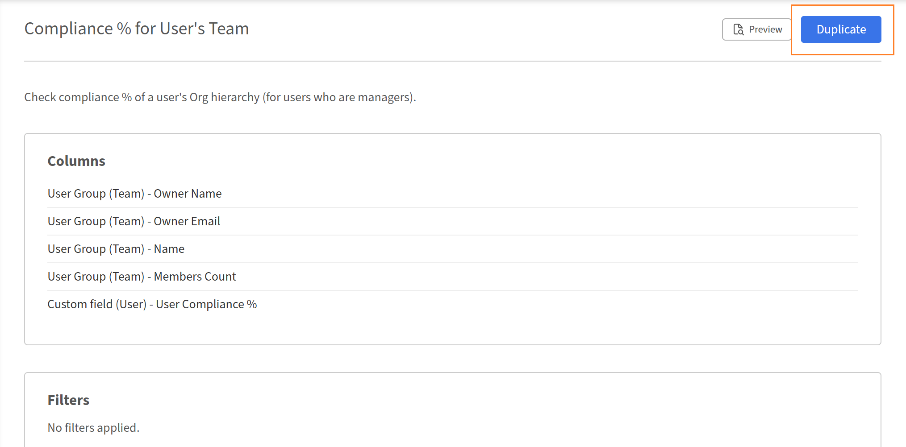

# Introduzione al Report Builder

## Panoramica

Report Builder include 15 modelli predefiniti progettati per i casi d&#39;uso più comuni di reporting dei dati di apprendimento. Ogni modello è una configurazione di report pronta per l&#39;uso con colonne, filtri, impostazioni di raggruppamento e ordinamento già applicati. I modelli sono di sola lettura. Puoi visualizzarli in anteprima o duplicarli per creare una copia modificabile.

## Informazioni sui modelli

I modelli sono configurazioni di report pronte all’uso fornite da Adobe Learning Manager. Ogni modello è progettato per uno specifico caso di utilizzo, come la registrazione e il tracciamento del completamento, la segnalazione della conformità o le prestazioni dell’istruttore. I modelli vengono visualizzati nella scheda **Modelli** nel Report Builder. Ogni modello è creato da uno o più set di dati e produce un tipo specifico di output. Per personalizzare un modello, seleziona **Duplica** per creare una copia modificabile nella scheda **Report** lasciando invariato l&#39;originale.

## Catalogo modelli

### Trascrizione di apprendimento utente

**Categoria:** trascrizioni, monitoraggio completamento e avanzamento

**Descrizione:** completa la cronologia di apprendimento per ogni Allievo, mostrando tutte le iscrizioni, gli stati, i punteggi, le scadenze e il tempo impiegato per tutti i tipi di oggetti di apprendimento.

**Da utilizzare quando:** è necessaria un&#39;esportazione completa dell&#39;attività degli Allievi pronta per l&#39;audit per i controlli di conformità, i casi di supporto degli Allievi o l&#39;integrazione dei dati ALM in un sistema esterno.

**Pubblico interessato:** formazione clienti, formazione partner, formazione dipendenti, abilitazione alle vendite.

**Set di dati utilizzati:** utente, oggetto di apprendimento, trascrizione (oggetto di apprendimento)

**Colonne chiave:** ID utente, nome utente, e-mail utente, nome manager, stato utente, nome oggetto di apprendimento, tipo di oggetto di apprendimento, data di iscrizione, data di completamento, stato, percentuale di avanzamento, punteggio più alto utente, scadenza di completamento, scaduto, tempo trascorso (minuti)

**Filtri applicati:** Data di iscrizione nell&#39;ultimo anno; Catalogo = Catalogo predefinito

### Riepilogo avanzamento Allievo

**Categoria:** trascrizioni, monitoraggio completamento e avanzamento

**Descrizione:** tiene traccia dell’avanzamento di ciascun Allievo rispetto ai percorsi e ai corsi di apprendimento assegnati, inclusa la mappatura della gerarchia tramite l’ID LO principale.

**Da utilizzare quando:** si desidera visualizzare la posizione di ogni Allievo all&#39;interno di un percorso di apprendimento -* che è in corso, che è in ritardo e che rischia di non rispettare una scadenza.

**Pubblico interessato:** formazione clienti, formazione partner, formazione dipendenti, abilitazione alle vendite.

**Set di dati utilizzati:** utente, oggetto di apprendimento, trascrizione (oggetto di apprendimento)

**Colonne chiave:** ID utente, nome utente, e-mail utente, nome manager, ID oggetto di apprendimento, nome oggetto di apprendimento, tipo di oggetto di apprendimento, ID oggetto di apprendimento principale, data di iscrizione, scadenza di completamento, stato, percentuale di avanzamento, scaduto, data di inizio, data di completamento

**Filtri applicati:** data di iscrizione nell’ultimo anno; tipo di oggetto di apprendimento = percorso di apprendimento o corso; catalogo = catalogo predefinito

### Dashboard Allievi attivi

**Categoria:** Coinvolgimento Allievo e utilizzo della piattaforma

**Descrizione:** riepilogo mensile del coinvolgimento della piattaforma per Allievo, con corsi accessibili, completamenti e tempo totale impiegato.

**Da utilizzare quando:** si desidera identificare gli Allievi più e meno impegnati nell&#39;ultimo anno e osservare le tendenze mese per mese del coinvolgimento.

**Pubblico interessato:** formazione clienti, formazione partner, formazione dipendenti, abilitazione alle vendite.

**Set di dati utilizzati:** utente, trascrizione (oggetto di apprendimento)

**Colonne chiave:** ID utente, nome utente, e-mail utente, nome manager, stato utente, data ultimo accesso (mese), corsi univoci a cui si accede, iscrizioni completate, tempo totale trascorso (minuti)

**Filtri applicati:** Data ultimo accesso utente nell&#39;ultimo anno; Stato utente = Attivo; Catalogo = Catalogo predefinito

**Raggruppa per:** campi utente + Mese dell&#39;ultima data di accesso

**Aggregazioni:** Conteggio univoco per ID oggetto di apprendimento (corsi univoci a cui si accede), Conteggio se stato = Completato (iscrizioni completate), Somma sul tempo impiegato (tempo impiegato totale)

### Report Allievi non attivi

**Categoria:** Coinvolgimento Allievo e utilizzo della piattaforma

**Descrizione:** identifica gli utenti attivi che non dispongono di accesso alla piattaforma nell&#39;ultimo anno, mostrando le date di iscrizione e completamento più recenti.

**Da utilizzare quando:** è necessario trovare account inattivi per campagne di reimpegno, revisioni delle licenze o pulizia dell&#39;account.

**Pubblico interessato:** formazione clienti, formazione partner, formazione dipendenti, abilitazione alle vendite.

**Set di dati utilizzati:** utente, trascrizione (oggetto di apprendimento)

**Colonne chiave:** ID utente, nome utente, e-mail utente, nome manager, data creazione utente, data ultimo accesso utente, data ultima iscrizione, data ultimo completamento

**Filtri applicati:** Data ultimo accesso utente NON entro l&#39;anno scorso; Stato utente = Attivo; Catalogo = Catalogo predefinito

**Raggruppa per:** ID utente, nome utente, e-mail utente, nome manager, data creazione utente, data ultimo accesso utente

**Aggregati:** Massimo alla data di iscrizione (data ultima iscrizione), Massimo alla data di completamento (data ultimo completamento)

### Nuova adozione Allievo

**Categoria:** Coinvolgimento Allievo e utilizzo della piattaforma

**Descrizione:** tiene traccia del coinvolgimento degli utenti creati nell&#39;ultimo anno, ad esempio le prime iscrizioni, i completamenti e il totale dei corsi a cui si è effettuato l&#39;accesso.

**Da utilizzare quando:** Si desidera misurare la velocità con cui i nuovi utenti passano dalla creazione dell&#39;account alla prima registrazione e al completamento, una metrica di integrità di onboarding chiave.

**Pubblico interessato:** formazione clienti, formazione partner, formazione dipendenti, abilitazione alle vendite.

**Set di dati utilizzati:** utente, trascrizione (oggetto di apprendimento)

**Colonne chiave:** ID utente, nome utente, e-mail utente, nome manager, data creazione utente, data ultimo accesso utente, data prima iscrizione, data primo completamento, totale corsi seguiti, corsi completati

**Filtri applicati:** Data di creazione utente nell&#39;ultimo anno; Stato utente = Attivo; Catalogo = Catalogo predefinito

>[!NOTE]
>
>Questo modello utilizza un left join tra i set di dati Utente e Trascrizione in modo che gli utenti con zero iscrizioni vengano ancora visualizzati nel report. In questo modo è possibile identificare nuovi utenti che non hanno ancora iniziato il loro percorso di apprendimento.

**Raggruppa per:** ID utente, nome utente, e-mail utente, nome manager, data creazione utente, data ultimo accesso utente

**Aggregati:** Min alla data di iscrizione (data della prima iscrizione), Min alla data di completamento (data del primo completamento), Conteggio univoco su ID oggetto di apprendimento (totale corsi a cui si accede), Conteggio se stato = Completato (corsi completati)

### Apprendimento per gruppo di utenti

**Categoria:** Utenti, gruppi e struttura organizzativa

**Descrizione:** confronta l’attività di apprendimento tra i segmenti dell’organizzazione: allievi attivi, corsi a cui si accede, completamenti e tempo impiegato per gruppo.

**Da utilizzare quando:** si desidera eseguire il benchmark dell&#39;impegno tra reparti, funzioni di processo o qualsiasi gruppo di utenti attivo basato sul campo.

**Pubblico interessato:** formazione clienti, formazione partner, formazione dipendenti, abilitazione alle vendite.

**Set di dati utilizzati:** gruppo di utenti (campo attivo), trascrizione (oggetto di apprendimento)

**Colonne chiave:** ID gruppo utenti, nome gruppo utenti, conteggio membri, Allievi attivi, totale corsi univoci utilizzati, iscrizioni completate, tempo totale impiegato (minuti)

**Filtri applicati:** Data di iscrizione nell&#39;ultimo anno; Catalogo = Catalogo predefinito; Nome gruppo utenti (campo attivo) = Profilo (campo attivo)

**Raggruppa per:** ID gruppo utente, nome gruppo utente, numero membri

**Aggregazioni:** Conteggio univoco su ID utente (Allievi attivi), Conteggio univoco su ID oggetto di apprendimento (Totale corsi univoci a cui si accede), Conteggio se stato = Completato (Iscrizioni completate), Somma sul tempo impiegato (Tempo impiegato totale)

### Apprendimento per posizione

**Categoria:** Utenti, gruppi e struttura organizzativa

**Descrizione:** confronta l’attività di apprendimento tra aree geografiche diverse: Allievi attivi, corsi a cui si accede, completamenti e tempo impiegato per ciascuna posizione.

**Da utilizzare quando:** È necessario eseguire il benchmark dello stato di apprendimento tra aree geografiche senza suddivisione manuale dei dati. Utile per le organizzazioni globali con Allievi geograficamente distribuiti.

**Pubblico interessato:** formazione clienti, formazione partner, formazione dipendenti, abilitazione alle vendite.

**Set di dati utilizzati:** gruppo di utenti (campo attivo), trascrizione (oggetto di apprendimento)

**Colonne chiave:** ID gruppo utenti, nome gruppo utenti, conteggio membri, Allievi attivi, totale corsi univoci utilizzati, iscrizioni completate, tempo totale impiegato (minuti)

**Filtri applicati:** Data di iscrizione nell&#39;ultimo anno; Catalogo = Catalogo predefinito; Nome gruppo utenti (campo attivo) contenente &quot;Posizione&quot;

**Raggruppa per:** ID gruppo utente, nome gruppo utente, numero membri

**Aggregazioni:** Conteggio univoco su ID utente (Allievi attivi), Conteggio univoco su ID oggetto di apprendimento (Totale corsi univoci a cui si accede), Conteggio se stato = Completato (Iscrizioni completate), Somma sul tempo impiegato (Tempo impiegato totale)

### Apprendimento da parte del Manager

**Categoria:** Utenti, gruppi e struttura organizzativa

**Descrizione:** riassume le prestazioni di apprendimento della gerarchia completa del team di ogni manager: Allievi attivi, completamenti e tempo impiegato.

**Da utilizzare quando:** si desidera confrontare il coinvolgimento del team tra i manager e identificare i team con tassi di completamento bassi o tempo impiegato rispetto alle dimensioni del team.

**Pubblico interessato:** formazione dei dipendenti, abilitazione alle vendite.

**Set di dati utilizzati:** gruppo di utenti (team), trascrizione (oggetto di apprendimento)

**Colonne chiave:** ID manager, nome manager, e-mail manager, conteggio membri (team completo), Allievi attivi, totale corsi univoci utilizzati, iscrizioni completate, tempo totale impiegato (minuti)

**Filtri applicati:** Data di iscrizione nell&#39;ultimo anno; Catalogo = Catalogo predefinito

**Raggruppa per:** ID proprietario (ID responsabile), nome proprietario, e-mail proprietario, numero membri

**Aggregazioni:** Conteggio univoco su ID utente (Allievi attivi), Conteggio univoco su ID oggetto di apprendimento (Totale corsi univoci a cui si accede), Conteggio se stato = Completato (Iscrizioni completate), Somma sul tempo impiegato (Tempo impiegato totale)

>[!NOTE]
>
>Questo modello utilizza il set di dati Gruppo utenti (Team), che acquisisce l’intera gerarchia del team sotto ogni Manager. Non è necessario alcun filtro aggiuntivo per il gruppo di utenti.

### Riepilogo iscrizione

**Categoria:** trascrizioni, monitoraggio completamento e avanzamento

**Descrizione:** conteggi delle iscrizioni a livello di corso suddivisi per stato - Completato, In corso e Non avviato - per ogni oggetto di apprendimento.

**Da utilizzare quando:** Si desidera una rapida visualizzazione dell’imbuto di iscrizione per ogni corso: quanti allievi hanno iniziato, quanti in corso e quanti terminati.

**Pubblico interessato:** formazione clienti, formazione partner, formazione dipendenti, abilitazione alle vendite.

**Set di dati utilizzati:** oggetto di apprendimento, trascrizione (oggetto di apprendimento)

**Colonne chiave:** ID oggetto di apprendimento, nome oggetto di apprendimento, tipo di oggetto di apprendimento, stato oggetto di apprendimento, totale Allievi iscritti, iscrizioni completate, iscrizioni in corso, iscrizioni non avviate

**Filtri applicati:** Data di iscrizione nell&#39;ultimo anno; Catalogo = Catalogo predefinito

**Raggruppa per:** ID oggetto di apprendimento, nome, tipo, stato

**Aggregazioni:** Conteggio univoco su ID utente (Totale Allievi iscritti), Conteggio se Stato = Completato, Conteggio se Stato = In corso, Conteggio se Stato = Non avviato

### Analisi andamento iscrizioni

**Categoria:** trascrizioni, monitoraggio completamento e avanzamento

**Descrizione:** il conteggio mensile di iscrizione e completamento per oggetto di apprendimento mostra l’evoluzione nel tempo dell’assorbimento da parte degli Allievi.

**Utilizzare quando:** Si desidera visualizzare i picchi e le dissolvenze delle iscrizioni per ogni corso e se i completamenti seguono le iscrizioni nello stesso mese.

**Pubblico interessato:** formazione clienti, formazione partner, formazione dipendenti, abilitazione alle vendite.

**Set di dati utilizzati:** oggetto di apprendimento, trascrizione (oggetto di apprendimento)

**Colonne chiave:** Nome oggetto di apprendimento, Tipo di oggetto di apprendimento, Data di iscrizione (mese), Totale Allievi iscritti, Iscrizioni completate

**Filtri applicati:** Data di iscrizione nell&#39;ultimo anno; Catalogo = Catalogo predefinito

**Raggruppa per:** nome oggetto di apprendimento, tipo di oggetto di apprendimento, mese della data di iscrizione

**Aggregazioni:** Conteggio univoco su ID utente (Totale Allievi iscritti), Conteggio se stato = Completato (Iscrizioni completate)

### Report completamento corso

**Categoria:** trascrizioni, monitoraggio completamento e avanzamento

**Descrizione:** analisi stratificata per completamento del corso con conteggi dello stato, data dell&#39;ultimo completamento, avanzamento medio e tempo medio impiegato.

**Da utilizzare quando:** si desidera identificare i contenuti con prestazioni insufficienti, ovvero i corsi con un&#39;iscrizione elevata ma un completamento insufficiente o i corsi in cui il progresso medio è basso (che indicano un abbandono anticipato).

**Pubblico interessato:** formazione clienti, formazione partner, formazione dipendenti, abilitazione alle vendite.

**Set di dati utilizzati:** oggetto di apprendimento, trascrizione (oggetto di apprendimento)

**Colonne chiave:** ID dell’oggetto di apprendimento, nome dell’oggetto di apprendimento, tipo di oggetto di apprendimento, stato dell’oggetto di apprendimento, totale degli Allievi iscritti, iscrizioni completate, iscrizioni in corso, iscrizioni non avviate, data ultimo completamento, avanzamento medio, tempo medio impiegato (minuti)

**Filtri applicati:** Data di iscrizione nell&#39;ultimo anno; Catalogo = Catalogo predefinito

**Raggruppa per:** ID oggetto di apprendimento, nome, tipo, stato

**Aggregazioni:** Conteggio univoco per ID utente, Conteggio se stato = Completato/In corso/Non avviato, Data di completamento massima, Percentuale avanzamento medio, Tempo impiegato medio

### Pannello di controllo Tendenza completamento

**Categoria:** trascrizioni, monitoraggio completamento e avanzamento

**Descrizione:** conteggi mensili dei completamenti per oggetto di apprendimento, con tempo medio impiegato e avanzamento, con ambito limitato alle iscrizioni completate.

**Da utilizzare quando:** Si desidera verificare se i tassi di completamento stanno aumentando di mese in mese e se gli Allievi che terminano lo fanno completamente o in fretta.

**Pubblico interessato:** formazione clienti, formazione partner, formazione dipendenti, abilitazione alle vendite.

**Set di dati utilizzati:** oggetto di apprendimento, trascrizione (oggetto di apprendimento)

**Colonne chiave:** Nome oggetto di apprendimento, tipo di oggetto di apprendimento, data di completamento (mese), totale Allievi completati, tempo medio impiegato (minuti), avanzamento medio %

**Filtri applicati:** Data di completamento nell&#39;ultimo anno; Stato = Completato; Catalogo = Catalogo predefinito

**Raggruppa per:** nome oggetto di apprendimento, tipo di oggetto di apprendimento, data mese di completamento

**Aggregazioni:** Conteggio univoco su ID utente (Totale Allievi completati), Tempo medio impiegato, Percentuale media su avanzamento

>[!NOTE]
>
>Questo modello viene filtrato in base allo stato Completato prima del raggruppamento, in modo da includere solo i record con una data di completamento valida e da evitare che le date nulle determinino una distorsione della tendenza mensile.

### Tempo al completamento

**Categoria:** trascrizioni, monitoraggio completamento e avanzamento

**Descrizione:** misura il tempo effettivo impiegato per completare ogni corso, in media, minimo e massimo, rispetto alla durata prevista.

**Da utilizzare quando:** Si desidera identificare i corsi in cui gli Allievi impiegano molto più tempo o meno del previsto per completare, il che potrebbe indicare la lunghezza del contenuto o problemi.

**Pubblico interessato:** formazione clienti, formazione partner, formazione dipendenti, abilitazione alle vendite.

**Set di dati utilizzati:** oggetto di apprendimento, trascrizione (oggetto di apprendimento)

**Colonne chiave:** ID oggetto di apprendimento, nome dell’oggetto di apprendimento, tipo di oggetto di apprendimento, durata (minuti pianificati), totale Allievi completati, tempo medio impiegato (minuti), tempo minimo impiegato (minuti), tempo massimo impiegato (minuti)

**Filtri applicati:** Data di completamento nell&#39;ultimo anno; Stato = Completato; Catalogo = Catalogo predefinito

**Raggruppa per:** ID oggetto di apprendimento, nome, tipo, durata (minuti)

**Aggregazioni:** Conteggio univoco per ID utente, Media/Min/Max per tempo impiegato

**Nota:** la durata (la durata prevista del corso) è inclusa nel campo Raggruppa per in modo che venga visualizzata nella stessa riga del tempo effettivamente impiegato, consentendo il confronto diretto senza un campo calcolato. Un ampio divario tra il tempo minimo e massimo impiegato suggerisce esperienze incoerenti degli Allievi.

### Assegnazioni di apprendimento scadute

**Categoria:** conformità e certificazione

**Descrizione:** elenca gli utenti attivi con iscrizioni obbligatorie scadute, indicando la scadenza, lo stato corrente e l&#39;avanzamento per ciascuno di essi.

**Da utilizzare quando:** è necessario un elenco actionable di Allievi non conformi per inoltrare il problema ai Manager o attivare flussi di lavoro di ri-iscrizione.

**Gruppi di destinatari interessati:** formazione dei partner, formazione dei dipendenti, abilitazione alle vendite.

**Set di dati utilizzati:** utente, gruppo di utenti (campo attivo), oggetto di apprendimento, trascrizione (oggetto di apprendimento)

**Colonne chiave:** ID utente, nome utente, e-mail utente, nome manager, nome gruppo di utenti (campo attivo), ID oggetto di apprendimento, nome oggetto di apprendimento, tipo di oggetto di apprendimento, data di iscrizione, scadenza di completamento, stato, percentuale di avanzamento, scaduto

**Filtri applicati:** Scaduto = Sì; Stato = In corso O Non avviato; Scadenza per il completamento nell&#39;ultimo anno; Catalogo = Catalogo predefinito; Stato utente = Attivo; Nome gruppo utenti (campo attivo) = Profilo (campo attivo)

**Nessun gruppo applicato** L’output è una riga per ogni iscrizione scaduta, mantenendo tutti i dettagli dell’Allievo e del corso per l’escalation.

>[!NOTE]
>
>Il filtro Stato (In corso O Non avviato) funge da protezione per escludere eventuali record erroneamente contrassegnati come scaduti nonostante siano stati completati.

### Stato del corso di formazione obbligatorio

**Categoria:** conformità e certificazione

**Descrizione:** visualizzazione completa della conformità di tutte le iscrizioni con una scadenza di completamento, con tutti gli stati inclusi, non solo scaduti.

**Da utilizzare quando:** È necessario un quadro di conformità completo anziché solo violazioni, ad esempio per segnalare ai dirigenti i tassi di completamento della formazione obbligatoria complessiva.

**Pubblico interessato:** formazione dei dipendenti, abilitazione alle vendite.

**Set di dati utilizzati:** utente, gruppo di utenti (campo attivo), oggetto di apprendimento, trascrizione (oggetto di apprendimento)

**Colonne chiave:** ID utente, nome utente, e-mail utente, nome manager, nome gruppo di utenti (campo attivo), ID oggetto di apprendimento, nome oggetto di apprendimento, tipo di oggetto di apprendimento, data di iscrizione, scadenza di completamento, data di completamento, stato, percentuale di avanzamento, scaduto

**Filtri applicati:** La scadenza di completamento non è vuota; la data di iscrizione è compresa nell&#39;ultimo anno; Catalogo = Catalogo predefinito; Stato utente = Attivo; Nome gruppo utenti (campo attivo) = Profilo (campo attivo)

**Nessun gruppo applicato** Tutti gli stati inclusi (completato, in corso, non avviato, scaduto), fornendo un quadro di conformità completo.

**Nota:** il filtraggio in base a &quot;La scadenza di completamento non è vuota&quot; è la logica chiave che identifica in modo coerente i corsi di formazione obbligatori in tutti i tipi di corso, indipendentemente dalla configurazione dello stato obbligatorio.

## Riferimento rapido modello

| **#** | **Nome modello** | **Categoria** | **Modifica interna** | **Esterno (cliente/partner) edu** |
|--------|------------------------------|-------------------------------------|------------------|-------------------------------------|
| 1 | Trascrizione di apprendimento utente | Trascrizioni, completamento e avanzamento | ✓ | ✓ |
| 2 | Riepilogo avanzamento Allievo | Trascrizioni, completamento e avanzamento | ✓ | ✓ |
| 3 | Dashboard Allievi attivi | Coinvolgimento degli Allievi e utilizzo della piattaforma | ✓ | ✓ |
| 4 | Report Allievi non attivi | Coinvolgimento degli Allievi e utilizzo della piattaforma | ✓ | ✓ |
| 5 | Nuova adozione Allievo | Coinvolgimento degli Allievi e utilizzo della piattaforma | ✓ | ✓ |
| 6 | Apprendimento per gruppo di utenti | Utenti, gruppi e struttura organizzativa | ✓ | ✓ |
| 7 | Apprendimento per posizione | Utenti, gruppi e struttura organizzativa | ✓ | ✓ |
| 8 | Apprendimento da parte del Manager | Utenti, gruppi e struttura organizzativa | ✓ | ✗ |
| 9 | Riepilogo iscrizione | Trascrizioni, completamento e avanzamento | ✓ | ✓ |
| 10 | Analisi andamento iscrizioni | Trascrizioni, completamento e avanzamento | ✓ | ✓ |
| 11 | Report completamento corso | Trascrizioni, completamento e avanzamento | ✓ | ✓ |
| 12 | Pannello di controllo Tendenza completamento | Trascrizioni, completamento e avanzamento | ✓ | ✓ |
| 13 | Tempo al completamento | Trascrizioni, completamento e avanzamento | ✓ | ✓ |
| 14 | Assegnazioni di apprendimento scadute | Conformità e certificazione | ✓ | ✓ |
| 15 | Stato del corso di formazione obbligatorio | Conformità e certificazione | ✓ | ✗ |

## Utilizzare un modello di Report Builder

Inizia rapidamente con Adobe Learning Manager Report Builder personalizzando un modello predefinito per i casi d&#39;uso più comuni relativi ai report.

1. Accedi a Adobe Learning Manager come amministratore.
2. Seleziona **Report** nel riquadro a sinistra, quindi seleziona **Report Builder**.

3. Selezionare la scheda **Modelli**.
4. Sfoglia i modelli disponibili. A ogni modello viene assegnato un nome specifico.

   

5. Seleziona il nome di un modello per aprirne l’anteprima di sola lettura. Per questo esempio, seleziona il modello **% conformità per il team dell&#39;utente**. Esaminate le colonne, i filtri applicati e l’ordinamento.
6. Seleziona **Duplica**.

   

Quando si duplica un modello, Report Builder apre una copia modificabile con la configurazione esistente del modello precaricata. Il nome, la descrizione, le colonne, i filtri e l’ordinamento del report sono tutti modificabili prima del salvataggio.

## Assegnare un nome al report e descriverlo

1. Nel campo **Nome**, sostituisci il nome predefinito (ad esempio, *copia della % di conformità per il team dell&#39;utente*) con un nome univoco per il report. È necessario specificare un nome.
2. Nel campo **Descrizione**, immettere un breve riepilogo del contenuto del report. Questo aiuta gli altri amministratori a comprendere lo scopo del report quando lo visualizzano o lo modificano.

## Aggiungere e configurare le colonne

La sezione **Colonne** dispone di due pannelli: **Seleziona colonne** a sinistra e **Colonne selezionate** a destra.

### Aggiungere una colonna

1. Nel pannello **Seleziona colonne**, espandere un set di dati selezionandone il nome. Ad esempio, **Catalogo** o **Gruppo di utenti attivi**.
2. Selezionare l&#39;icona **+** accanto alla colonna che si desidera aggiungere. La colonna viene visualizzata nel pannello **Colonne selezionate** a destra.

   

3. Per aggiungere più volte la stessa colonna. Ad esempio, per applicare due aggregazioni diverse allo stesso campo. Selezionare nuovamente **+** per la colonna.

### Riordina colonne

Trascinate la maniglia a sinistra di qualsiasi riga di colonna nel pannello **Colonne selezionate** per spostarla in una posizione diversa. L’ordine delle colonne nel pannello corrisponde a quello nel report scaricato.

### Rinominare una colonna

1. Seleziona l&#39;icona **modifica** (matita) su una riga di colonna.

   

2. Immettere un alias. L’alias viene visualizzato come intestazione di colonna nel report scaricato anziché come nome di campo predefinito.

   

### Rimuovere una colonna

Seleziona l&#39;icona **x** su una riga di colonna per rimuoverla dal report.

## Applica gruppo per

Il controllo **Raggruppa per** viene visualizzato nella parte superiore del pannello **Colonne selezionate**.

1. Seleziona **Raggruppa per: Seleziona**.

   

2. Selezionare le colonne in base alle quali eseguire il raggruppamento. Potete selezionare più opzioni. Nella schermata, il report è raggruppato per nome del gruppo di utenti (team) e nome del gruppo di utenti (team)-proprietario.
3. Ogni colonna selezionata viene visualizzata come tag sotto il controllo **Raggruppa per**. Per rimuovere una colonna raggruppata, selezionare **x** nel tag corrispondente.

>[!NOTE]
>
>Quando si applica GroupBy, a ogni colonna che non è una colonna group-by deve essere applicata una funzione di aggregazione. Una colonna senza un&#39;aggregazione genererà un errore.

### Applicare un&#39;aggregazione a una colonna

1. In qualsiasi colonna non raggruppata nel pannello **Colonne selezionate**, selezionare **Aggrega per**.
2. Scegli una funzione dal menu a discesa. Nello screenshot, **Il conteggio degli oggetti di apprendimento** utilizza **Count Distinct**, con alias count_of_courses.

   

Funzioni di aggregazione disponibili:

| **Funzione** | **Elementi restituiti** |
|--------------------|---------------------------------------------|
| **Conteggio** | Numero totale di righe nel gruppo |
| **Distinto conteggio** | Numero di valori univoci nel gruppo |
| **Conteggio Se** | Numero di righe corrispondenti a un valore specificato |
| **Somma** | Totale di un campo numerico nel gruppo |
| **Min** | Valore più basso nel gruppo |
| **Max** | Valore massimo nel gruppo |
| **Media** | Valore medio nel gruppo |

## Applica filtri

La sezione **Filtri** si trova sotto la sezione **Colonne**. I filtri limitano le righe visualizzate nel report.

1. Per aggiungere un filtro, seleziona l&#39;icona **+** a destra della sezione Filtri.
2. Scegli il campo su cui filtrare.

   

3. Selezionare un operatore e immettere o scegliere un valore.

Per modificare un filtro esistente, selezionare l&#39;icona **matita** nella riga del filtro. Per aggiungere un gruppo di filtri nidificato, seleziona l&#39;icona **+** con parentesi quadre a destra di una riga di filtro.

## **Configura ordinamento**

La sezione **Ordinamento** si trova sotto la sezione **Filtri**.

1. Selezionare **+ Aggiungi ordinamento** per aggiungere un ordinamento.
2. Scegli la colonna in base alla quale eseguire l&#39;ordinamento e seleziona **Crescente** o **Decrescente**.

   

3. Ripetete per aggiungere ordinamenti secondari. Trascinare la maniglia a sinistra di ogni riga di ordinamento per modificare la priorità.

>[!TIP]
>
>Applicare sempre almeno un ordinamento. Senza ordinamento, l&#39;ordine delle righe può differire tra i download dello stesso report.

## Salvare il report

Seleziona **Salva report** nell’angolo in alto a destra. Il report è stato salvato nella scheda **Report** ed è pronto per il download.

## Procedure ottimali

* Utilizza gli alias in ogni colonna in modo che il report scaricato contenga intestazioni significative anziché nomi di campo come Oggetto di apprendimento - ID oggetto di apprendimento.
* Utilizza **Count Distinct** invece di **Count** quando desideri record univoci, ad esempio corsi distinti per catalogo anziché righe totali.

* Applica l’ordinamento prima del salvataggio, in particolare per i report che condividerai o a cui ti iscrivi.
* Mantenete la descrizione aggiornata. Altri amministratori si basano su di esso per comprendere l’ambito del report senza aprirlo.
