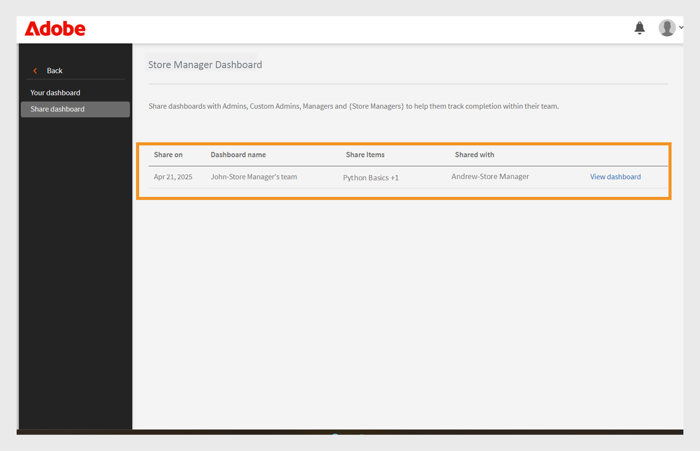

# Dashboard di Group Success

## Panoramica del dashboard di Group Success

La Dashboard di successo dei gruppi (GSD) in Adobe Learning Manager consente agli amministratori e ai manager di monitorare i progressi degli Allievi in tempo quasi reale (60 minuti di ritardo dall’iscrizione, dall’avanzamento o dal completamento alla riflessione sul dashboard) in tutti i reparti o gruppi di utenti. Supporta il tracciamento proattivo del completamento del corso, l’iscrizione e le azioni in sospeso, semplificando la gestione dell’apprendimento per i team. Per ulteriori informazioni sui gruppi di utenti, consulta questo [articolo](/help/migrated/administrators/feature-summary/add-users-user-groups.md).

## Principali casi d’uso

Il dashboard Group Success offre quanto segue:

* **Semplifica il monitoraggio dell’avanzamento degli Allievi**: la dashboard Gruppi riusciti offre una visualizzazione semplice e in tempo reale dei dati degli Allievi, riducendo la necessità di trascrizioni basate su Excel. Manager e amministratori possono visualizzare rapidamente le iscrizioni degli Allievi e l’avanzamento dei corsi per supportare scenari chiave quali:

   * **Preparazione alla revisione delle prestazioni**: i manager possono valutare lo stato di avanzamento del corso per i membri del team prima dei cicli di valutazione.
   * **Monitoraggio della conformità**: identifica gli Allievi che non hanno completato i corsi di formazione obbligatori.
   * **Monitoraggio a livello di team**: i manager di affiliazione, punto vendita o locali possono garantire che i team completino il corso richiesto in tempo.

* **Facilita la gestione del team**: la dashboard di successo del gruppo è utile per i manager con piccoli team (meno di 50 persone), come i manager di punti vendita, i manager di franchising, i manager di concessionari o i team interni. Fornisce una visualizzazione del team e consente ai manager di verificare rapidamente se il proprio team ha completato il set di corsi richiesto per raggiungere gli obiettivi aziendali.

## Come utilizzare la Dashboard di Group Success

Un amministratore può abilitare e creare i dashboard assegnando un nome, selezionando i gruppi di utenti e scegliendo i corsi o i percorsi di apprendimento. I dashboard possono essere condivisi con altri amministratori o manager.

### Abilita dashboard di Group Success

L’Amministratore deve abilitare la Dashboard di successo del gruppo per l’account. Per abilitare la Dashboard di Group Success, effettua le seguenti operazioni:

1. Accedi come amministratore.
2. Seleziona **[!UICONTROL Impostazioni]**quindi seleziona **[!UICONTROL Report]**.
3. Selezionare l&#39;interruttore **[!UICONTROL Visibilità dashboard]**.
4. Digitare il nome del dashboard, ad esempio **[!UICONTROL Dashboard di Gestione archivi]**.
   
   _Campi per il nome del dashboard, il gruppo di utenti e la selezione del percorso di apprendimento_
5. Selezionare **[!UICONTROL Visibilità panoramica]** per abilitare la sezione della panoramica nel dashboard. Questa sezione consente di visualizzare l’avanzamento di un massimo di 50 Allievi.
6. Per la sezione **[!UICONTROL Trascrizione Allievo]**, seleziona le colonne richieste che desideri visualizzare.

   * Allievo
   * Percorsi e corsi
   * Stato
   * Data di iscrizione
   * Data dell’ultimo accesso
   * Data di completamento

Dopo aver abilitato questa funzione, gli amministratori possono visualizzare la Dashboard di Group Success nella sezione **[!UICONTROL Report]**.

### Dashboard per la creazione di un gruppo riuscito

Gli Amministratori possono creare fino a 100 dashboard per visualizzare l’avanzamento degli Allievi. Per creare un dashboard, attieniti alla seguente procedura:

1. Accedi come amministratore e seleziona la pagina **[!UICONTROL Report]**.

   
   _Selezionare i report nella home page dell&#39;amministratore_

2. Seleziona la dashboard Group Success. Il nome del dashboard è **[!UICONTROL Dashboard di Gestione archivi]**.

   
   _Selezionare il dashboard di Gestione archivi_

   >[!NOTE]
   >
   >Il nome impostato quando si abilita la Dashboard di Group Success verrà visualizzato come nome della dashboard.

3. Selezionare **[!UICONTROL Crea nuovo dashboard]** dall&#39;elenco a discesa Seleziona dashboard.

   
   _Selezionare l&#39;opzione per creare un DSGP_

4. Digitare il nome del dashboard.
5. Selezionare un gruppo di utenti da visualizzare nel dashboard.
6. Cerca corsi o percorsi di apprendimento e selezionali dai risultati.

   
   _Selezionare il gruppo di utenti e i corsi_

7. Selezionare **[!UICONTROL Crea dashboard]**.

Per i team più grandi, crea una dashboard selezionando il gruppo di utenti **Catalogo predefinito** e **Tutti gli Allievi** nella scheda **[!UICONTROL Trascrizione Allievo]**. Questo include tutti i corsi e gli Allievi nella visualizzazione **[!UICONTROL Trascrizione Allievo]**, rendendo più facile la ricerca e la registrazione dell’avanzamento di ciascun Allievo.

### Visualizza dashboard di Group Success

Dopo aver creato un dashboard, l’amministratore può visualizzarlo seguendo questi passaggi:

1. Accedi come amministratore.
2. Selezionare **[!UICONTROL Report]** e quindi **[!UICONTROL Dashboard di successo del gruppo]**.
Il nome del dashboard è Dashboard di Store Manager.
3. Nella sezione **[!UICONTROL I dashboard]**, seleziona il dashboard creato dal menu a discesa **[!UICONTROL Seleziona dashboard]**.
4. Il dashboard è suddiviso in:
   * **[!UICONTROL Panoramica]**: puoi visualizzare rapidamente l’avanzamento degli Allievi in singoli corsi o percorsi di apprendimento. Puoi visualizzare l’avanzamento fino a 50 corsi o percorsi di apprendimento e 50 Allievi contemporaneamente. Per verificare l’avanzamento di un allievo specifico, seleziona la sezione **[!UICONTROL Trascrizione Allievo]**.

   
   _Stato di apprendimento degli Allievi nel team dello Store Manager_

   * **[!UICONTROL Trascrizione Allievo]**: visualizza l’avanzamento dell’Allievo selezionando un Allievo o un corso specifico. Cerca un Allievo nel dashboard per controllare lo stato di avanzamento dell’apprendimento. Se hai creato la dashboard utilizzando il catalogo predefinito e hai incluso tutti gli Allievi, puoi cercare qualsiasi Allievo per verificare facilmente l’avanzamento.

   
   _Visualizzazione dettagliata della trascrizione dell’Allievo con colonne per l’iscrizione e il completamento_

>[!NOTE]
>
>Per scaricare la Trascrizione Allievo dettagliata, seleziona **[!UICONTROL Vai a report]** nella scheda **[!UICONTROL Trascrizione Allievo]**.

### Condividere il dashboard Group Success

Gli amministratori possono condividere i dashboard con altri amministratori o manager. Segui i passaggi per condividere un dashboard:

1. Selezionare **[!UICONTROL Report]** e quindi **[!UICONTROL Dashboard di successo del gruppo]**. Il nome del dashboard è **[!UICONTROL Dashboard di Gestione archivi]**.
2. Seleziona **[!UICONTROL Condividi]** nell&#39;opzione **[!UICONTROL I tuoi dashboard]**.

   
   _Selezionare il pulsante Condividi_

3. Cerca gli utenti o i gruppi di utenti per nome e selezionali.

   
   _Condividere il dashboard con utenti o gruppi di utenti_

4. Seleziona **[!UICONTROL Procedi]** per condividere il dashboard.

È possibile visualizzare i dettagli della dashboard condivisa in **[!UICONTROL Report]**, selezionare **[!UICONTROL Dashboard di successo del gruppo]** (Dashboard di Gestione archivi) e quindi selezionare **[!UICONTROL Dashboard condivisi]**.

_Visualizza dashboard condiviso_

>[!NOTE]
>
>Il manager o l’amministratore personalizzato può visualizzare solo i cataloghi abilitati nel Dashboard di Group Success condiviso dall’amministratore.

### Limitazioni del dashboard di successo del gruppo

Di seguito sono riportate le limitazioni del dashboard Group Success:

* I certificati ricorrenti non sono supportati nel dashboard.
* Nella colonna **[!UICONTROL Data ultimo accesso]** della scheda **[!UICONTROL Trascrizione Allievo]** sono attualmente visualizzati i dati per i percorsi di apprendimento e le certificazioni. Il supporto per i corsi è previsto per un aggiornamento futuro.

## Selezione degli Allievi in più gruppi di utenti

Quando selezioni più di un gruppo di utenti, Adobe Learning Manager utilizza regole specifiche per determinare quali Allievi includere:

* **Gruppi di utenti con lo stesso campo Attivo**: se i gruppi di utenti utilizzano lo stesso campo (ad esempio, Posizione), il sistema include tutti gli allievi di entrambi i gruppi. Combina i valori. Ad esempio: **Posizione = Bangalore** e **Posizione = Chennai**. Include allievi di entrambe le posizioni.
* **Gruppi di utenti con campi attivi diversi**: se i gruppi di utenti utilizzano campi diversi (ad esempio, Posizione e Ruolo), il sistema include solo gli Allievi che soddisfano tutte le condizioni. Ad esempio: **Posizione = Bangalore o Chennai** e **Ruolo = Manager**. Include solo gli Allievi con il ruolo di Manager che si trovano a Bangalore o Chennai.

**Riepilogo:**

* Stesso campo attivo: gli Allievi sono combinati (logica OR)
* Campi attivi diversi: gli Allievi devono soddisfare tutti i criteri (logica AND)

Questo approccio ti aiuta a indirizzare gli Allievi giusti in base alle condizioni selezionate.
