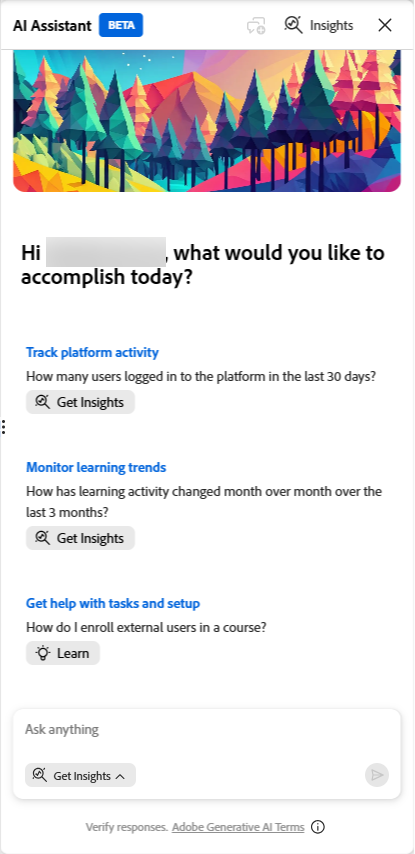
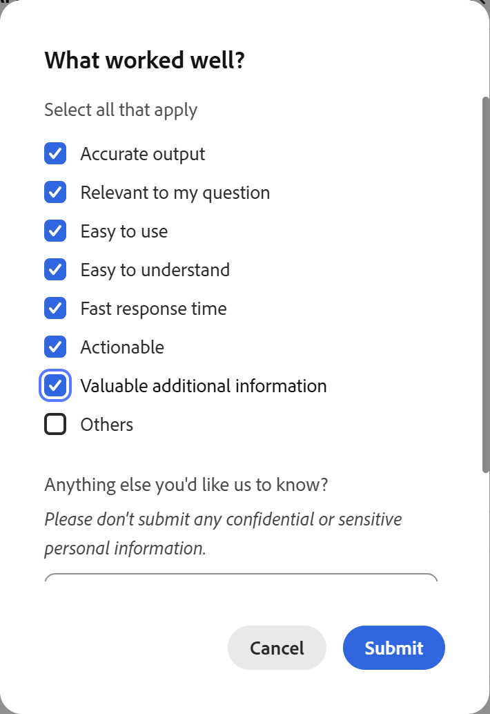

# Che cos&#39;è Insights Agent

Insights Agent è una funzione basata sull&#39;intelligenza artificiale in Adobe Learning Manager che consente agli amministratori di eseguire query sui dati degli Allievi utilizzando il linguaggio naturale. Invece di scaricare report e manipolare fogli di calcolo, digita una domanda, come ad esempio: &quot;Quanti corsi sono stati creati negli ultimi 3 mesi nell’account? Dammi un rapporto mensile&quot;. E Insights Agent recupera e presenta direttamente i dati. È possibile visualizzare i risultati come tabelle o scaricarli come file CSV.

Insights Agent è progettato per ridurre i passaggi tra l&#39;avere una domanda di dati e ottenere una risposta. Gli amministratori che attualmente si basano su pivot di Excel, team BI o più report combinati possono utilizzare Insights Agent per ottenere risposte più rapide.

## Funzionalità di Insights Agent

È possibile utilizzare Insights Agent per:

- Verifica metriche di completamento e conformità per area geografica, reparto o gruppo di utenti
- Analisi delle tendenze delle iscrizioni tra i programmi di apprendimento
- Visualizzare i dati di avanzamento per un corso o percorso di apprendimento specifico
- Recuperare i risultati in una tabella o come file CSV scaricabile
- Ottieni una spiegazione in linguaggio semplice di come sono stati calcolati i risultati

## Elementi non supportati da Data Insights Agent

I seguenti tipi di dati non rientrano nell&#39;ambito di questa versione:

- Feedback e dati dei sondaggi
- Punti di gamification e distintivi
- Cronologia dei controlli e registri delle modifiche

Le query che fanno riferimento a questi tipi di dati non restituiranno risultati. Ad esempio, &quot;Quanti punti di gamification sono stati assegnati lo scorso trimestre?&quot; o &quot;Quali Allievi hanno ottenuto un badge di conformità?&quot; restituirà un errore o dati incompleti.

## Differenze tra Agente Insights e Report Builder

Entrambe le funzioni utilizzano gli stessi dati di apprendimento sottostanti, ma funzionano in modo diverso. L&#39;agente di Insights è di tipo conversazionale. Descrivi ciò che desideri e l&#39;agente lo recupera. Report Builder strutturato. È possibile selezionare set di dati, colonne e filtri per creare report riutilizzabili.

| **Caso di utilizzo** | **Consiglio** |
|---|---|
| Fai una domanda veloce sui dati | Agente Insights |
| Esplorazione dei dati senza conoscere lo schema | Agente Insights |
| Creazione di un report strutturato e ripetibile | Report Builder |
| Combinare più dataset con join personalizzati | Report Builder |
| Pianificare le sottoscrizioni ai report | Report Builder |
| Combinare i dataset con join personalizzati o modellazione avanzata dei dati | Report Builder |

**IMPORTANTE**: l&#39;integrazione tra Agente Insights e Report Builder è prevista per una versione futura e non è disponibile nella beta corrente.

## Funzionamento di Insights Agent

Quando inserisci una domanda, Insights Agent la elabora in quattro fasi:

1. **Interpretazione**: l&#39;agente analizza la domanda per identificare i dati necessari. Se una qualsiasi parte della domanda è ambigua, l&#39;agente ti pone una domanda chiarificatrice prima di procedere

2. **Approccio**: l&#39;agente descrive i passaggi necessari per trovare la risposta. Questa sezione consente di verificare che i dati siano stati recuperati nel modo desiderato, in particolare per le query complesse.

3. **Risultati**: l&#39;agente presenta i dati come una tabella. Se i risultati contengono un massimo di 50 righe, è possibile includere un riepilogo in linguaggio semplice.

4. **Scarica**: puoi scaricare i risultati come file CSV. I report di grandi dimensioni possono richiedere più tempo; l’agente invia una notifica quando il file è pronto.

La sezione **Approccio** è particolarmente utile per le query complesse. Viene mostrata la logica utilizzata dall&#39;agente, simile a quella che un analista BI spiegherebbe se eseguisse la query manualmente. L’analisi dell’approccio consente di verificare che l’output sia affidabile prima di agire.

## Domande con Insights Agent

Utilizza Insights Agent in Adobe Learning Manager per interrogare i dati degli allievi con domande in linguaggio semplice e ottenere risultati come testo, tabelle o file CSV scaricabili.

L’agente di Insights è disponibile per gli amministratori dal pannello Assistente intelligenza artificiale in Learning Manager. Il pannello è ridimensionabile. Puoi espanderlo per rendere i risultati più leggibili. Per impostazione predefinita, la modalità **Ottieni informazioni dettagliate** è selezionata all&#39;apertura del pannello. È disponibile anche una modalità **Scopri** separata per domande su come utilizzare il prodotto. La modalità **Scopri** risponde alle domande delle istruzioni su come utilizzare Learning Manager. Ad esempio, &quot;Come si crea un percorso di apprendimento?&quot; Non esegue query sui dati dell’Allievo.

### Fai una domanda

Quando la modalità **Ottieni informazioni dettagliate** è selezionata per impostazione predefinita, puoi iniziare immediatamente a eseguire query sui dati dell’Allievo senza dover regolare la modalità ogni volta che accedi all’Assistente. Tuttavia, se passate alla modalità **Apprendimento** per domande istruttive, assicuratevi di selezionare nuovamente **Ottieni informazioni** prima di inviare una query.

1. Seleziona l’icona Assistente AI in Learning Manager per aprire il pannello Assistente.

2. Seleziona **Get Insights** nel selettore modalità, se non è già selezionato per impostazione predefinita.
   

3. Digita la domanda nel campo di testo. Usa un linguaggio semplice. Ad esempio: **Quanti corsi sono stati creati negli ultimi 3 mesi?**

4. Seleziona **Invia** o premi **Invio** per inviare la domanda.

### Rivedi la risposta

Dopo aver inviato la tua domanda, Insights Agent elabora la tua richiesta e restituisce una risposta con un massimo di quattro parti:

1. **Disambiguazione (se necessario):** se la domanda contiene un termine ambiguo, ad esempio \&quot;attività di apprendimento\&quot; o \&quot;prestazioni\&quot; o &quot;Assegnami dati sulle prestazioni degli ultimi 3 mesi&quot;, l&#39;assistente visualizza un elenco di opzioni e richiede di selezionarne una prima di procedere. Seleziona l’opzione che corrisponde meglio a ciò che stai cercando. Dopo la domanda iniziale, non è possibile digitare istruzioni aggiuntive. La selezione dalle opzioni fornite rappresenta l&#39;unica interazione disponibile fino a quando non si avvia una nuova query utilizzando l&#39;interfaccia query. Puoi rispondere alla rimozione delle ambiguità solo selezionando una delle opzioni fornite; il follow-up a testo libero non è disponibile in questa versione.

&#x200B;2. **Approccio:** La sezione **Approccio** descrive i passaggi eseguiti dall&#39;agente per recuperare i dati. Viene visualizzato come pannello scorrevole sotto la domanda. Seleziona l’icona Espandi per visualizzare l’approccio completo. L&#39;analisi di questa sezione consente di confermare che la logica corrisponde all&#39;intento, in particolare per le query complesse. Ad esempio, se richiedi \&quot;tutti gli Allievi iscritti nell’ultimo anno&quot;,\&quot; l’agente può restituire l’iscrizione più recente di ogni Allievo anziché ogni record di iscrizione. La sezione **Approccio** **maggio** o **spiegherà** tale decisione. Se la logica non corrisponde all&#39;intento, avviare una nuova query con termini più specifici.

&#x200B;3. **Risultati:** L&#39;agente Insights genera i risultati come testo o tabella. Per le coordinate interpretate in modo ottimale in formato tabulare, l&#39;agente Insights restituisce una tabella. Insights Agent non genera grafici o grafici. Per visualizzare i dati, scarica il file CSV e aprilo nello strumento che preferisci. Se i risultati contengono un massimo di 50 righe, è possibile includere un riepilogo in linguaggio semplice sopra la tabella. Ad esempio, \&quot;Quali corsi non hanno meno di 5 iscrizioni create nell’ultimo anno e chi sono gli autori?\&quot;

La risposta contiene il seguente riepilogo:

***Riepilogo***

- *Corsi corrispondenti: 102*
- *Intervallo conteggio iscrizioni: da 24 a 2019*
- *Media iscrizioni per corso corrispondente: 589,6*
- *Iscrizioni mediane per corso corrispondente: 553.5*

*Una volta completata l&#39;esportazione, verrà fornito un collegamento per il download del report completo.*

**Nota:** l&#39;agente Insights è probabilistico. Se si esegue la stessa query due volte, la formulazione delle risposte o l&#39;ordinamento dei risultati potrebbe essere leggermente diverso. I dati sottostanti recuperati sono gli stessi, ma l’output può variare tra le esecuzioni.

### Scarica il report

Seleziona **Scarica report** per esportare i risultati come file CSV. Per set di risultati di grandi dimensioni, il download potrebbe richiedere più tempo. L&#39;agente visualizza un messaggio quando il file è pronto. Viene inoltre visualizzata una notifica.

## Avvia una nuova query

Ogni sessione di Insights Agent gestisce una domanda alla volta. Dopo aver esaminato i risultati, seleziona **Nuova domanda** per porre un&#39;altra domanda. Non è possibile digitare una domanda di follow-up nella stessa sessione o chiedere all&#39;agente di perfezionare o espandere i risultati restituiti.

>[!TIP]
>
>Se si desidera esplorare i dati correlati, avviare una nuova query che includa ciò che è stato appreso dalla prima. Ad esempio, dopo aver visualizzato i totali di iscrizione per area, avviare una nuova query per controllare i tassi di completamento per la stessa area.

## Invia feedback

Dopo ogni risposta, seleziona l’icona con il pollice in alto o il pollice in basso per valutare il risultato. Potete anche specificare se l’output era impreciso, difficile da capire o richiedeva troppo tempo per essere restituito. Questo feedback consente di migliorare l’agente nel tempo.

## Procedure ottimali

- Inizia con una domanda specifica piuttosto che ampia. \&quot;Qual è la percentuale di completamento del corso di formazione sulla sicurezza nel gruppo utenti Nord America?\&quot; restituisce risultati più utili di \&quot;Mostra dati di completamento.\&quot;
- Utilizza i termini Adobe Learning Manager esatti per denominare contenuto e gruppi di Allievi. Nella guida per la scrittura di query sono elencati i termini corretti da utilizzare.
- Se l&#39;agente fa una domanda chiarificatrice, trattala come un segnale per perfezionare la tua query originale. Più specifica è la domanda, meno sono necessari i chiarimenti.
- Prima di agire sui risultati, esaminare la sezione **Approccio**, in particolare per le query relative alla conformità in cui l&#39;accuratezza è fondamentale.

## Scrivere query valide per l&#39;agente Insights

La qualità della query influisce direttamente sulla qualità dei risultati restituiti da Insights Agent. Una query ben formata include tre componenti: contesto (il contenuto e gli allievi), ambito (stato, intervallo di tempo e stato utente) e colonne (i campi esatti desiderati nell’output). Informazioni su come utilizzare la terminologia, la struttura di query e le query di esempio corrette come punti di partenza.

### La formula della query in tre parti

Ogni query efficace di Insights Agent contiene i tre componenti seguenti:

| **Componente** | **Cosa significa** | **Esempio** |
|---|---|---|
| **Contesto** | I contenuti e gli Allievi di cui stai chiedendo informazioni | &quot;...il nuovo percorso di apprendimento per l’onboarding degli Allievi Sales Associate in sede 101...&quot; |
| **Ambito** | Stato iscrizione, intervallo di tempo e stato utente | &quot;...iscritti ma non ancora completati, negli ultimi 90 giorni...&quot; |
| **Colonne** | Ogni campo desiderato nell’output | &quot;...show name, email, location, and enrollment date&quot; |

La mancanza di uno di questi componenti porta a risultati ambigui o a una domanda chiarificatrice da parte dell&#39;agente.

### Utilizza i termini ALM corretti

L&#39;agente di Insights confronta la query con il modello di dati di Adobe Learning Manager. L&#39;utilizzo del termine errato può restituire risultati errati o nessun risultato. Utilizza i termini nella colonna di sinistra di seguito.

| **Utilizza questo termine** | **Non questo** |
|---|---|
| **Percorso di apprendimento** | Programma/percorso/curriculum |
| **Corso** | Modulo/classe/lezione |
| **Certificazione** | Badge/certificato |
| **Allievo** | Studente/dipendente |
| **Sessione** | Data classe/programmata |
| **Gruppo di utenti** | Team/reparto/coorte |
| **Campo attivo** | Campo/attributo personalizzato |
| **Iscrizione** | Registrazione/assegnazione |
| **Completamento** | Finito/fatto/passato |
| **Etichetta catalogo** | Categoria/gruppo di tag |

Insights Agent non fa distinzione tra maiuscole e minuscole, ma la corrispondenza esatta dei termini migliora la precisione.

### Ancorare il contenuto

Ogni query richiede un ancoraggio di contenuto in modo che l’agente sappia quali elementi di apprendimento esaminare. Potete ancorare in base a uno dei seguenti elementi:

| **Tipo ancoraggio** | **Esempio** |
|---|---|
| Nome | &quot;...il percorso di apprendimento per la nuova assunzione&quot; |
| Widget | &quot;...tutti i percorsi di apprendimento nel catalogo di onboarding&quot; |
| Etichetta del catalogo | &quot;...tutti i corsi per i quali l’etichetta del catalogo Region = North&quot; |
| Tag | &quot;...tutti i corsi con il tag Conformità&quot; |
| Competenza | &quot;...tutti i corsi associati all’abilità Servizio clienti&quot; |
| Etichetta di conformità | &quot;...tutte le certificazioni con marchio di conformità&quot; |
| Tipo di contenuto | &quot;...tutti i corsi pubblicati&quot; / &quot;...tutte le certificazioni&quot; |

### Ancoraggio degli Allievi

Specifica gli Allievi da includere utilizzando uno di questi metodi:

- **Valore campo attivo** — &quot;Allievi in cui campo attivo Titolo processo = Associato alle vendite&quot; o &quot;Allievi in cui campo attivo Posizione = 101&quot;
- **Gruppo di utenti** — &quot;Allievi nel gruppo di utenti Sales Associates&quot;
- **Sessione** — &quot;Allievi iscritti alla sessione del 15 giugno del corso sulla sicurezza sul posto di lavoro&quot;

### Definisci l’ambito

Senza un ambito chiaro, i risultati possono includere lo stato, il periodo di tempo o lo stato dell&#39;utente errati.

| **Tipo ambito** | **Opzioni** |
|---|---|
| Stato iscrizione | registrato/completato/non registrato/scaduto |
| Intervallo di tempo | tutto il tempo / ultimi 30 giorni / ultimi 90 giorni / intervallo di date specifico |
| Stato utente | solo utenti attivi (impostazione predefinita) / aggiungi &quot;includi utenti eliminati&quot; per inattivi |

### Assegna un nome a ogni colonna di output

Se non si specificano colonne, l&#39;agente Insights le sceglie automaticamente. Assegna un nome a ogni campo che desideri nell’output.

| **Vago** | **Specifico** |
|---|---|
| &quot;Mostra numeri ubicazione&quot; | &quot;Per ogni percorso: totale allievi, conteggio iscritti, conteggio non iscritti&quot; |
| &quot;Mostra tassi di completamento&quot; | &quot;Per ogni percorso di apprendimento: nome, totale iscritto, totale completato, % completamento&quot; |
| &quot;Mostrami chi ha fallito&quot; | &quot;Mostra nome dell’Allievo, e-mail, nome del corso e stato di completamento per gli Allievi che non hanno completato&quot; |

### Query di esempio

Utilizzatele come punti di partenza. Adattali sostituendo i nomi dei contenuti, i gruppi di utenti e gli intervalli di tempo applicabili al tuo account.

**Completamento e conformità**

- &quot;Qual è la percentuale di completamento del corso di formazione sulla sicurezza nel gruppo utenti del Nord America?&quot;
- &quot;Mostra la percentuale di completamento per gruppo di utenti per tutti i corsi con etichetta di conformità. Includi il nome del gruppo di utenti, il totale registrato, il totale completato e la percentuale di completamento.&quot;
- &quot;Qual è il tasso di conformità per tutti gli Allievi in cui il campo attivo Titolo professionale = VP?&quot;

**Analisi delle iscrizioni**

- &quot;Quanti Allievi sono iscritti al percorso di apprendimento per la nuova assunzione, in base al luogo?&quot;
- &quot;Mostra iscrizioni per area geografica per gli ultimi 90 giorni. Includere il nome dell&#39;area e il conteggio delle iscrizioni.&quot;
- &quot;Elenca tutti gli Allievi iscritti al corso sulla sicurezza sul posto di lavoro ma non ancora completati: includi nome, e-mail e data di iscrizione.&quot;

**Avanzamento del programma e del corso**

- &quot;Qual è l’analisi stratificata dello stato di completamento del percorso di apprendimento Leadership Development? Visualizza i conteggi completati, in corso e non avviati.&quot;
- &quot;Quanti Allievi hanno completato il corso sulla Privacy il mese scorso?&quot;

**Visualizzazioni organizzative**

- &quot;Mostra la percentuale di completamento per tutte le certificazioni con etichetta di conformità, raggruppate per reparto. Includi il nome del reparto, il totale registrato e la percentuale di completamento.&quot;
- &quot;Qual è la distribuzione delle iscrizioni per regione negli ultimi 30 giorni?&quot;

### Errori comuni da evitare

| **Evitare** | **Esegui questa operazione** |
|---|---|
| Nessun ancoraggio di contenuto (&quot;mostra tutto&quot;) | Assegna un nome a percorso, corso, catalogo, tag o abilità specifici |
| Metrica vaga (&quot;perché i completamenti sono bassi?&quot;) | Fai una domanda misurabile: &quot;Quali percorsi di apprendimento hanno un tasso di completamento inferiore al 30%, per luogo?&quot; |
| Non specificando lo stato dell&#39;utente | Aggiungere &quot;Solo utenti attivi&quot; o &quot;Includi utenti eliminati&quot; in modo esplicito |
| Richiesta di previsioni | Chiedi cosa mostrano i dati correnti, non cosa succederà |
| Richiesta di informazioni sui dati non supportati (feedback, abilità, distintivi) | Utilizzare i report esistenti nella sezione Report |
| Domande multiple in una query (&quot;Mostra le iscrizioni per area ed elenca anche chi non ha completato il corso di formazione sulla sicurezza&quot;) | Porre una domanda mirata per query. L&#39;agente può rispondere solo a parte di una query composta, senza alcuna garanzia che il resto sia indirizzato. |

## Limitazioni nella versione

**Le certificazioni ricorrenti possono mostrare più opzioni durante il passaggio di rimozione delle ambiguità**

Quando si eseguono query sui dati per una certificazione ricorrente, Insights Agent potrebbe visualizzare più opzioni durante la fase di chiarimento, una per ogni ricorrenza della certificazione, anziché visualizzarla come una singola voce. La selezione di una di queste opzioni può restituire dati errati o incompleti. Si consiglia di non utilizzare Insights Agent per eseguire query sulle certificazioni ricorrenti.

**I corsi che fanno parte di una certificazione ricorrente possono mostrare più opzioni durante il passaggio di rimozione delle ambiguità**

Quando esegui una query sui dati di un corso associato a una certificazione ricorrente, Insights Agent può visualizzare più opzioni durante il passaggio di chiarimento, una per ogni versione del corso creata durante i cicli di certificazione, invece di visualizzarla come una singola voce. La selezione di una di queste opzioni può restituire dati errati o incompleti.

**La visualizzazione dei dati appena aggiunti nei risultati potrebbe richiedere fino a 30 minuti**

Dopo la creazione del contenuto, l’iscrizione degli allievi o l’aggiornamento dei record di completamento, la disponibilità dei dati nei risultati delle query potrebbe richiedere fino a 30 minuti. Se i risultati appaiono incompleti o non riflettono le attività recenti, attendere 30 minuti e riprovare la query.

**I dati di iscrizione e completamento includono le iscrizioni dirette e indirette**

Quando esegui una query sui dati di iscrizione o completamento di un corso o percorso di apprendimento, Insights Agent restituisce un conteggio combinato che include sia le iscrizioni dirette (gli Allievi iscritti in modo specifico a quel corso o percorso di apprendimento) che le iscrizioni indirette (gli Allievi che hanno effettuato l’accesso allo stesso contenuto come parte di un altro percorso di apprendimento o certificazione). I risultati non separano questi due tipi di iscrizione.

**Le query inviate con script non latini non sono supportate**

Insights Agent supporta le query scritte in inglese e in lingue dell&#39;alfabeto latino come francese e spagnolo. Non è possibile elaborare le query inviate utilizzando alfabeti diversi dall’alfabeto latino, inclusi giapponese, cinese, arabo, coreano, hindi e russo. L’agente visualizzerà un messaggio che indica che la query non è stata completata. Se si invia una query in una di queste lingue, avviare una nuova query e riformulare la query in inglese. Il supporto per lingue aggiuntive potrebbe essere preso in considerazione nelle versioni future.

**I risultati possono includere contenuti e allievi in tutti gli stati**

Quando si eseguono query sui dati in Insights Agent, i risultati possono includere record in tutti gli stati disponibili, a meno che non si specifichi diversamente. Ad esempio, una query per gli Allievi iscritti può includere Allievi in lista d’attesa o Allievi i cui account sono stati eliminati. Una query per corsi o percorsi di apprendimento può includere sia contenuti pubblicati che ritirati. Per perfezionare i risultati, includi condizioni esplicite quando fai la tua domanda. Ad esempio, specifica solo utenti attivi, escludi Allievi in lista d’attesa o limita i risultati ai contenuti pubblicati per garantire che l’output rifletta solo i record che desideri visualizzare.

