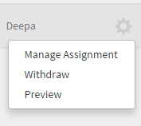
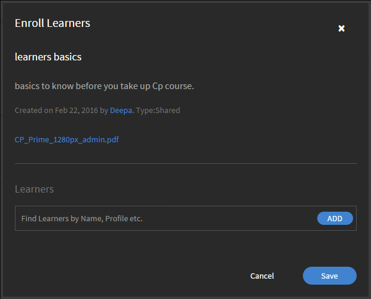

# Risorse formative

Risorse formative per gli Amministratori in Learning Manager.

Risorse formative è un archivio del contenuto di formazione accessibile agli allievi senza alcun requisito di completamento o di iscrizione. Gli Allievi possono fare riferimento a queste risorse formative per ottenere assistenza relativa all’esecuzione di qualsiasi attività o attività in un’organizzazione.

Le risorse formative possono essere utilizzate in modo indipendente o mentre segui un corso in Learning Manager.

Gli Amministratori di un’organizzazione possono gestire attività di assegnazione, ritiro o ripubblicazione delle risorse formative per gli Allievi.

## Ritiro/ripubblicazione di risorse formative {#withdrawrepublishjobaids}

In Accesso come Amministratore, fai clic su **[!UICONTROL Risorse formative]** nel riquadro a sinistra per accedere alle Risorse formative.

È possibile ritirare una risorsa formativa pubblicata facendo clic sull&#39;icona delle impostazioni accanto alla risorsa formativa e selezionando **[!UICONTROL Ritira]**.

*Gestione risorse formative*

Visualizza le risorse formative ritirate facendo clic sulla scheda Ritirate. Puoi ripubblicare risorse ritirate facendo clic sull’icona delle impostazioni e scegliendo Pubblica. Fai clic su Anteprima nelle impostazioni per visualizzare in anteprima la risorsa formativa nel lettore.

## Gestione dell’assegnazione delle risorse formative {#managejobaidassignments}

1. Nella scheda Pubblicato, fai clic sull&#39;icona delle impostazioni accanto a una risorsa formativa.

1. Fai clic su **[!UICONTROL Gestisci assegnazione]**.

   Viene visualizzata la finestra di dialogo a comparsa **[!UICONTROL Iscrivi Allievi]**.

   

   *Visualizza la finestra di dialogo Iscrivi Allievi*

1. Nel campo **[!UICONTROL Allievi]**, inizia a digitare il nome degli Allievi e scegli gli Allievi dall’elenco a discesa. Puoi anche trovare gli Allievi in base al nome, al profilo e così via.
1. Fai clic su **[!UICONTROL Aggiungi].**
1. Fai clic su **[!UICONTROL Salva]**.

## Domande frequenti {#frequentlyaskedquestions}

+++Come si trovano i report di Risorse formative?

Nell&#39;angolo superiore destro dello schermo, fai clic su **[!UICONTROL Azioni]** > **[!UICONTROL Esporta report]**.

+++

+++Come si gestiscono le assegnazioni delle Risorse formative?

Nella scheda **[!UICONTROL Pubblicato]**, fai clic sull&#39;icona delle impostazioni accanto a una risorsa formativa. Aggiungi un Allievo e fai clic su **[!UICONTROL Aggiungi]**.

+++

+++Come si ritira una risorsa formativa?

Nella scheda **[!UICONTROL Pubblicato]**, fai clic sull&#39;icona delle impostazioni accanto a una risorsa formativa. Fai clic su **[!UICONTROL Ritira]**. L’opzione Risorse formative non sarà più visualizzata nella scheda Pubblicato. Per visualizzare la risorsa formativa ritirata, fai clic sulla scheda Ritirate.

+++
