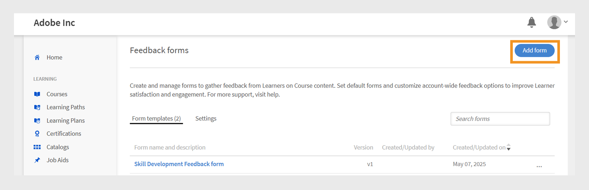
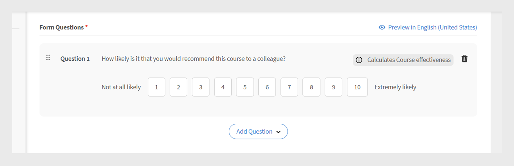

# Modulo di feedback L1

>[!IMPORTANT]
>
>È in corso l’implementazione della funzionalità avanzata di feedback L1 per alcuni clienti. Se questa funzione non è presente nel tuo account, consulta [Aggiungi feedback L1 e L3](/help/migrated/administrators/feature-summary/courses.md#add-l1-and-l3-feedback) per ulteriori informazioni sulla funzione di feedback esistente.
>
>Contatta il tuo team Customer Success Manager (CSM) per abilitare il nuovo sistema di feedback e ottenere informazioni sulla tempistica della migrazione.

La funzione di feedback Livello 1 (L1) di Adobe Learning Manager consente agli Allievi di condividere il proprio feedback dopo aver completato un corso o un percorso di apprendimento. Questo feedback aiuta gli Amministratori a valutare la qualità dei corsi, l’efficacia dell’istruttore e l’esperienza di apprendimento complessiva.

Gli Amministratori possono ora creare e gestire più moduli di feedback riutilizzabili e assegnarli a corsi e percorsi di apprendimento specifici.

La funzione offre maggiore flessibilità consentendo agli amministratori di:

* Crea moduli di feedback riutilizzabili
* Personalizza il feedback per diversi corsi o percorsi di apprendimento
* Assegna moduli personalizzati in base alle esigenze

Il **[!UICONTROL Report di feedback L1]** e il **[!UICONTROL Report di feedback]** (Report personalizzato) ora includono due nuove colonne: Nome modulo feedback e Versione feedback. Queste colonne forniscono dettagli sui moduli di feedback utilizzati.

## Crea modulo di feedback L1

Gli Amministratori possono creare più moduli di feedback L1 a livello di account e assegnare il modulo corretto a un corso, un percorso di apprendimento o una certificazione.

Per creare un modulo di feedback L1:

1. Accedi a Adobe Learning Manager come amministratore.
2. Seleziona **[!UICONTROL Moduli di feedback]**.

   
   _Pagina principale dell&#39;amministratore che visualizza l&#39;opzione Moduli di feedback per creare e gestire moduli di feedback_
3. Seleziona **[!UICONTROL Aggiungi modulo]**.

   
   _Schermata dei moduli di feedback che mostra il pulsante Aggiungi modulo per creare i moduli di feedback_
4. Scegli il **[!UICONTROL linguaggio predefinito del modello]**, quindi seleziona **[!UICONTROL Salva]**.

   
   _Messaggio per aggiungere un nuovo modello con l&#39;opzione per selezionare la lingua predefinita_
5. Digitare il titolo e la descrizione del modulo.

   
   _Aggiungi pagina del modulo di feedback che visualizza l&#39;opzione digitare il titolo e la descrizione del modulo_
6. Dal menu **[!UICONTROL Aggiungi domanda]**, seleziona un tipo di domanda tra i seguenti:

   a. **[!UICONTROL Testo libero]**: consente agli Allievi di fornire le risposte nelle proprie parole.

   * Digita la domanda nel campo di testo **[!UICONTROL Domanda]**.
   * Per rendere obbligatoria la domanda, seleziona l&#39;interruttore **[!UICONTROL Obbligatorio]**.
     
     _Aggiungi una domanda di testo libero al modulo di feedback_

   b. **[!UICONTROL Scala numerica/Server dei criteri di rete]**: gli allievi possono valutare la soddisfazione o la probabilità di consigliare il corso utilizzando una scala numerica (in genere da 1 a 10).

   * Digita la domanda nel campo di testo **[!UICONTROL Domanda]**.
   * Selezionare l&#39;intervallo di valutazione (da 1 a 10).
   * Per rendere obbligatoria la domanda, seleziona l&#39;interruttore **[!UICONTROL Obbligatorio]**.
     \
     _Aggiungere una domanda in scala numerica/Server dei criteri di rete al modulo di feedback_

   c. **[!UICONTROL Scala Likert]**: gli allievi possono specificare il grado di accettazione di un’istruzione, da Fortemente in disaccordo a Fortemente in accordo.

   * Digita la domanda nel campo di testo **[!UICONTROL Domanda]**.
   * Per rendere obbligatoria la domanda, seleziona l&#39;interruttore **[!UICONTROL Obbligatorio]**.
     
     _Aggiungi una domanda Likert Scale al modulo di feedback_

   d. **[!UICONTROL Punteggio di efficacia del corso]**: una scala per misurare l’efficacia con cui un corso influenza gli Allievi, utilizzando un sistema di valutazione relativo.

   * Nel modulo di feedback verrà aggiunta una domanda predefinita con una scala Likert da 1 a 10.
   * Puoi aggiungere solo una domanda **[!UICONTROL Punteggio efficacia del corso]**, che non può essere modificata
     
     _Aggiungi la domanda relativa al punteggio di efficacia del corso al modulo di feedback_
7. Seleziona **[!UICONTROL Salva]**. Puoi visualizzare i moduli creati nella sezione Forms di feedback.

### Anteprima del modulo di feedback

Puoi visualizzare l’anteprima del modulo di feedback selezionando Anteprima in inglese (Stati Uniti). Se il modulo è stato creato in più lingue, è inoltre possibile visualizzarlo in anteprima in ciascuna lingua. Visualizza questa [sezione](/help/migrated/administrators/feature-summary/l1-feedback-form.md#add-feedback-forms-in-other-languages) per scoprire come aggiungere moduli di feedback in altre lingue.

_Schermata dei moduli di feedback che mostra l&#39;opzione Anteprima per visualizzare il modulo di feedback nella lingua predefinita_

### Aggiungi moduli di feedback in altre lingue

Crea le traduzioni delle domande nel modulo di feedback in più lingue. Tuttavia, è possibile aggiungere o rimuovere le domande solo nella lingua predefinita, ad esempio l&#39;inglese. Per le altre lingue, è possibile tradurre solo le domande che sono state inizialmente aggiunte nella lingua predefinita. Non è possibile aggiungere o rimuovere domande direttamente nelle versioni tradotte.

1. Seleziona **[!UICONTROL Aggiungi nuova lingua]** nel modulo di feedback.

   
   _Aggiungere una nuova versione della lingua al modulo di feedback_
2. Scegli la lingua desiderata e seleziona **[!UICONTROL Salva]**.
3. Passa alla scheda della lingua aggiunta.
4. Seleziona **[!UICONTROL Traduci]** accanto a ogni domanda per aggiungere la traduzione.

   
   _Schermata del modulo di feedback che mostra l&#39;opzione Traduci per tradurre le domande nelle rispettive lingue_

   >[!NOTE]
   >
   >La domanda Punteggio efficacia del corso si traduce automaticamente.

5. Dopo aver aggiunto le traduzioni, seleziona **[!UICONTROL Salva]**.

## Impostare un modulo di feedback come predefinito

Gli Amministratori possono stabilire un modulo di feedback predefinito per corsi a ritmo personalizzato, in aula, in aula virtuale e misti. Una volta impostato un modulo predefinito, questo viene applicato automaticamente a tutti i corsi appena creati. Gli Allievi vedranno questo modulo dopo aver completato un corso. Se necessario, gli Amministratori possono scegliere di assegnare un modulo di feedback diverso per corsi specifici.

_Nella schermata dei moduli di feedback viene visualizzata l&#39;opzione per impostare il modulo di feedback predefinito_

## Configurazione delle impostazioni relative al feedback degli Allievi

Gli Amministratori possono configurare le seguenti impostazioni nella sezione Feedback degli Allievi:

* **[!UICONTROL Abilita modulo per acquisire i feedback degli Allievi per questo corso]**: abilita questa opzione per raccogliere i feedback degli Allievi per il corso. Quando questa opzione è attivata, agli Allievi verrà richiesto di fornire un feedback dopo aver completato il corso.
* **[!UICONTROL Impostazione modulo]**: quando questa opzione è attivata, il modulo di feedback viene aperto automaticamente per gli Allievi subito dopo il completamento del corso, semplificando la raccolta di feedback tempestivi.

_Schermata del feedback degli allievi che mostra le impostazioni del feedback degli allievi_

>[!NOTE]
>
>Le istanze del corso utilizzano il modulo di feedback predefinito a livello di corso. Quando crei nuove istanze, queste utilizzano anche il modulo predefinito a livello di corso anziché quello a livello di account.

### Modificare il modulo di feedback predefinito di un corso

Il modulo di feedback predefinito si applica a tutti i corsi. In qualità di amministratore, puoi creare un nuovo modulo o sceglierne uno dall’elenco esistente. Per modificare i moduli di feedback predefiniti, il feedback degli allievi deve essere abilitato per questo corso.

Per modificare il modulo di feedback predefinito:

1. Seleziona **[!UICONTROL Corsi]** nella home page dell&#39;amministratore.
2. Seleziona un corso nella sezione **[!UICONTROL Corso]**.
3. Seleziona **[!UICONTROL Visualizza corso]**, quindi seleziona **[!UICONTROL Feedback dell’Allievo]**.

   
   _Le schermate del feedback degli Allievi mostrano l’opzione Modifica per modificare il modulo_
4. Seleziona **[!UICONTROL Modifica]** nella sezione **[!UICONTROL Feedback degli Allievi]**.
5. Seleziona **[!UICONTROL Cambia modulo]**.

   
   _Le schermate del feedback degli Allievi mostrano l’opzione Cambia modulo per modificare il modulo di feedback per il corso_
6. Scegli un altro modulo di feedback dal menu o seleziona **[!UICONTROL Inizia con un modulo vuoto]** per crearne uno nuovo.

   
   _Aggiungere una schermata del modulo che visualizzi l&#39;opzione per selezionare dal modello disponibile o creare un nuovo modulo_
7. Seleziona **[!UICONTROL Salva]** per applicare le modifiche.

Se un corso utilizza il modulo di feedback predefinito e il modulo predefinito viene aggiornato a livello di account, tutti i corsi di questo tipo rifletteranno automaticamente il nuovo modulo. Tuttavia, se un Amministratore modifica il modulo o assegna un nuovo modulo a livello di corso, le modifiche future apportate al modulo predefinito non avranno alcun impatto sul modulo di feedback del corso.

Per impostazione predefinita, l’istanza utilizzerà il modulo di feedback a livello di corso. Se un Amministratore modifica il modulo di feedback a livello di corso, ciò non influirà sul modulo già impostato a livello di istanza. Tuttavia, per impostazione predefinita, tutte le nuove istanze create dopo la modifica utilizzeranno il modulo di feedback aggiornato a livello di corso.

Segui gli stessi passaggi per modificare i moduli di feedback predefiniti per un percorso di apprendimento.

>[!NOTE]
>
>Se non modifichi il modulo, il corso utilizzerà il modulo di feedback predefinito.

