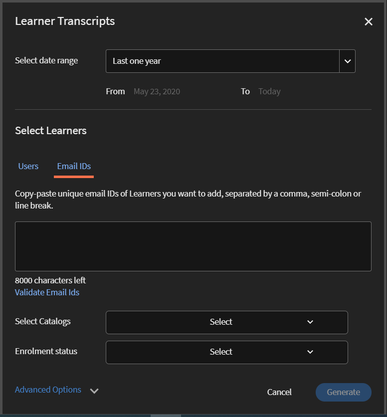

# Trascrizioni Allievi

Scarica la trascrizione Allievo e gestisci i report utilizzando Learning Manager.

Adobe Learning Manager consente agli Amministratori di un’organizzazione di generare le trascrizioni associate agli Allievi.

## Genera trascrizioni Allievo {#generatelearnertranscripts}

1. Per generare le trascrizioni degli Allievi, fai clic su **[!UICONTROL Report]** nel riquadro a sinistra nell’accesso come Amministratore.

   L&#39;amministratore passa alla scheda **[!UICONTROL Report personalizzati]** > **[!UICONTROL Report Excel]** nella pagina **[!UICONTROL Report]**.

1. Fai clic sul collegamento **[!UICONTROL Trascrizioni Allievi]**.

   Viene visualizzata la pagina della cronologia delle **[!UICONTROL Trascrizioni Allievi]** con il messaggio: **Nessuna trascrizione Allievo è stata ancora generata** o un elenco di download attivati dopo l’implementazione della pagina della cronologia delle trascrizioni Allievo.

   <!---->

   Viene visualizzata una finestra di dialogo relativa alle trascrizioni Allievo. Scegli l’intervallo di date per il quale generare la trascrizione.

   >[!NOTE]
   >
   >Per impostazione predefinita, la data di inizio corrisponde alla data di registrazione dell’Allievo e la data di fine è sempre la data corrente. Puoi modificare solo la data di inizio da quando hai bisogno dei dati.

1. Scegli i nomi degli Allievi dal campo **[!UICONTROL Seleziona Allievi]** e fai clic su **[!UICONTROL Genera].**
1. Puoi scegliere un singolo Allievo o gruppi di Allievi. Per aggiungere più di un Allievo, fai clic su **[!UICONTROL Aggiungi altri Allievi]**.

   

   *Aggiungi altri Allievi*

1. Per scegliere cataloghi specifici, attiva la casella di controllo. Transcript viene scaricato solo per i cataloghi specificati. Puoi scegliere cataloghi specifici selezionando il catalogo dall&#39;elenco a discesa **[!UICONTROL Seleziona cataloghi]**.

   

1. Quando esporti le trascrizioni Allievi, è disponibile l’opzione **[!UICONTROL Stato iscrizione]**. Questo elenco a discesa contiene le seguenti opzioni:

   * Seleziona tutto
   * Completata
   * In corso
   * Non avviata
   * Non iscritto

   

   *Selezionare il catalogo*

1. Puoi anche scaricare le trascrizioni per gli Allievi eliminati da un account.

   Per scaricare le Trascrizioni allievi degli utenti eliminati, fai clic sulla freccia **[!UICONTROL Opzioni avanzate]** e abilita la casella di controllo **[!UICONTROL Includi dati degli allievi eliminati]**.

   

   *Scarica le trascrizioni degli Allievi per gli Allievi eliminati*

1. Puoi scegliere di scaricare le informazioni a livello di modulo nella trascrizione Allievo abilitando la casella di controllo &quot;**[!UICONTROL Abilita informazioni a livello di modulo]**&quot;. I nomi dei moduli e il tempo trascorso su ciascun modulo vengono recuperati come parte della trascrizione se questa opzione è abilitata.
1. Puoi scegliere di scaricare i dati sulle abilità e i fogli di riepilogo attivando la casella di controllo &quot;**[!UICONTROL Includi dati sulle abilità e fogli di riepilogo]**&quot;.

   Le trascrizioni vengono generate e scaricate nel computer come file .zip quando i dati sulle abilità non sono inclusi. Se la casella di controllo dei dati sulle abilità è selezionata, le trascrizioni vengono generate e scaricate come file .xls.

## Genera trascrizione Allievo utilizzando copia-incolla

Per acquisire le trascrizioni degli Allievi può volerci molto tempo, perché queste possono essere ottenute solo per un allievo o un gruppo di utenti alla volta. In questo caso, con la funzione copia-incolla, puoi copiare la lista di ID e-mail degli Allievi e copiarla in un solo momento.

1. Accedi come **[!UICONTROL Amministratore]** o **[!UICONTROL Manager]**.
1. Vai a **[!UICONTROL Report]** in **[!UICONTROL Gestisci]**. Viene caricata la pagina **[!UICONTROL Attività utente]**.
1. Fai clic su **[!UICONTROL Report personalizzati]** nel riquadro a sinistra e seleziona **[!UICONTROL Trascrizioni allievi]** dall’elenco.
1. Nella pagina **[!UICONTROL Trascrizioni Allievi]**, fai clic sul pulsante **[!UICONTROL Genera nuovo]** nell’angolo in alto a sinistra.
1. Seleziona le date desiderate dal menu a discesa **[!UICONTROL Seleziona intervallo di date]**. Fai clic sulla scheda **[!UICONTROL ID e-mail]** per immettere l’elenco copiato di ID e-mail univoci.

   

   *Copia e incolla ID e-mail*

1. Utilizza **[!UICONTROL Convalida ID e-mail]** per verificare che l&#39;ID immesso sia corretto.

   

   *Convalida degli ID e-mail*

   Se l’ID e-mail inserito non è corretto, viene evidenziato in rosso con un messaggio di convalida, come qui sopra.

   Il pulsante **[!UICONTROL Genera]** non sarà disponibile a meno che tutti gli ID e-mail immessi non siano corretti.

   

   *Genera le trascrizioni allievi*

1. Fai clic sul pulsante **[!UICONTROL Genera]** per generare le Trascrizioni allievi per tutti gli ID e-mail menzionati. Riceverai un messaggio come riportato di seguito, con la conferma della generazione del report.

   

   *Messaggio di conferma della generazione del report*

   La generazione delle Trascrizioni allievi può combinare gli ID e-mail inseriti sia nella scheda **[!UICONTROL Utenti]** che nella scheda **[!UICONTROL ID e-mail]**.

## Cronologia dei download delle trascrizioni degli Allievi {#ltdownload}

Nella pagina di download **[!UICONTROL Trascrizione Allievo]**, per generare un report, quando fai clic sul pulsante **[!UICONTROL Genera nuova]** viene visualizzata la finestra di dialogo Trascrizioni Allievo.

*Genera un report di tutte le trascrizioni allievi*

Fai clic su **[!UICONTROL Opzioni avanzate]** ed espandi il pannello.

Scegli gli utenti e il catalogo a cui appartengono. Dopo il clic sul pulsante **[!UICONTROL Genera]** viene visualizzata una finestra di dialogo con il tempo approssimato necessario per il download del report. Fai clic su **[!UICONTROL Genera]** per generare il report.

*Selezionare il pulsante Genera*

La trascrizione viene generata in background ed è possibile continuare con le attività in Learning Manager. Una volta generata la trascrizione, puoi scaricarla dall’elenco.

In qualità di Amministratore, puoi visualizzare tutte le trascrizioni generate da chiunque nel sistema.

*Visualizzazione della cronologia dei download*

Nell’elenco dei download vengono visualizzati i seguenti attributi:

* **Allievi:** gli Allievi/gruppi di Allievi di cui devono essere scaricate le trascrizioni.
* **Dati aggiuntivi inclusi:** dipende dai dati aggiuntivi che l’Amministratore desidera scaricare dall’opzione Avanzate nella finestra Aggiungi trascrizione Allievo
* **Stato:** scaricato, in coda o in corso.
* **Da** e **A:** intervallo di tempo delle trascrizioni da scaricare.
* **Filtri applicati:** se hai applicato dei filtri per lo stato di iscrizione.
* **Generato da:** ID utente dell’utente Learning Manager che ha richiesto il download.
* **Stato:** scaricato, in coda o in corso.

Puoi annullare il download in qualsiasi momento. Se un processo viene annullato dall’Amministratore, Learning Manager invia una notifica in-app all’utente che ha attivato la trascrizione Allievo.

*Coda di download della Trascrizione Allievo*

Puoi **annullare** il download in qualsiasi momento. Se un processo viene annullato, Learning Manager invia una notifica in-app all’utente che ha annullato il processo.

## Dati degli Allievi eliminati {#dataofdeletedlearners}

Puoi includere i dati degli Allievi eliminati nell’elenco Trascrizione Allievi. Nella finestra di dialogo Trascrizioni Allievi, attiva l’opzione **[!UICONTROL Includi dati di Allievi eliminati]**.

Dopo aver attivato l’opzione e fatto clic su **[!UICONTROL Genera]**, i dati degli Allievi eliminati vengono visualizzati nella pagina di download Trascrizione Allievi, come illustrato di seguito:

*Visualizza i dati degli Allievi eliminati*

## Personalizza colonne {#customize-columns-lt}

L’Amministratore può personalizzare le colonne esportate in un report di trascrizione Allievi. Amministratori, Amministratori personalizzati e Manager possono configurare le colonne prima di esportare il report.

Nella finestra di dialogo **[!UICONTROL Trascrizioni Allievi]**, fai clic su **[!UICONTROL Opzioni avanzate]**. Nella sezione **[!UICONTROL Configura il formato dell&#39;esportazione]**, scegli le colonne da esportare.

*Personalizzare le colonne da esportare*

La personalizzazione è consentita solo quando l’utente scarica la trascrizione Allievo in formato .CSV. Se il download avviene in formato .XLSX, la selezione delle preferenze delle colonne non verrà rispettata e tutte le colonne predefinite verranno esportate.

## Contenuto del file di trascrizione Allievo {#learnertranscriptfilecontent}

Un file tipico di trascrizione Allievo consiste in sei fogli in un singolo file. I fogli di trascrizione Allievo forniscono un’analisi complessiva dei dati, tra cui il numero di Allievi coinvolti per corso, le loro abilità, la percentuale di completamento in base al corso o all’Allievo e un dashboard di conformità. Di seguito sono riportati i dashboard disponibili nelle trascrizioni Allievo:

**Trascrizione Allievo**

Nel file Excel di trascrizione Allievo, insieme ai dettagli di profilo dell’Allievo, vengono forniti dettagli di consumo relativi all’oggetto di apprendimento, come data di iscrizione, di avvio, valutazione raggiunta, punteggio quiz ottenuto. Se i corsi fanno parte di un programma di apprendimento, vengono elencati separatamente oltre ai dettagli sulla fruizione dei singoli corsi.

**1 - Dashboard di attività di apprendimento**

In questo dashboard specifico per LO, puoi visualizzare il numero di Allievi per ogni corso, programma di apprendimento o certificazione. Puoi visualizzare il foglio di avanzamento per gli Allievi per uno specifico oggetto di apprendimento. In questo foglio sono visualizzati i dati come il numero di Allievi che hanno completato il corso o il programma di apprendimento, gli Allievi in corso e le date di scadenza per gli Allievi.

L’avanzamento degli utenti per il corso specifico è calcolato in base ai campi di input dove viene specificata la data di scadenza e le soglie di percentuale dell’avanzamento. Ad esempio, se specifichi 7 giorni e 70% come valori nel campo di input, viene visualizzato l’avanzamento per i corsi con scadenza tra 7 giorni e per i corsi con oltre il 70% di avanzamento. Puoi inoltre modificare il periodo di tempo in questo foglio, dove la data modificata viene visualizzata automaticamente in questo dashboard.

**2 - Dashboard di attività di apprendimento**

Questo dashboard di apprendimento visualizzerà i dati per un utente specifico. Da questo dashboard, puoi visualizzare i corsi, i programmi di apprendimento o la certificazione a cui è iscritto un particolare utente. La tabella mostra inoltre dati degli oggetti di apprendimento completati dall’utente, gli oggetti di apprendimento in corso e le prossime date di scadenza per l’utente.

L’avanzamento degli utenti per ciascun corso è calcolato in base agli input specificati. Ovvero, i valori di percentuale avanzamento e la data di scadenza. Ad esempio, se specifichi 7 giorni e 70% come valori nel campo di input, viene visualizzato l’avanzamento per i corsi con scadenza tra 7 giorni e per i corsi con oltre il 70% di avanzamento.

**Abilità**

Nel foglio delle abilità, sono forniti il nome dell’abilità, il livello dell’abilità, i crediti necessari, quelli ottenuti, la percentuale di completamento e altri dettagli di profilo. Come riferimento, viene di seguito fornita un’istantanea del foglio Excel delle abilità.

*Esempio di foglio Excel delle abilità*

**1 - Dashboard delle abilità**

In questo dashboard, puoi verificare se l’organizzazione possiede determinate abilità. Per una specifica abilità puoi verificare il numero di utenti in un’organizzazione che dovrebbe possedere questa abilità rispetto al numero che effettivamente la possiede. Questo dashboard indica inoltre gli utenti che devono aggiornare le loro abilità. Questo valore viene calcolato in base all’input immesso nel campo. Ad esempio, se immetti 50 giorni come input, il dashboard fornisce dati sugli utenti che devono aggiornare le abilità dopo 50 giorni.

**2 - Dashboard delle abilità**

Questo dashboard delle abilità è più specifico per utente. Puoi filtrare un elenco specifico o diversi utenti e visualizzare il relativo livello di abilità come dashboard. Questo foglio può aiutare i Manager e gli Amministratori a valutare le abilità ottenute da ogni Allievo rispetto al livello di raggiungimento previsto. Il dashboard delle abilità indica inoltre gli Allievi che devono aggiornare le proprie abilità. L’elenco di tali Allievi è calcolato in base al numero di giorni immessi nel campo di input.

**Dashboard di conformità**

Il dashboard di conformità è composto da due parti: report di compatibilità per utente e report di compatibilità per formazione. Per il report basato sull’utente, puoi utilizzare il dashboard di conformità per valutare gli utenti con le date di scadenza programmate per importanti iniziative di conformità. Per il report basato sulla formazione, puoi applicare il filtro per certificazione o programma di apprendimento.

Per entrambi i report di conformità, applica il filtro in base alla data di scadenza per visualizzare i dati appropriati.

### Colonne di data e ora nella trascrizione {#datetime}

I valori nelle seguenti colonne hanno i minuti arrotondati al valore più vicino e i secondi a 00:

* Data di iscrizione (fuso orario UTC)
* Data di avvio (fuso orario UTC)
* Data di completamento (fuso orario UTC)

*Colonne di data e ora nel foglio di Excel*

### Durata del modulo e colonne ID nella trascrizione {#moduledurationandidcolumnsinthetranscript}

La Trascrizione Allievo mostra anche le colonne **[!UICONTROL Durata modulo]** e **[!UICONTROL ID]**.

*Durata del modulo e colonne ID nella trascrizione*

### ALTRE colonne nelle trascrizioni {#ModuledurationandIDcolumnsinthetranscript-1}

| **Colonna** | **Descrizione** |
|---|---|
| Dopo | Numero di allievi che hanno acquisito l’abilità prima del numero di giorni inserito (valore) che deve essere aggiornato |
| Abilità | I nomi delle competenze assegnate agli allievi |
| Nome del manager | Il nome del manager dei subordinati i cui dati sul coinvolgimento sono mostrati sulla tabella di riepilogo dell’abilità |
| Titoli delle righe | Il nome dell’allievo con l’elenco di abilità assegnate |
| Numero di abilità che ogni utente dovrebbe avere | Numero di abilità assegnate all’allievo |
| Numero di abilità di ogni utente | Numero di abilità acquisite dall’allievo |
| Numero di abilità che devono essere aggiornate | Numero di Allievi la cui competenza deve essere aggiornata |
| Percentuale di conformità | Percentuale di avanzamento dell’abilità assegnata |
| Percorso incorporato | In queste righe sarà mostrato il nome del programma di apprendimento incorporato. |
| ID percorso incorporato | In queste righe saranno mostrati gli ID del programma di apprendimento incorporato. |
| Lingua del percorso incorporato | In queste righe ci sarà la lingua di creazione del programma di apprendimento. |
