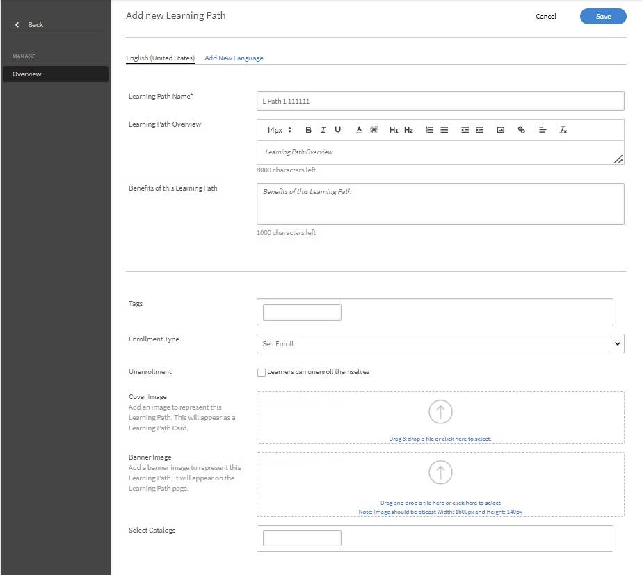
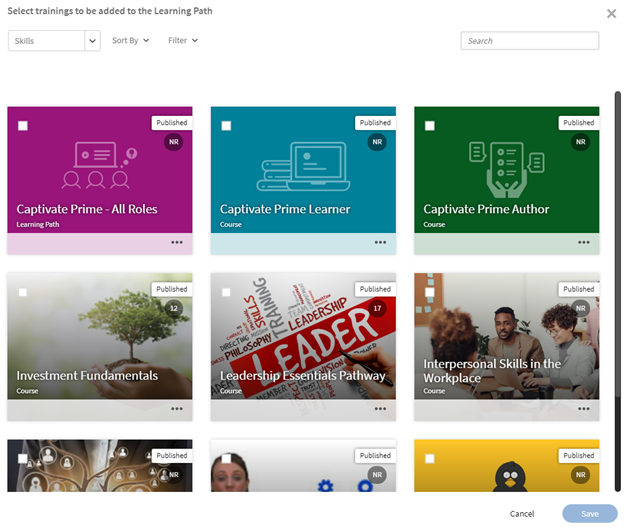

# Percorsi di apprendimento

## Che cos’è un percorso di apprendimento?

Spesso, gli Amministratori sono interessati a creare un curriculum dettagliato che offra conoscenze approfondite su un particolare argomento o un&#39;area di competenza. Può anche trattarsi di una sequenza di corsi di formazione che i dipendenti o i clienti devono completare. Per consentire ciò, questa serie di corsi deve essere aggregata a dei programmi al fine di creare un pacchetto di formazione completo.

È qui che entra in gioco il percorso di apprendimento. Un percorso di apprendimento è un percorso che un Allievo deve seguire per padroneggiare una materia nel tempo. Gli Allievi possono gestire la propria esperienza di formazione, oltre che acquisire e conservare le conoscenze in modo autonomo e con maggiore efficacia.

Ad esempio, durante l’inserimento di nuovi dipendenti, un’azienda offre formazione su politiche e procedure, cultura, storia e così via. Un percorso di apprendimento consente di configurare i corsi in base alle esigenze dei dipendenti in modo che questi possano iscriversi in base al percorso di apprendimento impostato per loro. tu scegli e puoi iscrivere gli utenti a questo percorso in modo che possano progredire da corso a corso.

## Creazione e configurazione di percorsi di apprendimento

In questo corso di formazione imparerai come creare un percorso di apprendimento, aggiungervi un corso, pubblicarlo e ritirarlo, nonché come configurare le istanze all’interno di un percorso di apprendimento.

Se non è possibile avviare il corso di formazione, scrivere a <almacademy@adobe.com>.

## Vantaggi di un percorso di apprendimento

I percorsi di apprendimento facilitano la realizzazione di un programma di apprendimento. Ecco alcuni dei vantaggi principali di un percorso di apprendimento:

1. Assegnazione diretta di abilità e livelli di abilità a un percorso di apprendimento. Non è necessario associare i crediti relativi alle abilità. Una volta completato un percorso di apprendimento, l’Allievo raggiunge il livello di abilità indicato.
1. Possibilità di incorporare un percorso di apprendimento esistente in uno nuovo. La funzionalità di incorporamento è disponibile solo per 1 livello di incorporamento. Pertanto, un percorso di apprendimento che contiene già un percorso incorporato non può essere incorporato in un nuovo percorso.
1. Possibilità di aggiungere Prerequisti, Risorse formative e Risorse a livello di percorso di apprendimento.
1. Possibilità di creare sezioni. Ogni sezione può avere un titolo.
1. Possibilità di rendere le sezioni obbligatorie e impostare i criteri di completamento.

## Aggiunta di un percorso di apprendimento in Learning Manager

In Learning Manager, nell’app di amministrazione, fai clic su **[!UICONTROL Percorso di apprendimento]** nel pannello a sinistra.

Nella pagina **[!UICONTROL Percorso di apprendimento]**, fai clic su **[!UICONTROL Aggiungi]**. Inserisci i seguenti dettagli.

*Aggiungi un nuovo percorso di apprendimento*

Nell&#39;opzione **Tipo di iscrizione**, selezionare **Iscrizione autonoma** o **Iscrizione amministrativa**.

>[!NOTE]
>
>Se selezioni l’opzione **Iscrizione amministratore**, gli allievi vedranno solo i corsi assegnati dal manager o approvati dal manager. Gli Allievi non potranno visualizzare il percorso di apprendimento nella sezione dei consigli.

Dopo aver creato il percorso di apprendimento, selezionalo e poi aggiungi i corsi.

Puoi anche aggiungere abilità e assegnare un distintivo al percorso di apprendimento. Per aggiungere una o più abilità, selezionale dall’elenco a discesa **[!UICONTROL Scegli un’abilità]**. Seleziona anche i relativi livelli.

*Aggiungi un’abilità*

Per assegnare un distintivo al percorso di apprendimento, scegline uno dall’elenco dei distintivi disponibili.

Seleziona il livello di prodotti, ruoli e ruoli dalla sezione **[!UICONTROL Suggerimenti per]** per suggerire questo percorso di apprendimento agli utenti che hanno espresso interesse per tali prodotti e ruoli.

*Consiglio*

Scegli il tipo di ordinamento delle sezioni e dei corsi di formazione tra Ordinati o Non ordinati in base alle tue preferenze.

Se selezioni Ordinati, i corsi vengono visualizzati nell’ordine in cui sono stati creati. Se scegli Non ordinati, i corsi non vengono messi in sequenza. Gli Allievi possono completare i corsi in qualsiasi ordine.

Per aggiungere un corso al percorso di apprendimento, fai clic su **[!UICONTROL Aggiungi corsi o percorsi di apprendimento]**.

Nella finestra di dialogo visualizzata, scegli il corso di formazione che desideri aggiungere al percorso di apprendimento.

*Aggiungere corsi di formazione al percorso di apprendimento*

Puoi ordinare ulteriormente i corsi in base alle abilità assegnate, alla data di modifica e all’efficacia del corso.

Dopo aver selezionato i corsi o il percorso di apprendimento, fai clic su **[!UICONTROL Salva]**.

Nel percorso di apprendimento puoi effettuare le seguenti operazioni:

**Creare e configurare una sezione:** Viene creata una sezione per raggruppare più corsi di formazione che completano un&#39;area o un componente sostanziale del corso di formazione. Ogni sezione può avere un titolo Ogni sezione può anche essere contrassegnata come Obbligatoria con specifici requisiti di completamento.

**Rendere i corsi obbligatori in ogni sezione:** Per rendere i corsi di formazione obbligatori o meno all&#39;interno del percorso di apprendimento, attivare o disattivare la casella di controllo Obbligatorio. Se abiliti la casella di controllo, puoi rendere obbligatori tutti i corsi di formazione o alcuni di essi.

*Rendere obbligatori i corsi in ogni sezione*

**Modificare l&#39;ordine:** È possibile spostare i corsi verso l&#39;alto o il basso e modificare l&#39;ordine.

*Riordinare il corso di formazione*

**Rimuovi un corso:** Nella scheda del corso, fai clic su X e rimuovi il corso dal percorso di apprendimento.

*Rimozione di un corso dal percorso di apprendimento*

Dopo aver apportato le modifiche, fai clic su Publish per pubblicare il percorso di apprendimento.

## Percorso di apprendimento nidificato o migliorato

Un percorso di apprendimento nidificato o migliorato è un percorso contenente più percorsi di apprendimento al suo interno. Per inserire un percorso di apprendimento, segui lo stesso processo descritto per l’aggiunta di un corso in un percorso di apprendimento.

*Percorso di apprendimento nidificato o migliorato*

## Impostazioni del percorso di apprendimento

Nella sezione Impostazioni puoi aggiungere i prerequisiti e le risorse formative che un Allievo deve consultare prima di avviare il percorso di apprendimento, oltre che altre risorse utili.

*Modificare le impostazioni di un percorso di apprendimento*

## Istanze

Le istanze del percorso di apprendimento visualizzano un riquadro aggiuntivo, **[!UICONTROL Percorsi di apprendimento]**. Il riquadro visualizza il numero dei programmi di formazione aggiunti a un percorso di apprendimento.

Nel riquadro **Corsi** sono indicate le istanze del corso visibili agli Allievi iscritti in questa istanza.

La casella di controllo **[!UICONTROL Consenti agli Allievi di scegliere le istanze (Percorso di apprendimento flessibile)]** è applicabile solo ai corsi. Questa opzione consente agli Allievi di cambiare istanza nel percorso di apprendimento. Per tutti i percorsi di apprendimento figlio sarà disponibile un’opzione che consente di mappare un’istanza del programma di apprendimento su un percorso di apprendimento. L’opzione di collegamento è impostata su Istanza predefinita di default.

*Istanze del percorso di apprendimento*

Gli Allievi possono essere iscritti a un corso tramite un piano di apprendimento o da un Amministratore, anche se il corso è flessibile e richiede all’Allievo di selezionare una sessione. In questi casi, il sistema consente agli Allievi di iscriversi anche se è stato raggiunto il limite di partecipanti, ma non possono avviare il corso finché non diventa disponibile un posto.

La funzione lista d’attesa si applica solo quando gli Allievi si iscrivono autonomamente. Quando una sessione raggiunge il limite di partecipanti, l’Istruttore può visualizzare l’elenco degli Allievi nella lista d’attesa. Se diventano disponibili postazioni, l’istruttore può aggiungere allievi in lista d’attesa fino a quando la sessione non raggiunge di nuovo la capacità.

## Notifiche

Sono disponibili tre opzioni:

1. **[!UICONTROL Corsi e percorsi di apprendimento di tutti i livelli di abilità (selezionata per impostazione predefinita)]:** l’Allievo riceve notifiche per ogni corso non completato indipendentemente dal livello all’interno di un percorso di apprendimento.
1. **[!UICONTROL Percorso di apprendimento radice]:** l’Allievo riceve notifiche per eventuali corsi non completati che fanno parte di un percorso di apprendimento principale.
1. **[!UICONTROL Percorso di apprendimento + Solo bambini di primo livello di abilità]:** L’Allievo riceve notifiche per un corso non completato che è il primo figlio di un percorso di apprendimento principale.

I promemoria notifica vengono attivati in base all’opzione. Per impostazione predefinita, l’opzione **[!UICONTROL Corsi e percorsi di apprendimento di tutti i livelli]** è abilitata per un’istanza.

## Abbonamenti

Puoi iscriverti ai singoli percorsi di apprendimento per ricevere dati completi, inclusi i punteggi dei quiz e lo stato dell’Allievo, direttamente nella tua casella di posta.

Segui i passaggi riportati di seguito:

1. Seleziona un percorso di apprendimento > Abbonamenti.
1. Seleziona Aggiungi altro.
1. Seleziona i dettagli e digita l’ID e-mail per ricevere i report.

*Iscrizione a un percorso di apprendimento individuale*

## Importante

Subito dopo l’aggiornamento, la funzionalità esistente Programmi di apprendimento verrà rinominata Percorso di apprendimento. Se desideri continuare a chiamarla Programmi di apprendimento, utilizza la funzione &quot;Terminologie&quot; per applicare il termine desiderato, per l’appunto Programma di apprendimento.

I percorsi di apprendimento offrono una serie di funzionalità. alcune delle quali saranno disponibili subito dopo l’aggiornamento, e sia gli Amministratori che gli Autori potranno iniziare a utilizzarle. Funzionalità estese quali &quot;Sezioni&quot;, &quot;Aggiungi percorso di apprendimento a un altro&quot;, ecc. sono disattivati e possono essere attivati selezionando la casella di controllo indicata di seguito.

Gli Allievi possono continuare a seguire i programmi di apprendimento (ora denominati percorsi di apprendimento) e gli Autori/Amministratori a crearli. Per sfruttare le funzionalità estese del percorso di apprendimento indicate in precedenza, l’Amministratore deve abilitare l’impostazione come indicato di seguito. Una volta attivate, saranno disponibili tutte le nuove funzionalità estese del percorso di apprendimento.

Nella pagina **[!UICONTROL Impostazioni]** > **[!UICONTROL Generali]** è disponibile una nuova opzione per abilitare i percorsi di apprendimento. Se attivi questa opzione, puoi aggiungere corsi e programmi di apprendimento a un percorso di apprendimento. Una volta abilitata, l’opzione non può essere modificata.

<!-- ## Other Learning Path-related details 

### Learning Path option is disabled/unchecked in Admin Settings

**Accounts using Native Web apps**

**Learners**

* By default, learners will notice a change in terminology from "Learning Program" to Learning Path". This has been done to make the interface more intuitive. If you do not want this change, refer to the below points.  

* This change however will not be reflected in the UI if you have already used the 'Custom Terminology" function to replace the terminology "Learning Programs" with some custom text. 
* In case you had not used the Custom Terminology function yet but now wish to retain "Learning Programs" as the terminology, you can do so via the 'Custom Terminology' feature post the release.

* The overall cosmetic look and feel of erstwhile 'Learning Programs' will get updated to a more visually rich look and feel.

**Authors and Admins**

* The terminology within the Admin/Author apps is the same as that of learners.
* The UI for Authors and Admins to create, update the erstwhile 'Learning Program' objects will now be updated to the new UI. There is no loss of functionality, just that the User Interface to do the operation will be much more intuitive. These UI changes will reflect in your account, even if you have chosen not to enable 'Extended Features of Learning Path', with no loss in functionality. 

* Note that any existing Learning Program objects will not change so there is no impact on learners (other than the terminology point noted above). Authors/Admins might notice a default grouping called "Section" within their existing objects, which would be of no material impact as far as functionality goes. Authors/Admins will also see added functionalities like Skills, Job Aids etc. But as you haven't used it yet, it will not create any impact on the learner side till you actually start using it.

**Reporting**

* If you do not enable the option, Learning Path , there are no changes in the Learner Transcript report structure due to Learning Path. But as communicated in earlier notice (refer to the table shared in earlier communication); one new column will get added to the extreme right of the Learner Transcript immediately after the release.

**Accounts using Headless LMS**

**Learners**

* There are no changes for learners in headless interface. APIs as well that are used to generate the reports does not have immediate changes. 

**Authors and Admins**

* Same changes as that of Authors/Admins stated above.

**Reporting**

* Same changes as that of Reporting stated above.

### Learning Paths option is enabled/checked in Admin Settings

**Accounts using Native Web apps**

**Learners**

* Same changes as that of Learners when the option is disabled.
* As you start using the extended functionality of Learning Paths, Learners will benefit from seeing more elaborate paths with embedded paths and sections, Skills and badges being earned on path completion, resources at path level, and other benefits.

**Authors and Admins**

* Same changes as that of Authors and Admins when the option is disabled.

* Users will get more functionality in crafting elaborate paths. You can define Skill-Levels that would automatically be achieved by a learner on completion of path (not have to focus on the arithmetic of Credits for the levels). Resources can be added at the path level (Not possible as of today). Sections can be created with each section having the ability to have X of Y options. One can embed a Learning Path within another Learning Path (one level of hierarchy supported)

**Reporting**

* A few new columns will get added to the 'Learner Transcript' and 'Content Report' structures to incorporate the new feature of embedding of paths within paths. This may impact integration code that you may have written to export this data to your custom data warehouse/DB outside Learning Manager. This information is communicated in the table provided in earlier communication.

**Accounts using Headless LMS**

**Learners**

* There is no change for your learners, unless you make changes to your headless LMS implementation, as the APIs on which you have built your headless interface will not be changing.
* If you do start using the extended features of Learning Paths by creating new Learning Paths, however you will have to make changes to the headless LMS implementation to reflect those on your learner app. The Learning Manager APIs will allow you to do that.

**Authors and Admins**

* Same changes as that of Authors/Admins stated above.

**Reporting**

* Same changes as that of Reporting stated above. -->
