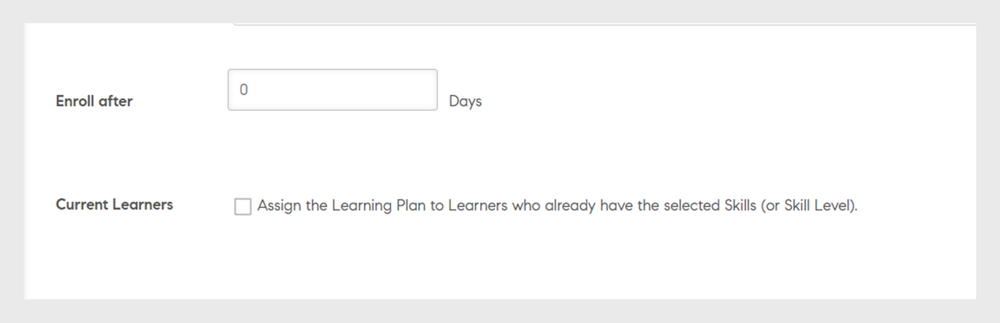

# Piani di apprendimento

Creazione di piani di apprendimento per Amministratori in Learning Manager.

## Panoramica {#overview}

Un piano di apprendimento è un insieme di regole che consente agli Allievi di iscriversi a training specifici in base a determinati criteri.

Un piano di apprendimento consente a un Amministratore di assegnare automaticamente corsi, programmi di apprendimento o certificazioni in base all’occorrenza di determinati eventi, ad esempio la registrazione di un nuovo dipendente o la modifica di designazione o posizione dei dipendenti.

Ad esempio, quando un dipendente entra in un’organizzazione, gli viene assegnato automaticamente il programma di orientamento per nuovi dipendenti. Analogamente, se un dipendente viene promosso come manager, gli viene assegnato automaticamente un programma di orientamento per nuovi manager.

Puoi iscrivere automaticamente gli Allievi a qualsiasi corso e programma di apprendimento in base a un set predefinito di eventi. Puoi creare percorsi di apprendimento per gli Allievi assegnando automaticamente un’attività di apprendimento di follow-up dopo che un utente ha completato un’abilità, un corso o un programma di apprendimento.

## Creazione di piani di apprendimento {#createlearningplans}

Per creare un piano di apprendimento, devi accedere come Amministratore.

1. Nel riquadro a sinistra, fai clic su **[!UICONTROL Piani di apprendimento]**. Gli eventi esistenti sono elencati nella pagina. Tuttavia, se stai configurando la funzione del piano di apprendimento per la prima volta, vai al passaggio successivo.
1. Nell’angolo superiore destro della pagina, fai clic su **[!UICONTROL Aggiungi]**. Nella finestra di dialogo **[!UICONTROL Aggiungi piano di apprendimento,]** immetti il nome del piano di apprendimento che deve essere utilizzato da un dipendente.

   

1. Nell’elenco a discesa **[!UICONTROL Si verifica quando]** scegli l’evento richiesto. Le opzioni determinano quando un Allievo segue il corso. Dopo aver selezionato il tipo di evento, seleziona il corso di formazione, i corsi, il programma di apprendimento o la certificazione appropriati.

>[!NOTE]
>
> Gli Amministratori e gli Autori possono creare eventi di iscrizione automatica.

Gli eventi sono:

**1 - Nuovo Allievo aggiunto:** Quando un nuovo utente o un dipendente entra nell&#39;organizzazione.

**2 - L’Allievo viene aggiunto a un gruppo:** Quando un nuovo utente o un dipendente entra a far parte di un gruppo.  Immetti e seleziona il gruppo di utenti dall’elenco a discesa a cui è applicabile questo evento. Puoi scegliere più gruppi. Inoltre, puoi assegnare questo evento a tutti i membri esistenti di questi gruppi selezionando l’opzione.

Questo piano di apprendimento è specificatamente progettato per utenti ***di gruppi personalizzati***. Digita il nome del gruppo nel campo e, utilizzando la ricerca con completamento automatico, scegli il gruppo o i gruppi.

**3 - L’Allievo viene rimosso da un gruppo:** L’evento viene attivato quando un utente o un Allievo viene rimosso da un gruppo. Immetti e seleziona il gruppo di utenti dall’elenco a discesa a cui è applicabile questo evento. Puoi scegliere più gruppi.

**4 - L’Allievo completa un corso, un percorso di apprendimento o una certificazione:** L’evento viene attivato quando un Allievo completa un oggetto di apprendimento, ad esempio un corso, un programma di apprendimento o altro. Seleziona l’oggetto di apprendimento per il quale è applicabile l’evento. Seleziona lo stato di completamento per l’evento. Puoi anche scegliere il gruppo di utenti a cui l’Allievo appartiene. Immetti il numero di giorni. Dopo aver completato l’oggetto di apprendimento, questo evento viene attivato. Seleziona l’opzione se desideri assegnare questo evento agli utenti esistenti che hanno già completato l’oggetto di apprendimento.

**5 - L’Allievo non supera un modulo di un corso:** l’evento viene attivato quando un Allievo non supera un oggetto di apprendimento come corso, programma di apprendimento e così via. Seleziona l’oggetto di apprendimento per il quale è applicabile l’evento. Puoi anche scegliere il gruppo di utenti a cui appartiene questo Allievo.

**4 - L’Allievo ottiene un livello di abilità:** Immetti il nome dell’abilità e seleziona il livello di abilità. Puoi anche scegliere il gruppo di utenti a cui l’Allievo appartiene. Questa funzione è opzionale. Immetti il numero di giorni dall’acquisizione dell’abilità dopo cui questo evento viene attivato. Seleziona questa opzione per assegnare questo evento agli Allievi esistenti che hanno già ottenuto questa abilità.

Inoltre, puoi impostare il numero di giorni dopo cui il piano di apprendimento deve essere assegnato agli Allievi.

**5 - In una data specifica:** Quando gli eventi devono verificarsi in una data specifica. Seleziona la data in cui deve essere assegnato l’evento. Seleziona i gruppi di utenti per i quali l’evento deve essere assegnato automaticamente. Seleziona le istanze che devono essere assegnate e, se lo desideri, inserisci dopo quanti giorni deve essere attivato l’evento.

1. Per tutti gli eventi, puoi selezionare l’istanza dall’elenco a discesa **[!UICONTROL Istanza]**. Puoi anche selezionare le istanze dell’apprendimento assegnato per qualsiasi evento.

   

   In Learning Manager, un piano di apprendimento crea una propria istanza, Automatico. Quando scegli un gruppo, ad esempio Tutti gli Allievi, per impostazione predefinita tutti gli Allievi del piano di apprendimento vengono iscritti all’istanza Automatico.

   Quando salvi il piano di apprendimento, l’istanza Automatico viene visualizzata come opzione nell’elenco a discesa **[!UICONTROL Seleziona istanza]** nella sezione Allievi di un corso.

1. Per salvare il piano di apprendimento, fai clic su **[!UICONTROL Salva]**.

## Annullamento dell’iscrizione al corso di formazione {#unenroll-training}

Quando viene aggiunto un piano di apprendimento, un Amministratore può annullare l’iscrizione degli utenti da determinati corsi di formazione in base a particolari attivazioni.

Nell’app di amministrazione, fai clic su **[!UICONTROL Piani di apprendimento]** > **[!UICONTROL Aggiungi]**.

Le sezioni successive rappresentano i trigger in cui è stata aggiunta l&#39;opzione **[!UICONTROL Annulla iscrizione al corso di formazione]**.

## L’Allievo viene rimosso da un gruppo {#learnergetsremovedfromagroup}

1. Aggiungi uno o più gruppi utente. Nel caso in cui siano stati selezionati più gruppi, il piano viene attivato nel momento in cui un Allievo viene rimosso da uno dei gruppi sopramenzionati.
1. Scegli l&#39;azione come **[!UICONTROL Annulla iscrizione al corso di formazione]**.

   1. L’Amministratore può scegliere i corsi di formazione da cui verrà annullata l’iscrizione dell’utente quando verrà rimosso dal gruppo di utenti.
   1. L’istanza e la data di completamento non saranno applicabili in questo scenario.

## L’Allievo completa un corso di formazione {#learnercompletesatraining}

1. Aggiungi uno o più gruppi utente. Nel caso in cui siano stati selezionati più gruppi, il piano viene attivato nel momento in cui un Allievo completa il corso di formazione specificato.
1. Scegli l&#39;azione come **[!UICONTROL Annulla iscrizione al corso di formazione]**.

   1. L’Amministratore può scegliere i corsi di formazione da cui verrà annullata l’iscrizione dell’utente quando verrà aggiunto al gruppo utenti.
   1. L’istanza e la data di completamento non saranno applicabili in questo caso.

## L&#39;Allievo non ha superato un modulo di un corso

1. Aggiungi uno o più gruppi utente. Nel caso in cui siano stati selezionati più gruppi, il piano viene attivato nel momento in cui un Allievo non supera il corso di formazione specificato.
1. Scegli l&#39;azione come **[!UICONTROL Annulla iscrizione al corso di formazione]**.

   1. L’Amministratore può scegliere i corsi di formazione da cui verrà annullata l’iscrizione dell’utente quando verrà aggiunto al gruppo utenti.
   1. L’istanza e la data di completamento non saranno applicabili in questo caso.

## L’Allievo viene aggiunto a un gruppo {#learnergetsaddedtoagroup}

1. Aggiungi uno o più gruppi utente. Nel caso in cui siano stati selezionati più gruppi, il piano viene attivato nel momento in cui un Allievo viene aggiunto a uno dei gruppi sopramenzionati.
1. Scegli l’azione Annulla iscrizione al corso di formazione.

   1. L’Amministratore può scegliere i corsi di formazione da cui verrà annullata l’iscrizione dell’utente quando verrà aggiunto al gruppo utenti.
   1. L’istanza e la data di completamento non saranno applicabili in questo caso.

## L’Allievo ottiene un livello di abilità {#learnerachievesaskilllevel}

1. Specifica l’abilità da raggiungere.
1. Aggiungi uno o più gruppi utente. Nel caso in cui siano stati selezionati più gruppi, il piano viene attivato nel momento in cui un Allievo ottiene l’abilità selezionata.

## In una data specifica {#onaspecificdate}

1. Seleziona la data in cui dovrà essere annullata l’iscrizione degli Allievi.
1. Aggiungi uno o più gruppi utente. Nel caso in cui siano stati selezionati più gruppi, il piano viene attivato in quella data e viene annullata l’iscrizione degli utenti che fanno parte dei gruppi selezionati.
1. Scegli l’azione Annulla iscrizione al corso di formazione.

   1. L’Amministratore può scegliere i corsi di formazione da cui verrà annullata l’iscrizione dell’utente quando verrà annullata nella data specificata.
   1. L’istanza e la data di completamento non saranno applicabili in questo caso.

## Modifica di un piano di apprendimento {#editalearningplan}

Dopo aver creato un piano di apprendimento, l’Amministratore può modificarlo o aggiornarlo in qualsiasi momento. Per modificare, seleziona il nome del piano di apprendimento e modifica i valori nella finestra di dialogo a comparsa **[!UICONTROL Modifica piano di apprendimento]** che viene visualizzata.  Seleziona **[!UICONTROL Salva]**.

>[!NOTE]
>
>Non è possibile modificare l&#39;opzione **[!UICONTROL Si verifica quando]** nella finestra a comparsa **[!UICONTROL Modifica piano di apprendimento]**.

## Attivazione di un piano di apprendimento {#enablealearningplan}

Per impostazione predefinita, tutti i nuovi piani di apprendimento creati sono in stato disattivato. È necessario abilitare un piano per l’assegnazione di un Allievo. Quando abiliti la casella di controllo **[!UICONTROL Allievi correnti]**, l’evento viene abilitato da solo.

Per attivare un piano di apprendimento,

1. Dall’elenco dei piani di apprendimento, scegli quello che desideri attivare.

   

1. Nell&#39;angolo superiore destro della pagina, fai clic su **[!UICONTROL Azioni]** > **[!UICONTROL Abilita]**. Questo attiverà il piano di apprendimento.

## Eliminazione di un piano di apprendimento {#deletealearningplan}

Per eliminare un piano di apprendimento,

1. Dall’elenco dei piani di apprendimento, scegli il piano da eliminare.
1. Nell&#39;angolo superiore destro della pagina, fai clic su **[!UICONTROL Azioni]** > **[!UICONTROL Elimina]**.

## Disattivazione di un piano di apprendimento {#disablealearningplan}

Per disattivare un piano di apprendimento,

1. Fai clic sulla scheda **[!UICONTROL Attivato]**.
1. Dall’elenco dei piani di apprendimento, scegli il piano da disattivare.
1. Nell&#39;angolo superiore destro della pagina, fai clic su **[!UICONTROL Azioni]** > **[!UICONTROL Disabilita]**. Il piano viene quindi spostato nella scheda **[!UICONTROL Disattivato]**.

## Filtraggio dei piani di apprendimento {#filteralearningplan}

Puoi filtrare i piani di apprendimento in base al tipo di evento utilizzato durante la sua creazione. Fai clic su **[!UICONTROL Tipo]** e scegli un’opzione per visualizzare i piani di apprendimento che corrispondono alla selezione.

## Domande frequenti {#frequentlyaskedquestions}

1. Come si imposta Learning Manager per configurare le iscrizioni automatiche per la registrazione dei nuovi assunti?

   Nell&#39;elenco a discesa **[!UICONTROL Si verifica quando]**, scegli l&#39;opzione **[!UICONTROL Nuovo Allievo aggiunto]**. Quindi assegna gli oggetti di apprendimento, l’istanza e la data di completamento dell’Allievo. Sia gli Amministratori che gli Autori possono creare eventi di iscrizione automatica. Abilita l’evento dopo averlo creato.

1. Come si imposta un piano di apprendimento/iscrizione automatica per un corso in aula e in aula virtuale?

   È consigliabile configurare l’istanza del corso con i dettagli richiesti per la sessione. Quindi configura un piano di apprendimento e mapparlo all’istanza del corso che è già stata creata.

1. Come si visualizza l’elenco degli Allievi iscritti a un piano di apprendimento specifico?

   Quando viene creata l’istanza Automatico, fai clic su **[!UICONTROL Corso]** > **[!UICONTROL Allievi]** e scegli l’istanza richiesta dall’elenco a discesa **[!UICONTROL Istanza]**.
