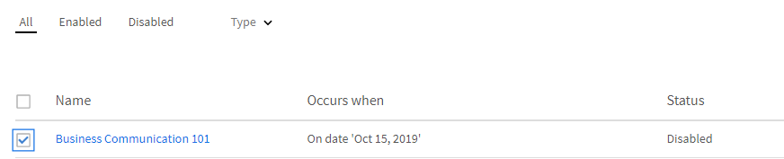

# Piani di apprendimento

Creazione di piani di apprendimento per Amministratori in Learning Manager.

## Panoramica {#overview}

Un piano di apprendimento è un insieme di regole che consente di iscrivere gli Allievi a corsi di formazione specifici in base a determinati criteri.

Un piano di apprendimento consente a un Amministratore di assegnare automaticamente corsi, programmi di apprendimento o certificazioni in base al verificarsi di determinati eventi, come l’inserimento di un nuovo dipendente o il cambiamento di designazione o posizione dei dipendenti.

Ad esempio, quando un dipendente entra a far parte di un&#39;organizzazione, il nuovo programma di orientamento per i dipendenti viene assegnato automaticamente al dipendente. Analogamente, se un dipendente viene promosso come responsabile, al dipendente viene automaticamente assegnato un nuovo programma di orientamento responsabile.

Puoi iscrivere automaticamente gli Allievi a qualsiasi corso e programma di apprendimento in base a un set predefinito di eventi. Puoi creare percorsi di apprendimento per gli Allievi assegnando automaticamente un’attività di apprendimento di follow-up dopo che un Allievo ha completato un’abilità, un corso o un programma di apprendimento.

## Creazione di piani di apprendimento {#createlearningplans}

Per creare un piano di apprendimento, devi accedere come Amministratore.

1. Nel riquadro a sinistra, fai clic su **[!UICONTROL Piani di apprendimento]**. Gli eventuali eventi esistenti vengono elencati nella pagina. Tuttavia, se stai configurando la funzione del piano di apprendimento per la prima volta, continua con il passaggio successivo.
1. Nell’angolo superiore destro della pagina, fai clic su **[!UICONTROL Aggiungi]**. Nella **[!UICONTROL Aggiungi piano di apprendimento]** , inserisci il nome del piano di apprendimento che un dipendente deve accettare.

   

1. Nella **[!UICONTROL Si verifica quando]** dall&#39;elenco a discesa, scegli l&#39;evento richiesto. Le opzioni determinano quando un Allievo segue il corso. Dopo aver selezionato il tipo di evento, seleziona il corso di formazione, i corsi, il programma di apprendimento o la certificazione appropriati.

   **Nota:** Sia gli Amministratori che gli Autori possono creare eventi di iscrizione automatica.

   Gli eventi sono:

   **1 - Viene aggiunto un nuovo Allievo:** Quando un nuovo utente o dipendente entra a far parte dell&#39;organizzazione.

   

   **2 - L’Allievo viene aggiunto a un gruppo:** Quando un nuovo utente o un dipendente viene aggiunto a un gruppo.  Immetti e seleziona il gruppo di utenti dall’elenco a discesa a cui è applicabile questo evento. Puoi scegliere più gruppi. Inoltre, è possibile assegnare questo evento a tutti i membri esistenti di questi gruppi selezionando l&#39;opzione.

   

   Questo piano di apprendimento è progettato specificamente per ***Personalizzato - Raggruppamento*** utenti. Digita il nome del gruppo nel campo e, con la ricerca con completamento automatico, scegli il gruppo o i gruppi.

   **3 - L’Allievo completa un oggetto di apprendimento:** L’evento viene attivato quando un Allievo completa un oggetto di apprendimento, ad esempio un corso, un programma di apprendimento e così via. Seleziona l’oggetto di apprendimento per il quale è applicabile questo evento. Selezionare lo stato di completamento dell&#39;evento. Facoltativamente, puoi anche scegliere il gruppo di utenti a cui appartiene l’Allievo. Immetti il numero di giorni in cui, dopo aver completato l’oggetto di apprendimento, questo evento viene attivato. Seleziona l’opzione se desideri assegnare questo evento agli utenti esistenti che hanno già completato l’oggetto di apprendimento.

   

   **4 - L’Allievo ottiene un livello di abilità:** Immetti il nome dell’abilità e seleziona il livello di abilità. Puoi anche scegliere il gruppo di utenti a cui appartiene questo Allievo. È opzionale. Immetti il numero di giorni in cui, dopo aver raggiunto l’abilità, questo evento viene attivato. Seleziona questa opzione se desideri assegnare l’evento agli Allievi esistenti che hanno già acquisito questa abilità.

   

   Inoltre, imposta il numero di giorni trascorsi i quali il piano di apprendimento deve essere assegnato agli Allievi.

   

   **5 - In una data specifica:** Quando gli eventi devono verificarsi in una data specifica. Selezionare la data in cui l&#39;evento deve essere assegnato. Seleziona i gruppi di utenti a cui assegnare automaticamente l’evento. Seleziona le istanze da assegnare e facoltativamente inserisci dopo quanti giorni deve essere attivato l&#39;evento.

   

1. Per tutti gli eventi, è possibile selezionare l&#39;istanza dal menu **[!UICONTROL Istanza]** elenco a discesa. Puoi anche selezionare le istanze dell’Apprendimento assegnato per qualsiasi evento.

   

   In Learning Manager, un piano di apprendimento crea una propria istanza, Automatico. Quando scegli un gruppo, ad esempio, Tutti gli Allievi, quindi per impostazione predefinita, tutti gli Allievi nel piano di apprendimento vengono iscritti all’istanza Automatico.

   Quando salvi il piano di apprendimento, l’istanza Automatico viene visualizzata come opzione nel **[!UICONTROL Seleziona istanza]** elenco a discesa nella sezione Allievi di un corso.

1. Per salvare il piano di apprendimento, fai clic su **[!UICONTROL Salva]**.

## Annulla l’iscrizione al corso di formazione {#unenroll-training}

Quando viene aggiunto un piano di apprendimento, un Amministratore può annullare l’iscrizione degli utenti da determinati corsi di formazione in base a determinati trigger.

Nell’app di amministrazione, fai clic su **[!UICONTROL Piani di apprendimento]** > **[!UICONTROL Aggiungi]**.

Le sezioni successive rappresentano i trigger in cui l’opzione **[!UICONTROL Annulla iscrizione al corso di formazione]** è stato aggiunto.

## L’Allievo viene rimosso da un gruppo {#learnergetsremovedfromagroup}

1. Aggiungi uno o più gruppi di utenti. Nel caso in cui siano stati selezionati più gruppi, il piano viene attivato nel momento in cui un Allievo viene rimosso da uno dei gruppi sopramenzionati.
1. Scegli l’azione come **[!UICONTROL Annulla l’iscrizione al corso di formazione]**.

   1. L’Amministratore può scegliere i corsi di formazione da cui verrà annullata l’iscrizione dell’utente quando verrà rimosso dal gruppo di utenti.
   1. L’istanza e la data di completamento non saranno applicabili in questo scenario.

## L’Allievo completa un corso di formazione {#learnercompletesatraining}

1. Aggiungi uno o più gruppi di utenti. Nel caso in cui siano stati selezionati più gruppi, il piano viene attivato nel momento in cui un Allievo completa il corso di formazione specificato.
1. Scegli l’azione come **[!UICONTROL Annulla l’iscrizione al corso di formazione]**.

   1. L’Amministratore può scegliere i corsi di formazione da cui verrà annullata l’iscrizione dell’utente quando verrà aggiunto al gruppo di utenti.
   1. L’istanza e la data di completamento non saranno applicabili in questo caso.

## L’Allievo viene aggiunto a un gruppo {#learnergetsaddedtoagroup}

1. Aggiungi uno o più gruppi di utenti. Nel caso in cui siano stati selezionati più gruppi, il piano viene attivato nel momento in cui un Allievo viene aggiunto a uno dei gruppi sopramenzionati.
1. Scegli l’azione Annulla iscrizione al corso di formazione.

   1. L’Amministratore può scegliere i corsi di formazione da cui verrà annullata l’iscrizione dell’utente quando verrà aggiunto al gruppo di utenti.
   1. L’istanza e la data di completamento non saranno applicabili in questo caso.

## L’Allievo ottiene un livello di abilità {#learnerachievesaskilllevel}

1. Specifica l’abilità da raggiungere.
1. Aggiungi uno o più gruppi di utenti. Nel caso in cui siano stati selezionati più gruppi, il piano viene attivato nel momento in cui un Allievo ottiene l’abilità selezionata.

## In una data specifica {#onaspecificdate}

1. Scegli la data in cui verrà annullata l’iscrizione degli Allievi.
1. Aggiungi uno o più gruppi di utenti. Nel caso in cui siano stati selezionati più gruppi, il piano viene attivato in quella data e viene annullata l’iscrizione degli utenti che fanno parte dei gruppi selezionati.
1. Scegli l’azione Annulla iscrizione al corso di formazione.

   1. L’Amministratore può scegliere i corsi di formazione da cui verrà annullata l’iscrizione dell’utente quando verrà annullata nella data specificata.
   1. L’istanza e la data di completamento non saranno applicabili in questo caso.

## Modifica di un piano di apprendimento {#editalearningplan}

Dopo aver creato un piano di apprendimento, l’Amministratore può modificarlo o aggiornarlo in qualsiasi momento. Per Modifica, fai clic sul nome del piano di apprendimento e modifica i valori nella **[!UICONTROL Modifica piano di apprendimento]** finestra di dialogo a comparsa visualizzata. Fai clic **[!UICONTROL Salva]**.

## Abilitare un piano di apprendimento {#enablealearningplan}

Per impostazione predefinita, tutti i nuovi piani di apprendimento che hai creato si trovano in uno stato disabilitato. È necessario abilitare un piano per l’assegnazione di un Allievo. Quando si attiva la casella di controllo **[!UICONTROL Allievi correnti]**, l&#39;evento viene abilitato da solo.

Per abilitare un piano di apprendimento,

1. Dall’elenco dei piani di apprendimento, scegli il piano che desideri abilitare.

   

1. Nell’angolo superiore destro della pagina, fai clic su **[!UICONTROL Azioni]** > **[!UICONTROL Abilita]**. In questo modo viene abilitato il piano di apprendimento.

## Eliminare un piano di apprendimento {#deletealearningplan}

Per eliminare un piano di apprendimento:

1. Dall’elenco dei piani di apprendimento, scegli il piano da eliminare.
1. Nell’angolo superiore destro della pagina, fai clic su **[!UICONTROL Azioni]** > **[!UICONTROL Elimina]**.

## Disabilitare un piano di apprendimento {#disablealearningplan}

Per disattivare un piano di apprendimento:

1. Fai clic sulla scheda **[!UICONTROL Abilitato]**.
1. Dall’elenco dei piani di apprendimento, scegli il piano che desideri disabilitare.
1. Nell’angolo superiore destro della pagina, fai clic su **[!UICONTROL Azioni]** > **[!UICONTROL Disabilita]**. In questo modo il piano viene spostato nel **[!UICONTROL Disattivato]** scheda.

## Filtrare un piano di apprendimento {#filteralearningplan}

Puoi filtrare i piani di apprendimento in base al tipo di evento utilizzato durante la creazione di un piano di apprendimento. Fai clic **[!UICONTROL Tipo]** e scegli qualsiasi opzione per visualizzare i piani di apprendimento corrispondenti alla selezione.

## Domande frequenti {#frequentlyaskedquestions}

1. Come si imposta Learning Manager per configurare le iscrizioni automatiche per la registrazione dei nuovi assunti?

   Nella **[!UICONTROL Si verifica quando]** dall&#39;elenco a discesa, scegli l&#39;opzione **[!UICONTROL Nuovo Allievo aggiunto]**. Quindi assegna gli oggetti di apprendimento, l’istanza e la data di completamento per l’Allievo. Sia gli Amministratori che gli Autori possono creare eventi di iscrizione automatica. Abilita l’evento dopo averlo creato.

1. Come si imposta un piano di apprendimento/iscrizione automatica per un corso in aula e in aula virtuale?

   Si consiglia di configurare l’istanza del corso con i dettagli della sessione richiesti. Quindi configura un piano di apprendimento e mapparlo all’istanza del corso che è già stata creata.

1. Come si visualizza l’elenco degli Allievi iscritti a un piano di apprendimento specifico?

   Quando l’istanza, Auto, viene creata, fai clic su **[!UICONTROL Corso]** > **[!UICONTROL Allievi]** e scegli l&#39;istanza richiesta dal menu **[!UICONTROL Istanza]** elenco a discesa.
