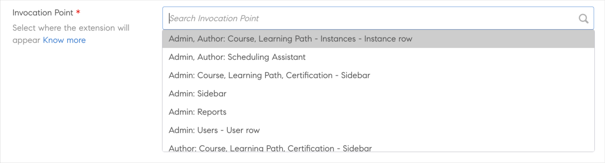
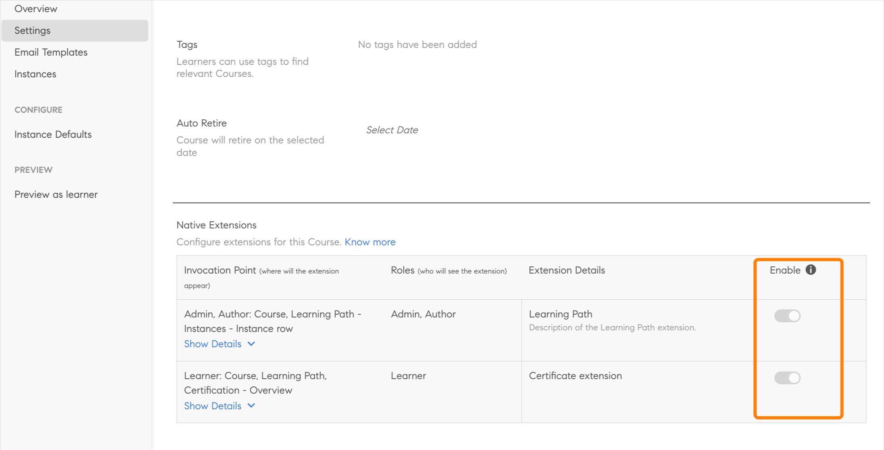
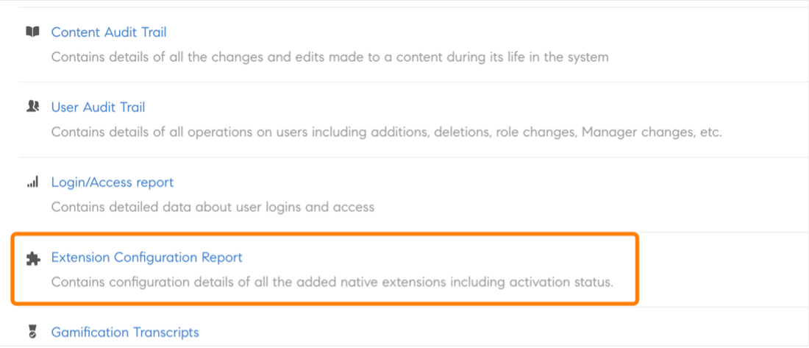

# Estendibilità nativa

Puoi configurare esperienze personalizzate all’interno della versione nativa di Adobe Learning Manager, per evitare di usare l’approccio headless per i casi meno complicati. Puoi anche creare app personalizzate e inserirle in vari punti nella versione nativa dei flussi di lavoro di Allievo, Manager, Amministratore, Autore o Istruttore.

Adobe Learning Manager supporta 15 punti di chiamata nell’app per Amministratori, Autori, Allievi, Manager e Istruttori.

## Creare un’estensione

1. In qualità di Amministratore, nel pannello a sinistra seleziona **[!UICONTROL Estensioni native]**.
1. Seleziona Aggiungi estensione.
1. Digitare il nome dell&#39;estensione nel campo **[!UICONTROL Nome]**.
1. Digitare la descrizione dell&#39;estensione nel campo **[!UICONTROL Descrizione]**.
1. Seleziona un punto di chiamata. Un punto di chiamata è qualsiasi posizione in Adobe Learning Manager in cui è possibile inserire un collegamento o un pulsante in un’app personalizzata. Sono disponibili i seguenti punti di chiamata:

   Per questo esempio, seleziona **[!UICONTROL Amministratore]**, **[!UICONTROL Autore: corso]**, **[!UICONTROL percorso di apprendimento]** - **[!UICONTROL Istanze]** - **[!UICONTROL Riga istanza]**.

   
   *Selezionare il punto di chiamata*

1. Digitare l&#39;etichetta di estensione che verrà visualizzata nell&#39;interfaccia utente nel campo **[!UICONTROL Etichetta estensione]**.
1. Digita l’URL in cui desideri ospitare l’estensione nel campo **[!UICONTROL URL]**.
1. Nel menu a discesa Apri in, seleziona se avviare l’estensione in una scheda modale o in una nuova scheda.
1. Seleziona la dimensione della finestra modale. Le opzioni sono disponibili se hai selezionato la modalità *In-app* nel passaggio precedente.

   Per mantenere l&#39;accessibilità all&#39;interno del popup, l&#39;app dell&#39;estensione deve essere inviata all&#39;evento una volta che si trovano sull&#39;ultimo elemento attivabile sul loro sito Web, e quindi l&#39;utente seleziona il tasto TAB. Ciò è necessario per mantenere l’attenzione all’interno del popup per supportare l’accessibilità.

   ```
   window.parent.postMessage({*}
   
   { type: 'ALM_EXTENSION_APP', eventType: 'trapFocusInModal' }
   
   ,{}'');
   ```

1. Imposta l’ambito dell’estensione. Sono disponibili le opzioni seguenti:

   * **[!UICONTROL Tutti i corsi, percorsi di apprendimento e certificazioni]**: questa estensione è abilitata per tutti i corsi, i percorsi di apprendimento e le certificazioni. Insieme agli Amministratori, gli Autori possono disabilitarla per alcuni Corsi, Percorsi di apprendimento e Certificazioni.
   * **[!UICONTROL Corsi, percorsi di apprendimento e certificazioni selezionati]**: questa estensione è disabilitata per tutti i corsi, i percorsi di apprendimento e le certificazioni. Insieme agli Amministratori, gli Autori possono abilitarla per alcuni Corsi, Percorsi di apprendimento e Certificazioni.

1. Seleziona l’opzione **[!UICONTROL Attiva]** per rendere attiva l’estensione. Una volta attivata, l’estensione viene visualizzata sul punto di chiamata specificato in base all’ambito.
1. Seleziona **[!UICONTROL Salva]** nell’angolo in alto a destra della pagina per creare l’estensione.

## Accedere all’estensione come Amministratore

1. In qualità di Amministratore, seleziona **[!UICONTROL Percorsi di apprendimento]** nella barra degli strumenti a sinistra.
1. Seleziona un corso > **[!UICONTROL Visualizza percorso di apprendimento]**.
1. Seleziona **[!UICONTROL Istanze]** nel pannello a sinistra.
1. Seleziona **[!UICONTROL Altro]** nella sezione Istanze. L’estensione viene visualizzata nella sezione Istanze.

   
   *Selezionare l&#39;estensione*

   Quando selezionate l’estensione, questa viene visualizzata nel menu a scelta rapida.

## Accedere all’estensione come Autore

1. In qualità di Amministratore, seleziona **[!UICONTROL Percorsi di apprendimento]** nella barra degli strumenti a sinistra.
1. Seleziona un corso > **[!UICONTROL Visualizza percorso di apprendimento]**.
1. Seleziona **[!UICONTROL Istanze]** nel pannello a sinistra.
1. Seleziona **[!UICONTROL Altro]** nella sezione Istanze. L’estensione viene visualizzata nella sezione Istanze.

   
   *Accedere all&#39;estensione come autore*

   Quando selezionate l’estensione, questa viene visualizzata nel menu a scelta rapida.

## Visualizzare tutte le estensioni

In qualità di Amministratore, puoi visualizzare tutte le estensioni nella pagina Estensioni native. Per visualizzare l’elenco, seleziona Estensioni native nel pannello a sinistra dell’app.


*Visualizza tutte le estensioni*

## Abilitare o disabilitare un’estensione

In qualità di Autore, nella pagina Impostazioni di un corso, puoi abilitare o disabilitare un’estensione per un corso, una certificazione o un percorso di apprendimento.


*Attiva un&#39;estensione*

## Condividere una chiave di accesso

Devi condividere la chiave di accesso se stai configurando un’estensione di iscrizione.

Questo è importante perché se questa chiave non viene generata e condivisa tra gli utenti, l’autenticazione per l’iscrizione non riesce e gli Allievi non possono iscriversi ai corsi.

La chiave di accesso deve essere condivisa per l’iscrizione a un corso o a un percorso di apprendimento e per i certificati.

Nella scheda Impostazioni, genera la chiave.


*Condividere la chiave di accesso*

## Scaricare il report dell’estensione

È possibile scaricare questo report in due modi.

**Report di configurazione dell&#39;estensione**

1. Nella pagina Estensioni native, seleziona **[!UICONTROL Report di configurazione dell’estensione]**.

   
   *Scarica report estensione*

   Il report viene generato.

1. Seleziona OK.

   
   *Generazione del report*

   Il report contiene i seguenti campi:

   * Nome dell’estensione
   * Punto di invocazione
   * Etichetta
   * Apri in URL
   * Ambito
   * Attiva
   * ID univoco LO
   * ID del corso di formazione
   * Tipo di formazione
   * Nome formazione

**Pagina dei report**

1. In **[!UICONTROL Report]** > **[!UICONTROL Report personalizzati]**, seleziona **[!UICONTROL Report configurazione estensione]**.

   
   *Scarica il report dalla pagina Report*

Lo stato deve essere compreso nell&#39;intervallo **0 - 4294967295**, durante la configurazione dello stato di registrazione.
