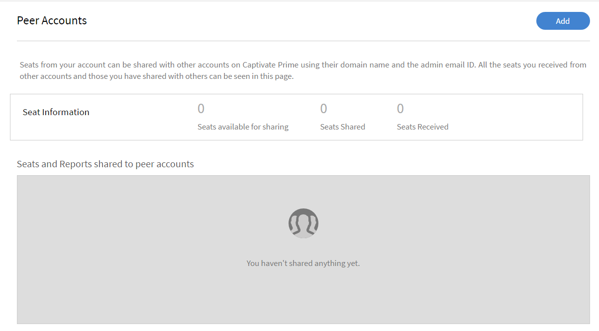
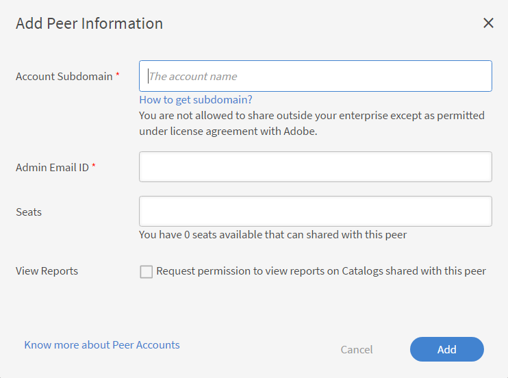

# Account condivisi tra pari

Leggi questo articolo per sapere come creare e gestire account condivisi tra pari in Learning Manager.

Learning Manager offre la possibilità di condividere le postazioni acquistate mediante la funzione Account condivisi tra pari. Con gli account condivisi tra pari in Learning Manager, un Amministratore può condividere le postazioni acquistate con gli account condivisi tra pari a cui è associato. Inoltre, l’Amministratore che ha avviato la condivisione delle postazioni può visualizzare i report relativi agli account condivisi tra pari.

## Aggiunta di un account condiviso tra pari {#addapeeraccount}

1. Nel dashboard Amministratore, fai clic su **[!UICONTROL Impostazioni]** > **[!UICONTROL Account condivisi tra pari]**.
1. Dall&#39;angolo superiore destro, fai clic su **[!UICONTROL Aggiungi]**.

   

   *Aggiungi account condiviso tra pari*

1. Nel campo **[!UICONTROL Dominio secondario account]** specificare il dominio secondario con cui si desidera stabilire un account condiviso tra pari.

   

   *Aggiungi un sottodominio*

>[!NOTE]
>
>Per trovare il dominio secondario di un altro account, controlla l’URL dell’account. Il sottodominio viene visualizzato prima del dominio principale e consente di identificare l’account specifico.
>
>Ad esempio:
>
>Nell&#39;URL [https://www.learningmanager.com/accountname](https://www.learningmanager.com/accountname), il sottodominio è **accountname**.
>
>Nell&#39;URL [https://www.accountname.learningmanager.com](https://www.accountname.learningmanager.com), il sottodominio è anche **accountname**.
>
>Il dominio secondario è univoco per ogni account e viene utilizzato per accedere alla rispettiva istanza di Learning Manager.

1. Immetti l’ID e-mail dell’Amministratore che accetta o rifiuta la richiesta di account condiviso tra pari.
1. Specifica il numero di postazioni da condividere con l’utente di pari livello. Quando condividi postazioni con un account condiviso tra pari, lo stato dell’account diventa Attivo con le postazioni ricevute o con le postazioni acquistate dell’utente di pari livello.

   Se immetti un numero maggiore delle postazioni disponibili, viene visualizzato un avviso.

1. Seleziona la casella di controllo se desideri visualizzare i report di iscrizione e i report di catalogo condivisi relativi agli utenti di pari livello.
1. Fai clic su Aggiungi per aggiungere l’account condiviso tra pari.

   Se un Amministratore condivide postazioni con un utente di pari livello, questo non può condividerle con nessun altro. Tuttavia, l’utente di pari livello può acquistare separatamente alcune postazioni e condividerle.

## Visualizzare le postazioni condivise dagli account condivisi tra pari

Gli amministratori possono visualizzare il numero di postazioni condivise dagli account condivisi tra pari nell’interfaccia di amministrazione.

Per visualizzare le postazioni condivise dall’account condiviso tra pari:

1. Accedi a Adobe Learning Manager come amministratore.
2. Seleziona **[!UICONTROL Utenti]**, quindi seleziona **[!UICONTROL Interni]**.

_Sezione Utenti che mostra il numero di postazioni condivise dall’account condiviso tra pari_

## Visualizzazione dei report associati agli account condivisi tra pari {#viewreportsassociatedwithpeeraccounts}

Dopo aver stabilito un account condiviso tra pari, è possibile creare report anche per gli account condivisi tra pari. In qualità di Amministratore, se avvii la richiesta di account condiviso tra pari, puoi visualizzare i report relativi a esso.

Se anche l’utente di pari livello desidera visualizzare i report dell’Amministratore deve inviargli una richiesta separata di account condiviso tra pari.

Per sapere come generare e visualizzare i cataloghi condivisi dell’account condiviso tra pari, consulta [Visualizzazione report utente di pari livello](reports.md#main-pars_header_894271250).

## Eliminazione di account condivisi tra pari {#deletingpeeraccounts}

Se non desideri più condividere postazioni o acquisti con un account, puoi eliminare l’account condiviso tra pari.

1. Dall’app di amministrazione Learning Manager, fai clic su Impostazioni > Account condivisi tra pari.
1. Seleziona uno o più account condivisi tra pari che desideri eliminare.
1. Effettua una delle seguenti operazioni:

   * Fai clic su Elimina dall’angolo superiore destro della pagina.
   * Fai clic sull’icona Elimina accanto all’account condiviso tra pari che desideri eliminare.

   Una volta che l’account condiviso tra pari viene eliminato, le postazioni ricevute non saranno più disponibili. Se l’account condiviso tra pari presenta solo postazioni ricevute e non postazioni acquistate, lo stato dell’account diventa Inattivo.

## Report utente di account condivisi tra pari {#download-peer-account}

L’Amministratore può visualizzare il report utente dell’account condiviso tra pari. L’Amministratore dell’account principale può richiedere l’accesso al report e una volta che l’Amministratore dell’account condiviso tra pari accetta, l’Amministratore principale sarà in grado di visualizzare il numero di utenti registrati nell’ account condiviso tra pari e potrà scaricare il report utente per tale account.

1. Nella pagina Account condivisi tra pari, fai clic su **[!UICONTROL Aggiungi]**.
1. Abilita l’opzione **[!UICONTROL Richiedi l’autorizzazione per scaricare i report utente per l’intero account]**.

*Visualizza report utente di un account condiviso tra pari*

Per scaricare i report degli account condivisi tra pari, fai clic su **[!UICONTROL Scarica]**.

## Visualizzazione del nome dell’autore per i corsi condivisi (inclusi i corsi acquisiti in precedenza)

Adobe Learning Manager visualizza il **nome dell’autore originale** per i corsi condivisi o acquisiti tramite account condivisi tra pari.

In precedenza, i corsi acquisiti da account condivisi tra pari venivano spesso visualizzati con il nome dell’autore come **Autore esterno**. Questa funzione è stata migliorata per migliorare l’attribuzione e la chiarezza dei contenuti.

### Come funziona

* Quando un corso viene condiviso da un account condiviso tra pari, Learning Manager ora risolve e visualizza il **nome effettivo dell’autore** dall’account di origine.
* Questo comportamento si applica a:
   * Corsi condivisi di recente
   * Corsi acquisiti prima dell’introduzione di questo miglioramento

### Comportamento retroattivo

Questo miglioramento viene applicato **retroattivamente**.\
I corsi acquisiti da account condivisi tra pari prima di questa modifica visualizzano automaticamente il nome dell’autore corretto.

Non è richiesta alcuna azione da parte di amministratori o autori:

* Non è necessario condividere nuovamente il corso
* Non è necessario pubblicare nuovamente o modificare il corso
* Le iscrizioni e l’avanzamento degli Allievi esistenti rimangono invariati

### Cosa non cambia

* La proprietà e le autorizzazioni del corso rimangono invariate
* Viene aggiornato solo il **nome autore visualizzato**
* I report, le iscrizioni e la struttura del corso non sono interessati

Ciò garantisce un’attribuzione accurata e coerente degli autori a tutti i contenuti condivisi, inclusi i corsi storici acquisiti tramite account condivisi tra pari.

## Domande frequenti {#frequentlyaskedquestions}

+++Come condividere le postazioni da un account a un altro?

Quando aggiungi un account condiviso tra pari, specifica il numero di postazioni che puoi condividere con un altro account condiviso tra pari.

*Condividere postazioni da un account a un altro*
+++
