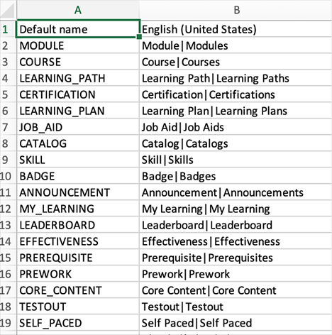

# Terminologia del prodotto

>[!IMPORTANT]
>
>La terminologia del prodotto è disponibile solo per la versione inglese di Adobe Learning Manager.

## Cos’è la terminologia del prodotto in Adobe Learning Manager

Adobe Learning Manager utilizza un insieme standard di terminologie nell’interfaccia utente. In qualità di amministratore, puoi modificare le terminologie in base alle esigenze della tua organizzazione.

Utilizzando la funzione Terminologia del prodotto, puoi rinominare questi termini e mantenere la coerenza con gli standard di apprendimento dell’organizzazione.

## Download del file CSV della terminologia

Per modificare le terminologie, effettua le seguenti operazioni:

1. In qualità di Amministratore, seleziona **[!UICONTROL Impostazioni]** > **[!UICONTROL Generale]**.
1. Nella **[!UICONTROL Terminologia del prodotto]**, seleziona **[!UICONTROL Modifica]**.

   
   _Terminologia del prodotto_

1. Seleziona **[!UICONTROL Scarica qui]** e scaricare il modello dei termini.

   
   _Scarica il modello_

## Modifica dei termini

1. Dopo aver scaricato il file CSV, modifica le terminologie richieste nella seconda colonna. Ad esempio, puoi passare da Modulo a Formazione o da Classifica a Posizioni.

   
   _Modificare il file CSV_

1. Salva le modifiche.

## Carica il CSV aggiornato.

1. Nella **[!UICONTROL Terminologia del prodotto]** seleziona il collegamento per caricare il file CSV.

   
   _Carica il file CSV_

1. Carica il CSV aggiornato.
1. Seleziona **[!UICONTROL Salva]**.

Le modifiche apportate alle terminologie ora riflettono un Autore, un Allievo, un Manager, un Istruttore o un Amministratore personalizzato per tale account.

## Ripristino delle terminologie

Dopo aver caricato il file CSV con le nuove terminologie, puoi ripristinare le terminologie predefinite.

Seleziona **[!UICONTROL Ripristina terminologia del prodotto]**.

_Reimpostare la terminologia del prodotto_

Facendo clic sul collegamento, viene visualizzato un messaggio a comparsa di conferma.

_Richiesta di conferma_

La terminologia viene ripristinata ai nomi originali.

## Cosa non cambia

Le modifiche alla terminologia non si applicano a:

* Modelli e-mail (**[!UICONTROL Amministratore]** > **[!UICONTROL Modelli e-mail]**)
* Report (**[!UICONTROL Amministratore]** > **[!UICONTROL Report]**)

