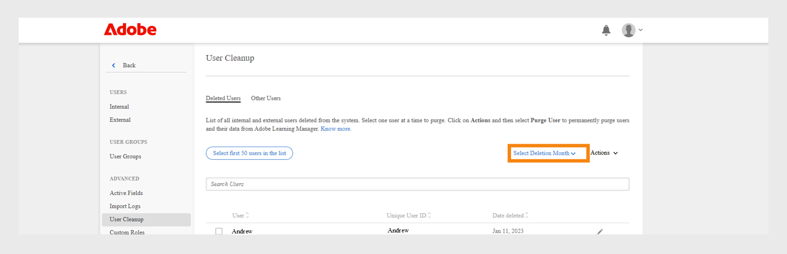

# Rimuovere utenti

Scopri come rimuovere i dati degli utenti in Learning Manager.

## Panoramica {#overview}

Utilizza la funzione di rimozione degli utenti per rimuovere da Learning Manager le informazioni di identificazione personale e i record di apprendimento dell’utente. Le funzioni Elimina e Rimuovi utente sono due funzioni differenti. Un utente eliminato può essere ripristinato, mentre non è possibile ripristinare i dati utente e i record di apprendimento associati a un utente rimosso.

L’azione di rimozione dell’utente può avere i seguenti risultati:

* Se un utente viene rimosso, i collegamenti nei registri di importazione non funzionano per evitare il download dei vecchi file CSV e il ripristino dei dati utente nel sistema.
* Se un Autore viene rimosso, il suo nome viene sostituito dal nome dell’amministratore che ha rimosso quell’utente.
* Se gli Istruttori vengono rimossi, vengono rimossi anche dalle sessioni. L’Amministratore deve sostituire/aggiungere istruttori per tali sessioni.
* La rimozione di un utente in Learning Manager non rimuove quel determinato utente da eventuali applicazioni esterne (sistemi di terze parti o altre applicazioni che hai realizzato). Contattare i proprietari delle applicazioni esterne per rimuovere gli utenti da tali applicazioni.
* Se un utente rimosso è indicato nelle impostazioni di configurazione di un connettore, tale connettore viene disabilitato. Per riprendere il connettore, è necessario che sia riconfigurato dall’amministratore.

<!---### Manage users

In this training, you will learn how to assign and remove roles, send a welcome email, and delete and purge users. 

If you're unable to launch the training, write to <almacademy@adobe.com>.-->

## Come rimuovere gli utenti

Per rimuovere gli utenti, effettua le seguenti operazioni:

1. In qualità di Amministratore, seleziona **[!UICONTROL Utenti]** dal riquadro a sinistra. Viene visualizzata la pagina **[!UICONTROL Utenti interni]**.
1. Elimina gli utenti che desideri rimuovere. Per farlo, seleziona uno o più utenti mediante la casella di controllo. Apri il menu a discesa **[!UICONTROL Azione]** e seleziona **[!UICONTROL Elimina utente.]**
1. Nel riquadro a sinistra, seleziona **[!UICONTROL Pulizia utente]**. Verrà visualizzata la pagina **[!UICONTROL Pulizia utente]** con l’elenco degli utenti eliminati. Utilizza i pulsanti di opzione per selezionare l’utente da rimuovere. Puoi rimuovere un solo utente alla volta.

   

   *Selezionare un utente da rimuovere*

1. Apri il menu a discesa **[!UICONTROL Azioni]** e seleziona **[!UICONTROL Rimuovi utente]**.

   

   *Selezionare l&#39;opzione Rimuovi utente*

1. Viene visualizzata una finestra di dialogo che richiede una conferma. Una volta rimossi, tutti i dati utente e i record di apprendimento associati all’utente selezionato vengono cancellati in modo permanente. Una volta effettuata la rimozione, l’azione non può essere annullata. Per confermare, fai clic su **[!UICONTROL Rimuovi]**.

   

   *Messaggio di conferma dopo la rimozione di un utente*

1. Dopo aver confermato e fatto clic su Rimuovi, la richiesta di rimozione viene accettata. Una volta completata l’azione, riceverai una notifica. Viene fornito anche un ID di richiesta di rimozione. È possibile fornire questo ID al CSM per tenere traccia della richiesta.

>[!NOTE]
>
>Una volta aggiunto nuovamente l’utente eliminato al sistema, i ruoli precedenti (ad esempio Amministratore, Manager, Autore, Istruttore ecc.) non verranno mantenuti.Verranno aggiunti con il ruolo di Allievo.

## Rimuovere gli utenti in blocco

Puoi selezionare i primi 50 utenti ed eliminarli in una sola volta. Ciò consente agli amministratori di selezionare 50 utenti contemporaneamente ed eliminarli insieme. Questo consente agli amministratori di rimuovere gli utenti in blocco. È sempre consigliabile controllare gli utenti selezionati per l’eliminazione. Questo è fondamentale per garantire l’eliminazione del gruppo di utenti corretto.

*Rimuovi utenti in blocco*

## Filtra gli utenti eliminati prima della rimozione

Adobe Learning Manager consente agli amministratori di rimuovere definitivamente gli utenti che sono già stati eliminati dalla piattaforma. Questo processo, denominato eliminazione, consente alle organizzazioni di mantenere un database degli Allievi pulito, rispettare le regole di conservazione dei dati e impedire l&#39;accesso non autorizzato ai dati degli utenti.
Ciò è particolarmente utile per mantenere l&#39;igiene dei dati e garantire che i vecchi dati utente non utilizzati vengano rimossi dal sistema.
La rimozione degli utenti è essenziale per rispettare le linee guida sulla privacy dei dati o per mantenere un archivio dati igienizzato rimuovendo i record ridondanti.

### Filtra gli utenti eliminati per mese

Puoi filtrare gli utenti eliminati selezionando un mese specifico e quindi eliminandoli definitivamente.

Per filtrare gli utenti eliminati utilizzando il mese di eliminazione:

1. Seleziona **[!UICONTROL Utenti]** nella home page dell&#39;amministratore, quindi seleziona **[!UICONTROL Pulizia utente]**.
2. Seleziona il controllo selezione data **[!UICONTROL Seleziona mese eliminazione]** e seleziona la data.

   
   _Selezionare il mese in cui gli utenti sono stati eliminati_

   Viene visualizzato l&#39;elenco degli utenti eliminati nel mese selezionato.

   
   _Elenco degli utenti eliminati visualizzato per il mese selezionato_

### Ordina gli utenti eliminati per mese

Puoi ordinare gli utenti filtrati in base al **[!UICONTROL ID utente univoco]** e alla **[!UICONTROL data di eliminazione]**.

1. Nell’elenco degli utenti eliminati, ordina gli utenti in base ai loro ID utente o alla data di eliminazione.

   
   _Elenco utenti filtrato per ID utente univoco_

2. Seleziona uno o più utenti.
3. Seleziona **[!UICONTROL Azioni]**, quindi seleziona **[!UICONTROL Rimuovi utente]**.
4. Seleziona Rimuovi nel messaggio di conferma per eliminare definitivamente i record utente da Adobe Learning Manager.

   
   _Conferma finale prima dell&#39;eliminazione definitiva degli utenti_

>[!NOTE]
>
>La rimozione degli utenti comporta la rimozione definitiva dei dati. Prima di procedere, ricontrollare la selezione.

+++Informazioni sui risultati dell’azione Rimuovi utente

<table>
 <tbody>
  <tr>
   <th><strong>Rimozione tramite l’interfaccia utente di Learning Manager - Enterprise</strong></th>
   <th> </th>
  </tr>
  <tr>
   <td>Elimina l’utente selezionato dall’account enterprise richiedente. </td>
   <td>Sì</td>
  </tr>
  <tr>
   <td>Elimina tutti gli utenti da tutti gli account di prova il cui indirizzo e-mail, adobe_id corrisponde a quello degli utenti selezionati.</td>
   <td>Sì</td>
  </tr>
  <tr>
   <td>Elimina tutti gli utenti da tutti gli account di prova il cui indirizzo e-mail, adobe_id corrisponde a quello degli utenti selezionati, che sono gli stessi creatori dell’account di prova.</td>
   <td>No</td>
  </tr>
  <tr>
   <td>Elimina l’e-mail dell’utente da tutti gli altri campi dell’account Enterprise richiedente e da tutti gli account di prova.</td>
   <td>Sì</td>
  </tr>
  <tr>
   <td>Notifica all’iniziatore la conferma dell’eliminazione.</td>
   <td>Sì</td>
  </tr>
  <tr>
   <td><strong>Rimozione tramite l’interfaccia utente di Learning Manager - Non Enterprise</strong></td>
   <td> </td>
  </tr>
  <tr>
   <td>Elimina l’utente selezionato dall’account di prova richiedente.</td>
   <td>Sì</td>
  </tr>
  <tr>
   <td>Elimina tutti gli utenti da tutti gli account di prova il cui indirizzo e-mail, adobe_id corrisponde a quello degli utenti selezionati.</td>
   <td>Sì</td>
  </tr>
  <tr>
   <td>Elimina tutti gli utenti da tutti gli account di prova il cui indirizzo e-mail, adobe_id corrisponde a quello degli utenti selezionati, che sono gli stessi creatori dell’account di prova.</td>
   <td>No</td>
  </tr>
  <tr>
   <td>Elimina l’e-mail dell’utente da tutti gli altri campi dell’elenco Tutti gli account di prova.</td>
   <td>Sì</td>
  </tr>
  <tr>
   <td>Notifica all’iniziatore la conferma dell’eliminazione.</td>
   <td>Sì</td>
  </tr>
  <tr>
   <td><strong>Rimozione di altri utenti Enterprise (utenti privati che non sono utenti interni o esterni di Learning Manager)</strong></td>
   <td> </td>
  </tr>
  <tr>
   <td>Elimina l’utente selezionato da tutti gli altri campi dell’account Enterprise richiedente e da tutti gli account di prova.</td>
   <td>Sì</td>
  </tr>
  <tr>
   <td>Eliminazione degli utenti dagli account.</td>
   <td>No</td>
  </tr>
  <tr>
   <td>Notifica all’iniziatore la conferma dell’eliminazione. </td>
   <td>Sì</td>
  </tr>
  <tr>
   <td><strong>Rimozione</strong> <strong>di altri utenti non Enterprise (utenti privati che non sono utenti interni o esterni di Learning Manager)</strong></td>
   <td> </td>
  </tr>
  <tr>
   <td>Elimina l’utente selezionato da tutti gli altri campi dell’elenco Tutti gli account di prova.</td>
   <td>Sì</td>
  </tr>
  <tr>
   <td>Eliminazione degli utenti dagli account.</td>
   <td>No</td>
  </tr>
  <tr>
   <td>Notifica all’iniziatore la conferma dell’eliminazione.</td>
   <td>Sì</td>
  </tr>
  <tr>
   <td><strong>Rimozione tramite Adobe IMS - Enterprise</strong></td>
   <td> </td>
  </tr>
  <tr>
   <td>Notifica la richiesta all'amministratore Enterprise.</td>
   <td>Sì</td>
  </tr>
  <tr>
   <td>Verifica i campi e-mail per l’invio delle notifiche.</td>
   <td>No</td>
  </tr>
  <tr>
   <td><strong>Rimozione tramite Adobe IMS - Non Enterprise</strong></td>
   <td> </td>
  </tr>
  <tr>
   <td>Elimina tutti gli utenti che dispongono dell’ID Adobe/E-mail fornito da Tutti gli account di prova.</td>
   <td>Sì</td>
  </tr>
  <tr>
   <td>Elimina tutti gli utenti di un account di prova se l’e-mail/ID Adobe fornito era del creatore dell’account.</td>
   <td>Sì</td>
  </tr>
  <tr>
   <td>Elimina l’ID e-mail selezionato da tutti gli altri campi di tutti gli account di prova.</td>
   <td>Sì</td>
  </tr>
 </tbody>
</table>

+++

## Domande frequenti {#frequentlyaskedquestions}

+++Quanti giorni sono necessari per completare una richiesta di rimozione?

La richiesta di rimozione degli utenti richiede un massimo di 30 giorni per essere completata.
+++

+++È possibile eseguire una rimozione in blocco in Adobe Learning Manager?

Sì, puoi eseguire una rimozione in blocco, ma solo di 50 utenti.
+++

+++È possibile ripristinare un utente rimosso?

N. Una volta rimossi, tutti i dati utente vengono eliminati definitivamente e non possono essere recuperati.

+++
