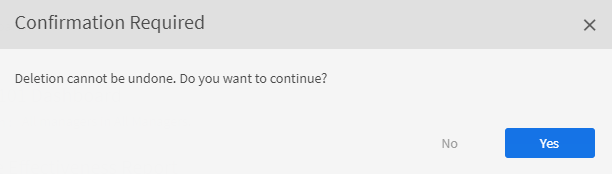
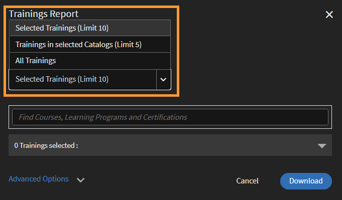

# Report

Scopri i report associati al ruolo di Amministratore nell’applicazione Learning Manager.

Adobe Learning Manager consente di creare vari report per tracciare, monitorare e controllare le attività degli Allievi. Le attività degli Allievi vengono monitorate e acquisite automaticamente nel database. I report Manager e Amministratore vengono generati dal database.

## Panoramica {#overview}

Il processo di generazione dei report è simile sia per gli Amministratori che per i Manager. I Manager possono visualizzare i report corrispondenti ai loro subordinati, mentre l’Amministratore può visualizzare tutti i report a livello di organizzazione.

I report vengono aggregati in un dashboard. Un report deve esistere all&#39;interno di un dashboard. A **[!UICONTROL Dashboard predefinito]** esiste per impostazione predefinita nella pagina dei report. Qualsiasi report aggiunto viene spostato nel dashboard predefinito. Per aggiungere report ai singoli dashboard, utilizza la freccia a discesa e scegli **[!UICONTROL Aggiungi report]**. Per ulteriori informazioni sulla creazione dei dashboard, consulta la sezione Dashboard in questa pagina.

## Dashboard di riepilogo dell’apprendimento {#dashboards}

Visualizza un report di riepilogo di tutte le attività di apprendimento nella piattaforma. In questa pagina sono disponibili le seguenti informazioni di riepilogo per il team dell’utente ROOT selezionato e i profili esterni. È inoltre possibile selezionare un intervallo di tempo:

* Riepilogo dell’apprendimento sotto forma di iscrizioni, visualizzazioni e completamenti
* Abilità principali
* Riepilogo conformità

*Grafici di riepilogo*

Se sono presenti manager di livello principale interni, questi verranno visualizzati uno dopo l&#39;altro.

Tutti i profili esterni verranno elencati dopo i profili interni (utenti di livello ROOT interni).

Se un profilo esterno dispone di un manager, la gerarchia dei manager verrà visualizzata nel **[!UICONTROL Visualizzazione dei dati per]** elenco a discesa. - L’utente verrà elencato nella gerarchia dei manager nella pagina di tutti i dettagli (Riepilogo dell’apprendimento, conformità e stato delle abilità)

In caso contrario, nell’elenco verranno visualizzati tutti i dettagli dei singoli utenti.

Per visualizzare dettagli più dettagliati sulle iscrizioni dei vari team interni, fai clic su **[!UICONTROL Dettagli di riepilogo dell’apprendimento]**.

*Dettagli del riepilogo dell’apprendimento*

Quando fai clic su un’iscrizione, puoi visualizzare gli Allievi per ogni Manager e gli oggetti di apprendimento ai quali sono iscritti. Puoi anche visualizzare i dettagli di avanzamento e completamento di ogni allievo.

*Aee Allievi assegnati a un Manager*

Fai clic su un team qualsiasi ed esporta il relativo report come file CSV. Un amministratore può esportare il report per qualsiasi gruppo di utenti o singolo utente selezionando il gruppo di utenti o il singolo utente, quindi esportando i dettagli dall’elenco a discesa Azione.

Inoltre, è possibile visualizzare un grafico a barre delle abilità in corso e acquisite. Puoi aggiungere/rimuovere le abilità che desideri includere nel grafico.

*Grafico a barre sovrapposte dello stato delle abilità*

Nella visualizzazione finale, è possibile controllare lo stato di conformità degli Allievi e intraprendere le azioni appropriate.

Inoltre, un Amministratore può visualizzare i singoli dati di formazione nel dashboard di conformità.

Ad esempio, l’Amministratore ha identificato tre corsi di formazione per monitorare la conformità. Learning Manager fornisce una panoramica della conformità per tutti e tre i corsi di formazione contemporaneamente.

Ora un Amministratore può fare clic su qualsiasi formazione e visualizzare rapidamente la conformità per il corso di formazione selezionato.

*Visualizza dashboard di conformità*

Puoi anche visualizzare lo stato di conformità per ogni team interno.

Fai clic sul collegamento **[!UICONTROL Dettagli sullo stato di conformità]** nella parte inferiore della visualizzazione.

Per un team, puoi vedere il numero di allievi nel team che violano o rispettano la conformità di apprendimento.

*Stato di conformità di un team*

## Condivisione di corsi di formazione con i Manager

Learning Manager offre un dashboard di conformità a tutti gli Amministratori e i Manager. I Manager trovano molto utile monitorare la conformità dei membri del proprio team per un determinato corso di formazione. Allo stesso tempo, gli Amministratori vorrebbero che tutti i Manager aggiungessero corsi di formazione sulla conformità al loro dashboard e li monitorassero.

In Learning Manager, il **[!UICONTROL Condividi con i Manager]** Il flusso di lavoro consente agli Amministratori di condividere i corsi di formazione con i Manager, in modo che possano essere aggiunti al dashboard di conformità di un Manager. Pertanto, i Manager non devono intraprendere alcuna azione e possono iniziare immediatamente a monitorare la conformità.

Un Amministratore può condividere una serie di corsi di formazione con i Manager individualmente o con un gruppo. Questa condivisione può aiutare un Manager a monitorare facilmente la conformità del suo team per il corso di formazione specificato.

L’Amministratore può &quot;inviare&quot; un elenco predefinito di corsi di formazione sulla conformità da visualizzare nel dashboard di conformità del Manager.

### Condivisione dei corsi di formazione

1. Ingresso **[!UICONTROL Report]** > **[!UICONTROL Riepilogo dell’apprendimento]**, scorrere verso il basso e fare clic sulla scheda **[!UICONTROL Condividi con i Manager]**.

   
   *Condivisione di corsi di formazione con i Manager*

1. Per aggiungere uno o più corsi di formazione, fai clic su **[!UICONTROL Condividi di più]**.

1. Nella **[!UICONTROL Condividi con i Manager]** seleziona i corsi di formazione e i Manager.

   
   *Seleziona i corsi di formazione da condividere con i Manager*

1. Fai clic **[!UICONTROL Condividi]**.

Il corso di formazione è ora condiviso con il Manager specificato.

### Visualizza i corsi di formazione

Nell’elenco dei corsi di formazione condivisi, fai clic su **[!UICONTROL Visualizza]**. Puoi visualizzare il corso di formazione assegnato a uno o più Manager.

### Ritiro dei corsi di formazione

1. Per ritirare i corsi di formazione da un Manager, fai clic su **[!UICONTROL Ritiro]**.

1. Fai clic **[!UICONTROL Procedi]**. Questo ritira il corso di formazione precedentemente condiviso dal dashboard di conformità del Manager.

## Dashboard di attività degli utenti {#useractivitydashboards}

Visualizza un riepilogo di tutte le attività degli utenti sulla piattaforma nel tempo. Configura gruppi di utenti e applica filtri.

Il dashboard di attività degli utenti visualizza l’attività degli utenti nell’account. I tre report elencati sono:

* **Utenti registrati:** Questo report fornisce informazioni sul numero di utenti registrati nel tuo account settimana dopo settimana. Per gli account con licenze per unità attive mensili, il report mostra le unità MAU.

* **Report visite utente:** Questo report fornisce informazioni sul numero di utenti che accedono alla piattaforma quotidianamente. È disponibile anche un report mensile.

* **Report Tempo impiegato per l’apprendimento:** Questo report fornisce informazioni sul tempo di apprendimento impiegato nella piattaforma quotidianamente. È disponibile anche un report mensile.

## Utenti registrati {#registeredusers}

Learning Manager registra ogni settimana il numero di utenti registrati nel sistema. Gli amministratori possono visualizzare questo report per comprendere il numero di utenti registrati in quel giorno della settimana. Il conteggio registrato una volta archiviato per una settimana non cambia. Pertanto, il totale registrato storico non corrisponde all’attuale numero di allievi nel sistema.

Questo report fornisce informazioni sul numero di utenti registrati nel tuo account settimana dopo settimana.

Per gli account con licenze per unità attive mensili, il report mostra le unità MAU.

*Report degli utenti registrati*

***Per gli account di unità ad accesso mensile:***

**Report degli utenti attivi mensili**

Questo report mostra il numero di Allievi attivi nella piattaforma di apprendimento ogni mese. L’utente è considerato attivo per il mese se esegue una delle azioni di apprendimento qui menzionate. Le unità attive mensili vengono conteggiate nello stesso modo.

Una volta conteggiato e archiviato per un mese, il conteggio attivo mensile non subirà modifiche. Pertanto, il totale storico visualizzato non corrisponde all’attuale numero di allievi nel sistema.

## Visite degli utenti {#uservisits}

Questo report mostra il totale degli Allievi che accedono al sistema in un periodo di un giorno o di un mese. L’esplorazione della piattaforma di apprendimento senza l’utilizzo di alcun apprendimento è considerata come un &quot;accesso&quot; alla piattaforma. Ciò aiuta l’Amministratore a comprendere il numero totale di utenti che accedono al sistema. Il primo di ogni mese, Learning Manager crea un record del numero totale di utenti che hanno effettuato l’accesso alla piattaforma nel mese precedente. Inoltre, acquisisce le informazioni sul gruppo di utenti per questi utenti.

Vengono registrati solo i gruppi di utenti configurati dall’Amministratore. Ciò consente agli amministratori di applicare un filtro ai gruppi di utenti anche per i dati storici mensili. Tieni presente che, nel caso in cui la configurazione dei gruppi di utenti sia stata modificata e Learning Manager non abbia registrato i dati di tali gruppi nei mesi precedenti, questi dati non saranno visualizzabili.

Questo report contiene gli utenti che accedono alla piattaforma in qualsiasi formato, come Web, app per dispositivi mobili, soluzioni personalizzate headless e così via. Il grafico sull’utilizzo delle app per dispositivi menziona specificamente solo gli utenti che accedono alla piattaforma utilizzando l’app per dispositivi di Learning Manager. Questo aiuta gli Amministratori a identificare l’utilizzo dell’app per dispositivi mobili nel proprio account.

*Report Visita utente*

## Report Tempo impiegato per l’apprendimento {#learningtimespentreport}

Qui puoi vedere un grafico a linee con doppio asse che mostra il tempo totale impiegato per l’apprendimento di tutti gli Allievi in un periodo di 12 mesi. Il secondo asse rappresenta il tempo mediano impiegato nell’apprendimento per un individuo.

Il tempo impiegato per i diversi oggetti di apprendimento, ad esempio programmi di apprendimento e certificazioni, viene calcolato per i seguenti elementi:

* Corso a ritmo personalizzato con contenuti statici e interattivi
* Corsi di attività con URL.
* Sessioni del fine settimana con il relativo contrassegno attivato.
* Sessione di connessione VC in cui la partecipazione è contrassegnata automaticamente.
* Tempo impiegato per i diversi oggetti di apprendimento, ad esempio programmi di apprendimento e certificazioni
* Istruzioni xAPI per un corso di attività xAPI.

Potete inoltre esportare il grafico come foglio di calcolo Excel.

Viene fornito un filtro per scegliere la configurazione del gruppo di utenti che consente di visualizzare i dati in relazione ai diversi gruppi di utenti.

Il filtro per data e gruppo di utenti selezionato viene applicato a tutti i grafici pertinenti nel dashboard.

>[!NOTE]
>
>Per **[!UICONTROL Visite degli utenti]** e **[!UICONTROL Tempo di apprendimento impiegato]** report, i dati predefiniti visualizzati (quando non è configurato alcun gruppo di utenti) sono riferiti all’intero account.

## Dashboard dei contenuti di formazione {#trainingcontentdashboard}

Il dashboard dei contenuti di formazione offre informazioni dettagliate sui corsi di formazione disponibili sulla piattaforma. Puoi visualizzare i corsi di formazione più popolari o tenere traccia di tutti quelli disponibili.

## Report dei corsi di formazione {#trainingsreport}

Questo report fornisce informazioni sul totale dei corsi di formazione disponibili sulla piattaforma (pubblicati) mese dopo mese. Indica il numero di corsi di formazione offerti nel tempo.

*Report dei corsi di formazione*

## Report dei corsi di formazione attivi {#activetrainingsreport}

Questo report fornisce informazioni sui corsi di formazione attivi nell’intervallo di tempo selezionato. I corsi di formazione attivi sono quelli a cui ci si è iscritti, che sono stati visualizzati nel lettore o che sono stati completati nel periodo di tempo specificato.

Per i corsi di formazione attivi, i dati di tutti i gruppi interni dell’utente ROOT (con il ruolo di Manager) saranno disponibili per la selezione quando non viene effettuata alcuna configurazione del gruppo di utenti. Oltre ai gruppi dell’utente ROOT, se necessario, è possibile configurare altri 10 gruppi di utenti.

*Report dei corsi di formazione attivi*

>[!NOTE]
>
>I dati non vengono visualizzati come previsto quando **[!UICONTROL Tutti gli utenti]** e **[!UICONTROL 12 mesi]** i filtri sono selezionati, ma i dati vengono visualizzati quando si seleziona **[!UICONTROL Tutti i gruppi di utenti interni].**

<table>
 <tbody>
  <tr>
   <td>
    
<b>Riferimento</b>
</td>
   <td>
    
<b>Metrica</b>
</td>
   <td>
    
<b>Descrizione</b>
</td>
  </tr>
  <tr>
   <td>
    
1
</td>
   <td>
    
Rapporto iniziale (%)
</td>
   <td>
    
Rapporto tra il numero di allievi che hanno iniziato il corso e il numero di iscrizioni.
</td>
  </tr>
  <tr>
   <td>
    
2
</td>
   <td>
    
Rapporto di completamento (%)
</td>
   <td>
    
Rapporto tra gli utenti totali che hanno completato il corso e gli utenti totali che lo hanno iniziato. 
</td>
  </tr>
  <tr>
   <td>
    
3
</td>
   <td>
    
Feedback degli Allievi
</td>
   <td>
    
Media di tutte le risposte di feedback L1 ricevute su una scala da 1 a 10 arrotondate al numero intero più vicino. 
</td>
  </tr>
  <tr>
   <td>
    
4
</td>
   <td>
    
Feedback dei manager
</td>
   <td>
    
Media di tutte le risposte di feedback L3 ricevute su una scala da 1 a 5 arrotondate al numero intero più vicino 
</td>
  </tr>
 </tbody>
</table>

Il report sulla formazione ha due colonne aggiuntive:

1. Valutazione a stelle media di un corso.
1. Numero di Allievi che hanno valutato il corso.
1. Percorso incorporato
1. ID percorso incorporato
1. ID corso incorporato

>[!NOTE]
>
>I filtri applicati non influiscono sul rapporto iniziale, sul rapporto di completamento, sul feedback degli allievi e sul feedback dei manager. I filtri influiscono solo su iscrizioni, visualizzazioni e completamenti.

>[!NOTE]
>
>Per entrambi i report (Contenuti di formazione, Attività degli utenti), è possibile configurare un massimo di 10 gruppi di utenti. L’elaborazione può richiedere fino a 24 ore per essere completata e per rendere disponibili i nuovi filtri configurati.

## Report dashboard {#dashboardreports}

Un dashboard è una raccolta di report. I report possono essere raggruppati in una dashboard a tua scelta.

## Report di esempio {#samplereports}

La **[!UICONTROL Report di esempio]** per visualizzare alcuni rapporti indicativi basati su punti dati di esempio. Esplora questi report per avere un’idea dei diversi tipi di report ricchi di funzionalità che puoi generare utilizzando i dati del tuo account.

## Report dashboard {#DashboardReports-1}

Per visualizzare tutte le bacheche che hai creato, fai clic sulla scheda della bacheca. Dal menu **[!UICONTROL Visualizza dashboard]** dall’elenco a discesa, puoi selezionare la bacheca predefinita o un dashboard che hai creato.

## Creare un dashboard {#createadashboard}

1. Per iniziare a creare le tue bacheche, fai clic su Aggiungi dashboard sul lato destro della pagina.

   
   *Aggiungi dashboard*

1. Fornisci il nome e la descrizione del dashboard.
1. Se desideri condividere il dashboard con un Manager, selezionalo tra **[!UICONTROL Condividi con]** campo. È possibile utilizzare qualsiasi criterio di selezione normale per questa operazione.
1. Fai clic **[!UICONTROL Salva].**

Puoi visualizzare la bacheca creata di recente nella **[!UICONTROL Report dashboard]** scheda.

Per aggiungere report alla bacheca, fai clic sul menu a discesa nell’angolo superiore destro della finestra delle bacheche e seleziona **[!UICONTROL Aggiungi report]**. Il report creato in questo modo è associato al dashboard.

>[!NOTE]
>
>I report creati facendo clic su Aggiungi nell’angolo superiore destro della pagina Report vengono aggiunti al dashboard predefinito.

## Dashboard condivisi {#shareddashboards}

Le bacheche condivise sono una raccolta di report condivisi con te da altri utenti all’interno della tua organizzazione. Tutti i report aggiunti a una bacheca condivisa vengono condivisi automaticamente con altri utenti che hanno accesso a tale bacheca.

Puoi condividere la bacheca nei due modi seguenti:

* Inserendo utenti in **[!UICONTROL Condividi con]** campo con cui è condiviso il dashboard.
* Scegli Modifica bacheca nell’elenco a discesa e immetti i dettagli dell’utente per la condivisione del dashboard.

>[!NOTE]
>
>Un manager può visualizzare i report dei membri del proprio team solo da una dashboard condivisa.

## Download {#downloads}

Il foglio di report del dashboard esportato fornisce informazioni dettagliate anziché il riepilogo del report. Il report scaricato segue il formato di una Trascrizione Allievo.

## Creazione di report {#report}

1. Fai clic su Report nel riquadro a sinistra. Viene visualizzata la pagina di riepilogo del report.

   >[!NOTE]
   >
   >Per impostazione predefinita, almeno tre report di esempio vengono visualizzati nella scheda delle bacheche di esempio. Puoi visualizzare i report di esempio solo per avere un’idea di come è possibile crearli e personalizzarli.

1. Nell’angolo superiore destro della pagina, fai clic su **[!UICONTROL Aggiungi]**.
1. Nella **[!UICONTROL Aggiungi report]** nella finestra di dialogo, nell’elenco a discesa Tipo, è possibile scegliere uno dei report predefiniti oppure selezionare **[!UICONTROL Personalizzato]**. Se selezioni un report predefinito, vedrai che il modulo è precompilato. È inoltre possibile apportare modifiche ad alcuni campi e fare clic su **[!UICONTROL Salva]**. Il report verrà aggiunto al dashboard predefinito.

   
   *Crea report*

   Ingresso **[!UICONTROL Tipo di report]**, è possibile scegliere un set predefinito di report o valori personalizzati. Puoi visualizzare i seguenti report come parte di un set predefinito di report:

   * Abilità assegnate e acquisite
   * Corso registrato e completato
   * Efficacia dei corsi
   * Programmi di apprendimento registrati e completati
   * Tempo di apprendimento impiegato per il corso
   * Tempo di apprendimento impiegato per il trimestre
   * Completamento certificazione

1. Scegli il **[!UICONTROL Asse Y]** per il report dalle opzioni a discesa. Per alcuni dei criteri selezionati, è possibile scegliere uno o più stati dalle opzioni Stati. Ad esempio, per un criterio principale relativo alle statistiche di iscrizione a un corso, gli stati possono essere completati, incompleti e registrati. I dati dell’intervallo principale sono rappresentati sotto forma di grafici a barre nel report.

   
   *Assi per i report*

1. Scegliere il secondario **[!UICONTROL Asse Y]** criteri/intervallo per il report dalle opzioni a discesa. Ad esempio, per un’opzione di iscrizione al programma di apprendimento, scegli uno o più stati dal menu a discesa Stati. I dati dell’intervallo secondario sono rappresentati sotto forma di grafici a linee.
1. Scegli i criteri dell’asse X**** appropriati per il report dalle opzioni a discesa. Se l&#39;asse X viene scelto come data, è disponibile un&#39;opzione per raggruppare i criteri dell&#39;asse X per giorno, mese, trimestre e anno.
1. Nella sezione Intervallo di tempo, scegli l’opzione appropriata dal menu a discesa. Le opzioni disponibili sono:

   * Ultimo mese
   * Trimestre
   * Anno
   * Da inizio trimestre (ultimi 90 giorni)
   * Dall’inizio dell’anno a oggi (ultimi 365 giorni)
   * Intervallo di date. Fornire valori nella **[!UICONTROL Da]** e **[!UICONTROL A]** campi data.

   

1. **Sezione Filtri**

   I filtri vengono visualizzati nella finestra di dialogo Aggiungi report nella parte inferiore in base ai tipi di report scelti. Alcuni dei principali filtri sono elencati di seguito.

   * **Manager:** Puoi scegliere uno qualsiasi dei Manager in base alla gerarchia. Per alcuni manager, possono essere presenti manager subordinati e più dipendenti che fanno riferimento a ciascun manager subordinato.
   * **Profilo:** Scegli il titolo del dipendente. Potrebbe essere utile nella visualizzazione dei report dei dipendenti in base al loro profilo/qualifica. Ad esempio, informatico, ingegnere.
   * **Gruppo di utenti:** Scegli il gruppo di utenti in base al quale filtrare i report. Learning Manager recupera i gruppi di utenti definiti per il tuo account dalla funzione Utenti.
   * **Contenuto:** Puoi filtrare il report in base a qualsiasi corso scegliendolo dal menu a discesa.

   Espandete questa sezione e scegliete i filtri richiesti.

   
   *Scegliere i filtri*

1. Fai clic **[!UICONTROL Salva]** per completare la creazione di un report.

   
   *Report di esempio*

## Modificare un report {#editareport}

Nel report, fai clic sulla freccia a discesa e seleziona l’opzione **[!UICONTROL Modifica report]**.

*Modificare un report*

Apporta le modifiche necessarie al report. Per salvare le modifiche, fai clic su **[!UICONTROL Salva]**.

## Spostare un report in un dashboard {#moveareporttoadashboard}

Scegliere questa opzione per spostare il report corrente in un dashboard esistente. Per spostare il report, fai clic sull’opzione **[!UICONTROL Sposta nel dashboard]**.

*Spostare un report in un dashboard*

Scegli la dashboard in cui vuoi spostare il report e fai clic su **[!UICONTROL Sposta]**.

## Creare una copia di un report {#createacopyofareport}

Per creare una copia del report, seleziona l’opzione **[!UICONTROL Crea una copia]**.

*Creare una copia di un report*

Scegli la dashboard in cui copiare il report. Per iniziare a copiare, fai clic su **[!UICONTROL Copia]**.

## Eliminare un report {#deleteareport}

Per eliminare un report, seleziona l’opzione **[!UICONTROL Elimina report]**. Dopo aver eliminato il report, non è possibile ripristinarlo. Il processo è irreversibile. Procedere con cautela quando si elimina un report.

*Eliminare un report*

## Scaricare un report {#downloadareport}

Per scaricare il report, seleziona l’opzione **[!UICONTROL Scarica report]**.

*Scaricare un report*

## Ridimensionare un report {#resizeareport}

Puoi ridimensionare i report nei formati 1×1 (medio) e 1×2 (grande). In questo modo avrai a disposizione un patrimonio immobiliare migliore per visualizzare i tuoi report. Inoltre, puoi facilmente eseguire il panning e lo zoom di questi report.

## Filtri {#filters}

I filtri vengono visualizzati in **[!UICONTROL Aggiungi]** finestra di dialogo del report nella parte inferiore in base ai tipi di report scelti. Alcuni dei principali filtri sono elencati di seguito.

**Manager** Puoi scegliere uno qualsiasi dei Manager in base alla gerarchia. Per alcuni manager, possono essere presenti manager subordinati e più dipendenti che fanno riferimento a ciascun manager subordinato.

**Profilo** Scegli il titolo del dipendente. Potrebbe essere utile nella visualizzazione dei report dei dipendenti in base al loro profilo/qualifica. Ad esempio, informatico, ingegnere.

**Gruppo di utenti** Scegli il gruppo di utenti in base al quale filtrare i report. Learning Manager recupera i gruppi di utenti definiti per il tuo account dalla funzione Utenti.

**Corso** Puoi filtrare il report in base a qualsiasi corso scegliendolo dal menu a discesa.

*Filtrare un report*

Sopra la legenda del grafico, puoi visualizzare una casella di zoom. Sposta il cursore su di esso, fai clic e trascina la barra trasversale su qualsiasi parte dell&#39;area del grafico della casella di zoom per ingrandire.

Potete visualizzare i valori secondari dell’asse y sotto forma di linea sulle barre del grafico. Ad esempio, nell’esempio precedente, puoi visualizzare i valori di Efficacia nella linea grigia attraverso il grafico.

## Report gruppo utenti {#user-group-reporting}

Tieni traccia di come i gruppi di utenti come reparti, partner esterni e ruoli si comportano rispetto ad altri gruppi di utenti o rispetto ad altri obiettivi di apprendimento.

### Gruppi di utenti {#usergroups}

Per generare report basati su gruppi di utenti, seleziona **[!UICONTROL Gruppo di utenti]** nell’asse x dall’elenco di opzioni a discesa, come mostrato nella schermata seguente.

*Report gruppo utenti*

Per scegliere un gruppo di utenti, digita il nome del gruppo. I gruppi suggeriti vengono visualizzati in base alla stringa immessa. Quando viene visualizzato un elenco di gruppi, seleziona il gruppo di utenti richiesto.

Puoi anche scegliere più gruppi di utenti con l&#39;aiuto della ricerca con completamento automatico.

Una volta salvato e generato questo report, se hai selezionato più gruppi di utenti, il report viene generato con tutti i gruppi di utenti rappresentati in un grafico a barre l’uno accanto all’altro nell’asse X.

Questo report sui gruppi di utenti consente di confrontare le prestazioni di un reparto/divisione/ruolo con l’altro per valutare i risultati dell’apprendimento.

### Gruppi di utenti personalizzati/attributi utente {#customusergroupsuserattributes}

Puoi anche creare gruppi di utenti personalizzati utilizzando la funzione Aggiungi utenti/gruppi utenti in Learning Manager. Dopo aver creato i gruppi di utenti, puoi generare report per tali gruppi di utenti personalizzati con l&#39;aiuto di un elenco di attributi come posizione, succursale.

Nell&#39;asse x, scegliere l&#39;opzione dell&#39;attributo utente e selezionare l&#39;attributo dal menu **seleziona** nell&#39;elenco a discesa accanto. Per creare un report gruppo di utenti personalizzato in base a questi attributi, è inoltre necessario scegliere il gruppo di utenti appropriato nel filtro.

## Tipi di report {#typesofreports}

Adobe Learning Manager supporta quattro tipi principali di report come completamento, tempo impiegato, abilità ed efficacia. È possibile utilizzare i seguenti tipi di report per generare report di oltre 300 varianti:

* Statistiche di consegna del corso per gli Allievi
* Efficacia del report sui corsi
* Report basato sulle abilità dell’Allievo
* Statistiche di iscrizione al programma di apprendimento per gli Allievi
* Tempo di apprendimento impiegato dagli Allievi
* Conteggio Allievi
* Completamento certificazione

## Visualizzazione dei report {#viewingreports}

Nella pagina Report, puoi visualizzare tutti i report. È possibile ridurre ogni report facendo clic sull’icona meno (-) nell’angolo superiore destro di ogni report. Fai clic sull’icona (+) per visualizzare nuovamente il report.

## Visualizzazione rapida con date diverse {#quickviewwithdifferentdates}

È possibile modificare il valore o l&#39;intervallo di date per qualsiasi report e visualizzare rapidamente una data diversa senza modificare e salvare il report. Fai clic sull’icona di modifica (come mostrato con una freccia nell’istantanea seguente) accanto all’intervallo di date dell’ultimo anno, ad esempio QTD. Per confermare la modifica, scegliete il nuovo valore dal menu a comparsa e fate clic sul segno di spunta. È possibile annullare la modifica facendo clic sul segno X.

>[!NOTE]
>
>I valori di data utilizzati per visualizzare il report sono temporanei. Questa visualizzazione del report non viene scaricata quando scegli l’opzione di download. Questa visualizzazione è solo temporanea.

*Visualizza conteggio Allievi*

## Visualizzazione rapida con diversi manager {#quickviewwithdifferentmanagers}

Se più Manager ti inviano report, puoi visualizzare rapidamente i report per ogni Manager. Per visualizzare un report univoco per ogni Manager, scegli il nome del Manager dall’elenco a discesa.

>[!NOTE]
>
>I valori Manager utilizzati per visualizzare il report sono temporanei. Questa visualizzazione del report non viene scaricata quando scegli l’opzione di download. Questa visualizzazione è solo temporanea.

## Visualizza report corso {#viewcoursereports}

Per visualizzare i report specifici per ciascun corso, procedi come segue:

1. Fai clic **[!UICONTROL Visualizza report corso]** nella scheda I miei dashboard nella pagina Report.\
   Viene visualizzata una finestra a comparsa. Viene visualizzato un campo di immissione testo in cui è possibile immettere il corso richiesto e i nomi dei corsi suggeriti vengono visualizzati nell’elenco a discesa. Scegli il corso dall’elenco visualizzato.

   

   *Visualizza report corso*

1. Seleziona il corso desiderato dall’elenco a discesa e fai clic su Mostra.
1. Verrai reindirizzato alla pagina dei risultati del punteggio del quiz relativo al corso selezionato, in cui potrai visualizzare il report specifico per il corso.

**Modifica/Sposta nella bacheca/Crea una copia/Elimina/Ridimensiona il report**

Per visualizzare le opzioni a discesa, come Modifica/Sposta nel dashboard/Crea una copia/Elimina/Ridimensiona, fai clic sulla freccia a discesa nell’angolo superiore destro di ogni report.

*Modifica/Sposta nella bacheca/Crea una copia/Elimina/Ridimensiona i report*

**[!UICONTROL Modifica]** Per tornare ai valori iniziali durante la modifica dei dati, fare clic su Ripristina. Dopo aver modificato i valori, fai clic su Salva.

**[!UICONTROL Sposta nel dashboard]** Puoi spostare il report corrente in un altro dashboard, scelto nell’elenco dei dashboard.

**[!UICONTROL Crea una copia]** Puoi copiare il report sullo stesso dashboard o su uno diverso, scelto nell’elenco dei dashboard.

**[!UICONTROL Elimina]** Fai clic su Elimina per rimuovere il report. Prima di poter eliminare il report, viene visualizzato un messaggio di avvertenza/conferma.

**[!UICONTROL Ridimensiona]** Puoi ridimensionare i report nei formati 1×1 (medio) e 2×2 (grande).

## Generazione e visualizzazione di report per gli account condivisi tra pari {#generateandviewreportsforpeeraccount}

In qualità di amministratore, oltre a generare report per il tuo account, puoi anche generare e visualizzare report per gli account condivisi tra pari da te impostati.

Una volta creato un account condiviso tra pari insieme a un altro utente, è possibile visualizzare i report per tale account dalla **[!UICONTROL Report]** pagina. Quando si crea un report, è possibile trovare **[!UICONTROL Seleziona account]** campo. Nell’elenco a discesa, nel quale sono elencati tutti gli account condivisi tra pari a cui sei associato, seleziona l’account per il quale desideri visualizzare i report condivisi.

Durante la creazione di un account condiviso tra pari, se l’opzione Condividi catalogo non è stata selezionata, non è possibile visualizzare l’account condiviso tra pari in questo elenco.

*Gestione dei report per gli account condivisi tra pari*

1. Selezionare l&#39;asse X e l&#39;asse Y per il report e la data per il report.
1. Come puoi notare, nel campo filtri il pulsante Cataloghi condivisi è abilitato automaticamente. È obbligatorio. Se il catalogo condiviso non è abilitato, significa che non è possibile generare o visualizzare report per l’account condiviso tra pari.
1. Dall’elenco a discesa sotto Catalogo condiviso, seleziona il catalogo condiviso per il quale desideri visualizzare il report.
1. Fai clic [!UICONTROL **Salva**].

   
   *Seleziona Catalogo condiviso per account condiviso tra pari*

1. Dopo aver fatto clic su **[!UICONTROL Salva]**, è possibile visualizzare la rappresentazione grafica dei report nel dashboard predefinito. Da questa dashboard, puoi filtrare ulteriormente il report del Manager per l’account condiviso tra pari specifico.
1. In caso di modifiche al catalogo da parte tua, tali modifiche vengono immediatamente riportate nei report e nel dashboard generati dall’utente di pari livello. Tuttavia, quando l’utente di pari livello modifica il catalogo, le modifiche non vengono visualizzate automaticamente nel dashboard.
1. Se desideri che il dashboard venga aggiornato automaticamente, l’utente di pari livello deve inviarti una nuova richiesta tra pari.

   >[!NOTE]
   >
   >I Manager non possono visualizzare i report dei pari.

## Abbonamenti e-mail {#emailsubscriptions}

Puoi ottenere i tuoi report preferiti tramite e-mail iscrivendoti.

Ingresso **[!UICONTROL Report]** , fare clic sul pulsante  **[!UICONTROL Abbonamento]** scheda. Viene visualizzata la pagina di iscrizione ai report.

Per selezionare il nome del report dall’elenco a discesa, inizia a digitare il nome del report nel campo Report. Scegli la frequenza dell’e-mail dal menu a discesa. Puoi aggiungere l’oggetto dell’e-mail e fornire un ID e-mail alternativo.

È possibile modificare ed eliminare le sottoscrizioni.

## Report Excel {#excelreports}

La **[!UICONTROL Report Excel]** consente di esportare i report in formato file XLS.

Di seguito sono riportati i tipi di report disponibili per il download.

* Report corso
* Trascrizioni Allievi
* Report annunci
* Report risorse formative
* Prova di verifica del contenuto
* Prova di verifica dell’utente
* Report di accesso
* Trascrizioni gamification

## Trascrizioni Allievi {#learnertranscripts}

Le Trascrizioni Allievi nei report Excel mostrano le colonne Crediti richiesti e Crediti guadagnati in numeri decimali.

## Report corso {#coursereports}

In qualità di Amministratore, puoi scaricare i report per i corsi. Effettua le seguenti operazioni:

1. Apri **[!UICONTROL Report]** > **[!UICONTROL Report Excel]** > **[!UICONTROL Report corso]**.
1. La **[!UICONTROL Report corso]** viene visualizzata la finestra di dialogo. Seleziona il corso di cui desideri recuperare il report e fai clic su **[!UICONTROL Mostra]**.

   
   *Report corso*

1. Verrai reindirizzato alla pagina del corso. Puoi esportare il punteggio del quiz per utente e per domanda in base a ciascuna iscrizione scegliendo il tipo di iscrizione specifico.
1. Seleziona **[!UICONTROL Esporta punteggio quiz]** per esportare il report. A **[!UICONTROL Generazione della richiesta di report]** viene visualizzata la finestra di dialogo. Fai clic **[!UICONTROL OK]** per confermare.

   
   *Generazione della richiesta di report*

   >[!NOTE]
   >
   >Il report relativo al punteggio del quiz esportato conterrà i dettagli del punteggio per ogni tentativo se l’opzione tentativi multipli è configurata per il modulo.

## Trascrizioni Allievi {#LearnerTranscripts-1}

Adobe Learning Manager consente agli Amministratori di un’organizzazione di generare le trascrizioni associate agli Allievi. Il report Trascrizione Allievo contiene quanto segue:

1. Trascrizione Allievo: dashboard attività di apprendimento
1. Abilità: dashboard delle abilità
1. Dashboard di conformità

Le Trascrizioni Allievi nei report Excel mostrano le colonne Crediti richiesti e Crediti guadagnati in numeri decimali.

Per ulteriori informazioni sulla generazione di report Trascrizione Allievo, consulta [Trascrizioni Allievi](learner-transcripts.md).

## Report annunci {#announcementsreports}

In qualità di amministratore, puoi generare un report di tutti gli annunci che invii. Il report contiene dettagli riguardanti:

* Tipo di annuncio
* Nome dell’annuncio
* Data dell’annuncio
* Stato dell&#39;annuncio
* Nome Allievo

Per scaricare un report, effettua una delle seguenti operazioni:

1. Apri **[!UICONTROL Report]** > **[!UICONTROL Report Excel]** > **[!UICONTROL Report annunci]**. La **[!UICONTROL Generazione della richiesta di report]** viene visualizzata la finestra di dialogo. Fai clic su Ok.
1. [!UICONTROL **Annunci**] > [!UICONTROL **Azioni**] > [!UICONTROL **Esporta report**].

   
   *Report annunci*

1. È possibile estrarre un report per un annuncio specifico facendo clic su Esporta report sotto l’icona delle impostazioni.

   
   *Report per annunci specifici*

## Report risorse formative {#jobaidsreport}

Le risorse formative sono contenuti di formazione a cui un Allievo può accedere senza doversi iscrivere a oggetti di apprendimento specifici, ad esempio un corso o un programma di apprendimento. Gli amministratori possono estrarre e scaricare il report Risorse formative.

Il report estratto include informazioni sui seguenti elementi:

* Nome
* Tipo di risorsa formativa
* Stato della risorsa formativa (pubblicata o ritirata)
* Data di iscrizione
* Data di completamento
* Data di download
* Nome Allievo
* Nome del manager
* Creato da

Per scaricare un report, effettua una delle seguenti operazioni:

* Apri  **[!UICONTROL Report]** > **[!UICONTROL Report Excel]** > **[!UICONTROL Rapporti Risorsa formativa]**. La **[!UICONTROL Generazione della richiesta di report]** viene visualizzata la finestra di dialogo. Fai clic **[!UICONTROL Ok]**.
* Apri **[!UICONTROL Risorsa formativa]** > **[!UICONTROL Azioni]** > **[!UICONTROL Esporta report]**.

*Report risorse formative*

* È inoltre possibile estrarre un report per una risorsa formativa specifica facendo clic su **[!UICONTROL Esporta report]** sotto l’icona impostazioni.

*Report per risorsa formativa specifica*

### Report risorse formative

Dopo aver selezionato **[!UICONTROL Report risorse formative]** nell&#39;elenco sono disponibili due opzioni:

*Scarica report di iscrizione utente risorse formative*

**Tutte le risorse formative**: se il numero di risorse formative nell&#39;account è inferiore a 10 milioni, il report generato conterrà le informazioni di iscrizione di tutte le risorse formative. Questa sarà la selezione predefinita. Se il numero di righe supera i 10 milioni, verrà visualizzato un errore ed è necessario selezionare manualmente le risorse formative richieste.

**Risorse formative selezionate**: Se si seleziona questa opzione, è possibile immettere le risorse formative per le quali si desidera generare il report. Puoi selezionare un massimo di 10 risorse formative. Adobe Learning Manager verifica se il numero di risorse formative supera i 10 milioni.

*Seleziona una risorsa formativa*

**Report risorse formative**

Se selezioni questa opzione, vengono scaricati i dettagli di tutte le risorse formative presenti nel sistema, insieme ai relativi metadati e al corso di formazione.

Il report scaricato è costituito dai seguenti campi:

* Nome risorsa formativa
* Lingua/e
* ID
* Tipo
* Durata (minuti)
* Stato
* Data di pubblicazione (fuso orario UTC)
* Creato per nome
* Creato per e-mail
* Creato dall&#39;ID univoco utente
* Catalogo/i
* Percorso/i di apprendimento
* Corso/i
* Tag
* Abilità/e

**Report iscrizione utenti risorse formative**

Il report di iscrizione contiene dettagli sull’iscrizione degli utenti e altre informazioni.

Il report scaricato è costituito dai seguenti campi:

* Nome risorsa formativa
* Tipo
* Stato
* Data di iscrizione (fuso orario UTC)
* Data completamento (fuso orario UTC)
* Data di download (fuso orario UTC)
* Nome Allievo
* E-mail
* ID univoco utente
* Nome del manager
* E-mail del manager
* ID univoco utente manager
* Assegnato per nome
* Assegnato per e-mail
* Assegnato dall&#39;ID univoco utente
* Creato per nome
* Creato per e-mail
* Creato da ID univoco utente
* Codice processo
* Nuovo campo
* Profilo

### Report di prova di verifica del contenuto {#contentaudittrailreports}

Utilizzare la **[!UICONTROL Prova di verifica del contenuto]** report generator per generare un report di tutte le modifiche apportate a un corso per tutta la durata della sua vita nel sistema. Il report generato presenta le seguenti informazioni recuperate.

* ID oggetto
* Nome oggetto
* Tipo di oggetto
* Tipo di modifica
* Descrizione
* ID oggetto di riferimento
* Nome oggetto di riferimento
* Modificato dal nome utente
* Modificato dall’ID utente
* Data modifica (fuso orario UTC)

Le informazioni relative ai metadati non vengono recuperate nel report generato.

Per generare un report di audit trail del corso, segui questi passaggi.

1. Seleziona **[!UICONTROL Report]** > **[!UICONTROL Report Excel]** > **[!UICONTROL Prova di verifica del corso]**. La **[!UICONTROL Prova di verifica del contenuto]** viene visualizzata la finestra di dialogo.

   
   *Prova di verifica del corso*

1. Seleziona il corso, il programma di apprendimento e la certificazione di cui desideri scaricare il report. Se non specificato, tutti i report vengono scaricati per impostazione predefinita.
1. Selezionare un intervallo di date per il report e fare clic su **[!UICONTROL Genera]**.
1. Il report viene generato e viene inviata una notifica per informarti che il report di verifica del contenuto è pronto. Puoi scaricare il report.

## Report di prova di verifica dell’utente {#useraudittrailreports}

La prova di verifica dell’utente acquisisce il ciclo di vita di utenti, gruppi di utenti e profili di registrazione autonoma. L’aggiunta, l’eliminazione e la modifica dell’utente in Manager vengono acquisite. La creazione e l’eliminazione dei profili di registrazione autonoma vengono registrate. Puoi anche sospendere e riprendere la registrazione autonoma.

Puoi aggiungere, attivare, disattivare, sospendere o riprendere per profili esterni mentre puoi aggiungere, eliminare, sospendere o riprendere per la registrazione autonoma. Vengono acquisiti anche i caricamenti CSV.

1. Seleziona  **[!UICONTROL Report > Report Excel > Verifica utente]**. Viene visualizzata la finestra di dialogo Prova di verifica dell’utente.
1. Viene visualizzata la finestra di dialogo Prova di verifica dell’utente. Seleziona l’intervallo di date dal menu a comparsa. Puoi scegliere di generare il report per l’ultima settimana o l’ultimo mese oppure selezionare una data personalizzata.

   
   *Prova di verifica utente*

1. Fai clic **[!UICONTROL Genera]** per generare il report.

Sono presenti due filtri sul **[!UICONTROL Report di prova di verifica dell’utente]** dialogo.

**Filtro intervallo di date:** Scegli l’intervallo di date per il quale generare il report. Sono disponibili tre opzioni:

* Ultima settimana
* Ultimo mese
* Data personalizzata

Seleziona il filtro Allievi: cerca un utente o un gruppo di utenti.

Il report esportato conterrà i dati degli utenti che soddisfano entrambi i criteri di ricerca specificati.

*Prova di verifica utente*

>[!NOTE]
>
>Quando un’abilità viene assegnata o rimossa, può essere monitorata per il Report di audit utente per entrambe le abilità.

## Report gamification {#gamification}

Gli amministratori possono scaricare la trascrizione di gamification in formato CSV. Puoi scaricare il report per singoli utenti o gruppi di utenti. Nel report vengono recuperati nome utente, e-mail utente, UUID dell’utente, punti utente totali ottenuti, suddivisione dei punti raccolti, nome dei gruppi in cui l’utente gioca, nome del manager e valori dei campi attivi. Gli amministratori possono utilizzare questo report per valutare e comprendere le classificazioni degli utenti a livello di organizzazione o per un gruppo specifico.

1. Seleziona Report > Report Excel > Report gamification.

   
   *Report gamification*

1. Viene visualizzata la finestra di dialogo Trascrizioni gamification. Seleziona gli Allievi utilizzando nome, profilo, gruppi di utenti, ID e-mail o UUID.

   
   *Finestra di dialogo Trascrizioni gamification*

1. Fai clic  **[!UICONTROL Genera]** per generare il report.

   Dopo aver generato il report di un Allievo, è necessario essere in grado di esportare le informazioni correnti e del livello raggiunto per tutti gli utenti (interni, esterni o eliminati) dell’account. Puoi anche controllare le date dei livelli raggiunti da un Allievo:

   * Data acquisizione Bronzo
   * Data acquisizione Argento
   * Data acquisizione Oro
   * Data acquisizione Platino

   Queste colonne contengono le date in cui il livello è stato raggiunto la prima volta. Colonna **[!UICONTROL Livello corrente]** visualizza il livello corrente dell’allievo.

   Quando l’Amministratore reimposta la gamification, tutti i punti dell’Allievo vengono ripristinati di conseguenza.

## Report di iscrizione e annullamento dell’iscrizione {#enrollmentandunenrollmentreport}

Amministratori e Manager possono estrarre un report degli Allievi iscritti e con iscrizione annullata. In qualità di Amministratore, puoi visualizzare qualsiasi Allievo, Amministratore o Manager iscritto o con iscrizione annullata a un’istanza di un corso, un programma di apprendimento o una certificazione ed esportare il report. In qualità di Manager, invece, puoi recuperare solo un report dei membri del team. Come Manager, non puoi visualizzare gli Allievi eliminati o il tuo nome nell’applicazione per Manager come Allievo iscritto o con iscrizione annullata.

Per scaricare un report, effettua le seguenti operazioni: Apri il  **[!UICONTROL Corso/Programma di apprendimento/Certificazione]** > **[!UICONTROL Allievi]** > **[!UICONTROL Azione]** > **[!UICONTROL Esportare un report]**.

*Report di annullamento dell’iscrizione*

## Report Feedback {#feedback-report}

In qualità di Amministratore, ora puoi recuperare sia i feedback degli Allievi (L1) che i feedback dei Manager (L3) per i corsi di formazione selezionati per un periodo specificato.

Puoi esportare i dati dall’interfaccia utente o tramite il connettore PowerBI per un’analisi più approfondita.

I report dei feedback L1 e L3 consentono di scaricare un report di feedback consolidato per le risposte L1 e L3 dei corsi di formazione selezionati per un **un anno** o fino a 10 corsi di formazione selezionati per qualsiasi intervallo di date.

Accedi come Amministratore, fai clic su **[!UICONTROL Report]** > **[!UICONTROL Report personalizzati]** e nell&#39;elenco dei report fare clic su **[!UICONTROL Report Feedback]**.

*Scarica report feedback*

Facendo clic su Scarica dopo aver selezionato i filtri, riceverai una notifica per scaricare il report in formato CSV.

Il report scaricato conterrà dettagli quali il nome e il tipo del corso di formazione, il nome dell’istanza, il nome dell’Allievo e l’indirizzo e-mail, il tipo di feedback (L1 o L3) e le date del feedback inviato per i nuovi dati.

Per i dati esistenti prima dell’implementazione di questa funzione, verrà visualizzata la data di completamento LO, la domanda del feedback L1, il testo effettivo autonomo e il testo della classe in colonne diverse, le rispettive risposte del feedback L1, il nome e l’e-mail del manager, il valore del feedback L3 e la data di invio e i campi attivi.

Puoi anche esportare i dati dall’interfaccia utente o in Power BI, che supporta tutti i corsi di formazione per qualsiasi intervallo di date per un’analisi più approfondita.

## Report dei corsi di formazione {#training-report}

Learning Manager supporta il report del corso di formazione, che consente agli Amministratori di scaricare i dettagli del corso di formazione e i metadati associati, come ad esempio autore, data di pubblicazione, abilità, etichette per cataloghi e così via.

Nell’app di amministrazione, fai clic su **[!UICONTROL Report]** > **[!UICONTROL Report personalizzati]** > **[!UICONTROL Report Excel]** > **[!UICONTROL Report dei corsi di formazione]**.

Puoi scaricare i report per:

* Corsi di formazione selezionati (massimo 10): seleziona uno o più corsi di formazione (fino a un massimo di 10) da qualsiasi catalogo
* Corsi di formazione nei cataloghi selezionati (massimo 5) (sarà possibile selezionare fino a cinque cataloghi)
* Tutti i corsi di formazione (tutti i corsi di formazione nell’account)

*Scarica report del corso di formazione*

Nella sezione Opzioni avanzate sono disponibili le seguenti opzioni:

* Includi mappature corsi con programma di apprendimento/certificazione
* Includi informazioni livello modulo

Dopo aver selezionato i filtri e fatto clic su Scarica, riceverai una notifica per scaricare il report in formato CSV.

Il report conterrà i seguenti campi:

*Nome catalogo, Tipo di corso di formazione, ID del corso di formazione, ID univoco del corso di formazione, Nome del corso di formazione, Corsi di formazione secondari, Moduli, Durata del corso di formazione o del modulo, Formato, Stato del corso di formazione, Abilità, Autore, Data ultima pubblicazione, Data ultimo completamento, Conteggio iscrizioni istruttori, Conteggio avviati, Conteggio completati, Punteggio medio L1, Punteggio medio L2, Punteggio medio L3, Risposte L1 ricevute, Risposte L2 ricevute, Risposte L3 ricevute, Etichette catalogo e tag.*

*Opzioni aggiuntive*

## Report di riepilogo della sessione

Il Report di riepilogo della sessione contiene tutte le sessioni pianificate per un Allievo entro una data specificata.

Ciò consente all’Amministratore di esportare tutti i dettagli della sessione aula e virtuale che rientrano nell’intervallo di date specificato. L’Amministratore può anche esportare il report della sessione in relazione a corsi di formazione o Istruttori specifici.

Ciò aiuterà anche l’Amministratore a comprendere le sessioni pianificate su base mensile e a identificare la pianificazione degli istruttori e le sessioni già tenute.

Come Amministratore, fai clic su **[!UICONTROL Report personalizzati]** > **[!UICONTROL Report di riepilogo della sessione]**.

Nella finestra di dialogo seguente, scegli l’intervallo di date e il corso di formazione o l’istruttore per un riepilogo.

*Report di riepilogo della sessione*

Il file CSV scaricato contiene i seguenti campi:

* Data e ora di inizio
* Data e ora di fine

* Nome modulo
* Durata della sessione (in minuti)
* Posti
* Posizione
* Nome istanza

* Nome del corso
* ID corso
* Nome dell’istruttore
* E-mail istruttore
* Conteggio iscrizioni

* Tipo di sessione
* Limite lista d&#39;attesa
* Conteggio lista d’attesa
* E-mail utente in lista d’attesa

## Rapporto Utilizzo Istruttore

Questo report acquisisce il tempo (in minuti) trascorso giornalmente da un Istruttore durante l’insegnamento delle sessioni assegnate. Il report può essere scaricato per un periodo di tre mesi dalla data di inizio selezionata.

Per scaricare il report, fai clic su **[!UICONTROL Report]** > **[!UICONTROL Report personalizzati]** > **[!UICONTROL Rapporto Utilizzo Istruttore]**.

Seleziona uno o più istruttori e l’intervallo di date.

*Scarica report utilizzo istruttore*

Il report scaricato contiene i seguenti campi:

* Nome dell’istruttore
* ID Istruttore
* Livello di competenza
* Date come colonne. Se l’istruttore viene utilizzato in una data, viene elencato il numero di sessioni. Se l’istruttore non viene utilizzato in un giorno, il valore visualizza zero.

Il report contiene record per tre mesi dal mese selezionato.

Per recuperare i record di tutti gli istruttori, lascia vuoto il campo Istruttore.

Inoltre, un amministratore personalizzato autorizzato a generare report può recuperare il report.

## Report di prova di verifica dell’utente

Questo report acquisisce informazioni sugli Allievi che hanno cambiato istanza, &quot;da istanza&quot; a &quot;a istanza&quot;, cambiato per ora, data, ecc.

Seleziona gli Allievi o un gruppo di utenti.

Per scaricare il report, fai clic su **[!UICONTROL Report]** > **[!UICONTROL Report personalizzati]** > **[!UICONTROL Report di prova di verifica dell’utente]**.

*Scarica report audit trail dell’utente*

## Report piano di apprendimento

Questo report contiene i dettagli di tutti i piani di apprendimento in un account, ad esempio i gruppi di utenti correlati, lo stato e le informazioni di attivazione.

La relazione contiene quanto segue:

* Nome del piano di apprendimento
* Tipo (si verifica quando)
* Formazione (completata)
* Abilità (acquisita)
* Data (in data)
* Azione
* Stato, creato da
* Data di creazione
* Data ultima modifica
* Gruppo di utenti (si applica a)
* Gruppo di utenti (aggiungi a)
* Iscriviti dopo
* Tipo/i di elemento di apprendimento
* Elementi di apprendimento
* Istanze dell’elemento di apprendimento
* Elemento di apprendimento
* Data di completamento
* Promemoria elemento di apprendimento
* Scope-Catalog
* Scope-Usergroup

## Domande frequenti {#frequentlyaskedquestions}

+++Come condividere una dashboard personalizzata con un Manager?

Quando crei un dashboard, immetti il nome e la descrizione. Per condividerla con i Manager, immetti il nome del Manager nel **[!UICONTROL Condividi con]** campo.

*Condividere un dashboard*
+++
