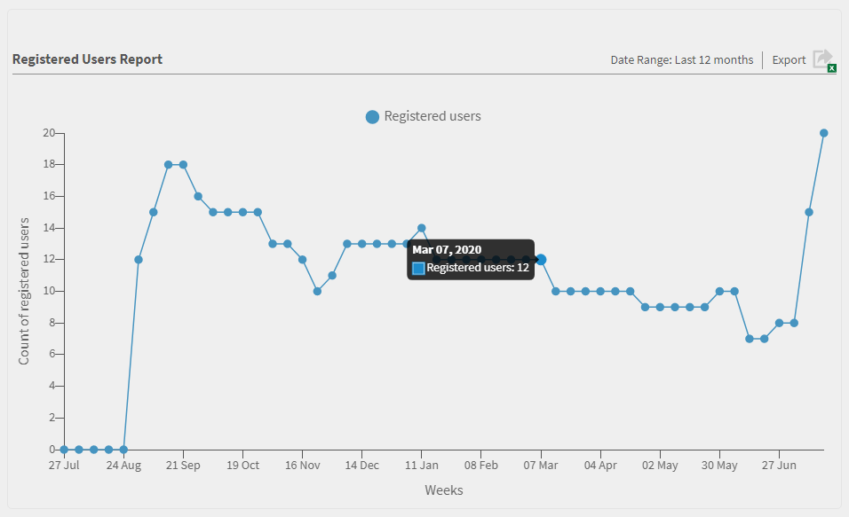
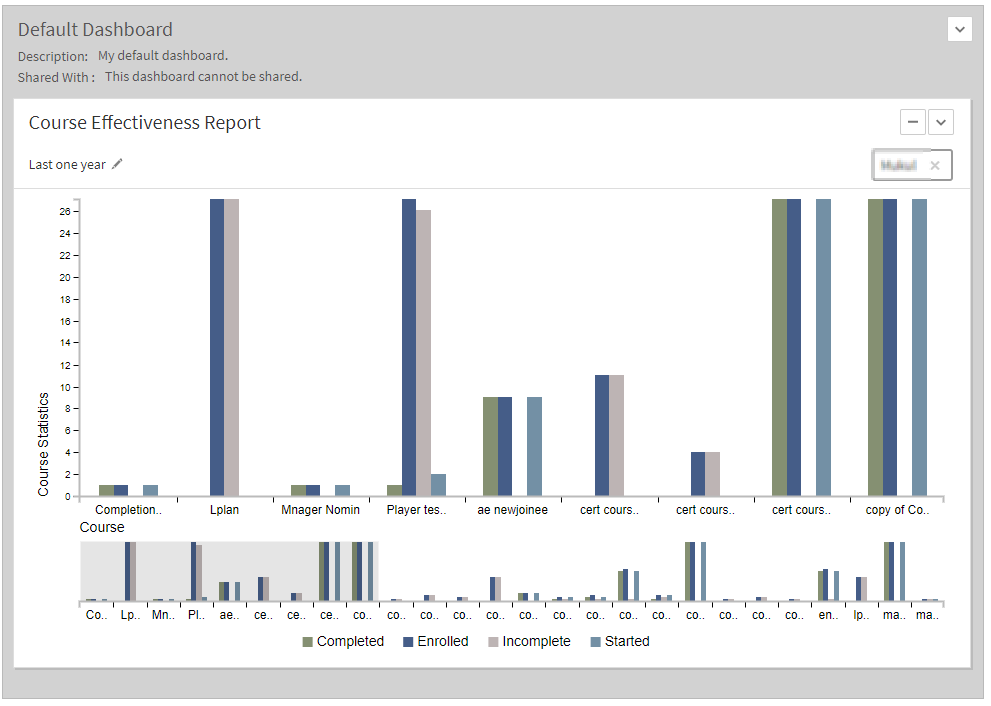
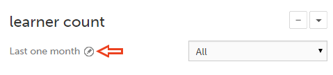

# Rapporti

Informazioni sui report associati al ruolo di amministratore nell’applicazione Learning Manager.

Adobe Learning Manager consente di creare vari report per tracciare, monitorare e controllare le attività degli allievi. Le attività degli allievi vengono tracciate e acquisite automaticamente nel database. I report Manager e Amministratore sono generati dal database.

## Panoramica {#overview}

Il processo di generazione dei report è simile sia per gli Amministratori che per i Manager. I Manager possono visualizzare i report corrispondenti ai loro subordinati mentre l’Amministratore può visualizzare tutti i report a livello di organizzazione.

I report sono aggregati in un dashboard. Un report deve esistere all’interno di un dashboard. Un **[!UICONTROL dashboard predefinito]** esiste per impostazione predefinita nella pagina dei report. Qualsiasi report aggiunto viene spostato nel dashboard predefinito. Per aggiungere report ai singoli dashboard, utilizza la freccia a discesa e scegli **[!UICONTROL Aggiungi report]**. Per ulteriori informazioni sulla creazione dei dashboard, fai riferimento alla sezione Dashboard in questa pagina.

## Tipi di report {#typesofreports}

Adobe Learning Manager supporta quattro tipi principali di report come completamento, tempo impiegato, abilità ed efficacia. È possibile utilizzare i seguenti tipi di report per generare report di oltre 300 varianti:

* Statistiche di consegna del corso per allievi
* Efficacia del report sui corsi
* Report basato sulle abilità dell’Allievo
* Statistiche di iscrizione al programma di apprendimento per allievi
* Tempo di apprendimento impiegato dagli allievi
* Numero di allievi
* Completamento certificazione

## Dashboard di attività degli utenti {#useractivitydashboards}

È possibile visualizzare un riepilogo di tutte le attività degli utenti sulla piattaforma nel corso del tempo. Configura i gruppi di utenti e applica i filtri.

Il dashboard di attività degli utenti mostra l’attività degli utenti nell’account. I tre report elencati sono:

* **Utenti registrati:** Questo report fornisce informazioni sul numero di utenti registrati nel tuo account settimana dopo settimana. Per gli account con licenze per unità attive mensili, il report mostra le unità MAU.

* **Report visite degli utenti:** Questo report fornisce informazioni sul numero di utenti che accedono alla piattaforma quotidianamente. È disponibile anche un report mensile.

* **Report sul tempo impiegato per l&#39;apprendimento:** Questo report fornisce informazioni sul tempo impiegato per l&#39;apprendimento nella piattaforma quotidianamente. È disponibile anche un report mensile.

### Utenti registrati {#registeredusers}

Learning Manager prende nota del numero di utenti registrati nel sistema ogni settimana. Gli amministratori possono visualizzare questo report per vedere il totale di utenti registrati in un dato giorno della settimana. Un totale registrato che è stato archiviato per una settimana non subirà modifiche. Pertanto, il totale registrato storico non corrisponde all’attuale numero di allievi nel sistema.

Questo report fornisce informazioni sul numero di utenti registrati nell’account settimana dopo settimana.

Per gli account con licenze per unità attive mensili, il report mostra le unità MAU.

*Report degli utenti registrati*

***Per gli account di unità ad accesso mensile:***

**Report degli utenti attivi mensili**

Questo report mostra il numero di allievi attivi nella piattaforma di apprendimento ogni mese. L’utente è considerato attivo per il mese se esegue una delle azioni di apprendimento qui menzionate. Le unità attive mensili vengono conteggiate nello stesso modo.

Una volta calcolato e archiviato per un mese, il numero di allievi attivi mensile non subirà modifiche. Pertanto, il totale storico visualizzato non corrisponde all’attuale numero di allievi nel sistema.

### Visite degli utenti {#uservisits}

Questo report mostra il totale degli allievi che accedono al sistema in un periodo di un giorno o di un mese. L’esplorazione della piattaforma di apprendimento senza l’utilizzo di alcun oggetto di apprendimento è considerata come un “accesso” alla piattaforma. Ciò aiuta l’amministratore a comprendere il numero totale di utenti che accedono al sistema. Il primo di ogni mese, Learning Manager crea un record del numero totale di utenti che hanno effettuato l’accesso alla piattaforma nel mese precedente. Inoltre, acquisisce le informazioni sul gruppo di utenti per questi utenti.

Vengono registrati solo i gruppi di utenti configurati dall’Amministratore. Ciò consente agli amministratori di applicare un filtro sui gruppi di utenti anche per i dati storici mensili. Tieni presente che, nel caso in cui la configurazione dei gruppi di utenti venga modificata e Learning Manager non abbia registrato i dati di tali gruppi nei mesi precedenti, questi dati non saranno visualizzabili.

Questo report contiene gli utenti che accedono alla piattaforma in qualsiasi modo, ad esempio dal Web, tramite app mobili, soluzioni personalizzate headless e così via. Il grafico sull’utilizzo di app mobili menziona specificamente solo gli utenti che accedono alla piattaforma utilizzando l’app per dispositivi mobili di Learning Manager. Questo consente agli amministratori di identificare l’utilizzo dell’app per dispositivi mobili nel proprio account.

*Report Visita utente*

### Report del tempo impiegato per l’apprendimento {#learningtimespentreport}

Qui puoi vedere un grafico a linee con doppio asse che mostra il tempo totale impiegato per l’apprendimento di tutti gli allievi in un periodo di 12 mesi. Il secondo asse rappresenta il tempo medio impiegato nell’apprendimento per un singolo individuo.

Il tempo impiegato per i diversi oggetti di apprendimento, ad esempio programmi di apprendimento e certificazioni, viene calcolato per i seguenti elementi:

* Corsi autonomi con contenuti statici e interattivi
* Corsi di attività con URL.
* Sessioni del fine settimana con il relativo contrassegno attivato.
* Sessione di connessione VC in cui la partecipazione è contrassegnata automaticamente.
* Tempo impiegato per i diversi oggetti di apprendimento, ad esempio programmi di apprendimento e certificazioni
* Istruzioni xAPI per un corso di attività xAPI.

È possibile anche esportare il grafico come foglio di calcolo Excel.

Un filtro per scegliere la configurazione del gruppo di utenti viene fornito per consentire di visualizzare i dati in relazione ai diversi gruppi di utenti.

Il filtro per data e gruppo di utenti selezionato viene applicato a tutti i grafici pertinenti nella dashboard.

>[!NOTE]
>
>Per i report **[!UICONTROL Visite degli utenti]** e **[!UICONTROL Tempo impiegato per l’apprendimento]**, i dati predefiniti visualizzati (quando non è configurato alcun gruppo di utenti) sono riferiti all’intero account.

## Dashboard dei contenuti di formazione {#trainingcontentdashboard}

Il dashboard dei contenuti di formazione offre informazioni dettagliate sui corsi disponibili sulla piattaforma. È possibile visualizzare i corsi di formazione più popolari o tenere traccia di tutti quelli disponibili.

### Report dei corsi di formazione {#trainingsreport}

Questo report fornisce informazioni sul totale dei corsi di formazione disponibili sulla piattaforma (pubblicati) mese dopo mese. Indica il numero di corsi di formazione offerti nel tempo.

*Report dei corsi di formazione*

### Report dei corsi di formazione attivi {#activetrainingsreport}

Questo report fornisce informazioni sui corsi di formazione attivi nell’intervallo di tempo selezionato. I corsi di formazione attivi sono quelli a cui ci si è iscritti, che sono stati visualizzati nel lettore o che sono stati completati nel periodo di tempo specificato.

Per i corsi di formazione attivi, i dati di tutti i gruppi interni dell’utente ROOT (con il ruolo di Manager) saranno disponibili per la selezione quando non viene effettuata alcuna configurazione del gruppo di utenti. Oltre ai gruppi dell’utente ROOT, se necessario, è possibile configurare altri 10 gruppi di utenti.

*Report dei corsi di formazione attivi*

>[!NOTE]
>
>I dati non vengono visualizzati come previsto quando sono selezionati i filtri **[!UICONTROL Tutti gli utenti]** e **[!UICONTROL 12 mesi]**, ma i dati vengono visualizzati quando si seleziona **[!UICONTROL Tutto il gruppo di utenti interno].**

<table>
 <tbody>
  <tr>
   <td>
    
<b>Riferimento</b>
</td>
   <td>
    
<b>Metrica</b>
</td>
   <td>
    
<b>Descrizione</b>
</td>
  </tr>
  <tr>
   <td>
    
1
</td>
   <td>
    
Rapporto iniziale (%)
</td>
   <td>
    
Rapporto tra il numero di allievi che hanno iniziato il corso e il numero di iscrizioni.
</td>
  </tr>
  <tr>
   <td>
    
2
</td>
   <td>
    
Rapporto di completamento (%)
</td>
   <td>
    
Rapporto tra gli utenti totali che hanno completato il corso e gli utenti totali che lo hanno iniziato. 
</td>
  </tr>
  <tr>
   <td>
    
3
</td>
   <td>
    
Feedback degli allievi
</td>
   <td>
    
Media di tutte le risposte di feedback L1 ricevute su una scala da 1 a 10 arrotondate al numero intero più vicino. 
</td>
  </tr>
  <tr>
   <td>
    
4
</td>
   <td>
    
Feedback dei manager
</td>
   <td>
    
Media di tutte le risposte di feedback L3 ricevute su una scala da 1 a 5 arrotondate al numero intero più vicino 
</td>
  </tr>
 </tbody>
</table>

Il report sulla formazione ha due colonne aggiuntive:

1. Valutazione media a stelle di un corso.
1. Numero di Allievi che hanno valutato il corso.
1. Percorso incorporato
1. ID percorso incorporato
1. ID corso incorporato

>[!NOTE]
>
>I filtri applicati non influiscono sul rapporto iniziale, sul rapporto di completamento, sul feedback degli allievi e sul feedback dei manager. I filtri influiscono solo su iscrizioni, visualizzazioni e completamenti.

>[!NOTE]
>
>Per entrambi i report (Contenuti di formazione e Attività degli utenti), è possibile configurare un massimo di 10 gruppi di utenti. L’elaborazione può richiedere fino a 24 ore per essere completata e per rendere disponibili i nuovi filtri configurati.

## Dashboard di riepilogo dell’apprendimento {#dashboards}

### Genera report dashboard

>[!INFO]
>
>In questo corso verrà illustrato come generare report del dashboard dal database.    

Se non è possibile avviare il corso di formazione, scrivere a <almacademy@adobe.com>.

Visualizza un report di riepilogo di tutte le attività di apprendimento nella piattaforma. In questa pagina sono disponibili le seguenti informazioni di riepilogo per il team dell’utente ROOT selezionato e i profili esterni. È inoltre possibile selezionare un intervallo di tempo:

* Riepilogo dell’apprendimento sotto forma di Iscrizioni, Visualizzazioni e Completamenti
* Abilità principali
* Riepilogo conformità

*Grafici di riepilogo*

Se sono presenti manager di livello principale interni, questi verranno visualizzati uno dopo l&#39;altro.

Tutti i profili esterni verranno elencati dopo i profili interni (utenti di livello ROOT interni).

Se un profilo esterno dispone di un manager, la gerarchia dei manager verrà visualizzata nell&#39;elenco a discesa **[!UICONTROL Visualizzazione dati per]**. L’utente verrà elencato nella gerarchia dei manager nella pagina di tutti i dettagli (Riepilogo dell’apprendimento, conformità e stato delle abilità)

In caso contrario, nell’elenco verranno visualizzati tutti i dettagli dei singoli utenti.

Per visualizzare dettagli più specifici sulle iscrizioni dei vari team interni, fai clic su **[!UICONTROL Dettagli di riepilogo dell’apprendimento]**.

*Dettagli del riepilogo dell’apprendimento*

Quando fai clic su un’iscrizione, puoi visualizzare gli Allievi per ogni Manager e gli oggetti di apprendimento ai quali sono iscritti. Puoi anche visualizzare i dettagli di avanzamento e completamento di ogni allievo.

*Allievi assegnati a un manager*

Fai clic su un qualsiasi team ed esporta il relativo report come file CSV. Un amministratore può esportare il report per qualsiasi gruppo di utenti o singolo utente selezionando il gruppo di utenti o il singolo utente, quindi esportando i dettagli dall&#39;elenco a discesa **[!UICONTROL Azione]**.

Inoltre, è possibile visualizzare un grafico a barre delle abilità in corso e acquisite. Puoi aggiungere/rimuovere le abilità che desideri includere nel grafico.

*Grafico a barre sovrapposte dello stato delle abilità*

### Dashboard di conformità

**Adobe Learning Manager** offre un dashboard di conformità a tutti gli amministratori e i manager. Gli Amministratori possono creare un dashboard di conformità e condividerlo con i Manager. I manager potranno visualizzare il nuovo dashboard condiviso sulla loro app e possono facilmente monitorare la conformità dei membri del team per un determinato corso di formazione. Il dashboard Conformità consente agli amministratori di classificare i corsi di conformità personalizzati in categorie specifiche (ad esempio, Vendite, Marketing e Legale). Le categorie di conformità personalizzate sono basate su **[!UICONTROL Etichette catalogo]**.

_Visualizzazione dashboard di conformità-Amministratore_

Gli amministratori possono anche controllare lo stato di conformità per il team di ogni manager selezionando **[!UICONTROL Vai al dashboard di conformità]**. Gli Amministratori possono condividere una serie di corsi di formazione con i Manager individualmente o con un gruppo. Ciò consente ai manager di monitorare facilmente la conformità dei propri colleghi di team per il corso di formazione specificato.

#### Flusso di lavoro amministratore

##### Creare etichette di conformità personalizzate

Un’etichetta di conformità è un tipo di etichetta del catalogo che classifica corsi/percorsi di apprendimento/certificazioni come tipo di conformità.
Per creare un&#39;etichetta di conformità personalizzata, attieniti alla seguente procedura:

1. Nell&#39;app Amministratore, accedi a **[!UICONTROL Impostazioni]** > **[!UICONTROL Generali]**.
1. Selezionare l&#39;opzione **[!UICONTROL Tipo di conformità personalizzato]** per abilitare l&#39;etichetta di conformità personalizzata.

   
   _Abilita conformità personalizzata_

   >[!NOTE]
   >
   >Questa nuova etichetta di catalogo è stata introdotta per classificare i corsi, i percorsi di apprendimento e le certificazioni come un tipo di conformità. Per abilitare l&#39;opzione **[!UICONTROL Tipo di conformità personalizzato]**, è necessario innanzitutto abilitare l&#39;opzione **[!UICONTROL Mostra etichetta del catalogo]** nella stessa pagina.

1. Passa a **[!UICONTROL Impostazioni]** > **[!UICONTROL Etichetta catalogo]** e seleziona il **[!UICONTROL Tipo di conformità]**.
1. Digitare i valori (ad esempio Legale, Vendite) nella casella di testo **[!UICONTROL Valore]** e selezionare **[!UICONTROL Aggiungi valore]**.

   
   _Aggiungere valori per la conformità personalizzata_

1. Seleziona **[!UICONTROL Salva]**.

>[!NOTE]
>
>L’Autore deve aggiungere queste etichette di conformità durante la creazione/modifica dei corsi nella propria app. Consulta [Aggiungere etichette di conformità a un corso/percorso di apprendimento/certificazione](/help/migrated/authors/feature-summary/courses.md#add-compliance-labels-to-courselearning-pathcertification).

##### Creazione e condivisione di un dashboard di conformità

Per creare e condividere un dashboard di conformità, segui questi passaggi:

1. Passa a **[!UICONTROL Report]** > **[!UICONTROL Riepilogo apprendimento]**.
1. Nella sezione **[!UICONTROL Dashboard di conformità]**, seleziona **[!UICONTROL Condiviso con i Manager]**.
1. Selezionare **[!UICONTROL Condividi dashboard]** e selezionare le etichette create dal menu a discesa **[!UICONTROL Seleziona etichetta di conformità]**.

   
   _Selezionare il tipo di conformità_

1. Digitare e selezionare il nome del manager nella casella di testo **[!UICONTROL Condividi con]**.
1. Seleziona **[!UICONTROL Condividi]** per inviare il dashboard al manager selezionato.

>[!NOTE]
>
>La condivisione del nuovo dashboard sovrascriverà il dashboard esistente nell’app del Manager selezionato. I Manager potranno visualizzare il dashboard appena condiviso dagli Amministratori.

<!--In the final visualization, you can check the compliance status of learners, and take appropriate action.

Also, an Admin can view individual training data in the **[!UICONTROL Compliance Dashboard]**.

For instance, the Administrator has identified three trainings to track compliance. Learning Manager provides the compliance snapshot for all three trainings at once.

Now an Admin can click on any training and quickly view the compliance for the selected training.

*View Compliance dashboard*

You can also see the compliance status for each internal team.

Click the link **[!UICONTROL Compliance Status Details]** on the bottom of the visualization. 

You can see that, for a team, the number of learners in the team are violating or honoring the learning compliance.

*Compliance status of a team*

### Share training with managers

Learning Manager offers compliance dashboard to all Administrators and Managers. Managers find it very useful to track compliance of their team members for a particular training. At the same time, Administrators would like all Managers to add compliance trainings to their dashboard and track it. 

In Learning Manager, the **[!UICONTROL Share with Managers]** workflow allows Administrators to share training with Managers, so that they can get added to a manager's Compliance Dashboard. Thus, Managers do not need to take any action and can start tracking compliance immediately. 

An Administrator can share a set of training courses with managers individually or with a group. This sharing can help a manager easily track the compliance of his/her team for the specified training.

The Administrator can "push" a default list of compliance training to be viewed in the manager's compliance dashboard.

### Share training

1. In **[!UICONTROL Reports]** > **[!UICONTROL Learning Summary]**, scroll down, and click the tab **[!UICONTROL Share with Managers]**. 

   
   *Share training with managers*

1. To add training or multiple training, click **[!UICONTROL Share more]**.   

1. In the **[!UICONTROL Share with Managers]** dialog, choose the training(s) and the manager(s).

   
   *Select training to share with managers*

1. Click **[!UICONTROL Share]**.

The training is now shared with the specified manager.

### View training

In the list of shared training, click **[!UICONTROL View]**. You can view the training that is assigned to a manager or some managers.

### Withdraw training

1. To withdraw training from a manager, click **[!UICONTROL Withdraw]**.  

1. Click **[!UICONTROL Proceed]**. This withdraws previously shared training from the Manager's compliance dashboard.-->

## Report personalizzati

Gli amministratori possono generare report specifici utilizzando il modello personalizzato disponibile nella sezione **[!UICONTROL Report]**.

### Report di esempio {#samplereports}

La scheda **[!UICONTROL Report di esempio]** consente di visualizzare alcuni report indicativi basati su punti di dati di esempio. Esplora questi report per avere un’idea dei diversi tipi di report ricchi di funzionalità che puoi generare utilizzando i dati del tuo account.

### Report dashboard {#dashboardreports}

Un dashboard è una raccolta di report. I report possono essere raggruppati in una dashboard a tua scelta. Per visualizzare tutte le bacheche che hai creato, fai clic sulla scheda della bacheca. Nell&#39;elenco a discesa **[!UICONTROL Visualizza dashboard]** è possibile selezionare la bacheca predefinita o un dashboard creato dall&#39;utente.

### Report Excel {#excelreports}

La scheda **[!UICONTROL Report Excel]** consente di esportare i report in formato file XLS.

Di seguito sono riportati i tipi di report disponibili per il download.

* Report corso
* Trascrizioni allievi
* Report annunci
* Report risorse formative
* Prova di verifica del contenuto
* Prova di verifica dell’utente
* Report di accesso
* Trascrizioni gamification
* Prova di verifica della gamification

### Trascrizioni Allievi {#learnertranscripts}

Le trascrizioni degli allievi nei report Excel mostrano le colonne Crediti richiesti e Crediti guadagnati in numeri decimali.

### Report corso {#coursereports}

Come Amministratore, puoi scaricare i report per i corsi. Procedi come segue:

1. Apri **[!UICONTROL Report]** > **[!UICONTROL Report personalizzati]** > **[!UICONTROL Report Excel]** > **[!UICONTROL Report corso]**.
1. Viene visualizzata la finestra di dialogo **[!UICONTROL Report corso]**. Seleziona il corso di cui desideri recuperare il report e fai clic su **[!UICONTROL Mostra]**.

   
   *Report corso*

1. Verrai reindirizzato alla pagina del corso. Puoi esportare il punteggio del quiz per utente e per domanda in base a ciascuna iscrizione scegliendo il tipo di iscrizione specifico.
1. Seleziona **[!UICONTROL Esporta punteggio quiz]** per esportare il report. Viene visualizzata la finestra di dialogo **[!UICONTROL Generazione della richiesta di report]**. Fai clic su **[!UICONTROL OK]** per confermare.

   
   *Generazione della richiesta di report*

   >[!NOTE]
   >
   >Il report relativo al punteggio del quiz esportato conterrà i dettagli del punteggio per ciascun tentativo se l’opzione tentativi multipli è configurata per il modulo.

### Trascrizioni allievi {#LearnerTranscripts-1}

Adobe Learning Manager consente agli Amministratori di un’organizzazione di generare le trascrizioni associate agli Allievi. Il report Trascrizione Allievo contiene quanto segue:

1. Trascrizione Allievo: dashboard attività di apprendimento
1. Abilità: dashboard delle abilità
1. Dashboard di conformità

Le trascrizioni degli allievi nei report Excel mostrano le colonne Crediti richiesti e Crediti guadagnati in numeri decimali.

Per informazioni sulla generazione di report Trascrizione Allievo e per ulteriori informazioni, consulta [Trascrizioni Allievi](learner-transcripts.md).

### Report annunci {#announcementsreports}

In qualità di Amministratore, puoi generare un report di tutti gli annunci che invii. Il report contiene dettagli riguardanti:

* Tipo di annuncio
* Nome dell’annuncio
* Data dell’annuncio
* Stato dell’annuncio
* Nome Allievo

Per scaricare un report, segui uno di questi passaggi:

1. Apri **[!UICONTROL Report]** > **[!UICONTROL Report personalizzati]** > **[!UICONTROL Report Excel]** > **[!UICONTROL Report annunci]**. Viene visualizzata la finestra di dialogo **[!UICONTROL Generazione della richiesta di report]**. Fai clic su Ok.
1. [!UICONTROL **Annunci**] > [!UICONTROL **Azioni**] > [!UICONTROL **Esporta report**].

   
   *Report annunci*

1. È possibile estrarre un report per un annuncio specifico facendo clic su **[!UICONTROL Esporta report]** sotto l&#39;icona delle impostazioni.

   
   *Report per annunci specifici*

### Report risorse formative {#jobaidsreport}

Le risorse formative sono contenuti di formazione a cui un Allievo ha accesso senza bisogno di iscriversi a uno specifico oggetto di apprendimento come Corso o Programma di apprendimento. Gli Amministratori possono estrarre e scaricare il Report risorse formative.

Il report estratto include informazioni su quanto segue:

* Nome
* Tipo di risorsa formativa
* Stato della risorsa formativa (pubblicata o ritirata)
* Data di iscrizione
* Data di completamento
* Data di download
* Nome Allievo
* Nome del manager
* Creato da

Per scaricare un report, esegui una delle seguenti operazioni:

* Apri **[!UICONTROL Report]** > **[!UICONTROL Report personalizzati]** > **[!UICONTROL Report Excel]** > **[!UICONTROL Report risorse formative]**. Viene visualizzata la finestra di dialogo **[!UICONTROL Generazione della richiesta di report]**. Fai clic su **[!UICONTROL Ok]**.
* Apri **[!UICONTROL Risorsa formativa]** > **[!UICONTROL Azioni]** > **[!UICONTROL Esporta report]**.

*Report risorse formative*

* È anche possibile estrarre un report per una risorsa formativa specifica facendo clic su **[!UICONTROL Esporta report]** sotto l’icona delle impostazioni.

*Report per risorsa formativa specifica*

### Report risorse formative

Dopo aver selezionato **[!UICONTROL Report risorse formative]** nell&#39;elenco, verranno visualizzate due opzioni:

*Download del report di iscrizione degli utenti delle risorse formative*

**Tutte le risorse formative**: se il numero di risorse formative nell&#39;account è inferiore a 10 milioni, il report generato conterrà le informazioni di iscrizione di tutte le risorse formative. Questa sarà la selezione predefinita. Se il numero di righe supera i 10 milioni, verrà visualizzato un errore ed è necessario selezionare manualmente le risorse formative richieste.

**Risorse formative selezionate**: se selezioni questa opzione, puoi immettere le risorse formative per le quali generare il report. Puoi selezionare un massimo di 10 risorse formative. Adobe Learning Manager verifica se il numero di risorse formative supera i 10 milioni.

*Selezionare una risorsa formativa*

**Report risorse formative**

Se selezioni questa opzione, vengono scaricati i dettagli di tutte le risorse formative presenti nel sistema insieme ai relativi metadati e corsi di formazione.

Il report scaricato comprende i seguenti campi:

* Nome risorsa formativa
* Lingue
* ID
* Tipo
* Durata (minuti)
* Stato
* Data di pubblicazione (fuso orario UTC)
* Creato tramite nome
* Creato tramite e-mail
* Creato tramite ID univoco utente
* Cataloghi
* Percorsi di apprendimento
* Corsi
* Tag
* Abilità

**Report di iscrizione utente risorse formative**

Il report di iscrizione contiene dettagli sull’iscrizione degli utenti e altre informazioni.

Il report scaricato comprende i seguenti campi:

* Nome risorsa formativa
* Tipo
* Stato
* Data di iscrizione (fuso orario UTC)
* Data completamento (fuso orario UTC)
* Data di download (fuso orario UTC)
* Nome Allievo
* E-mail
* ID univoco utente
* Nome del manager
* E-mail del manager
* ID utente univoco manager
* Assegnato per nome
* Assegnato per e-mail
* Assegnato per ID utente univoco
* Creato tramite nome
* Creato tramite e-mail
* Creato tramite ID utente univoco
* Codice lavoro
* Nuovo campo
* Profilo

### Report di prova di verifica del contenuto {#contentaudittrailreports}

Utilizza il generatore di report **[!UICONTROL Prova di verifica del contenuto]** per generare un report di tutte le modifiche apportate a un corso per tutta la durata della sua vita nel sistema. Il report generato presenta le seguenti informazioni recuperate.

* ID oggetto
* Nome oggetto
* Tipo di oggetto
* Tipo di modifica
* Descrizione
* ID oggetto di riferimento
* Nome oggetto di riferimento
* Modificato dal nome utente
* Modificato dall’ID utente
* Data modifica (fuso orario UTC)

Nella colonna **Tipo di modifica** verranno visualizzati i dettagli seguenti:

| Tipo di modifica | Descrizione |
| --- | --- |
| Crea | Corso creato |
| Aggiunta certificazione | Certificazione aggiunta al catalogo |
| Rimozione certificazione | Certificazione rimossa dal catalogo |
| Aggiunta contenuto | Contenuto aggiunto al modulo |
| Aggiunta corso | Corso aggiunto al percorso di apprendimento |
| Rimozione corso | Corso rimosso dal percorso di apprendimento |
| Aggiungi etichetta personalizzata | Etichetta personalizzata aggiunta al catalogo |
| Rimozione etichetta personalizzata | Etichetta personalizzata rimossa dal catalogo |
| Elimina | Catalogo eliminato |
| Aggiungi risorsa formativa | Risorsa formativa aggiunta al catalogo |
| Rimozione risorsa formativa | Risorsa formativa rimossa dal catalogo |
| Aggiunta percorso di apprendimento | Percorso di apprendimento aggiunto al catalogo |
| Rimozione percorso di apprendimento | Percorso di apprendimento rimosso dal catalogo |
| Aggiunta contenuto modulo | Modulo aggiunto al corso (sezione Content) |
| Rimozione contenuto modulo | Modulo rimosso dal corso (sezione Content) |
| Pubblicato | Corso o percorso di apprendimento pubblicato e aggiunto al catalogo predefinito |
| Ripubblicato | Corso ripubblicato |
| Aggiunta risorsa | Risorsa aggiunta al corso |
| Rimozione risorsa | Risorsa rimossa dal corso |
| Ritirato | Corso ritirato |
| Aggiunta catalogo condiviso | Catalogo condiviso nel catalogo |
| Rimozione catalogo condiviso | Condivisione del catalogo rimossa dal catalogo |
| Aggiornamento del catalogo condiviso | Stato condivisione catalogo: attivo |
| Aggiornamento | Corso o percorso di apprendimento aggiornato |
| Aggiungi gruppo di utenti | Gruppo di utenti aggiunto al catalogo |
| Rimuovi gruppo di utenti | Gruppo di utenti rimosso dal catalogo |

Le informazioni relative ai metadati non vengono recuperate nel report generato.

Per generare un report di prova di verifica del corso, attieniti alla seguente procedura.

1. Seleziona **[!UICONTROL Report]** > **[!UICONTROL Report Excel]** > **[!UICONTROL Audit trail corso]**. Viene visualizzata la finestra di dialogo **[!UICONTROL Prova di verifica del contenuto]**.

   
   *Prova di verifica del corso*

1. Seleziona il corso, il programma di apprendimento e la certificazione di cui desideri scaricare il report. Se non specificato, tutti i report vengono scaricati per impostazione predefinita.
1. Seleziona un intervallo di date per il report e fai clic su **[!UICONTROL Genera]**.
1. Il report viene generato e ti viene inviata una notifica per informarti che il report di verifica del contenuto è pronto. È possibile scaricare il report.

### Report di prova di verifica dell’utente {#useraudittrailreports}

La prova di verifica dell’utente acquisisce il ciclo di vita di utenti, gruppi di utenti e profili di registrazione autonoma. L’aggiunta, l’eliminazione e la modifica dell’utente in Manager vengono acquisite. La creazione e l’eliminazione dei profili di registrazione autonoma vengono registrate. È inoltre possibile sospendere e riavviare la registrazione automatica.

Sono inoltre disponibili le opzioni Aggiungi, Modifica, Disabilita, Sospendi e Riprendi per i profili esterni e Aggiungi, Elimina, Sospendi e Riprendi per la registrazione automatica. Vengono acquisiti anche i caricamenti di file CSV.

1. Seleziona **[!UICONTROL Report > Report Excel > Verifica utente]**. Viene visualizzata la finestra di dialogo Prova di verifica dell’utente.
1. Viene visualizzata la finestra di dialogo Prova di verifica dell’utente. Seleziona l’intervallo di date nel menu a comparsa. Puoi scegliere di generare report per l’ultima settimana o l’ultimo mese oppure selezionare una data personalizzata.

   
   *Prova di verifica dell&#39;utente*

1. Fai clic su **[!UICONTROL Genera]** per generare il report.

Nella finestra di dialogo **[!UICONTROL Report di prova di verifica dell’utente]** sono presenti due filtri.

**Filtro di intervallo di date:** Scegliere l&#39;intervallo di date per il quale si desidera generare il report. Sono disponibili tre opzioni:

* Ultima settimana
* Ultimo mese
* Data personalizzata

Seleziona il filtro Allievi: cerca un utente o un gruppo di utenti.

Il report esportato conterrà i dati degli utenti che soddisfano entrambi i criteri di ricerca specificati.

*Prova di verifica dell’utente*

>[!NOTE]
>
>Quando un’abilità viene assegnata o rimossa, tale abilità assegnata o rimossa può essere monitorata nel Report di audit utente.

### Report di configurazione estensioni

Questo report fornisce informazioni sui dettagli di configurazione di tutte le estensioni native aggiunte, incluso lo stato di attivazione. Scopri come scaricare il report dell&#39;estensione, consulta [Scarica report estensione](native-extensibility.md#download-extension-report).

### Report di attività xAPI

Questi report forniscono i dati di tutte le istruzioni xAPI registrate e generate durante i moduli di attività xAPI.

Per scaricare questo report, effettua le seguenti operazioni:

1. Seleziona **[!UICONTROL Report > Report Excel > Report di attività xAPI]**. Viene visualizzata la finestra di dialogo Report di attività xAPI.
1. Seleziona l’intervallo di date nel menu a comparsa. Puoi scegliere di generare report per l’ultima settimana o l’ultimo mese oppure selezionare una data personalizzata.
1. Seleziona Allievi e attività dal menu a discesa.
1. Seleziona **[!UICONTROL Genera]** per generare il report.

### Report gamification {#gamification}

Gli Amministratori possono scaricare la trascrizione di gamification in formato CSV. Puoi scaricare il report per singoli utenti o gruppi di utenti. Nel report vengono recuperati nome utente, e-mail utente, UUID dell’utente, punti utente totali ottenuti, suddivisione dei punti raccolti, nome dei gruppi in cui l’utente gioca, nome del manager e valori dei campi attivi. Gli Amministratori possono utilizzare questo report per valutare e comprendere i punteggi dell’utente a livello di organizzazione o per un gruppo specifico.

1. Seleziona Report > Report Excel > Report gamification.

   
   *Report gamification*

1. Viene visualizzata la finestra di dialogo Trascrizioni gamification. Seleziona gli allievi utilizzando nome, profilo, gruppi di utenti, ID e-mail o UUID.

   
   *Finestra di dialogo Trascrizioni gamification*

1. Fai clic su **[!UICONTROL Genera]** per generare il report.

   Dopo aver generato il report di un Allievo, è necessario essere in grado di esportare le informazioni correnti e del livello raggiunto per tutti gli utenti (interni, esterni o eliminati) dell’account. Puoi anche controllare le date dei livelli raggiunti da un Allievo:

   * Data acquisizione Bronzo
   * Data acquisizione Argento
   * Data acquisizione Oro
   * Data acquisizione Platino

   Queste colonne contengono le date in cui il livello è stato raggiunto la prima volta. La colonna **[!UICONTROL Livello corrente]** visualizza il livello corrente dell’Allievo.

   Quando l’Amministratore ripristina la gamification, tutti i punti dell’Allievo vengono ripristinati di conseguenza.

### Report di prova di verifica della gamification {#gamification-audit-trail}

Questo report contiene la cronologia e i motivi dei punti di gamification degli Allievi guadagnati per ogni regola.

### Scarica il report

1. Seleziona l’URL dell’audit trail di gamification.
1. Nella finestra a comparsa **Prova di verifica della gamification**, seleziona l’intervallo di date.
1. Seleziona **Genera**.

Il report viene scaricato come file CSV. Il file contiene le seguenti colonne:

* Nome
* Email/UUID
* Stato
* Azione
* Punti,
* Punti di saldo
* Regola/Attività
* Sottoattività regola/attività,
* Dettagli regola/attività
* Tipo,
* Nome,
* Nome istanza Data acquisizione (fuso orario UTC)
* Ora inizio regola/attività
* Ora di fine regola/attività

### Report di iscrizione e annullamento dell’iscrizione {#enrollmentandunenrollmentreport}

Amministratori e Manager possono estrarre un report degli Allievi iscritti e con iscrizione annullata. Come Amministratore, puoi visualizzare tutti gli allievi, gli Amministratori e i Manager registrati o con iscrizione annullata a un’istanza di un corso, un programma di apprendimento o una certificazione ed esportare il report. In qualità di Manager, invece, puoi recuperare solo un report dei membri del team. Come Manager, non puoi visualizzare gli Allievi eliminati o il tuo nome nell’applicazione per Manager come Allievo iscritto o con iscrizione annullata.

Per scaricare un report, attieniti alla seguente procedura: apri **[!UICONTROL Corso/Programma di apprendimento/Certificazione]** > **[!UICONTROL Allievi]** > **[!UICONTROL Azione]** > **[!UICONTROL Esporta report]**.

*Report di annullamento dell&#39;iscrizione*

### Report Feedback {#feedback-report}

Come amministratore, ora puoi recuperare sia i feedback degli allievi (L1) che i feedback dei manager (L3) per i corsi di formazione selezionati per un periodo specificato.

Puoi esportare i dati dall’interfaccia utente o tramite il connettore PowerBI per un’analisi più approfondita.

I report dei feedback L1 e L3 consentono di scaricare un report di feedback consolidato per le risposte L1 e L3 dei corsi di formazione selezionati per un periodo di **un anno** o fino a 10 corsi di formazione selezionati per un qualsiasi intervallo di date.

Accedi come Amministratore, fai clic su **[!UICONTROL Report]** > **[!UICONTROL Report personalizzati]**, quindi fai clic su **[!UICONTROL Report di feedback]** nell’elenco dei report.

*Scarica report feedback*

Facendo clic su Scarica dopo aver selezionato i filtri, riceverai una notifica per scaricare il report in formato CSV.

Il report scaricato conterrà dettagli quali il nome e il tipo del corso di formazione, il nome dell’istanza, il nome dell’Allievo e l’indirizzo e-mail, il tipo di feedback (L1 o L3) e le date del feedback inviato per i nuovi dati.

Per i dati esistenti prima dell’implementazione di questa funzione, verrà visualizzata la data di completamento LO, la domanda del feedback L1, il testo effettivo autonomo e il testo della classe in colonne diverse, le rispettive risposte del feedback L1, il nome e l’e-mail del manager, il valore del feedback L3 e la data di invio e i campi attivi.

Puoi anche esportare i dati dall’interfaccia utente o in Power BI, che supporta tutti i corsi di formazione per qualsiasi intervallo di date per un’analisi più approfondita.

### Report dei corsi di formazione {#training-report}

Learning Manager supporta il report del corso di formazione, che consente agli Amministratori di scaricare i dettagli del corso di formazione e i metadati associati, come ad esempio autore, data di pubblicazione, abilità, etichette per cataloghi e così via.

Nell’app di amministrazione, fai clic su **[!UICONTROL Report]** > **[!UICONTROL Report personalizzati]** > **[!UICONTROL Report Excel]** > **[!UICONTROL Report dei corsi di formazione]**.

Puoi scaricare i report per:

* Corsi di formazione selezionati (massimo 10): seleziona uno o più corsi di formazione (fino a un massimo di 10) da qualsiasi catalogo
* Corsi di formazione all’interno dei cataloghi selezionati (massimo 5) (sarà possibile selezionare fino a cinque cataloghi)
* Tutti i corsi di formazione (tutti i corsi di formazione nell’account)

*Scarica report del corso di formazione*

Nella sezione Opzioni avanzate sono disponibili le seguenti opzioni:

* Includi mappature corso con programma di apprendimento/certificazione
* Includi informazioni livello modulo

Dopo aver selezionato i filtri e fatto clic su Scarica, riceverai una notifica per scaricare il report in formato CSV.

Il report conterrà i seguenti campi:

*Nome catalogo, Tipo di corso di formazione, ID del corso di formazione, ID univoco del corso di formazione, Nome del corso di formazione, Corsi di formazione secondari, Moduli, Durata del corso di formazione o del modulo, Formato, Stato del corso di formazione, Abilità, Autore, Data ultima pubblicazione, Data ultimo completamento, Conteggio iscrizioni istruttori, Conteggio avviati, Conteggio completati, Punteggio medio L1, Punteggio medio L2, Punteggio medio L3, Risposte L1 ricevute, Risposte L2 ricevute, Risposte L3 ricevute, Etichette catalogo e tag.*

*Opzioni aggiuntive*

### Report di riepilogo della sessione {#session-summary-report}

Il Report di riepilogo della sessione contiene tutte le sessioni pianificate per un Allievo entro una data specificata.

Ciò consente all’Amministratore di esportare tutti i dettagli della sessione aula e virtuale che rientrano nell’intervallo di date specificato. L’Amministratore può anche esportare il report della sessione in relazione a corsi di formazione o Istruttori specifici.

Ciò aiuterà anche l’Amministratore a comprendere le sessioni pianificate su base mensile e a identificare la pianificazione degli istruttori e le sessioni già tenute.

In qualità di Amministratore, fai clic su **[!UICONTROL Report personalizzati]** > **[!UICONTROL Report di riepilogo della sessione]**.

Nella finestra di dialogo seguente, scegli l’intervallo di date, il corso di formazione e l’istruttore per un riepilogo.

*Report di riepilogo della sessione*

Il csv scaricato contiene i seguenti campi:

* Data e ora di inizio
* Data e ora di fine

* Nome del modulo
* Durata della sessione (in minuti)
* Posti in totale
* Posizione
* Nome istanza
* Nome del corso
* ID corso
* Nome dell’istruttore
* E-mail dell’Istruttore
* Conteggio delle iscrizioni
* Tipo di sessione
* Limite per la lista d’attesa
* Totale in lista d’attesa
* E-mail degli utenti in lista d’attesa
* Informazioni sulla posizione
* Regione della posizione

### Report utilizzo Istruttore

Questo report registra il tempo (in minuti) trascorso quotidianamente da un Istruttore che tiene le sessioni assegnate. Il report può essere scaricato per un periodo di tre mesi dalla data di inizio selezionata.

Per scaricare il report, fai clic su **[!UICONTROL Report]** > **[!UICONTROL Report personalizzati]** > **[!UICONTROL Report utilizzo istruttore]**.

Seleziona uno o più Istruttori e l’intervallo di date.

*Scarica report utilizzo istruttore*

Il report scaricato contiene i seguenti campi:

* Nome Istruttore
* ID Istruttore
* Livello di abilità
* Date come colonne. Se l’Istruttore viene utilizzato in una data, viene elencato il numero di sessioni. Se in un giorno l’Istruttore non viene utilizzato, il valore viene visualizzato come zero.

Il report contiene i record relativi a tre mesi a partire dal mese selezionato.

Per recuperare i record di tutti gli istruttori, lasciare vuoto il campo Istruttore.

Inoltre, un amministratore personalizzato con l’autorizzazione per generare report può recuperare questo report.

### Report di audit trail dell’utente

Questo report acquisisce informazioni sugli Allievi che hanno cambiato istanza, &quot;da istanza&quot; a &quot;a istanza&quot;, cambiato per ora, data, ecc.

Seleziona gli Allievi o un gruppo di utenti.

Per scaricare il report, fai clic su **[!UICONTROL Report]** > **[!UICONTROL Report personalizzati]** > **[!UICONTROL Report di prova di verifica dell’utente]**.

*Scarica report audit trail utente*

### Report piano di apprendimento

Questo report contiene i dettagli di tutti i piani di apprendimento in un account, ad esempio i gruppi di utenti correlati, lo stato e le informazioni sull’attivazione.

Il report contiene:

* Nome del piano di apprendimento
* Tipo (si verifica quando)
* Formazione (completata)
* Abilità (ottenuta)
* Data (in data)
* Azione
* Stato, creato da
* Data di creazione
* Data ultima modifica
* Gruppo utenti (applicabile a)
* Gruppo utenti (aggiungi a)
* Iscriviti in seguito
* Tipi di elementi di apprendimento
* Elementi di apprendimento
* Istanze degli elementi di apprendimento
* Elemento di apprendimento
* Data di completamento
* Promemoria elemento di apprendimento
* Ambito catalogo
* Ambito gruppo di utenti

## Iscrizione e-mail {#emailsubscriptions}

Puoi ottenere i tuoi report preferiti tramite e-mail iscrivendoti.

### Configurazione degli abbonamenti e-mail

>[!INFO]
>
>In questo corso di formazione verrà illustrato come impostare gli abbonamenti e-mail per i report del dashboard.    

Se non è possibile avviare il corso di formazione, scrivere a <almacademy@adobe.com>.

Nella pagina **[!UICONTROL Report]**, fai clic sulla scheda **[!UICONTROL Abbonamento]**. Viene visualizzata la pagina di iscrizione ai report.

Per selezionare il nome del report dall’elenco a discesa, inizia a digitare il nome del report nel campo Report. Scegli la frequenza dell’e-mail dal menu a discesa. È possibile aggiungere l’oggetto dell’e-mail e fornire un ID e-mail alternativo.

È possibile modificare ed eliminare le iscrizioni.

## Report cronologici

I report cronologici in Adobe Learning Manager (ALM) si riferiscono ai report che acquisiscono i dati cronologici e le attività all’interno della piattaforma di apprendimento. Questi report forniscono informazioni dettagliate sulle attività precedenti degli Allievi, sui contenuti della formazione, sulle prestazioni del gruppo di utenti e su altri dati pertinenti. I report storici consentono agli Amministratori di monitorare, monitorare e analizzare nel tempo i progressi e l’efficacia delle iniziative di apprendimento.

### Report di accesso al corso

I report di accesso al corso forniscono informazioni sulla ripetizione della visita di ciascun corso.

Per scaricare questo report, effettua le seguenti operazioni:

1. Passa a **[!UICONTROL Report]** > **[!UICONTROL Report personalizzati]** > **[!UICONTROL Report cronologici]**.
1. Seleziona **[!UICONTROL Report di accesso al corso]**. Viene visualizzata la finestra di dialogo Generazione della richiesta di report.
1. Seleziona l’anno e il trimestre dal menu a discesa.
1. Seleziona **[!UICONTROL Genera]**.

### Report di accesso

I report di accesso forniscono informazioni sugli accessi e sull&#39;accesso degli utenti. È possibile generare un report contenente tre mesi di dati alla volta.

Per scaricare questo report, effettua le seguenti operazioni:

1. Passa a **[!UICONTROL Report]** > **[!UICONTROL Report personalizzati]** > **[!UICONTROL Report cronologici]**.
1. Seleziona **[!UICONTROL Report di accesso]**. Viene visualizzata la finestra di dialogo Generazione della richiesta di report.
1. Seleziona l’anno e il trimestre dal menu a discesa.
1. Seleziona **[!UICONTROL Genera]**.

## Creazione di un dashboard {#createadashboard}

1. Per iniziare a creare le tue bacheche, fai clic su Aggiungi dashboard sul lato destro della pagina.

   
   *Aggiungi dashboard*

1. Fornisci nome e descrizione del dashboard.
1. Se desideri condividere il dashboard con un Manager, selezionalo nel campo **[!UICONTROL Condividi con]**. Puoi usare qualsiasi criterio di selezione normale per questa operazione.
1. Fai clic su **[!UICONTROL Salva].**

Puoi visualizzare la bacheca creata di recente nella scheda **[!UICONTROL Report dashboard]**.

Per aggiungere report alla bacheca, fai clic sul menu a discesa nell’angolo superiore destro della finestra delle bacheche e fai clic su **[!UICONTROL Aggiungi report]**. Il report creato in questo modo è associato al dashboard.

>[!NOTE]
>
>I report creati facendo clic su Aggiungi nell’angolo superiore destro della pagina Report vengono aggiunti al dashboard predefinito.

## Dashboard condivisi {#shareddashboards}

Le bacheche condivise sono una raccolta di report condivisi con te da altri utenti all’interno della tua organizzazione. Tutti i report aggiunti a una bacheca condivisa vengono condivisi automaticamente con altri utenti che hanno accesso a tale bacheca.

Puoi condividere la bacheca nei due modi seguenti:

* Inserendo nel campo **[!UICONTROL Condividi con]** gli utenti con cui il dashboard è condiviso.
* Selezionando Modifica bacheca nell’elenco a discesa e inserendo i dettagli utente per la condivisione del dashboard.

>[!NOTE]
>
>I Manager possono visualizzare i report dei membri del proprio team solo da un dashboard condiviso.

## Download {#downloads}

Il foglio di report del dashboard esportato fornisce informazioni dettagliate anziché il riepilogo del report. Il report scaricato si attiene al formato di una trascrizione Allievo.

## Crea report {#report}

1. Fai clic su Report nel riquadro a sinistra. Viene visualizzata la pagina di riepilogo del report.

   >[!NOTE]
   >
   >Per impostazione predefinita, almeno tre report di esempio vengono visualizzati nella scheda delle bacheche di esempio. Puoi visualizzare i report di esempio solo per avere un’idea di come è possibile crearli e personalizzarli.

1. Nell’angolo superiore destro della pagina, fai clic su **[!UICONTROL Aggiungi]**.
1. Nella finestra di dialogo **[!UICONTROL Aggiungi report]**, nell’elenco a discesa Tipo, è possibile scegliere uno dei report predefiniti oppure selezionare **[!UICONTROL Personalizzato]**. Se selezioni un report predefinito, vedrai un modulo precompilato. È inoltre possibile apportare modifiche ad alcuni dei campi e fare clic su **[!UICONTROL Salva]**. Il report viene aggiunto alla dashboard predefinita.

   
   *Crea report*

   In **[!UICONTROL Tipo di report]**, puoi scegliere un set predefinito di report o valori personalizzati. Puoi visualizzare i seguenti report nell’ambito di un set predefinito di report:

   * Abilità assegnate e acquisite
   * Corso registrato e completato
   * Efficacia dei corsi
   * Programmi di apprendimento registrati e completati
   * Tempo di apprendimento impiegato per il corso
   * Tempo di apprendimento impiegato per il trimestre
   * Completamento certificazione

1. Scegli **[!UICONTROL l’asse Y]** per il report dalle opzioni a discesa. Per alcuni dei criteri selezionati, è possibile scegliere uno o più stati dalle opzioni di stato. Ad esempio, per un criterio principale per le statistiche di iscrizione al corso, gli stati possono essere completati, incompleti e registrati. I dati dell’intervallo principale sono rappresentati sotto forma di grafici a barre nel report.

   
   *Assi per i report*

1. Scegli l’intervallo/il criterio **[!UICONTROL asse Y]** secondario per il report dalle opzioni a discesa. Ad esempio, per un’opzione di iscrizione al programma di apprendimento, scegli uno o più stati dal menu a discesa Stati. I dati dell’intervallo secondario sono rappresentati sotto forma di grafici a linea.
1. Scegli i criteri dell’asse X**** appropriati per il report dalle opzioni a discesa. Se l’asse X viene scelto come data, è disponibile un’opzione per raggruppare i criteri dell’asse X per giorno, mese, trimestre e anno.
1. Nella sezione Intervallo di tempo, scegli l’opzione appropriata dal menu a discesa. Le opzioni disponibili sono:

   * Ultimo mese
   * Trimestre
   * Anno
   * Dall’inizio del trimestre a oggi (ultimi 90 giorni)
   * Dall’inizio dell’anno a oggi (ultimi 365 giorni)
   * Intervallo di date. Fornisci valori nei campi data **[!UICONTROL Da]** e **[!UICONTROL A]**.

   

1. **Sezione Filtri**

   I filtri vengono visualizzati nella finestra di dialogo Aggiungi report nella parte inferiore in base ai tipi di report scelti. Alcuni dei principali filtri sono indicati di seguito.

   * **Manager:** puoi scegliere uno qualsiasi dei Manager in base alla gerarchia. Per alcuni Manager, possono essere presenti Manager secondari e più dipendenti che fanno riferimento a ciascun Manager secondario.
   * **Profilo:** scegli il titolo del dipendente. Potrebbe essere utile nella visualizzazione dei report dei dipendenti in base a profilo/titolo. Ad esempio, informatico, ingegnere.
   * **Gruppo utenti:** scegli il gruppo di utenti in base al quale filtrare i report. Learning Manager recupera i gruppi di utenti definiti per il tuo account dalla funzione Utenti.
   * **Contenuto:** puoi filtrare il report in base a qualsiasi corso scegliendolo dal menu a discesa.

   Espandi questa sezione e scegli i filtri richiesti.

   
   *Scegliere i filtri*

1. Fai clic su **[!UICONTROL Salva]** per completare la creazione di un report.

   
   *Report di esempio*

## Modifica report {#editareport}

Nel report, fai clic sulla freccia a discesa e seleziona l’opzione **[!UICONTROL Modifica report]**.

*Modifica di un report*

Apporta le modifiche necessarie al report. Per salvare le modifiche, fai clic su **[!UICONTROL Salva]**.

## Sposta un report in una dashboard {#moveareporttoadashboard}

Scegli questa opzione per spostare il report corrente in una dashboard esistente. Per spostare il report, fai clic sull’opzione **[!UICONTROL Sposta in dashboard]**.

*Spostare un report in un dashboard*

Scegli la dashboard in cui vuoi spostare il report e fai clic su **[!UICONTROL Sposta]**.

## Crea una copia del report {#createacopyofareport}

Per creare una copia del report, selezionare l&#39;opzione **[!UICONTROL Crea una copia]**.

*Creare una copia di un report*

Scegli la dashboard in cui desideri copiare il report. Per iniziare a copiare, fai clic su **[!UICONTROL Copia]**.

## Elimina report {#deleteareport}

Per eliminare un report, seleziona l’opzione **[!UICONTROL Elimina report]**. Dopo aver eliminato il report, non è possibile ripristinarlo. Il processo è irreversibile. Procedi con attenzione quando elimini un report.

*Eliminare un report*

## Scarica report {#downloadareport}

Per scaricare il report, seleziona l’opzione **[!UICONTROL Scarica report]**.

*Scarica un report*

## Ridimensiona report {#resizeareport}

Puoi ridimensionare i report nei formati 1×1 (medio) e 1×2 (grande). Questa opzione ti permette di ottenere una migliore visualizzazione dei tuoi report. Inoltre, puoi facilmente eseguire la panoramica e lo zoom dei report.

## Filtri {#filters}

I filtri vengono visualizzati nella finestra di dialogo **[!UICONTROL Aggiungi]** report nella parte inferiore in base ai tipi di report scelti. Alcuni dei principali filtri sono indicati di seguito.

**Manager** puoi scegliere uno qualsiasi dei manager in base alla gerarchia. Per alcuni Manager, possono essere presenti Manager secondari e più dipendenti che fanno riferimento a ciascun Manager secondario.

**Profilo** scegli il titolo del dipendente. Potrebbe essere utile nella visualizzazione dei report dei dipendenti in base a profilo/titolo. Ad esempio, informatico, ingegnere.

**Gruppo utenti** scegli il gruppo utenti in base al quale filtrare i report. Learning Manager recupera i gruppi di utenti definiti per il tuo account dalla funzione Utenti.

**Corso** puoi filtrare il report in base a qualsiasi corso scegliendolo dal menu a discesa.

*Filtrare un report*

Sopra la legenda per il grafico, puoi visualizzare una casella di zoom. Sposta il cursore su di essa, fai clic e trascina la barra trasversale su qualsiasi parte dell’area del grafico della casella di zoom da ingrandire.

Puoi visualizzare i valori dell’asse Y secondario sotto forma di una linea attraverso le barre del grafico. Ad esempio, nell’esempio sopra, puoi visualizzare i valori dell’efficacia nella linea grigia attraverso il grafico.

## Report gruppo utenti {#user-group-reporting}

Tieni traccia di come i gruppi di utenti come reparti, partner esterni e ruoli si comportano rispetto ad altri gruppi di utenti o rispetto ad altri obiettivi di apprendimento.

### Gruppi utente {#usergroups}

Per generare report basati su gruppi di utenti, seleziona **[!UICONTROL Gruppo utenti]** nell’asse X dall’elenco di opzioni a discesa, come mostrato nella schermata seguente.

*Report gruppo utenti*

Per scegliere un gruppo di utenti, digita il nome del gruppo. I gruppi suggeriti vengono visualizzati in base alla stringa immessa. Quando viene visualizzato un elenco di gruppi, seleziona il gruppo utenti richiesto.

Puoi anche scegliere più gruppi di utenti con l’aiuto della ricerca con completamento automatico.

Dopo aver salvato e generato questo report, se hai selezionato più gruppi di utenti, il report viene generato con tutti i gruppi di utenti rappresentati in un grafico a barre l’uno accanto all’altro nell’asse X.

Questo report sui gruppi di utenti consente di confrontare le prestazioni di un reparto/divisione/ruolo con l’altro per valutare i risultati dell’apprendimento.

### Gruppi di utenti personalizzati/attributi utente {#customusergroupsuserattributes}

Inoltre, puoi creare gruppi di utenti personalizzati mediante la funzione Aggiungi utenti/gruppi utenti in Learning Manager. Dopo aver creato i gruppi di utenti è possibile generare report per tali gruppi di utenti personalizzati con l’aiuto di un elenco di attributi come posizione, ramo.

Nell&#39;asse X, scegliere l&#39;opzione dell&#39;attributo utente e selezionare l&#39;attributo dall&#39;elenco a discesa **seleziona** accanto ad esso. Per creare un report gruppo di utenti personalizzato in base a questi attributi, è inoltre necessario scegliere il gruppo di utenti appropriato nel filtro.

## Visualizzazione dei report {#viewingreports}

Nella pagina Report, puoi visualizzare tutti i report. Puoi ridurre ogni report facendo clic sull’icona meno (-) nell’angolo superiore destro di ogni report. Fai clic sull’icona (+) per visualizzare nuovamente il report.

## Visualizzazione rapida con date diverse {#quickviewwithdifferentdates}

Puoi modificare il valore o l’intervallo di data per ogni report e visualizzare rapidamente una data diversa senza modificare e salvare il report. Fai clic sull’icona di modifica (come mostrato con una freccia nell’istantanea seguente) accanto all’intervallo di date dell’ultimo anno, ad esempio QTD. Scegli il nuovo valore dal menu a comparsa e fai clic sul segno di spunta per confermare la modifica. Puoi annullare la modifica facendo clic sul segno X.

>[!NOTE]
>
>I valori di data utilizzati per visualizzare il report sono temporanei. Questa visualizzazione del report non viene scaricata quando scegli l’opzione di download. Si tratta di una visualizzazione solo temporanea.

*Visualizza il conteggio degli Allievi*

## Visualizzazione rapida con diversi Manager {#quickviewwithdifferentmanagers}

Se più Manager ti inviano report, puoi visualizzare rapidamente i report per ogni Manager. Per visualizzare un report univoco per ogni Manager, scegli il nome del Manager dall’elenco a discesa.

>[!NOTE]
>
>I valori Manager utilizzati per visualizzare il report sono temporanei. Questa visualizzazione del report non viene scaricata quando scegli l’opzione di download. Si tratta di una visualizzazione solo temporanea.

## Visualizza report corso {#viewcoursereports}

### Genera report corso

>[!INFO]
>
>In questo corso imparerai come esportare i report del corso e configurare gli abbonamenti e-mail per tali report.    

Se non è possibile avviare il corso di formazione, scrivere a <almacademy@adobe.com>.

Per visualizzare i report specifici per ciascun corso, procedi come indicato di seguito:

1. Fai clic sul collegamento **[!UICONTROL Visualizza report corso]** nella scheda I miei dashboard nella pagina Report.\
   Viene visualizzata una finestra a comparsa. Viene visualizzato un campo di immissione testo in cui è possibile immettere il corso richiesto e i nomi dei corsi suggeriti vengono visualizzati nell’elenco a discesa. Scegli il corso dall’elenco visualizzato.

   

   *Visualizza report corso*

1. Seleziona il corso desiderato dall’elenco a discesa e fai clic su Mostra.
1. Verrai reindirizzato alla pagina dei risultati del punteggio del quiz relativo al corso selezionato, in cui potrai visualizzare il report specifico per quel corso.

**Modifica/Sposta nella bacheca/Crea una copia/Elimina/Ridimensiona il report**

Fai clic sulla freccia a discesa nell’angolo superiore destro di ogni report per visualizzare le opzioni a discesa, come Modifica/Sposta nel dashboard/Crea una copia/Elimina/Ridimensiona.

*Modifica/Sposta nella bacheca/Crea una copia/Elimina/Ridimensiona i report*

**[!UICONTROL Modifica]** Per tornare ai valori iniziali durante la modifica dei dati, fare clic su Ripristina. Fai clic su Salva dopo aver modificato i valori.

**[!UICONTROL Sposta nel dashboard]** Puoi spostare il report corrente in un altro dashboard, scelto nell&#39;elenco dei dashboard.

**[!UICONTROL Crea una copia]** Puoi copiare il report sullo stesso dashboard o su uno diverso, scelto nell&#39;elenco dei dashboard.

**[!UICONTROL Elimina]** Fare clic su Elimina per rimuovere il report. Viene visualizzato un messaggio di conferma/avviso prima di poter eliminare il report.

**[!UICONTROL Ridimensiona]** puoi ridimensionare i report nei formati 1×1 (medio) e 2×2 (grande).

## Generazione e visualizzazione di report per un account condiviso tra pari {#generateandviewreportsforpeeraccount}

Come Amministratore, oltre a generare report per il tuo account, puoi anche generare e visualizzare report per gli account condivisi tra pari da te configurati.

Una volta creato un account condiviso tra pari insieme a un altro utente, è possibile visualizzare i report per tale account dalla pagina **[!UICONTROL Report]**. Quando si crea un report, è disponibile il campo **[!UICONTROL Seleziona account]**. Nell’elenco a discesa, nel quale sono riportati tutti gli account condivisi tra pari associati, seleziona l’account per il quale desideri visualizzare i report condivisi.

Durante la creazione di un account condiviso tra pari, se l’opzione Condividi catalogo non è stata selezionata, non è possibile visualizzare l’account condiviso tra pari in questo elenco.

*Gestione dei report per l’account condiviso tra pari*

1. Seleziona l’asse x e l’asse y e la data per questo report.
1. Il pulsante Cataloghi condivisi nel campo Filtri viene abilitato automaticamente. È obbligatorio. Se il catalogo condiviso non è abilitato, non è possibile generare o visualizzare report per l’account condiviso tra pari.
1. Nell’elenco a discesa sotto Catalogo condiviso, seleziona il catalogo condiviso per cui desideri visualizzare il report.
1. Fai clic su [!UICONTROL **Salva**].

   
   *Seleziona catalogo condiviso per account condiviso tra pari*

1. Dopo aver fatto clic su **[!UICONTROL Salva]**, puoi visualizzare la rappresentazione grafica dei report nel dashboard predefinito. In questo dashboard, è possibile filtrare ulteriormente il report del Manager per lo specifico account condiviso tra pari.
1. In caso di modifiche al catalogo da parte tua, tali modifiche vengono immediatamente riflesse nei report e nel dashboard generati dall’utente di pari livello. Tuttavia, quando l’utente di pari livello modifica il catalogo, le modifiche non vengono visualizzate automaticamente nel dashboard.
1. Se desideri che il dashboard si aggiorni automaticamente, l’utente di pari livello deve inviarti una nuova richiesta tra pari.

   >[!NOTE]
   >
   >I Manager non possono visualizzare i report dei pari.

## Domande frequenti {#frequentlyaskedquestions}

+++Come condividere una dashboard personalizzata con un Manager?

Quando crei una dashboard, inserisci il nome e la descrizione. Per condividerla con i Manager, immetti il nome del Manager nel campo **[!UICONTROL Condividi con]**.

*Condividere un dashboard*
+++
